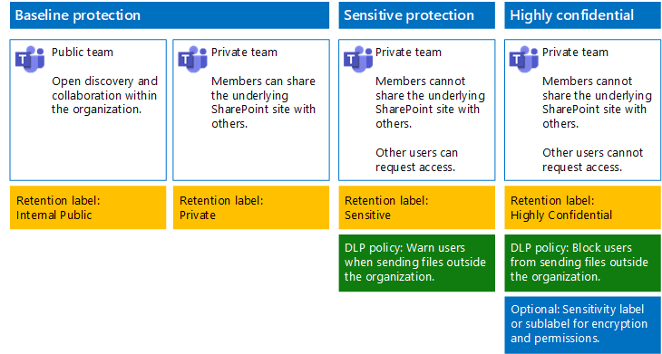

# Skydda filer i Microsoft Teams

I den här artikeln får du rekommendationer för att konfigurera team i Microsoft Teams och underliggande SharePoint-webbplatser för filskydd som balanserar säkerhet med smidigt samarbete. I den här artikeln definieras fyra olika konfigurationer, och först ut är en offentlig webbplats i din organisation med de delningsprinciper som är mest öppna. Varje ytterligare konfiguration representerar en meningsfull upptrappning av skyddet, men möjligheten att komma åt och samarbeta i filer som lagrats i Teams begränsas till den relevanta uppsättningen av teammedlemmar. Använd de här rekommendationerna som utgångs punkt och justera konfigurationerna efter behoven i din organisation.

Konfigurationerna i den här artikeln överensstämmer med Microsofts rekommendationer för tre skyddsnivåer för data, identiteter och enheter:

- Grundskydd

- Känsligt skydd

- Strikt konfidentiellt skydd

Mer information om nivåerna och de funktioner som rekommenderas för varje nivå finns i följande resurser.

- [Identitets- och enhetsskydd för Office 365](https://docs.microsoft.com/office365/enterprise/microsoft-cloud-it-architecture-resources#identity-and-device-protection-for-office-365)

- [Lösningar för filskydd i Office 365](https://docs.microsoft.com/office365/enterprise/microsoft-cloud-it-architecture-resources#file-protection-solutions-in-office-365)

## Översikt över funktioner

Rekommendationer för säkra team använder en rad olika Microsoft 365-funktioner. Följande illustration visar de rekommenderade konfigurationerna.

Som framgår av följande:

- Grundskydd omfattar ett offentligt team och ett privat team. Offentliga team kan upptäckas och användas av alla i organisationen. Privata team kan bara identifieras och användas av medlemmar i teamet. Båda dessa konfigurationer gör det möjligt att dela den underliggande SharePoint-webbplatsen där filer lagras utanför teamgruppen.

- Grupper för känsligt och mycket konfidentiellt skydd är privata grupper där delning och förfrågningar för åtkomst för den underliggande webbplatsen begränsas.

- [Kvarhållningsetiketter](../../compliance/labels.md) ger ett sätt att klassificera filer inom de underliggande SharePoint-webbplatserna. Alla underliggande SharePoint-webbplatser är konfigurerade för att automatiskt etikettera filer i dokumentbibliotek med en standardetikett för bevarande. Etiketterna i det här exemplet motsvarar de fyra gruppkonfigurationerna och är Intern offentlig, Privat, Känslig och Strikt konfidentiell. Användare kan ändra etiketterna för enskilda filer, men den här konfigurationen ser till att alla filer får en standardetikett.

- Principer för [dataförlustskydd](../../compliance/data-loss-prevention-policies.md) (DLP) är konfigurerade för kvarhållningsetiketterna Känslig och Strikt konfidentiell för att antingen varna eller förhindra användare när de försöker skicka sådana typer av filer utanför organisationen.

- Om det behövs kan du använda [känslighetsetiketter](../../compliance/sensitivity-labels.md) för att skydda mycket konfidentiella filer med kryptering och behörigheter. För Azure Information Protection-kunder kan du använda märkning för Azure Information Protection i Microsoft 365 Efterlevnadscenter, och om du väljer att utföra ytterligare eller avancerad konfiguration synkroniseras dina etiketter med Azure-portalen. Azure Information Protection-etiketter och känslighetsetiketter är helt kompatibla med varandra. Det innebär att om du till exempel har innehåll som tilldelats av Azure Information Protection, behöver du inte ändra klassificering eller etikett för innehållet. Alla kunder behöver inte den här skyddsnivån.

## Inställningar för hela organisationen för SharePoint och OneDrive

SharePoint och OneDrive innehåller företagsomfattande inställningar som påverkar alla webbplatser och användare. Vissa av de här inställningarna kan också justeras på webbplatsnivå, så att de blir mer begränsande (men inte mindre). I det här avsnittet beskrivs inställningar för hela klientorganisationer som påverkar säkerhet och samarbete.

### Delning

För den här lösningen rekommenderar vi följande inställningar för hela organisationen:

- Behåll standardprincipen för delning som tillåter all delning med alla kontotyper, t. ex. anonym delning.

- Om du vill kan du ange att anonyma länkar ska upphöra att gälla.

- Ändra standardlänktypen för delning till Intern. Det bidrar till att förhindra oavsiktligt dataläckage utanför din organisation.

Det kanske inte känns intuitivt att tillåta extern delning, men den här metoden ger mer kontroll över fildelningen jämfört med att skicka filer via e-post. SharePoint och Outlook samverkar för att ge säkert samarbete kring filer.

- Som standard delar Outlook en länk till en fil i stället för att skicka filen via e-post.

- Med SharePoint och OneDrive blir det enkelt att dela länkar till filer med medarbetare som finns både inom och utanför organisationen

Det finns även kontroller som hjälper dig att styra extern delning. Du kan till exempel:

- Inaktivera en anonym gästlänk.

- Återkalla användares åtkomst till en webbplats.

- Visa vilka personer som har åtkomst till en viss webbplats eller ett visst dokument.

- Ange att länkar för anonym delning ska upphöra (klientorganisationsinställning).

- Begränsa vilka som får dela utanför organisationen (klientorganisationsinställning).

### Använda extern delning tillsammans med skydd mot dataförlust (DLP)

Om du inte tillåter extern delning kommer användare med affärsbehov att hitta alternativa verktyg och metoder. Microsoft rekommenderar att du kombinerar extern delning med DLP-principer för att skydda känsliga och mycket konfidentiella filer.

### Inställningar för enhetsåtkomst

Med inställningar för enhetsåtkomst för SharePoint och OneDrive kan du avgöra om åtkomsten ska begränsas till endast webbläsare (filer kan inte laddas ned) eller om åtkomst ska blockeras. Mer information finns i [Styra åtkomsten från ohanterade enheter](https://docs.microsoft.com/sharepoint/control-access-from-unmanaged-devices).

Information om hur du använder inställningar för enhetsåtkomst med rekommenderade principer för villkorlig åtkomst i Azure Active Directory finns [Principrekommendationer för att skydda SharePoint-webbplatser och filer](https://docs.microsoft.com/microsoft-365/enterprise/sharepoint-file-access-policies).

Gå till de här inställningarna och välj om du vill ändra standardinställningarna för OneDrive-webbplatser. För närvarande kopieras inställningarna för delning och enhetsåtkomst från administrationscentret för SharePoint och tillämpas på båda miljöerna.

## Konfigurationen av grupper och SharePoint-webbplatser

I tabellen nedan sammanfattas konfigurationen för varje grupp och gruppens underliggande SharePoint-webbplats som beskrivs tidigare i den här artikeln. Använd de här konfigurationerna som utgångspunkt och justera webbplatstyperna och konfigurationerna efter behoven i din organisation. Alla organisationer behöver inte alla typer av grupper. Bara ett litet antal organisationer kräver grupper med strikt konfidentiellt skydd.

||||||
|:-----|:-----|:-----|:-----|:-----|
||**Grundskydd #1**|**Grundskydd nr 2**|**Känsligt skydd**|**Strikt konfidentiellt**|
|Beskrivning|Offentligt team med öppen identifiering och samarbete inom organisationen.|Privat grupp där delning av den underliggande SharePoint-webbplatsen tillåts utanför gruppen.|Privat grupp, men delning av den underliggande SharePoint-webbplatsen tillåts endast för webbplatsens medlemmar. DLP varnar användare vid försök att skicka filer utanför organisationen.|Privat grupp med känslighetsetiketter för filkryptering och behörigheter som följer med filen. DLP hindrar användarna från att skicka filer utanför organisationen.|
|Privat eller offentlig gruppwebbplats|Offentlig|Privat|Privat|Privat|
|Vem har åtkomst?|Alla i organisationen, t. ex. B2B-användare.|Endast webbplatsens medlemmar. Andra kan begära åtkomst.|Endast gruppens medlemmar. Andra kan begära åtkomst till den underliggande webbplatsen, som har godkänts av en gruppägare.|Endast medlemmar. Andra kan inte begära åtkomst till den underliggande webbplatsen.|
|Delningskontroller på webbplatsnivå|Delning med alla tillåts. Standardinställningar.|Delning med alla tillåts. Standardinställningar.|Medlemmar kan inte dela åtkomst till webbplatsen.   Icke-medlemmar kan begära åtkomst till webbplatsen, men dessa förfrågningar måste behandlas av en gruppägare.|Medlemmar kan inte dela åtkomst till webbplatsen.   Icke-medlemmar kan inte begära åtkomst till webbplatsen eller dess innehåll.|
|Kontroller för enhetsåtkomst på webbplatsnivå|Inga ytterligare kontroller.|Inga ytterligare kontroller.|Hindrar användarna från att ladda ned filer till enheter som inte är kompatibla eller icke-domänanslutna. Med det här alternativet tillåts endast webbläsaråtkomst från alla andra enheter.|Blockera nedladdning av filer till enheter som inte är kompatibla eller icke-domänanslutna.|
|Kvarhållningsetiketter|Intern offentlig|Privat|Känslig|Strikt konfidentiell|
|DLP-principer|||Varna användare när de skickar filer som är märkta som känsliga utanför organisationen.   Om du vill blockera extern delning av känsliga datatyper, t.ex. kreditkortsnummer eller andra personliga data, kan du konfigurera ytterligare DLP-principer för dessa datatyper (inklusive anpassade datatyper som du konfigurerar).|Hindra användare från att skicka filer som är märkta som mycket konfidentiella utanför organisationen. Tillåta att användare kringgår detta genom att ange en motivering, t.ex. vem de delar filen med.|
|Känslighetsetiketter||||Använd känslighetsetiketter för att kryptera och bevilja behörighet till filer. Skyddet överförs med filerna om de läcks ut från den underliggande SharePoint-webbplatsen.|

Information om hur du distribuerar fyra olika typer av grupper i den här lösningen finns i [Distribuera grupper för tre skyddsnivåer för filer](deploy-teams-three-tiers.md).

## Kvarhållningsetiketter

Att använda kvarhållningsetiketter rekommenderas för miljöer med känsliga data. När du har konfigurerat och publicerat kvarhållningsetiketter:

- Du kan använda en standardetikett för ett dokumentbibliotek på den underliggande SharePoint-webbplatsen för en grupp, så att alla dokument i avsnittet **Filer** i gruppen får standardetiketten.

- Du kan använda etiketter för innehåll automatiskt om det matchar vissa villkor.

- Du kan använda DLP-principer som baseras på kvarhållningsetiketter.

- Personer i organisationen kan använda en etikett manuellt för innehåll i Outlook på webben, Outlook 2010 och senare, OneDrive, SharePoint och Microsoft 365-grupper. Användare vet ofta bäst vilken typ av innehåll de arbetar med, så att de kan klassificera det och använda rätt DLP-princip.

Som vi illustrerat innebär lösningen att följande kvarhållningsetiketter skapas:

- Strikt konfidentiell

- Känslig

- Privat

- Intern offentlig

Dessa etiketter mappas mot de rekommenderade webbplatserna på bilderna och diagrammen tidigare i den här artikeln. Lösningen rekommenderar att DLP-principer konfigureras för att förhindra läckage av filer som är märkta som känsliga och mycket konfidentiella.

Anvisningar för konfiguration av kvarhållningsetiketter och DLP-principer i den här lösningen finns i [Skydda filer i grupper med kvarhållningsetiketter och DLP](deploy-teams-retention-DLP.md).

## Känslighetsetiketter

Om du är berättigad till ditt säkerhetsscenario kan du använda känslighetsetiketter för att tillämpa skydd som följer filerna vart de än flyttas. Känslighetsetiketter i Microsoft 365 Compliance Center och etiketter för Azure Information Protection identiska. För den här lösningen rekommenderar vi att du använder en känslighetsetikett eller en underetikett för att kryptera och bevilja behörighet till filer som måste skyddas med den högsta säkerhetsnivån.

Mer information finns i [Översikt över känslighetsetiketter](../../compliance/sensitivity-labels.md).

Information om hur du konfigurerar känslighetsetiketter i den här lösningen finns i [Skydda filer i grupper med känslighetsetiketter](deploy-teams-sensitivity-labels.md).

## Se även

[Integrering av moln- och hybridlösningar](https://docs.microsoft.com/office365/enterprise/cloud-adoption-and-hybrid-solutions)
