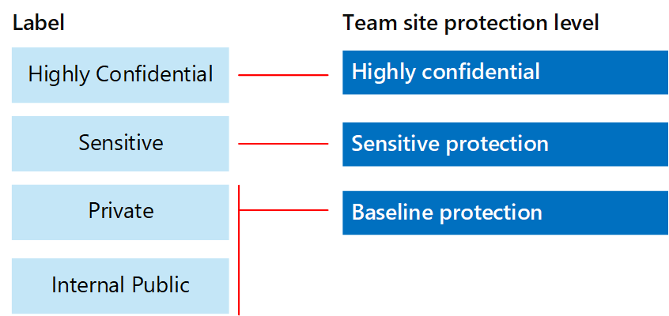

# Skydda SharePoint Online-webbplatser och filerSecure SharePoint Online sites and files

I den här artikeln får du rekommendationer för att konfigurera SharePoint-gruppwebbplatser och filskydd som balanserar säkerhet med smidigt samarbete.This article provides recommendations for configuring SharePoint Online team sites and file protection that balances security with ease of collaboration. I den här artikeln definieras fyra olika konfigurationer, och först ut är en offentlig webbplats i din organisation med de delningsprinciper som är mest öppna.This article defines four different configurations, starting with a public site within your organization with the most open sharing policies. Varje ytterligare konfiguration representerar en meningsfull upptrappning av skyddet, men möjligheten att komma åt och samarbeta med resurser är begränsad till den relevanta uppsättningen medlemmar.Each additional configuration represents a meaningful step up in protection, but the ability to access and collaborate on resources is reduced to the relevant set of users. Använd de här rekommendationerna som utgångspunkt och justera konfigurationerna efter behoven i din organisation.Use these recommendations as a starting point and adjust the configurations to meet the needs of your organization.

Konfigurationerna i den här artikeln överensstämmer med Microsofts rekommendationer för tre skyddsnivåer för data, identiteter och enheter:The configurations in this article align with Microsoft's recommendations for three tiers of protection for data, identities, and devices:

- GrundskyddBaseline protection

- Känsligt skyddSensitive protection

- Strikt konfidentiellt skyddHighly confidential protection

Mer information om nivåerna och de funktioner som rekommenderas för varje nivå finns i följande resurser.For more information about these tiers and capabilities recommended for each tier, see the following resources.

- [Identitets- och enhetsskydd för Office 365Identity and Device Protection for Office 365](https://docs.microsoft.com/office365/enterprise/microsoft-cloud-it-architecture-resources#identity-and-device-protection-for-office-365)

- [Lösningar för filskydd i Office 365File Protection Solutions in Office 365](https://docs.microsoft.com/office365/enterprise/microsoft-cloud-it-architecture-resources#file-protection-solutions-in-office-365)

## Översikt över funktionerCapability overview

Rekommendationer för SharePoint Online-gruppwebbplatser berör en rad olika Microsoft 365-funktioner.Recommendations for SharePoint Online team sites draw on a variety of Microsoft 365 capabilities. Följande illustration visar de rekommenderade konfigurationerna för fyra SharePoint Online-gruppwebbplatser.The following illustration shows the recommended configurations for four SharePoint Online team sites.

Som framgår av följande:As illustrated:

- Grundläggande skydd omfattar två alternativ för SharePoint Online-gruppwebbplatser – en offentlig webbplats och en privat webbplats.Baseline protection includes two options for SharePoint Online team sites — a public site and private site. Offentliga webbplatser kan upptäckas och användas av alla i organisationen.Public sites can be discovered and accessed by anybody in the organization. Privata webbplatser kan bara identifieras och användas av webbplatsens medlemmar.Private sites can only be discovered and accessed by members of the site. Båda dessa webbplatskonfigurationer tillåter delning utanför gruppen.Both of these site configurations allow for sharing outside the group.

- Webbplatser för känsligt och strikt konfidentiellt skydd är privata webbplatser med åtkomst begränsad endast till medlemmar i vissa grupper.Sites for sensitive and highly confidential protection are private sites with access limited only to members of specific groups.

- [Kvarhållningsetiketter](../../compliance/labels.md) ger ett sätt att klassificera filer inom webbplatserna.[Retention labels](../../compliance/labels.md) provide a way to classify files within the sites. Alla SharePoint-gruppwebbplatser är konfigurerade för att automatiskt etikettera filer i dokumentbibliotek med en standardetikett för bevarande för webbplatsen.Each of the SharePoint Online team sites are configured to automatically label files in document libraries with a default retention label for the site. Etiketterna i det här exemplet motsvarar de fyra webbplatskonfigurationerna och är Intern offentlig, Privat, Känslig och Strikt konfidentiell.Corresponding to the four site configurations, the labels in this example are Internal Public, Private, Sensitive, and Highly Confidential. Användare kan ändra etiketterna, men den här konfigurationen ser till att alla filer får en standardetikett.Users can change the labels, but this configuration ensures all files receive a default label.

- Principer för [dataförlustskydd](../../compliance/data-loss-prevention-policies.md) (DLP) är konfigurerade för kvarhållningsetiketterna Känslig och Strikt konfidentiell för att antingen varna eller förhindra användare när de försöker skicka sådana typer av filer utanför organisationen.[Data loss prevention](../../compliance/data-loss-prevention-policies.md) (DLP) policies are configured for the Sensitive and Highly Confidential retention labels to either warn or prevent users when they attempt to send these types of files outside the organization.

- Om det behövs kan du använda [känslighetsetiketter](../../compliance/sensitivity-labels.md) för att skydda mycket konfidentiella filer med kryptering och behörigheter.If needed for your scenario, you can use [sensitivity labels](../../compliance/sensitivity-labels.md) to protect highly confidential files with encryption and permissions. För Azure Information Protection-kunder kan du använda märkning för Azure Information Protection i Microsoft 365 Efterlevnadscenter, och om du väljer att utföra ytterligare eller avancerad konfiguration synkroniseras dina etiketter med Azure-portalen.For Azure Information Protection customers, you can use your Azure Information Protection labels in the Microsoft 365 compliance center, and your labels will be synced with the Azure portal in case you choose to perform additional or advanced configuration. Azure Information Protection-etiketter och känslighetsetiketter är helt kompatibla med varandra.Azure Information Protection labels and sensitivity labels are fully compatible with each other. Det innebär att om du till exempel har innehåll som tilldelats av Azure Information Protection, behöver du inte ändra klassificering eller etikett för innehållet.This means, for example, if you have content labeled by Azure Information Protection, you won't need to reclassify or relabel your content. Alla kunder behöver inte den här skyddsnivån.Not all customers need this level of protection.

## Organisationsomfattande inställningar för SharePoint Online och OneDrive för företagOrganization-wide settings for SharePoint Online and OneDrive for Business

SharePoint Online och OneDrive för företag innehåller företagsomfattande inställningar som påverkar alla webbplatser och användare.SharePoint Online and OneDrive for Business include tenant-wide settings that affect all sites and users. Vissa av de här inställningarna kan också justeras på webbplatsnivå, så att de blir mer begränsande (men inte mindre).Some of these settings can also be adjusted at the site level to be more restrictive (but not less). I det här avsnittet beskrivs inställningar för hela klientorganisationer som påverkar säkerhet och samarbete.This section discusses tenant-wide settings that affect security and collaboration.

### DelningSharing

För den här lösningen rekommenderar vi följande inställningar för hela klientorganisationen:For this solution, we recommend the following tenant-wide settings:

- Behåll standardprincipen för delning som tillåter all delning med alla kontotyper, inklusive anonym delning.Keep the default sharing policy that allows all sharing with all account types, including anonymous sharing.

- Om du vill kan du ange att anonyma länkar ska upphöra att gälla.Set anonymous links to expire, if desired.

- Ändra standardlänktypen för delning till Intern.Change the default link type for sharing to Internal. Det bidrar till att förhindra oavsiktligt dataläckage utanför din organisation.This helps prevent accidental data leakage outside your organization.

Det kanske inte känns intuitivt att tillåta extern delning, men den här metoden ger mer kontroll över fildelningen jämfört med att skicka filer via e-post.While it might seem counterintuitive to allow external sharing, this approach provides more control over file sharing compared to sending files in email. SharePoint Online och Outlook samverkar för att ge säkert samarbete kring filer.SharePoint Online and Outlook work together to provide secure collaboration on files.

- Som standard delar Outlook en länk till en fil i stället för att skicka filen via e-post.By default, Outlook shares a link to a file instead of sending the file in email.

- Med SharePoint Online och OneDrive för företag blir det enkelt att dela länkar till filer med medarbetare som finns både inom och utanför organisationenSharePoint Online and OneDrive for Business make it easy to share links to files with contributors who are both inside and outside your organization

Det finns även kontroller som hjälper dig att styra extern delning.You also have controls to help govern external sharing. Du kan till exempel:For example, you can:

- Inaktivera en anonym gästlänk.Disable an anonymous guest link.

- Återkalla användares åtkomst till en webbplats.Revoke user access to a site.

- Visa vilka personer som har åtkomst till en viss webbplats eller ett visst dokument.See who has access to a specific site or document.

- Ange att länkar för anonym delning ska upphöra (klientorganisationsinställning).Set anonymous sharing links to expire (tenant setting).

- Begränsa vilka som får dela utanför organisationen (klientorganisationsinställning).Limit who can share outside your organization (tenant setting).

### Använda extern delning tillsammans med skydd mot dataförlust (DLP)Use external sharing together with data loss prevention (DLP)

Om du inte tillåter extern delning kommer användare med affärsbehov att hitta alternativa verktyg och metoder.If you don't allow external sharing, users with a business need will find alternate tools and methods. Microsoft rekommenderar att du kombinerar extern delning med DLP-principer för att skydda känsliga och mycket konfidentiella filer.Microsoft recommends you combine external sharing with DLP policies to protect sensitive and highly confidential files.

### Inställningar för enhetsåtkomstDevice access settings

Med inställningar för enhetsåtkomst för SharePoint Online och OneDrive för företag kan du avgöra om åtkomsten ska begränsas till endast webbläsare (filer kan inte laddas ned) eller om åtkomst ska blockeras.Device access settings for SharePoint Online and OneDrive for Business let you determine whether access is limited to browser only (files can't be downloaded) or if access is blocked. Mer information finns i [Styra åtkomsten från ohanterade enheter](https://docs.microsoft.com/sharepoint/control-access-from-unmanaged-devices).For more information, see [Control access from unmanaged devices](https://docs.microsoft.com/sharepoint/control-access-from-unmanaged-devices).

Information om hur du använder inställningar för enhetsåtkomst med rekommenderade principer för villkorlig åtkomst i Azure Active Directory finns i [Principrekommendationer för att skydda SharePoint-webbplatser och filer](https://docs.microsoft.com/microsoft-365/enterprise/sharepoint-file-access-policies).To use device access settings with recommended conditional access policies in Azure Active Directory, see [Policy recommendations for securing SharePoint sites and files](https://docs.microsoft.com/microsoft-365/enterprise/sharepoint-file-access-policies).

### OneDrive för företagOneDrive for Business

Gå till de här inställningarna och välj om du vill ändra standardinställningarna för OneDrive för företag-webbplatser.Visit these settings to decide if you want to change the default settings for OneDrive for Business sites. För närvarande kopieras inställningarna för delning och enhetsåtkomst från administrationscentret för SharePoint Online och tillämpas på båda miljöerna.Currently, the sharing and device access settings are duplicated from the SharePoint Online admin center and apply to both environments.

## Konfiguration av SharePoint-gruppwebbplatserSharePoint team site configuration

I tabellen nedan sammanfattas konfigurationen för varje gruppwebbplats som beskrivs tidigare i den här artikeln.The following table summarizes the configuration for each of the team sites described earlier in this article. Använd de här konfigurationerna som utgångspunkt och justera webbplatstyperna och konfigurationerna efter behoven i din organisation.Use these configurations as starting point recommendations and adjust the site types and configurations to meet the needs of your organization. Alla organisationer behöver inte alla typer av webbplatser.Not every organization needs every type of site. Bara ett litet antal organisationer kräver strikt konfidentiellt skydd.Only a small number of organizations require highly confidential protection.

||||||
|:-----|:-----|:-----|:-----|:-----|
||**Grundskydd nr 1****Baseline protection #1**|**Grundskydd nr 2****Baseline protection #2**|**Känsligt skydd****Sensitive protection**|**Strikt konfidentiellt****Highly confidential**|
|BeskrivningDescription|Öppen identifiering och samarbete inom organisationen.Open discovery and collaboration within the organization.|Privat webbplats och grupp med delning tillåten utanför gruppen.Private site and group with sharing allowed outside the group.|Privat webbplats med delning endast tillåten för webbplatsens medlemmar.Private site with sharing allowed only to members of the site. DLP varnar användare vid försök att skicka filer utanför organisationen.DLP warns users when attempting to send files outside the organization.|Privat webbplats och filkryptering samt behörigheter med känslighetsetiketter.Private site and file encryption and permissions with sensitivity labels. DLP hindrar användarna från att skicka filer utanför organisationen.DLP prevents users from sending files outside the organization.|
|Privat eller offentlig gruppwebbplatsPrivate or public team site|OffentligPublic|PrivatPrivate|PrivatPrivate|PrivatPrivate|
|Vem har åtkomst?Who has access?|Alla i organisationen, inklusive B2B-användare och gästanvändare.Everybody in the organization, including B2B users and guest users.|Endast webbplatsens medlemmar.Members of the site only. Andra kan begära åtkomst.Others can request access.|Endast webbplatsens medlemmar.Members of the site only. Andra kan begära åtkomst.Others can request access.|Endast medlemmar.Members only. Andra kan inte begära åtkomst.Others cannot request access.|
|Delningskontroller på webbplatsnivåSite-level sharing controls|Delning med alla tillåts.Sharing allowed with anybody. Standardinställningar.Default settings.|Delning med alla tillåts.Sharing allowed with anybody. Standardinställningar.Default settings.|Medlemmar kan inte dela åtkomst till webbplatsen.Members cannot share access to the site.   Icke-medlemmar kan begära åtkomst till webbplatsen, men dessa förfrågningar måste behandlas av en webbplatsadministratör.Non-members can request access to the site, but these requests need to be addressed by a site administrator.|Medlemmar kan inte dela åtkomst till webbplatsen.Members cannot share access to the site.   Icke-medlemmar kan inte begära åtkomst till webbplatsen eller innehållet.Non-members cannot request access to the site or contents.|
|Kontroller för enhetsåtkomst på webbplatsnivåSite-level device access controls|Inga ytterligare kontroller.No additional controls.|Inga ytterligare kontroller.No additional controls.|Hindrar användarna från att ladda ned filer till enheter som inte är kompatibla eller icke-domänanslutna.Prevents users from downloading files to non-compliant or non-domain joined devices. Med det här alternativet tillåts endast webbläsaråtkomst från alla andra enheter.This allows browser-only access from all other devices.|Blockera nedladdning av filer till enheter som inte är kompatibla eller icke-domänanslutna.Block downloading of files to non-compliant or non-domain joined devices.|
|KvarhållningsetiketterRetention labels|Intern offentligInternal Public|PrivatPrivate|KänsligSensitive|Strikt konfidentiellHighly Confidential|
|DLP-principerDLP policies|||Varna användare när de skickar filer som är märkta som känsliga utanför organisationen.Warn users when sending files that are labeled as Sensitive outside the organization.   Om du vill blockera extern delning av känsliga datatyper, t.ex. kreditkortsnummer eller andra personliga data, kan du konfigurera ytterligare DLP-principer för dessa datatyper (inklusive anpassade datatyper som du konfigurerar).To block external sharing of sensitive data types, such as credit card numbers or other personal data, you can configure additional DLP policies for these data types (including custom data types you configure).|Hindra användare från att skicka filer som är märkta som mycket konfidentiella utanför organisationen.Block users from sending files that are labeled as highly confidential outside organization. Tillåta att användare kringgår detta genom att ange en motivering, t.ex. vem de delar filen med.Allow users to override this by providing justification, including who they are sharing the file with.|
|KänslighetsetiketterSensitivity labels||||Använd känslighetsetiketter för att automatiskt kryptera och bevilja behörighet till filer.Use sensitivity labels to automatically encrypt and grant permissions to files. Skyddet överförs med filerna om de läcks ut.This protection travels with the files in case they are leaked.   Microsoft 365 kan inte läsa filer som krypterats med känslighetsetiketter.Microsoft 365 cannot read files encrypted with sensitivity labels. Dessutom kan DLP-principer bara användas med metadata (inklusive etiketter), men inte innehållet i de här filerna (t.ex. kreditkortsnummer i filer).Additionally, DLP policies can only work with the metadata (including labels) but not the contents of these files (such as credit card numbers within files).|

Information om hur du distribuerar de fyra olika typerna av SharePoint Online-gruppwebbplatser i den här lösningen finns i [Distribuera SharePoint Online-webbplatser för tre skyddsnivåer](../../compliance/deploy-sharepoint-online-sites-for-three-tiers-of-protection.md).For the steps to deploy the four different types of SharePoint Online team sites in this solution, see [Deploy SharePoint Online sites for three tiers of protection](../../compliance/deploy-sharepoint-online-sites-for-three-tiers-of-protection.md).

##  KvarhållningsetiketterRetention labels

Att använda kvarhållningsetiketter rekommenderas för miljöer med känsliga och strikt konfidentiella data.Using retention labels is recommended for environments with sensitive and highly confidential data. När du har konfigurerat och publicerat kvarhållningsetiketter:After you configure and publish retention labels:

- Du kan använda en standardetikett för ett dokumentbibliotek på en SharePoint Online-gruppwebbplats, så att alla dokument i biblioteket får standardetiketten.You can apply a default label to a document library in a SharePoint Online team site, so that all documents in that library get the default label.

- Du kan använda etiketter för innehåll automatiskt om det matchar vissa villkor.You can apply labels to content automatically if it matches specific conditions.

- Du kan använda DLP-principer som baseras på kvarhållningsetiketter.You can apply DLP policies that are based on retention labels.

- Personer i organisationen kan använda en etikett manuellt för innehåll i Outlook på webben, Outlook 2010 och senare, OneDrive för företag, SharePoint Online och Microsoft 365-grupper.People in your organization can apply a label manually to content in Outlook on the web, Outlook 2010 and later, OneDrive for Business, SharePoint Online, and Microsoft 365 groups. Användare vet ofta bäst vilken typ av innehåll de arbetar med, så att de kan klassificera det och använda rätt DLP-princip.Users often know best what type of content they're working with, so they can classify it and have the appropriate DLP policy applied.

Som vi illustrerat innebär lösningen att följande kvarhållningsetiketter skapas:As illustrated, this solution includes creating the following retention labels:

- Strikt konfidentiellHighly Confidential

- KänsligSensitive

- PrivatPrivate

- Intern offentligInternal Public

Dessa etiketter mappas mot de rekommenderade webbplatserna på bilderna och diagrammen tidigare i den här artikeln.These labels are mapped to the recommended sites in the illustrations and charts earlier in this article. Lösningen rekommenderar att DLP-principer konfigureras för att förhindra läckage av filer som är märkta som känsliga och mycket konfidentiella.This solution recommends configuring DLP policies to help prevent the leakage of files labeled as Sensitive and Highly Confidential.

Anvisningar för konfiguration av kvarhållningsetiketter och DLP-principer i den här lösningen finns i [Skydda SharePoint Online-filer med kvarhållningsetiketter och DLP](../../compliance/protect-sharepoint-online-files-with-office-365-labels-and-dlp.md).For the steps to configure retention labels and DLP policies in this solution, see [Protect SharePoint Online files with retention labels and DLP](../../compliance/protect-sharepoint-online-files-with-office-365-labels-and-dlp.md).

## KänslighetsetiketterSensitivity labels

Om du är berättigad till ditt säkerhetsscenario kan du använda känslighetsetiketter för att tillämpa skydd som följer filerna vart de än flyttas.If warranted for your security scenario, you can use sensitivity labels to apply protections that follow the files wherever they go. Känslighetsetiketter i Microsoft 365 Efterlevnadscenter och etiketter för Azure Information Protection är identiska.Sensitivity labels in the Microsoft 365 compliance center and Azure Information Protection labels are the same. För den här lösningen rekommenderar vi att du använder en känslighetsetikett eller en underetikett av känslighetsetiketten Strikt konfidentiell för att kryptera och bevilja behörighet till filer som måste skyddas med den högsta säkerhetsnivån.For this solution, we recommend you use a sensitivity label or a sub-label of the Highly Confidential sensitivity label to encrypt and grant permissions to files that need to be protected with the highest level of security.

Om din organisation inte har [aktiverat känslighetsetiketter för Office-filer i SharePoint och OneDrive (offentlig förhandsversion)](/microsoft-365/compliance/sensitivity-labels-sharepoint-onedrive-files): Tänk på att tjänsten inte kan bearbeta innehållet i de här filerna när kryptering av känsligt innehåll används för filer som lagras i Office 365.If your organization hasn't [enabled sensitivity labels for Office files in SharePoint and OneDrive (public preview)](/microsoft-365/compliance/sensitivity-labels-sharepoint-onedrive-files): Be aware that when sensitivity label encryption is applied to files stored in Office 365, the service cannot process the contents of these files. Samtidig redigering, eDiscovery, sökning, Delve och andra samarbetsfunktioner fungerar inte.Co-authoring, eDiscovery, search, Delve, and other collaborative features do not work. DLP-principer kan bara användas med metadata (inklusive kvarhållningsetiketter), men inte innehållet i de här filerna (t.ex. kreditkortsnummer i filer).DLP policies can only work with the metadata (including retention labels) but not the contents of these files (such as credit card numbers within files).

Mer information finns i [Översikt över känslighetsetiketter](../../compliance/sensitivity-labels.md).For more information, see [Overview of sensitivity labels](../../compliance/sensitivity-labels.md).

### Lägga till behörigheter för externa användareAdding permissions for external users

Det finns två sätt som du kan använda för att ge externa användare tillgång till filer som skyddats med en känslighetsetikett.There are two ways you can grant external users access to files protected with a sensitivity label. I båda fallen måste externa användare ha ett Azure AD-konto.In both these cases, external users must have an Azure AD account. Om externa användare inte är medlemmar i en organisation som använder Azure AD kan de skaffa ett Azure AD-konto som en individ genom att använda den här registreringssidan: [https://aka.ms/aip-signup](https://aka.ms/aip-signup).If external users aren't members of an organization that uses Azure AD, they can obtain an Azure AD account as an individual by using this sign-up page: [https://aka.ms/aip-signup](https://aka.ms/aip-signup).

- Lägga till externa användare i en Azure AD-grupp som används för att konfigurera skydd för en etikettAdd external users to an Azure AD group that is used to configure protection for a label

  Du måste först lägga till kontot som B2B-användare i katalogen.You'll need to first add the account as a B2B user in your directory. Det kan ta några timmar för [cachelagring av gruppmedlemskap med Azure Rights Management](https://docs.microsoft.com/information-protection/plan-design/prepare).It can take a couple of hours for [group membership caching by Azure Rights Management](https://docs.microsoft.com/information-protection/plan-design/prepare). Med den här metoden beviljas behörigheter till alla befintliga filer som skyddats med etiketten (även filer som skyddats innan en användare läggs till i Azure AD-gruppen).With this method, permissions are granted to all existing files protected with the label (even files protected before a user is added to the Azure AD group).

- Lägga till externa användare direkt i etikettskyddetAdd external users directly to the label protection

  Du kan lägga till alla användare från en organisation (t.ex. Fabrikam.com), en Azure AD-grupp (t.ex. en ekonomigrupp i en organisation) eller en enskild användare.You can add all users from an organization (e.g. Fabrikam.com), an Azure AD group (such as a finance group within an organization), or an individual user. Du kan till exempel lägga till ett externt team med tillsynsmyndigheter i skyddet för en etikett.For example, you can add an external team of regulators to the protection for a label. Med den här metoden beviljas behörigheter endast till filer som skyddats med etiketten efter det att den externa entiteten lagts till i skyddet.With this method, permissions are granted only to files protected with the label after the external entity is added to the protection.

### Distribuera och använda en känslighetsetikettDeploying and using a sensitivity label

Information om hur du konfigurerar en känslighetsetikett i den här lösningen finns i [Skydda SharePoint Online-filer med en känslighetsetikett](../../compliance/protect-sharepoint-online-files-with-sensitivity-label.md).For the steps to configure a sensitivity label in this solution, see [Protect SharePoint Online files with a sensitivity label](../../compliance/protect-sharepoint-online-files-with-sensitivity-label.md).

## Nästa stegNext step

Bygg upp detta som en konceptvalidering med [Skydda SharePoint Online-webbplatser i en utvecklings-/testmiljö](secure-sharepoint-online-sites-in-a-dev-test-environment.md).Build this out as a proof-of-concept with [Secure SharePoint Online sites in a dev/test environment](secure-sharepoint-online-sites-in-a-dev-test-environment.md).

## Se ävenSee Also

[Microsofts säkerhetsvägledning för politiska kampanjer, ideella föreningar och andra snabbrörliga organisationerMicrosoft Security Guidance for Political Campaigns, Nonprofits, and Other Agile Organizations](microsoft-security-guidance-for-political-campaigns-nonprofits-and-other-agile-o.md)

[Införande av moln- och hybridlösningarCloud adoption and hybrid solutions](https://docs.microsoft.com/office365/enterprise/cloud-adoption-and-hybrid-solutions)
