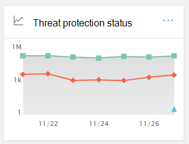
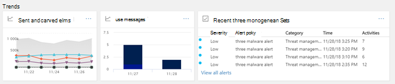

# Instrumentpanel för säkerhet

## Grundläggande funktioner och hur du öppnar Säkerhetsinstrumentpanelen

[Security & Compliance Center](../../compliance/go-to-the-securitycompliance-center.md) gör det möjligt för din organisation att hantera dataskydd och efterlevnad. Förutsatt att du har de behörigheter som krävs kan du med säkerhetsinstrumentpanelen granska din hotskyddsstatus samt visa och agera på säkerhetsaviseringar.

Titta på videon för att få en översikt och läs sedan den här artikeln om du vill veta mer.

> [!VIDEO https://www.microsoft.com/videoplayer/embed/RE1VV3o]

Beroende på vad organisationens prenumeration innehåller innehåller säkerhetsinstrumentpanelen flera widgetar, till exempel Threat Management Summary, Threat Protection Status, Global Weekly Threat Detections, Malware med mera, enligt beskrivningen i följande avsnitt.

Om du vill visa [Security & Compliance Center](../../compliance/go-to-the-securitycompliance-center.md)säkerhetsinstrumentpanelen går du till **Threat management** \> **instrumentpanelen**för hothantering i Security & Compliance Center .

> [!NOTE]
> Du måste vara global administratör, säkerhetsadministratör eller säkerhetsläsare för att kunna visa säkerhetsinstrumentpanelen. Vissa widgetar kräver ytterligare behörigheter för att kunna visa. Mer information finns [i Behörigheter i Säkerhets- & Compliance Center](permissions-in-the-security-and-compliance-center.md).

## Sammanfattning av hothantering

Widgeten Sammanfattning av hot ger dig en överblick över hur din organisation har skyddats från hot under de senaste sju (7) dagarna.

Vilken information du ser i sammanfattningen av hothantering beror på vad du prenumererar på. I följande tabell beskrivs vilken information som ingår för Office 365 E3 och Office 365 E5.

|Office 365 E3|Office 365 E5|
|---|---|
|Blockerade meddelanden om skadlig kod Nätfiskemeddelanden blockerade Meddelanden som rapporterats av användare    |Blockerade meddelanden om skadlig kod Nätfiskemeddelanden blockerade Meddelanden som rapporterats av användare Zero-day malware blockerad Avancerade nätfiskemeddelanden har upptäckts Blockerade skadliga webbadresser|

Om du vill visa eller komma åt widgeten Sammanfattning av hothantering måste du ha behörighet för att kunna visa rapporter om avancerat skydd mot hot. Mer information finns i [Vilka behörigheter som behövs för att visa ATP-rapporterna?](view-reports-for-atp.md#what-permissions-are-needed-to-view-the-atp-reports)

## Status för skydd mot hot

Widgeten Threat Protection Status visar hotskyddseffektivitet med en trendig och detaljerad vy över phish och skadlig kod.

Informationen beror på om din Microsoft 365-prenumeration innehåller [Exchange Online Protection](exchange-online-protection-overview.md) (EOP) med eller utan Office [365 Advanced Threat Protection](office-365-atp.md) (ATP).

|Om din prenumeration innehåller...|Du ser dessa uppgifter|
|---|---|
|EOP men inte Office 365 ATP|Skadlig e-post som upptäcktes och blockerades av EOP.   Se [rapporten Status för hotskydd (EOP).](view-email-security-reports.md#threat-protection-status-report)|
|Skaffa Office 365 ATP|Skadligt innehåll och skadlig e-post som upptäckts och blockerats av EOP och Office 365 ATP  Aggregerat antal unika e-postmeddelanden med skadligt innehåll som blockerats av anti-malware-motorn, [nolltimmars automatisk rensning](zero-hour-auto-purge.md)och ATP-funktioner (inklusive [säkra länkar,](atp-safe-links.md) [säkra bilagor](atp-safe-attachments.md)och [ATP-anti-phishing).](set-up-anti-phishing-policies.md#exclusive-settings-in-atp-anti-phishing-policies)  Se [rapporten Status för hotskydd (ATP)](view-reports-for-atp.md#threat-protection-status-report).|

Om du vill visa eller komma åt widgeten Status för hotskydd måste du ha behörighet att visa rapporter om avancerat skydd mot hot. Mer information finns i [Vilka behörigheter som behövs för att visa ATP-rapporterna?](view-reports-for-atp.md#what-permissions-are-needed-to-view-the-atp-reports)

## Globala hotidentifieringar varje vecka

Widgeten Global Weekly Threat Detections visar hur många hot som upptäckts i e-postmeddelanden under de senaste sju (7) dagarna.

Måtten beräknas enligt beskrivningen i följande tabell:

|Metriska|Hur det beräknas|
|---|---|
|Skannade meddelanden|Antal skannade e-postmeddelanden multiplicerat med antalet mottagare|
|Hot stoppas|Antal e-postmeddelanden som identifierats som innehållande skadlig kod multiplicerat med antalet mottagare|
|Blockerad av [ATP](office-365-atp.md)|Antal e-postmeddelanden som blockerats av ATP multiplicerat med antalet mottagare|
|Tas bort efter leverans|Antal meddelanden som tagits bort med [automatisk rensning](zero-hour-auto-purge.md) noll timmar multiplicerat med antalet mottagare|

## Malware

Malware widgets visar information om malware trender och malware familjetyper under de senaste sju (7) dagarna.

## Insikter

Insikter inte bara yta viktiga frågor som du bör granska, de innehåller också rekommendationer och åtgärder att överväga.

Du kan till exempel se att nätfiskemeddelanden levereras eftersom vissa användare har inaktiverat sina skräppostalternativ. Mer information om hur insikter fungerar finns [i Rapporter och insikter i Security & Compliance Center](reports-and-insights-in-security-and-compliance.md).

## Hotutredning och hothantering

Om organisationens prenumeration innehåller [Office 365 Advanced Threat Protection Plan 2](office-365-ti.md)har säkerhetsinstrumentpanelen ett avsnitt som innehåller avancerade verktyg för hotundersökning och svar. Dessa verktyg inkluderar [automatiserade undersöknings- och svarsfunktioner](automated-investigation-response-office.md). Automatisk undersökning och svar kan vara till hjälp i scenarier som [att snabbt adressera komprometterade användarkonton](address-compromised-users-quickly.md).

Mer information finns i [Komma igång med Automatisk undersökning och svar (AIR) i Office 365](office-365-air.md).

## Trender

Längst ned på säkerhetsinstrumentpanelen finns ett **avsnittet Trender** som sammanfattar trender för e-postflödet för din organisation. Rapporter innehåller information om e-post som kategoriseras som skräppost, skadlig kod, nätfiskeförsök och bra e-post. Klicka på en panel om du vill visa mer detaljerad information i rapporten.

Och om organisationens prenumeration innehåller [Office 365 Advanced Threat Protection Plan 2](office-365-ti.md)har du också en rapport om aviseringar om **hothantering nyligen** i det här avsnittet som gör att säkerhetsteamet kan visa och vidta åtgärder för säkerhetsaviseringar med hög prioritet.

Om du vill visa eller komma åt widgeten Skickat och mottaget e-post måste du ha behörighet för att kunna visa rapporter om avancerat skydd mot hot. Mer information finns i [Vilka behörigheter som behövs för att visa ATP-rapporterna?](view-reports-for-atp.md#what-permissions-are-needed-to-view-the-atp-reports).

Om du vill visa eller komma åt widgeten Senaste hothanteringsaviseringar måste du ha behörighet att visa aviseringar. Mer information finns i [RBAC-behörigheter som krävs för att visa aviseringar](../../compliance/alert-policies.md#rbac-permissions-required-to-view-alerts).

## Relaterade ämnen

[Visa säkerhetsrapporter för e-post i Säkerhets- & Compliance Center](view-email-security-reports.md)

[Visa rapporter för avancerat hotskydd för Office 365](view-reports-for-atp.md)

[Office 365 Avancerat skydd](office-365-atp.md)

[Office 365 Hotutredning och hothantering](office-365-ti.md)
