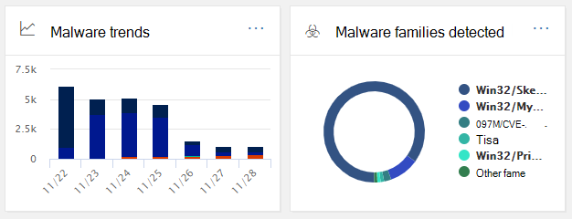

# SäkerhetsinstrumentpanelSecurity Dashboard

[!INCLUDE [Microsoft 365 Defender rebranding](../includes/microsoft-defender-for-office.md)]

## Grundläggande funktioner och hur du öppnar SäkerhetsinstrumentpanelBasic functions and how to open Security Dashboard

Säkerhets- [& efterlevnadscenter](../../compliance/microsoft-365-compliance-center.md) gör det möjligt för organisationen att hantera dataskydd och efterlevnad.The [Security & Compliance Center](../../compliance/microsoft-365-compliance-center.md) enables your organization to manage data protection and compliance. Om du har de behörigheter som krävs kan du med hjälp av instrumentpanelen för säkerhet granska din status för skydd mot hot samt visa och agera på säkerhetsvarningar.Assuming you have the necessary permissions, the Security Dashboard enables you to review your Threat Protection Status, as well as view and act on security alerts.

Titta på videon för att få en översikt och läs sedan den här artikeln om du vill veta mer.Watch the video to get an overview, and then read this article to learn more.

> [!VIDEO https://www.microsoft.com/videoplayer/embed/RE1VV3o]

Beroende på vad din organisations prenumeration inkluderar innehåller instrumentpanelen för säkerhet flera widgetar, till exempel Sammanfattning av hothantering, Hotskyddsstatus, Global veckovis identifiering av hot, skadlig programvara med mera, som beskrivs i följande avsnitt.Depending on what your organization's subscription includes, the Security Dashboard includes several widgets, such as Threat Management Summary, Threat Protection Status, Global Weekly Threat Detections, Malware, and more, as described in the following sections.

Om du vill visa Säkerhetsinstrumentpanel går [du & Säkerhets- och efterlevnadscenter](../../compliance/microsoft-365-compliance-center.md)på **Instrumentpanelen för hantering av** \> **hot.**To view the Security Dashboard, in the [Security & Compliance Center](../../compliance/microsoft-365-compliance-center.md), go to **Threat management** \> **Dashboard**.

> [!NOTE]
> Du måste vara global administratör, säkerhetsadministratör eller säkerhetsläsare för att kunna visa instrumentpanelen för säkerhet.You must be a global administrator, a security administrator, or a security reader to view the Security Dashboard. Vissa widgetar kräver ytterligare behörigheter för att visa.Some widgets require additional permissions to view. Mer information finns i [Behörigheter i Säkerhets- & Kompatibilitetscenter.](permissions-in-the-security-and-compliance-center.md)To learn more, see [Permissions in the Security & Compliance Center](permissions-in-the-security-and-compliance-center.md).

## Sammanfattning av hothanteringThreat Management Summary

Widgeten Sammanfattning av hothantering visar direkt hur organisationen har skyddats mot hot under de senaste sju (7) dagarna.The Threat Management Summary widget tells you at a glance how your organization was protected from threats over the past seven (7) days.

Vilken information du ser i sammanfattningen av hothanteringen beror på vad din prenumeration innehåller.The information you'll see in the Threat Management Summary depends on what you subscription includes. I följande tabell beskrivs vilken information som ingår i Office 365 E3 och Office 365 E5.The following table describes what information is included for Office 365 E3 and Office 365 E5.

|Office 365 E3Office 365 E3|Office 365 E5Office 365 E5|
|---|---|
|Skadliga meddelanden blockeradeMalware messages blocked Nätfiskemeddelanden är blockeradePhishing messages blocked Meddelanden som rapporterats av användareMessages reported by users    |Skadliga meddelanden blockeradeMalware messages blocked Nätfiskemeddelanden är blockeradePhishing messages blocked Meddelanden som rapporterats av användareMessages reported by users Nolldagars skadlig programvara blockeradZero-day malware blocked Avancerade nätfiskemeddelanden har upptäcktsAdvanced phishing messages detected Skadliga URL:er blockerasMalicious URLs blocked|

Om du vill visa eller komma åt widgeten Sammanfattning av hothantering måste du ha behörighet att visa Defender Office 365.To view or access the Threat Management Summary widget, you must have permissions to view Defender for Office 365 reports. Mer information finns i [Vilka behörigheter krävs för att visa Defender för Office 365 rapporter?](view-reports-for-mdo.md#what-permissions-are-needed-to-view-the-defender-for-office-365-reports).To learn more, see [What permissions are needed to view the Defender for Office 365 reports?](view-reports-for-mdo.md#what-permissions-are-needed-to-view-the-defender-for-office-365-reports).

## Status för skydd mot hotThreat Protection Status

Widgeten Hotskyddsstatus visar hur effektivt skyddet för hot är med en trendande och detaljerad vy över nätt och skadlig programvara.The Threat Protection Status widget shows threat protection effectiveness with a trending and detailed view of phish and malware.

Informationen beror på om EOP (Microsoft 365 Subscription includes [Exchange Online Protection)](exchange-online-protection-overview.md) med eller utan [Microsoft Defender för Office 365.](defender-for-office-365.md)The details depend on whether your Microsoft 365 subscription includes [Exchange Online Protection](exchange-online-protection-overview.md) (EOP) with or without [Microsoft Defender for Office 365](defender-for-office-365.md).

|Om din prenumeration inkluderar...If your subscription includes...|Den här informationen visasYou'll see these details|
|---|---|
|EOP men inte Microsoft Defender för Office 365EOP but not Microsoft Defender for Office 365|Skadlig e-post som har upptäckts och blockerats av EOP.Malicious email that was detected and blocked by EOP.
 Se [Statusrapport för skydd mot hot (EOP).](view-email-security-reports.md#threat-protection-status-report)See [Threat Protection Status report (EOP)](view-email-security-reports.md#threat-protection-status-report).|
|Microsoft Defender för Office 365Microsoft Defender for Office 365|Skadligt innehåll och skadlig e-post som identifieras och blockeras av EOP och Defender för Office 365Malicious content and malicious email detected and blocked by EOP and Defender for Office 365 
 Aggregerat antal unika e-postmeddelanden med skadligt innehåll som blockerats av antivirusmotorn, automatisk rensning utan timme och Defender för Office 365-funktioner (inklusive [Valv-länkar,](safe-links.md) [Valv-bilagor](safe-attachments.md)och skydd mot nätfiske i Defender för [Office 365).](set-up-anti-phishing-policies.md#exclusive-settings-in-anti-phishing-policies-in-microsoft-defender-for-office-365)Aggregated count of unique email messages with malicious content blocked by the anti-malware engine, [zero-hour auto purge](zero-hour-auto-purge.md), and Defender for Office 365 features (including [Safe Links](safe-links.md), [Safe Attachments](safe-attachments.md), and [Anti-phishing in Defender for Office 365](set-up-anti-phishing-policies.md#exclusive-settings-in-anti-phishing-policies-in-microsoft-defender-for-office-365)). 
 Se [statusrapport om skydd mot hot.](view-reports-for-mdo.md#threat-protection-status-report)See [Threat protection status report](view-reports-for-mdo.md#threat-protection-status-report).|

Om du vill visa eller komma åt widgeten Hotskyddsstatus måste du ha behörighet att visa Defender Office 365 rapporter.To view or access the Threat Protection Status widget, you must have permissions to view Defender for Office 365 reports. Mer information finns i [Vilka behörigheter krävs för att visa Defender för Office 365 rapporter?](view-reports-for-mdo.md#what-permissions-are-needed-to-view-the-defender-for-office-365-reports)To learn more, see [What permissions are needed to view the Defender for Office 365 reports?](view-reports-for-mdo.md#what-permissions-are-needed-to-view-the-defender-for-office-365-reports)

## Global veckovis identifiering av hotGlobal Weekly Threat Detections

Widgeten Global Weekly Threat Detections visar hur många hot som har upptäckts i e-postmeddelanden under de senaste sju (7) dagarna.The Global Weekly Threat Detections widget shows how many threats were detected in email messages over the past seven (7) days.

Måtten beräknas enligt beskrivningen i följande tabell:The metrics are calculated as described in the following table:

|MetriskMetric|Så här beräknas detHow it's calculated|
|---|---|
|Meddelanden skannadeMessages scanned|Antalet e-postmeddelanden som genomsöks multiplicerat med antalet mottagareNumber of email messages scanned multiplied by the number of recipients|
|Hot har stoppatsThreats stopped|Antalet e-postmeddelanden som identifierats som innehåller skadlig programvara multiplicerat med antalet mottagareNumber of email messages identified as containing malware multiplied by the number of recipients|
|Blockeras av [Defender för Office 365](defender-for-office-365.md)Blocked by [Defender for Office 365](defender-for-office-365.md)|Antalet e-postmeddelanden som blockeras av Defender för Office 365 multiplicerat med antalet mottagareNumber of email messages blocked by Defender for Office 365 multiplied by the number of recipients|
|Tas bort efter leveransRemoved after delivery|Antalet meddelanden som tagits [bort med en automatisk rensning på nolltimmar](zero-hour-auto-purge.md) multiplicerat med antalet mottagareNumber of messages removed by [zero-hour auto purge](zero-hour-auto-purge.md) multiplied by the number of recipients|

## Skadlig programvaraMalware

Widgetar för skadlig programvara visar information om trender och familjetyper för skadlig programvara under de senaste sju (7) dagarna.Malware widgets show details about malware trends and malware family types over the past seven (7) days.

## InsikterInsights

Insikter tar inte bara upp viktiga problem som du bör granska, de innehåller även rekommendationer och åtgärder att överväga.Insights not only surface key issues you should review, they also include recommendations and actions to consider.

Du kan till exempel se att nätfiskemeddelanden levereras eftersom vissa användare har inaktiverat sina skräppostalternativ.For example, you might see that phishing email messages are being delivered because some users have disabled their junk mail options. Mer information om hur insikter fungerar finns i Rapporter och insikter i Säkerhets- & [Efterlevnadscenter.](reports-and-insights-in-security-and-compliance.md)To learn more about how insights work, see [Reports and insights in the Security & Compliance Center](reports-and-insights-in-security-and-compliance.md).

## Undersökning och svar på hotThreat investigation and response

Om din organisations prenumeration omfattar Microsoft Defender för [Office 365 abonnemang 2](office-365-ti.md)har din säkerhetsinstrumentpanel ett avsnitt som innehåller avancerade undersöknings- och svarsverktyg för hot.If your organization's subscription includes  [Microsoft Defender for Office 365 Plan 2](office-365-ti.md), your Security Dashboard has a section that includes advanced threat investigation and response tools. Dessa verktyg innehåller [automatiserad undersökning och svarsfunktioner.](automated-investigation-response-office.md)These tools include [automated investigation and response capabilities](automated-investigation-response-office.md). Automatisk undersökning och svar kan vara användbart i scenarier som att [hantera komprometterade användarkonton snabbt.](address-compromised-users-quickly.md)Automated investigation and response can be helpful in scenarios such as [addressing compromised user accounts quickly](address-compromised-users-quickly.md).

Mer information finns i [Komma igång med automatiserad undersökning och svar (AIR) i Office 365.](office-365-air.md)To learn more, see [Get started using Automated investigation and response (AIR) in Office 365](office-365-air.md).

## TrenderTrends

Längst ned på instrumentpanelen för säkerhet finns avsnittet **Trender,** som sammanfattar e-postflödestrender för din organisation.Near the bottom of the Security Dashboard is a **Trends** section, which summarizes email flow trends for your organization. Med rapporter får du information om e-post som kategoriserats som skräppost, skadlig kod, försök till nätfiske och bra e-post.Reports provide information about email categorized as spam, malware, phishing attempts, and good email. Klicka på en panel om du vill visa mer detaljerad information i rapporten.Click a tile to view more detailed information in the report.

Om din organisations prenumeration omfattar Defender för [Office 365 abonnemang 2](office-365-ti.md)har du  även en rapport om händelser för hantering av hot i det här avsnittet som gör att säkerhetsteamet kan se och vidta åtgärder för högprioriterade säkerhetsvarningar.And, if your organization's subscription includes [Defender for Office 365 Plan 2](office-365-ti.md), you will also have a **Recent threat management alerts** report in this section that enables your security team to view and take action on high-priority security alerts.

Om du vill visa eller komma åt widgeten Skickad och mottagen e-post måste du ha behörighet att visa Defender Office 365 rapporter.To view or access the Sent and Received Email widget, you must have permissions to view Defender for Office 365 reports. Mer information finns i [Vilka behörigheter krävs för att visa Defender för Office 365 rapporter?](view-reports-for-mdo.md#what-permissions-are-needed-to-view-the-defender-for-office-365-reports).To learn more, see [What permissions are needed to view the Defender for Office 365 reports?](view-reports-for-mdo.md#what-permissions-are-needed-to-view-the-defender-for-office-365-reports).

Om du vill visa eller komma åt widgeten Senaste hothanteringsvarningar måste du ha behörighet att visa aviseringar.To view or access the Recent Threat Management Alerts widget, you must have permissions to view alerts. Mer information finns i [RBAC-behörigheter som krävs för att visa aviseringar.](../../compliance/alert-policies.md#rbac-permissions-required-to-view-alerts)To learn more, see [RBAC permissions required to view alerts](../../compliance/alert-policies.md#rbac-permissions-required-to-view-alerts).

## Relaterade ämnenRelated topics

[Visa e-postsäkerhetsrapporter i Säkerhets- & Säkerhets- och efterlevnadscenterView email security reports in the Security & Compliance Center](view-email-security-reports.md)

[Visa rapporter för Microsoft Defender för Office 365View reports for Microsoft Defender for Office 365](view-reports-for-mdo.md)

[Microsoft Defender för Office 365Defender for Office 365](defender-for-office-365.md)

[Office 365 Undersökning och svar på hotOffice 365 Threat investigation and response](office-365-ti.md)