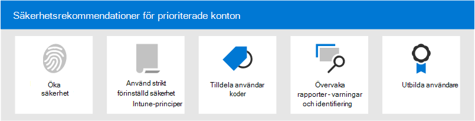

# Säkerhetsrekommendationer för prioriterade konton i Microsoft 365

Alla användarkonton har inte åtkomst till samma företagsinformation. Vissa konton har tillgång till känslig information, till exempel ekonomiska data, produktutvecklingsinformation, partneråtkomst till kritiska utvecklingssystem med mera. Konton som har tillgång till mycket konfidentiell information utgör ett allvarligt hot om de komprometteras. Vi kallar den här typen av _kontons prioritetskonton._ Prioritetskonton omfattar (men är inte begränsade till) CEOs, CISOs, CFOs, infrastrukturadministratörskonton, skapa systemkonton och mycket mer.

För attacker är vanliga nätfiskeattacker som kastar ett slumpmässigt net för vanliga eller okända användare ineffektiva. Å andra sidan är _nätfiske- eller_ _whalingattacker_ som konton med målprioritering mycket bra för attackerare. Prioritetskonton kräver därför starkare än normalt skydd för att förhindra kontokompromettering.

Microsoft 365 och Microsoft Defender för Office 365 innehåller flera viktiga funktioner som ger ytterligare säkerhetsnivåer för dina prioriterade konton. I den här artikeln beskrivs de här funktionerna och hur du använder dem.

****

|Uppgift|Alla Office 365 Enterprise abonnemang|Microsoft 365 E3|Microsoft 365 E5|
|---|:---:|:---:|:---:|
|[Öka inloggningssäkerheten för prioriterade konton](#increase-sign-in-security-for-priority-accounts)||||
|[Använda strikta förinställda säkerhetsprinciper för prioritetskonton](#use-strict-preset-security-policies-for-priority-accounts)||||
|[Använda användartaggar för prioritetskonton](#apply-user-tags-to-priority-accounts)||||
|[Övervaka prioritetskonton i aviseringar, rapporter och identifieringar](#monitor-priority-accounts-in-alerts-reports-and-detections)||||
|[Utbilda användare](#train-users)||||
|

> [!NOTE]
> Information om hur du skyddar _behöriga konton_ (administratörskonton) finns i det [här avsnittet.](/azure/architecture/framework/security/critical-impact-accounts)

## Öka inloggningssäkerheten för prioriterade konton

Prioritetskonton kräver ökad inloggningssäkerhet. Du kan öka deras inloggningssäkerhet genom att kräva multifaktorautentisering (MFA) och inaktivera äldre autentiseringsprotokoll.

Anvisningar finns i [Steg 1. Öka säkerheten för inloggning för fjärranslutna medarbetare med MFA.](../../solutions/empower-people-to-work-remotely-secure-sign-in.md) Även om den här artikeln handlar om fjärranslutna medarbetare gäller samma begrepp för prioritetsanvändare.

**Obs!** Vi rekommenderar att du inaktiverar äldre autentiseringsprotokoll för alla prioritetsanvändare globalt enligt beskrivningen i föregående artikel. Om ditt företagskrav hindrar dig från att göra det Exchange Online följande kontroller som begränsar omfattningen av äldre autentiseringsprotokoll:

- Du kan  använda  autentiseringsprinciper och klientåtkomstregler i Exchange Online för att blockera eller tillåta grundläggande autentisering och äldre autentiseringsprotokoll som POP3, IMAP4 och autentiserad SMTP för specifika användare.

- Du kan inaktivera åtkomst via POP3 och IMAP4 för enskilda postlådor. Du kan inaktivera autentiserad SMTP på organisationsnivå och aktivera den för specifika postlådor som fortfarande kräver det. Instruktioner finns i följande avsnitt:
  - [Aktivera eller inaktivera åtkomst via POP3 eller IMAP4 för en användare](/exchange/clients-and-mobile-in-exchange-online/pop3-and-imap4/enable-or-disable-pop3-or-imap4-access)
  - [Aktivera eller inaktivera autentiserad sändning via SMTP -klient (SMTP AUTH)](/exchange/clients-and-mobile-in-exchange-online/authenticated-client-smtp-submission)

Det är också värt att notera att Grundläggande autentisering håller på att inaktuella i Exchange Online för Exchange Web Services (EWS), Exchange ActiveSync, POP3, IMAP4 och fjärr-PowerShell. Mer information finns i det [här blogginlägget.](https://developer.microsoft.com/office/blogs/deferred-end-of-support-date-for-basic-authentication-in-exchange-online/)

## Använda strikta förinställda säkerhetsprinciper för prioritetskonton

Prioritetsanvändare kräver striktare åtgärder för de olika skydd som är tillgängliga i Exchange Online Protection (EOP) och Defender för Office 365.

I stället för att leverera meddelanden som klassificerats som skräppost till mappen Skräppost bör du till exempel sätta samma meddelanden i karantän om de är avsedda för prioriterade konton.

Du kan implementera den här striktare metoden för prioritetskonton genom att använda profilen Strikt i förinställda säkerhetsprinciper.

Förinställda säkerhetsprinciper är en bekväm och central plats där vi rekommenderar strikt principinställningar för alla skydd i EOP och Defender för Office 365. Mer information finns i [Förinställda säkerhetsprinciper i EOP och Microsoft Defender för Office 365.](preset-security-policies.md)

Mer information om hur inställningarna för Strikt princip skiljer sig från standardinställningarna och Standardprincipinställningarna finns i Rekommenderade inställningar för EOP och [Microsoft Defender för Office 365 säkerhet.](recommended-settings-for-eop-and-office365.md)

## Använda användartaggar för prioritetskonton

Med användartaggar i Microsoft Defender för Office 365 abonnemang 2 (som en del av Microsoft 365 E5 eller en tilläggsprenumeration) kan du snabbt identifiera och klassificera specifika användare eller grupper av användare i rapporter och incidentundersökningar.

**Prioritetskonton** är en typ av inbyggd användartagg (kallas _för systemtagg)_ som du kan använda för att identifiera incidenter och aviseringar som omfattar prioritetskonton. Mer information om **prioritetskonton finns** i [Hantera och övervaka prioritetskonton.](../../admin/setup/priority-accounts.md)

Du kan också skapa anpassade taggar för att ytterligare identifiera och klassificera dina prioritetskonton. Mer information finns i [Användartaggar.](user-tags.md) Observera att du kan hantera **prioritetskonton** (systemtaggar) i samma gränssnitt som anpassade användartaggar.

## Övervaka prioritetskonton i aviseringar, rapporter och identifieringar

När du har skyddat och taggt dina prioriterade användare kan du använda tillgängliga rapporter, aviseringar och undersökningar i EOP och Defender för Office 365 för att snabbt identifiera händelser eller identifieringar som omfattar prioriterade konton. De funktioner som har stöd för användartaggar beskrivs i följande tabell.

 

****

|Funktion|Beskrivning|
|---|---|
|Varningar|Användartaggarna för påverkade användare är synliga  och tillgängliga som filter på sidan Visa aviseringar i Säkerhets- & efterlevnadscenter. Mer information finns i [Visa aviseringar](../../compliance/alert-policies.md#viewing-alerts).|
|Hotutforskaren 
 Identifiering i realtid|I **Threat Explorer** (Microsoft Defender för Office 365 abonnemang 2) eller identifieringar i realtid (Microsoft Defender för Office 365 abonnemang 1) visas användartaggar i rutnätsvyn för e-post och den utfällbara fönsterbilden med **e-postinformation.** Användartaggar är också tillgängliga som en filtrerbar egenskap. Mer information finns i [Taggar i Hotutforskaren.](threat-explorer.md#tags-in-threat-explorer)|
|Kampanjvyer|Användartaggar är en av många filtrerbara egenskaper i kampanjvyer i Microsoft Defender för Office 365 abonnemang 2. Mer information finns i [Kampanjvyer.](campaigns.md)|
|Statusrapport för hotskydd|I praktiskt taget alla vyer och detaljtabeller i rapporten **om hotskyddsstatus** kan du filtrera resultatet efter **prioritetskonton**. Mer information finns i [Statusrapport för skydd mot hot.](view-email-security-reports.md#threat-protection-status-report)|
|Rapport om e-postproblem för prioritetskonton|Rapporten **E-postproblem för** prioritetskonton i administrationscentret för Exchange (EAC) innehåller information om ofördröjda och fördröjda meddelanden för **prioritetskonton.** Mer information finns i rapporten [E-postproblem för prioritetskonton.](/exchange/monitoring/mail-flow-reports/mfr-email-issues-for-priority-accounts-report)|
|

## Utbilda användare

Utbildning av användare med prioritetskonton kan hjälpa till att spara de användarna och ditt säkerhetsteam mycket tid och frustration. Smarta användare har mindre chans att öppna bifogade filer eller klicka på länkar i tveksamma e-postmeddelanden, och risken är större att de undviker misstänkta webbplatser.

Nu finns en handbok om [Cybersäkerhetskampanjer](https://www.belfercenter.org/CyberPlaybook) från Harvard Det är ett bra sätt att etablera en stark säkerhetskultur i organisationen, bland annat utbildningsanvändare för att identifiera nätfiskeattacker.

Microsoft 365 följande resurser för att informera användarna i organisationen:

 

****

|Begrepp|Resurser|Beskrivning|
|---|---|---|
|Microsoft 365|[Anpassningsbara utbildningsvägar](/office365/customlearning/)|De här resurserna kan hjälpa dig att sätta ihop utbildning för användare i organisationen.|
|Microsoft 365-säkerhet|[Utbildningsmodul: Skydda organisationen med inbyggd och intelligent säkerhet från Microsoft 365](/learn/modules/security-with-microsoft-365)|I den här modulen kan du beskriva hur Microsoft 365 fungerar tillsammans och att formulera fördelarna med dessa säkerhetsfunktioner.|
|Multifaktorautentisering|[Tvåstegsverifiering: Vad är den ytterligare verifieringssidan?](/azure/active-directory/user-help/multi-factor-authentication-end-user-first-time)|Den här artikeln hjälper slutanvändarna att förstå vad multifaktorautentisering är och varför det används i organisationen.|
|Utbildning av attack simulering|[Kom igång med Attack simuleringsträning](attack-simulation-training-get-started.md)|Med utbildning av attack simulering i Microsoft Defender för Office 365 abonnemang 2 kan administratörer konfigurera, starta och spåra simulerade nätfiskeattacker mot specifika grupper av användare.|

Dessutom rekommenderar Microsoft att användare gör som beskrivs i den här artikeln: Skydda ditt konto och dina [enheter från hackare och skadlig programvara.](https://support.microsoft.com/office/066d6216-a56b-4f90-9af3-b3a1e9a327d6) Dessa åtgärder omfattar:

- Använda starka lösenord
- Skydda enheter
- Aktivera säkerhetsfunktioner på Windows 10 och Mac-datorer (för ohanterade enheter)

## Se även

[Vi presenterar prioritetskontoskydd i Microsoft Defender för Office 365](https://techcommunity.microsoft.com/t5/microsoft-defender-for-office/announcing-priority-account-protection-in-microsoft-defender-for/ba-p/1696385)