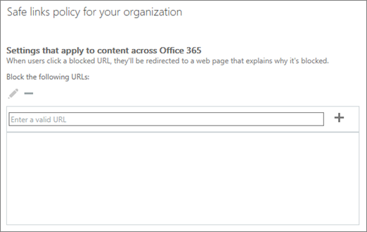

# Konfigurera en lista med anpassade blockerade webbadresser med ATP Safe Links

> [!IMPORTANT]
> Den här artikeln är avsedd för företagskunder som har [Office 365 Avancerat skydd](office-365-atp.md). Om du är hemanvändare och letar efter information om säkra länkar i Outlook läser du [Avancerad Outlook.com säkerhet](https://support.office.com/article/882d2243-eab9-4545-a58a-b36fee4a46e2).

Med [Office 365 Advanced Threat Protection](office-365-atp.md) (ATP) kan din organisation ha en anpassad lista över webbadresser som är blockerade. När en webbadress blockeras tas personer som klickar på länkar till den blockerade webbadressen till en [varningssida](atp-safe-links-warning-pages.md) som liknar följande bild: 
  

  
Listan blockerade webbadresser definieras av organisationens Microsoft 365 för företag-säkerhetsteam, och den listan gäller alla i organisationen som omfattas av Office 365 ATP Safe Links-principer. 
  
Läs den här artikeln om du vill lära dig hur du konfigurerar organisationens anpassade lista med blockerade webbadresser för [BETRODDA ATP-länkar i Office 365](atp-safe-links.md).
  
## Visa eller redigera en anpassad lista med blockerade webbadresser

[ATP Safe Links i Office 365](atp-safe-links.md) använder flera listor, inklusive organisationens anpassade lista med blockerade webbadresser. Om du har de behörigheter som krävs kan du ställa in organisationens anpassade lista. Du gör detta genom att redigera organisationens standardprincip för säkra länkar.

Om du vill redigera (eller definiera) ATP-principer måste du tilldelas en av de roller som beskrivs i följande tabell: 

|Roll  |Var/hur tilldelas  |
|---------|---------|
|global administratör |Den person som registrerar sig för att köpa Microsoft 365 är en global administratör som standard. (Läs [mer om Microsoft 365-administratörsroller.)](https://docs.microsoft.com/office365/admin/add-users/about-admin-roles)         |
|Säkerhetsadministratör |Administrationscenter för[https://aad.portal.azure.com](https://aad.portal.azure.com)Azure Active Directory ( )|
|Hantering av Exchange Online-organisation |Administrationscenter[https://outlook.office365.com/ecp](https://outlook.office365.com/ecp)för Exchange ( )  eller    PowerShell-cmdletar (se [Exchange Online PowerShell](https://docs.microsoft.com/powershell/exchange/exchange-online/exchange-online-powershell)) |

> [!TIP]
> Mer information om roller och behörigheter finns [i Behörigheter i Säkerhetsefterlevnadscenter &amp; ](permissions-in-the-security-and-compliance-center.md).

### Så här visar eller redigerar du en anpassad lista med blockerade webbadresser
  
1. Gå [https://protection.office.com](https://protection.office.com) till och logga in med ditt arbets- eller skolkonto. 
    
2. Välj **Policy** \> Säkra länkar under **Hothantering**i den vänstra **navigeringen.**
    
3. I de **principer som gäller för hela organisationsavsnittet** väljer du **Standard**och väljer sedan **Redigera** (knappen Redigera liknar en penna).  På så sätt kan du visa listan över blockerade webbadresser. Först kanske du inte har några webbadresser listade här. 
  
4. Markera rutan **Ange en giltig URL,** skriv en URL**+** och välj sedan plustecknet ( ). 

5. När du har lagt till webbadresser väljer du **Spara**i det nedre högra hörnet av skärmen .
    
## Några saker att tänka på

När du lägger till webbadresser i listan bör du tänka på följande: 

- Ta inte med ett **/** snedstreck ( ) i slutet av webbadressen. I stället för att `https://www.contoso.com/`till `https://www.contoso.com`exempel skriva in anger du .
    
- Du kan ange en URL `contoso.com` endast `tailspintoys.com`för domän (gilla eller ). Detta blockerar klick på alla webbadresser som innehåller domänen.

- Du kan ange en underdomän (som) `toys.contoso.com*`utan att `contoso.com`blockera en fullständig domän (till exempel ). Detta blockerar klick på en URL som innehåller underdomänen, men det blockerar inte klick till en URL som innehåller hela domänen.  
    
- Du kan inkludera upp till tre jokerteckenasterisker (\*) per webbadress. I följande tabell visas några exempel på vad du kan ange och vilken effekt dessa poster har.
    
|**Exempel på post**|**Vad den gör**|
|:-----|:-----|
|`contoso.com`Eller`*contoso.com*`    |Blockerar domänen, underdomänerna och sökvägarna, till exempel `https://www.contoso.com`, `https://sub.contoso.com`och`https://contoso.com/abc`    |
|`https://contoso.com/a`    |Blockerar en `https://contoso.com/a` plats men inte ytterligare undervägar som`https://contoso.com/a/b`    |
|`https://contoso.com/a*`    |Blockerar en `https://contoso.com/a` webbplats och ytterligare undervägar som`https://contoso.com/a/b`    |
|`https://toys.contoso.com*`    |Blockerar en underdomän ("leksaker" i det här fallet) men tillåter `https://contoso.com` `https://home.contoso.com`klick till andra domänadresser (gilla eller ).    |
   

## Så här definierar du undantag för vissa användare i en organisation

Om du vill att vissa grupper ska kunna visa webbadresser som kan vara blockerade för andra kan du ange en ATP Safe Links-princip som gäller för specifika mottagare. Se [Konfigurera en anpassad url-lista för "skriv inte om" med hjälp av ATP Safe Links](set-up-a-custom-do-not-rewrite-urls-list-with-atp.md).
  

