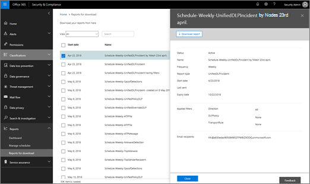

# Konfigurera och hämta en anpassad &amp; rapport i Security Compliance CenterSet up and download a custom report in the Security &amp; Compliance Center

I [Security &amp; Compliance Center](https://protection.office.com)finns flera [rapporter och insikter](reports-and-insights-in-security-and-compliance.md) tillgängliga för att hjälpa organisationens säkerhetsteam att minska och hantera hot mot din organisation.In the [Security &amp; Compliance Center](https://protection.office.com), several [reports and insights](reports-and-insights-in-security-and-compliance.md) are available to help your organization's security team mitigate and address threats to your organization. Om du är medlem i organisationens säkerhetsteam kan du konfigurera en rapport med anpassade datumintervall och filter och sedan hämta den anpassade rapporten.If you're a member of your organization's security team, you can configure a report with custom date ranges and filters, and then download your custom report. 
  
## Ladda ned en anpassad rapportDownload a custom report

> [!IMPORTANT]
> Kontrollera att du har de behörigheter som krävs [för Office 365 &amp; Security Compliance Center](permissions-in-the-security-and-compliance-center.md).Make sure that you have the necessary [permissions for the Office 365 Security &amp; Compliance Center](permissions-in-the-security-and-compliance-center.md). I allmänhet kan globala Office 365-administratörer, säkerhetsadministratörer och &amp; säkerhetsläsare komma åt rapporter i Security Compliance Center.In general, Office 365 global administrators, security administrators, and security readers can access reports in the Security &amp; Compliance Center. 
  
1. Gå till **instrumentpanelen för rapporter** \> i [Säkerhetsefterlevnadscenter &amp; ](https://protection.office.com). **Dashboard**In the [Security &amp; Compliance Center](https://protection.office.com), go to **Reports** \> **Dashboard**.
    
2. Välj en rapport.Choose a report. (I det här exemplet använder vi meddelandedispositionsrapporten.)(For this example, we'll use the Message Disposition Report.) 
  
3. I det övre vänstra hörnet av rapporten väljer du **Begär rapport**.In the upper left corner of the report, choose **Request report**.
    
4. I dialogrutan **Begäran rapport** anger du ett namn, startdatum och slutdatum för rapporten.In the **Request report** dialog box, specify a name, start date, and end date for the report. Välj sedan **Nästa**.Then choose **Next**. 
  
5. Ange de filter som du vill använda för rapporten.Specify any filters you want to use for the report. (Du kan till exempel ange en klient-IP-adress för meddelandedispositionsrapporten.) Välj sedan **Nästa**.(For example, you might specify a client IP address for the Message Disposition Report.) Then choose **Next**.
    
6. Ange e-postmottagare för rapporten och välj sedan **Spara**.Specify email recipients for the report, and then choose **Save**.
    
## Relaterade ämnenRelated topics

[Rapporter och insikter i Office 365 Security &amp; Compliance CenterReports and insights in the Office 365 Security &amp; Compliance Center](reports-and-insights-in-security-and-compliance.md)
  
[Skapa ett schema för en &amp; rapport i SäkerhetsefterlevnadscenterCreate a schedule for a report in the Security &amp; Compliance Center](create-a-schedule-for-a-report.md)
  
[Hantera scheman för rapporter &amp; i Security Compliance CenterManage schedules for reports in the Security &amp; Compliance Center](manage-schedules-for-multiple-reports.md)
  
[Hämta befintliga rapporter &amp; i Security Compliance CenterDownload existing reports in the Security &amp; Compliance Center](download-existing-reports.md)
  

