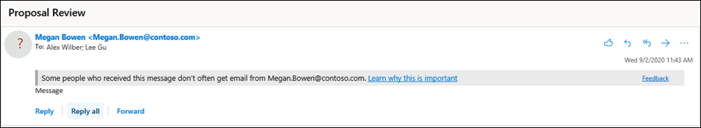

# Principer mot nätfiske i Microsoft 365Anti-phishing policies in Microsoft 365

[!INCLUDE [Microsoft 365 Defender rebranding](../includes/microsoft-defender-for-office.md)]

**Gäller för****Applies to**
- [Exchange Online ProtectionExchange Online Protection](exchange-online-protection-overview.md)
- [Microsoft Defender för Office 365 Abonnemang 1 och Abonnemang 2Microsoft Defender for Office 365 plan 1 and plan 2](defender-for-office-365.md)
- [Microsoft 365 DefenderMicrosoft 365 Defender](../defender/microsoft-365-defender.md)

Principer för att konfigurera inställningar för skydd mot nätfiske är tillgängliga i Microsoft 365-organisationer med Exchange Online-postlådor, fristående EOP-organisationer (Exchange Online Protection) utan Exchange Online-postlådor och Microsoft Defender för Office 365 organisationer.Policies to configure anti-phishing protection settings are available in Microsoft 365 organizations with Exchange Online mailboxes, standalone Exchange Online Protection (EOP) organizations without Exchange Online mailboxes, and Microsoft Defender for Office 365 organizations.

Exempel på Microsoft Defender för Office 365 organisationer är:Examples of Microsoft Defender for Office 365 organizations include:

- Microsoft 365 Enterprise E5, Microsoft 365 Education A5 osv.Microsoft 365 Enterprise E5, Microsoft 365 Education A5, etc.
- [Microsoft 365 EnterpriseMicrosoft 365 Enterprise](https://www.microsoft.com/microsoft-365/enterprise/home)
- [Microsoft 365 BusinessMicrosoft 365 Business](https://www.microsoft.com/microsoft-365/business)
- [Microsoft Defender Office 365 tillägg som ett tilläggMicrosoft Defender for Office 365 as an add-on](https://products.office.com/exchange/advance-threat-protection)

De stora skillnaderna mellan principer för skydd mot nätfiske i EOP och skydd mot nätfiske i Defender för Office 365 beskrivs i följande tabell:The high-level differences between anti-phishing policies in EOP and anti-phishing policies in Defender for Office 365 are described in the following table:

 

****

|FunktionFeature|Principer mot nätfiske i EOPAnti-phishing policies in EOP|Principer för skydd mot nätfiske i Defender för Office 365Anti-phishing policies in Defender for Office 365|
|---|:---:|:---:|
|Standardprincip skapad automatisktAutomatically created default policy|||
|Skapa anpassade principerCreate custom policies|||
|Vanliga principinställningar\*Common policy settings\*|||
|Inställningar för förfalskningSpoof settings|||
|Första säkerhetstipsFirst contact safety tip|||
|Inställningar för personifieringImpersonation settings|||
|Avancerade tröskelvärden för nätfiskeAdvanced phishing thresholds|||
|

\* I standardprincipen är principnamnet och beskrivningen skrivskyddade (beskrivningen är tom) och du kan inte ange vem principen ska gälla för (standardprincipen gäller för alla mottagare).\* In the default policy, the policy name, and description are read-only (the description is blank), and you can't specify who the policy applies to (the default policy applies to all recipients).

Information om hur du konfigurerar principer mot nätfiske finns i följande artiklar:To configure anti-phishing policies, see the following articles:

- [Konfigurera principer för skydd mot nätfiske i EOPConfigure anti-phishing policies in EOP](configure-anti-phishing-policies-eop.md)
- [Konfigurera principer mot nätfiske i Microsoft Defender för Office 365Configure anti-phishing policies in Microsoft Defender for Office 365](configure-mdo-anti-phishing-policies.md)

I resten av den här artikeln beskrivs de inställningar som är tillgängliga i principer mot nätfiske i EOP och Defender för Office 365.The rest of this article describes the settings that are available in anti-phishing policies in EOP and Defender for Office 365.

## Vanliga principinställningarCommon policy settings

Följande principinställningar är tillgängliga i principer för skydd mot nätfiske i EOP och Defender för Office 365:The following policy settings are available in anti-phishing policies in EOP and Defender for Office 365:

- **Namn:** Du kan inte byta namn på standardprincipen för skydd mot nätfiske.**Name**: You can't rename the default anti-phishing policy. När du har skapat en anpassad princip mot nätfiske kan du inte byta namn på principen i Microsoft 365 Defender portalen.After you create a custom anti-phishing policy, you can't rename the policy in the Microsoft 365 Defender portal.

- **Beskrivning** Du kan inte lägga till en beskrivning i standardprincipen för nätfiske, men du kan lägga till och ändra beskrivningen för anpassade principer som du skapar.**Description** You can't add a description to the default anti-phishing policy, but you can add and change the description for custom policies that you create.

- **Användare, grupper och domäner**: Identifierar interna mottagare som principen mot nätfiske gäller för.**Users, groups, and domains**: Identifies internal recipients that the anti-phishing policy applies to. Det här värdet krävs i anpassade principer och är inte tillgängligt i standardprincipen (standardprincipen gäller för alla mottagare).This value is required in custom policies, and not available in the default policy (the default policy applies to all recipients).

  Du kan bara använda ett villkor eller undantag en gång, men du kan ange flera värden för villkoret eller undantaget.You can only use a condition or exception once, but you can specify multiple values for the condition or exception. Flera värden för samma villkor eller undantag använder ELLER-logik (till exempel _\<recipient1\>_ eller _\<recipient2\>_).Multiple values of the same condition or exception use OR logic (for example, _\<recipient1\>_ or _\<recipient2\>_). Olika villkor och undantag använder OCH-logik (till exempel _\<recipient1\>_ och _\<member of group 1\>_).Different conditions or exceptions use AND logic (for example, _\<recipient1\>_ and _\<member of group 1\>_).

  - **Användare:** En eller flera postlådor, e-postanvändare eller e-postkontakter i organisationen.**Users**: One or more mailboxes, mail users, or mail contacts in your organization.
  - **Grupper**: En eller flera grupper i organisationen.**Groups**: One or more groups in your organization.
  - **Domäner**: En eller flera av de konfigurerade [godkända domänerna](/exchange/mail-flow-best-practices/manage-accepted-domains/manage-accepted-domains) i Microsoft 365.**Domains**: One or more of the configured [accepted domains](/exchange/mail-flow-best-practices/manage-accepted-domains/manage-accepted-domains) in Microsoft 365.

  - **Utesluta dessa användare, grupper och domäner:** Undantag för principen.**Exclude these users, groups, and domains**: Exceptions for the policy. Inställningarna och beteendet är exakt som villkoren:The settings and behavior are exactly like the conditions:
    - **Användare****Users**
    - **Grupper****Groups**
    - **Domäner****Domains**

  > [!NOTE]
  > Minst ett val i inställningarna för **Användare,** grupper och domäner krävs i  anpassade principer för skydd mot nätfiske för att identifiera vilka meddelandemottagare <u>som principen gäller för.</u>At least one selection in the **Users, groups, and domains** settings is required in custom anti-phishing policies to identify the message **recipients** <u>that the policy applies to</u>. Principer för skydd mot nätfiske i  Defender för Office 365 har också personifieringsinställningar där du kan ange enskilda avsändares e-postadresser eller avsändardomäner som ska få <u>personifieringsskydd</u> enligt beskrivningen längre fram i den här artikeln.Anti-phishing policies in Defender for Office 365 also have [impersonation settings](#impersonation-settings-in-anti-phishing-policies-in-microsoft-defender-for-office-365) where you can specify individual sender email addresses or sender domains <u>that will receive impersonation protection</u> as described later in this article.

## Inställningar för förfalskningSpoof settings

Förfalskning är när avsändarens adress i ett e-postmeddelande (den avsändaradress som visas i e-postklienterna) inte matchar e-postkällans domän.Spoofing is when the From address in an email message (the sender address that's shown in email clients) doesn't match the domain of the email source. Mer information om förfalskning finns i [Skydd mot förfalskning i Microsoft 365.](anti-spoofing-protection.md)For more information about spoofing, see [Anti-spoofing protection in Microsoft 365](anti-spoofing-protection.md).

Följande inställningar för förfalskning finns i principer för skydd mot nätfiske i EOP och Defender för Office 365:The following spoof settings are available in anti-phishing policies in EOP and Defender for Office 365:

- **Aktivera förfalskningsinformation**: Aktiverar eller inaktiverar förfalskningsinformation.**Enable spoof intelligence**: Turns spoof intelligence on or off. Vi rekommenderar att du lämnar det aktiverat.We recommend that you leave it turned on.

  När förfalskningsinformation har aktiverats visar förfalskningsinformation förfalskningsavsändare som automatiskt identifierats och tillåts eller blockerats av förfalskningsinformation. When spoof intelligence is enabled, the **spoof intelligence insight** shows spoofed senders that were automatically detected and allowed or blocked by spoof intelligence. Du kan manuellt åsidosätta förfalskningsinformationstestet för att tillåta eller blockera identifierade förfalskningsavsändare inifrån insikten.You can manually override the spoof intelligence verdict to allow or block the detected spoofed senders from within the insight. Men när du gör det försvinner den falska avsändaren från förfalskningsinformation, och visas nu bara på fliken **Förfalskning** i listan Tillåt/blockera klientorganisation.But when you do, the spoofed sender disappears from the spoof intelligence insight, and is now visible only on the **Spoof** tab in the Tenant Allow/Block List. Du kan också manuellt skapa tillåta eller blockera poster för förfalskningsavsändare i klientorganisationens lista över tillåtna/blockerade avsändare.You can also manually create allow or block entries for spoofed senders in the Tenant Allow/Block List. Mer information finns i följande artiklar:For more information, see the following articles:

  - [Falska intelligensinsikter i EOPSpoof intelligence insight in EOP](learn-about-spoof-intelligence.md)
  - [Hantera klientorganisationens lista över tillåtna/blockerade klienter i EOPManage the Tenant Allow/Block List in EOP](tenant-allow-block-list.md)

  > [!NOTE]
  >
  > - Skydd mot förfalskning är aktiverat som standard i standardprincipen för skydd mot nätfiske och i alla nya anpassade principer mot nätfiske som du skapar.Anti-spoofing protection is enabled by default in the default anti-phishing policy and in any new custom anti-phishing policies that you create.
  > - Du behöver inte inaktivera skydd mot förfalskning om MX-posten inte pekar på Microsoft 365. aktiverar du Utökad filtrering för kopplingar i stället.You don't need to disable anti-spoofing protection if your MX record doesn't point to Microsoft 365; you enable Enhanced Filtering for Connectors instead. Instruktioner finns i [Utökad filtrering för kopplingar i Exchange Online](/Exchange/mail-flow-best-practices/use-connectors-to-configure-mail-flow/enhanced-filtering-for-connectors).For instructions, see [Enhanced Filtering for Connectors in Exchange Online](/Exchange/mail-flow-best-practices/use-connectors-to-configure-mail-flow/enhanced-filtering-for-connectors).
  > - Om du inaktiverar skydd mot förfalskning inaktiveras _bara implicit_ förfalskningsskydd från [sammansatta autentiseringskontroller.](email-validation-and-authentication.md#composite-authentication)Disabling anti-spoofing protection only disables _implicit_ spoofing protection from [composite authentication](email-validation-and-authentication.md#composite-authentication) checks. Om avsändaren misslyckas med _ett explicit_ [DMARC-kontroller](use-dmarc-to-validate-email.md) där principen är inställd på att sätta i karantän eller avvisas meddelandet fortfarande i karantän eller avvisas.If the sender fails _explicit_ [DMARC](use-dmarc-to-validate-email.md) checks where the policy is set to quarantine or reject, the message is still quarantined or rejected.

- **Oauthenticated sender notifications**: These notifications are only available when poof intelligence is turned on.**Unauthenticated sender notifications**: These notifications are available only when spoof intelligence is turned on. Se informationen i nästa avsnitt.See the information in the next section.
- **Åtgärder:** För meddelanden från spärrade förfalskningsavsändare (blockeras automatiskt av förfalskningsinformation eller manuellt blockeras i listan Tillåt/blockera klientorganisation) kan du också ange vilken åtgärd som ska vidtas på meddelanden:**Actions**: For messages from blocked spoofed senders (automatically blocked by spoof intelligence or manually blocked in the Tenant Allow/Block list), you can also specify the action to take on the messages:
  - **Flytta meddelanden till mottagarnas skräppostmappar:** Det här är standardvärdet.**Move messages to the recipients' Junk Email folders**: This is the default value. Meddelandet levereras till postlådan och flyttas till mappen Skräppost.The message is delivered to the mailbox and moved to the Junk Email folder. I Exchange Online flyttas meddelandet till mappen Skräppost om skräppostregeln är aktiverad för postlådan (den är aktiverad som standard).In Exchange Online, the message is moved to the Junk Email folder if the junk email rule is enabled on the mailbox (it's enabled by default). Mer information finns i [Konfigurera inställningar för skräppost Exchange Online postlådor i Microsoft 365](configure-junk-email-settings-on-exo-mailboxes.md).For more information, see [Configure junk email settings on Exchange Online mailboxes in Microsoft 365](configure-junk-email-settings-on-exo-mailboxes.md).
  - **Sätt meddelandet i karantän:** Skickar meddelandet till karantän i stället för de avsedda mottagarna.**Quarantine the message**: Sends the message to quarantine instead of the intended recipients. Mer information om karantän finns i följande artiklar:For information about quarantine, see the following articles:
    - [Karantän i Microsoft 365Quarantine in Microsoft 365](quarantine-email-messages.md)
    - [Hantera meddelanden och filer i karantän som administratör i Microsoft 365Manage quarantined messages and files as an admin in Microsoft 365](manage-quarantined-messages-and-files.md)
    - [Hitta och släppa meddelanden i karantän som en användare i Microsoft 365Find and release quarantined messages as a user in Microsoft 365](find-and-release-quarantined-messages-as-a-user.md)

### Oauthenticerad avsändareUnauthenticated sender

Oauthenticated sender notifications are part of the [Spoof settings](#spoof-settings) that are available in anti-phishing policies in EOP and Defender for Office 365 as described in the previous section.The unauthenticated sender notifications are part of the [Spoof settings](#spoof-settings) that are available in anti-phishing policies in EOP and Defender for Office 365 as described in the previous section. Följande inställningar är endast tillgängliga när förfalskningsinformation är aktiverat:The following settings are available only when spoof intelligence is turned on:

- Visa **(?) för oautenterade** avsändare för förfalskning: Det här meddelandet lägger till ett frågetecken läggs till på avsändarens foto i  rutan Från om meddelandet inte klarar SPF- eller DKIM-kontroller och meddelandet inte klarar DMARC eller sammansatt [autentisering.](email-validation-and-authentication.md#composite-authentication)**Show (?) for unauthenticated senders for spoof**: This notification adds a question mark is added to the sender's photo in the From box if the message does not pass SPF or DKIM checks **and** the message does not pass DMARC or [composite authentication](email-validation-and-authentication.md#composite-authentication). När den här inställningen är inaktiverad läggs frågetecknet inte till på avsändarens foto.When this setting is turned off, the question mark isn't added to the sender's photo.

- Visa **via-taggen?**: Det här meddelandet lägger till via-taggen (chris@contoso.com <u>via</u> fabrikam.com) i rutan Från om domänen i från-adressen (meddelandets avsändare som visas i e-postklienter) skiljer sig från domänen i DKIM-signaturen eller **MAIL FROM-adressen.****Show "via" tag?**: This notification adds the via tag (chris@contoso.com <u>via</u> fabrikam.com) in the From box if the domain in the From address (the message sender that's displayed in email clients) is different from the domain in the DKIM signature or the **MAIL FROM** address. Mer information om de här adresserna finns i [En översikt över e-poststandarder.](how-office-365-validates-the-from-address.md#an-overview-of-email-message-standards)For more information about these addresses, see [An overview of email message standards](how-office-365-validates-the-from-address.md#an-overview-of-email-message-standards).

Om du vill förhindra att frågetecknet eller via taggen läggs till i meddelanden från specifika avsändare har du följande alternativ:To prevent the question mark or via tag from being added to messages from specific senders, you have the following options:

- Tillåt förfalskningsavsändare i [förfalskningsinformation eller manuellt](learn-about-spoof-intelligence.md) i klientorganisationens lista över tillåtna/blockerade [avsändare.](tenant-allow-block-list.md)Allow the spoofed sender in the [spoof intelligence insight](learn-about-spoof-intelligence.md) or manually in the [Tenant Allow/Block List](tenant-allow-block-list.md). Om du tillåter den falska avsändaren förhindras via-taggen att visas i meddelanden från avsändaren när oauthenticerad avsändaridentifiering inaktiveras.Allowing the spoofed sender will prevent the via tag from appearing in messages from the sender when unauthenticated sender identification is disabled.
- [Konfigurera e-postautentisering](email-validation-and-authentication.md#configure-email-authentication-for-domains-you-own) för avsändardomänen.[Configure email authentication](email-validation-and-authentication.md#configure-email-authentication-for-domains-you-own) for the sender domain.
  - För frågetecken på avsändarens foto är SPF eller DKIM det viktigaste.For the question mark in the sender's photo, SPF or DKIM are the most important.
  - För via-taggen bekräftar du domänen i signaturen DKIM eller **mail FROM** address matches (eller är en underdomän till) domänen i Från-adressen.For the via tag, confirm the domain in the DKIM signature or the **MAIL FROM** address matches (or is a subdomain of) the domain in the From address.

Mer information finns i [Identifiera misstänkta meddelanden på Outlook.com och Outlook på webben](https://support.microsoft.com/office/3d44102b-6ce3-4f7c-a359-b623bec82206)For more information, see [Identify suspicious messages in Outlook.com and Outlook on the web](https://support.microsoft.com/office/3d44102b-6ce3-4f7c-a359-b623bec82206)

## Första säkerhetstipsFirst contact safety tip

Inställningarna **visa inställningar säkerhetstips** kontakter är tillgängliga i EOP och Defender för Office 365-organisationer och är inte beroende av inställningarna för förfalskningsskydd eller personifieringsskydd.The **Show first contact safety tip** settings is available in EOP and Defender for Office 365 organizations, and has no dependency on spoof intelligence or impersonation protection settings. Tabellen säkerhetstips visas för mottagarna i följande scenarier:The safety tip is shown to recipients in the following scenarios:

- Första gången de får ett meddelande från en avsändareThe first time they get a message from a sender
- Om de inte ofta får meddelanden från avsändaren.If they don't often get messages from the sender.

Den här funktionen ger ett extra säkerhetsskydd mot potentiella personifieringsattacker, så vi rekommenderar att du aktiverar den.This capability adds an extra layer of security protection against potential impersonation attacks, so we recommend that you turn it on.

Den första säkerhetstips ersätter också behovet av att skapa e-postflödesregler (kallas även transportregler) som lägger till rubriken **X-MS-Exchange-EnableFirstContactSafetyTip** med värdet **Aktivera** för meddelanden (även om den här funktionen fortfarande är tillgänglig).The first contact safety tip also replaces the need to create mail flow rules (also known as transport rules) that add the header named **X-MS-Exchange-EnableFirstContactSafetyTip** with the value **Enable** to messages (although this capability is still available).

## Exklusiva inställningar i principer för skydd mot nätfiske i Microsoft Defender för Office 365Exclusive settings in anti-phishing policies in Microsoft Defender for Office 365

I det här avsnittet beskrivs principinställningarna som endast är tillgängliga i principer mot nätfiske i Defender för Office 365.This section describes the policy settings that are only available in anti-phishing policies in Defender for Office 365.

> [!NOTE]
> Standardprincipen för skydd mot nätfiske i Defender för Office 365 tillhandahåller [förfalskningsskydd och](set-up-anti-phishing-policies.md#spoof-settings) postlådeinformation för alla mottagare.The default anti-phishing policy in Defender for Office 365 provides [spoof protection](set-up-anti-phishing-policies.md#spoof-settings) and mailbox intelligence for all recipients. De andra funktionerna för [personifieringsskydd och](#impersonation-settings-in-anti-phishing-policies-in-microsoft-defender-for-office-365) avancerade [inställningar är](set-up-anti-phishing-policies.md#advanced-phishing-thresholds-in-anti-phishing-policies-in-microsoft-defender-for-office-365) dock inte konfigurerade eller aktiverade i standardprincipen.However, the other available [impersonation protection](#impersonation-settings-in-anti-phishing-policies-in-microsoft-defender-for-office-365) features and [advanced settings](set-up-anti-phishing-policies.md#advanced-phishing-thresholds-in-anti-phishing-policies-in-microsoft-defender-for-office-365) are not configured or enabled in the default policy. Om du vill aktivera alla skyddsfunktioner ändrar du standardprincipen för skydd mot nätfiske eller skapar ytterligare principer mot nätfiske.To enable all protection features, modify the default anti-phishing policy or create additional anti-phishing policies.

### Inställningar för personifiering i principer för skydd mot nätfiske i Microsoft Defender för Office 365Impersonation settings in anti-phishing policies in Microsoft Defender for Office 365

Personifiering är när avsändarens eller avsändarens e-postdomän i ett meddelande ser ut ungefär som en verklig avsändare eller domän:Impersonation is where the sender or the sender's email domain in a message looks similar to a real sender or domain:

- En exempelpersonifiering av domänens contoso.com är ćóntoso.com.An example impersonation of the domain contoso.com is ćóntoso.com.
- En person som utger sig för att vara michelle@contoso.com är michele@contoso.com.An example impersonation of the user michelle@contoso.com is michele@contoso.com.

En imiterad domän kan i annat fall anses legitim (registrerad domän, konfigurerade e-postautentiseringsposter osv.), förutom avsikten att lura mottagarna.An impersonated domain might otherwise be considered legitimate (registered domain, configured email authentication records, etc.), except its intent is to deceive recipients.

Följande inställningar för personifiering är endast tillgängliga i principer mot nätfiske i Defender för Office 365:The following impersonation settings are only available in anti-phishing policies in Defender for Office 365:

- **Ge användarna möjlighet att skydda:** Förhindrar att de angivna interna eller externa e-postadresserna **utger sig för att vara avsändare.****Enable users to protect**: Prevents the specified internal or external email addresses from being impersonated **as message senders**. Du får till exempel ett e-postmeddelande från företagets vice vd och ber dig skicka information inom företaget.For example, you receive an email message from the Vice President of your company asking you to send her some internal company information. Skulle du göra det?Would you do it? Många skickade svaret utan att tänka efter.Many people would send the reply without thinking.

  Du kan använda skyddade användare för att lägga till interna och externa avsändares e-postadresser för att skydda mot personifiering.You can use protected users to add internal and external sender email addresses to protect from impersonation. Den här listan med avsändare som skyddas från användarpersonifiering  skiljer sig från listan över mottagare som principen gäller för (alla mottagare för standardprincipen, specifika mottagare som **konfigurerats** i inställningen **Användare,** grupper och domäner i avsnittet Inställningar för gemensam princip). This list of **senders** that are protected from user impersonation is different from the list of **recipients** that the policy applies to (all recipients for the default policy; specific recipients as configured in the **Users, groups, and domains** setting in the [Common policy settings](#common-policy-settings) section).

  > [!NOTE]
  >
  > - I varje princip mot nätfiske kan du ange högst 60 skyddade användare (avsändar-e-postadresser).In each anti-phishing policy, you can specify a maximum of 60 protected users (sender email addresses). Du kan inte ange samma skyddade användare i flera principer.You can't specify the same protected user in multiple policies. Oavsett hur många principer som gäller för en mottagare är det maximala antalet skyddade användare (avsändar-e-postadresser) för varje enskild mottagare 60.So, regardless of how many policies apply to a recipient, the maximum number of protected users (sender email addresses) for each individual recipient is 60. Mer information om principprioritet och hur principbearbetningen avbryts efter att den första principen har tillämpats finns i Ordning och [prioritet för e-postskydd.](how-policies-and-protections-are-combined.md)For more information about policy priority and how policy processing stops after the first policy is applied, see [Order and precedence of email protection](how-policies-and-protections-are-combined.md).
  > - Skydd för användarpersonifiering fungerar inte om avsändaren och mottagaren tidigare har kommunicerat via e-post.User impersonation protection does not work if the sender and recipient have previously communicated via email. Om avsändaren och mottagaren aldrig har kommunicerat via e-post identifieras meddelandet som ett personifieringsförsök.If the sender and recipient have never communicated via email, the message will be identified as an impersonation attempt.

  Som standard är inga avsändar-e-postadresser konfigurerade för personifieringsskydd i **Användare som ska skydda**.By default, no sender email addresses are configured for impersonation protection in **Users to protect**. Som standard omfattas därför inga avsändar-e-postadresser av personifieringsskydd, antingen i standardprincipen eller i anpassade principer.Therefore, by default, no sender email addresses are covered by impersonation protection, either in the default policy or in custom policies.

  När du lägger till interna  eller externa e-postadresser i listan Användare som ska **skyddas** kontrolleras meddelanden från dessa avsändare av personifieringsskydd.When you add internal or external email addresses to the **Users to protect** list, messages from those **senders** are subject to impersonation protection checks. Meddelandet kontrolleras för personifiering om **meddelandet** skickas  till en mottagare som principen gäller för (alla mottagare för standardprincipen; **Användare, grupper och domänmottagare** i anpassade principer).The message is checked for impersonation **if** the message is sent to a **recipient** that the policy applies to (all recipients for the default policy; **Users, groups, and domains** recipients in custom policies). Om personifiering identifieras i avsändarens e-postadress tillämpas åtgärder för personifieringsskydd för användare på meddelandet (vad du ska göra med meddelandet, om du vill visa säkerhetstips för imiterade användare osv.).If impersonation is detected in the sender's email address, the impersonation protections actions for users are applied to the message (what to do with the message, whether to show impersonated users safety tips, etc.).

- **Aktivera domäner att skydda:** Förhindrar att de angivna domänerna utger **sig för att vara i meddelandets domän.****Enable domains to protect**: Prevents the specified domains from being impersonated **in the message sender's domain**. Till exempel alla domäner som du äger[(godkända domäner)](/exchange/mail-flow-best-practices/manage-accepted-domains/manage-accepted-domains)eller specifika egna domäner (domäner du äger eller partnerdomäner).For example, all domains that you own ([accepted domains](/exchange/mail-flow-best-practices/manage-accepted-domains/manage-accepted-domains)) or specific custom domains (domains you own or partner domains). Den här  listan med avsändardomäner som skyddas från personifiering skiljer sig från listan över mottagare som principen gäller för (alla mottagare  för standardprincipen, specifika mottagare som konfigurerats i inställningen **Användare,** grupper och domäner i avsnittet Inställningar för gemensam princip). This list of **sender domains** that are protected from impersonation is different from the list of **recipients** that the policy applies to (all recipients for the default policy; specific recipients as configured in the **Users, groups, and domains** setting in the [Common policy settings](#common-policy-settings) section).

  > [!NOTE]
  > Det maximala antalet skyddade domäner som du kan definiera i alla principer mot nätfiske är 50.The maximum number of protected domains that you can define in all anti-phishing policies is 50.

  Som standard är inga avsändardomäner konfigurerade för personifieringsskydd **i Aktivera domäner att skydda**.By default, no sender domains are configured for impersonation protection in **Enable domains to protect**. Som standard omfattas inga avsändardomäner av personifieringsskydd, antingen i standardprincipen eller i anpassade principer.Therefore, by default, no sender domains are covered by impersonation protection, either in the default policy or in custom policies.

  När du lägger till domäner **i** listan  Aktivera domäner för att skydda så kontrolleras meddelanden från avsändare i dessa domäner av personifieringsskydd.When you add domains to the **Enable domains to protect** list, messages from **senders in those domains** are subject to impersonation protection checks. Meddelandet kontrolleras för personifiering om **meddelandet** skickas  till en mottagare som principen gäller för (alla mottagare för standardprincipen; **Användare, grupper och domänmottagare** i anpassade principer).The message is checked for impersonation **if** the message is sent to a **recipient** that the policy applies to (all recipients for the default policy; **Users, groups, and domains** recipients in custom policies). Om personifiering identifieras i avsändarens domän tillämpas åtgärder för personifieringsskydd för domäner på meddelandet (vad du ska göra med meddelandet, om du vill visa säkerhetstips för imiterade användare osv.).If impersonation is detected in the sender's domain, the impersonation protection actions for domains are applied to the message (what to do with the message, whether to show impersonated users safety tips, etc.).

- **Åtgärder:** Välj vilken åtgärd som ska vidtas på inkommande meddelanden som innehåller personifieringsförsök mot skyddade användare och skyddade domäner i principen.**Actions**: Choose the action to take on inbound messages that contain impersonation attempts against the protected users and protected domains in the policy. Du kan ange olika åtgärder för personifiering av skyddade användare och personifiering av skyddade domäner:You can specify different actions for impersonation of protected users vs. impersonation of protected domains:
  - **Använd inte någon åtgärd****Don't apply any action**
  - **Omdirigera meddelandet till andra e-postadresser**: Skickar meddelandet till de angivna mottagarna i stället för de avsedda mottagarna.**Redirect message to other email addresses**: Sends the message to the specified recipients instead of the intended recipients.
  - **Flytta meddelanden till mottagarnas skräppostmappar:** Meddelandet levereras till postlådan och flyttas till mappen Skräppost.**Move messages to the recipients' Junk Email folders**: The message is delivered to the mailbox and moved to the Junk Email folder. I Exchange Online flyttas meddelandet till mappen Skräppost om skräppostregeln är aktiverad för postlådan (den är aktiverad som standard).In Exchange Online, the message is moved to the Junk Email folder if the junk email rule is enabled on the mailbox (it's enabled by default). Mer information finns i [Konfigurera inställningar för skräppost Exchange Online postlådor i Microsoft 365](configure-junk-email-settings-on-exo-mailboxes.md).For more information, see [Configure junk email settings on Exchange Online mailboxes in Microsoft 365](configure-junk-email-settings-on-exo-mailboxes.md).
  - **Sätt meddelandet i karantän:** Skickar meddelandet till karantän i stället för de avsedda mottagarna.**Quarantine the message**: Sends the message to quarantine instead of the intended recipients. Mer information om karantän finns i följande artiklar:For information about quarantine, see the following articles:
    - [Karantän i Microsoft 365Quarantine in Microsoft 365](quarantine-email-messages.md)
    - [Hantera meddelanden och filer i karantän som administratör i Microsoft 365Manage quarantined messages and files as an admin in Microsoft 365](manage-quarantined-messages-and-files.md)
    - [Hitta och släppa meddelanden i karantän som en användare i Microsoft 365Find and release quarantined messages as a user in Microsoft 365](find-and-release-quarantined-messages-as-a-user.md)
  - **Leverera meddelandet och lägg till andra adresser** på raden Hemlig kopia: Skicka meddelandet till de avsedda mottagarna och skicka meddelandet utan meddelande till de angivna mottagarna.**Deliver the message and add other addresses to the Bcc line**: Deliver the message to the intended recipients and silently deliver the message to the specified recipients.
  - **Ta bort meddelandet innan det levereras:** Tyst tar bort hela meddelandet, inklusive alla bifogade filer.**Delete the message before it's delivered**: Silently deletes the entire message, including all attachments.

- **Säkerhetstips för personifiering:** Aktivera eller inaktivera följande säkerhetstips för personifiering som visar meddelanden som kontrollerar om personifiering misslyckas:**Impersonation safety tips**: Turn on or turn off the following impersonation safety tips that will appear messages that fail impersonation checks:
  - **Visa tips för imiterade användare**: Från-adressen innehåller funktionen **Aktivera användare för att skydda** användaren.**Show tip for impersonated users**: The From address contains an **Enable users to protect** user. Endast tillgängligt om **Aktivera användare att skydda** är aktiverat och konfigurerat.Available only if **Enable users to protect** is turned on and configured.
  - **Visa tips för imiterade domäner:** Från-adressen innehåller aktivera **domäner för att skydda** domänen.**Show tip for impersonated domains**: The From address contains an **Enable domains to protect** domain. Endast tillgängligt om **Aktivera domäner att skydda** är aktiverat och konfigurerat.Available only if **Enable domains to protect** is turned on and configured.
  - Visa tips för **ovanliga** tecken: Från-adressen innehåller ovanliga teckenuppsättningar (till exempel matematiska symboler och  text eller en blandning  av versaler och gemener) i en Aktivera att användare skyddar avsändare eller aktivera domäner för att skydda avsändarens domän.**Show tip for unusual characters**: The From address contains unusual character sets (for example, mathematical symbols and text or a mix of uppercase and lowercase letters) in an **Enable users to protect** sender or an **Enable domains to protect** sender domain.  Endast tillgängligt om **Aktivera användare att skydda** _eller_ **Aktivera domäner att skydda** är aktiverat och konfigurerat.Available only if **Enable users to protect** _or_ **Enable domains to protect** is turned on and configured.

- **Aktivera** postlådeintelligens: Aktiverar eller inaktiverar artificiell intelligens (AI) som bestämmer användar-e-postmönster med vanliga kontakter.**Enable mailbox intelligence**: Enables or disables artificial intelligence (AI) that determines user email patterns with their frequent contacts. Den här inställningen hjälper AI att skilja mellan meddelanden från legitima och imiterade avsändare.This setting helps the AI distinguish between messages from legitimate and impersonated senders.

  Till exempel är Gabriela Laureano (glaureano@contoso.com) företagets VD, så du lägger till henne  som skyddad avsändare i inställningarna för Aktivera användare för att skydda principen.For example, Gabriela Laureano (glaureano@contoso.com) is the CEO of your company, so you add her as a protected sender in the **Enable users to protect** settings of the policy. Men vissa mottagare, som principen gäller, kan regelbundet kommunicera med en leverantör som även heter Gabriela Laureano (glaureano@fabrikam.com).But, some of the recipients that the policy applies to communicate regularly with a vendor who is also named Gabriela Laureano (glaureano@fabrikam.com). Eftersom de mottagarna har en kommunikationshistorik med glaureano@fabrikam.com identifierar inte postlådeinformation meddelanden från glaureano@fabrikam.com som ett personifieringsförsök för glaureano@contoso.com för de mottagarna.Because those recipients have a communication history with glaureano@fabrikam.com, mailbox intelligence will not identify messages from glaureano@fabrikam.com as an impersonation attempt of glaureano@contoso.com for those recipients.

  Om du vill använda vanliga kontakter som har lärts av postlådeintelligens (och brist på sådan) för att skydda användare från personifieringsattacker kan du aktivera **Aktivera personifieringsskydd** för intelligens när du aktiverar Aktivera postlådeintelligens. To use frequent contacts that were learned by mailbox intelligence (and lack thereof) to help protect users from impersonation attacks, you can turn on **Enable intelligence impersonation protection** after you turn on **Enable mailbox intelligence**.

- **Aktivera personifieringsskydd för information:** Aktivera den här inställningen om du vill ange vilken åtgärd som ska vidtas på meddelanden för identifiering av personifieringar från postlådeintelligensresultat:**Enable intelligence impersonation protection**: Turn on this setting to specify the action to take on messages for impersonation detections from mailbox intelligence results:
  - **Använd inte någon åtgärd**: Observera att det här  värdet har samma resultat som att aktivera postlådeintelligens men inaktivera aktivera **personifieringsskydd för intelligens.****Don't apply any action**: Note that this value has the same result as turning on **Mailbox intelligence** but turning off **Enable intelligence impersonation protection**.
  - **Omdirigera meddelandet till andra e-postadresser****Redirect message to other email addresses**
  - **Flytta meddelandet till mottagarnas skräppostmappar****Move message to the recipients' Junk Email folders**
  - **Sätt meddelandet i karantän****Quarantine the message**
  - **Leverera meddelandet och lägga till andra adresser på raden Hemlig kopia****Deliver the message and add other addresses to the Bcc line**
  - **Ta bort meddelandet innan det levereras****Delete the message before it's delivered**

- **Lägg till betrodda avsändare och** domäner : Undantag till inställningarna för personifieringsskydd.**Add trusted senders and domains**: Exceptions to the impersonation protection settings. Meddelanden från angivna avsändare och avsändardomäner klassificeras aldrig som personifieringsbaserade attacker av principen.Messages from the specified senders and sender domains are never classified as impersonation-based attacks by the policy. Med andra ord tillämpas inte åtgärden för skyddade avsändare, skyddade domäner eller postlådeintelligensskydd på dessa betrodda avsändare eller avsändardomäner.In other words, the action for protected senders, protected domains, or mailbox intelligence protection aren't applied to these trusted senders or sender domains. Maxgränsen för dessa listor är cirka 1 000 poster.The maximum limit for these lists is approximately 1000 entries.

### Avancerade tröskelvärden för nätfiske i principer mot nätfiske i Microsoft Defender för Office 365Advanced phishing thresholds in anti-phishing policies in Microsoft Defender for Office 365

Följande avancerade tröskelvärden för nätfiske är endast tillgängliga i principer för skydd mot nätfiske i Defender för Office 365.The following advanced phishing thresholds are only available in anti-phishing policies in Defender for Office 365. Dessa tröskelvärden styr känsligheten för användning av maskininlärningsmodeller i meddelanden för att fastställa nätfiskeförsök:These thresholds control the sensitivity for applying machine learning models to messages to determine a phishing verdict:

- **1 – Standard:** Det här är standardvärdet.**1 - Standard**: This is the default value. Hur allvarlig åtgärden som vidtas på meddelandet beror på hur väl meddelandet är nätfiske (låg, medium, hög eller mycket hög konfidens).The severity of the action that's taken on the message depends on the degree of confidence that the message is phishing (low, medium, high, or very high confidence). Exempelvis har meddelanden som identifieras som nätfiske med mycket hög grad av förtroende de viktigaste åtgärderna tillämpade, medan meddelanden som identifieras som nätfiske med låg konfidensgrad har mindre allvarliga åtgärder tillämpade.For example, messages that are identified as phishing with a very high degree of confidence have the most severe actions applied, while messages that are identified as phishing with a low degree of confidence have less severe actions applied.
- **2 – Aggressivt:** Meddelanden som identifieras som nätfiske med hög grad av förtroende behandlas som om de identifierades med mycket hög förtroendegrad.**2 - Aggressive**: Messages that are identified as phishing with a high degree of confidence are treated as if they were identified with a very high degree of confidence.
- **3 – Mer** aggressiva: Meddelanden som identifieras som nätfiske med medelhög eller hög grad av förtroende behandlas som om de identifierades med mycket hög förtroendegrad.**3 - More aggressive**: Messages that are identified as phishing with a medium or high degree of confidence are treated as if they were identified with a very high degree of confidence.
- **4 –** Mest aggressiva : Meddelanden som identifieras som nätfiske med låg, medel eller hög grad av förtroende behandlas som om de identifierades med mycket hög konfidensgrad.**4 - Most aggressive**: Messages that are identified as phishing with a low, medium, or high degree of confidence are treated as if they were identified with a very high degree of confidence.

Risken för falska positiva resultat (bra meddelanden som markerats som dåliga) ökar när du ökar den här inställningen.The chance of false positives (good messages marked as bad) increases as you increase this setting. Mer information om de rekommenderade inställningarna finns i [principen för skydd mot nätfiske i Microsoft Defender Office 365 inställningar.](recommended-settings-for-eop-and-office365.md#anti-phishing-policy-settings-in-microsoft-defender-for-office-365)For information about the recommended settings, see [anti-phishing policy in Microsoft Defender for Office 365 settings](recommended-settings-for-eop-and-office365.md#anti-phishing-policy-settings-in-microsoft-defender-for-office-365).
