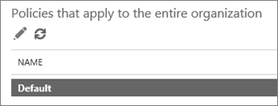

# Konfigurera säkerhetslänkar för Office 365 ATP

> [!IMPORTANT]
> Den här artikeln är avsedd för företagskunder som har [Office 365 Advanced Threat Protection](office-365-atp.md). Om du är hemanvändare som letar efter information om säkra länkar i Outlook läser du [Avancerad Outlook.com säkerhet](https://support.office.com/article/882d2243-eab9-4545-a58a-b36fee4a46e2).

[ATP-säkra länkar](atp-safe-links.md), en funktion i [Office 365 Advanced Threat Protection](office-365-atp.md) (ATP), kan skydda din organisation från skadliga länkar som används i nätfiske och andra attacker. Om du har de behörigheter som krävs [för Office &amp; 365 Security Compliance Center](permissions-in-the-security-and-compliance-center.md)kan du konfigurera ATP-principer för säkra länkar för att se till att när personer klickar på webbadresser är din organisation skyddad. Dina ATP-principer för säkra länkar kan konfigureras för att skanna webbadresser i e-post och webbadresser i Office-dokument.
  
[Nya funktioner läggs kontinuerligt till ATP](office-365-atp.md#new-features-in-office-365-atp). När nya funktioner läggs till kan du behöva göra justeringar i dina befintliga ATP Safe Links-principer.

## Vad man ska göra 
  
1. Granska förutsättningarna.
    
2. Granska och redigera standardprincipen för ATP-säkra länkar som gäller för alla. Du kan till exempel [ställa in din anpassade blockerade webbadresser för ATP-säkra länkar](set-up-a-custom-blocked-urls-list-wtih-atp.md).
    
3. Lägga till eller redigera principer för specifika e-postmottagare, inklusive [att konfigurera din anpassade "Skriv inte om" webbadresser för ATP-säkra länkar](set-up-a-custom-do-not-rewrite-urls-list-with-atp.md).
    
4. Lär dig mer om principalternativ för ATP-säkra länkar (i den här artikeln), inklusive inställningar för de senaste ändringarna.
    
## Steg 1: Granska förutsättningarna

- Kontrollera att din organisation har [Office 365 Advanced Threat Protection](office-365-atp.md).
    
- Kontrollera att du har de behörigheter som krävs. Om du vill definiera (eller redigera) ATP-principer måste du tilldelas en lämplig roll. Några exempel beskrivs i följande tabell:  

    |Roll  |Var/hur tilldelad  |
    |---------|---------|
    |Global administratör för Office 365 |Personen som registrerar sig för att köpa Office 365 är som standard en global administratör. (Se [Om Office 365-administratörsroller](https://docs.microsoft.com/office365/admin/add-users/about-admin-roles) att lära sig mer.)         |
    |Säkerhetsadministratör |Administrationscenter för[https://aad.portal.azure.com](https://aad.portal.azure.com)Azure Active Directory ( )|
    |Exchange Online Organisation Management |Administrationscenter[https://outlook.office365.com/ecp](https://outlook.office365.com/ecp)för Exchange ( )  eller    PowerShell-cmdlets (se [Exchange Online PowerShell](https://docs.microsoft.com/powershell/exchange/exchange-online/exchange-online-powershell)) |

    Mer information om roller och behörigheter finns [i Behörigheter &amp; i Office 365 Security Compliance Center](permissions-in-the-security-and-compliance-center.md).

- Kontrollera att Office-klienter är konfigurerade för att använda [modern autentisering](https://docs.microsoft.com/office365/enterprise/modern-auth-for-office-2013-and-2016) (det här är för SKYDD AV ATP-säkra länkar i Office-dokument).
    
- [Läs mer om principalternativ för ATP-säkra länkar](#step-4-learn-about-atp-safe-links-policy-options) (i den här artikeln). 

- Ge upp till 30 minuter innan den nya eller uppdaterade principen sprids till alla Office 365-datacenter.
    
## Steg 2: Definiera (eller granska) ATP Safe Links-principen som gäller för alla

När du har [Office 365 Advanced Threat Protection](office-365-atp.md)har du en standardprincip för ATP-säkra länkar som gäller för alla i organisationen. Se till att granska och vid behov redigera standardprincipen.
  
1. Gå [https://protection.office.com](https://protection.office.com) till och logga in med ditt arbets- eller skolkonto. 
    
2. Välj ** \> Principsäkra** **länkar**under **Hothantering**i den vänstra navigeringen.
    
3. I de **principer som gäller för hela organisationsavsnittet** väljer du **Standard**och väljer sedan **Redigera** (knappen Redigera liknar en penna). 
  
4. Ange en eller flera webbadresser som du vill förhindra att personer i organisationen besöker i avsnittet Blockera de **url:er** som du vill använda. (Se [Konfigurera en anpassad lista över blockerade webbadresser med hjälp av ATP-säkra länkar](set-up-a-custom-blocked-urls-list-wtih-atp.md).)
    
5. I avsnittet **Inställningar som gäller för innehåll utom e-post** väljer du (eller rensar) de alternativ du vill använda. (Vi rekommenderar att du väljer alla alternativ.) 
    
6. Välj **Save**.
    
## Steg 3: Lägga till (eller redigera) ATP-principer för säkra länkar som gäller för specifika e-postmottagare

När du har granskat (eller redigerat) standardprincipen för ATP-säkra länkar som gäller för alla är nästa steg att definiera ytterligare principer som gäller för specifika mottagare. Du kan till exempel ange undantag från standardprincipen genom att definiera en ytterligare princip. 
  
1. Gå [https://protection.office.com](https://protection.office.com) till och logga in med ditt arbets- eller skolkonto. 
    
2. Välj **Princip**i den vänstra navigeringen under **Hothantering**.
    
3. Välj **Säkra länkar**.
    
4. Välj **Ny** i avsnittet **Principer som gäller för specifika mottagare** (knappen Nytt liknar ett plustecken ( **+**)). 
  
5. Ange namn, beskrivning och inställningar för principen. **Exempel:** Om du vill ställa in en princip som heter "no direct click through" som inte tillåter personer i en viss grupp i organisationen att klicka sig vidare till en viss webbplats utan ATP Safe Links-skydd kan du ange följande rekommenderade inställningar: 
    
  - Skriv ingen direkt klickning i rutan **Namn.**
    
  - Skriv en beskrivning som i rutan Beskrivning i **rutan** Beskrivning, som om du förhindrar att personer i vissa grupper klickar sig vidare till en webbplats utan verifiering av ATP-säkra länkar.
    
  - **Välj**På i avsnittet **Välj åtgärd.**
    
  - Välj **Använd url-sökning i realtid för misstänkta länkar och länkar som pekar på filer** om du vill aktivera URL-detonation för misstänkta och filpekande webbadresser (rekommenderas). Och välj **Vänta på url-skanning för att slutföra innan du levererar meddelandet** om du bara vill att användarna ska få meddelanden efter att webbadresserna har skannats helt.
    
  - Välj **Använd säkra länkar på meddelanden som skickas inom organisationen** om du vill aktivera säkra länkar för meddelanden som skickas mellan användare inom organisationen (rekommenderas).
    
  - Välj **Tillåt inte att användaren klickar vidare till original-URL** om du inte vill att de enskilda användarna ska åsidosätta en *pågående genomsökning* eller *URL-blockerade* meddelandesidor.
    
  - (Detta är valfritt) Ange en eller flera webbadresser som anses vara säkra för organisationen i avsnittet Skriv inte om de **följande webbadresserna.** (Se [Konfigurera en anpassad "Skriv inte om" webbadresser med hjälp av ATP-säkra länkar](set-up-a-custom-do-not-rewrite-urls-list-with-atp.md))
    
  - Välj **Mottagaren i**avsnittet **Tillämpad på** och välj sedan de grupper som du vill ta med i principen. Välj **Lägg till**och välj sedan **OK**.
    
6. Välj **Save**.

> [!NOTE]
> ATP-principer för säkra länkar med högre prioritet kommer att ha företräde. Om en användare omfattas av två eller flera poliser kommer endast principen med högre prioritet att träda i kraft.
    
## Steg 4: Lär dig mer om policyalternativ för ATP-säkra länkar

När du konfigurerar eller redigerar dina ATP-principer för säkra länkar visas flera tillgängliga alternativ. Om du undrar vad dessa alternativ är, beskriver följande tabell var och en och dess effekt. Kom ihåg att det finns två huvudtyper av ATP Safe Links-principer för att definiera eller redigera:
- En [standardprincip](#default-policy-options) som gäller för alla. Och  
- ytterligare [principer för specifika mottagare](#policies-that-apply-to-specific-email-recipients) 

### Standardprincipalternativ

Standardprincipalternativ gäller för alla i organisationen.

|Det här alternativet  |Gör detta  |
|---------|---------|
| **Blockera följande webbadresser**      | Gör att din organisation kan ha en anpassad lista över webbadresser som blockeras automatiskt. När användare klickar på en WEBBADRESS i den här listan kommer de till en [varningssida](atp-safe-links-warning-pages.md) som förklarar varför webbadressen är blockerad. Mer information finns i [Konfigurera en anpassad lista över blockerade webbadresser med hjälp av Office 365 ATP-säkra länkar](set-up-a-custom-blocked-urls-list-wtih-atp.md). |
| **Office 365 ProPlus, Office för iOS och Android**      | När det här alternativet är markerat tillämpas ATP Safe Links-skydd på webbadresser i Word-, Excel- och PowerPoint-filer på Windows- eller Mac OS, e-postmeddelanden i Outlook, Office-dokument på iOS- eller Android-enheter, Visio 2016-filer på Windows och filer som är öppna i webbversionerna av Office-appar (Word, PowerPoint, Excel, Outlook och OneNote), förutsatt att användaren har loggat in på Office 365. |
| **Spåra inte när användare klickar på ATP-säkra länkar**    | När det här alternativet är markerat klickar du på data för webbadresser i Word, Excel, PowerPoint, Visio-dokument och Outlook-e-postmeddelanden lagras inte.    |
|**Låt inte användare klicka igenom ATP-säkra länkar till original-URL**   |När det här alternativet är markerat kan användarna inte gå förbi en [varningssida](atp-safe-links-warning-pages.md) till en URL som bedöms vara skadlig.    |

### Principer som gäller för specifika e-postmottagare

|Det här alternativet  |Gör detta  |
|---------|---------|
|**Av**   |Söker inte igenom webbadresser i e-postmeddelanden.    Gör att du kan definiera en undantagsregel, till exempel en regel som inte skannar webbadresser i e-postmeddelanden för en viss grupp mottagare.    |
|**På**   |Skriver om webbadresser för att dirigera om användare via ATP Safe Links-skydd när användarna klickar på webbadresser i e-postmeddelanden och aktiverar ATP-säkra länkar i Outlook (C2R) i Windows.    Kontrollerar en URL när du klickar mot en lista över blockerade eller skadliga webbadresser och utlöser en detonation av webbadressen i bakgrunden asynkront om webbadressen inte har ett giltigt rykte.    |
|**Använda url-sökning i realtid för misstänkta länkar och länkar som pekar på filer**   |När det här alternativet är markerat skannas misstänkta webbadresser och länkar som pekar på nedladdningsbart innehåll.    |
|**Vänta tills URL-skanningen har slutförts innan meddelandet levereras**   |När det här alternativet är markerat kommer meddelanden som innehåller webbadresser som ska skannas att hållas tills webbadresserna är klara med skanningen och bekräftas vara säkra innan meddelandena levereras.    |
|**Använda säkra länkar på meddelanden som skickas inom organisationen**   | När det här alternativet är tillgängligt och markerat tillämpas ATP Safe Links-skydd på e-postmeddelanden som skickas mellan personer i organisationen, förutsatt att e-postkontona finns i Office 365.    |
|**Spåra inte användarklick**   |När det här alternativet är markerat lagras inte klickdata för webbadresser i e-post från externa avsändare. URL-klickspårning för länkar i e-postmeddelanden som skickas inom organisationen stöds för närvarande inte.    |
|**Låt inte användare klicka dig vidare till original-URL**   |När det här alternativet är markerat kan användarna inte gå förbi en [varningssida](atp-safe-links-warning-pages.md) till en URL som bedöms vara skadlig.    |
|**Skriv inte om följande webbadresser**   |Lämnar webbadresser som de är. Behåller en anpassad lista över säkra webbadresser som inte behöver söka efter en viss grupp e-postmottagare i organisationen.  Se [Konfigurera en anpassad "Skriv inte om" webbadresser med hjälp av ATP-säkra länkar](set-up-a-custom-do-not-rewrite-urls-list-with-atp.md) för\*mer information, inklusive de senaste ändringarna för stöd för jokerteckenasterisker ( ).    |
   
## Nästa steg

När dina ATP Safe Links-principer är på plats kan du se hur ATP fungerar för din orgnisering genom att visa rapporter. Mer information finns i följande resurser:

- [Visa rapporter för Avancerad hotskydd i Office 365](view-reports-for-atp.md)

- [Använda Explorer i &amp; Säkerhetsefterlevnadscenter](threat-explorer.md)

Håll koll på nya funktioner som kommer till ATP. besök [Microsoft 365-färdplanen](https://www.microsoft.com/microsoft-365/roadmap?filters=O365).
