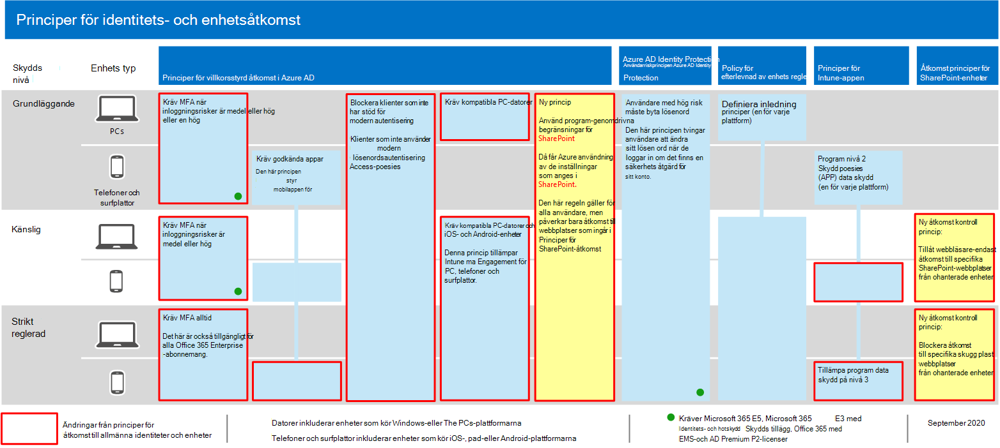
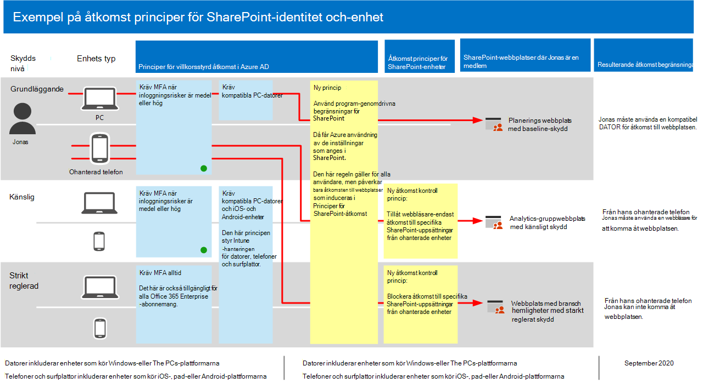

# Principrekommendationer för att skydda SharePoint-webbplatser och -filerPolicy recommendations for securing SharePoint sites and files

**Gäller för****Applies to**
- [Exchange Online ProtectionExchange Online Protection](exchange-online-protection-overview.md)
- [Microsoft Defender för Office 365 Abonnemang 1 och Abonnemang 2Microsoft Defender for Office 365 plan 1 and plan 2](office-365-atp.md)
- SharePoint OnlineSharePoint Online 

I den här artikeln beskrivs hur du implementerar rekommenderade principer för identitet och enhetsåtkomst för att skydda SharePoint och OneDrive för företag.This article describes how to implement the recommended identity and device-access policies to protect SharePoint and OneDrive for Business. Den här vägledningen bygger på de [gemensamma principerna för identitet och enhetsåtkomst.](identity-access-policies.md)This guidance builds on the [common identity and device access policies](identity-access-policies.md).

Dessa rekommendationer baseras på tre olika nivåer av säkerhet och skydd för SharePoint-filer som kan tillämpas utifrån dina behovs granularitet: **baslinje** **,** känslig och **mycket reglerad**.These recommendations are based on three different tiers of security and protection for SharePoint files that can be applied based on the granularity of your needs: **baseline**, **sensitive**, and **highly regulated**. Du kan läsa mer om dessa säkerhetsnivåer och de rekommenderade klientoperativsystemet, som refereras av dessa rekommendationer i [översikten.](microsoft-365-policies-configurations.md)You can learn more about these security tiers, and the recommended client operating systems, referenced by these recommendations in [the overview](microsoft-365-policies-configurations.md).

Förutom att implementera denna vägledning ska du se till att konfigurera SharePoint-webbplatser med rätt skyddsnivå, inklusive att ange lämpliga behörigheter för känsligt och starkt reglerat innehåll.In addition to implementing this guidance, be sure to configure SharePoint sites with the right amount of protection, including setting appropriate permissions for sensitive and highly-regulated content.

## Uppdatera vanliga principer så att de omfattar SharePoint och OneDrive för företagUpdating common policies to include SharePoint and OneDrive for Business

I följande diagram visas vilka principer som ska uppdateras från de gemensamma principerna för identitets- och enhetsåtkomst för att skydda filer i SharePoint och OneDrive.To protect files in SharePoint and OneDrive, the following diagram illustrates which policies to update from the the common identity and device access policies.

Om du inkluderade SharePoint när du skapade de gemensamma principerna behöver du bara skapa de nya principerna.If you included SharePoint when you created the common policies, you only need to create the new policies. För villkorsstyrda åtkomstprinciper inkluderar SharePoint OneDrive.For Conditional Access policies, SharePoint includes OneDrive.

Med de nya principerna implementeras enhetsskydd för känsligt och starkt reglerat innehåll genom att specifika åtkomstkrav tillämpas på SharePoint-webbplatser som du anger.The new policies implement device protection for sensitive and highly-regulated content by applying specific access requirements to SharePoint sites that you specify.

I följande tabell finns de principer som du antingen behöver granska och uppdatera eller skapa nya för SharePoint.The following table lists the policies you either need to review and update or create new for SharePoint. De vanliga principerna länkar till de associerade konfigurationsanvisningarna i [artikeln Principer för enhetsåtkomst och identiteter.](identity-access-policies.md)The common policies link to the associated configuration instructions in the [Common identity and device access policies](identity-access-policies.md) article.

|SkyddsnivåProtection level|PrinciperPolicies|Mer informationMore information|
|---|---|---|
|**Grundläggande****Baseline**|[Kräv MFA när inloggningsrisken är *medium* eller *hög*Require MFA when sign-in risk is *medium* or *high*](identity-access-policies.md#require-mfa-based-on-sign-in-risk)|Inkludera SharePoint i tilldelningen av molnappar.Include SharePoint in the assignment of cloud apps.|
||[Blockera klienter som inte har stöd för modern autentiseringBlock clients that don't support modern authentication](identity-access-policies.md#block-clients-that-dont-support-multi-factor)|Inkludera SharePoint i tilldelningen av molnappar.Include SharePoint in the assignment of cloud apps.|
||[Använda principer för APP-dataskyddApply APP data protection policies](identity-access-policies.md#apply-app-data-protection-policies)|Se till att alla rekommenderade appar finns med i listan med appar.Be sure all recommended apps are included in the list of apps. Se till att uppdatera principen för varje plattform (iOS, Android, Windows).Be sure to update the policy for each platform (iOS, Android, Windows).|
||[Kräv kompatibla PC-datorerRequire compliant PCs](identity-access-policies.md#require-compliant-pcs-but-not-compliant-phones-and-tablets)|Ta med SharePoint i listan över molnappar.Include SharePoint in list of cloud apps.|
||[Använda appanvändningsbegränsningar i SharePointUse app enforced restrictions in SharePoint](#use-app-enforced-restrictions-in-sharepoint)|Lägg till den här nya principen.Add this new policy. Det innebär att Azure Active Directory (Azure AD) använder inställningarna som anges i SharePoint.This tells Azure Active Directory (Azure AD) to use the settings specified in SharePoint. Den här principen gäller för alla användare, men påverkar bara åtkomsten till webbplatser som ingår i SharePoint-åtkomstprinciper.This policy applies to all users, but only affects access to sites included in SharePoint access policies.|
|**Känslig****Sensitive**|[Kräv MFA när inloggningsrisken är *låg,* *medelstor* eller *hög*Require MFA when sign-in risk is *low*, *medium* or *high*](identity-access-policies.md#require-mfa-based-on-sign-in-risk)|Ta med SharePoint i uppgifterna för molnappar.Include SharePoint in the assignments of cloud apps.|
||[Kräv kompatibla datorer *och* mobila enheterRequire compliant PCs *and* mobile devices](identity-access-policies.md#require-compliant-pcs-and-mobile-devices)|Ta med SharePoint i listan med molnappar.Include SharePoint in the list of cloud apps.|
||[Princip för åtkomstkontroll i SharePoint:](#sharepoint-access-control-policies)Tillåt åtkomst endast till vissa SharePoint-webbplatser från ohanterade enheter.[SharePoint access control policy](#sharepoint-access-control-policies): Allow browser-only access to specific SharePoint sites from unmanaged devices.|Det förhindrar redigering och nedladdning av filer.This prevents edit and download of files. Använd PowerShell för att ange webbplatser.Use PowerShell to specify sites.|
|**Strikt reglerad****Highly regulated**|[*Kräv* alltid MFA*Always* require MFA](identity-access-policies.md#require-mfa-based-on-sign-in-risk)|Inkludera SharePoint i tilldelningen av molnappar.Include SharePoint in the assignment of cloud apps.|
||[Princip för åtkomstkontroll i SharePoint:](#use-app-enforced-restrictions-in-sharepoint)Blockera åtkomst till vissa SharePoint-webbplatser från ohanterade enheter.[SharePoint access control policy](#use-app-enforced-restrictions-in-sharepoint): Block access to specific SharePoint sites from unmanaged devices.|Använd PowerShell för att ange webbplatser.Use PowerShell to specify sites.|
|

## Använda apptvingade begränsningar i SharePointUse app-enforced restrictions in SharePoint

Om du implementerar åtkomstkontroller i SharePoint måste du skapa den här villkorsstyrda åtkomstprincipen i Azure AD för att ange att Azure AD ska tillämpa principerna du konfigurerar i SharePoint.If you implement access controls in SharePoint, you must create this Conditional Access policy in Azure AD to tell Azure AD to enforce the policies you configure in SharePoint. Den här principen gäller för alla användare, men påverkar bara åtkomsten till de webbplatser som du anger med PowerShell när du skapar åtkomstkontroller i SharePoint.This policy applies to all users, but only affects access to the sites you specify using PowerShell when you create the access controls in SharePoint.

Information om hur du konfigurerar den här principen finns i "Blockera eller begränsa åtkomsten till specifika SharePoint-webbplatssamlingar eller OneDrive-konton" i Styra åtkomst från [ohanterade enheter.](/sharepoint/control-access-from-unmanaged-devices)To configure this policy see "Block or limit access to specific SharePoint site collections or OneDrive accounts" in [Control access from unmanaged devices](/sharepoint/control-access-from-unmanaged-devices).

## Principer för åtkomstkontroll i SharePointSharePoint access control policies

Microsoft rekommenderar att du skyddar innehåll på SharePoint-webbplatser med känsligt och starkt reglerat innehåll med enhetsåtkomstkontroller.Microsoft recommends you protect content in SharePoint sites with sensitive and highly-regulated content with device access controls. Det gör du genom att skapa en princip som anger skyddsnivån och webbplatserna som skyddet ska gälla för.You do this by creating a policy that specifies the level of protection and the sites to apply the protection to.

- Känsliga webbplatser: Tillåt åtkomst endast till webbläsare.Sensitive sites: Allow browser-only access. Det förhindrar att användare redigerar och laddar ned filer.This prevents users from editing and downloading files.
- Starkt reglerade webbplatser: Blockera åtkomst från ohanterade enheter.Highly regulated sites: Block access from unmanaged devices.

Läs "Blockera eller begränsa åtkomsten till specifika SharePoint-webbplatssamlingar eller OneDrive-konton" i Styra [åtkomst från ohanterade enheter.](/sharepoint/control-access-from-unmanaged-devices)See "Block or limit access to specific SharePoint site collections or OneDrive accounts" in [Control access from unmanaged devices](/sharepoint/control-access-from-unmanaged-devices).

## Så här fungerar de här principerna tillsammansHow these policies work together

Det är viktigt att förstå att SharePoint-webbplatsbehörigheter vanligtvis baseras på affärs behov av åtkomst till webbplatser.It's important to understand that SharePoint site permissions are typically based on business need for access to sites. De här behörigheterna hanteras av webbplatsägare och kan vara mycket dynamiska.These permissions are managed by site owners and can be highly dynamic. Genom att använda sharePoint-principer för enhetsåtkomst skyddas webbplatserna, oavsett om användare tilldelas till en Azure AD-grupp som är kopplad till grundläggande, känslig eller starkt reglerad skydd.Using SharePoint device access policies ensures protection to these sites, regardless of whether users are assigned to an Azure AD group associated with baseline, sensitive, or highly regulated protection.

Följande bild visar ett exempel på hur åtkomstprinciper för SharePoint-enheter skyddar åtkomsten till webbplatser för en användare.The following illustration provides an example of how SharePoint device access policies protect access to sites for a user.

[Visa en större version av den här bildenSee a larger version of this image](https://github.com/MicrosoftDocs/microsoft-365-docs/raw/public/microsoft-365/media/microsoft-365-policies-configurations/SharePoint-rules-scenario.png)

James har grundläggande principer för villkorsstyrd åtkomst som tilldelats, men han kan ges åtkomst till SharePoint-webbplatser med känsligt eller starkt reglerat skydd.James has baseline Conditional Access policies assigned, but he can be given access to SharePoint sites with sensitive or highly-regulated protection.

- Om James använder en känslig eller starkt reglerad webbplats är han medlem i sin dator, men hans åtkomst beviljas så länge hans dator är kompatibel.If James accesses a sensitive or highly-regulated site he is a member of using his PC, his access is granted as long as his PC is compliant.
- Om James öppnar en känslig webbplats är han medlem i att använda sin ohanterade telefon, vilket är tillåtet för grundläggande användare, han kommer att få webbläsaråtkomst till den känsliga webbplatsen på grund av principen för enhetsåtkomst som konfigurerats för den här webbplatsen.If James accesses a sensitive site he is a member of using his unmanaged phone, which is allowed for baseline users, he will receive browser-only access to the sensitive site due to the device access policy configured for this site.
- Om James använder en hårt reglerad webbplats är han medlem i sin ohanterade telefon, så blockeras han på grund av åtkomstprincipen som konfigurerats för den här webbplatsen.If James accesses a highly regulated site he is a member of using his unmanaged phone, he will be blocked due to the access policy configured for this site. Han kan bara komma åt den här webbplatsen på en hanterad och kompatibel dator.He can only access this site using his managed and compliant PC.

## Nästa stegNext step

Konfigurera principer för villkorsstyrd åtkomst för:Configure Conditional Access policies for:

- [Microsoft TeamsMicrosoft Teams](teams-access-policies.md)
- [Exchange OnlineExchange Online](secure-email-recommended-policies.md)