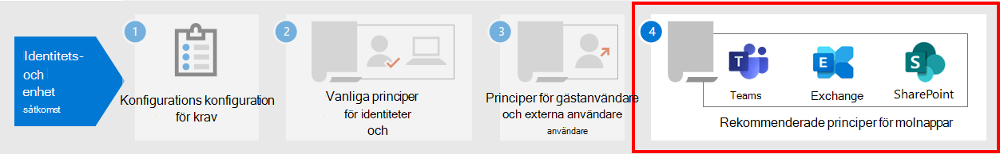

# Principrekommendationer för att skydda chattar, grupper och filer i TeamsPolicy recommendations for securing Teams chats, groups, and files

I den här artikeln beskrivs hur du implementerar rekommenderade principer för identitet och enhetsåtkomst för att skydda chattar, grupper och innehåll i Microsoft Teams, till exempel filer och kalendrar.This article describes how to implement the recommended identity and device-access policies to protect Microsoft Teams chats, groups, and content such as files and calendars. Den här vägledningen bygger på [gemensamma principer för identitet och enhetsåtkomst,](identity-access-policies.md)med ytterligare information som är Teams-specifik.This guidance builds on the [common identity and device access policies](identity-access-policies.md), with additional information that's Teams-specific. Eftersom Teams är integrerat med våra andra produkter, se även policyrekommendationer för att skydda [SharePoint-webbplatser](sharepoint-file-access-policies.md) och filer och [principrekommendationer för att skydda e-post.](secure-email-recommended-policies.md)Because Teams integrates with our other products, also see [Policy recommendations for securing SharePoint sites and files](sharepoint-file-access-policies.md) and [Policy recommendations for securing email](secure-email-recommended-policies.md).

De här rekommendationerna baseras på tre olika nivåer av säkerhet och skydd för Teams som kan tillämpas utifrån dina behovs granularitet: baslinje, känslig och mycket reglerad.These recommendations are based on three different tiers of security and protection for Teams that can be applied based on the granularity of your needs: baseline, sensitive, and highly regulated. Du kan läsa mer om dessa säkerhetsnivåer och de rekommenderade principerna som refereras av dessa rekommendationer i konfigurationerna för åtkomst [till identitet och enhet.](microsoft-365-policies-configurations.md)You can learn more about these security tiers and the recommended policies referenced by these recommendations in the [Identity and device access configurations](microsoft-365-policies-configurations.md).

Fler rekommendationer som är specifika för Distribution av Teams finns i den här artikeln för att täcka specifika autentiseringsförhållanden, bland annat för användare utanför organisationen.More recommendations specific to Teams deployment are included in this article to cover specific authentication circumstances, including for users outside your organization. Du måste följa de här instruktionerna för en fullständig säkerhetsupplevelse.You will need to follow this guidance for a complete security experience.

## Komma igång med Teams före andra beroende tjänsterGetting started with Teams before other dependent services

Du behöver inte aktivera beroende tjänster för att komma igång med Microsoft Teams.You don't need to enable dependent services to get started with Microsoft Teams. De här tjänsterna fungerar bara.These services will all "just work." Du behöver dock vara beredd på att hantera följande tjänstrelaterade element:However, you do need to be prepared to manage the following service-related elements:

- Microsoft 365-grupperMicrosoft 365 groups
- SharePoint-gruppwebbplatserSharePoint team sites
- OneDrive för företagOneDrive for Business
- Exchange-postlådorExchange mailboxes
- Strömma videor och Planner-planer (om de här tjänsterna är aktiverade)Stream videos and Planner plans (if these services are enabled)

## Uppdatera vanliga principer för att inkludera TeamsUpdating common policies to include Teams

För att skydda chatt, grupper och innehåll i Teams visar följande diagram vilka principer som ska uppdateras från de gemensamma principerna för identitets- och enhetsåtkomst.To protect chat, groups and content in Teams, the following diagram illustrates which policies to update from the the common identity and device access policies. Se till att Teams och beroende tjänster ingår i tilldelning av molnappar för varje princip som ska uppdateras.For each policy to update, make sure that Teams and dependent services are included in the assignment of cloud apps.

[Visa en större version av den här bildenSee a larger version of this image](https://github.com/MicrosoftDocs/microsoft-365-docs/raw/public/microsoft-365/media/microsoft-365-policies-configurations/identity-access-ruleset-teams.png)

Dessa tjänster är de beroende tjänster som ska ingå i tilldelningen av molnappar för Teams:These services are the dependent services to include in the assignment of cloud apps for Teams:

- Microsoft TeamsMicrosoft Teams
- SharePoint och OneDrive för företagSharePoint and OneDrive for Business
- Exchange OnlineExchange Online
- Skype för företag onlineSkype for Business Online
- Microsoft Stream (mötesinspelningar)Microsoft Stream (meeting recordings)
- Microsoft Planner (uppgifter och planeringsdata)Microsoft Planner (Planner tasks and plan data)

I den här tabellen visas de principer som behöver granskas igen och länkar till varje princip med gemensamma principer för identitets- och enhetsåtkomst, som har den bredare principuppsättningen för alla Office-program.This table lists the policies that need to be revisited and links to each policy in the [common identity and device access policies](identity-access-policies.md), which has the wider policy set for all Office applications.

|SkyddsnivåProtection level|PrinciperPolicies|Mer information om Teams-implementeringFurther information for Teams implementation|
|---|---|---|
|**Grundläggande****Baseline**|[Kräv MFA när inloggningsrisken är *medelhög* eller *hög*Require MFA when sign-in risk is *medium* or *high*](identity-access-policies.md#require-mfa-based-on-sign-in-risk)|Se till att Teams och beroende tjänster ingår i listan med appar.Be sure Teams and dependent services are included in the list of apps. Teams har även gäståtkomst- och externa åtkomstregler att ta hänsyn till. Du får lära dig mer om dessa regler senare i den här artikeln.Teams has Guest Access and External Access rules to consider as well, you'll learn more about these rules later in this article.|
||[Blockera klienter som inte har stöd för modern autentiseringBlock clients that don't support modern authentication](identity-access-policies.md#block-clients-that-dont-support-multi-factor)|Ta med Teams och beroende tjänster i tilldelningen av molnappar.Include Teams and dependent services in the assignment of cloud apps.|
||[Användare med hög risk måste byta lösenordHigh risk users must change password](identity-access-policies.md#high-risk-users-must-change-password)|Tvingar Teams-användare att ändra sitt lösenord när de loggar in om högriskaktivitet identifieras för deras konto.Forces Teams users to change their password when signing in if high-risk activity is detected for their account. Se till att Teams och beroende tjänster ingår i listan med appar.Be sure Teams and dependent services are included in the list of apps.|
||[Använda principer för APP-dataskyddApply APP data protection policies](identity-access-policies.md#apply-app-data-protection-policies)|Se till att Teams och beroende tjänster ingår i listan med appar.Be sure Teams and dependent services are included in the list of apps. Uppdatera principen för varje plattform (iOS, Android, Windows).Update the policy for each platform (iOS, Android, Windows).|
||[Definiera principer för enhetsefterlevnadDefine device compliance policies](identity-access-policies.md#define-device-compliance-policies)|Inkludera Teams och beroende tjänster i den här policyn.Include Teams and dependent services in this policy.|
||[Kräv kompatibla PC-datorerRequire compliant PCs](identity-access-policies.md#require-compliant-pcs-but-not-compliant-phones-and-tablets)|Inkludera Teams och beroende tjänster i den här policyn.Include Teams and dependent services in this policy.|
|**Känslig****Sensitive**|[Kräv MFA när inloggningsrisken är *låg,* *medel* eller *hög*Require MFA when sign-in risk is *low*, *medium* or *high*](identity-access-policies.md#require-mfa-based-on-sign-in-risk)|Teams har även gäståtkomst- och externa åtkomstregler att ta hänsyn till. Du får lära dig mer om dessa regler senare i den här artikeln.Teams has Guest Access and External Access rules to consider as well, you'll learn more about these rules later in this article. Inkludera Teams och beroende tjänster i den här policyn.Include Teams and dependent services in this policy.|
||[Kräv kompatibla datorer *och* mobila enheterRequire compliant PCs *and* mobile devices](identity-access-policies.md#require-compliant-pcs-and-mobile-devices)|Inkludera Teams och beroende tjänster i den här policyn.Include Teams and dependent services in this policy.|
|**Strikt reglerad****Highly regulated**|[*Kräv* alltid MFA*Always* require MFA](identity-access-policies.md#require-mfa-based-on-sign-in-risk)|Oavsett användaridentitet används MFA av organisationen.Regardless of user identity, MFA will be used by your organization. Inkludera Teams och beroende tjänster i den här policyn.Include Teams and dependent services in this policy. |
|

## Arkitektur för Teams-beroende tjänsterTeams dependent services architecture

Som referens illustrerar följande diagram de tjänster Teams förlitar sig på.For reference, the following diagram illustrates the services Teams relies on. Mer information och illustrationer finns i [Microsoft Teams och relaterade produktivitetstjänster i Microsoft 365 för IT-arkitekter.](../../solutions/productivity-illustrations.md)For more information and illustrations, see [Microsoft Teams and related productivity services in Microsoft 365 for IT architects](../../solutions/productivity-illustrations.md).

[Visa en större version av den här bildenSee a larger version of this image](https://github.com/MicrosoftDocs/microsoft-365-docs/raw/public/microsoft-365/media/microsoft-365-policies-configurations/identity-access-logical-architecture-teams.png)

## Gäst- och extern åtkomst för TeamsGuest and external access for Teams

Microsoft Teams definierar följande åtkomsttyper:Microsoft Teams defines the following access types:

- **Gäståtkomst** använder ett Azure AD B2B-konto för en gäst eller extern användare som kan läggas till som medlem i ett team och har all behörighet till teamets kommunikation och resurser.**Guest access** uses an Azure AD B2B account for a guest or external user that can be added as a member of a team and have all permissioned access to the communication and resources of the team.

- **Extern åtkomst** är för en extern användare som inte har ett Azure AD B2B-konto.**External access** is for an external user that does not have an Azure AD B2B account. Extern åtkomst kan omfatta inbjudningar och deltagande i samtal, chattar och möten, men omfattar inte teammedlemskap och åtkomst till teamets resurser.External access can include invitations and participation in calls, chats, and meetings, but does not include team membership and access to the resources of the team.

Villkorsstyrda åtkomstprinciper gäller endast för gäståtkomst i Teams eftersom det finns ett motsvarande Azure AD B2B-konto.Conditional Access policies only apply to guest access in Teams because there is a corresponding Azure AD B2B account.

<!--
In Azure AD, guest and external users are the same. The user type for both of these is Guest. Guest users are B2B users. Microsoft Teams differentiates between guest users and external users in the app. While it's important to understand how each of these are treated in Teams, both types of users are B2B users in Azure AD and the recommended policies for B2B users apply to both.

-->

Rekommenderade principer för att tillåta åtkomst för gästanvändare och externa användare med ett B2B-konto för Azure AD finns i Principer för att tillåta åtkomst till gäst- och [externa B2B-konton.](identity-access-policies-guest-access.md)For recommended policies to allow access for guest and external users with an Azure AD B2B account, see [Policies for allowing guest and external B2B account access](identity-access-policies-guest-access.md).

### Gäståtkomst i TeamsGuest access in Teams

Förutom principerna för användare som är interna i ditt företag eller din organisation kan administratörer göra det möjligt för gäståtkomst att tillåta, per användare, att personer som inte finns i företaget eller organisationen får åtkomst till Teams-resurser och interagera med interna personer för saker som gruppkonversationer, chatt och möten.In addition to the policies for users who are internal to your business or organization, administrators may enable guest access to allow, on a user-by-user basis, people who are external to your business or organization to access Teams resources and interact with internal people for things like group conversations, chat, and meetings.

Mer information om gäståtkomst och hur du implementerar den finns i [Teams gäståtkomst.](https://docs.microsoft.com/microsoftteams/guest-access)For more information about guest access and how to implement it, see  [Teams guest access](https://docs.microsoft.com/microsoftteams/guest-access).

### Extern åtkomst i TeamsExternal access in Teams

Extern åtkomst kan ibland förväxlas med gäståtkomst, så det är viktigt att vara tydlig med att dessa två icke-interna åtkomstmekanismer är olika typer av åtkomst.External access is sometimes confused with guest access, so it's important to be clear that these two non-internal access mechanisms are different types of access.

Extern åtkomst är ett sätt för Teams-användare från en hel extern domän att hitta, ringa, chatta och konfigurera möten med dina användare i Teams.External access is a way for Teams users from an entire external domain to find, call, chat, and set up meetings with your users in Teams. Teams-administratörer konfigurerar extern åtkomst på organisationsnivå.Teams administrators configure external access at the organization level. Mer information finns i [Hantera extern åtkomst i Microsoft Teams.](https://docs.microsoft.com/microsoftteams/manage-external-access)For more information, see [Manage external access in Microsoft Teams](https://docs.microsoft.com/microsoftteams/manage-external-access).

Externa användare har mindre åtkomst och funktionalitet än en person som har lagts till via gäståtkomst.External access users have less access and functionality than an individual who's been added via guest access. Externa användare kan till exempel chatta med interna användare med Teams men inte komma åt teamkanaler, filer eller andra resurser.For example, external access users can chat with your internal users with Teams but cannot access team channels, files, or other resources.

För extern åtkomst används inte Azure AD B2B-användarkonton och villkorsstyrda åtkomstprinciper används därför inte.External access does not use Azure AD B2B user accounts and therefore does not use Conditional Access policies.

## Principer för TeamsTeams policies

Utöver de vanliga principerna som anges ovan finns det Teams-specifika principer som kan och bör konfigureras för att hantera olika Teams-funktioner.Outside of the common policies listed above, there are Teams-specific policies that can and should be configured to manage various Teams functionalities.

### Principer för team och kanalerTeams and channels policies

Team och kanaler är två vanliga element i Microsoft Teams och det finns principer som du kan använda för att styra vad användarna kan och inte kan göra när de använder team och kanaler.Teams and channels are two commonly used elements in Microsoft Teams, and there are policies you can put in place to control what users can and cannot do when using teams and channels. Även om du kan skapa ett globalt team, om organisationen har 5 000 användare eller mindre, är det troligt att det är bra att ha mindre team och kanaler för specifika ändamål, i enlighet med organisationens behov.While you can create a global team, if your organization has 5000 users or less, you are likely to find it helpful to have smaller teams and channels for specific purposes, in-line with your organizational needs.

Vi rekommenderar att du ändrar standardprincipen eller skapar anpassade principer och du kan läsa mer om hur du hanterar principer på den här länken: Hantera [teampolicyer i Microsoft Teams.](https://docs.microsoft.com/microsoftteams/teams-policies)Changing the default policy or creating custom policies would be recommended, and you can learn more about managing your policies at this link: [Manage teams policies in Microsoft Teams](https://docs.microsoft.com/microsoftteams/teams-policies).

### Principer för meddelandenMessaging policies

Meddelanden, eller chatt, kan också hanteras genom den globala standardprincipen eller med anpassade principer, och det kan hjälpa användarna att kommunicera med varandra på ett sätt som är lämpligt för din organisation.Messaging, or chat, can also be managed through the default global policy, or through custom policies, and this can help your users communicate with one another in a way that's appropriate for your organization. Den här informationen kan granskas under Hantera [principer för meddelanden i Teams.](https://docs.microsoft.com/microsoftteams/messaging-policies-in-teams)This information can be reviewed at [Managing messaging policies in Teams](https://docs.microsoft.com/microsoftteams/messaging-policies-in-teams).

### Mötes principerMeeting policies

Ingen diskussion om Teams skulle vara fullständig utan planering och implementering av principer kring Teams-möten.No discussion of Teams would be complete without planning and implementing policies around Teams meetings. Möten är en viktig del av Teams, så att personer formellt kan träffas och presentera för många användare samtidigt och för att dela relevant innehåll för mötet.Meetings are an essential component of Teams, allowing people to formally meet and present to many users at once, and to share content relevant to the meeting. Det är viktigt att ange rätt principer för organisationen kring möten.Setting the right policies for your organization around meetings is essential.

Mer information finns i Hantera [mötesprinciper i Teams.](https://docs.microsoft.com/microsoftteams/meeting-policies-in-teams)For more information, review [Manage meeting policies in Teams](https://docs.microsoft.com/microsoftteams/meeting-policies-in-teams).

### AppbehörighetsprinciperApp permission policies

Med Teams kan du också använda appar på olika platser, till exempel kanaler eller personliga chattar.Teams also allows you to use apps in various places, such as channels or personal chats. Det finns principer för vilka appar som kan läggas till och användas och var det är viktigt för att underhålla en innehållsrik miljö som också är säker.Having policies around what apps can be added and used, and where, is essential to maintaining a content-rich environment that is also secure.

Mer information om appbehörighetsprinciper finns i Hantera principer [för appbehörigheter i Microsoft Teams.](https://docs.microsoft.com/microsoftteams/teams-app-permission-policies)For more reading about App Permission Policies, check out [Manage app permission policies in Microsoft Teams](https://docs.microsoft.com/microsoftteams/teams-app-permission-policies).

## Nästa stegNext steps

Konfigurera villkorsstyrda åtkomstprinciper för:Configure Conditional Access policies for:

- [Exchange OnlineExchange Online](secure-email-recommended-policies.md)
- [SharePointSharePoint](sharepoint-file-access-policies.md)
