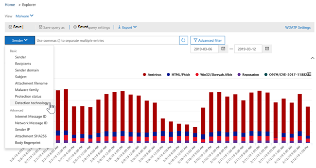
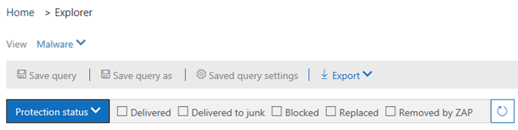
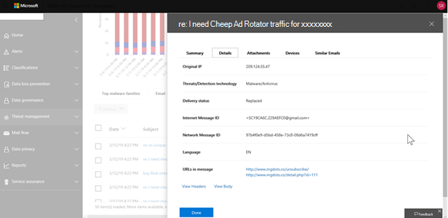
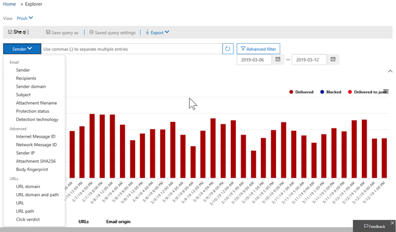
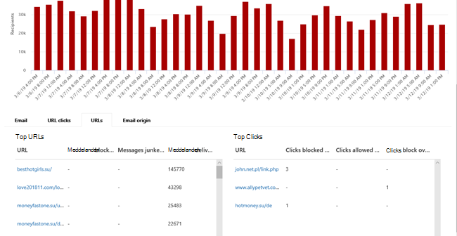
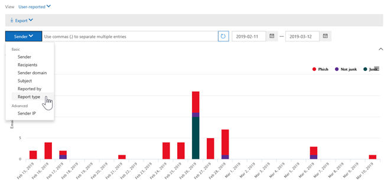
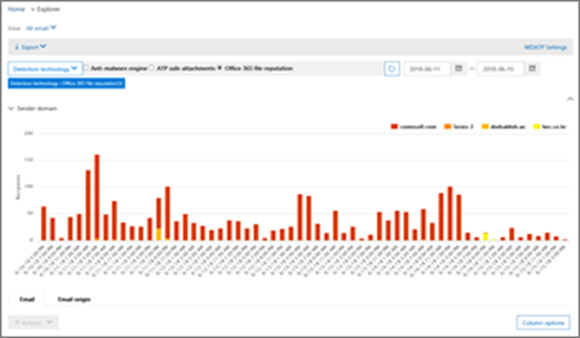

# Vyer i Threat Explorer och identifieringar i real tid

[!INCLUDE [Microsoft 365 Defender rebranding](../includes/microsoft-defender-for-office.md)]

[Threat Explorer](threat-explorer.md) (och rapporten om identifiering av real tid) är ett kraftfullt, nära real tids verktyg som hjälper säkerhets åtgärder att undersöka och reagera på hot i säkerhets &amp; Center. Utforskaren (och rapporten real tids identifiering) visar information om misstänkt skadlig program vara och Phish i e-post och filer i Office 365 samt andra säkerhetshot och risker för din organisation.

- Om du har [Office 365](office-365-atp.md) -abonnemang för avancerat skydd (ATP) 2 har du Explorer.
- Om du har Office 365 ATP-abonnemang 1 har du real tids identifiering.

När du först öppnar Utforskaren (eller rapporten real tids identifiering) visas e-postidentifiering av skadlig program vara under de senaste sju dagarna. Den här rapporten kan även Visa identifieringar av ATP, till exempel skadlig URL-adresser som identifieras av [säkra länkar](atp-safe-links.md)och skadliga filer som identifieras av [säkra bifogade](atp-safe-attachments.md)filer. Den här rapporten kan ändras för att visa data för de senaste 30 dagarna (med ett ATP-betalat abonnemang). Prov abonnemang kommer endast att omfatta data för de senaste sju dagarna.

****

|Prenumerationsvy|Nytta|Dagar med data|
|---|---|---|
|ATP-test|Identifiering i realtid|borttagning|
|ATP P1 betalt|Identifiering i realtid|halvtimme|
|ATP P1-betal test för ATP|Hotutforskaren|borttagning|
|ATP-prov|Hotutforskaren|borttagning|
|ATP-betalat|Hotutforskaren|halvtimme|
|

Använd **Visa** -menyn för att ändra vilken information som visas. Med knapp beskrivningar kan du bestämma vilken vy som ska användas.

När du har valt en vy kan du använda filter och ställa in frågor för att utföra ytterligare analyser. I följande avsnitt får du en kort översikt över de olika vyer som är tillgängliga i Utforskaren (eller i real tid).

## > skadlig program vara

Om du vill visa rapporten klickar du på **Visa**  >  **e-**  >  **postskadlig kod**i Utforskaren (eller i real tid). I den här vyn visas information om e-postmeddelanden som identifierats som innehåll ande malware.

Klicka på **avsändare** för att öppna listan över visnings alternativ. Använd den här listan för att visa data efter avsändare, mottagare, avsändare, ämne, identifierings teknik, skydds status och mer.

Om du till exempel vill se vilka åtgärder som har utförts på identifierade e-postmeddelanden väljer du **skydds status** i listan. Välj ett alternativ och klicka sedan på knappen Uppdatera för att tillämpa filtret på rapporten.

Visa mer information om specifika meddelanden under diagrammet. När du markerar ett objekt i listan öppnas ett alternativ för att få mer information om det markerade objektet.

## E-> Phish

Om du vill visa rapporten går du till Explorer (eller real tids identifiering) och väljer **Visa**  >  **e-**  >  **Phish**. I den här vyn visas e-postmeddelanden som identifieras som nätfiske-försök.

Klicka på **avsändare** för att öppna listan över visnings alternativ. Använd den här listan för att visa data efter avsändare, mottagare, avsändarens domän, avsändarens IP, URL-domän, klicka på Verdict och mycket mer.

Om du till exempel vill se vilka åtgärder som vidtogs när personer klickade på URL-adresser som har identifierats som nätfiske-försök väljer du **Klicka på Verdict** i listan, väljer ett eller flera alternativ och klickar sedan på knappen Uppdatera.

Under diagrammet kan du Visa mer information om specifika meddelanden, URL-musklick, URL: er och e-postursprung.

När du markerar ett objekt i listan, till exempel en webb adress som upptäckts, öppnas en dialog ruta för att ta reda på mer om det markerade objektet.

## Skicka e-post >

Om du vill visa den här rapporten går du till Explorer (eller real tids identifieringar) och väljer **Visa**  >  **e-**  >  **postinlägg**. I den här vyn visas e-post som användare har rapporterat som skräp post, inte skräp post eller nätfiske.

Klicka på **avsändare** för att öppna listan över visnings alternativ. Använd den här listan för att visa information efter avsändare, mottagare, rapport typ (användarens kontroll att e-postmeddelandet var skräp, inte skräp post eller Phish) och mycket mer.

Om du till exempel vill visa information om e-postmeddelanden som rapporter ATS som nätfiske-försök klickar du på **avsändarens**  >  **typ**, väljer **Phish**och klickar sedan på knappen Uppdatera.

Under diagrammet visas mer information om specifika e-postmeddelanden, till exempel ämnes raden, avsändarens IP-adress, användaren som rapporterade meddelandet som skräp post, inte skräp post eller Phish.

Välj ett objekt i listan för att visa ytterligare information.

## E-posta > all e-post

Om du vill visa rapporten klickar du på **Visa**  >  **e-** post i Utforskaren  >  **All mail**. I den här vyn visas en uppkopplings aktivitet med e-postaktivitet, inklusive e-post som identifieras som skadlig på grund av nätfiske eller skadlig program vara (vanlig e-post, spam och Mass utskick).

> [!NOTE]
> Om du får ett fel meddelande som läser upp **för mycket data**kan du lägga till ett filter och, om det behövs, begränsa det datum intervall du visar.

Om du vill använda ett filter väljer du **avsändare**, markerar ett objekt i listan och klickar sedan på knappen Uppdatera. I vårt exempel använde vi **identifierings teknologi** som ett filter (det finns flera tillgängliga alternativ). Visa information efter avsändare, avsändarens domän, mottagare, ämne, bifogade filer och skadlig program vara, skydds status (åtgärder som vidtas av funktioner och principer för hotets skydd i Office 365), identifierings teknologi (hur skadlig program vara upptäcktes) och mycket mer.

Under diagrammet kan du Visa mer information om specifika e-postmeddelanden, till exempel ämnesrad, mottagare, avsändare, status och så vidare.

## Innehålls > skadlig program vara

Om du vill visa rapporten i Utforskaren (eller i real tid) väljer du **Visa**  >  **Content**  >  **skadlig program vara**. I den här vyn visas filer som har identifierats som skadliga av [Office 365 Avancerat skydd i SharePoint Online, OneDrive för företag och Microsoft Teams](atp-for-spo-odb-and-teams.md).

Visa information från skadlig program vara, identifierings teknologi (hur skadlig kod har identifierats) och arbets belastning (OneDrive, SharePoint eller teams).

Under diagrammet kan du Visa mer information om specifika filer, till exempel fil namn, arbets belastning, fil storlek, som senast ändrade filen och mycket mer.

## Klicka-och-filtrera-funktioner

Med Explorer (och real tids identifieringar) kan du använda ett filter i ett klick. Klicka på ett objekt i förklaringen så blir objektet ett filter för rapporten. Anta till exempel att vi tittar på vyn mot skadlig program vara i Utforskaren:

Om du klickar på **ATP-sprängor** i det här diagrammet visas en vy som här:

I den här vyn visar vi nu data för filer som har sprängts med [säkra bifogade](atp-safe-attachments.md)filer. Under diagrammet kan vi se information om specifika e-postmeddelanden med bifogade filer som upptäcktes av säkra bifogade filer.

Om du markerar ett eller flera objekt aktive ras **Åtgärds** menyn, som innehåller flera alternativ som du kan välja för.

Möjligheten att filtrera i ett klick och navigera till specifika uppgifter gör att du kan spara pengar.

## Frågor och filter

Utforskaren (samt rapporter i real tid) innehåller flera kraftfulla filter och fråge funktioner som gör att du kan visa detaljer, till exempel Top riktade användare, de viktigaste, identifierings teknologin och mer. I alla typer av rapporter finns det flera olika sätt att visa och utforska data.

> [!IMPORTANT]
> Använd inte jokertecken, till exempel en asterisk eller ett frågetecken, i fråge fältet för Explorer (eller real tids identifiering). När du söker i **ämnes fältet** för e-postmeddelanden kommer Explorer (eller real tids identifiering) att utföra delvis matchande och ge resultat som liknar en sökning med jokertecken.
