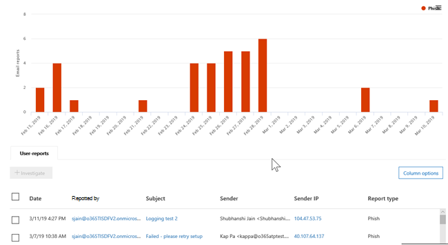

# Vyer i Threat Explorer och identifieringar i realtidViews in Threat Explorer and real-time detections

[Threat Explorer](threat-explorer.md) (och rapporten identifiering i realtid) är ett kraftfullt, nära realtidsverktyg som hjälper säkerhetsgrupper &amp; att undersöka och svara på hot i Security Compliance Center.[Threat Explorer](threat-explorer.md) (and the real-time detections report) is a powerful, near real-time tool to help Security Operations teams investigate and respond to threats in the Security &amp; Compliance Center. Explorer (och rapporten identifiering i realtid) visar information om misstänkt skadlig kod och phish i e-post och filer i Office 365, samt andra säkerhetshot och risker för din organisation.Explorer (and the real-time detections report) displays information about suspected malware and phish in email and files in Office 365, as well as other security threats and risks to your organization. 

- Om du har Atp-abonnemang [(Office 365 Advanced Threat Protection)](office-365-atp.md) 2 har du Explorer.If you have [Office 365 Advanced Threat Protection](office-365-atp.md) (ATP) Plan 2, then you have Explorer.
- Om du har Office 365 ATP-abonnemang 1 har du identifiering i realtid.If you have Office 365 ATP Plan 1, then you have real-time detections.

När du öppnar Explorer (eller rapporten identifiering i realtid) visas identifiering av skadlig programvara för e-post under de senaste 7 dagarna.When you first open Explorer (or the real-time detections report), the default view shows email malware detections for the past 7 days. Den här rapporten kan också visa ATP-identifieringar, till exempel skadliga webbadresser som identifierats av [säkra länkar](atp-safe-links.md)och skadliga filer som [upptäckts](atp-safe-attachments.md)av säkra bilagor .This report can also show ATP detections, such as malicious URLs detected by [Safe Links](atp-safe-links.md), and malicious files detected by [Safe Attachments](atp-safe-attachments.md). Den här rapporten kan ändras för att visa data under de senaste 30 dagarna (om du inte använder en utvärderingsprenumeration).This report can be modified to show data for the past 30 days (unless you are using a trial subscription). Utvärderingsprenumerationer innehåller data endast under de senaste sju dagarna.Trial subscriptions will include data for the past seven days only.

Använd **Visa-menyn** för att ändra vilken information som visas.Use the **View** menu to change what information is displayed. Verktygstips hjälper dig att avgöra vilken vy du ska använda.Tooltips help you determine which view to use.
  

När du har valt en vy kan du använda filter och ställa in frågor för att utföra ytterligare analys.Once you have selected a view, you can apply filters and set up queries to conduct further analysis. Följande avsnitt ger en kort översikt över de olika vyer som finns i Explorer (eller identifieringi realtid).The following sections provide a brief overview of the various views available in Explorer (or real-time detections).  

## E-post > malwareEmail > Malware

Om du vill visa den här rapporten i Explorer (eller identifiering i realtid) väljer du **Visa** > **skadlig e-post** > **Malware**.To view this report, in Explorer (or real-time detections), choose **View** > **Email** > **Malware**. Den här vyn visar information om e-postmeddelanden som har identifierats som innehåller skadlig kod.This view shows information about email messages that were identified as containing malware.  

 

Klicka på **Avsändare** för att öppna listan med visningsalternativ.Click **Sender** to open your list of viewing options. Använd den här listan om du vill visa data efter avsändare, mottagare, avsändare, ämne, identifieringsteknik, skyddsstatus med mera.Use this list to view data by sender, recipients, sender domain, subject, detection technology, protection status, and more. 

Om du till exempel vill se vilka åtgärder som har vidtagits för identifierade e-postmeddelanden väljer du **Skyddsstatus** i listan.For example, to see what actions were taken on detected email messages, choose **Protection status** in the list. Välj ett alternativ och klicka sedan på knappen Uppdatera för att använda filtret i rapporten.Select an option, and then click the Refresh button to apply that filter to your report.

Under diagrammet visar du mer information om specifika meddelanden.Below the chart, view more details about specific messages. När du markerar ett objekt i listan öppnas ett utfällbart fönster där du kan läsa mer om det objekt du valde.When you select an item in the list, a fly-out pane opens, where you can learn more about the item you selected. 

## E-post > PhishEmail > Phish

Om du vill visa den här rapporten i Explorer (eller identifiering i realtid) väljer du **Visa** > **postphish\*\*\*\*Email** > .To view this report, in Explorer (or real-time detections), choose **View** > **Email** > **Phish**. I den här vyn visas e-postmeddelanden som identifierats som nätfiskeförsök.This view shows email messages identified as phishing attempts.  

 

Klicka på **Avsändare** för att öppna listan med visningsalternativ.Click **Sender** to open your list of viewing options. Använd den här listan om du vill visa data efter avsändare, mottagare, avsändardomän, avsändares IP, URL-domän, klicka på dom med mera.Use this list to view data by sender, recipients, sender domain, sender IP, URL domain, click verdict, and more. 

Om du till exempel vill se vilka åtgärder som har vidtagits när personer klickade på webbadresser som identifierats som nätfiskeförsök väljer du **Klicka på dom** i listan, väljer ett eller flera alternativ och klickar sedan på knappen Uppdatera.For example, to see what actions were taken when people clicked on URLs that were identified as phishing attempts, choose **Click verdict** in the list, select one or more options, and then click the Refresh button.

Under diagrammet visar du mer information om specifika meddelanden, URL-klick, webbadresser och e-postursprung.Below the chart, view more details about specific messages, URL clicks, URLs, and email origin. 

När du markerar ett objekt i listan, till exempel en URL som upptäcktes, öppnas ett utfällbart fönster där du kan läsa mer om det objekt du valde.When you select an item in the list, such as a URL that was detected, a fly-out pane opens, where you can learn more about the item you selected. 

## E-post > inlagorEmail > Submissions

Om du vill visa den här rapporten i Explorer (eller identifiering i realtid) väljer du **Visa** > **e-postinlämningar** > **Submissions**.To view this report, in Explorer (or real-time detections), choose **View** > **Email** > **Submissions**. I den här vyn visas e-post som användare har rapporterat som skräppost, inte skräppost eller nätfiske.This view shows email that users have reported as junk, not junk, or phishing email. 

 

Klicka på **Avsändare** för att öppna listan med visningsalternativ.Click **Sender** to open your list of viewing options. Använd den här listan om du vill visa information av avsändare, mottagare, rapporttyp (användarens beslutsamhet att e-postmeddelandet var skräp, inte skräp eller phish) med mera.Use this list to view information by sender, recipients, report type (the user's determination that the email was junk, not junk, or phish), and more. 

Om du till exempel vill visa information om e-postmeddelanden som har rapporterats som nätfiskeförsök klickar du på typen **Avsändares** > **rapport,** väljer **Phish**och sedan på knappen Uppdatera.For example, to view information about email messages that were reported as phishing attempts, click **Sender** > **Report type**, select **Phish**, and then click the Refresh button.

Under diagrammet visar du mer information om specifika e-postmeddelanden, till exempel ämnesrad, avsändarens IP-adress, användaren som rapporterade meddelandet som skräppost, inte skräp eller phish med mera.Below the chart, view more details about specific email messages, such as subject line, the sender's IP address, the user that reported the message as junk, not junk, or phish, and more. 

Markera ett objekt i listan om du vill visa ytterligare information.Select an item in the list to view additional details.

## E-> Alla e-postmeddelandenEmail > All email

Om du vill visa den här rapporten väljer du **Visa** > **e-post med e-post** > **All mail**i Explorer.To view this report, in Explorer, choose **View** > **Email** > **All mail**. De här vyerna visar en all-up-vy av e-postaktivitet, inklusive e-post som identifieras som skadlig på grund av nätfiske eller skadlig kod, samt all icke-skadlig e-post (normal e-post, skräppost och masspost).This views shows an all-up view of email activity, including email identified as malicious due to phishing or malware, as well all non-malicious mail (normal email, spam, and bulk mail). 

> [!NOTE]
> Om du får ett felmeddelande som läser **För mycket data för att visa**lägger du till ett filter och begränsar vid behov det datumintervall du visar.If you get an error that reads **Too much data to display**, add a filter and, if necessary, narrow the date range you're viewing. 

Om du vill använda ett filter väljer du **Avsändare,** markerar ett objekt i listan och klickar sedan på knappen Uppdatera.To apply a filter, choose **Sender**, select an item in the list, and then click the Refresh button. I vårt exempel använde vi **Detection-teknik** som filter (det finns flera alternativ tillgängliga).In our example, we used **Detection technology** as a filter (there are several options available). Visa information av avsändaren, avsändarens domän, mottagare, ämne, filnamn för bifogade filer, skadlig kod familj, skyddsstatus (åtgärder som vidtas av dina hotskyddsfunktioner och principer i Office 365), identifieringsteknik (hur skadlig kod upptäcktes) och Mer.View information by sender, sender's domain, recipients, subject, attachment filename, malware family, protection status (actions taken by your threat protection features and policies in Office 365), detection technology (how the malware was detected), and more. 

 

Under diagrammet visar du mer information om specifika e-postmeddelanden, till exempel ämnesrad, mottagare, avsändare, status och så vidare.Below the chart, view more details about specific email messages, such as subject line, recipient, sender, status, and so on. 

## Innehåll > skadlig kodContent > Malware

Om du vill visa den här rapporten i Explorer (eller identifiering i realtid) väljer du **Visa** > skadlig**kod för\*\*\*\*innehåll** > .To view this report, in Explorer (or real-time detections), choose **View** > **Content** > **Malware**. Den här vyn visar filer som har identifierats som skadliga av [Office 365 Advanced Threat Protection i SharePoint Online, OneDrive för företag och Microsoft Teams](atp-for-spo-odb-and-teams.md).This view shows files that were identified as malicious by [Office 365 Advanced Threat Protection in SharePoint Online, OneDrive for Business, and Microsoft Teams](atp-for-spo-odb-and-teams.md).

Visa information efter skadlig kod familj, detektionsteknik (hur skadlig kod upptäcktes) och arbetsbelastning (OneDrive, SharePoint eller Teams).View information by malware family, detection technology (how the malware was detected), and workload (OneDrive, SharePoint, or Teams). 

  

Under diagrammet visar du mer information om specifika filer, till exempel filnamn för bifogade filer, arbetsbelastning, filstorlek, som senast ändrade filen med mera.Below the chart, view more details about specific files, such as attachment filename, workload, file size, who last modified the file, and more. 
  
## Klicka för att filtrera funktionerClick-to-filter capabilities

Med Explorer (och identifiering i realtid) kan du använda ett filter med ett klick.With Explorer (and real-time detections), you can apply a filter in a click. Klicka på ett objekt i förklaringen och objektet blir ett filter för rapporten.Click an item in the legend, and that item becomes a filter for the report. Anta till exempel att vi tittar på vyn Skadlig kod i Explorer:For example, suppose we are looking at the Malware view in Explorer:
  

  
Om du klickar på **ATP Detonation** i det här diagrammet visas en vy som denna:Clicking **ATP Detonation** in this chart results in a view like this: 
  

  
I den här vyn tittar vi nu på data för filer som detonerade av [Office 365 ATP Safe Attachments](atp-safe-attachments.md).In this view, we are now looking at data for files that were detonated by [Office 365 ATP Safe Attachments](atp-safe-attachments.md). Under diagrammet kan vi se information om specifika e-postmeddelanden som hade bilagor som har upptäckts av ATP Safe Attachments.Below the chart, we can see details about specific email messages that had attachments that were detected by ATP Safe Attachments.
  

  
Om du väljer ett eller flera objekt aktiveras **menyn Åtgärder,** som erbjuder flera alternativ att välja mellan för de markerade objekten.Selecting one or more items activates the **Actions** menu, which offers several choices from which to choose for the selected item(s). 
  

  
Möjligheten att filtrera med ett klick och navigera till specifika detaljer kan spara mycket tid på att undersöka hot.The ability to filter in a click and navigate to specific details can save you a lot of time in investigating threats.

## Frågor och filterQueries and filters

Explorer (samt rapporten identifiering i realtid) har flera kraftfulla filter och frågefunktioner som gör att du kan borra i detaljer, till exempel toppinriktade användare, toppfamiljer med skadlig kod, identifieringsteknik med mera.Explorer (as well as the real-time detections report) has several powerful filters and querying capabilities that enable you to drill into details, such as top targeted users, top malware families, detection technology and more. Varje typ av rapport erbjuder en mängd olika sätt att visa och utforska data.Each kind of report offers a variety of ways to view and explore data.

> [!IMPORTANT]
> Använd inte jokertecken, till exempel en asterisk eller ett frågetecken, i frågefältet för Explorer (eller identifieringi realtid).Do not use wildcard characters, such as an asterisk or a question mark, in the query bar for Explorer (or real-time detections). När du söker i **ämnesfältet** efter e-postmeddelanden utför Explorer (eller identifieringi realtid) partiellmatchning och ger resultat som liknar en jokerteckensökning.When you search on the **Subject field** for email messages, Explorer (or real-time detections) will perform partial matching and yield results similar to a wildcard search.
