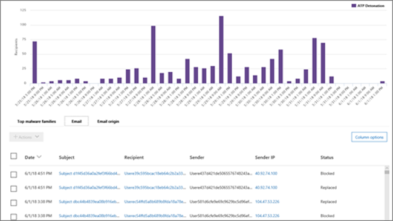

# Vyer i HotUtforskaren och identifieringar i realtidViews in Threat Explorer and real-time detections

[!INCLUDE [Microsoft 365 Defender rebranding](../includes/microsoft-defender-for-office.md)]

**Gäller för****Applies to**
- [Microsoft Defender för Office 365 Abonnemang 1 och Abonnemang 2Microsoft Defender for Office 365 plan 1 and plan 2](office-365-atp.md)
- [Microsoft 365 DefenderMicrosoft 365 Defender](../mtp/microsoft-threat-protection.md)

[Threat Explorer](threat-explorer.md) (och rapporten om identifiering i realtid) är ett kraftfullt verktyg i närheten av realtid som hjälper grupper i säkerhetsoperationer att undersöka och reagera på hot i Säkerhets- & Efterlevnadscenter.[Threat Explorer](threat-explorer.md) (and the real-time detections report) is a powerful, near real-time tool to help Security Operations teams investigate and respond to threats in the Security & Compliance Center. Utforskaren (och rapporten om identifieringar i realtid) visar information om misstänkt skadlig programvara och phish i e-post och filer i Office 365, samt andra säkerhetshot och risker för din organisation.Explorer (and the real-time detections report) displays information about suspected malware and phish in email and files in Office 365, as well as other security threats and risks to your organization.

- Om du har [Microsoft Defender för Office 365](office-365-atp.md) abonnemang 2 har du Utforskaren.If you have [Microsoft Defender for Office 365](office-365-atp.md) Plan 2, then you have Explorer.
- Om du har Microsoft Defender för Office 365 abonnemang 1 kan du göra identifieringar i realtid.If you have Microsoft Defender for Office 365 Plan 1, then you have real-time detections.

När du först öppnar Utforskaren (eller rapporten över identifieringar i realtid) visar standardvyn identifiering av skadlig kod för e-post under de senaste 7 dagarna.When you first open Explorer (or the real-time detections report), the default view shows email malware detections for the past 7 days. Den här rapporten kan också visa identifieringar av Microsoft Defender för Office 365, till exempel skadliga URL-adresser som identifieras av säkra länkar och skadliga filer som identifieras av [säkra bifogade filer.](atp-safe-attachments.md)This report can also show Microsoft Defender for Office 365 detections, such as malicious URLs detected by [Safe Links](atp-safe-links.md), and malicious files detected by [Safe Attachments](atp-safe-attachments.md). Den här rapporten kan ändras så att den visar data för de senaste 30 dagarna (med en betalprenumeration på Microsoft Defender för Office 365 P2).This report can be modified to show data for the past 30 days (with a Microsoft Defender for Office 365 P2 paid subscription). Utvärderingsprenumerationer innehåller endast data för de senaste sju dagarna.Trial subscriptions will include data for the past seven days only.

****

|PrenumerationSubscription|VerktygUtility|Dagar med dataDays of Data|
|---|---|---|
|Utvärderingsversion av Microsoft Defender för Office 365 P1Microsoft Defender for Office 365 P1 trial|Identifiering i realtidReal-time detections|77|
|Microsoft Defender för Office 365 P1 betaladMicrosoft Defender for Office 365 P1 paid|Identifiering i realtidReal-time detections|3030|
|Betaltestning av Microsoft Defender för Office 365 P1 för Office 365 P2Microsoft Defender for Office 365 P1 paid testing Defender for Office 365 P2 trial|HotutforskarenThreat Explorer|77|
|Utvärderingsversion av Microsoft Defender för Office 365 P2Microsoft Defender for Office 365 P2 trial|HotutforskarenThreat Explorer|77|
|Microsoft Defender för Office 365 P2 betaladMicrosoft Defender for Office 365 P2 paid|HotutforskarenThreat Explorer|3030|
|

Använd **Visa-menyn** om du vill ändra vilken information som visas.Use the **View** menu to change what information is displayed. Verktygstips hjälper dig att avgöra vilken vy du ska använda.Tooltips help you determine which view to use.

När du har valt en vy kan du använda filter och konfigurera frågor för ytterligare analys.Once you have selected a view, you can apply filters and set up queries to conduct further analysis. Följande avsnitt innehåller en kort översikt över de olika vyerna som är tillgängliga i Utforskaren (eller identifieringar i realtid).The following sections provide a brief overview of the various views available in Explorer (or real-time detections).

## E-> skadlig programvaraEmail > Malware

Om du vill visa den här rapporten i Utforskaren (eller identifiering i realtid) väljer du **Visa skadlig programvara** för \> **e-post.** \> To view this report, in Explorer (or real-time detections), choose **View** \> **Email** \> **Malware**. I den här vyn visas information om e-postmeddelanden som identifierats som innehåller skadlig programvara.This view shows information about email messages that were identified as containing malware.

Klicka **på Avsändaren** för att öppna listan med visningsalternativ.Click **Sender** to open your list of viewing options. Använd den här listan för att visa data efter avsändare, mottagare, avsändardomän, ämne, identifieringsteknik, skyddsstatus med mera.Use this list to view data by sender, recipients, sender domain, subject, detection technology, protection status, and more.

Om du till exempel vill se vilka åtgärder som har vidtas på identifierade e-postmeddelanden väljer du **Skydd-status** i listan.For example, to see what actions were taken on detected email messages, choose **Protection status** in the list. Välj ett alternativ och klicka sedan på knappen Uppdatera om du vill använda filtret i rapporten.Select an option, and then click the Refresh button to apply that filter to your report.

Under diagrammet kan du visa mer information om specifika meddelanden.Below the chart, view more details about specific messages. När du markerar ett objekt i listan öppnas ett utfällt fönster där du kan läsa mer om det markerade objektet.When you select an item in the list, a fly-out pane opens, where you can learn more about the item you selected.

## E-> PhishEmail > Phish

Om du vill visa den här rapporten i Utforskaren (eller identifiering i realtid) väljer du **Visa** \>  \> **e-post phish.**To view this report, in Explorer (or real-time detections), choose **View** \> **Email** \> **Phish**. I den här vyn visas e-postmeddelanden som identifieras som nätfiskeförsök.This view shows email messages identified as phishing attempts.

Klicka **på Avsändaren** för att öppna listan med visningsalternativ.Click **Sender** to open your list of viewing options. Använd den här listan för att visa data efter avsändare, mottagare, avsändardomän, avsändar-IP, URL-domän, klicka på bedömningsvyn och mycket mer.Use this list to view data by sender, recipients, sender domain, sender IP, URL domain, click verdict, and more.

Om du till exempel vill se vilka åtgärder som har gjorts när  personer klickade på URL-adresser som identifierades som nätfiskeförsök väljer du Klicka på bedömning i listan, väljer ett eller flera alternativ och klickar sedan på knappen Uppdatera.For example, to see what actions were taken when people clicked on URLs that were identified as phishing attempts, choose **Click verdict** in the list, select one or more options, and then click the Refresh button.

Under diagrammet kan du visa mer information om specifika meddelanden, URL-klick, URL-adresser och e-postursprung.Below the chart, view more details about specific messages, URL clicks, URLs, and email origin.

När du markerar ett objekt i listan, till exempel en URL som identifierats, öppnas ett utfällt fönster där du kan läsa mer om det markerade objektet.When you select an item in the list, such as a URL that was detected, a fly-out pane opens, where you can learn more about the item you selected.

## E-> inskickade meddelandenEmail > Submissions

Om du vill visa den här rapporten i Utforskaren (eller identifiering i realtid) väljer **du Visa** \>  \> **e-postinskick.**To view this report, in Explorer (or real-time detections), choose **View** \> **Email** \> **Submissions**. I den här vyn visas e-post som användare har rapporterat som skräppost, inte skräppost eller nätfiske.This view shows email that users have reported as junk, not junk, or phishing email.

Klicka **på Avsändaren** för att öppna listan med visningsalternativ.Click **Sender** to open your list of viewing options. Använd den här listan för att visa information efter avsändare, mottagare, rapporttyp (användarens avgörande om e-postmeddelandet var skräppost, inte skräppost eller phish) och mycket mer.Use this list to view information by sender, recipients, report type (the user's determination that the email was junk, not junk, or phish), and more.

Om du till exempel vill visa information om e-postmeddelanden som rapporterats som nätfiskeförsök klickar du på Avsändarrapporttyp, väljer  Phish och klickar sedan \> på knappen Uppdatera. For example, to view information about email messages that were reported as phishing attempts, click **Sender** \> **Report type**, select **Phish**, and then click the Refresh button.

Under diagrammet kan du visa mer information om specifika e-postmeddelanden, till exempel ämnesraden, avsändarens IP-adress, användaren som rapporterat meddelandet som skräppost, inte skräppost eller phish med mera.Below the chart, view more details about specific email messages, such as subject line, the sender's IP address, the user that reported the message as junk, not junk, or phish, and more.

Markera ett objekt i listan om du vill visa ytterligare information.Select an item in the list to view additional details.

## E-> all e-postEmail > All email

Om du vill visa den här rapporten väljer du Visa **e-post** för all \> **e-post i** \> **Utforskaren.**To view this report, in Explorer, choose **View** \> **Email** \> **All mail**. I de här vyerna visas en vy över e-postaktivitet, inklusive e-post som identifieras som skadlig på grund av nätfiske eller skadlig kod, samt all icke-skadlig e-post (vanlig e-post, skräppost och massutskick).This views shows an all-up view of email activity, including email identified as malicious due to phishing or malware, as well all non-malicious mail (normal email, spam, and bulk mail).

> [!NOTE]
> Om du får ett felmeddelande där det står För mycket **data** kan du lägga till ett filter och, om det behövs, begränsa det datumintervall som du visar.If you get an error that reads **Too much data to display**, add a filter and, if necessary, narrow the date range you're viewing.

Om du vill använda ett filter **väljer du Avsändare,** markerar ett objekt i listan och klickar sedan på knappen Uppdatera.To apply a filter, choose **Sender**, select an item in the list, and then click the Refresh button. I exemplet använde vi **identifieringsteknik som** ett filter (det finns flera tillgängliga alternativ).In our example, we used **Detection technology** as a filter (there are several options available). Visa information efter avsändare, avsändarens domän, mottagare, ämne, filnamn på bifogad fil, skadlig kodfamilj, skyddsstatus (åtgärder som vidtas av dina skyddsfunktioner och principer i Office 365), identifieringsteknik (hur den skadlig programvara identifierades) och mycket mer.View information by sender, sender's domain, recipients, subject, attachment filename, malware family, protection status (actions taken by your threat protection features and policies in Office 365), detection technology (how the malware was detected), and more.

Under diagrammet kan du visa mer information om specifika e-postmeddelanden, till exempel ämnesrad, mottagare, avsändare, status och så vidare.Below the chart, view more details about specific email messages, such as subject line, recipient, sender, status, and so on.

## Innehållskod > skadlig programvaraContent > Malware

Om du vill visa den här rapporten i Utforskaren (eller identifiering i realtid) väljer **du Visa skadlig** programvara \> **för** \> **innehåll.**To view this report, in Explorer (or real-time detections), choose **View** \> **Content** \> **Malware**. I den här vyn visas filer som identifierats som skadliga av Microsoft Defender för [Office 365 i SharePoint Online, OneDrive för företag och Microsoft Teams.](atp-for-spo-odb-and-teams.md)This view shows files that were identified as malicious by [Microsoft Defender for Office 365 in SharePoint Online, OneDrive for Business, and Microsoft Teams](atp-for-spo-odb-and-teams.md).

Visa information efter programfamilj, identifieringsteknik (hur skadlig programvara upptäcktes) och arbetsbelastningen (OneDrive, SharePoint eller Teams).View information by malware family, detection technology (how the malware was detected), and workload (OneDrive, SharePoint, or Teams).

Under diagrammet kan du visa mer information om specifika filer, till exempel filnamn på bifogade filer, arbetsbelastning, filstorlek, vem som senast ändrade filen och mycket mer.Below the chart, view more details about specific files, such as attachment filename, workload, file size, who last modified the file, and more.

## Funktioner för Klicka-och-filtreraClick-to-filter capabilities

Med Utforskaren (och identifieringar i realtid) kan du använda ett filter med ett klick.With Explorer (and real-time detections), you can apply a filter in a click. Om du klickar på ett objekt i förklaringen blir objektet ett filter för rapporten.Click an item in the legend, and that item becomes a filter for the report. Anta till exempel att vi tittar på vyn Skadlig programvara i Utforskaren:For example, suppose we are looking at the Malware view in Explorer:

Om **du klickar på ATP-detonation** i det här diagrammet visas en vy som ser ut så här:Clicking **ATP Detonation** in this chart results in a view like this:

I den här vyn tittar vi nu på data för filer som detonerade av [säkra bifogade filer.](atp-safe-attachments.md)In this view, we are now looking at data for files that were detonated by [Safe Attachments](atp-safe-attachments.md). Under diagrammet kan vi se information om specifika e-postmeddelanden som hade bifogade filer som identifierats av säkra bifogade filer.Below the chart, we can see details about specific email messages that had attachments that were detected by Safe Attachments.

Om du markerar ett eller flera objekt aktiveras **menyn** Åtgärder, där det finns flera alternativ att välja bland för de markerade objekten.Selecting one or more items activates the **Actions** menu, which offers several choices from which to choose for the selected item(s).

Möjligheten att filtrera med ett klick och navigera till specifika detaljer kan spara mycket tid vid undersökning av hot.The ability to filter in a click and navigate to specific details can save you a lot of time in investigating threats.

## Frågor och filterQueries and filters

Utforskaren (liksom rapporten över identifieringar i realtid) har flera kraftfulla filter- och frågefunktioner som gör att du kan öka detalj detaljinformationen, till exempel de mest riktade användarna, de mest populära familjerna av skadlig programvara, identifieringsteknik med mera.Explorer (as well as the real-time detections report) has several powerful filters and querying capabilities that enable you to drill into details, such as top targeted users, top malware families, detection technology and more. Varje typ av rapport erbjuder en mängd olika sätt att visa och utforska data.Each kind of report offers a variety of ways to view and explore data.

> [!IMPORTANT]
> Använd inte jokertecken, till exempel en asterisk eller ett frågetecken, i frågefältet för Utforskaren (eller identifieringar i realtid).Do not use wildcard characters, such as an asterisk or a question mark, in the query bar for Explorer (or real-time detections). När du söker i **ämnesfältet** efter e-postmeddelanden utför Utforskaren (eller identifieringar i realtid) delvis matchning och ger resultat som liknar en sökning med jokertecken.When you search on the **Subject field** for email messages, Explorer (or real-time detections) will perform partial matching and yield results similar to a wildcard search.
