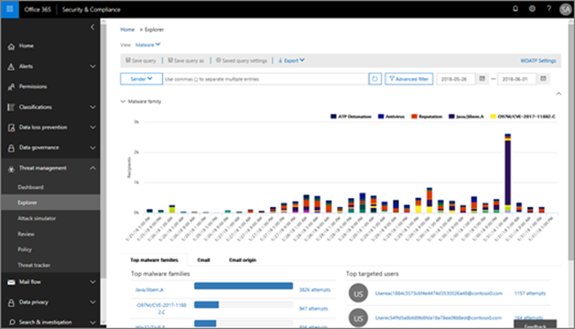

# Vyer i Threat Explorer och realtidsidentifieringar

[Threat Explorer](threat-explorer.md) (och realtidsidentifieringsrapporten) är ett kraftfullt, nära realtidsverktyg som hjälper säkerhetsteam &amp; att undersöka och svara på hot i Security Compliance Center. Explorer (och rapporten identifiering i realtid) visar information om misstänkt skadlig kod och phish i e-post och filer i Office 365, samt andra säkerhetshot och risker för din organisation. 

- Om du har [Office 365 Advanced Threat Protection](office-365-atp.md) (ATP) Plan 2 har du Explorer.
- Om du har Office 365 ATP-abonnemang 1 har du identifiering i realtid.

När du först öppnar Explorer (eller rapporten identifiering i realtid) visas identifiering av skadlig e-post för de senaste sju dagarna i standardvyn. Den här rapporten kan också visa ATP-identifieringar, till exempel skadliga url:er som identifieras av [säkra länkar](atp-safe-links.md)och skadliga filer som identifieras av [säkra bilagor](atp-safe-attachments.md). Den här rapporten kan ändras för att visa data för de senaste 30 dagarna (med en betald ATP P2-prenumeration). Provprenumerationer innehåller endast data för de senaste sju dagarna.

|Prenumeration  |Verktyg  |Dagar med data  |
|---------|---------|---------|
|ATP P1-testversion     | Realtidsidentifiering        |   7      |
|ATP P1 betalas     |   Realtidsidentifiering      |    30     |
|ATP P1 betald testning ATP P2 rättegång     | Hotutforskaren   |   7   |
|ATP P2 spår     |  Hotutforskaren       |     7    |
|ATP P2 betald     |     Hotutforskaren    |  30       |

Använd **Visa-menyn** för att ändra vilken information som visas. Verktygstips hjälper dig att avgöra vilken vy som ska användas.
  

När du har valt en vy kan du använda filter och ställa in frågor för att utföra ytterligare analyser. Följande avsnitt ger en kort översikt över de olika vyer som är tillgängliga i Explorer (eller realtidsidentifieringar).  

## E-post > Malware

Om du vill visa den här rapporten väljer du**Malware** **Visa** > skadlig kod**i** > Explorer (eller realtidsidentifiering). I den här vyn visas information om e-postmeddelanden som har identifierats som innehållande skadlig kod.  

 

Klicka på **Avsändare** om du vill öppna listan med visningsalternativ. Använd den här listan om du vill visa data efter avsändare, mottagare, avsändaredomän, ämne, identifieringsteknik, skyddsstatus med mera. 

Om du till exempel vill se vilka åtgärder som vidtogs på identifierade e-postmeddelanden väljer du **Skyddsstatus** i listan. Välj ett alternativ och klicka sedan på knappen Uppdatera om du vill använda filtret i rapporten.

Nedanför diagrammet kan du visa mer information om specifika meddelanden. När du markerar ett objekt i listan öppnas ett utfällbart fönster där du kan läsa mer om det objekt du valde. 

## E-post > Phish

Om du vill visa den här rapporten väljer du **Visa** > **e-post** > **phish**i Utforskaren (eller identifiering i realtid). I den här vyn visas e-postmeddelanden som identifierats som nätfiskeförsök.  

 

Klicka på **Avsändare** om du vill öppna listan med visningsalternativ. Använd den här listan om du vill visa data efter avsändare, mottagare, avsändaredomän, avsändare-IP, URL-domän, klicka på dom med mera. 

Om du till exempel vill se vilka åtgärder som vidtogs när personer klickade på webbadresser som identifierades som nätfiskeförsök väljer du **Klicka på domslut** i listan, välj ett eller flera alternativ och klicka sedan på knappen Uppdatera.

Nedanför diagrammet kan du visa mer information om specifika meddelanden, URL-klick, webbadresser och e-postursprung. 

När du väljer ett objekt i listan, till exempel en URL som upptäcktes, öppnas ett utfällbart fönster där du kan läsa mer om det objekt du valde. 

## Skicka >-> e-post

Om du vill visa den här rapporten väljer du **Visa** > **e-postinlämningar** > **Submissions**i Utforskaren (eller identifiering i realtid). Den här vyn visar e-post som användare har rapporterat som skräppost, inte skräppost eller nätfiske. 

 

Klicka på **Avsändare** om du vill öppna listan med visningsalternativ. Använd den här listan om du vill visa information efter avsändare, mottagare, rapporttyp (användarens bedömning av att e-postmeddelandet var skräppost, inte skräppost eller phish) med mera. 

Om du till exempel vill visa information om e-postmeddelanden som rapporterats som nätfiskeförsök klickar du på Typ **av avsändare,** > **Report type**väljer **Phish**och klickar sedan på knappen Uppdatera.

Under diagrammet kan du visa mer information om specifika e-postmeddelanden, till exempel ämnesrad, avsändarens IP-adress, användaren som rapporterade meddelandet som skräppost, inte skräppost eller phish med mera. 

Markera ett objekt i listan om du vill visa ytterligare information.

## E-post > Alla e-postmeddelanden

Om du vill visa den här rapporten väljer du **Visa** > **e-post all** > **e-post**i Utforskaren . I de här vyerna visas en all-up-vy av e-postaktivitet, inklusive e-post som identifierats som skadlig på grund av nätfiske eller skadlig kod, samt all icke-skadlig e-post (vanlig e-post, skräppost och massutskick). 

> [!NOTE]
> Om du får ett felmeddelande som läser **för mycket data för att visa**lägger du till ett filter och begränsar datumintervallet du visar om det behövs. 

Om du vill använda ett filter väljer du **Avsändare,** markerar ett objekt i listan och klickar sedan på knappen Uppdatera. I vårt exempel använde vi **Detektionsteknik** som filter (det finns flera alternativ tillgängliga). Visa information efter avsändare, avsändares domän, mottagare, ämne, filnamn för bifogade filer, en familj för skadlig programvara, skyddsstatus (åtgärder som vidtas av dina hotskyddsfunktioner och policyer i Office 365), identifieringsteknik (hur den skadliga koden upptäcktes) med mera. 

 

Nedanför diagrammet kan du visa mer information om specifika e-postmeddelanden, till exempel ämnesrad, mottagare, avsändare, status och så vidare. 

## Innehåll > skadlig kod

Om du vill visa den här rapporten väljer du **Visa** > **skadlig** > **Malware**programvara i Utforskaren (eller identifiering i realtid). I den här vyn visas filer som har identifierats som skadliga av [Office 365 Advanced Threat Protection i SharePoint Online, OneDrive för företag och Microsoft Teams](atp-for-spo-odb-and-teams.md).

Visa information efter en kod som är en familj för skadlig kod, identifieringsteknik (hur den skadliga koden upptäcktes) och arbetsbelastning (OneDrive, SharePoint eller Teams). 

  

Nedanför diagrammet kan du visa mer information om specifika filer, till exempel filnamn för bifogade filer, arbetsbelastning, filstorlek, vem som senast ändrade filen med mera. 
  
## Klicka-för-filter-funktioner

Med Explorer (och realtidsidentifieringar) kan du använda ett filter genom att klicka. Klicka på ett objekt i förklaringen och det objektet blir ett filter för rapporten. Anta till exempel att vi tittar på vyn Skadlig kod i Explorer:
  

  
Om du klickar på **ATP Detonation** i det här diagrammet visas en vy som denna: 
  

  
I den här vyn tittar vi nu på data för filer som detonerade av [Office 365 ATP Safe Attachments](atp-safe-attachments.md). Under diagrammet kan vi se information om specifika e-postmeddelanden som hade bilagor som upptäcktes av ATP Safe Bilagor.
  

  
Om du väljer ett eller flera objekt aktiveras **menyn Åtgärder,** som innehåller flera alternativ att välja mellan för det valda objektet.Selecting one or more items activates the Actions menu, which offers several choices from which to choose for the selected item(s. 
  

  
Möjligheten att filtrera med ett klick och navigera till specifika detaljer kan spara mycket tid på att undersöka hot.

## Frågor och filter

Explorer (samt rapporten identifiering i realtid) har flera kraftfulla filter och frågefunktioner som gör att du kan gå in på detaljer, till exempel toppinriktade användare, de bästa familjerna för skadlig kod, identifieringsteknik med mera. Varje typ av rapport erbjuder en mängd olika sätt att visa och utforska data.

> [!IMPORTANT]
> Använd inte jokertecken, till exempel en asterisk eller ett frågetecken, i frågefältet för Explorer (eller identifiering i realtid). När du söker i **fältet Ämne** efter e-postmeddelanden utför Explorer (eller realtidsidentifieringar) partiell matchning och ger resultat som liknar en jokerteckensökning.
