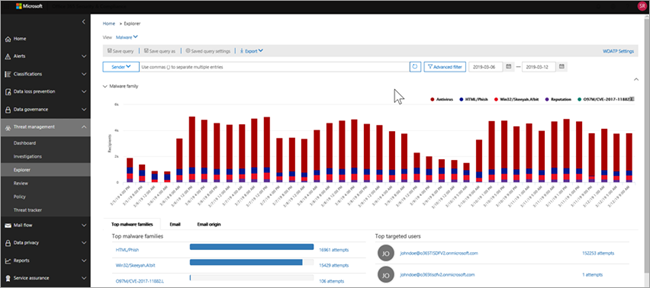
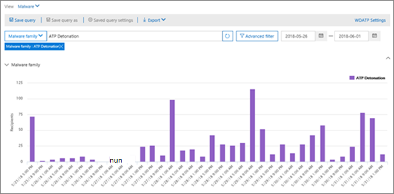

# Vyer i Threat Explorer och identifieringar i realtid

[Threat Explorer](threat-explorer.md) (och rapporten identifiering i realtid) är ett kraftfullt, nära realtidsverktyg som hjälper säkerhetsgrupper &amp; att undersöka och svara på hot i Security Compliance Center. Explorer (och rapporten identifiering i realtid) visar information om misstänkt skadlig kod och phish i e-post och filer i Office 365, samt andra säkerhetshot och risker för din organisation. 

- Om du har Atp-abonnemang [(Office 365 Advanced Threat Protection)](office-365-atp.md) 2 har du Explorer.
- Om du har Office 365 ATP-abonnemang 1 har du identifiering i realtid.

När du öppnar Explorer (eller rapporten identifiering i realtid) visas identifiering av skadlig programvara för e-post under de senaste 7 dagarna. Den här rapporten kan också visa ATP-identifieringar, till exempel skadliga webbadresser som identifierats av [säkra länkar](atp-safe-links.md)och skadliga filer som [upptäckts](atp-safe-attachments.md)av säkra bilagor . Den här rapporten kan ändras för att visa data under de senaste 30 dagarna (om du inte använder en utvärderingsprenumeration). Utvärderingsprenumerationer innehåller data endast under de senaste sju dagarna.

Använd **Visa-menyn** för att ändra vilken information som visas. Verktygstips hjälper dig att avgöra vilken vy du ska använda.
  

När du har valt en vy kan du använda filter och ställa in frågor för att utföra ytterligare analys. Följande avsnitt ger en kort översikt över de olika vyer som finns i Explorer (eller identifieringi realtid).  

## E-post > malware

Om du vill visa den här rapporten i Explorer (eller identifiering i realtid) väljer du **Visa** > **skadlig e-post** > **Malware**. Den här vyn visar information om e-postmeddelanden som har identifierats som innehåller skadlig kod.  

 

Klicka på **Avsändare** för att öppna listan med visningsalternativ. Använd den här listan om du vill visa data efter avsändare, mottagare, avsändare, ämne, identifieringsteknik, skyddsstatus med mera. 

Om du till exempel vill se vilka åtgärder som har vidtagits för identifierade e-postmeddelanden väljer du **Skyddsstatus** i listan. Välj ett alternativ och klicka sedan på knappen Uppdatera för att använda filtret i rapporten.

Under diagrammet visar du mer information om specifika meddelanden. När du markerar ett objekt i listan öppnas ett utfällbart fönster där du kan läsa mer om det objekt du valde. 

## E-post > Phish

Om du vill visa den här rapporten i Explorer (eller identifiering i realtid) väljer du **Visa** > **postphish****Email** > . I den här vyn visas e-postmeddelanden som identifierats som nätfiskeförsök.  

 

Klicka på **Avsändare** för att öppna listan med visningsalternativ. Använd den här listan om du vill visa data efter avsändare, mottagare, avsändardomän, avsändares IP, URL-domän, klicka på dom med mera. 

Om du till exempel vill se vilka åtgärder som har vidtagits när personer klickade på webbadresser som identifierats som nätfiskeförsök väljer du **Klicka på dom** i listan, väljer ett eller flera alternativ och klickar sedan på knappen Uppdatera.

Under diagrammet visar du mer information om specifika meddelanden, URL-klick, webbadresser och e-postursprung. 

När du markerar ett objekt i listan, till exempel en URL som upptäcktes, öppnas ett utfällbart fönster där du kan läsa mer om det objekt du valde. 

## E-post > inlagor

Om du vill visa den här rapporten i Explorer (eller identifiering i realtid) väljer du **Visa** > **e-postinlämningar** > **Submissions**. I den här vyn visas e-post som användare har rapporterat som skräppost, inte skräppost eller nätfiske. 

 

Klicka på **Avsändare** för att öppna listan med visningsalternativ. Använd den här listan om du vill visa information av avsändare, mottagare, rapporttyp (användarens beslutsamhet att e-postmeddelandet var skräp, inte skräp eller phish) med mera. 

Om du till exempel vill visa information om e-postmeddelanden som har rapporterats som nätfiskeförsök klickar du på typen **Avsändares** > **rapport,** väljer **Phish**och sedan på knappen Uppdatera.

Under diagrammet visar du mer information om specifika e-postmeddelanden, till exempel ämnesrad, avsändarens IP-adress, användaren som rapporterade meddelandet som skräppost, inte skräp eller phish med mera. 

Markera ett objekt i listan om du vill visa ytterligare information.

## E-> Alla e-postmeddelanden

Om du vill visa den här rapporten väljer du **Visa** > **e-post med e-post** > **All mail**i Explorer. De här vyerna visar en all-up-vy av e-postaktivitet, inklusive e-post som identifieras som skadlig på grund av nätfiske eller skadlig kod, samt all icke-skadlig e-post (normal e-post, skräppost och masspost). 

> [!NOTE]
> Om du får ett felmeddelande som läser **För mycket data för att visa**lägger du till ett filter och begränsar vid behov det datumintervall du visar. 

Om du vill använda ett filter väljer du **Avsändare,** markerar ett objekt i listan och klickar sedan på knappen Uppdatera. I vårt exempel använde vi **Detection-teknik** som filter (det finns flera alternativ tillgängliga). Visa information av avsändaren, avsändarens domän, mottagare, ämne, filnamn för bifogade filer, skadlig kod familj, skyddsstatus (åtgärder som vidtas av dina hotskyddsfunktioner och principer i Office 365), identifieringsteknik (hur skadlig kod upptäcktes) och Mer. 

 

Under diagrammet visar du mer information om specifika e-postmeddelanden, till exempel ämnesrad, mottagare, avsändare, status och så vidare. 

## Innehåll > skadlig kod

Om du vill visa den här rapporten i Explorer (eller identifiering i realtid) väljer du **Visa** > skadlig**kod för****innehåll** > . Den här vyn visar filer som har identifierats som skadliga av [Office 365 Advanced Threat Protection i SharePoint Online, OneDrive för företag och Microsoft Teams](atp-for-spo-odb-and-teams.md).

Visa information efter skadlig kod familj, detektionsteknik (hur skadlig kod upptäcktes) och arbetsbelastning (OneDrive, SharePoint eller Teams). 

  

Under diagrammet visar du mer information om specifika filer, till exempel filnamn för bifogade filer, arbetsbelastning, filstorlek, som senast ändrade filen med mera. 
  
## Klicka för att filtrera funktioner

Med Explorer (och identifiering i realtid) kan du använda ett filter med ett klick. Klicka på ett objekt i förklaringen och objektet blir ett filter för rapporten. Anta till exempel att vi tittar på vyn Skadlig kod i Explorer:
  

  
Om du klickar på **ATP Detonation** i det här diagrammet visas en vy som denna: 
  

  
I den här vyn tittar vi nu på data för filer som detonerade av [Office 365 ATP Safe Attachments](atp-safe-attachments.md). Under diagrammet kan vi se information om specifika e-postmeddelanden som hade bilagor som har upptäckts av ATP Safe Attachments.
  

  
Om du väljer ett eller flera objekt aktiveras **menyn Åtgärder,** som erbjuder flera alternativ att välja mellan för de markerade objekten. 
  

  
Möjligheten att filtrera med ett klick och navigera till specifika detaljer kan spara mycket tid på att undersöka hot.

## Frågor och filter

Explorer (samt rapporten identifiering i realtid) har flera kraftfulla filter och frågefunktioner som gör att du kan borra i detaljer, till exempel toppinriktade användare, toppfamiljer med skadlig kod, identifieringsteknik med mera. Varje typ av rapport erbjuder en mängd olika sätt att visa och utforska data.

> [!IMPORTANT]
> Använd inte jokertecken, till exempel en asterisk eller ett frågetecken, i frågefältet för Explorer (eller identifieringi realtid). När du söker i **ämnesfältet** efter e-postmeddelanden utför Explorer (eller identifieringi realtid) partiellmatchning och ger resultat som liknar en jokerteckensökning.
