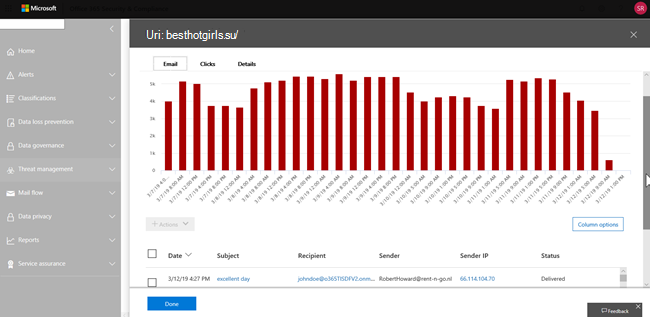

# Vyer i HotUtforskaren och identifieringar i realtid

[!INCLUDE [Microsoft 365 Defender rebranding](../includes/microsoft-defender-for-office.md)]

**Gäller för**
- [Microsoft Defender för Office 365 Abonnemang 1 och Abonnemang 2](office-365-atp.md)
- [Microsoft 365 Defender](../mtp/microsoft-threat-protection.md)

[Threat Explorer](threat-explorer.md) (och rapporten om identifiering i realtid) är ett kraftfullt verktyg i närheten av realtid som hjälper grupper i säkerhetsoperationer att undersöka och reagera på hot i Säkerhets- & Efterlevnadscenter. Utforskaren (och rapporten om identifieringar i realtid) visar information om misstänkt skadlig programvara och phish i e-post och filer i Office 365, samt andra säkerhetshot och risker för din organisation.

- Om du har [Microsoft Defender för Office 365](office-365-atp.md) abonnemang 2 har du Utforskaren.
- Om du har Microsoft Defender för Office 365 abonnemang 1 kan du göra identifieringar i realtid.

När du först öppnar Utforskaren (eller rapporten över identifieringar i realtid) visar standardvyn identifiering av skadlig kod för e-post under de senaste 7 dagarna. Den här rapporten kan också visa identifieringar av Microsoft Defender för Office 365, till exempel skadliga URL-adresser som identifieras av säkra länkar och skadliga filer som identifieras av [säkra bifogade filer.](atp-safe-attachments.md) Den här rapporten kan ändras så att den visar data för de senaste 30 dagarna (med en betalprenumeration på Microsoft Defender för Office 365 P2). Utvärderingsprenumerationer innehåller endast data för de senaste sju dagarna.

****

|Prenumeration|Verktyg|Dagar med data|
|---|---|---|
|Utvärderingsversion av Microsoft Defender för Office 365 P1|Identifiering i realtid|7|
|Microsoft Defender för Office 365 P1 betalad|Identifiering i realtid|30|
|Betaltestning av Microsoft Defender för Office 365 P1 för Office 365 P2|Hotutforskaren|7|
|Utvärderingsversion av Microsoft Defender för Office 365 P2|Hotutforskaren|7|
|Microsoft Defender för Office 365 P2 betalad|Hotutforskaren|30|
|

Använd **Visa-menyn** om du vill ändra vilken information som visas. Verktygstips hjälper dig att avgöra vilken vy du ska använda.

När du har valt en vy kan du använda filter och konfigurera frågor för ytterligare analys. Följande avsnitt innehåller en kort översikt över de olika vyerna som är tillgängliga i Utforskaren (eller identifieringar i realtid).

## E-> skadlig programvara

Om du vill visa den här rapporten i Utforskaren (eller identifiering i realtid) väljer du **Visa skadlig programvara** för \> **e-post.** \>  I den här vyn visas information om e-postmeddelanden som identifierats som innehåller skadlig programvara.

Klicka **på Avsändaren** för att öppna listan med visningsalternativ. Använd den här listan för att visa data efter avsändare, mottagare, avsändardomän, ämne, identifieringsteknik, skyddsstatus med mera.

Om du till exempel vill se vilka åtgärder som har vidtas på identifierade e-postmeddelanden väljer du **Skydd-status** i listan. Välj ett alternativ och klicka sedan på knappen Uppdatera om du vill använda filtret i rapporten.

Under diagrammet kan du visa mer information om specifika meddelanden. När du markerar ett objekt i listan öppnas ett utfällt fönster där du kan läsa mer om det markerade objektet.

## E-> Phish

Om du vill visa den här rapporten i Utforskaren (eller identifiering i realtid) väljer du **Visa** \>  \> **e-post phish.** I den här vyn visas e-postmeddelanden som identifieras som nätfiskeförsök.

Klicka **på Avsändaren** för att öppna listan med visningsalternativ. Använd den här listan för att visa data efter avsändare, mottagare, avsändardomän, avsändar-IP, URL-domän, klicka på bedömningsvyn och mycket mer.

Om du till exempel vill se vilka åtgärder som har gjorts när  personer klickade på URL-adresser som identifierades som nätfiskeförsök väljer du Klicka på bedömning i listan, väljer ett eller flera alternativ och klickar sedan på knappen Uppdatera.

Under diagrammet kan du visa mer information om specifika meddelanden, URL-klick, URL-adresser och e-postursprung.

När du markerar ett objekt i listan, till exempel en URL som identifierats, öppnas ett utfällt fönster där du kan läsa mer om det markerade objektet.

## E-> inskickade meddelanden

Om du vill visa den här rapporten i Utforskaren (eller identifiering i realtid) väljer **du Visa** \>  \> **e-postinskick.** I den här vyn visas e-post som användare har rapporterat som skräppost, inte skräppost eller nätfiske.

Klicka **på Avsändaren** för att öppna listan med visningsalternativ. Använd den här listan för att visa information efter avsändare, mottagare, rapporttyp (användarens avgörande om e-postmeddelandet var skräppost, inte skräppost eller phish) och mycket mer.

Om du till exempel vill visa information om e-postmeddelanden som rapporterats som nätfiskeförsök klickar du på Avsändarrapporttyp, väljer  Phish och klickar sedan \> på knappen Uppdatera. 

Under diagrammet kan du visa mer information om specifika e-postmeddelanden, till exempel ämnesraden, avsändarens IP-adress, användaren som rapporterat meddelandet som skräppost, inte skräppost eller phish med mera.

Markera ett objekt i listan om du vill visa ytterligare information.

## E-> all e-post

Om du vill visa den här rapporten väljer du Visa **e-post** för all \> **e-post i** \> **Utforskaren.** I de här vyerna visas en vy över e-postaktivitet, inklusive e-post som identifieras som skadlig på grund av nätfiske eller skadlig kod, samt all icke-skadlig e-post (vanlig e-post, skräppost och massutskick).

> [!NOTE]
> Om du får ett felmeddelande där det står För mycket **data** kan du lägga till ett filter och, om det behövs, begränsa det datumintervall som du visar.

Om du vill använda ett filter **väljer du Avsändare,** markerar ett objekt i listan och klickar sedan på knappen Uppdatera. I exemplet använde vi **identifieringsteknik som** ett filter (det finns flera tillgängliga alternativ). Visa information efter avsändare, avsändarens domän, mottagare, ämne, filnamn på bifogad fil, skadlig kodfamilj, skyddsstatus (åtgärder som vidtas av dina skyddsfunktioner och principer i Office 365), identifieringsteknik (hur den skadlig programvara identifierades) och mycket mer.

Under diagrammet kan du visa mer information om specifika e-postmeddelanden, till exempel ämnesrad, mottagare, avsändare, status och så vidare.

## Innehållskod > skadlig programvara

Om du vill visa den här rapporten i Utforskaren (eller identifiering i realtid) väljer **du Visa skadlig** programvara \> **för** \> **innehåll.** I den här vyn visas filer som identifierats som skadliga av Microsoft Defender för [Office 365 i SharePoint Online, OneDrive för företag och Microsoft Teams.](atp-for-spo-odb-and-teams.md)

Visa information efter programfamilj, identifieringsteknik (hur skadlig programvara upptäcktes) och arbetsbelastningen (OneDrive, SharePoint eller Teams).

Under diagrammet kan du visa mer information om specifika filer, till exempel filnamn på bifogade filer, arbetsbelastning, filstorlek, vem som senast ändrade filen och mycket mer.

## Funktioner för Klicka-och-filtrera

Med Utforskaren (och identifieringar i realtid) kan du använda ett filter med ett klick. Om du klickar på ett objekt i förklaringen blir objektet ett filter för rapporten. Anta till exempel att vi tittar på vyn Skadlig programvara i Utforskaren:

Om **du klickar på ATP-detonation** i det här diagrammet visas en vy som ser ut så här:

I den här vyn tittar vi nu på data för filer som detonerade av [säkra bifogade filer.](atp-safe-attachments.md) Under diagrammet kan vi se information om specifika e-postmeddelanden som hade bifogade filer som identifierats av säkra bifogade filer.

Om du markerar ett eller flera objekt aktiveras **menyn** Åtgärder, där det finns flera alternativ att välja bland för de markerade objekten.

Möjligheten att filtrera med ett klick och navigera till specifika detaljer kan spara mycket tid vid undersökning av hot.

## Frågor och filter

Utforskaren (liksom rapporten över identifieringar i realtid) har flera kraftfulla filter- och frågefunktioner som gör att du kan öka detalj detaljinformationen, till exempel de mest riktade användarna, de mest populära familjerna av skadlig programvara, identifieringsteknik med mera. Varje typ av rapport erbjuder en mängd olika sätt att visa och utforska data.

> [!IMPORTANT]
> Använd inte jokertecken, till exempel en asterisk eller ett frågetecken, i frågefältet för Utforskaren (eller identifieringar i realtid). När du söker i **ämnesfältet** efter e-postmeddelanden utför Utforskaren (eller identifieringar i realtid) delvis matchning och ger resultat som liknar en sökning med jokertecken.
