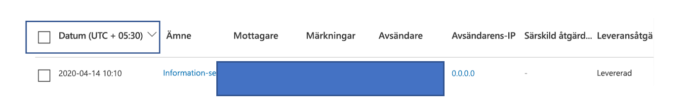
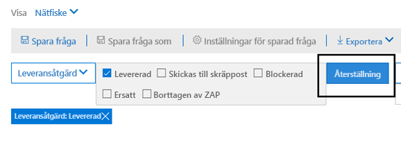
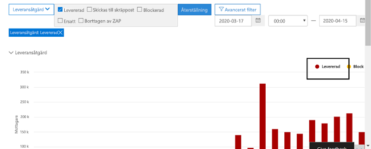
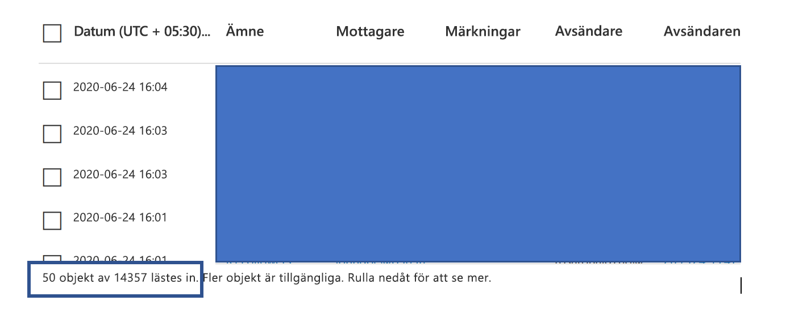

# Hot Explorer och realtidsidentifieringar

Om din organisation har [Office 365 Advanced Threat Protection](office-365-atp.md) (Office 365 ATP) och du har de [behörigheter som krävs](#required-licenses-and-permissions)har du antingen **Explorer** eller **realtidsidentifieringar** (tidigare *realtidsrapporter* – [se vad som är nytt!).](#new-features-in-threat-explorer-and-real-time-detections) I Security & Compliance Center går du till **Hothantering**och väljer sedan **Explorer** _eller_ **Realtidsidentifieringar**.

| Med ATP Plan 2 ser du: | Med ATP Plan 1 ser du: |
|---|---|
|||
|

Med Explorer (eller realtidsidentifieringar) har du en kraftfull rapport som gör det möjligt för säkerhetsoperationsteamet att undersöka och reagera på hot på ett effektivt och ändamålsenligt sätt. Rapporten liknar följande bild:

Med den här rapporten kan du:

- [Se skadlig kod som upptäckts av Microsoft 365-säkerhetsfunktioner](#see-malware-detected-in-email-by-technology)
- [Visa data om nätfiskeadresser och klicka på dom](#view-data-about-phishing-urls-and-click-verdict)
- [Starta en automatisk undersöknings- och svarsprocess från en vy i Explorer](#start-automated-investigation-and-response) (endast ATP-plan 2)
- ... [Undersök skadlig e-post och mycket mer!](#more-ways-to-use-explorer-or-real-time-detections)

## Upplev förbättringar av hotutforskaren och realtidsidentifieringar

Som en del av att förbättra jaktprocessen har vi gjort några uppdateringar av Threat Explorer och Real-Time Detections. Det är "erfarenhetsförbättringar" med fokus på att göra jaktupplevelsen mer konsekvent. Dessa ändringar beskrivs nedan: 

- [Förbättringar av tidszonen](#timezone-improvements)
- [Uppdatera i uppdateringsprocessen](#update-in-the-refresh-process)
- [Diagramgranskning att lägga till i filter](#chart-drilldown-to-add-to-filters)
- [I uppdateringar av produktinformation](#in-product-information-updates)

### Förbättringar av tidszonen 

Vi visar tidszonen för e-postposterna i portalen, samt för exporterade data. Tidszonen kommer att vara synlig över upplevelser som E-post Grid, Detaljer Flyout, E-post tidslinje och liknande e-post, så att tidszonen för resultatuppsättningen är tydlig för användaren. 

### Uppdatera i uppdateringsprocessen 

Vi har hört feedback kring förväxling med automatisk uppdatering (t.ex. för datum, så fort du ändrar datum, skulle sidan uppdatera) och manuell uppdatering (för andra filter). På samma sätt leder borttagning av filter till automatisk uppdatering, vilket medför situationer där ändring av de olika filtren när du ändrar frågan kan orsaka inkonsekventa sökupplevelser. För att lösa detta går vi över till en manuell filtreringsmekanism.
Från en upplevelse synvinkel kan användaren tillämpa och ta bort olika intervall av filter (från filteruppsättningen och datum), och tryck på uppdateringsknappen för att filtrera resultaten när de är klara med att definiera frågan. Uppdateringsknappen har också uppdaterats för att syna det tydligt på skärmen. Vi har också uppdaterat verktygstips och produktdokumentation kring denna förändring. 

### Diagramgranskning att lägga till i filter

Du kommer nu att kunna klicka på diagramförklaringvärdena för att lägga till det värdet som ett filter. Observera att du fortfarande måste klicka på uppdateringsknappen för att filtrera resultaten som en del av ändringen som beskrivs ovan.

### I uppdateringar av produktinformation 

Du bör också se ytterligare information i produkten. Till exempel det totala antalet sökresultat i rutnätet (se nedan), samt förbättringar kring etiketter, felmeddelanden och verktygstips, för att ge mer information om filter, sökupplevelse och resultatuppsättning. 

## Nya funktioner i realtidsidentifieringar

## Nya funktioner i Threat Explorer och realtidsidentifieringar

Tre nya funktioner läggs till i Threat Explorer och realtidsidentifieringar:

- [Förhandsgranska e-postrubrik och hämta e-posttext](#preview-email-header-and-download-email-body)
- [Tidslinje för e-post](#email-timeline)
- [Exportera URL-klickdata](#export-url-click-data)

Dessa nya funktioner beskrivs nedan.

### Förhandsgranska e-postrubrik och hämta e-posttext

Möjligheten att förhandsgranska ett e-posthuvud och ladda ner e-postkroppen är nya funktioner som är tillgängliga i Threat Explorer. Administratörer kommer att kunna analysera nedladdade rubriker / e-postmeddelanden för hot. Eftersom nedladdning av e-postmeddelanden kan riskera exponering av information styrs den här processen av rollbaserad åtkomstkontroll (RBAC). En ny roll, *Preview,* måste läggas till i en annan rollgrupp (till exempel Säkerhetsåtgärder eller säkerhetsadministratör) för att ge möjlighet att hämta e-post och förhandsgranska rubriker i vyn alla e-postmeddelanden.

Men Explorer (och realtidsidentifieringar) lägger också till nya nya fält som är utformade för att ge dig en mer komplett bild av var dina e-postmeddelanden landar. En del av målet med denna förändring är att göra jakten lättare för Security Ops människor, men nettoresultatet är att veta platsen för problem e-postmeddelanden på ett ögonblick.

Hur går det till? Leveransstatus är nu uppdelad i två kolumner:

- **Leveransåtgärd** - Vad är status för det här e-postmeddelandet?
- **Leveransplats** - Var dirigerades det här e-postmeddelandet som ett resultat?

Leveransåtgärd är de åtgärder som vidtas på ett e-postmeddelande på grund av befintliga principer eller identifieringar. Här är de möjliga åtgärder ett e-postmeddelande kan vidta:

|Levereras  |Skräppost  |Blockerade  |Ersatt  |
|---------|---------|---------|---------|
|E-post levererades till inkorgen eller mappen för en användare och användaren kan komma åt den direkt.    | E-post skickades till antingen användarens skräppostmapp eller Borttagen mapp, och användaren har tillgång till e-postmeddelanden i dessa mappar.       | Alla e-postmeddelanden som är i karantän, som misslyckades eller togs bort. Detta är helt otillgängligt av användaren!     | Alla e-postmeddelanden där skadliga bilagor ersätts av .txt-filer som anger att den bifogade filen var skadlig.     |
    

| Levereras | Skräppost | Blockerade | Ersatt |
|---|---|---|---|
|E-post levererades till användarens inkorg eller en annan mapp, och användaren kan komma åt den direkt.| E-post skickades till antingen användarens skräppostmapp eller Borttagen mapp, och användaren har åtkomst till e-postmeddelanden i dessa mappar.| Alla e-postmeddelanden som är i karantän, som misslyckades eller har tagits bort och som inte är tillgängliga för användaren.| Alla e-postmeddelanden där skadliga bilagor ersattes av .txt-filer som anger att bifogade filer var skadliga.|
|

Och här är vad användaren kan se, och vad de inte kan:

| Tillgänglig för slutanvändare | Otillgängliga för slutanvändare |
|---|---|
|Levereras|Blockerade|
|Skräppost|Ersatt|

Leveransplatsen visar resultatet av principer och identifieringar som körs efter leverans. Det är kopplat till en leveransåtgärd. Det här fältet har lagts till för att ge insikt i de åtgärder som vidtogs när ett problemmeddelande hittas. Här är möjliga värden för leveransplats:

- **Inkorg eller mapp**: E-postmeddelandet är i inkorgen eller en mapp (enligt dina e-postregler).
- **On-prem eller extern**: Postlådan finns inte i molnet utan är lokal.
- **Skräppostmapp:** E-postmeddelandet finns i skräppostmappen för en användare.
- **Mappen Borttaget objekt**: E-postmeddelandet i mappen Borttaget för en användare.
- **Karantän**: E-postmeddelandet i karantän och finns inte i en användares postlåda.
- **Det gick inte**att skicka e-postmeddelandet till postlådan.
- **Tappade:** E går vilse någonstans i e-postflödet.

### Tidslinje för e-post

**E-posttidslinjen** är en annan ny Explorer-funktion som syftar till att göra jaktupplevelsen bättre för administratörer. Det skär ner på randomisering eftersom det finns mindre tid att kontrollera olika platser för att försöka förstå händelsen. När flera händelser inträffar vid eller i närheten av samma tid i ett e-postmeddelande visas dessa händelser i en tidslinjevy. Faktum är att vissa händelser som inträffar efter leverans till din e-post kommer att fångas i kolumnen "Särskild åtgärd". Genom att kombinera informationen från tidslinjen för det e-postmeddelandet med de särskilda åtgärder som vidtagits på posten efter leveransen kommer administratörerna att få insyn i hur deras policyer fungerar, var posten slutligen dirigerades och, i vissa fall, vad den slutliga bedömningen var.

Mer diskussion om hur du undersöker skadliga e-postmeddelanden finns i [Undersöka och åtgärda skadlig e-post som levererades i Office 365](investigate-malicious-email-that-was-delivered.md).

### Exportera URL-klickdata

Du kan nu också exportera rapporter för URL-klick till Microsoft Excel för att visa både deras nätverksmeddelande-ID och deras klickslutning, vilket gör uppgiften att förstå var url-klicktrafiken har sitt ursprung. Så här fungerar det. Klicka på den här kedjan med hjälp av hothantering i snabbstarten för Office 365:

**Explorer** \> **Visa Phish** \> **Klick** \> **De vanligaste webbadresserna eller url-toppklick** \> **Klicka på valfri post för att öppna utfällbart webbadresser**

När du klickar på en webbadress i listan visas en ny exportknapp på utfällningspanelen. Använd den här knappen om du vill flytta data till ett Excel-kalkylblad för enklare rapportering.

Du kan komma till samma plats i rapporten identifiering i realtid enligt följande:

**Explorer** \> **Identifiering i** \> realtid **Visa Phish** \> **Webbadresser** \> **De vanligaste webbadresserna eller de vanligaste klicken** \> **Klicka på valfri post för att öppna utfällbart webbadresser** \> **Navigera till fliken Klick.**

> [!TIP]
> Nätverksmeddelande-ID mappar tillbaka till specifika e-postmeddelanden när du söker igenom Explorer eller tillhörande verktyg från tredje part via Nätverksmeddelande-ID. Genom att söka igenom nätverksmeddelande-ID:et får administratörerna det specifika e-postmeddelande som är kopplat till ett klickresultat. Vid export med, korrelera identifiering av Nätverksmeddelande-ID gör för snabbare och mer kraftfull analys.

## Se skadlig kod som upptäckts i e-post av teknik

Anta att du vill se skadlig kod som upptäcks i e-post, av Microsoft 365-teknik. Det gör du genom att använda vyn [E-post > malware](threat-explorer-views.md#email--malware) i Explorer (eller identifiering i realtid).

1. I Security & Compliance Center ( [https://protection.office.com](https://protection.office.com) väljer du Explorer för **hothantering**  >  **Explorer** (eller Identifiering **i realtid).** (I det här exemplet används Explorer.)

2. Välj **View** **E-postprogram**  >  **.**

   

3. Klicka på **Avsändare** **Basic**och välj sedan  >  **Grundläggande identifieringsteknik**.

   Identifieringstekniken är nu tillgänglig som filter för rapporten.

   

4. Välj ett alternativ och klicka sedan på knappen **Uppdatera** för att använda filtret.

   

Rapporten uppdateras för att visa resultaten malware upptäckts i e-post, med hjälp av det teknikalternativ du valt. Härifrån kan du göra ytterligare analyser.

## Visa data om nätfiskeadresser och klicka på dom

Anta att du vill se nätfiskeförsök via webbadresser i e-post, inklusive en lista över webbadresser som var tillåtna, blockerade och åsidosatta. Identifiera webbadresser som klickades kräver [atp-säkra länkar](atp-safe-links.md) som ska konfigureras. Se till att du har ställt in [ATP Safe Links-principer](set-up-atp-safe-links-policies.md) för tidsbestna skydd och loggning av klickutlåtanden av ATP Safe Links.

Om du vill granska phish-url:er i meddelanden och klick på webbadresser i phish-meddelanden använder du [e-> Phish-vyn](threat-explorer-views.md#email--phish) för Explorer (eller identifieringar i realtid).

1. I Security & Compliance Center ( [https://protection.office.com](https://protection.office.com) väljer du Explorer för **hothantering**  >  **Explorer** (eller Identifiering **i realtid).** (I det här exemplet används Explorer.)

2. Välj **E-post phish**på **Visa-menyn.**  >  **Phish**

   

3. Klicka på **Avsändare**och välj sedan **webbadresser**  >  **Klicka på domslut**.

4. Markera ett eller flera alternativ, till exempel **Blockerat** och **Blockera åsidosättt,** och klicka sedan på knappen **Uppdatera** som finns på samma rad som alternativen för att använda filtret. (Uppdatera inte webbläsarfönstret.)

   

    Rapporten uppdateras så att två olika URL-tabeller visas på fliken URL under rapporten:

   - **De vanligaste webbadresserna** är webbadresserna i de meddelanden som du har filtrerat ned till, och åtgärden för e-postleverans räknas för varje webbadress. I phish e-postvyn innehåller den här listan vanligtvis legitima webbadresser. Angripare inkluderar en blandning av bra och dåliga webbadresser i sina meddelanden för att försöka få dem levererade, men de kommer att göra de skadliga länkarna mer intressanta för användaren att klicka. Tabellen med webbadresser sorteras efter totalt antal e-postmeddelanden (men observera att den här kolumnen är dold för att förenkla vyn).

   - **De vanligaste klicken** är de infogade url:erna för säkra länkar som klickades, sorterade efter totalt antal klick (den här kolumnen visas inte heller för att förenkla vyn). Totalt antal per kolumn anger antalet säkra länkar klickar på domslut för varje klickad webbadress. I phish e-postvyn är dessa oftare misstänkta eller skadliga webbadresser, men kan innehålla webbadresser som inte är hot men som finns i phish-meddelanden. URL-klick på oförpackade länkar visas inte här.

   De två URL-tabellerna visar de vanligaste webbadresserna i nätfiskemeddelanden via leveransåtgärd och plats, och de visar URL-klick som blockerades (eller besöktes trots en varning) så att du kan förstå vilka potentiella dåliga länkar som togs emot av användare och interagerat med av användare. Härifrån kan du göra ytterligare analyser. Under diagrammet kan du till exempel se de vanligaste webbadresserna i e-postmeddelanden som har blockerats i organisationens miljö.

   

   Välj en URL om du vill visa mer detaljerad information.
   
   > [!NOTE]
   > I dialogrutan Utfällbara webbadresser tas filtrningen på e-postmeddelanden bort för att visa dig en fullständig vy över webbadressens exponering i din miljö. På så sätt kan du filtrera bort e-postmeddelanden i Explorer till de som du är orolig för, hitta specifika webbadresser som är potentiella hot och sedan utöka din förståelse av URL-exponeringen i din miljö (via dialogrutan URL-information) utan att behöva lägga till URL-filter i Själva Utforskarvyn.

## Granska e-postmeddelanden som rapporterats av användare

Anta att du vill se [e-postmeddelanden](enable-the-report-message-add-in.md)som användare i organisationen har rapporterat som Skräppost, inte skräppost eller Nätfiske med hjälp av tillägget Rapportera meddelande för Outlook och Outlook på webben . Det gör du genom att använda vyn [E-> Inlämningar](threat-explorer-views.md#email--submissions) av Explorer (eller identifiering i realtid).

1. I Security & Compliance Center ( [https://protection.office.com](https://protection.office.com) väljer du Explorer för **hothantering**  >  **Explorer** (eller Identifiering **i realtid).** (I det här exemplet används Explorer.)

2. Välj **E-postinlämningar**på **Visa-menyn**  >  **Submissions**.

   

3. Klicka på **Avsändare**och välj sedan **Grundläggande**  >  **rapporttyp**.

4. Välj ett alternativ, till exempel **Phish,** och klicka sedan på knappen **Uppdatera.**

   

Rapporten uppdateras för att visa data om e-postmeddelanden som personer i organisationen har rapporterat som ett nätfiskeförsök. Du kan använda den här informationen för att göra ytterligare analyser och vid behov justera dina [ATP-principer för nätfiske](configure-atp-anti-phishing-policies.md).

## Starta automatisk undersökning och respons

> [!NOTE]
> Automatiserade funktioner för undersökningar och svar finns i **Office 365 ATP Plan 2** och **Office 365 E5**.

(NY!) [Automatiserad undersökning och svar](automated-investigation-response-office.md) kan spara din säkerhetsoperation team mycket tid och ansträngning för att undersöka och mildra cyberattacker. Förutom att konfigurera aviseringar som kan utlösa en säkerhetsuppspelningsbok kan du starta en automatisk undersöknings- och svarsprocess från en vy i Explorer.

Mer information om detta finns i [Exempel: En säkerhetsadministratör utlöser en undersökning från Explorer](automated-investigation-response-office.md#example-a-security-administrator-triggers-an-investigation-from-threat-explorer).

## Fler sätt att använda Explorer (eller identifieringar i realtid)

Förutom de scenarier som beskrivs i den här artikeln har du många fler rapporteringsalternativ tillgängliga med Explorer (eller realtidsidentifieringar).

- [Hitta och undersöka skadlig e-post som levererades](investigate-malicious-email-that-was-delivered.md)
- [Visa skadliga filer som upptäckts i SharePoint Online, OneDrive och Microsoft Teams](malicious-files-detected-in-spo-odb-or-teams.md)
- [Få en översikt över vyerna i Threat Explorer (och identifiering i realtid)](threat-explorer-views.md)
- [Automatiserad undersökning och svar i Microsoft Threat Protection](https://docs.microsoft.com/microsoft-365/security/mtp/mtp-autoir)

## Nödvändiga licenser och behörigheter

Du måste ha [Office 365 ATP](office-365-atp.md) för att kunna identifieringen av Utforskaren eller realtid.

- Explorer ingår i Office 365 ATP-abonnemang 2.
- Identifieringsrapporten för realtid ingår i Office 365 ATP-abonnemang 1.
- Planera att tilldela licenser för alla användare som ska skyddas av Office 365 ATP. (Explorer- eller realtidsidentifieringar visar identifieringsdata för licensierade användare.)

Om du vill visa och använda Explorer eller realtidsidentifieringar måste du ha lämpliga behörigheter, till exempel de som beviljas en säkerhetsadministratör eller säkerhetsläsare.

- För &amp; Säkerhetsefterlevnadscenter måste du ha en av följande roller tilldelad:

  - Organisationshantering
  - Säkerhetsadministratör (detta kan tilldelas i Administrationscentret för Azure Active Directory ( [https://aad.portal.azure.com](https://aad.portal.azure.com) ))
  - Säkerhetsläsare

- För Exchange Online måste du ha någon av följande roller tilldelad i administrationscentret för Exchange ( [https://outlook.office365.com/ecp](https://outlook.office365.com/ecp) ) eller med PowerShell-cmdletar (se [Exchange Online PowerShell):](https://docs.microsoft.com/powershell/exchange/exchange-online-powershell)

  - Organisationshantering
  - Organisationshantering endast med enbart vy
  - Rollen Endast visa mottagare
  - Hantering av efterlevnad

Mer information om roller och behörigheter finns i följande resurser:

- [Behörigheter i &amp; Säkerhetsefterlevnadscenter](permissions-in-the-security-and-compliance-center.md)
- [Funktionsbehörigheter i Exchange Online](https://docs.microsoft.com/exchange/permissions-exo/feature-permissions)

## Vissa skillnader mellan Threat Explorer och realtidsidentifieringar

- Identifieringsrapporten **för realtid** är tillgänglig i Office 365 ATP Plan 1, medan **Threat Explorer** är tillgängligt i Office 365 ATP-abonnemang 2.
- I rapporten **identifiering i realtid** kan du visa identifieringar i realtid. **Threat Explorer** gör detta också, men låter dig också visa ytterligare information för en viss attack.
- En **e-postvy** är tillgänglig i **Threat Explorer** (och finns inte i rapporten identifiering i **realtid).**
- Fler filtreringsfunktioner och tillgängliga åtgärder ingår i **Threat Explorer**.

Mer information finns i [Office 365 ATP Service Description: Funktionstillgänglighet i atp-abonnemang (Advanced Threat Protection).](https://docs.microsoft.com/office365/servicedescriptions/office-365-advanced-threat-protection-service-description#feature-availability-across-advanced-threat-protection-atp-plans)

