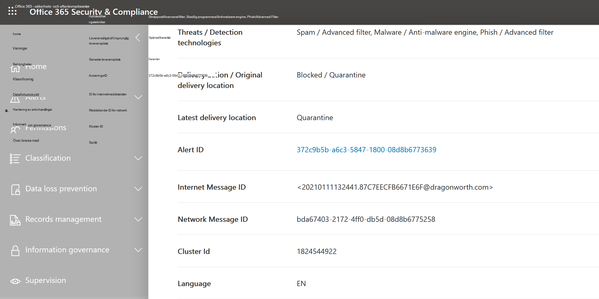

# Identifiering av hot i Utforskaren och i realtid

**Gäller för**
- [Microsoft Defender för Office 365 Abonnemang 1 och Abonnemang 2](defender-for-office-365.md)
- [Microsoft 365 Defender](../defender/microsoft-365-defender.md)

Om din organisation har Microsoft Defender för [Office 365](defender-for-office-365.md)och du har nödvändiga behörigheter har du antingen **Utforskaren** eller **realtidsidentifiering** (tidigare realtidsrapporter *–* nyheter [!).](#new-features-in-threat-explorer-and-real-time-detections)  I Säkerhets- & säkerhets- och efterlevnadscenter går du till Hantering av hot och väljer **sedan Utforskaren** _eller_ **Identifieringar i realtid.**

|Med Microsoft Defender för Office 365 abonnemang 2 ser du:|Med Microsoft Defender för Office 365 abonnemang 1 ser du:|
|---|---|
|||
|

Explorer eller realtidsidentifiering hjälper ditt säkerhetsteam att undersöka och reagera på hot effektivt. Rapporten liknar följande bild:

Med den här rapporten kan du:

- [Se skadlig programvara som upptäckts av Säkerhetsfunktioner i Microsoft 365](#see-malware-detected-in-email-by-technology)
- [Visa nätfiske-URL och klicka på bedömningsdata](#view-phishing-url-and-click-verdict-data)
- [Starta en automatiserad undersökning och svarsprocess från en vy i Utforskaren](#start-automated-investigation-and-response) (endast Defender för Office 365 abonnemang 2)
- [Undersöka skadlig e-post med mera](#more-ways-to-use-explorer-and-real-time-detections)

## Förbättringar av Threat Hunting Experience

### Introduktion till aviserings-ID för MDO-aviseringar i Utforskaren/realtidsidentifiering (förhandsversion)
Om du i dag navigerar från en avisering till Hotutforskaren öppnas en filtrerad vy i Utforskaren, med vyn filtrerad med aviseringsprincip-ID (princip-ID är en unik identifierare för en aviseringsprincip).
Vi gör den här integreringen mer relevant genom att introducera aviserings-ID (se ett exempel på aviserings-ID nedan) i Threat Explorer och i realtidsidentifiering så att du ser meddelanden som är relevanta för den specifika aviseringen och antalet e-postmeddelanden. Du kan också se om ett meddelande var en del av en avisering och även navigera från det meddelandet till den specifika aviseringen.  

Aviserings-ID är tillgängligt i URL-adressen när du visar en enskild avisering. ett exempel som är `https://protection.office.com/viewalerts?id=372c9b5b-a6c3-5847-fa00-08d8abb04ef1` .

> [!div class="mx-imgBorder"]
> 

> [!div class="mx-imgBorder"]
> 

 
### Utöka databevarandet i Utforskaren (och realtidsidentifiering) och sökbegränsningen för utvärderingsklienter från 7 till 30 dagar (förhandsversion)  
Som en del av den här ändringen kommer du att kunna söka efter och filtrera e-postdata över 30 dagar (en ökning från de föregående sju dagarna) i Threat Explorer/Realtidsidentifiering för både Defender för utvärderingsklienter för Office P1 och P2. Detta påverkar inte produktionsklienter för både P1- och P2/E5-kunder som redan har 30 dagars datalagring och sökfunktioner. 

### Uppdaterade begränsningar för export av poster för Threat Explorer (förhandsversion) 
Som en del av den här uppdateringen kommer antalet rader för e-postposter som kan exporteras från Threat Explorer att ökas från 9 990 till 200 000 poster. Den uppsättning kolumner som kan exporteras för närvarande förblir densamma, men antalet rader ökar från den aktuella gränsen.

### Taggar i Hotutforskaren

> [!NOTE]
> Funktionen med användartaggar *är i förhandsversion,* inte tillgänglig för alla och kan komma att ändras. Mer information om lanseringsschemat finns i Översikt över Microsoft 365.

Användartaggar identifierar specifika grupper av användare i Microsoft Defender för Office 365. Mer information om taggar, inklusive licensiering och konfiguration, finns i [Användartaggar.](user-tags.md)

I Hotutforskaren kan du se information om användartaggar i följande funktioner.

#### Rutnätsvyn för e-post

Kolumnen **Taggar** i e-postrutnätet innehåller alla taggar som har tillämpats på avsändarens eller mottagarens postlådor. Som standard visas systemtaggar som prioritetskonton först.

> [!div class="mx-imgBorder"]
> 

#### Filtrera

Du kan använda taggar som ett filter. Jaga bara på prioritetskonton eller specifika användartaggsscenarier. Du kan också utesluta resultat som har vissa taggar. Kombinera den här funktionen med andra filter för att begränsa undersökningens omfattning.

> [!div class="mx-imgBorder"]
> 

#### Utfällblad för e-postinformation
Om du vill visa de enskilda taggarna för avsändare och mottagare markerar du ämnet för att öppna den utfällade meddelandeinformationen. På fliken **Sammanfattning** visas taggarna för avsändare och mottagare separat, om de finns för e-post.
Informationen om enskilda taggar för avsändare och mottagare utökas också till exporterade CSV-data, där du kan se den här informationen i två separata kolumner.

> [!div class="mx-imgBorder"]
> 

Information om taggar visas också i den utfällade URL-klickningen. Om du vill visa den går du till vyn Phish eller All e-post och **går sedan** till fliken **URL:er eller URL-klickningar.** Välj en enskild utfällsida för URL om du vill visa ytterligare information om klickningar för URL-adressen, inklusive taggar kopplade till den klickningen.

### Uppdaterad tidslinjevy

> [!div class="mx-imgBorder"]
> 
> 
Lär dig mer genom att titta på [den här videon](https://www.youtube.com/watch?v=UoVzN0lYbfY&list=PL3ZTgFEc7LystRja2GnDeUFqk44k7-KXf&index=4). 

## Förbättringar av upplevelsen av hot efter hot (kommande)

### Uppdaterad information om hot för e-postmeddelanden

Vi har fokuserat på förbättringar av plattform och datakvalitet för att öka dataprecisionen och konsekvensen för e-postposter. Bland förbättringarna kan du konsolidera information om förleverans och efterleverans, till exempel åtgärder som utförs på ett e-postmeddelande som en del av ZAP-processen, i en enda post. Ytterligare information som skräppost, hot på entitetsnivå (till exempel vilken URL som var skadlig) och senaste leveransplatser ingår också.

Efter de här uppdateringarna ser du en enda post för varje meddelande, oavsett de olika händelser efter leveransen som påverkar meddelandet. Åtgärder kan omfatta ZAP, manuell åtgärd (vilket betyder administratörsåtgärder), dynamisk leverans och så vidare.

Förutom att visa skadlig kod och nätfiskehot kan du se den skräppost som är kopplad till ett e-postmeddelande. I e-postmeddelandet ser du alla hot som är associerade med e-postmeddelandet tillsammans med motsvarande identifieringsteknik. Ett e-postmeddelande kan innehålla noll, ett eller flera hot. Du ser de aktuella hoten i avsnittet Information i **den utfällade** e-postmeddelandet. För flera hot (till exempel skadlig  kod och nätfiske) visar det tekniska fältet identifiering av hotmappningen, vilket är den identifieringsteknik som identifierade hotet.

Uppsättningen identifieringstekniker inkluderar nu nya identifieringsmetoder och teknik för identifiering av skräppost. Du kan använda samma uppsättning identifieringstekniker för att filtrera resultatet i olika e-postvyer (skadlig kod, phish, all e-post).

> [!NOTE]
> Analys av bedömning kanske inte nödvändigtvis är knutna till enheter. Till exempel kan ett e-postmeddelande klassificeras som phish eller spam, men det finns inga URL-adresser som stämplas med en phish/spam-bedömning. Det beror på att filtren även utvärderar innehåll och annan information för ett e-postmeddelande innan en bedömning tilldelas.

#### Hot i URL:er

Nu kan du se det specifika risken för en URL på den utfällade fliken Information för **e-post.** Risken kan vara skadlig *kod,* *nättr* *ut, skräppost* eller *ingen*.)

> [!div class="mx-imgBorder"]
> 

### Uppdaterad tidslinjevy (kommande)

> [!div class="mx-imgBorder"]
> 

I vyn Tidslinje identifieras alla leverans- och efterleveranshändelser. Den innehåller information om hot som identifierats vid den tidpunkten för en del av dessa händelser. Vyn Tidslinje innehåller också information om alla ytterligare åtgärder som vidtas (till exempel ZAP eller manuell åtgärd), tillsammans med resultatet av den åtgärden. Information om tidslinjevyn omfattar:

- **Källa:** Källan för händelsen. Det kan vara admin/system/användare.
- **Händelse:** Inkluderar händelser på högsta nivå som originalleverans, manuell åtgärd, ZAP, inskickade uppgifter och dynamisk leverans.
- **Åtgärd:** Den specifika åtgärd som har vidtagits antingen som en del av ZAP- eller administratörsåtgärden (till exempel mjuk borttagning).
- **Hot:** Omfattar de hot (skadlig kod, phish, spam) som identifierades vid den tidpunkten.
- **Resultat/information:** Mer information om åtgärdens resultat, till exempel om den utfördes som en del av ZAP/admin-åtgärder.

### Ursprunglig och senaste leveransplats

För närvarande befinner vi oss på leveransplats i det utfällfältet för e-postrutnät och e-post. Fältet **Leveransplats** får det nya namnet **_Ursprunglig leveransplats_*_. Och vi introducerar ett annat fält, _*_Senaste leveransplats_**.

**Den ursprungliga leveransplatsen** ger mer information om var ett e-postmeddelande levererades från början. **Senaste leveransplats** kan ange var ett e-postmeddelande hamnar efter systemåtgärder som *ZAP* eller administrativa åtgärder som *Flytta till borttagna objekt.* Senaste leveransplats är avsedd att meddela administratörerna meddelandets senast kända plats efter leveransen eller eventuella system-/administratörsåtgärder. Den innehåller inte några åtgärder för slutanvändare för e-postmeddelandet. Om en användare till exempel tagit bort ett meddelande eller flyttat meddelandet till arkivera/pst uppdateras inte meddelandets leveransplats. Men om en systemåtgärd uppdaterade platsen (till exempel ZAP som resulterade i att ett e-postmeddelande flyttades till **karantän)** visades den senaste leveransplatsen som "karantän".

> [!div class="mx-imgBorder"]
> 

> [!NOTE]
> Det finns några fall där åtgärden **Leveransplats** **och Leverans kan** visas som "okänd":
>
> - Du kan **se** Leveransplats som  "Levererat" och Leveransplats som "okänd" om meddelandet levererades, men med en regel för Inkorgen flyttades meddelandet till en standardmapp (till exempel Utkast eller Arkiv) i stället för till Inkorgen eller mappen Skräppost.
>
> - **Senaste leveransplats** kan vara okänd om en administratör/systemåtgärd (till exempel ZAP) försöktes, men meddelandet hittades inte. Vanligtvis inträffar åtgärden när användaren har flyttat eller tagit bort meddelandet. I sådana fall verifierar du **kolumnen Resultat/detaljer** i tidslinjevyn. Leta efter uttrycket "Meddelandet har flyttats eller tagits bort av användaren".

> [!div class="mx-imgBorder"]
> 

### Ytterligare åtgärder

*Ytterligare åtgärder* vid leveransen av e-postmeddelandet har tillämpats. De kan inkludera *ZAP,* manuell åtgärd *(åtgärd* som vidtas av en administratör *som* mjuk borttagning), dynamisk leverans och ombearbetning *(för* e-postmeddelanden som retroaktivt identifierades som bra).

> [!NOTE]
> - Som en del av de väntande ändringarna försvinner värdet "Tas bort av ZAP" som visas i filtret Leveransåtgärd. Du kan söka efter all e-post med ZAP-försöket via **Ytterligare åtgärder**.
>
> - Det kommer att finnas nya fält och värden för teknik **för identifiering och** ytterligare **åtgärder** (särskilt för ZAP-scenarier). Du måste utvärdera dina befintliga sparade frågor och spårade frågor för att se till att de fungerar med de nya värdena.

> [!div class="mx-imgBorder"]
> 

### System åsidosättningar

*Med system åsidosättningar* kan du göra undantag till den avsedda leveransplatsen för ett meddelande. Du åsidosätter leveransplatsen som tillhandahålls av systemet baserat på hot och andra identifieringar som identifieras av filtreringsstacken. System åsidosättningar kan ställas in via klientorganisations- eller användarprincip för att leverera meddelandet enligt förslaget i principen. Med åsidosättningar kan oavsiktlig leverans av skadliga meddelanden identifieras på grund av luckor i konfigurationen, till exempel en alltför omfattande princip för betrodd avsändare som har ställts in av en användare. Dessa åsidosättningsvärden kan vara:

- Tillåts av användarprincip: En användare skapar principer på postlådenivå för att tillåta domäner eller avsändare.

- Blockeras av användarprincip: En användare skapar principer på e-postråddsnivå för att blockera domäner eller avsändare.

- Tillåts av organisationens princip: Organisationens säkerhetsteam anger principer eller Exchange-e-postflödesregler (kallas även transportregler) för att tillåta avsändare och domäner för användare i organisationen. Det kan vara för en uppsättning användare eller för hela organisationen.

- Blockeras av organisationsprincip: Organisationens säkerhetsteam anger principer eller e-postflödesregler för att blockera avsändare, domäner, meddelandespråk eller käll-IP-adresser för användare i organisationen. Det här kan tillämpas på en uppsättning användare eller hela organisationen.

- Filnamnstillägg som blockeras av organisationsprincipen: Ett organisations säkerhetsteam blockerar ett filnamnstillägg via inställningarna för skydd mot skadlig programvara. Värdena visas nu i e-postinformation för att underlätta undersökningar. Sekops-team kan också använda rtf-filtreringsfunktioner för att filtrera på blockerade filnamnstillägg.

> [!div class="mx-imgBorder"]
> 

### Förbättringar av URL och klickning

Förbättringarna är bland annat:

- Visa hela klickade URL:en (inklusive alla frågeparametrar som  är en del av URL:en) i avsnittet Klick på den utfällliga URL-adressen. För närvarande visas URL-domänen och sökvägen i namnlisten. Vi utökar den informationen så att den fullständiga URL:en visas.

- Korrigeringar med URL-filter *(URL-fil* kontra *URL-domän* kontra *URL-domän* och sökväg): Uppdateringarna påverkar sökningen efter meddelanden som innehåller en URL-adress/klick-bedömning. Vi har aktiverat stöd för protokoll-agnostic sökningar, så att du kan söka efter en URL utan att använda `http` . Som standard mappas URL-sökningen till http, om inte ett annat värde uttryckligen anges. Till exempel:

   -  Sök med och utan `http://` prefixet i **filterfälten URL**, **URL Domain** och URL Domain **och Path.** Sökningarna bör visa samma resultat.

   -  Sök efter `https://` prefixet i **URL.** När inget värde anges `http://` antas prefixet.

   - `/`ignoreras i början och slutet av fälten **URL-sökväg**, **URL-domän,** **URL-domän och sökväg.** `/` i slutet av **URL-fältet** ignoreras.

### Konfidensnivå i phish

Konfidensnivån phish hjälper till att identifiera graden av förtroende som ett e-postmeddelande kategoriserades som "phish". De två möjliga värdena är *Hög* och *Normal.* I de inledande stegen är det här filtret endast tillgängligt i Phish-vyn av Hotutforskaren.

### ZAP URL-signal

ZAP URL-signalen används vanligtvis för ZAP Phish-aviseringsscenarier där ett e-postmeddelande identifierades som phish och togs bort efter leveransen. Den här signalen ansluter aviseringen till motsvarande resultat i Utforskaren. Det är en av IOCs för aviseringen.

För att förbättra din sökningsprocess har vi uppdaterat Identifiering av hotutforskaren och realtidsidentifiering för att göra upplevelsen mer enhetlig. Ändringarna beskrivs här:

- [Förbättringar av tidszoner](#timezone-improvements)
- [Uppdatera i uppdateringsprocessen](#update-in-the-refresh-process)
- [Diagramgranskning för att lägga till i filter](#chart-drilldown-to-add-to-filters)
- [I uppdateringar av produktinformation](#in-product-information-updates)

### Filtrera efter användartaggar

Nu kan du sortera och filtrera efter systemtaggar eller anpassade användartaggar för att snabbt förstå hotens omfattning. Mer information finns i [Användartaggar](user-tags.md).

> [!IMPORTANT]
> Filtrering och sortering efter användartaggar är för närvarande en offentlig förhandsgranskning. Den här funktionen kan komma att ändras betydligt innan den släpps till kommersiellt bruk. Microsoft ger inga garantier, uttryckliga eller underförstådda, med avseende på den information som ges om den.

> [!div class="mx-imgBorder"]
> 

### Förbättringar av tidszoner

Du ser tidszonen för e-postposterna i portalen samt för exporterade data. Den visas i funktioner som e-postrutnät, utfällbara detaljer, tidslinje för e-post och liknande e-postmeddelanden, så tidszonen för resultatuppsättningen är tydlig.

> [!div class="mx-imgBorder"]
> 

### Uppdatera i uppdateringsprocessen

Vissa användare har kommenterat att det är förvirrande med automatisk uppdatering (till exempel så snart du ändrar datumet, sidan uppdateras) och manuell uppdatering (för andra filter). På samma sätt leder borttagning av filter till automatisk uppdatering. Om du ändrar filter medan du ändrar frågan kan det orsaka inkonsekventa sökupplevelser. För att lösa de här problemen flyttar vi till en mekanism för manuell filtrering.

Ur en perspektivupplevelse kan användaren tillämpa och ta bort de olika filterområdet (från filteruppsättningen och datumet) och välja uppdateringsknappen för att filtrera resultatet när de har definierat frågan. Uppdateringsknappen är nu också framhävd på skärmen. Vi har även uppdaterat relaterade verktygstips och dokumentation i produkten.

> [!div class="mx-imgBorder"]
> 

### Diagramgranskning för att lägga till i filter

Nu kan du diagramförklaringsvärden lägga till dem som filter. Filtrera **resultatet genom** att välja knappen Uppdatera.

> [!div class="mx-imgBorder"]
> 

### Uppdateringar av information i produkten

Ytterligare information är nu tillgänglig i produkten, till exempel det totala antalet sökresultat i rutnätet (se nedan). Vi har förbättrat etiketter, felmeddelanden och knappbeskrivningar för att ge mer information om filter, sökupplevelse och resultatuppsättning.

> [!div class="mx-imgBorder"]
> 

## Utökade funktioner i Hotutforskaren

### Mest riktade användare

I dag visar vi listan över de mest riktade användarna i vyn Skadlig programvara för e-postmeddelanden i **avsnittet Top Malware Families.** Vi kommer att utöka den här vyn i vyerna Phish och All e-post. Du kan se de fem mest riktade användarna, tillsammans med antalet försök för varje användare för motsvarande vy. För phish-vy ser du till exempel antalet phish-försök.

Du kan exportera listan med riktade användare, upp till en gräns på 3 000, tillsammans med antalet försök för offlineanalys för varje e-postvy. Om du väljer antalet försök (till exempel 13 försök i bilden nedan) öppnas en filtrerad vy i Hotutforskaren, så att du kan se mer information om e-postmeddelanden och hot för den användaren.

> [!div class="mx-imgBorder"]
> 

### Exchange-transportregler

Som en del av databerikande kan du se alla olika Exchange-transportregler (ETR) som tillämpats på ett meddelande. Den här informationen är tillgänglig i rutnätsvyn för e-post. Du visar den genom att **välja Kolumnalternativ** i rutnätet och sedan **Lägga till Exchange-transportregel** bland kolumnalternativen. Det visas också på den utfällbara **informationen** i e-postmeddelandet.

Du kan se både GUID och namnet på transportreglerna som tillämpats på meddelandet. Du kan söka efter meddelandena med hjälp av namnet på transportregeln. Det här är en "Innehåller"-sökning, vilket innebär att du även kan göra partiella sökningar.

> [!IMPORTANT]
> ETR-sökning och ETR-namntillgänglighet beror på den specifika roll som har tilldelats till dig. Du måste ha någon av följande roller/behörigheter för att visa ETR-namn och sökning. Om du inte har någon av de här rollerna kan du inte se namnen på transportreglerna eller söka efter meddelanden med hjälp av ETR-namn. Men du kan se ETR-etiketten och GUID-informationen i e-postinformationen. Andra funktioner för postvisning i e-postrutnät, utfällningar av e-post, filter och export påverkas inte.
> 
> - Endast EXO – skydd mot dataförlust: alla
> - Endast EXO – O365SupportViewConfig: Alla
> - Microsoft Azure Active Directory eller EXO – säkerhetsadministratör: Alla
> - AAD eller EXO – Säkerhetsläsare: Alla
> - Endast EXO – Transportregler: Alla
> - Endast EXO – View-Only konfiguration: Alla
> 
> I e-postrutnätet, den utfällliga listan Information och Exporterad CSV visas ETR-trafikerna med ett Namn/GUID enligt nedan.
> 
> > [!div class="mx-imgBorder"]
> > 

### Inkommande kopplingar

Kopplingar är en samling instruktioner som anpassar hur din e-post flödar till och från din Microsoft 365- eller Office 365-organisation. De gör att du kan tillämpa alla säkerhetsbegränsningar eller kontroller. I Hotutforskaren kan du nu visa kopplingar som är relaterade till ett e-postmeddelande och söka efter e-postmeddelanden med hjälp av kopplingsnamn.

Sökningen efter kopplingar är "innehåller" till sin natur, vilket innebär att partiella nyckelordssökningar också bör fungera. I huvudrutnätsvyn, den utfällliga menyn Detaljer och den exporterade CSV-filen visas kopplingarna i formatet Namn/GUID enligt följande:

> [!div class="mx-imgBorder"]
> 

## Nya funktioner i Hotutforskaren och identifiering i realtid

- [Visa nätfiskemeddelande som skickats till imiterade användare och domäner](#view-phishing-emails-sent-to-impersonated-users-and-domains)
-  [Förhandsgranska e-posthuvud och ladda ned e-posttext](#preview-email-header-and-download-email-body)
- [E-posttidslinje](#email-timeline)
- [Exportera URL-klick på data](#export-url-click-data)

### Visa nätfiskemeddelande som skickats till imiterade användare och domäner

Om du vill identifiera försök till nätfiske mot användare och domäner som utger sig för att vara användare måste läggas till i listan *över användare som ska skydda*. För domäner måste administratörer antingen aktivera *organisationsdomäner eller* lägga till ett domännamn i *Domäner att skydda.* Domänerna som du skyddar finns på *sidan Princip mot nätfiske* i *avsnittet Personifiering.*

Om du vill granska phish-meddelanden och söka efter imiterade användare eller domäner använder du [e-> i Utforskaren.](threat-explorer-views.md)

I det här exemplet används Threat Explorer.

1. I [Säkerhets- & Säkerhets- och](https://protection.office.com) https://protection.office.com) efterlevnadscenter (, välj > Av/på Utforskaren (eller Identifieringar i realtid).

2. I visa-menyn väljer du E-> Phish.

   Här kan du välja **utge dig för att vara en** domän eller **utge dig för att vara en användare.**

3. **VÄLJ** **ANTINGEN Personifierad domän** och skriv sedan en skyddad domän i textrutan.

   Du kan till exempel söka efter skyddade domännamn som *contoso*, *contoso.com* eller *contoso.com.au*.

4. Välj Ämne för ett meddelande under fliken E-> Information om du vill se ytterligare personifieringsinformation som Personifierad domän/Identifierade plats.

    **ELLER** 

    Välj **Personifierad användare** och skriv en skyddad användares e-postadress i textrutan.

    > [!TIP]
    > **Bäst resultat får du** om du *använder fullständiga e-postadresser* för att söka efter skyddade användare. Du kommer att hitta din skyddade användare snabbare och fler om du söker *efter firstname.lastname@contoso.com,* till exempel när du undersöker användarpersonifiering. När du söker efter en skyddad domän tar sökningen rotdomänen (t.ex. contoso.com) och domännamnet *(contoso).* Om du söker efter *rotdomänen contoso.com* returneras både personifieringar av *contoso.com* och *domännamnet contoso.*

5. Välj Ämne **för** ett meddelande **under** fliken E-post, fliken Information för att se ytterligare personifieringsinformation om användaren eller  >   domänen, och den *identifierade platsen*.

    :::image type="content" source="../../media/threat-ex-views-impersonated-user-image.png" alt-text="Informationsfönstret i Informationsrutan för hotutforskaren för en skyddad användare som visar identifieringsplatsen och det hot som har upptäckts (här är en person som utger sig för att vara en användare).":::

> [!NOTE]
> Om du i steg 3  eller 5  väljer Identifieringsteknik  och väljer Personifieringsdomän eller Personifieringsanvändare visas informationen på fliken   >   *E-postinformation* om användaren eller domänen, och den identifierade platsen visas endast på meddelanden som är relaterade till användaren eller domänen på sidan Princip mot nätfiske.  

### Förhandsgranska e-posthuvud och ladda ned e-posttext

Nu kan du förhandsgranska en e-postrubrik och ladda ned e-posttexten i Hotutforskaren. Administratörer kan analysera nedladdade rubriker/e-postmeddelanden för hot. Eftersom nedladdning av e-postmeddelanden kan risk exponering av information, styrs den här processen av rollbaserad åtkomstkontroll (RBAC). En ny roll, *Förhandsversion,* måste läggas till i en annan rollgrupp (till exempel säkerhetsåtgärder eller säkerhetsadministratör) för att det ska gå att ladda ned e-postmeddelanden i vyn för alla e-postmeddelanden. Men det krävs ingen ytterligare roll för att visa e-posthuvudet (förutom vad som krävs för att visa meddelanden i Hotutforskaren).

Explorer och realtidsidentifiering får också nya fält som ger en mer fullständig bild av var dina e-postmeddelanden hamnar. Dessa ändringar gör det enklare att hitta säkerhet ops. Men det viktigaste resultatet är att du snabbt vet var de problemade e-postmeddelandena ligger.

Hur gör man det? Leveransstatus delas nu upp i två kolumner:

- **Leveransåtgärd** – Status för e-postmeddelandet.
- **Leveransplats** – vart e-postmeddelandet har dirigerats.

*Leveransåtgärd* är den åtgärd som vidtas på ett e-postmeddelande på grund av befintliga principer eller identifieringar. Här är de möjliga åtgärderna för ett e-postmeddelande:

|Levererad|Skräppost|Blockerad|Ersatt|
|---|---|---|---|
|E-post levererades till en användares inkorg eller mapp och användaren kan komma åt den.|E-post skickades till användarens skräppostmapp eller mappen Borttaget och användaren kan komma åt den.|E-postmeddelanden som har satts i karantän, som misslyckades eller som har släppts. Dessa e-postmeddelanden är inte tillgängliga för användaren.|E-post hade skadliga bifogade filer ersatts med TXT-filer som uppger att den bifogade filen var skadlig.|

Här är vad användaren kan och inte kan se:

|Tillgänglig för slutanvändare|Inte tillgänglig för slutanvändare|
|---|---|
|Levererad|Blockerad|
|Skräppost|Ersatt|

**Leveransplats** visar resultatet av principer och identifieringar som körs efter leveransen. Det är länkat till **_leveransåtgärden_**. Det här är de möjliga värdena:

- *Inkorgen eller mappen:* E-postmeddelandet finns i inkorgen eller i en mapp (enligt dina e-postregler).
- *Lokal eller extern:* Postlådan finns inte i molnet men är lokal.
- *Skräppostmapp:* E-postmeddelandet finns i användarens skräppostmapp.
- *Mappen Borttaget:* E-postmeddelandet i en användares Borttaget-mapp.
- *Karantän:* E-postmeddelandet ligger i karantän och inte i en användares postlåda.
- *Misslyckades:* E-postmeddelandet kunde inte nå postlådan.
- *Släppt:* E-postmeddelandet försvann någonstans i e-postflödet.

### E-posttidslinje

Tidslinjen **för e-post** är en ny funktion i Utforskaren som förbättrar upplevelsen för administratörer. Klipper ut den tid det tar att kontrollera olika platser för att försöka förstå händelsen. När flera händelser inträffar samtidigt som ett e-postmeddelande tas emot visas dessa händelser i en tidslinjevy. Vissa händelser som inträffar för e-post efter leveransen visas i **kolumnen Specialåtgärd.** Administratörer kan kombinera information från tidslinjen med den särskilda åtgärd som vidtas på e-postmeddelandet efter leveransen för att få insikt i hur deras principer fungerar, var e-posten slutligen skickades och, i vissa fall, vad den slutliga bedömningen var.

Mer information finns i [Undersöka och åtgärda skadlig e-post som har levererats i Office 365.](investigate-malicious-email-that-was-delivered.md)

### Exportera URL-klick på data

Nu kan du exportera rapporter för URL-klick  till Microsoft Excel för att visa deras nätverksmeddelande-ID och klicka på bedömning **,** vilket hjälper till att förklara var URL-klicktrafiken kommer från. Så här fungerar det: Följ den här kedjan i Hantering av hot i snabbstartsfältet i Office 365:

**Utforskaren** \> **Visa phish** \> **Klick** \> **Populära URL:er** eller **URL Top Clicks välj** en post för att öppna den \> utfällade URL-adressen.

När du väljer en URL i listan visas en ny **Exportera-knapp** i den utfällbaserade panelen. Använd den här knappen om du vill flytta data till ett Excel-kalkylblad för enklare rapportering.

Följ den här sökvägen för att komma till samma plats i rapporten realtidsidentifiering:

**Utforskaren** \> **Identifieringar i realtid** \> **Visa phish** \> **URL:er** \> **Url:er eller** **Övre klick Välj** en post för att öppna den \> utfällade \> URL-adressen genom att gå till fliken **Klick.**

> [!TIP]
> Med nätverksmeddelande-ID mappas klick tillbaka till specifika e-postmeddelanden när du söker på ID:t i Utforskaren eller tillhörande tredjepartsverktyg. Sådana sökningar identifierar e-postmeddelandet som associeras med ett klickresultat. Ett korrelerat nätverksmeddelande-ID möjliggör snabbare och kraftfullare analys.

> [!div class="mx-imgBorder"]
> 

## Se skadlig programvara som identifieras i e-post via teknik

Anta att du vill se skadlig programvara som upptäckts i e-post sorterad på Microsoft 365-teknik. Det gör du genom att använda [e> postvyn för](threat-explorer-views.md#email--malware) skadlig programvara i Utforskaren (eller identifieringar i realtid).

1. I Säkerhets- & (), <https://protection.office.com> väljer du **Utforskaren för hantering** av hot \>  **(eller identifieringar i realtid).** (I det här exemplet används Utforskaren.)

2. Välj Skadlig **programvara för** e-post **i visa-menyn.** \> 

   > [!div class="mx-imgBorder"]
   > 

3. Klicka **på Avsändare** och välj sedan **Enkel** \> **identifieringsteknik.**

   Dina identifieringstekniker är nu tillgängliga som filter för rapporten.

   > [!div class="mx-imgBorder"]
   > 

4. Välj ett alternativ. Välj sedan knappen **Uppdatera** för att använda filtret.

   > [!div class="mx-imgBorder"]
   > 

Rapporten uppdateras för att visa resultat som skadlig programvara upptäckt i e-post med hjälp av det teknikalternativ som du valt. Härifrån kan du göra ytterligare analyser.

## Visa nätfiske-URL och klicka på bedömningsdata

Anta att du vill se nätfiskeförsök genom URL:er i e-postmeddelanden, inklusive en lista över URL:er som tillåts, blockeras och åsidosätts. Om du vill identifiera url:er som [klickades måste säkra](safe-links.md) länkar konfigureras. Kontrollera att du har ställt in [principer för Säkra](set-up-safe-links-policies.md) länkar för skydd vid klickning och loggning av klickning med hjälp av säkra länkar.

Om du vill granska webbadresser i meddelanden och klicka på WEBBADRESSer i [   >  **phish-meddelanden**](threat-explorer-views.md#email--phish) använder du e-postvyn Phish i Utforskaren eller identifieringar i realtid.

1. I Säkerhets- & (), <https://protection.office.com> väljer du **Utforskaren för hantering** av hot \>  **(eller identifieringar i realtid).** (I det här exemplet används Utforskaren.)

2. Välj **E-post**  \> **phish på menyn Visa.**

   > [!div class="mx-imgBorder"]
   > 

3. Klicka **på Avsändare** och välj sedan **URL:er Klicka** på \> **Bedömning**.

4. Välj ett eller flera  alternativ, som Blockerad och Blockera  **åsidosätts,** och välj sedan knappen Uppdatera på samma rad som alternativen för att använda filtret. (Uppdatera inte webbläsarfönstret.)

   > [!div class="mx-imgBorder"]
   > 

   Rapporten uppdateras så att två olika URL-tabeller visas på fliken URL under rapporten:

   - **Url:er** är URL:er i de meddelanden som du filtrerat ned till och åtgärden för e-postleverans räknas för varje URL. I e-postvyn för phish innehåller den här listan vanligtvis legitima URL:er. Attacker kan innehålla en blandning av bra och dåliga URL-adresser i sina meddelanden för att försöka få dem levererade, men de gör skadliga länkar mer intressanta. Tabellen med URL:er sorteras efter totalt antal e-postmeddelanden, men den här kolumnen är dold för att förenkla vyn.

   - **De översta klicken** är de felsäkert radbrutna webbadresserna som klickades på, sorterade efter totalt antal klick. Den här kolumnen visas inte heller för att förenkla vyn. Totalt antal efter kolumn anger antalet säkra länkar vid klickning för varje klickad URL. I e-postvyn är det oftast misstänkta eller skadliga URL-adresser. Men vyn kan innehålla URL:er som inte är hot men som är i phish-meddelanden. URL-klick på olästa länkar visas inte här.

   De två URL-tabellerna visar de viktigaste webbadresserna i nätfiskemeddelanden genom leveransåtgärd och -plats. I tabellerna visas URL-klick som har blockerats eller besökts, trots en varning, så att du kan se vilka potentiella dåliga länkar som visades för användare och att användaren klickade på dem. Härifrån kan du göra ytterligare analyser. Under diagrammet kan du till exempel se de översta webbadresserna i e-postmeddelanden som har blockerats i organisationens miljö.

   > [!div class="mx-imgBorder"]
   > 

   Välj en URL för att visa mer detaljerad information.

   > [!NOTE]
   > I dialogrutan för utfällningsrutan för URL tas filtreringen av e-postmeddelanden bort för att visa den fullständiga visningen av exponering av URL:en i miljön. På så sätt kan du filtrera efter e-postmeddelanden som du är orolig för i Utforskaren, hitta specifika WEBBADRESSer som är potentiella hot och sedan utöka förståelsen av exponering av URL-adresser i din miljö (via dialogrutan URL-information) utan att behöva lägga till URL-filter i utforskarvyn.

### Tolkning av klickningar

I de utfällliga e-post- eller URL-utfällarna visas de övre klicken samt i våra filtreringsupplevelser:

- **Ingen:** Det går inte att registrera url-adressens bedömning. Användaren kan ha klickat via URL-adressen.
- **Tillåtet:** Användaren tillåts navigera till URL-adressen.
- **Blockerad:** Användaren blockerades från att navigera till URL-adressen.
- **Väntande bedömning:** Användaren visades en sida som väntar på att detonation.
- **Blockerad åsidosätts:** Användaren blockerades från att navigera direkt till URL-adressen. Men användaren överränder blocket för att navigera till URL-adressen.
- **Väntande bedömning kringgås:** Användaren visades med detonationssidan. Men användaren överränder meddelandet för att få åtkomst till URL-adressen.
- **Fel:** Användaren visades på felsidan eller så uppstod ett fel vid inspelning av bedömningsfelet.
- **Fel:** Ett okänt undantag uppstod vid inspelningen av bedömningsfelet. Användaren kan ha klickat via URL-adressen.

## Granska e-postmeddelanden som rapporterats av användare

Anta att du vill se [e-postmeddelanden](enable-the-report-message-add-in.md) som användare i organisationen  rapporterat som *skräppost,* inte skräppost eller nätfiske via tilläggen Rapportmeddelande eller [Rapport nätfiske.](enable-the-report-phish-add-in.md) Om du vill visa dem använder du [   >  **vyn Inskickade e-postmeddelanden**](threat-explorer-views.md#email--submissions) i Utforskaren (eller Identifieringar i realtid).

1. I Säkerhets- & (), <https://protection.office.com> väljer du **Utforskaren för hantering** av hot \>  **(eller identifieringar i realtid).** (I det här exemplet används Utforskaren.)

2. Välj Skicka **via e-post** **i** \> **menyn Visa.**

   > [!div class="mx-imgBorder"]
   > 

3. Klicka **på Avsändare** och välj sedan **Grundläggande** \> **rapporttyp.**

4. Välj ett alternativ, till **exempel Phish**, och välj sedan **knappen** Uppdatera.

   > [!div class="mx-imgBorder"]
   > 

Rapporten uppdateras för att visa data om e-postmeddelanden som personer i organisationen har rapporterat som nätfiskeförsök. Du kan använda den här informationen för ytterligare analys och, om det behövs, justera dina principer mot nätfiske i [Microsoft Defender för Office 365.](configure-atp-anti-phishing-policies.md)

## Starta automatisk undersökning och svar

> [!NOTE]
> Funktioner för automatisk undersökning och svar finns i *Microsoft Defender för Office 365 abonnemang 2* och Office *365 E5.*

[Med automatiserad undersökning och](automated-investigation-response-office.md) svar kan du spara tid och arbete som utförs i säkerhetsåtgärder mot cyberattacker. Förutom att konfigurera aviseringar som kan utlösa en säkerhetsspelbok kan du starta en automatiserad undersökning och svarsprocess från en vy i Utforskaren. Mer information finns i [Exempel: En säkerhetsadministratör utlöser en undersökning från Utforskaren](automated-investigation-response-office.md#example-a-security-administrator-triggers-an-investigation-from-threat-explorer).

## Fler sätt att använda identifieringar i Utforskaren och Realtid

Utöver scenarierna som beskrivs i den här artikeln finns det många fler rapportalternativ med Utforskaren (eller identifieringar i realtid). Se följande artiklar:

- [Hitta och undersöka skadlig e-post som har levererats](investigate-malicious-email-that-was-delivered.md)
- [Visa skadliga filer som upptäckts i SharePoint Online, OneDrive och Microsoft Teams](./mdo-for-spo-odb-and-teams.md)
- [Få en översikt över vyerna i Hotutforskaren (och identifieringar i realtid)](threat-explorer-views.md)
- [Statusrapport för hotskydd](view-email-security-reports.md#threat-protection-status-report)
- [Automatiserad undersökning och svar i Microsoft 365 Defender](../defender/m365d-autoir.md)

## Licenser och behörigheter som krävs

Du måste ha [Microsoft Defender för Office 365](defender-for-office-365.md) för att kunna använda Utforskaren eller identifiering i realtid.

- Utforskaren ingår i Defender för Office 365 abonnemang 2.
- Rapporten Identifieringar i realtid ingår i Defender för Office 365 abonnemang 1.
- Planera att tilldela licenser till alla användare som ska skyddas av Defender för Office 365. I Utforskaren och identifiering i realtid visas identifieringsdata för licensierade användare.

Om du vill visa och använda Utforskaren eller Identifiering i realtid måste du ha rätt behörighet, till exempel de som beviljats till en säkerhetsadministratör eller säkerhetsläsare.

- För Säkerhets- & efterlevnadscenter måste du ha en av följande roller tilldelade:

  - Organisationshantering
  - Säkerhetsadministratör (detta kan tilldelas i administrationscentret för Azure Active Directory ( <https://aad.portal.azure.com> )
  - Säkerhetsläsare

- För Exchange Online måste du ha någon av följande roller tilldelade i administrationscentret för Exchange ( <https://admin.protection.outlook.com/ecp/> ) eller Exchange Online [PowerShell:](/powershell/exchange/exchange-online-powershell)

  - Organisationshantering
  - View-Only organisationshantering
  - View-Only mottagare
  - Efterlevnadshantering

Mer information om roller och behörigheter finns i följande resurser:

- [Behörigheter i Säkerhets- och efterlevnadscentret](permissions-in-the-security-and-compliance-center.md)
- [Funktionsbehörigheter i Exchange Online](/exchange/permissions-exo/feature-permissions)

## Skillnader mellan identifiering av hotutforskaren och realtidsidentifiering

- Rapporten *Identifieringar i realtid finns* i Defender för Office 365 abonnemang 1. *Threat Explorer* är tillgänglig i Defender för Office 365 abonnemang 2.
- Med rapporten Realtidsidentifiering kan du visa identifieringar i realtid. Threat Explorer gör detta också, men det ger också ytterligare information om en viss attack.
- Vyn *Alla e-postmeddelanden* är tillgänglig i Utforskaren med hot men inte i rapporten om identifiering i realtid.
- Fler filtreringsfunktioner och tillgängliga åtgärder ingår i Hotutforskaren. Mer information finns i [Tjänstbeskrivning för Microsoft Defender för Office 365: Funktionstillgänglighet i Defender för Office 365-abonnemang.](/office365/servicedescriptions/office-365-advanced-threat-protection-service-description#feature-availability-across-advanced-threat-protection-atp-plans)

## Andra artiklar

[Undersöka e-postmeddelanden med sidan E-post entitet](mdo-email-entity-page.md)
