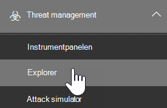
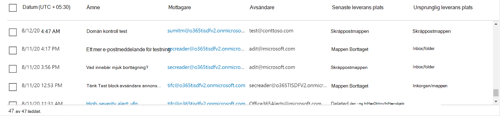
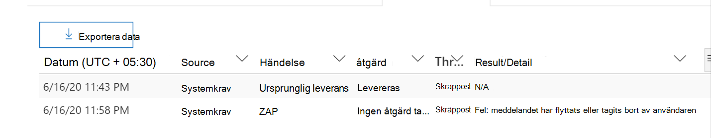
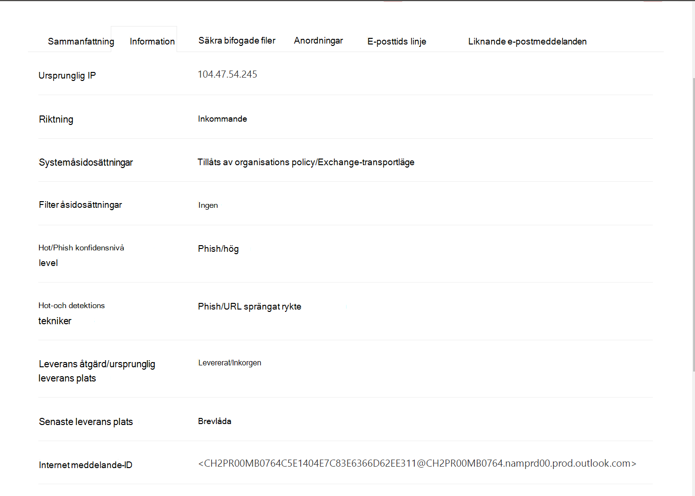
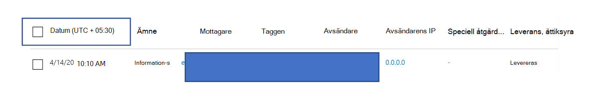
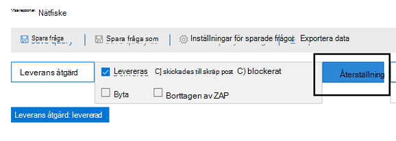
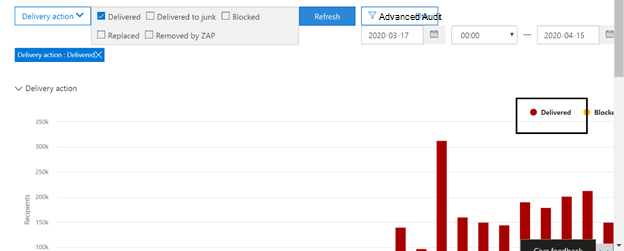
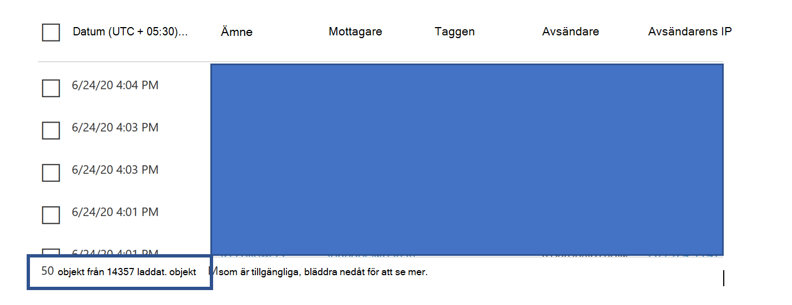

# Threat Explorer och real tids identifieringThreat Explorer and Real-time detections

Om din organisation har [Microsoft Defender för Office 365](office-365-atp.md), och du har [nödvändig behörighet](#required-licenses-and-permissions), har du antingen **Explorer** -eller **real tids identifiering** (tidigare *real tids rapporter* – [se vad som är nytt](#new-features-in-threat-explorer-and-real-time-detections)!).If your organization has [Microsoft Defender for Office 365](office-365-atp.md), and you have the [necessary permissions](#required-licenses-and-permissions), you have either **Explorer** or **Real-time detections** (formerly *Real-time reports* — [see what's new](#new-features-in-threat-explorer-and-real-time-detections)!). Gå till **Threat Management** i säkerhets & efterlevnad och välj sedan **Utforskaren** _eller_ **identifiering av real tid**.In the Security & Compliance Center, go to **Threat management**, and then choose **Explorer** _or_ **Real-time detections**.

|Med Microsoft Defender för Office 365 abonnemang 2 ser du:With Microsoft Defender for Office 365 Plan 2, you see:|Med Microsoft Defender för Office 365 abonnemang 1 ser du:With Microsoft Defender for Office 365 Plan 1, you see:|
|---|---|
|||
|

Med Explorer (eller real tids identifieringar) har du en kraftfull rapport som gör det möjligt för säkerhets åtgärds gruppen att undersöka och reagera på hot effektivt och effektivt.With Explorer (or Real-time detections), you have a powerful report that enables your Security Operations team to investigate and respond to threats effectively and efficiently. Rapporten ser ut ungefär så här:The report resembles the following image:

Med den här rapporten kan du:With this report, you can:

- [Se malware identifieras av Microsoft 365-säkerhetsfunktionerSee malware detected by Microsoft 365 security features](#see-malware-detected-in-email-by-technology)
- [Visa data om nät fiske adresser och klicka på VerdictView data about phishing URLs and click verdict](#view-data-about-phishing-urls-and-click-verdict)
- [Starta en automatiserad undersökning och svars process från en vy i Utforskaren](#start-automated-investigation-and-response) (endast för Office 365 abonnemang 2)[Start an automated investigation and response process from a view in Explorer](#start-automated-investigation-and-response) (Defender for Office 365 Plan 2 only)
- ... [Undersök skadlig e-post och mycket mer](#more-ways-to-use-explorer-or-real-time-detections).... [Investigate malicious email, and more](#more-ways-to-use-explorer-or-real-time-detections)!

## Upplev förbättringar av Threat Explorer och identifiering i real tidExperience Improvements to Threat Explorer and Real-time detections

### Taggar i Threat ExplorerTags in Threat Explorer

> [!NOTE]
> Funktionen användar koder är i förhands granskning, inte tillgänglig för alla och kan komma att ändras.The user tags feature is in Preview, isn't available to everyone, and is subject to change. Information om versions schema finns i Microsoft 365-översikten.For information about the release schedule, check out the Microsoft 365 roadmap.

User-taggar är identifierare för specifika grupper med användare i Microsoft Defender för Office 365.User tags are identifiers for specific groups of users in Microsoft Defender for Office 365. Mer information finns i taggar, licensiering och konfigurering [av taggar.](user-tags.md)For more information around tags, licensing and configuring tags, see [User tags](user-tags.md).

I Threat Explorer kan du se information kring användar koder i följande versioner:Within Threat Explorer, you can see information around user tags in the following experiences:

#### Vyn e-postEmail Grid View

Kolumnerna som visas i e-postrutnätet innehåller alla Taggar som har kopplats till avsändaren eller mottagarna.The Tags column shown in the email grid would contain all the tags that have been applied to the sender or recipient mailboxes. Som standard visas systemtaggar som prioritets konton först.By default, system tags like priority accounts are shown first.

> [!div class="mx-imgBorder"]
> 

#### PaketfilterFiltering

Nu har vi taggar som ett filter så att du bara kan upptäcka bara över prioriterade konton eller specifika användar märknings scenarier (och till och med exkludera resultat med vissa taggar som en del av den här versionen).We now have Tags as a filter so you can hunt just across priority accounts, or specific User tags scenarios (and even exclude results with certain tags as part of this experience). Genom att kombinera dessa med de andra filter som vi tillhandahåller, kan du begränsa omfattningen av undersökningenCombining these with the multiple other filters that we provide, would help you to narrow down your scope of investigation

> [!div class="mx-imgBorder"]
> 

#### Utfällbar e-postinformationEmail Detail Flyout
Om du vill visa de enskilda taggarna för avsändare och mottagare klickar du på ämnet.To view the individual tags for sender and Recipient, click on the subject. Meddelande detaljerna öppnas.It opens the message details flyout. På fliken Sammanfattning visas fälten avsändare och mottagare separat, om de finns för ett e-postmeddelande.In the summary tab, sender and recipient tags are shown separately, if they are present for an email.
Information om enskilda taggar för avsändare och mottagare kan även utökas till exporterad CSV, där du kan se dessa uppgifter i två separata kolumner.The information about individual tags for sender and Recipient, also extends to exported CSV, where you can see these details in 2 separate columns.

> [!div class="mx-imgBorder"]
> 

Information om taggar visas också i URL: er.Tags information is also shown in URL clicks flyout. Om du vill gå till URL-adressen klickar du på Phish eller alla e-postvyer och sedan till URL: er eller URL-Klicka på fliken. om du klickar på en enskild URL-utfällare visas mer information om hur du klickar på URL-adressen och om den är kopplad till det klickade.To get to the URL clicks flyout, you would need to go to Phish or All Email view, and then to URLs or URL Clicks Tab. Clicking on an individual URL flyout would show more details about Clicks for that URL, and would have Tags associated with that click.

> [!div class="mx-imgBorder"]
> 

## Förbättringar av hot mot hotet (kommande)Improvements to Threat Hunting Experience (upcoming)

### Uppdaterad Hot information för e-postUpdated Threat Information for Emails

Vi har fokuserat på förbättringar av plattform och data kvalitet för att öka dataens exakthet och konsekvens för e-post.We have focused on platform and data quality improvements to increase data accuracy and consistency for email records. De här uppdateringarna inkluderar konsolidering av information om för leverans och efter leverans (exempel åtgärd som utförs på ett e-postmeddelande som en del av ZAP-process) till en enda post tillsammans med Richness som skräp post Verdict, hot på enhets nivå (till exempel, vilken URL-adress som är skadlig) och de senaste leverans platserna.These set of updates includes consolidation of pre-delivery and post-delivery information (example action executed on an email as part of ZAP process) into a single record  along with added richness like Spam verdict, Entity level threats (e.g., which URL was malicious) and latest delivery locations.

Efter de här uppdateringarna visas en enda post för varje meddelande, oavsett vilka händelser för inlägg som har utförts.After these updates, you'll see a single entry for each message, regardless of the different post-delivery events that have taken place on the message. Åtgärder kan inkludera ZAP, manuell reparation (vilket betyder administratörs åtgärd), dynamisk leverans o.s.v.Actions can include ZAP, Manual Remediation (which means admin action), Dynamic Delivery etc.

Förutom att Visa skadlig kod och Phish hot kan du nu se skräp post Verdict associerad med ett e-postmeddelande.In addition to showing malware and phish threats, you'll now be able to see spam verdict associated with an email. I e-postmeddelandet kan du se alla hot som är kopplade till e-postmeddelandet tillsammans med motsvarande identifierings teknik.Within the email, you will be able to see all the threats associated with the email along with the corresponding detection technologies. Alla e-postmeddelanden kan ha 0, 1 eller flera hot.Each email can have 0, 1, or multiple threats. De aktuella hoten visas i avsnittet information i den utfällbara e-postadressen.You'll see the current Threats in the Details section of the Email flyout. För att få flera hot (t. ex. ett e-postmeddelande med både skadlig kod och Phish) skulle detta ge den Threat-Detection mappningen, vilket innebär vilken identifierings teknik som ledde till identifieringen av hotet.Additionally, for multiple threats (e.g., an email having both Malware and Phish), Detection tech field would give the Threat-Detection mapping, meaning which detection tech led to the identification of the Threat.

Uppsättningen av identifierings teknologier har uppdaterats till att omfatta nya identifierings metoder, samt funktioner för skräp identifiering och i alla olika e-postvyer (skadlig program vara, Phish, all e-post).The set of detection technologies has been updated to include new detection methods, as well as spam detection technologies, and across all the different email views (Malware, Phish, All Email), you'll have the same, consistent set of Detection technologies to filter the results.

> [!NOTE]
> Verdict-analys kanske inte nödvändigt vis är knuten till enheter.Verdict analysis might not necessarily be tied to entities. Som ett exempel kan ett e-postmeddelande klassificeras som Phish eller spam, men det finns inga URL-adresser som har Phish/spam Verdict.As an example, an email might be classified as Phish or Spam, but there are no URLs which have any Phish/Spam verdict stamped on them. Detta beror på att våra filter också utvärdera innehåll och annan information för ett e-postmeddelande innan de tilldelas en Verdict.This is because our filters also evaluate content and other details for an email, before assigning a verdict.

#### Hot i URL: erThreats in URLs

Med utfällbar e-post-fliken > information kan du nu se det speciella hotet för en URL (hotet för en URL kan vara skadlig, Phish, spam eller ingen alls)Within email flyout-> Details tab, you would now be able to see the specific threat for a URL (Threat for a URL can be Malware, Phish, Spam or None)

> [!div class="mx-imgBorder"]
> 

### Uppdaterad tidslinjevy (kommande)Updated Timeline View (upcoming)

> [!div class="mx-imgBorder"]
> 

Förutom att identifiera alla leverans-och efter leverans händelser ger vyn tids linje också information om det hot som identifieras vid den tidpunkten för en delmängd av dessa händelser.In addition to identifying all delivery and post-delivery events, timeline view also gives information about the Threat identified at that point of time for a subset of these events. Här får du mer information om ytterligare åtgärder (till exempel ZAP, manuell reparation) tillsammans med resultatet av den åtgärden.It also gives you more information about Additional Actions (e.g., ZAP, Manual Remediation) along with the Result of that action. Vyn tids linje innehåller information om den ursprungliga leveransen och därefter eventuella efter leverans händelser utförda på ett e-postmeddelande.Timeline view contains information about the Original delivery and subsequently any post-delivery events performed on an email.

- Källa: det kan vara administratören/systemet/användaren baserat på vad som var händelsen.Source: This can be Admin/System/user based on what was the source of the event.
- Händelse: Detta inkluderar händelser på den översta nivån som ursprunglig leverans, manuell justering, ZAP, inlämning och dynamisk leverans.Event: This includes top-level events like Original Delivery, Manual Remediation, ZAP, Submissions, and Dynamic Delivery.
- Åtgärd: det här gäller för den åtgärd som gjorts antingen som en del av en ZAP-eller administratörs åtgärd (t. ex. mjuk borttagning).Action: This covers the specific action that was taken either as part of ZAP or Admin Action (e.g., Soft Delete).
- Hot: omfattar hoten (skadlig program vara, Phish, spam) som identifieras vid den tidpunkten.Threats: Covers the threats (Malware, Phish, Spam) identified at that point of time.
- Resultat/Detaljer: Här finns mer information om resultatet av åtgärden, om det utfördes som en del av ZAP/administratörs åtgärd.Result/Details: Covers more information about the Result of the Action, whether it was performed as part of ZAP/Admin Action.

### Ursprunglig och senaste leverans platsOriginal and Latest Delivery location

I dag skickar vi Surface leverans plats i e-postrutnät och utfällbar e-post.Today, we surface delivery Location within email grid and email flyout. Framåt, fältet leverans plats ändras till ursprunglig leverans plats.Going forward, the Delivery Location field will be renamed to Original Delivery Location. Dessutom introducerar vi också ett annat fält som heter senaste leverans plats.Additionally, we're also introducing another field called Latest delivery location.

Den ursprungliga leverans platsen skulle ge mer information om var e-postmeddelandet levererades.The original delivery location would give more information about where an email was delivered initially. Den senaste leverans platsen innehåller plats där ett e-postmeddelande kan ha landats efter att system åtgärder som ZAP eller administratörs åtgärder som **Flytta till borttagna objekt**.The latest delivery location would include location where an email may have landed after system actions like ZAP or admin actions like **Move to Deleted Items**. Den senaste leverans platsen är avsedd att informera administratörer om meddelandets senast kända plats efter leverans och alla system-och administratörs åtgärder.Latest delivery location is intended to inform admins of the message's last known location post-delivery or any system/admin actions. Det finns inga åtgärder för slutanvändare på e-postmeddelandet.By design, it doesn't include any end-user-related actions on the email. Till exempel: om en användare tar bort ett meddelande eller flyttar meddelandet till Arkiv/PST uppdateras inte meddelandets leverans plats.For example: if a user deletes a message or moves the message to archive/pst, the message "delivery" location will not be updated. Om en system åtgärd har uppdaterat platsen (till exempel en ZAP som resulterade i ett e-postmeddelande som flyttas till karantänen) ser du den senaste leverans platsen som karantän.However, if a system action updated the location (e.g., ZAP resulting in an email moving to Quarantine), you would see the Latest delivery location as Quarantine.

> [!div class="mx-imgBorder"]
> 

> [!NOTE]
> Det finns några fall där leverans plats och leverans åtgärd kan Visa "okänt" som värde:There are few cases where Delivery Location and Delivery Action may show 'Unknown' as the value:
>
> - Leverans platsen kan visas som levererad och leverans platsen som okänd.You might see Delivery location as Delivered, and Delivery Location as Unknown. Det här inträffar när meddelandet levererades, men en regel för Inkorgen flyttade meddelandet till en standardmapp (utkast, arkiv osv.) i stället för Inkorgen eller mappen skräp post.This happens when the message was delivered, but an Inbox rule moved the message to a default folder (Draft, Archive, etc.) instead of the Inbox or Junk Email folders.
>
> - Den senaste leverans platsen kan vara okänd om en administratör/system åtgärd (till exempel, ZAP, administratörs åtgärd) har prövats men meddelandet inte hittas.Latest Delivery Location can be unknown if an admin/system action (e.g., ZAP, Admin Action) is attempted, but the message isn't found. Vanligt vis utförs åtgärden efter att användaren har flyttat eller tagit bort meddelandet.Typically, the action happens after the user has moved or deleted the Message. I sådana fall ska du kontrol lera kolumnen resultat/information i vyn tids linje.In such cases, verify the Result/Details Column in timeline view. Leta efter meddelandet: meddelandet har flyttats eller tagits bort av användaren.Look for the message: Message moved or deleted by the user.

> [!div class="mx-imgBorder"]
> 

### Ytterligare åtgärderAdditional Actions

Ytterligare åtgärder består av de åtgärder som har tillämpats anslå leveransen av e-postmeddelandet, och kan innehålla ZAP, manuell reparation (åtgärd som vidtas av en administratör, till exempel mjuk borttagning), dynamisk leverans och omarbetad (ett e-postmeddelande identifierades retroaktivt).Additional Actions consist of the actions that were applied post the delivery of the Email, and can include ZAP, Manual Remediation (action taken by an Admin e.g., Soft Delete), Dynamic Delivery, and Reprocessed (an email was retroactively detected as good).

> [!NOTE]
>
> - Som en del av den här ändringen tas värdet borttaget med ZAP i filtret leverans åtgärd bort.As part of this change, the Removed by ZAP value currently surfaced in the Delivery Action filter is going away. Du kan söka efter all e-post med ZAP-försök via ytterligare åtgärder.You'll have a way to search for all email with the ZAP attempt through the Additional Actions.
>
> - Det kommer att finnas nya fält och värden för identifierings teknologier och ytterligare åtgärder (särskilt för ZAP-scenarier).There will be new fields and values for Detection technologies and Additional actions (especially for ZAP scenarios). Utvärdera dina befintliga sparade frågor och spårade frågor för att kontrol lera att de fungerar med de nya värdena.Evaluate your existing Saved Queries and Tracked queries to make sure they work with the new values.

> [!div class="mx-imgBorder"]
> 

### SystemåsidosättningarSystem overrides

Systemåsidosättningar är en metod för att skapa undantag till den avsedda leverans platsen för ett meddelande genom att åsidosätta den leverans plats som tillhandahålls av systemet (baserat på hoten och andra upptäckter som identifieras av vår filtrerings stack).System overrides are a method of making exceptions to the intended delivery location of a message by overriding the delivery location provided by system (based on the threats and other detections identified by our filtering stack). Systemåsidosättningar kan anges via klient organisation eller användar princip för att leverera meddelandet enligt policyn.System overrides can be set through tenant or user policy to deliver the message as suggested by the policy. Åsidosättningar är användbara för att identifiera eventuell oavsiktlig leverans av skadliga meddelanden på grund av konfigurations luckor (till exempel en mycket omfattande policy för säker avsändare som har ställts in av en användare).Overrides are useful in identifying any unintentional delivery of malicious messages due to configurations gaps (for example, a very broad Safe Sender policy set by a user). Dessa värden kan vara:These override values can be:

- Tillåts av en användar princip: det här är när en användare tillåter domäner eller avsändare genom att skapa principer på post lådans nivå.Allowed by user policy: This is when a user allows domains or senders by creating policies at the mailbox level.
- Blockerad av en användar princip: det är när en användare spärrar domäner eller avsändare genom att skapa principer på post lådans nivå.Blocked by user policy: This is when a user blocks domains or senders by creating policies at the mailbox level.
- Tillåtet enligt organisations princip: det här är när organisationens säkerhets team anger principer eller Exchange mail flöde-regler (kallas även transport regler) för att tillåta avsändare och domäner för användare i organisationen.Allowed by org policy: This is when the organization's security teams set policies or Exchange mail flow rules (also known as transport rules) to allow senders and domains for users in their organization. Detta kan vara för en uppsättning användare eller hela organisationen.This can be for a set of users or the entire organization.
- Blockerat av en organisations princip: det här är när organisationens säkerhets team anger principer eller regler för e-postflöde för att blockera avsändare, domäner, meddelande språk eller käll-IP för användare i organisationen.Blocked by org policy: This is when the organization's security teams set policies or mail flow rules to block senders, domains, message languages, or source IPs for users in their organization. Det kan också vara för en uppsättning användare eller hela organisationen.This can also be for a set of users or the entire organization.
- Fil tillägget blockerat av en organisations princip: det här är när ett fil namns tillägg blockeras av en organisations säkerhets team via princip inställningarna mot skadlig program vara.File extension blocked by org policy: This is when a file type extension is blocked by the security teams of an organization through the anti-malware policy settings. Dessa värden visas nu i e-postinformation för att hjälpa till med undersökningar.These values will now be displayed in email details to help with investigations. Secops Teams kan också filtrera på blockerade fil namns tillägg med hjälp av funktionen för RTF-filtrering.Secops teams can also filter on blocked file extensions using the rich filtering capability.

> [!div class="mx-imgBorder"]
> 

### Förbättringar kring URL-och klicknings upplevelserImprovements around URL and Clicks Experience

De förbättringar som prioriteras mot URL och URL klickar på data inkluderar:The set of improvements focused towards URL and URL clicks data include:

- Visar fullständig URL-adress (inklusive frågeparametrar som är en del av URL) i avsnittet klickningar i URL-utfällbar.Showing full Clicked URL (including any query Parameters which are part of URL) within the Clicks Section in URL Flyout. För närvarande visar vi URL-domänen och sökvägen i namn listen.Currently we show the URL domain and path in title bar. Vi förlänger den informationen för att visa hela webb adressen.We're extending that information to show the full URL.

- Korrigeringar via URL-filter (URL kontra URL-domän kontra URL-domän): vi har gjort uppdateringar för att söka efter meddelanden som innehåller en URL-adress/klicka på Verdict.Fixes across URL filters (URL vs URL domain vs URL Domain and path): We've made updates around searching for messages that contain a URL/Click verdict. Som en del av det har vi aktiverat stöd för sökning av protokoll oberoende (vilket betyder att du kan söka efter en URL utan http).As part of that, we've enabled support for protocol agnostic searches (meaning, you can directly search for a URL without http). Som standard mappas URL-sökning till http, om inget annat anges.By default, the URL search maps to http, unless explicitly specified. Till exempel:For example:

  1. Sök med och utan `http://` prefix i "URL", "URL Domain" och "URL Domain and Path", filter fält.Search with and without the `http://` prefix in "URL", "URL Domain", and "URL Domain and Path" filter fields. Det här är konsekvent och bör visa samma resultat.This behavior is consistent, and should show the same result.

  1. Sök efter `https://` prefixet i "URL".Search for the `https://` prefix in "URL". När det inte `http://` anges används prefixet.When not present, the `http://` prefix is assumed.

  1. `/` i början och slutet av "URL-sökväg", "URL-domän", "URL-domän och sökväg" ignoreras.`/` in beginning and end of the "URL path", "URL Domain", "URL domain and path" fields is ignored. `/` i slutet av fältet "URL" ignoreras.`/` at the end of the "URL" field is ignored.

### Phish konfidensnivåPhish Confidence Level

Phish konfidensnivå hjälper dig att identifiera graden av förtroende, med vilken ett e-postmeddelande kategoriserats som Phish.Phish confidence level helps to identify the degree of confidence, with which an email was categorized as Phish. De två möjliga värdena är hög och normal.The two possible values are High and Normal. I de inledande faserna är det här filtret bara tillgängligt i den Phish vyn av Threat Explorer.In the initial stages, this filter will be available only in the Phish view of Threat Explorer.

### ZAP URL-signalZAP URL Signal

Används vanligt vis för Phish varnings scenarier där en e-postadress angavs som Phish och togs bort efter leverans.Typically used for ZAP Phish Alert scenarios where an email was identified as Phish and removed after delivery. Detta används för att koppla aviseringen med motsvarande resultat i Utforskaren.This is used to connect the alert with the corresponding results in Explorer. Det är en av IOCs för aviseringen.It is one of the IOCs for the alert.

Som en del av att förbättra jakt processen har vi gjort några uppdateringar för Threat Explorer och identifiering av real tid.As part of improving the hunting process, we have made a few updates to Threat Explorer and Real-time detections. Det här är en "Experience" förbättringar, med fokus på att göra jakt upplevelsen mer enhetlig.These are 'experience' improvements, with the focus on making the hunting experience more consistent. Dessa ändringar beskrivs nedan:These changes are outlined below:

- [Förbättringar av tidszonTimezone improvements](#timezone-improvements)
- [Uppdatera i uppdaterings processenUpdate in the Refresh process](#update-in-the-refresh-process)
- [Diagram specificering att lägga till i filterChart drilldown to add to filters](#chart-drilldown-to-add-to-filters)
- [Uppdateringar av produkt informationIn product information updates](#in-product-information-updates)

### Filtrera efter användardefinierade TaggarFilter by user tags

Du kan nu sortera och filtrera efter antingen system-eller anpassade användar märkningar för att snabbt förstå.You can now sort and filter by either system or custom user tags, to quickly grasp the scope of threats. Mer information finns i [användar koder](user-tags.md) .See [User tags](user-tags.md) to learn more.

> [!IMPORTANT]
> Filtrering och sortering efter användarmallar är för närvarande i offentlig för hands version.Filtering and sorting by user tags is currently in public preview.
> Den kan ändras väsentligt innan den släpps kommersiellt.It may be substantially modified before it's commercially released. Microsoft lämnar inga garantier, uttryckliga eller underförstådda, med avseende på informationen som tillhandahålls.Microsoft makes no warranties, express or implied, with respect to the information provided about it.

### Förbättringar av tidszonTimezone improvements

Du kommer att se tids zonen för e-postmeddelandena i portalen samt för exporterade data.You will see the timezone for the email records within the Portal, as well as for Exported data. Tids zonen visas i upplevelser som e-postrutnät, information utfällbar, e-posttids linje och liknande e-postmeddelanden, så att tids zonen för resultat uppsättningen är klar för användaren.The timezone will be visible across experiences like Email Grid, Details Flyout, Email Timeline, and Similar Emails, so that the timezone for the result set is clear to the user.

> [!div class="mx-imgBorder"]
> 

### Uppdatera i uppdaterings processenUpdate in the Refresh process

Vi har hört att få feedback kring förvirring med automatisk uppdatering (t. ex. för datum så fort du ändrar datumet kommer sidan att uppdateras) och manuell uppdatering (för andra filter).We have heard feedback around confusion with automatic refresh (e.g. for date, as soon as you change the date, the page would refresh) and manual refresh (for other filters). På samma sätt kan borttagning av filter leda till automatisk uppdatering, vilket gör att situationer där det går att ändra de olika filtren när du ändrar frågan är inkonsekventa Sök upplevelser.Similarly, removing filters leads to automatic refresh, this causes situations where changing the different filters while modifying the query can cause inconsistent search experiences. För att lösa det här flyttar vi till en manuell filtrerings funktion.To solve this, we are moving to a manual filtering mechanism.

Från en miljö synpunkt kan användaren tillämpa och ta bort det olika intervallet med filter (från filter uppsättning och datum) och klicka på knappen Uppdatera för att filtrera resultaten när de har definierats.From an experience standpoint, the user can apply and remove the different range of filters (from the filter set, and date), and press the refresh button to filter the results once they are done with defining the query. Knappen Uppdatera har också uppdaterats så att den visas tydligt på skärmen.The refresh button has also been updated to call it out clearly on the screen. Vi har också uppdaterat beskrivningar och dokumentation i produkten kring den här ändringen.We have also updated tooltips and in-product documentation around this change.

> [!div class="mx-imgBorder"]
> 

### Diagram specificering att lägga till i filterChart drilldown to add to filters

Du kommer nu att kunna Klicka på diagrammets serie värden för att lägga till det värdet som ett filter.You will now be able to click on the chart legend values to add that value as a filter. Observera att du fortfarande måste klicka på knappen Uppdatera för att filtrera resultaten som en del av ändringen som beskrivs ovan.Note that you will still have to click on the refresh button to filter the results as part of the change described above.

> [!div class="mx-imgBorder"]
> 

### Uppdateringar av produkt informationIn product information updates

Du bör också läsa mer om produkten.You should also see additional details within the product. Det totala antalet Sök resultat inom rutnätet (se nedan), samt förbättringar kring etiketter, fel meddelanden och beskrivningar, för att ge mer information kring filter, Sök funktioner och resultat uppsättning.For example, the total number of search results within grid (see below), as well as improvements around labels, error messages and tooltips, to give more information around filters, search experience, and result set.

> [!div class="mx-imgBorder"]
> 

## Utökade funktioner i Threat ExplorerExtended capabilities in Threat Explorer

### Vanligaste riktade användareTop targeted users

Idag står det för en lista över de vanligaste riktade användarna i vyn mot skadlig kod för e-postmeddelanden (i den övre delen av familjen med skadlig kod).Today we expose the list of the top targeted users in the Malware View for Emails (within the Top Malware Families section). Vi kommer att utöka den här vyn i Phish och alla e-postvyer, där du kan se de fem vanligaste användarna tillsammans med antalet försök för varje användare för motsvarande vy (till exempel för Phish-vy kan du se antalet Phish-försök).We will be extending this view within Phish and All Email views as well, where you will be able to see the top five targeted users along with the number of attempts for each user for the corresponding view (for example, for Phish view you will be able to see the number of Phish attempts).
Du kan också exportera listan med riktade användare till en gräns på 3000 tillsammans med antalet försök för offline-analys för varje e-postvy.You will also be able to export the list of targeted users up to a limit of 3000 along with the number of attempts for offline analysis for each email view. Det är bara att välja Nej.In addition to that, selecting No. av försök (till exempel 13 försök nedan) öppnar en filtrerad vy i Threat Explorer så att du kan titta på mer information i alla e-postmeddelanden och hot för den användaren.of attempts (for example, 13 attempts below) would open a filtered view in Threat Explorer, so that you can look at more details across emails and threats for that user.

> [!div class="mx-imgBorder"]
> 

### Exchange Transport-reglerExchange transport rules

Som en del av data berikning bör du även kunna se alla olika transport regler som används för ett meddelande.As part of data enrichment, you should also be able to see all the different transport rules which were applied to a message. Den här informationen visas i vyn e-post-rutnät (om du vill visa det väljer du kolumn alternativ i rutnätet och Lägg till Exchange-transportläge från kolumn alternativen i rutnätet) samt information som visas i e-postmeddelandet.This information will be present within the Email grid view (to view this, select Column options in the grid and add Exchange Transport Rule from the Column options in the grid) as well as Details flyout in the email.
Du kan se både GUID och namnet på de transport regler som har lagts till i meddelandet.You would be able to see both the GUID as well as the name of the transport rules which were applied to the message. Dessutom kan du söka efter meddelanden med hjälp av namnet på transport regeln.Additionally, you would be able to search for the messages using the name of the transport rule. Det här är en "innehåller"-sökning vilket innebär att du kan söka i vissa sökningar.This would be a 'Contains' search which means you will be able to search using partial searches as well.

#### Viktigt Obs!Important Note:

Exchange Sök-och namn tillgänglighet beror på vilken roll som har tilldelats dig.ETR search and name availability would depend on the specific role that has been assigned to you. Du måste ha någon av följande roller/behörigheter för att kunna visa Exchange namn och sökning.You will need to have one of the following roles/permissions in order to view the ETR names and search.  Om du inte har någon av följande roller kopplade till dig kan du inte se namnen på transport reglerna och söka efter meddelanden med hjälp av Exchange-namnen.If you do not have any of the following roles assigned to you, you will not be able to see the names of the transport rules, and search for the messages using the ETR names. Men du kan se Exchange etikett och GUID-information i e-postinformationen.However, you will be able to see the ETR label and GUID information within the Email Details. Det går inte att visa poster i e-postrutnät, e-flyouts, filter och export påverkas inte.Your other experiences around viewing records in Email Grids, Email flyouts, Filters, and Export are not impacted.

- Endast EXO – förhindra data förlust: allaEXO Only - Data Loss Prevention: All
- Endast EXO-O365SupportViewConfig: allaEXO Only - O365SupportViewConfig: All
- AAD eller EXO-säkerhets administratör: allaAAD or EXO - Security Admin: All
- AAD eller EXO – säkerhets läsare: allaAAD or EXO - Security Reader: All
- Endast EXO – transport regler: allaEXO Only - Transport Rules: All
- Endast EXO-View-Only konfiguration: allaEXO Only - View-Only Configuration: All

I e-postrutnätet, den utfällbara informationen och exporterad CSV-fil visas ETR med ett namn/GUID som visas nedan.Within the email grid, Details flyout, and Exported CSV, the ETRs are presented with a Name/GUID as shown below.

> [!div class="mx-imgBorder"]
> 

### Inkommande kopplingarInbound connectors

Kopplingar är en samling instruktioner som anpassar hur din e-post flödar till och från din Microsoft 365-eller Office 365-organisation, med möjligheten att tillämpa säkerhets begränsningar eller kontroller.Connectors are a collection of instructions that customize the way your email flows to and from your Microsoft 365 or Office 365 organization, with the ability to apply any security restriction or controls. I Threat Explorer kan du nu Visa kopplingarna som är relaterade till ett e-postmeddelande och söka efter e-postmeddelanden med hjälp av kopplings namnen.Within Threat Explorer, you will now have the ability to view the connectors which are related to an email as well as search for emails using the connector names.
Sök efter anslutningar är "innehåller", vilket innebär att ofullständiga nyckelords sökningar också fungerar.The search for connectors is 'Contains' in nature which means partial keyword searches should work as well.
I vyn huvud rutnät, den utfällbara informationen och den exporterade CSV-filen visas kopplingarna i namn/GUID-formatet enligt nedan:Within the Main grid view, the Details flyout, and the Exported CSV, the connectors are shown in the Name/GUID format as shown below:

> [!div class="mx-imgBorder"]
> 

## Nya funktioner i Threat Explorer och identifiering av real tidNew features in Threat Explorer and Real-time detections

Tre nya funktioner läggs till i Threat Explorer och real tids identifiering:Three new features added into Threat Explorer and Real-time detections:

- [Förhandsgranska e-posthuvud och hämta e-postmeddelandePreview email header and download email body](#preview-email-header-and-download-email-body)
- [E-posttids linjeEmail timeline](#email-timeline)
- [Exportera URL Klicka på dataExport URL click data](#export-url-click-data)

Dessa nya funktioner beskrivs nedan.These new features are outlined below.

### Förhandsgranska e-posthuvud och hämta e-postmeddelandePreview email header and download email body

Möjligheten att förhandsgranska ett e-posthuvud och hämta e-postmeddelandet är nya funktioner som är tillgängliga i Threat Explorer.The ability to preview an email header and download the email body are new features available in Threat Explorer. Administratörer kan analysera hämtade meddelandehuvuden/e-postmeddelanden för hot.Admins will be able to analyze downloaded headers/email messages for threats. Eftersom hämtning av e-postmeddelanden kan påverka exponeringen av informationen styrs processen av en rollbaserad åtkomst kontroll (RBAC).Because downloading email messages can risk the exposure of information, this process is controlled by roles-based access control (RBAC). En ny roll, för *hands version*, måste läggas till i en annan roll grupp (som säkerhets åtgärder eller säkerhets administratör) för att tillåta möjligheten att hämta e-post och förhandsgranska rubriker i alla e-postmeddelanden.A new role, *Preview*, must be added to another role group (such as Security Operations or Security Administrator) to grant the ability to download mails and preview headers in all-email messages view.

Men Explorer (och real tids identifieringar) lägger också till nya fält som är utformade för att ge dig en mer fullständig bild av var e-postmeddelandena hamnar.But Explorer (and Real-time detections) also adds fresh new fields designed to give you a more complete picture of where your email messages land. En del av syftet med ändringen är att göra det lättare för säkerhetsledandet att skydda dig, men netto resultatet är att du snabbt kan se var det finns problem med e-postmeddelanden.Part of the goal of this change is to make hunting easier for Security Ops people, but the net result is knowing the location of problem email messages at a glance.

Hur gör du det här?How is this done? Leverans status är nu uppdelad i två kolumner:Delivery Status is now broken out into two columns:

- **Leverans åtgärd** – vilken är statusen för det här meddelandet?**Delivery Action** - What is the status of this email?
- **Leverans plats** – var hette detta e-postmeddelande som ett resultat?**Delivery Location** - Where was this email routed as a result?

Leverans åtgärden är den åtgärd som utförs via e-post på grund av befintliga principer eller identifieringar.Delivery Action is the action taken on an email due to existing policies or detections. Här är de möjliga åtgärder som ett e-postmeddelande kan ta:Here are the possible actions an email can take:

|LevererasDelivered|Skräp postJunked|BlockeringBlocked|BytaReplaced|
|---|---|---|---|
|E-postmeddelandet skickades till Inkorgen eller mappen för en användare och användaren kan komma åt den direkt.Email was delivered to Inbox or folder of a user and the user can directly access it.|E-postmeddelandet skickades till antingen en användares skräppost eller borttagna mapp och användaren har till gång till e-post i dessa mappar.Email was sent to either user's Junk folder or Deleted folder, and the user has access to emails in those folders.|Alla e-postmeddelanden som har satts i karantän, som misslyckats eller tagits bort.Any emails that are quarantined, that  failed, or were dropped. Det här är fullständigt otillgängligt för användaren!This is completely inaccessible by the user!|Alla e-postmeddelanden där skadliga bifogade filer ersätts med txt-filer som gör att den bifogade filen har skadligt.Any email where malicious attachments are replaced by .txt files that state the attachment was malicious.|

|LevererasDelivered|Skräp postJunked|BlockeringBlocked|BytaReplaced|
|---|---|---|---|
|E-postmeddelandet skickades till användarens inkorg eller till en annan mapp, och användaren kan komma åt den direkt.Email was delivered to the user's inbox or another folder, and the user can directly access it.|E-postmeddelandet skickades antingen till användarens skräppostmappen eller mappen borttagen, och användaren har till gång till e-postmeddelanden i dessa mappar.Email was sent to either user's Junk folder or Deleted folder, and the user has access to email messages in those folders.|Alla e-postmeddelanden som har satts i karantän, som misslyckats eller tagits bort och inte är tillgängliga för användaren.Any email messages that are quarantined, that failed, or were dropped, and are not accessible by the user.|Alla e-postmeddelanden där skadliga bifogade filer ersattes med txt-filer som anger att de bifogade filerna var skadliga.Any email messages where malicious attachments were replaced by .txt files that state the attachments were malicious.|
|

Så här ser användaren vad de kan se och vad de inte kan:And here is what the user can see, and what they can't:

|Tillgänglig för slutanvändareAccessible to end users|Ej tillgänglig för slutanvändareInaccessible to end users|
|---|---|
|LevererasDelivered|BlockeringBlocked|
|Skräp postJunked|BytaReplaced|

Leverans platsen visar resultaten av principer och upptäckter med efter-leverans.Delivery location shows the results of policies and detections that run post-delivery. Den är länkad till en leverans åtgärd.It's linked to a Delivery Action. Det här fältet lades till för att ge insyn i den åtgärd som utförs när ett problem har uppstått.This field was added to give insight into the action taken when a problem mail is found. Här är möjliga värden för leverans plats:Here are the possible values of delivery location:

- **Inkorgen eller mapp**: e-postmeddelandet finns i Inkorgen eller i en mapp (enligt dina e-postregler).**Inbox or folder**: The email is in inbox or a folder (according to your email rules).
- **On-lokala eller external**: post lådan finns inte i molnet, men den är lokal.**On-prem or external**: The mailbox doesn't exist on cloud but is on-premises.
- **Skräppostmappen**: e-postmeddelandet finns i skräppostmappen för en användare.**Junk folder**: The email is in the Junk folder of a user.
- **Mappen Borttaget**: e-post i mappen Borttaget för en användare.**Deleted items folder**: The email in the Deleted items folder of a user.
- **Karantän**: e-postmeddelandet i karantän och finns inte i en användares post låda.**Quarantine**: The email in quarantine, and is not in a user's mailbox.
- **Misslyckades**: det gick inte att nå post lådan.**Failed**: The email failed to reach the mailbox.
- **Släppt**: e-postmeddelandet tappas bort någonstans i e-postflödet.**Dropped**: The email gets lost somewhere in the mail flow.

### E-posttids linjeEmail timeline

**E-Posttids linjen** är en ny Explorer-funktion som syftar till att förbättra jakt upplevelsen för administratörer.The **Email Timeline** is another new Explorer feature aimed at making the hunting experience better for admins. Den minskar med slumpmässigheten eftersom det är mindre tid att kontrol lera olika platser för att försöka förstå händelsen.It cuts down on randomization because there is less time spent checking different locations to try to understand the event. När flera händelser inträffar till, eller nära till, samma tid i ett e-postmeddelande, visas händelserna i vyn tids linje.When multiple events happen at, or close to, the same time on an email, those events will show up in a timeline view. Vissa händelser som inträffar efter leverans till din e-post sparas i förhållande till "särskild åtgärd"-kolumnen.In fact, some events that happen post-delivery to your mail will be captured in the 'Special action' column. Om du kombinerar informationen från tids linjen för det e-postmeddelandet med den speciella åtgärden som utförs på post-leveransen får administratörer inblick i hur deras principer fungerar, där e-postmeddelandet slutligen skickades och, i vissa fall, vad den slutliga utvärderingen var.Combining the information from the timeline of that mail with the special action taken on the mail post-delivery will give admins insight into how their policies work, where the mail was finally routed, and, in some cases, what the final assessment was.

Mer information om hur du undersöker illasinnade e-postmeddelanden finns i [undersöka och åtgärda skadlig e-post som har levererats i Office 365](investigate-malicious-email-that-was-delivered.md).For more discussion about investigating malicious email messages, see [Investigate and remediate malicious email that was delivered in Office 365](investigate-malicious-email-that-was-delivered.md).

### Exportera URL Klicka på dataExport URL click data

Du kan då nu exportera rapporter för URL-musklick till Microsoft Excel för att visa både deras nätverks meddelande-ID och deras Klicka på Verdict, så att du kan förstå var din URL-adress klicka på trafik har blivit enklare.Also, you will now be able to export reports for URL clicks to Microsoft Excel in order to view both their Network Message ID, and their Click Verdict, making the task of understanding where your URL click traffic originated easier. Så här fungerar det.Here's how it works. Starta med Threat Management i snabb start för Office 365 genom att klicka igenom den här kedjan:Starting in Threat Management on the Office 365 quick-launch, click through this chain:

**Utforskaren** \> **Visa Phish** \> **Klickar på** \> **De översta URL-adresserna eller webb adressen** \> **Klicka på en post för att öppna webb adressen****Explorer** \> **View Phish** \> **Clicks** \> **Top URLs or URL Top Clicks** \> **Click on any record to open URL flyout**

När du klickar på en URL-adress i listan visas en ny exportera-knapp på panelen utflygande.When you click on a URL in the list, you'll see a new Export button on the fly-out panel. Använd den här knappen för att flytta data till ett Excel-kalkylblad för enklare rapportering.Use this button to move data to an Excel spreadsheet for easier reporting.

Du kan komma till samma plats i rapporten för rapporter i real tid så här:You can get to the same location in the Real-time detections report as follows:

**Utforskaren** \> **Real tids identifiering** \> **Visa Phish** \> **URL: er** \> **Översta URL-adresser eller högst upp** \> **Klicka på en post för att öppna webb adressen** \> **Gå till fliken klickningar.****Explorer** \> **Real-time detections** \> **View Phish** \> **URLs** \> **Top URLs or Top Clicks** \> **Click on any record to open URL flyout** \> **Navigate to the Clicks Tab.**

> [!TIP]
> ID för nätverks meddelanden du klickar på tillbaka till vissa e-postmeddelanden när du söker via Utforskaren eller tillhör ande tredje parts verktyg via nätverks meddelande-ID.Network Message ID maps the click back to specific mails when you search through Explorer or associated third-party tools via Network Message ID. Om du söker igenom nätverks meddelande-ID: t får administratörer det specifika e-postmeddelandet som är associerat med ett KlickaSearching through the Network Message ID will give admins the specific email associated with a click result. Vid export är identifiering av nätverks meddelande-ID för snabbare och effektivare analys.On export, having the correlating identification of Network Message ID makes for quicker and more powerful analysis.

> [!div class="mx-imgBorder"]
> 

## Se malware identifierat i e-post efter teknikSee malware detected in email by technology

Anta att du vill se hur skadlig kod identifieras i e-post, av Microsoft 365-teknologi.Suppose you want to see malware detected in email, by Microsoft 365 technology. För att göra det här använder du [e-postmeddelandet med > skadlig program vara](threat-explorer-views.md#email--malware) för Explorer (eller real tids identifiering).To do this, use the [Email > Malware](threat-explorer-views.md#email--malware) view of Explorer (or Real-time detections).

1. [https://protection.office.com](https://protection.office.com)Välj **Threat Management**  >  **Explorer** (eller **real tids identifiering**) i gruppen säkerhets & efterlevnad.In the Security & Compliance Center ([https://protection.office.com](https://protection.office.com)), choose **Threat management** > **Explorer** (or **Real-time detections**). (Det här exemplet använder Utforskaren.)(This example uses Explorer.)

2. Välj **View** **e-**  >  **postmalware** på Visa-menyn.In the **View** menu, choose **Email** > **Malware**.

   > [!div class="mx-imgBorder"]
   > 

3. Klicka på **avsändare** och välj sedan **grundläggande**  >  **identifierings teknik**.Click **Sender**, and then choose **Basic** > **Detection technology**.

   Din identifierings teknik är nu tillgänglig som filter för rapporten.Your detection technologies are now available as filters for the report.

   > [!div class="mx-imgBorder"]
   > 

4. Välj ett alternativ och klicka sedan på knappen **Uppdatera** för att tillämpa filtret.Select an option, and then click the **Refresh** button to apply that filter.

   > [!div class="mx-imgBorder"]
   > 

Rapporten uppdateras för att visa resultatet skadlig program vara som identifieras i e-post, med det teknik alternativ du valt.The report refreshes to show the results malware detected in email, using the technology option you selected. Härifrån kan du göra ytterligare analyser.From here, you can conduct further analysis.

## Visa data om nät fiske adresser och klicka på VerdictView data about phishing URLs and click verdict

Anta att du vill se nät fiske försök via URL: er via e-post, inklusive en lista med URL-adresser som tilläts, blockerades och åsidosatts.Suppose that you want to see phishing attempts through URLs in email, including a list of URLs that were allowed, blocked, and overridden. Om du vill konfigurera URL-adresser som har klickats kräver [säkra länkar](atp-safe-links.md) .Identifying URLs that were clicked requires [Safe Links](atp-safe-links.md) to be configured. Kontrol lera att du har angett [principer för säkra länkar](set-up-atp-safe-links-policies.md) för att klicka på skydd och loggning av Klicka på Verdicts efter Safe Links.Make sure that you have set up [Safe Links policies](set-up-atp-safe-links-policies.md) for time-of-click protection and logging of click verdicts by Safe Links.

Om du vill granska Phish URL-adresser i meddelanden och klickar på URL: er i Phish meddelanden använder du [e-post> Phish](threat-explorer-views.md#email--phish) vyn av Utforskaren (eller real tids identifieringar).To review phish URLs in messages and clicks on URLs in phish messages, use the [Email > Phish](threat-explorer-views.md#email--phish) view of Explorer (or Real-time detections).

1. [https://protection.office.com](https://protection.office.com)Välj **Threat Management**  >  **Explorer** (eller **real tids identifiering**) i gruppen säkerhets & efterlevnad.In the Security & Compliance Center ([https://protection.office.com](https://protection.office.com)), choose **Threat management** > **Explorer** (or **Real-time detections**). (Det här exemplet använder Utforskaren.)(This example uses Explorer.)

2. Välj **e-** Phish på **Visa** -menyn  >  **Phish**.In the **View** menu, choose **Email** > **Phish**.

   > [!div class="mx-imgBorder"]
   > 

3. Klicka på **avsändare** och välj **URL-adresser**  >  **på Verdict**.Click **Sender**, and then choose **URLs** > **Click verdict**.

4. Välj ett eller flera alternativ, till exempel **blockerat** och **blockera**, och klicka sedan på knappen **Uppdatera** på samma rad som de alternativ som används för att tillämpa filtret.Select one or more options, such as **Blocked** and **Block overridden**, and then click the **Refresh** button that is on the same line as the options to apply that filter. (Uppdatera inte webbläsarfönstret.)(Don't refresh your browser window.)

   > [!div class="mx-imgBorder"]
   > 

   Rapporten uppdateras och visar två olika URL-tabeller på fliken URL under rapporten:The report refreshes to show two different URL tables on the URL tab under the report:

   - De **vanligaste URL** -adresserna är de URL-adresser som visas i de meddelanden som du har filtrerat ned till och hur många e-postleveranser som är tillgängliga**Top URLs** are the URLs contained in the messages you have filtered down to, and the email delivery action counts for each URL. I Phish e-postvy innehåller listan normalt legitima URL: er.In the phish email view, this list typically will contain legitimate URLs. Attackerare inkluderar en blandning av bra och dåliga URL-adresser i sina meddelanden för att försöka komma åt dem, men de tar bort de skadliga länkarna mer intressant för användaren att klicka på.Attackers include a mix of good and bad URLs in their messages to try to get them delivered, but they will make the malicious links more interesting for the user to click. Tabellen med URL-adresser sorteras efter totalt antal e-postmeddelanden (men Observera att den här kolumnen är dold för att förenkla vyn).The table of URLs is sorted by total email count (but note that this column is hidden to simplify the view).

   - De **bästa klickningarna** är de inkapslade länkarna som du har klickat på, sorterat efter totalt antal klickningar (den här kolumnen visas inte för att förenkla vyn).**Top clicks** are the Safe Links wrapped URLs that were clicked, sorted by total click count (this column is also not shown to simplify the view). Kolumnen totalt antal gånger visar de säkra länkarna Klicka på Verdict antal för varje klickning-URL.Total counts by column indicate the Safe Links click verdict count for each clicked URL. I Phish e-postvy är de oftare misstänkta eller illasinnade webb adresser, men kan innehålla URL-adresser som inte är Hot men som är i Phish meddelanden.In the phish email view, these are more often suspicious or malicious URLs, but could include URLs that are not threats but are in phish messages. URL-klickningar på ej figursatta länkar visas inte här.URL clicks on unwrapped links will not show up here.

   I de två URL-tabellerna visas de högsta URL-adresserna i phishing-e-postmeddelanden efter leverans åtgärd och plats, och de visar URL-klickningar som har blockerats (eller som besökts trots en varning) så att du kan förstå vilka potentiella felaktiga länkar som användare har fått och interagerat med av användare.The two URL tables show top URLs in phishing email messages by delivery action and location, and they show URL clicks that were blocked (or visited despite a warning) so that you can understand what potential bad links were received by users and interacted with by users. Härifrån kan du göra ytterligare analyser.From here, you can conduct further analysis. Under diagrammet kan du till exempel se de högsta URL-adresserna i e-postmeddelanden som har blockerats i organisationens miljö.For example, below the chart, you can see the top URLs in email messages that were blocked in your organization's environment.

   > [!div class="mx-imgBorder"]
   > 

   Välj en URL för att visa mer detaljerad information.Select a URL to view more detailed information.

   > [!NOTE]
   > I dialog rutan URL-utfällbar text tas filtreringen av e-postmeddelanden bort så att du får fullständig vy över URL-vyns exponering i miljön.In the URL flyout dialog, the filtering on email messages is removed to show you the full view of the URL's exposure in your environment. Med den här funktionen kan du filtrera ned e-postmeddelanden i Utforskaren till dem du är orolig för, hitta specifika URL-adresser som är potentiella hot och sedan utöka din förståelse av URL-exponeringen i din miljö (via dialog rutan URL-information) utan att behöva lägga till URL-filter i själva Utforskarvyn.This lets you filter down email messages in Explorer to ones you are concerned about, find specific URLs that are potential threats, then expand your understanding of the URL exposure in your environment (via the URL details dialog) without having to add URL filters to the Explorer view itself.

### Tolkning av olika klick verdictsInterpretation of different click verdicts

I e-postmeddelandet eller URL-flyouts, de viktigaste tryckningarna samt i vår filter upplevelse ser du olika klick värden som en del av din jakt upplevelse.Within the Email or URL flyouts, Top Clicks as well as within our filtering experiences, you will see different click values as part of your hunting experience. I det här avsnittet kan du välja Verdicts och deras tolkning:Below are the possible values of Click Verdicts and their interpretation:

- **Ingen**: det gick inte att skapa Verdict för URL-adressen.**None**: We were unable to capture the verdict for the URL. Användaren kanske har klickat via webb adressen.The user might have clicked through the URL.
- **Tillåten**: användaren har fått åtkomst till URL-adressen.**Allowed**: The user was allowed to navigate to the URL.
- **Blockerat**: användaren hindrades från att navigera till webb adressen.**Blocked**: The User was blocked from navigating to the URL.
- **Väntande Verdict**: användaren har presenter ATS med den väntande sidan för Sprängaren.**Pending verdict**: The user was presented with the detonation pending page.
- **Blockerad åsidosatt**: användaren hindrades från att gå till URL-adressen. användaren overrode dock att gå till URL-adressen.**Blocked overridden**: The user was blocked from navigating to the URL; however, the user overrode the block to navigate to the URL.
- **Väntande Verdict förbigåde**: användaren uppvisade sig med sidan detonation; användaren overrode till sidan för att gå till URL-adressen.**Pending verdict bypassed**: The user was presented with the detonation page; however, the user overrode the page to navigate to the URL.
- **Fel**: användaren uppvisade fel sidan.**Error**: The user was presented with the error page. Det kan också betyda att det fanns ett fel när du hämtade Verdict.This can also mean there was an error in capturing the verdict.
- **Fel**: ett okänt undantag uppstod när du hämtade Verdict.**Failure**: There was unknown exception while capturing the verdict. Användaren kanske har klickat via webb adressen.The user might have clicked through the URL.

## Granska e-postmeddelanden som rapporter ATS av användareReview email messages reported by users

Anta att du vill se e-postmeddelanden som användare i organisationen har rapporterat som skräp post, inte skräp post eller nätfiske med hjälp av [rapport tillägget för Outlook och Outlook på webben](enable-the-report-message-add-in.md).Suppose that you want to see email messages that users in your organization have reported as Junk, Not Junk, or Phishing by using the [Report Message add-in for Outlook and Outlook on the web](enable-the-report-message-add-in.md). För att göra detta kan du använda [e-post>-](threat-explorer-views.md#email--submissions) vyn i Utforskaren (eller real tids identifieringar).To do this, use the [Email > Submissions](threat-explorer-views.md#email--submissions) view of Explorer (or Real-time detections).

1. [https://protection.office.com](https://protection.office.com)Välj **Threat Management**  >  **Explorer** (eller **real tids identifiering**) i gruppen säkerhets & efterlevnad.In the Security & Compliance Center ([https://protection.office.com](https://protection.office.com)), choose **Threat management** > **Explorer** (or **Real-time detections**). (Det här exemplet använder Utforskaren.)(This example uses Explorer.)

2. Välj **View** **e-**  >  **postinlägg** i menyn Visa.In the **View** menu, choose **Email** > **Submissions**.

   > [!div class="mx-imgBorder"]
   > 

3. Klicka på **avsändare** och välj sedan **enkel**  >  **typ av rapport**.Click **Sender**, and then choose **Basic** > **Report type**.

4. Välj ett alternativ, till exempel **Phish**, och klicka sedan på knappen **Uppdatera** .Select an option, such as **Phish**, and then click the **Refresh** button.

   > [!div class="mx-imgBorder"]
   > 

Rapporten uppdateras och visar information om e-postmeddelanden som personer i organisationen har rapporterat som ett nät fiske försök.The report refreshes to show data about email messages that people in your organization have reported as a phishing attempt. Du kan använda den här informationen för att utföra ytterligare analyser och, om det behövs, justera dina [skydds principer i Microsoft Defender för Office 365](configure-atp-anti-phishing-policies.md).You can use this information to conduct further analysis, and if necessary, adjust your [anti-phishing policies in Microsoft Defender for Office 365](configure-atp-anti-phishing-policies.md).

## Starta automatisk undersökning och svarStart automated investigation and response

> [!NOTE]
> Den automatiska undersöknings-och svars funktionerna är tillgängliga i **Microsoft Defender för Office 365 abonnemang 2** och **Office 365 E5**.Automated investigation and response capabilities are available in **Microsoft Defender for Office 365 Plan 2** and **Office 365 E5**.

(Ny!) Den [automatiska undersökningen och svaret](automated-investigation-response-office.md) kan spara säkerhets arbets gruppen i stort sett tid och ansträngning för att undersöka och begränsa cyberattacks.(NEW!) [Automated investigation and response](automated-investigation-response-office.md) can save your security operations team much time and effort in investigating and mitigating cyberattacks. Förutom att konfigurera aviseringar som kan utlösa en säkerhets Playbook kan du starta en automatiserad undersökning och svars process från en vy i Utforskaren.In addition to configuring alerts that can trigger a security playbook, you can start an automated investigation and response process from a view in Explorer.

För mer information, se [exempel: en säkerhets administratör utlöser en undersökning från Utforskaren](automated-investigation-response-office.md#example-a-security-administrator-triggers-an-investigation-from-threat-explorer).For details on this, see [Example: A security administrator triggers an investigation from Explorer](automated-investigation-response-office.md#example-a-security-administrator-triggers-an-investigation-from-threat-explorer).

## Fler sätt att använda Explorer (eller real tids identifiering)More ways to use Explorer (or Real-time detections)

Utöver de scenarier som beskrivs i den här artikeln finns det många fler rapporterings alternativ som är tillgängliga med Explorer (eller real tids identifieringar).In addition to the scenarios outlined in this article, you have many more reporting options available with Explorer (or Real-time detections).

- [Hitta och undersöka skadlig e-post som har levereratsFind and investigate malicious email that was delivered](investigate-malicious-email-that-was-delivered.md)
- [Visa skadliga filer som identifieras i SharePoint Online, OneDrive och Microsoft TeamsView malicious files detected in SharePoint Online, OneDrive, and Microsoft Teams](malicious-files-detected-in-spo-odb-or-teams.md)
- [Få en översikt över vyerna i Threat Explorer (och identifieringar i real tid)Get an overview of the views in Threat Explorer (and Real-time detections)](threat-explorer-views.md)
- [Statusrapport för hotskyddThreat protection status report](view-email-security-reports.md#threat-protection-status-report)
- [Automatisk undersökning och svar i skydd mot Microsoft ThreatAutomated investigation and response in Microsoft Threat Protection](https://docs.microsoft.com/microsoft-365/security/mtp/mtp-autoir)

## Nödvändiga licenser och behörigheterRequired licenses and permissions

Du måste ha [Microsoft Defender för Office 365](office-365-atp.md) för att få Explorer eller real tids identifiering.You must have [Microsoft Defender for Office 365](office-365-atp.md) to get Explorer or Real-time detections.

- Explorer ingår i Defender för Office 365 abonnemang 2.Explorer is included in Defender for Office 365 Plan 2.
- Rapporten om real tids identifiering ingår i Defender för Office 365 abonnemang 1.The Real-time detections report is included in Defender for Office 365 Plan 1.
- Planera för att tilldela licenser för alla användare som ska skyddas av Defender för Office 365.Plan to assign licenses for all users who should be protected by Defender for Office 365. (Explorer eller real tids identifiering visar identifierings data för licensierade användare.)(Explorer or Real-time detections shows detection data for licensed users.)

Om du vill visa och använda Explorer-eller real tids identifiering måste du ha lämplig behörighet, till exempel en säkerhets administratör eller en säkerhets läsare.To view and use Explorer or Real-time detections, you must have appropriate permissions, such as those granted to a security administrator or security reader.

- För säkerhets & Compliance Center måste du ha någon av följande roller tilldelade:For the Security & Compliance Center, you must have one of the following roles assigned:

  - OrganisationshanteringOrganization Management
  - Säkerhets administratör (detta kan tilldelas i Azure Active Directory Admin Center ( [https://aad.portal.azure.com](https://aad.portal.azure.com) ))Security Administrator (this can be assigned in the Azure Active Directory admin center ([https://aad.portal.azure.com](https://aad.portal.azure.com)))
  - Säkerhets läsareSecurity Reader

- För Exchange Online måste du ha någon av följande roller tilldelade i antingen administrations centret för Exchange ( [https://outlook.office365.com/ecp](https://outlook.office365.com/ecp) ) eller med PowerShell-cmdletar (se [Exchange Online PowerShell](https://docs.microsoft.com/powershell/exchange/exchange-online-powershell)):For Exchange Online, you must have one of the following roles assigned in either the Exchange admin center ([https://outlook.office365.com/ecp](https://outlook.office365.com/ecp)) or with PowerShell cmdlets (See [Exchange Online PowerShell](https://docs.microsoft.com/powershell/exchange/exchange-online-powershell)):

  - OrganisationshanteringOrganization Management
  - Organisations hantering för endast visningView-only Organization Management
  - Roll för View-Only mottagareView-Only Recipients role
  - Hantering av efterlevnadCompliance Management

Mer information om roller och behörigheter finns i följande resurser:To learn more about roles and permissions, see the following resources:

- [Behörigheter i Säkerhets- och efterlevnadscentretPermissions in the Security & Compliance Center](permissions-in-the-security-and-compliance-center.md)
- [Behörigheter för funktioner i Exchange OnlineFeature permissions in Exchange Online](https://docs.microsoft.com/exchange/permissions-exo/feature-permissions)

## Skillnader mellan Threat Explorer och identifiering av real tidSome differences between Threat Explorer and Real-time detections

- Rapporten om **identifiering av real tid** är tillgänglig i Defender för Office 365 abonnemang 1, medan **hot Explorer** är tillgänglig i Defender för Office 365 plan 2.The **Real-time detections** report is available in Defender for Office 365 Plan 1, whereas **Threat Explorer** is available in Defender for Office 365 Plan 2.
- Med rapporten **real tids identifiering** kan du Visa identifieringar i real tid.The **Real-time detections** report allows you to view detections in real-time. **Threat Explorer** fungerar också, men du kan även visa ytterligare information om en viss attack.**Threat Explorer** does this as well, but also allows you to view additional details for a given attack.
- En **all e-** postvy är tillgänglig i **Threat Explorer** (och är inte med i rapporten om **identifiering i real tid** ).An **All email** view is available in **Threat Explorer** (and is not in the **Real-time detections** report).
- Fler filter funktioner och tillgängliga åtgärder ingår i **Threat Explorer**.More filtering capabilities and available actions are included in **Threat Explorer**.

Mer information finns i [Microsoft Defender för Office 365 Service Description: funktions tillgänglighet i Defender för office 365-abonnemang](https://docs.microsoft.com/office365/servicedescriptions/office-365-advanced-threat-protection-service-description#feature-availability-across-advanced-threat-protection-atp-plans).For more details, see [Microsoft Defender for Office 365 Service Description: Feature availability across Defender for Office 365 plans](https://docs.microsoft.com/office365/servicedescriptions/office-365-advanced-threat-protection-service-description#feature-availability-across-advanced-threat-protection-atp-plans).
