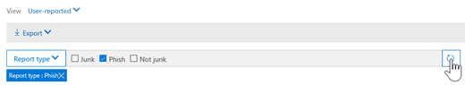

# Threat Explorer och real tids identifieringThreat Explorer and Real-time detections

Om din organisation har [Microsoft Defender för Office 365](office-365-atp.md) och du har de [nödvändiga behörigheterna](#required-licenses-and-permissions)har du åtkomst till *Explorer* eller *real tids identifiering*, som tidigare var *real tids rapporter*.If your organization has [Microsoft Defender for Office 365](office-365-atp.md) and you have the [necessary permissions](#required-licenses-and-permissions), you have access to *Explorer* or *Real-time detections*, which were formerly *Real-time reports*. ([Se vad som är nytt.](#new-features-in-threat-explorer-and-real-time-detections)) Gå till **Threat Management** i säkerhets & efterlevnad och välj sedan **Utforskaren** _eller_ **identifiering av real tid**.([See what's new.](#new-features-in-threat-explorer-and-real-time-detections)) In the Security & Compliance Center, go to **Threat management**, and then select **Explorer** _or_ **Real-time detections**.

|Med Microsoft Defender för Office 365 abonnemang 2 ser du:With Microsoft Defender for Office 365 Plan 2, you see:|Med Microsoft Defender för Office 365 abonnemang 1 ser du:With Microsoft Defender for Office 365 Plan 1, you see:|
|---|---|
|||
|

Explorer och identifiering av real tid gör att dina säkerhets åtgärder kan undersöka och reagera på hot effektivt.Explorer or Real-time detections helps your security operations team investigate and respond to threats efficiently. Rapporten ser ut ungefär så här:The report resembles the following image:

Med den här rapporten kan du:With this report, you can:

- [Se malware identifieras av Microsoft 365-säkerhetsfunktionerSee malware detected by Microsoft 365 security features](#see-malware-detected-in-email-by-technology)
- [Visa nät fiske-URL och klicka på Verdict dataView phishing URL and click verdict data](#view-phishing-url-and-click-verdict-data)
- [Starta en automatiserad undersökning och svars process från en vy i Utforskaren](#start-automated-investigation-and-response) (endast för Office 365 abonnemang 2)[Start an automated investigation and response process from a view in Explorer](#start-automated-investigation-and-response) (Defender for Office 365 Plan 2 only)
- [Undersök skadlig e-post och mycket merInvestigate malicious email, and more](#more-ways-to-use-explorer-and-real-time-detections)

## Förbättringar av Threat Explorer och identifiering i real tidImprovements to Threat Explorer and Real-time detections

### Taggar i Threat ExplorerTags in Threat Explorer

> [!NOTE]
> Funktionen användar koder är i *förhands granskning*, inte tillgänglig för alla och kan komma att ändras.The user tags feature is in *Preview*, isn't available to everyone, and is subject to change. Information om versions schema finns i Microsoft 365-översikten.For information about the release schedule, check out the Microsoft 365 roadmap.

User-Taggar identifierar specifika grupper med användare i Microsoft Defender för Office 365.User tags identify specific groups of users in Microsoft Defender for Office 365. Mer information om taggar, inklusive licensiering och konfiguration finns i [användar koder](user-tags.md).For more information about tags, including licensing and configuration, see [User tags](user-tags.md).

I Threat Explorer kan du se information om användar koder i följande versioner.In Threat Explorer, you can see information about user tags in the following experiences.

#### Vyn e-postEmail grid view

Kolumnen **taggar** i e-postrutnätet innehåller alla Taggar som har kopplats till avsändaren eller mottagarna.The **Tags** column in the email grid contains all the tags that have been applied to the sender or recipient mailboxes. Som standard visas systemtaggar som prioritets konton först.By default, system tags like priority accounts are shown first.

> [!div class="mx-imgBorder"]
> 

#### PaketfilterFiltering

Du kan använda taggar som ett filter.You can use tags as a filter. Det är bara att använda specifika användar märknings scenarier.Hunt just across priority accounts or specific user tags scenarios. Du kan också utesluta resultat med vissa taggar.You can also exclude results that have certain tags. Kombinera denna funktion med andra filter för att begränsa omfattningen av undersökningen.Combine this functionality with other filters to narrow your scope of investigation.

> [!div class="mx-imgBorder"]
> 

#### Utfällbar e-postinformationEmail detail flyout
Om du vill visa de enskilda taggarna för avsändare och mottagare markerar du ämnet för att öppna utfällda meddelanden.To view the individual tags for sender and recipient, select the subject to open the message details flyout. På fliken **Sammanfattning** visas fälten avsändare och mottagare separat, om de finns för ett e-postmeddelande.On the **Summary** tab, the sender and recipient tags are shown separately, if they're present for an email.
Informationen om enskilda taggar för avsändare och mottagare utökas också till exporterade CSV-data där du kan se dessa uppgifter i två separata kolumner.The information about individual tags for sender and recipient also extends to exported CSV data, where you can see these details in two separate columns.

> [!div class="mx-imgBorder"]
> 

Information om taggar visas också i URL: en.Tags information is also shown in the URL clicks flyout. Om du vill visa det går du till Phish eller alla e-postvyer och sedan till fliken **URL** eller **URL** . Välj en URL utfällbar för att visa ytterligare information om klickningar för URL: en, inklusive taggar som är kopplade till det klickade.To view it, go to Phish or All Email view and then to the **URLs** or **URL Clicks** tab. Select an individual URL flyout to view additional details about clicks for that URL, including tags associated with that click.

> [!div class="mx-imgBorder"]
> 

## Förbättringar av hotet mot hot (kommande)Improvements to the threat hunting experience (upcoming)

### Uppdaterad Hot information för e-postUpdated threat information for emails

Vi har fokuserat på förbättringar av plattform och data kvalitet för att öka dataens exakthet och konsekvens för e-post.We've focused on platform and data-quality improvements to increase data accuracy and consistency for email records. Förbättringar inkluderar konsolidering av information för leverans och efter leverans, till exempel åtgärder som utförts i ett e-postmeddelande som en del av ZAP-processen, i en enda post.Improvements include consolidation of pre-delivery and post-delivery information, such as actions executed on an email as part of the ZAP process, into a single record. Ytterligare information som skräp post Verdict, hot på enhets nivå (till exempel vilken URL är skadlig) och de senaste leverans platserna ingår också.Additional details like spam verdict, entity-level threats (for example, which URL was malicious), and latest delivery locations are also included.

Efter de här uppdateringarna visas en enda post för varje meddelande, oavsett vilka händelser efter leveransen som påverkar meddelandet.After these updates, you'll see a single entry for each message, regardless of the different post-delivery events that affect the message. Åtgärder kan inkludera ZAP, manuell reparation (vilket innebär administratörs åtgärd), dynamisk leverans och så vidare.Actions can include ZAP, manual remediation (which means admin action), dynamic delivery, and so on.

Förutom att Visa skadlig program vara och nätfiske-hot ser du att skräp posten Verdict är kopplad till ett e-postmeddelande.In addition to showing malware and phishing threats, you see the spam verdict associated with an email. I e-postmeddelandet Se alla hot som är kopplade till e-postmeddelandet tillsammans med motsvarande identifierings teknik.Within the email, see all the threats associated with the email along with the corresponding detection technologies. Ett e-postmeddelande kan ha noll, ett eller flera hot.An email can have zero, one, or multiple threats. De aktuella hoten visas i avsnittet **information** i den utfällbara e-postadressen.You'll see the current threats in the **Details** section of the email flyout. För flera hot (till exempel skadlig program vara och nätfiske) visar fältet **identifierings** teknologi den Threat Detection-mappningen, som är den detektions teknik som identifierat hotet.For multiple threats (such as malware and phishing), the **Detection tech** field shows the threat-detection mapping, which is the detection technology that identified the threat.

Uppsättningen med identifierings tekniker innehåller nu nya identifierings metoder samt funktioner för skräp identifiering.The set of detection technologies now includes new detection methods, as well as spam-detection technologies. Du kan använda samma uppsättning med identifierings tekniker för att filtrera resultaten i olika e-postvyer (skadlig program vara, Phish, all e-post).You can use the same set of detection technologies to filter the results across the different email views (Malware, Phish, All Email).

> [!NOTE]
> Verdict-analys kanske inte nödvändigt vis är knuten till enheter.Verdict analysis might not necessarily be tied to entities. Som ett exempel kan ett e-postmeddelande klassificeras som Phish eller spam, men det finns inga URL-adresser som är stämplade med en Phish/spam-Verdict.As an example, an email might be classified as phish or spam, but there are no URLs that are stamped with a phish/spam verdict. Detta beror på att filter också utvärdera innehåll och annan information för ett e-postmeddelande innan du tilldelar en Verdict.This is because the filters also evaluate content and other details for an email before assigning a verdict.

#### Hot i URL: erThreats in URLs

Du kan nu se det specifika hotet för en URL på fliken **information** om utfällbar e-post. Hotet kan vara *skadlig program* vara *, Phish*, *spam* eller *inget*.)You can now see the specific threat for a URL on the email flyout **Details** tab. The threat can be *malware*, *phish*, *spam*, or *none*.)

> [!div class="mx-imgBorder"]
> 

### Uppdaterad tidslinjevy (kommande)Updated timeline view (upcoming)

> [!div class="mx-imgBorder"]
> 

Vyn tids linje identifierar alla leverans-och efter leverans händelser.Timeline view identifies all delivery and post-delivery events. Det innehåller information om hotet som identifieras vid den tidpunkten för en delmängd av dessa händelser.It includes information about the threat identified at that point of time for a subset of these events. Vyn tids linje ger också information om eventuell ytterligare åtgärd som utförs (till exempel ZAP eller manuell åtgärd) tillsammans med resultatet av den åtgärden.Timeline view also provides information about any additional action taken (such as ZAP or manual remediation), along with the result of that action. Informationen i vyn tids linje inkluderar:Timeline view information includes:

- **Källa:** Källa för händelsen.**Source:** Source of the event. Den kan vara administratör/system/användare.It can be admin/system/user.
- **Händelse:** Inkluderar händelser på den översta nivån såsom ursprunglig leverans, manuell justering, ZAP, inlämning och dynamisk leverans.**Event:** Includes top-level events like original delivery, manual remediation, ZAP, submissions, and dynamic delivery.
- **Åtgärd:** Den specifika åtgärd som har gjorts antingen som en del av en ZAP-eller administratörs åtgärd (till exempel mjuk borttagning).**Action:** The specific action that was taken either as part of ZAP or admin action (for example, soft delete).
- **Hot:** Täcker hoten (skadlig program vara, Phish, spam) som identifieras vid den tidpunkten.**Threats:** Covers the threats (malware, phish, spam) identified at that point of time.
- **Resultat/Detaljer:** Mer information om resultatet av åtgärden, till exempel om det utfördes som en del av en ZAP/administratörs åtgärd.**Result/Details:** More information about the result of the action, such as whether it was performed as part of ZAP/admin action.

### Ursprunglig och senaste leverans platsOriginal and latest delivery location

För närvarande har vi leverans plats i e-postrutnätet och utfällbar e-post.Currently, we surface delivery location in the email grid and email flyout. Fältet **leverans plats** får namnet \**_original leverans plats_* _.The **Delivery location** field is getting renamed \**_Original delivery location_* _. Och vi presenterar ett annat fält, _*_senaste leverans plats_*_.And we're introducing another field, _*_Latest delivery location_*_.

_ *Ursprunglig leverans plats*\* ger mer information om var e-postmeddelandet levererades från början._ *Original delivery location*\* will give more information about where an email was delivered initially. Den **senaste leverans platsen** anger var e-post som landats efter system åtgärder som *ZAP* eller administratörs åtgärder kan *flyttas till borttagna objekt*.**Latest delivery location** will state where an email landed after system actions like *ZAP* or admin actions like *Move to deleted items*. Den senaste leverans platsen är avsedd att meddela administratörer meddelandets senast kända plats efter inlägg eller system-och administratörs åtgärder.Latest delivery location is intended to tell admins the message's last-known location post-delivery or any system/admin actions. Det inkluderar inga åtgärder för slutanvändare på e-postmeddelandet.It doesn't include any end-user actions on the email. Om en användare till exempel tar bort ett meddelande eller flyttade meddelandet till Arkiv/PST uppdateras inte meddelandets leverans plats.For example, if a user deleted a message or moved the message to archive/pst, the message "delivery" location won't be updated. Men om en system åtgärd har uppdaterat platsen (till exempel ZAP som resulterade i ett e-postmeddelande som flyttas till karantän), visas den **senaste leverans platsen** som "karantän".But if a system action updated the location (for example, ZAP resulting in an email moving to quarantine), **Latest delivery location** would show as "quarantine."

> [!div class="mx-imgBorder"]
> 

> [!NOTE]
> Det finns några fall där **leverans plats** och **leverans åtgärd** kan visas som "okänt":There are a few cases where **Delivery location** and **Delivery action** may show as "unknown":
>
> - Du kan se **leverans plats** som "levererad" och **leverans plats** som "okänt" om meddelandet levererades, men en regel för Inkorgen flyttade meddelandet till en standardmapp (till exempel utkast eller Arkiv) i stället för till Inkorgen eller mappen skräp post.You might see **Delivery location** as "delivered" and **Delivery location** as "unknown" if the message was delivered, but an Inbox rule moved the message to a default folder (such as Draft or Archive) instead of to the Inbox or Junk Email folder.
>
> - Den **senaste leverans platsen** kan vara okänd om en åtgärd för administratören/systemet (till exempel ZAP) försökte med meddelandet inte hittades.**Latest delivery location** can be unknown if an admin/system action (such as ZAP) was attempted, but the message wasn't found. Vanligt vis utförs åtgärden efter att användaren har flyttat eller tagit bort meddelandet.Typically, the action happens after the user  moved or deleted the message. I sådana fall ska du kontrol lera kolumnen **resultat/information** i vyn tids linje.In such cases, verify the **Result/Details** column in timeline view. Leta efter instruktionen "meddelandet har flyttats eller tagits bort av användaren".Look for the statement "Message moved or deleted by the user."

> [!div class="mx-imgBorder"]
> 

### Ytterligare åtgärderAdditional actions

*Ytterligare åtgärder* utfördes efter leverans av e-postmeddelandet.*Additional actions* were applied after delivery of the email. De kan inkludera *ZAP*, *manuell reparation* (åtgärd som vidtas av en administratör, till exempel en mjuk borttagning), *dynamisk leverans* och *omarbetad* (för ett e-postmeddelande som identifieras retroaktivt).They can include *ZAP*, *manual remediation* (action taken by an Admin such as soft delete), *dynamic delivery*, and *reprocessed* (for an email that was retroactively detected as good).

> [!NOTE]
> - Som en del av de väntande ändringarna flyttas värdet "borttaget av ZAP" för tillfället i filtret för leverans åtgärden.As part of the pending changes, the "Removed by ZAP" value currently surfaced in the Delivery Action filter is going away. Du kan söka efter all e-post med ZAP-försök via **ytterligare åtgärder**.You'll have a way to search for all email with the ZAP attempt through **Additional actions**.
>
> - Det kommer att finnas nya fält och värden för **identifierings teknologier** och **ytterligare åtgärder** (särskilt för ZAP-scenarier).There will be new fields and values for **Detection technologies** and **Additional actions** (especially for ZAP scenarios). Du måste utvärdera dina befintliga sparade frågor och spårade frågor för att kontrol lera att de fungerar med de nya värdena.You'll need to evaluate your existing saved queries and tracked queries to make sure they work with the new values.

> [!div class="mx-imgBorder"]

> 

### SystemåsidosättningarSystem overrides

Med *systemåsidosättningar* kan du göra undantag till den avsedda leverans platsen för ett meddelande.*System overrides* enable you to make exceptions to the intended delivery location of a message. Du ersätter den leverans plats som tillhandahålls av systemet baserat på hoten och andra identifieringar som identifieras av filtrerings stacken.You override the delivery location provided by the system, based on the threats and other detections identified by the filtering stack. Systemåsidosättningar kan anges via klient organisation eller användar princip för att leverera meddelandet enligt policyn.System overrides can be set through tenant or user policy to deliver the message as suggested by the policy. Åsidosättningar kan identifiera oavsiktlig leverans av skadliga meddelanden på grund av konfigurations luckor, till exempel en mer omfattande policy för säker avsändare som anges av en användare.Overrides can identify unintentional delivery of malicious messages due to configurations gaps, such as an overly broad Safe Sender policy set by a user. Dessa värden kan vara:These override values can be:

- Tillåts av en användar princip: en användare skapar principer på post lådans nivå för att tillåta domäner eller avsändare.Allowed by user policy: A user creates policies at the mailbox level to allows domains or senders.
- Blockerad av en användar princip: en användare skapar principer på rutan e-postruta för att blockera domäner eller avsändare.Blocked by user policy: A user creates policies at the mail box level to block domains or senders.
- Tillåts av organisations princip: organisationens säkerhets team anger principer eller regler för Exchange-postflöde (kallas även transport regler) för att tillåta avsändare och domäner för användare i organisationen.Allowed by org policy: The organization's security teams set policies or Exchange mail flow rules (also known as transport rules) to allow senders and domains for users in their organization. Detta kan vara för en uppsättning användare eller hela organisationen.This can be for a set of users or the entire organization.
- Blockerat av en organisations princip: organisationens säkerhets team anger principer eller regler för e-postflöde för att blockera avsändare, domäner, meddelande språk eller käll-IP-adresser för användare i organisationen.Blocked by org policy: The organization's security teams set policies or mail flow rules to block senders, domains, message languages, or source IPs for users in their organization. Det här kan användas för en uppsättning användare eller hela organisationen.This can be applied to a set of users or the entire organization.
- Fil tillägget blockerat av en organisations princip: en organisations säkerhets team blockerar ett fil namns tillägg via princip inställningarna mot skadlig program vara.File extension blocked by org policy: An organization's security team blocks a file name extension through the anti-malware policy settings. Dessa värden visas nu i e-postinformation för att hjälpa till med undersökningar.These values will now be displayed in email details to help with investigations. Secops Teams kan också använda funktionen för RTF-filtrering för att filtrera på blockerade fil namns tillägg.Secops teams can also use the rich-filtering capability to filter on blocked file extensions.

> [!div class="mx-imgBorder"]
> 

### Förbättringar för URL-adressen och klicknings upplevelsenImprovements for the URL and clicks experience

Förbättringarna inkluderar:The improvements include:

- Visa hela URL-adressen (inklusive frågeparametrar som är en del av URL: en) i avsnittet **klickningar** i URL-utfällning.Show the full clicked URL (including any query parameters that are part of the URL) in the **Clicks** section of the URL flyout. För närvarande visas URL-domänen och sökvägen i namn listen.Currently, the URL domain and path appear in the title bar. Vi förlänger den informationen för att visa hela webb adressen.We're extending that information to show the full URL.

- Korrigeringar via URL-filter (*URL* jämfört med *URL-domän* *och URL*-domän): uppdateringarna påverkar sökning efter meddelanden som innehåller en URL/Klicka på Verdict.Fixes across URL filters (*URL* versus *URL domain* versus *URL domain and path*): The updates affect searching for messages that contain a URL/click verdict. Vi aktiverade stöd för oberoende sökningar, så du kan söka efter en URL-adress utan att använda `http` .We enabled support for protocol-agnostic searches, so you can search for a URL without using `http`. Som standard mappas URL-sökningen till http om inte ett annat värde uttryckligen anges.By default, the URL search maps to http, unless another value is explicitly specified. Till exempel:For example:

   -  Sök med och utan `http://` prefix i fälten **URL**, **URL-domän** och **URL-domän och Sök vägs** filter.Search with and without the `http://` prefix in the **URL**, **URL Domain**, and **URL Domain and Path** filter fields. Sökningarna bör visa samma resultat.The searches should show the same results.

   -  Sök efter `https://` prefixet i **URL: en**.Search for the `https://` prefix in **URL**. Om inget värde anges `http://` används prefixet.When no value is specified, the `http://` prefix is assumed.

   - `/` ignoreras i början och slutet av URL- **sökvägen**, **URL-domän**, **URL-domän och Sök vägs** fält.`/` is ignored at the beginning and end of the **URL path**, **URL Domain**, **URL domain and path** fields. `/` i slutet av **URL** -fältet ignoreras.`/` at the end of the **URL** field is ignored.

### Phish konfidensnivåPhish confidence level

Phish konfidensnivå hjälper dig att identifiera hur stor del som ett e-postmeddelande kategoriserats som "Phish".Phish confidence level helps identify the degree of confidence with which an email was categorized as "phish." De två möjliga värdena är *hög* och *Normal*.The two possible values are *High* and *Normal*. I de inledande faserna är det här filtret bara tillgängligt i den Phish vyn av Threat Explorer.In the initial stages, this filter will be available only in the Phish view of Threat Explorer.

### ZAP URL-signalZAP URL signal

ZAP URL-signalen används vanligt vis för Phish varnings scenarier där ett e-postmeddelande identifieras som Phish och togs bort efter leverans.The ZAP URL signal is typically used for ZAP Phish alert scenarios where an email was identified as Phish and removed after delivery. Den här signalen sammanbinder aviseringen med motsvarande resultat i Utforskaren.This signal connects the alert with the corresponding results in Explorer. Det är en av IOCs för aviseringen.It's one of the IOCs for the alert.

För att förbättra jakt-processen har vi uppdaterat hot Explorer och identifiering i real tid för att göra jakt upplevelsen mer enhetlig.To improve the hunting process, we've updated Threat Explorer and Real-time detections to make the hunting experience more consistent. Ändringarna beskrivs här:The changes are outlined here:

- [Förbättringar av tidszonTimezone improvements](#timezone-improvements)
- [Uppdatera i uppdaterings processenUpdate in the refresh process](#update-in-the-refresh-process)
- [Diagram specificering att lägga till i filterChart drilldown to add to filters](#chart-drilldown-to-add-to-filters)
- [Uppdateringar av produkt informationIn product information updates](#in-product-information-updates)

### Filtrera efter användardefinierade TaggarFilter by user tags

Du kan nu sortera och filtrera på system-eller anpassade användar flaggor för att snabbt förstå.You can now sort and filter on system or custom user tags to quickly grasp the scope of threats. Mer information finns i [User Tags](user-tags.md).To learn more, see [User tags](user-tags.md).

> [!IMPORTANT]
> Filtrering och sortering efter användarmallar är för närvarande i offentlig för hands version.Filtering and sorting by user tags is currently in public preview. De här funktionerna kan komma att ändras väsentligt innan det släpps kommersiellt.This functionality may be substantially modified before it's commercially released. Microsoft lämnar inga garantier, uttryckliga eller underförstådda, med avseende på informationen som tillhandahålls.Microsoft makes no warranties, express or implied, with respect to the information provided about it.

### Förbättringar av tidszonTimezone improvements

Tidszon visas för e-postmeddelandena i portalen samt för exporterade data.You'll see the time zone for the email records in the Portal as well as for Exported data. Det kommer att synas på upplevelser som e-postrutnät, information utfällbar e-post, tids linje och liknande e-postmeddelanden, så att tids zonen för resultatet är klar.It will be visible across experiences like Email Grid, Details flyout, Email Timeline, and Similar Emails, so the time zone for the result set is clear.

> [!div class="mx-imgBorder"]
> 

### Uppdatera i uppdaterings processenUpdate in the refresh process

Vissa användare har kommenterat om förvirring med automatisk uppdatering (till exempel så fort du ändrar datumet, Sidan uppdateras) och manuell uppdatering (för andra filter).Some users have commented about confusion with automatic refresh (for example, as soon as you change the date, the page refreshes) and manual refresh (for other filters). På samma sätt leder borttagning av filter till automatisk uppdatering.Similarly, removing filters leads to automatic refresh. Om du ändrar filter när du ändrar frågan kan det orsaka inkonsekventa Sök upplevelser.Changing filters while modifying the query can cause inconsistent search experiences. För att lösa problemen flyttas vi till en manuell filtrerings funktion.To resolve these issues, we're moving to a manual-filtering mechanism.

Från en miljö synpunkt kan användaren tillämpa och ta bort det olika intervallet med filter (från filter uppsättning och datum) och välja knappen Uppdatera för att filtrera resultaten efter att de har definierat frågan.From an experience standpoint, the user can apply and remove the different range of filters (from the filter set and date) and select the refresh button to filter the results after they've defined the query. Knappen Uppdatera visas nu på skärmen.The refresh button is also now emphasized on the screen. Vi har också uppdaterat tillhörda beskrivningar och dokumentation.We've also updated the related tooltips and in-product documentation.

> [!div class="mx-imgBorder"]
> 

### Diagram specificering att lägga till i filterChart drilldown to add to filters

Du kan nu lägga till värden som filter i diagram.You can now chart legend values to add them as filters. Välj knappen **Uppdatera** för att filtrera resultaten.Select the **Refresh** button to filter the results.

> [!div class="mx-imgBorder"]
> 

### Uppdateringar av produkt informationIn-product information updates

Ytterligare uppgifter är nu tillgängliga i produkten, till exempel det totala antalet Sök resultat inom rutnätet (se nedan).Additional details are now available within the product, such as the total number of search results within the grid (see below). Vi har förbättrat etiketter, fel meddelanden och beskrivningar för att få mer information om filtren, Sök upplevelsen och resultatet.We've improved labels, error messages, and tooltips to provide more information about the filters, search experience, and result set.

> [!div class="mx-imgBorder"]
> 

## Utökade funktioner i Threat ExplorerExtended capabilities in Threat Explorer

### Vanligaste riktade användareTop targeted users

Idag står det för en lista över de vanligaste riktade användarna i vyn mot skadlig kod för e-post, i den **översta** delen av familjen.Today we expose the list of the top targeted users in the Malware view for emails, in the **Top Malware Families** section. Vi kommer att utöka den här vyn i Phish och alla e-postvyer.We'll be extending this view in the Phish and All Email views as well. Du kan se de fyra riktade användarna, tillsammans med antalet försök för varje användare i motsvarande vy.You'll be able to see the top-five targeted users, along with the number of attempts for each user for the corresponding view. För Phish visas till exempel antalet Phish-försök.For example, for Phish view, you'll see the number of Phish attempts.

Du kan exportera listan med riktade användare, upp till en begränsning på 3 000, tillsammans med antalet försök för offline-analys för varje e-postmeddelande.You'll be able to export the list of targeted users, up to a limit of 3,000, along with the number of attempts for offline analysis for each email view. Om du väljer antalet försök (till exempel 13 försök i bilden nedan) öppnas dessutom en filtrerad vy i Threat Explorer så att du kan se mer information i alla e-postmeddelanden och hot för den användaren.In addition, selecting the number of attempts (for example, 13 attempts in the image below) will open a filtered view in Threat Explorer, so you can see more details across emails and threats for that user.

> [!div class="mx-imgBorder"]
> 

### Exchange Transport-reglerExchange transport rules

Som en del av data berikning kan du se alla de olika Exchange-Exchange som användes för ett meddelande.As part of data enrichment, you'll be able to see all the different Exchange transport rules (ETR) that were applied to a message. Den här informationen kommer att vara tillgänglig i vyn e-rutnätsvy.This information will be available in the Email grid view. Om du vill visa den väljer du **kolumn alternativ** i rutnätet och sedan **Lägg till Exchange-transportläge** från kolumn alternativen.To view it,  select **Column options** in the grid and then **Add Exchange Transport Rule** from the column options. **Det kommer** också att synas i e-postmeddelandet.It will also be visible on the **Details** flyout in the email.

Du kan se både GUID och namnet på de transport regler som har lagts till i meddelandet.You'll be able to see both the GUID and the name of the transport rules that were applied to the message. Du kan söka efter meddelanden med hjälp av namnet på transport regeln.You'll be able to search for the messages by using the name of the transport rule. Det här är en "innehåller"-sökning, vilket innebär att du kan göra delvis sökningar.This is a "Contains" search, which means you can do partial searches as well.

#### Viktigt Obs!Important note:

Exchange Sök-och namn tillgänglighet beror på vilken roll som tilldelats dig.ETR search and name availability depend on the specific role that's assigned to you. Du måste ha någon av följande roller/behörigheter för att Visa Exchange namn och sökning.You need to have one of the following roles/permissions to view the ETR names and search. Om du inte har några av de här rollerna tilldelade till dig kan du inte se namnen på transport reglerna eller söka efter meddelanden med hjälp av Exchange-namn.If you don't have any of these roles assigned to you, you can't see the names of the transport rules or search for messages by using ETR names. Du kan emellertid se Exchange etikett och GUID-information i e-postinformationen.However, you could see the ETR label and GUID information in the Email Details. Andra post-visnings upplevelser i e-postrutnät, e-flyouts, filter och export påverkas inte.Other record-viewing experiences in Email Grids, Email flyouts, Filters, and Export are not affected.

- Endast EXO – förhindra data förlust: allaEXO Only - Data Loss Prevention: All
- Endast EXO-O365SupportViewConfig: allaEXO Only - O365SupportViewConfig: All
- Microsoft Azure Active Directory eller EXO-säkerhets administratör: allaMicrosoft Azure Active Directory or EXO - Security Admin: All
- AAD eller EXO – säkerhets läsare: allaAAD or EXO - Security Reader: All
- Endast EXO – transport regler: allaEXO Only - Transport Rules: All
- Endast EXO-View-Only konfiguration: allaEXO Only - View-Only Configuration: All

I e-postrutnätet, den utfällbara informationen och exporterad CSV-fil visas ETR med ett namn/GUID som visas nedan.Within the email grid, Details flyout, and Exported CSV, the ETRs are presented with a Name/GUID as shown below.

> [!div class="mx-imgBorder"]
> 

### Inkommande kopplingarInbound connectors

Kopplingar är en samling instruktioner som anpassar hur dina meddelanden skickas till och från din Microsoft 365-eller Office 365-organisation.Connectors are a collection of instructions that customize how your email flows to and from your Microsoft 365 or Office 365 organization. De gör att du kan tillämpa säkerhets begränsningar eller kontroller.They enable you to apply any security restrictions or controls. I Threat Explorer kan du nu Visa kopplingarna som är relaterade till ett e-postmeddelande och söka efter e-postmeddelanden med hjälp av kopplings namn.Within Threat Explorer, you can now view the connectors that are related to an email and search for emails by using connector names.

Sökningen efter anslutningar är "contains" i natur, vilket innebär att ofullständiga nyckelords sökningar också fungerar.The search for connectors is "contains" in nature, which means partial keyword searches should work as well. I vyn huvud rutnät, den utfällbara informationen och den exporterade CSV-filen visas kopplingarna i namn/GUID-formatet som visas här:Within the Main grid view, the Details flyout, and the Exported CSV, the connectors are shown in the Name/GUID format as shown here:

> [!div class="mx-imgBorder"]
> 

## Nya funktioner i Threat Explorer och identifiering av real tidNew features in Threat Explorer and Real-time detections

Tre nya funktioner finns tillgängliga i Threat Explorer och real tids identifiering:Three new features are available in Threat Explorer and Real-time detections:

- [Förhandsgranska e-posthuvud och hämta e-postmeddelandePreview email header and download email body](#preview-email-header-and-download-email-body)
- [E-posttids linjeEmail timeline](#email-timeline)
- [Exportera URL Klicka på dataExport URL click data](#export-url-click-data)

Dessa nya funktioner beskrivs nedan.These new features are outlined below.

### Förhandsgranska e-posthuvud och hämta e-postmeddelandePreview email header and download email body

Du kan nu förhandsgranska ett e-posthuvud och hämta e-postmeddelandet i Threats Explorer-administratörer kan analysera de meddelandehuvuden/e-postmeddelandena för hoten.You can now preview an email header and download the email body in Threat Explorer Admins can analyze downloaded headers/email messages for threats. Eftersom nedladdning av e-postmeddelanden kan påverka informationens exponering styr den här processen med RBAC (rollbaserad åtkomst kontroll).Because downloading email messages can risk exposure of information, this process is controlled by role-based access control (RBAC). En ny roll, för *hands version*, måste läggas till i en annan roll grupp (som säkerhets åtgärder eller säkerhets administratör) för att tillåta möjligheten att hämta e-post och förhandsgranska rubriker i alla e-postmeddelanden.A new role, *Preview*, must be added to another role group (such as Security Operations or Security Administrator) to grant the ability to download mails and preview headers in all-email messages view.

Explorer och real tids identifiering får också nya fält som ger en mer komplett bild av var dina e-postmeddelanden hamnar.Explorer and Real-time detections will also get new fields that provide a more complete picture of where your email messages land. Med de här ändringarna blir det enklare att komma i säkerhets policyn.These changes  make hunting easier for Security Ops. Men huvud resultatet är att du kan enkelt skicka meddelanden till dig.But the main result is you can know the location of problem email messages at a glance.

Hur gör du det här?How is this done? Leverans status är nu uppdelad i två kolumner:Delivery status is now broken out into two columns:

- **Leverans åtgärd** – e-postadressens status.**Delivery action** - Status of the email.
- **Leverans plats** – här är e-postmeddelandet.**Delivery location** - Where the email was routed.

*Leverans åtgärden* är den åtgärd som utförs via e-post på grund av befintliga principer eller identifieringar.*Delivery action* is the action taken on an email due to existing policies or detections. Här är de möjliga åtgärderna för ett e-postmeddelande:Here are the possible actions for an email:

|LevererasDelivered|Skräp postJunked|BlockeringBlocked|BytaReplaced|
|---|---|---|---|
|E-postmeddelandet skickades till Inkorgen eller mappen för en användare och användaren kan komma åt den.Email was delivered to the inbox or folder of a user, and the user can access it.|E-postmeddelandet skickades till användarens skräp post och användaren kan komma åt den.Email was sent to the user's Junk  or Deleted folder, and the user can access it.|E-postmeddelanden som har satts i karantän, som misslyckats eller tagits bort.Emails that are quarantined, that failed, or were dropped. Dessa e-postmeddelanden är inte tillgängliga för användaren.These mails are inaccessible to the user.|E-postmeddelandet hade bilage bilagor ersatt av. txt-filer som anger att den bifogade filen var skadligEmail had malicious attachments replaced by .txt files that state the attachment was malicious.|

Vad användaren kan och inte ser:Here is what the user can and can't see:

|Tillgänglig för slutanvändareAccessible to end users|Ej tillgänglig för slutanvändareInaccessible to end users|
|---|---|
|LevererasDelivered|BlockeringBlocked|
|Skräp postJunked|BytaReplaced|

**Leverans platsen** visar resultaten av principer och upptäckter med efter-leverans.**Delivery location** shows the results of policies and detections that run post-delivery. Den är länkad till \**_leverans åtgärden_* _.It's linked to \**_Delivery action_* _. Det här är de möjliga värdena:These are the possible values:

- _Inbox eller mapp \*: e-postmeddelandet finns i Inkorgen eller i en mapp (enligt dina e-postregler)._Inbox or folder\*: The email is in the inbox or a folder (according to your email rules).
- *On-lokala eller external*: post lådan finns inte i molnet, men den är lokal.*On-prem or external*: The mailbox doesn't exist on cloud but is on-premises.
- *Mappen skräp* post: e-postmeddelandet finns i en användares skräppost-mapp.*Junk folder*: The email is in a user's Junk folder.
- *Mappen Borttaget*: e-posten i en användares mapp för borttagna objekt.*Deleted items folder*: The email in a user's Deleted items folder.
- *Karantän*: e-postmeddelandet finns i karantän och inte i en användares post låda.*Quarantine*: The email is in quarantine and not in a user's mailbox.
- *Misslyckades*: det gick inte att nå post lådan.*Failed*: The email failed to reach the mailbox.
- *Avbruten*: e-postmeddelandet har försvunnit från e-postflödet.*Dropped*: The email got lost somewhere in the mail flow.

### E-posttids linjeEmail timeline

**E-postschemat** är en ny Explorer-funktion som förbättrar jakt upplevelsen för administratörer.The **Email timeline** is a new Explorer feature that improves the hunting experience for admins. Den tid det tar att kontrol lera olika platser för att försöka förstå evenemanget.It cuts the time spent checking different locations to try to understand the event. När flera händelser inträffar samtidigt eller nära varandra när ett e-postmeddelande tas emot visas de händelserna i vyn tids linje.When multiple events happen at or close to the same time an email arrives, those events are displayed in a timeline view. Vissa händelser som inträffar i din e-postleverans efter inlägg sparas i kolumnen **särskilda åtgärder** .Some events that happen to your email post-delivery are captured in the **Special action** column. Administratörer kan kombinera information från tids linjen med den speciella åtgärd som utförs på e-postleveransen för att få en överblick över hur deras principer fungerar, där e-postmeddelandet slutligen skickades och, i vissa fall, vad den slutliga utvärderingen var.Admins can combine  information from the timeline with the special action taken on the mail post-delivery to get insight into how their policies work, where the mail was finally routed, and, in some cases, what the final assessment was.

Mer information finns i [undersöka och åtgärda skadlig e-post som har levererats i Office 365](investigate-malicious-email-that-was-delivered.md).For more information, see [Investigate and remediate malicious email that was delivered in Office 365](investigate-malicious-email-that-was-delivered.md).

### Exportera URL Klicka på dataExport URL click data

Du kan nu exportera rapporter för URL: er till Microsoft Excel för att visa sina **nätverks meddelande-ID** och **Klicka på Verdict**, vilket förklarar var din URL-adress klickade på trafik.You can now export reports for URL clicks to Microsoft Excel to view their **network message ID** and **click verdict**, which helps explain where your URL click traffic originated. Så här fungerar det: öppna Threat Management i snabb starts fältet för Office 365 genom att följa den här kedjan:Here's how it works: In Threat Management on the Office 365 quick-launch bar, follow this chain:

**Utforskaren** \> **Visa Phish** \> **Klickar på** \> De **översta** URL-adresserna eller **URL-adressen längst ned klickar** \> du på Välj en post för att öppna webb adressen**Explorer** \> **View Phish** \> **Clicks** \> **Top URLs** or **URL Top Clicks** \> select any record to open the URL flyout.

När du väljer en URL-adress i listan visas en ny **Exportera** -knapp på panelen utflygande.When you select a URL in the list, you'll see a new **Export** button on the fly-out panel. Använd den här knappen för att flytta data till ett Excel-kalkylblad för enklare rapportering.Use this button to move data to an Excel spreadsheet for easier reporting.

Följ den här sökvägen för att komma till samma plats i rapporten om real tids identifiering:Follow this path to get to the same location in the Real-time detections report:

**Utforskaren** \> **Real tids identifiering** \> **Visa Phish** \> **URL: er** \> **Högst upp URL: er** eller **längst ned klickar** du på \> en post för att öppna URL-den nedfällda på \> fliken **klickningar** .**Explorer** \> **Real-time detections** \> **View Phish** \> **URLs** \> **Top URLs** or **Top Clicks** \> Select any record to open the URL flyout \> navigate to the **Clicks** tab.

> [!TIP]
> Med ID för nätverks meddelanden visas meddelandet Klicka på tillbaka till vissa e-postmeddelanden när du söker efter Utforskaren eller tillhör ande verktyg från tredje part.The Network Message ID maps the click back to specific mails when you search on the ID through Explorer or associated third-party tools. Sådana sökningar identifierar det e-postmeddelande som är kopplat till ett Klicka-resultat.Such searches identify the email associated with a click result. Om du har det korrelerade nätverks meddelande-ID: t för snabbare och effektivare analys.Having the correlated Network Message ID makes for quicker and more powerful analysis.

> [!div class="mx-imgBorder"]
> 

## Se malware identifierat i e-post efter teknikSee malware detected in email by technology

Anta att du vill se hur skadlig kod identifieras i e-post sorterade efter Microsoft 365-teknologi.Suppose you want to see malware detected in email sorted by Microsoft 365 technology. För att göra det här använder du [e-postmeddelandet med > skadlig program vara](threat-explorer-views.md#email--malware) för Explorer (eller real tids identifiering).To do this, use the [Email > Malware](threat-explorer-views.md#email--malware) view of Explorer (or Real-time detections).

1. <https://protection.office.com>Välj **Threat Management** \> **Explorer** (eller **real tids identifiering**) i gruppen säkerhets & efterlevnad.In the Security & Compliance Center (<https://protection.office.com>), choose **Threat management** \> **Explorer** (or **Real-time detections**). (Det här exemplet använder Utforskaren.)(This example uses Explorer.)

2. Välj  **e-** \> **postmalware** på Visa-menyn.In the **View** menu, choose **Email** \> **Malware**.

   > [!div class="mx-imgBorder"]
   > 

3. Klicka på **avsändare** och välj sedan **grundläggande** \> **identifierings teknik**.Click **Sender**, and then choose **Basic** \> **Detection technology**.

   Din identifierings teknik är nu tillgänglig som filter för rapporten.Your detection technologies are now available as filters for the report.

   > [!div class="mx-imgBorder"]
   > 

4. Välj ett alternativ.Choose an option. Välj sedan knappen **Uppdatera** för att tillämpa filtret.Then select the **Refresh** button to apply that filter.

   > [!div class="mx-imgBorder"]
   > 

Rapporten uppdateras för att visa resultatet i e-post med det tekniska alternativet du valde.The report refreshes to show the results that malware detected in email, using the technology option you selected. Härifrån kan du göra ytterligare analyser.From here, you can conduct further analysis.

## Visa nät fiske-URL och klicka på Verdict dataView phishing URL and click verdict data

Anta att du vill se nät fiske försök via URL: er via e-post, inklusive en lista med URL-adresser som tilläts, blockerades och åsidosatts.Suppose that you want to see phishing attempts through URLs in email, including a list of URLs that were allowed, blocked, and overridden. För att identifiera webb adresser som du har klickat på måste [säkra länkar](atp-safe-links.md) vara konfigurerade.To identify URLs that were clicked, [Safe Links](atp-safe-links.md) must be configured. Kontrol lera att du har angett [principer för säkra länkar](set-up-atp-safe-links-policies.md) för att klicka på skydd och loggning av Klicka på Verdicts efter Safe Links.Make sure that you set up [Safe Links policies](set-up-atp-safe-links-policies.md) for time-of-click protection and logging of click verdicts by Safe Links.

Om du vill granska Phish URL-adresser i meddelanden och klickar på URL-adresser i Phish meddelanden använder du [ **e-postmeddelandet**  > ](threat-explorer-views.md#email--phish) i gransknings-eller real tid-identifiering.To review phish URLs in messages and clicks on URLs in phish messages, use the [**Email** > **Phish**](threat-explorer-views.md#email--phish) view of Explorer or Real-time detections.

1. <https://protection.office.com>Välj **Threat Management** \> **Explorer** (eller **real tids identifiering**) i gruppen säkerhets & efterlevnad.In the Security & Compliance Center (<https://protection.office.com>), choose **Threat management** \> **Explorer** (or **Real-time detections**). (Det här exemplet använder Utforskaren.)(This example uses Explorer.)

2. Välj **e-** Phish på **Visa** -menyn \> .In the **View** menu, choose **Email** \> **Phish**.

   > [!div class="mx-imgBorder"]
   > 

3. Klicka på **avsändare** och välj **URL-adresser** \> **på Verdict**.Click **Sender**, and then choose **URLs** \> **Click verdict**.

4. Välj ett eller flera alternativ, till exempel **blockerat** och **blockera**, och välj sedan knappen **Uppdatera** på samma rad som de alternativ som du vill tillämpa filtret på.Select one or more options, such as **Blocked** and **Block overridden**, and then select the **Refresh** button on the same line as the options to apply that filter. (Uppdatera inte webbläsarfönstret.)(Don't refresh your browser window.)

   > [!div class="mx-imgBorder"]
   > 

   Rapporten uppdateras och visar två olika URL-tabeller på fliken URL under rapporten:The report refreshes to show two different URL tables on the URL tab under the report:

   - De **översta URL-adresserna** är URL-adresserna i de meddelanden som du filtrerat ned till och hur många e-postleveranser som ska utföras**Top URLs** are the URLs in the messages that you filtered down to and the email delivery action counts for each URL. I Phish e-postvy innehåller den här listan normalt legitima URL: er.In the Phish email view, this list typically contains legitimate URLs. Attackerare inkluderar en blandning av bra och dåliga URL-adresser i sina meddelanden för att försöka komma åt dem, men de kan göra det mer intressantare.Attackers include a mix of good and bad URLs in their messages to try to get them delivered, but they make the malicious links look more interesting. Tabellen med URL-adresser sorteras efter totalt antal e-postmeddelanden, men den här kolumnen är dold för att förenkla vyn.The table of URLs is sorted by total email count, but this column is hidden to simplify the view.

   - **Högst upp** är de säkra länkar-figursatta URL-adresser som du klickade på och sorterat efter totalt antal klickningar.**Top clicks** are the Safe Links-wrapped URLs that were clicked, sorted by total click count. Den här kolumnen visas inte heller för att förenkla vyn.This column also isn't displayed, to simplify the view. Kolumnen totalt antal gånger visar de säkra länkarna Klicka på Verdict antal för varje klickning-URL.Total counts by column indicate the Safe Links click verdict count for each clicked URL. I Phish e-postvy är de vanligt vis misstänkta eller illasinnade URL: er.In the Phish email view, these are usually suspicious or malicious URLs. Vyn kan dock innehålla URL-adresser som inte är Hot men som finns i Phish meddelanden.But the view could include URLs that aren't threats but are in phish messages. URL-klickningar på inte figursatta länkar visas inte här.URL clicks on unwrapped links don't show up here.

   De två URL-tabellerna visar de högsta URL-adresserna i phishing-e-postmeddelanden via leverans åtgärd och plats.The two URL tables show top URLs in phishing email messages by delivery action and location. Tabellerna visar URL-musklick som har blockerats eller lagts till trots en varning, så att du kan se vilka potentiella felaktiga länkar som visades för användarna och att användaren har klickat på.The tables show URL clicks that were blocked or visited despite a warning, so you can see what potential bad links were presented to users and that the user's clicked. Härifrån kan du göra ytterligare analyser.From here, you can conduct further analysis. Under diagrammet kan du till exempel se de högsta URL-adresserna i e-postmeddelanden som har blockerats i organisationens miljö.For example, below the chart you can see the top URLs in email messages that were blocked in your organization's environment.

   > [!div class="mx-imgBorder"]
   > 

   Välj en URL för att visa mer detaljerad information.Select a URL to view more detailed information.

   > [!NOTE]
   > I dialog rutan URL-utfällning tas filtreringen av e-postmeddelanden bort för att visa hela vyn av URL: en exponering i miljön.In the URL flyout dialog box, the filtering on email messages is removed to show the full view of the URL's exposure in your environment. Då kan du filtrera efter e-postmeddelanden som du är bekymrad över i Utforskaren, hitta specifika URL-adresser som är potentiella hot och sedan utöka din förståelse av URL-exponeringen i din miljö (via dialog rutan URL-information) utan att behöva lägga till URL-filter i själva Utforskarvyn.This lets you filter for email messages you're concerned about in Explorer, find specific URLs that are potential threats, and then expand your understanding of the URL exposure in your environment (via the URL details dialog box) without having to add URL filters to the Explorer view itself.

### Tolkning av klick verdictsInterpretation of click verdicts

I e-postmeddelandet eller URL-flyouts, de viktigaste tryckningarna samt i våra filtrerings upplevelser visas andra Klicka på Verdict-värden:Within the Email or URL flyouts, Top Clicks as well as within our filtering experiences, you'll see different click verdict values:

- **Ingen:** Det går inte att skapa Verdict för URL: en.**None:** Unable to capture the verdict for the URL. Användaren kanske har klickat via webb adressen.The user might have clicked through the URL.
- **Tillåtna:** Användaren har fått åtkomst till URL-adressen.**Allowed:** The user was allowed to navigate to the URL.
- **Blockerat:** Användaren hindrades från att navigera till URL-adressen.**Blocked:** The user was blocked from navigating to the URL.
- **Väntande Verdict:** Användaren har uppvisats med den överliggande sidan.**Pending verdict:** The user was presented with the detonation-pending page.
- **Blockerad åsidosatt:** Användaren blockerades från att gå direkt till URL-adressen.**Blocked overridden:** The user was blocked from navigating directly to the URL. Men användaren overrode blocket för att gå till URL-adressen.But the user overrode the block to navigate to the URL.
- **Väntande Verdict ignoreras:** Användaren har uppvisats med sidan för sprängandet.**Pending verdict bypassed:** The user was presented with the detonation page. Men användaren overrode meddelandet för att få åtkomst till webb adressen.But the user overrode the message to access the URL.
- **Fel:** Användaren visades med felsidan, eller så uppstod det ett fel när du hämtade Verdict.**Error:** The user was presented with the error page, or an error occurred in capturing the verdict.
- **Fel:** Ett okänt undantag inträffade när du hämtade Verdict.**Failure:** An unknown exception occurred while capturing the verdict. Användaren kanske har klickat via webb adressen.The user might have clicked through the URL.

## Granska e-postmeddelanden som rapporter ATS av användareReview email messages reported by users

Anta att du vill se e-postmeddelanden som användare i din organisation rapporterat som *skräp post*, *inte skräp post* eller *nätfiske* via [rapport tillägget för Outlook och Outlook på webben](enable-the-report-message-add-in.md).Suppose that you want to see email messages that users in your organization reported as *Junk*, *Not Junk*, or *Phishing* through the [Report Message add-in for Outlook and Outlook on the web](enable-the-report-message-add-in.md). Om du vill visa dem använder du vyn [ **e-**  >  **postinlägg**](threat-explorer-views.md#email--submissions) i Utforskaren (eller real tids identifieringar).To see them, use the [**Email** > **Submissions**](threat-explorer-views.md#email--submissions) view of Explorer (or Real-time detections).

1. <https://protection.office.com>Välj **Threat Management** \> **Explorer** (eller **real tids identifiering**) i gruppen säkerhets & efterlevnad.In the Security & Compliance Center (<https://protection.office.com>), choose **Threat management** \> **Explorer** (or **Real-time detections**). (Det här exemplet använder Utforskaren.)(This example uses Explorer.)

2. Välj  **e-** \> **postinlägg** i menyn Visa.In the **View** menu, choose **Email** \> **Submissions**.

   > [!div class="mx-imgBorder"]
   > 

3. Klicka på **avsändare** och välj sedan **enkel** \> **typ av rapport**.Click **Sender**, and then choose **Basic** \> **Report type**.

4. Välj ett alternativ, till exempel **Phish**, och välj sedan knappen **Uppdatera** .Select an option, such as **Phish**, and then select the **Refresh** button.

   > [!div class="mx-imgBorder"]
   > 

Rapporten uppdateras och visar information om e-postmeddelanden som personer i organisationen har rapporterat som ett nät fiske försök.The report refreshes to show data about email messages that people in your organization reported as a phishing attempt. Du kan använda den här informationen för att utföra ytterligare analyser och, om det behövs, justera dina [skydds principer i Microsoft Defender för Office 365](configure-atp-anti-phishing-policies.md).You can use this information to conduct further analysis, and, if necessary, adjust your [anti-phishing policies in Microsoft Defender for Office 365](configure-atp-anti-phishing-policies.md).

## Starta automatisk undersökning och svarStart automated investigation and response

> [!NOTE]
> Den automatiska undersöknings-och svars funktionerna är tillgängliga i *Microsoft Defender för Office 365 abonnemang 2* och *Office 365 E5*.Automated investigation and response capabilities are available in *Microsoft Defender for Office 365 Plan 2* and *Office 365 E5*.

Den [automatiska undersökningen och svaret](automated-investigation-response-office.md) kan spara tid och arbete för dina arbets uppgifter för att undersöka och minska cyberattacks.[Automated investigation and response](automated-investigation-response-office.md) can save your security operations team time and effort spent investigating and mitigating cyberattacks. Förutom att konfigurera aviseringar som kan utlösa en säkerhets Playbook kan du starta en automatiserad undersökning och svars process från en vy i Utforskaren.In addition to configuring alerts that can trigger a security playbook, you can start an automated investigation and response process from a view in Explorer. Mer information finns i [exempel: en säkerhets administratör utlöser en undersökning från Utforskaren](automated-investigation-response-office.md#example-a-security-administrator-triggers-an-investigation-from-threat-explorer).For details, see [Example: A security administrator triggers an investigation from Explorer](automated-investigation-response-office.md#example-a-security-administrator-triggers-an-investigation-from-threat-explorer).

## Fler sätt att använda Explorer och identifiering av real tidMore ways to use Explorer and Real-time detections

Utöver de scenarier som beskrivs i den här artikeln finns det många fler rapporterings alternativ som är tillgängliga med Explorer (eller real tids identifieringar).In addition to the scenarios outlined in this article, you have many more reporting options available with Explorer (or Real-time detections). Se följande artiklar:See the following articles:

- [Hitta och undersöka skadlig e-post som har levereratsFind and investigate malicious email that was delivered](investigate-malicious-email-that-was-delivered.md)
- [Visa skadliga filer som identifieras i SharePoint Online, OneDrive och Microsoft TeamsView malicious files detected in SharePoint Online, OneDrive, and Microsoft Teams](malicious-files-detected-in-spo-odb-or-teams.md)
- [Få en översikt över vyerna i Threat Explorer (och identifieringar i real tid)Get an overview of the views in Threat Explorer (and Real-time detections)](threat-explorer-views.md)
- [Statusrapport för hotskyddThreat protection status report](view-email-security-reports.md#threat-protection-status-report)
- [Automatisk undersökning och svar i skydd mot Microsoft ThreatAutomated investigation and response in Microsoft Threat Protection](https://docs.microsoft.com/microsoft-365/security/mtp/mtp-autoir)

## Nödvändiga licenser och behörigheterRequired licenses and permissions

Du måste ha [Microsoft Defender för Office 365](office-365-atp.md) för att kunna använda Explorer eller real tids identifiering.You must have [Microsoft Defender for Office 365](office-365-atp.md) to use Explorer or Real-time detections.

- Explorer ingår i Defender för Office 365 abonnemang 2.Explorer is included in Defender for Office 365 Plan 2.
- Rapporten om real tids identifiering ingår i Defender för Office 365 abonnemang 1.The Real-time detections report is included in Defender for Office 365 Plan 1.
- Planera för att tilldela licenser för alla användare som ska skyddas av Defender för Office 365.Plan to assign licenses for all users who should be protected by Defender for Office 365. Explorer och identifiering av real tid visar identifierings data för licensierade användare.Explorer and Real-time detections show detection data for licensed users.

Om du vill visa och använda Explorer-eller real tids identifiering måste du ha lämplig behörighet, till exempel en säkerhets administratör eller en säkerhets läsare.To view and use Explorer or Real-time detections, you must have appropriate permissions, such as those granted to a security administrator or security reader.

- För säkerhets & Compliance Center måste du ha någon av följande roller tilldelade:For the Security & Compliance Center, you must have one of the following roles assigned:

  - OrganisationshanteringOrganization Management
  - Säkerhets administratör (detta kan tilldelas i Azure Active Directory Admin Center ( <https://aad.portal.azure.com> )Security Administrator (this can be assigned in the Azure Active Directory admin center (<https://aad.portal.azure.com>)
  - Säkerhets läsareSecurity Reader

- För Exchange Online måste du ha någon av följande roller tilldelade i antingen Exchange Admin Center ( <https://admin.protection.outlook.com/ecp/> ) eller [Exchange Online PowerShell](https://docs.microsoft.com/powershell/exchange/exchange-online-powershell):For Exchange Online, you must have one of the following roles assigned in either the Exchange admin center (<https://admin.protection.outlook.com/ecp/>) or [Exchange Online PowerShell](https://docs.microsoft.com/powershell/exchange/exchange-online-powershell):

  - OrganisationshanteringOrganization Management
  - View-Only organisations hanteringView-Only Organization Management
  - View-Only mottagareView-Only Recipients
  - Hantering av efterlevnadCompliance Management

Mer information om roller och behörigheter finns i följande resurser:To learn more about roles and permissions, see the following resources:

- [Behörigheter i Säkerhets- och efterlevnadscentretPermissions in the Security & Compliance Center](permissions-in-the-security-and-compliance-center.md)
- [Behörigheter för funktioner i Exchange OnlineFeature permissions in Exchange Online](https://docs.microsoft.com/exchange/permissions-exo/feature-permissions)

## Skillnader mellan Threat Explorer och identifiering i real tidDifferences between Threat Explorer and Real-time detections

- Rapporten om *identifiering av real tid* är tillgänglig i Defender för Office 365 abonnemang 1.The *Real-time detections* report is available in Defender for Office 365 Plan 1. *Threat Explorer* är tillgängligt i Defender för Office 365 abonnemang 2.*Threat Explorer* is available in Defender for Office 365 Plan 2.
- Med rapporten real tids identifiering kan du Visa identifiering i real tid.The Real-time detections report allows you to view detections in real time. Hotet Explorer fungerar också, men dessutom ytterligare information för en viss attack.Threat Explorer does this as well, but it also provides additional details for a given attack.
- En *all e-* postvy är tillgänglig i Threat Explorer men inte i rapporten om identifiering av real tids rapporter.An *All email* view is available in Threat Explorer but not in the Real-time detections report.
- Fler filter funktioner och tillgängliga åtgärder ingår i Threat Explorer.More filtering capabilities and available actions are included in Threat Explorer. Mer information finns i [Microsoft Defender för Office 365 Service Description: funktions tillgänglighet i Defender för office 365-abonnemang](https://docs.microsoft.com/office365/servicedescriptions/office-365-advanced-threat-protection-service-description#feature-availability-across-advanced-threat-protection-atp-plans).For more information, see [Microsoft Defender for Office 365 Service Description: Feature availability across Defender for Office 365 plans](https://docs.microsoft.com/office365/servicedescriptions/office-365-advanced-threat-protection-service-description#feature-availability-across-advanced-threat-protection-atp-plans).
