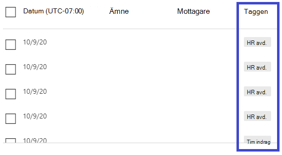

# Hotutforskaren och identifieringar i realtidThreat Explorer and Real-time detections

**Gäller för****Applies to**
- [Microsoft Defender för Office 365 abonnemang 1 och abonnemang 2Microsoft Defender for Office 365 plan 1 and plan 2](https://go.microsoft.com/fwlink/?linkid=2148715)
- [Microsoft 365 DefenderMicrosoft 365 Defender](https://go.microsoft.com/fwlink/?linkid=2118804)

Om din organisation har Microsoft Defender för Office [365](office-365-atp.md)och  du har nödvändiga behörigheter har  du antingen Utforskaren eller identifieringar i realtid **(tidigare** realtidsrapporter – se vad som är [nytt!](#new-features-in-threat-explorer-and-real-time-detections)). If your organization has [Microsoft Defender for Office 365](office-365-atp.md), and you have the [necessary permissions](#required-licenses-and-permissions), you have either **Explorer** or **Real-time detections** (formerly *Real-time reports* — [see what's new](#new-features-in-threat-explorer-and-real-time-detections)!). I Säkerhets- & går du till **Hantering av** hot och väljer sedan Identifieringar i **Utforskaren**  **eller Realtid.**In the Security & Compliance Center, go to **Threat management**, and then choose **Explorer** _or_ **Real-time detections**.

|Med Microsoft Defender för Office 365 abonnemang 2 ser du:With Microsoft Defender for Office 365 Plan 2, you see:|Med Microsoft Defender för Office 365 abonnemang 1 ser du:With Microsoft Defender for Office 365 Plan 1, you see:|
|---|---|
|||
|

Explorer eller identifiering i realtid hjälper din säkerhetsgrupp att undersöka och reagera på hot effektivt.Explorer or Real-time detections helps your security operations team investigate and respond to threats efficiently. Rapporten liknar följande bild:The report resembles the following image:

Med den här rapporten kan du:With this report, you can:

- [Se skadlig programvara som upptäckts av Säkerhetsfunktioner i Microsoft 365See malware detected by Microsoft 365 security features](#see-malware-detected-in-email-by-technology)
- [Visa nätfiske-URL och klicka på bedömningsdataView phishing URL and click verdict data](#view-phishing-url-and-click-verdict-data)
- [Starta en automatiserad undersökning och svarsprocess från en vy i Utforskaren](#start-automated-investigation-and-response) (endast Defender för Office 365 abonnemang 2)[Start an automated investigation and response process from a view in Explorer](#start-automated-investigation-and-response) (Defender for Office 365 Plan 2 only)
- [Undersöka skadlig e-post med meraInvestigate malicious email, and more](#more-ways-to-use-explorer-and-real-time-detections)

## Förbättringar av Hotutforskaren och identifieringar i realtidImprovements to Threat Explorer and Real-time detections

### Taggar i HotutforskarenTags in Threat Explorer

> [!NOTE]
> Funktionen med användartaggar *är i förhandsversion,* är inte tillgänglig för alla och kan komma att ändras.The user tags feature is in *Preview*, isn't available to everyone, and is subject to change. Mer information om versionsschemat finns i Microsoft 365-översikten.For information about the release schedule, check out the Microsoft 365 roadmap.

Användartaggar identifierar specifika grupper av användare i Microsoft Defender för Office 365.User tags identify specific groups of users in Microsoft Defender for Office 365. Mer information om taggar, inklusive licensiering och konfiguration, finns i [Användartaggar.](user-tags.md)For more information about tags, including licensing and configuration, see [User tags](user-tags.md).

I Threat Explorer kan du se information om användartaggar i följande funktioner.In Threat Explorer, you can see information about user tags in the following experiences.

#### Rutnätsvy för e-postEmail grid view

Kolumnen **Taggar** i e-postrutnätet innehåller alla taggar som har tillämpats på avsändarens eller mottagarens postlådor.The **Tags** column in the email grid contains all the tags that have been applied to the sender or recipient mailboxes. Som standard visas systemtaggar som prioritetskonton först.By default, system tags like priority accounts are shown first.

> [!div class="mx-imgBorder"]
> 

#### FiltreringFiltering

Du kan använda taggar som ett filter.You can use tags as a filter. Jaga bara på prioritetskonton eller specifika användartaggsscenarier.Hunt just across priority accounts or specific user tags scenarios. Du kan också utesluta resultat som har vissa taggar.You can also exclude results that have certain tags. Kombinera den här funktionen med andra filter för att begränsa undersökningens omfattning.Combine this functionality with other filters to narrow your scope of investigation.

> [!div class="mx-imgBorder"]
> 

#### Utfällnivå för e-postinformationEmail detail flyout
Om du vill visa de enskilda taggarna för avsändare och mottagare väljer du ämnet för att öppna den utfällna meddelandeinformationen.To view the individual tags for sender and recipient, select the subject to open the message details flyout. På fliken **Sammanfattning** visas taggarna för avsändare och mottagare separat, om de finns för e-post.On the **Summary** tab, the sender and recipient tags are shown separately, if they're present for an email.
Informationen om enskilda taggar för avsändare och mottagare omfattar även exporterade CSV-data, där du kan se den här informationen i två separata kolumner.The information about individual tags for sender and recipient also extends to exported CSV data, where you can see these details in two separate columns.

> [!div class="mx-imgBorder"]
> 

Information om taggar visas också i url-klickningens utfällsida.Tags information is also shown in the URL clicks flyout. Om du vill visa den går du till vyn Phish eller All e-post och **sedan fliken URL-adresser** **eller URL-klickningar.** Välj en utfällsida för en enskild URL om du vill visa mer information om klickningar för URL:en, inklusive taggar kopplade till den klickningen.To view it, go to Phish or All Email view and then to the **URLs** or **URL Clicks** tab. Select an individual URL flyout to view additional details about clicks for that URL, including tags associated with that click.

> [!div class="mx-imgBorder"]
> 

## Förbättringar av upplevelsen av hot efter hot (kommande)Improvements to the threat hunting experience (upcoming)

### Uppdaterad information om hot för e-postmeddelandenUpdated threat information for emails

Vi har fokuserat på förbättringar av plattform och datakvalitet för att öka dataprecisionen och konsekvensen för e-postposter.We've focused on platform and data-quality improvements to increase data accuracy and consistency for email records. Förbättringarna är bland annat konsolidering av information om förleverans och efterleverans, till exempel åtgärder som utförs på ett e-postmeddelande som en del av ZAP-processen, i en enda post.Improvements include consolidation of pre-delivery and post-delivery information, such as actions executed on an email as part of the ZAP process, into a single record. Ytterligare information som skräppostutsåtanden, hot på entitetsnivå (till exempel vilken URL som var skadlig) och senaste leveransplatser ingår också.Additional details like spam verdict, entity-level threats (for example, which URL was malicious), and latest delivery locations are also included.

Efter dessa uppdateringar visas en post för varje meddelande, oavsett vilka händelser efter leveransen som påverkar meddelandet.After these updates, you'll see a single entry for each message, regardless of the different post-delivery events that affect the message. Åtgärder kan omfatta ZAP, manuell åtgärd (vilket innebär administrativa åtgärder), dynamisk leverans och så vidare.Actions can include ZAP, manual remediation (which means admin action), dynamic delivery, and so on.

Förutom att visa skadlig programvara och nätfiskehot kan du se skräpposten som är kopplad till ett e-postmeddelande.In addition to showing malware and phishing threats, you see the spam verdict associated with an email. I e-postmeddelandet ser du alla hot som är kopplade till e-postmeddelandet tillsammans med motsvarande identifieringstekniker.Within the email, see all the threats associated with the email along with the corresponding detection technologies. Ett e-postmeddelande kan innehålla noll, ett eller flera hot.An email can have zero, one, or multiple threats. Du ser de aktuella hoten i avsnittet Information **i** e-postmeddelandet.You'll see the current threats in the **Details** section of the email flyout. För flera hot (till exempel skadlig  kod och nätfiske) visar det tekniska fältet Identifiering av hotmappningen, som är den identifieringsteknik som identifierade hoten.For multiple threats (such as malware and phishing), the **Detection tech** field shows the threat-detection mapping, which is the detection technology that identified the threat.

Uppsättningen identifieringstekniker innehåller nu nya identifieringsmetoder och teknik för identifiering av skräppost.The set of detection technologies now includes new detection methods, as well as spam-detection technologies. Du kan använda samma uppsättning identifieringstekniker för att filtrera resultatet i olika e-postvyer (skadlig kod, phish, all e-post).You can use the same set of detection technologies to filter the results across the different email views (Malware, Phish, All Email).

> [!NOTE]
> Analys av analys av bedömningsanalys kanske inte nödvändigtvis är knuten till enheter.Verdict analysis might not necessarily be tied to entities. Ett e-postmeddelande kan till exempel klassificeras som phish eller spam, men det finns inga URL-adresser som är stämplade med ett phish/spam-bedömning.As an example, an email might be classified as phish or spam, but there are no URLs that are stamped with a phish/spam verdict. Det beror på att filtren också utvärderar innehåll och annan information för ett e-postmeddelande innan en bedömning tilldelas.This is because the filters also evaluate content and other details for an email before assigning a verdict.

#### Hot i URL:erThreats in URLs

Nu kan du se det specifika hot som finns för en URL på den utfällade fliken Information för **e-post.** Hot kan vara skadlig *kod,* *nätt,* *skräppost* eller *ingen.)*You can now see the specific threat for a URL on the email flyout **Details** tab. The threat can be *malware*, *phish*, *spam*, or *none*.)

> [!div class="mx-imgBorder"]
> 

### Uppdaterad tidslinjevy (kommande)Updated timeline view (upcoming)

> [!div class="mx-imgBorder"]
> 

Tidslinjevyn identifierar alla leverans- och efterleveranshändelser.Timeline view identifies all delivery and post-delivery events. Den innehåller information om hot som identifierats vid den tidpunkten för en delmängd av dessa händelser.It includes information about the threat identified at that point of time for a subset of these events. Tidslinjevyn innehåller även information om ytterligare åtgärder som vidtas (till exempel ZAP eller manuell åtgärd), tillsammans med resultatet av den åtgärden.Timeline view also provides information about any additional action taken (such as ZAP or manual remediation), along with the result of that action. Information om tidslinjevyn är bland annat:Timeline view information includes:

- **Källa:** Källan till händelsen.**Source:** Source of the event. Det kan vara admin/system/användare.It can be admin/system/user.
- **Händelse:** Innehåller händelser på högsta nivån som ursprunglig leverans, manuell åtgärd, ZAP, inskickade funktioner och dynamisk leverans.**Event:** Includes top-level events like original delivery, manual remediation, ZAP, submissions, and dynamic delivery.
- **Åtgärd:** Den specifika åtgärd som har vidtagits antingen som en del av ZAP- eller administratörsåtgärden (till exempel mjuk borttagning).**Action:** The specific action that was taken either as part of ZAP or admin action (for example, soft delete).
- **Hot:** Täcker de hot (skadlig kod, nätt och skräppost) som identifierades vid den tidpunkten.**Threats:** Covers the threats (malware, phish, spam) identified at that point of time.
- **Resultat/information:** Mer information om åtgärdens resultat, till exempel om det utfördes som en del av ZAP/administratörsåtgärd.**Result/Details:** More information about the result of the action, such as whether it was performed as part of ZAP/admin action.

### Ursprunglig och senaste leveransplatsOriginal and latest delivery location

För närvarande yta för leveransplats i rutnätet och den utfällna e-posten.Currently, we surface delivery location in the email grid and email flyout. Fältet **Leveransplats** får ett nytt namn **_på den ursprungliga leveransplatsen_*_. Och vi introducerar ett annat fält, _*_Senaste leveransplats._**The **Delivery location** field is getting renamed **_Original delivery location_*_. And we're introducing another field, _*_Latest delivery location_**.

**Den ursprungliga leveransplatsen** ger mer information om var ett e-postmeddelande levererades från början.**Original delivery location** will give more information about where an email was delivered initially. **Senaste leveransplats** kan ange var ett e-postmeddelande landade efter systemåtgärder som *ZAP* eller administrativa åtgärder som *Flytta till borttagna objekt.***Latest delivery location** will state where an email landed after system actions like *ZAP* or admin actions like *Move to deleted items*. Den senaste leveransplatsen är avsedd att meddela administratörerna meddelandets senast kända plats efter leverans eller eventuella system-/administratörsåtgärder.Latest delivery location is intended to tell admins the message's last-known location post-delivery or any system/admin actions. Den innehåller inga slutanvändaråtgärder för e-postmeddelandet.It doesn't include any end-user actions on the email. Om en användare till exempel tagit bort ett meddelande eller flyttat meddelandet till arkivering/pst uppdateras inte meddelandets leveransplats.For example, if a user deleted a message or moved the message to archive/pst, the message "delivery" location won't be updated. Men om en systemåtgärd uppdaterade platsen (till exempel ZAP som resulterade i att ett e-postmeddelande flyttades till **karantän)** visades den senaste leveransplatsen som "karantän".But if a system action updated the location (for example, ZAP resulting in an email moving to quarantine), **Latest delivery location** would show as "quarantine."

> [!div class="mx-imgBorder"]
> 

> [!NOTE]
> Det finns några fall där åtgärden **Leveransplats** **och Leverans kan** visas som "okänd":There are a few cases where **Delivery location** and **Delivery action** may show as "unknown":
>
> - Du kan se **Leveransplats** som  "Levererat" och Leveransplats som "okänd" om meddelandet levererades, men en regel för Inkorgen flyttade meddelandet till en standardmapp (till exempel Utkast eller Arkiv) i stället för till Inkorgen eller mappen Skräppost.You might see **Delivery location** as "delivered" and **Delivery location** as "unknown" if the message was delivered, but an Inbox rule moved the message to a default folder (such as Draft or Archive) instead of to the Inbox or Junk Email folder.
>
> - **Senaste leveransplats** kan vara okänd om en åtgärd för administratör/system (till exempel ZAP) försöktes, men meddelandet hittades inte.**Latest delivery location** can be unknown if an admin/system action (such as ZAP) was attempted, but the message wasn't found. Vanligtvis händer åtgärden efter att användaren flyttat eller tagit bort meddelandet.Typically, the action happens after the user  moved or deleted the message. Kontrollera i så fall kolumnen **Resultat/Detaljer** i tidslinjevyn.In such cases, verify the **Result/Details** column in timeline view. Leta efter uttrycket "Meddelandet har flyttats eller tagits bort av användaren".Look for the statement "Message moved or deleted by the user."

> [!div class="mx-imgBorder"]
> 

### Ytterligare åtgärderAdditional actions

*Ytterligare åtgärder* tillämpades efter leverans av e-postmeddelandet.*Additional actions* were applied after delivery of the email. De kan omfatta *ZAP,* manuell åtgärd *(åtgärd* som vidtas av en administratör som mjuk *borttagning),* dynamisk leverans och ombearbetning *(för* e-postmeddelanden som retroaktivt identifierats som bra).They can include *ZAP*, *manual remediation* (action taken by an Admin such as soft delete), *dynamic delivery*, and *reprocessed* (for an email that was retroactively detected as good).

> [!NOTE]
> - Som en del av de väntande ändringarna försvinner värdet "Borttaget av ZAP" som visas i filtret Leveransåtgärd.As part of the pending changes, the "Removed by ZAP" value currently surfaced in the Delivery Action filter is going away. Du kan söka efter all e-post med ZAP-försöket via **Ytterligare åtgärder.**You'll have a way to search for all email with the ZAP attempt through **Additional actions**.
>
> - Det kommer att finnas nya fält och värden för **identifieringstekniker** **och ytterligare åtgärder (särskilt** för ZAP-scenarier).There will be new fields and values for **Detection technologies** and **Additional actions** (especially for ZAP scenarios). Du måste utvärdera dina befintliga sparade frågor och spårade frågor för att se till att de fungerar med de nya värdena.You'll need to evaluate your existing saved queries and tracked queries to make sure they work with the new values.

> [!div class="mx-imgBorder"]

> 

### System åsidosätterSystem overrides

*Med system åsidosättningar* kan du göra undantag till den avsedda leveransplatsen för ett meddelande.*System overrides* enable you to make exceptions to the intended delivery location of a message. Du åsidosätter leveransplatsen som tillhandahålls av systemet, baserat på hot och andra identifieringar som identifieras av filtreringsstacken.You override the delivery location provided by the system, based on the threats and other detections identified by the filtering stack. System åsidosättningar kan ställas in via klientorganisations- eller användarprincipen för att leverera meddelandet som föreslås av principen.System overrides can be set through tenant or user policy to deliver the message as suggested by the policy. En åsidosättning kan identifiera oavsiktlig leverans av skadliga meddelanden på grund av luckor i konfigurationen, till exempel en för omfattande princip för Betrodd avsändare som har angetts av en användare.Overrides can identify unintentional delivery of malicious messages due to configurations gaps, such as an overly broad Safe Sender policy set by a user. Dessa åsidosättningsvärden kan vara:These override values can be:

- Tillåts av användarprincip: En användare skapar principer på postlådenivå för att tillåta domäner eller avsändare.Allowed by user policy: A user creates policies at the mailbox level to allows domains or senders.
- Blockeras av användarprincip: En användare skapar principer på e-postråddsnivå för att blockera domäner eller avsändare.Blocked by user policy: A user creates policies at the mail box level to block domains or senders.
- Tillåts i organisationens princip: Organisationens säkerhetsteam anger principer eller Exchange-e-postflödesregler (kallas även transportregler) för att tillåta avsändare och domäner för användare i organisationen.Allowed by org policy: The organization's security teams set policies or Exchange mail flow rules (also known as transport rules) to allow senders and domains for users in their organization. Det kan vara för en uppsättning användare eller för hela organisationen.This can be for a set of users or the entire organization.
- Blockeras av organisationens policy: Organisationens säkerhetsteam anger principer eller e-postflödesregler för att blockera avsändare, domäner, meddelandespråk eller käll-IP:er för användare i organisationen.Blocked by org policy: The organization's security teams set policies or mail flow rules to block senders, domains, message languages, or source IPs for users in their organization. Det kan tillämpas på en uppsättning användare eller hela organisationen.This can be applied to a set of users or the entire organization.
- Filnamnstillägg som blockeras av organisationens policy: En organisations säkerhetsgrupp blockerar ett filnamnstillägg via inställningarna för policyn mot skadlig programvara.File extension blocked by org policy: An organization's security team blocks a file name extension through the anti-malware policy settings. Värdena visas nu i e-postinformation som hjälp vid undersökningar.These values will now be displayed in email details to help with investigations. Sekopsteam kan också använda rtf-filtreringsfunktioner för att filtrera på blockerade filnamnstillägg.Secops teams can also use the rich-filtering capability to filter on blocked file extensions.

> [!div class="mx-imgBorder"]
> 

### Förbättringar för URL- och klickupplevelsenImprovements for the URL and clicks experience

Förbättringarna är bland annat:The improvements include:

- Visa den fullständigt klickade URL:en (inklusive eventuella frågeparametrar som är en del av URL:en) i avsnittet **Klick** på den utfällliga URL-adressen.Show the full clicked URL (including any query parameters that are part of the URL) in the **Clicks** section of the URL flyout. För närvarande visas URL-domänen och sökvägen i namnlisten.Currently, the URL domain and path appear in the title bar. Vi utökar den informationen så att den fullständiga URL:en visas.We're extending that information to show the full URL.

- Korrigeringar över URL-filter *(URL-* eller *URL-domän* kontra *URL-domän* och sökväg): Uppdateringarna påverkar sökningen efter meddelanden som innehåller en URL-adress/klickning.Fixes across URL filters (*URL* versus *URL domain* versus *URL domain and path*): The updates affect searching for messages that contain a URL/click verdict. Vi har aktiverat stöd för protokoll-agnostic-sökningar, så att du kan söka efter en URL utan att `http` använda.We enabled support for protocol-agnostic searches, so you can search for a URL without using `http`. Som standard mappas URL-sökningen till http, om inte ett annat värde uttryckligen anges.By default, the URL search maps to http, unless another value is explicitly specified. Till exempel:For example:

   -  Sök med och utan `http://` prefixet i **filterfälten URL,** **URL Domain** och URL Domain **och Path.**Search with and without the `http://` prefix in the **URL**, **URL Domain**, and **URL Domain and Path** filter fields. Sökningarna ska visa samma resultat.The searches should show the same results.

   -  Sök efter `https://` prefixet i **URL.**Search for the `https://` prefix in **URL**. När inget värde anges `http://` antas prefixet.When no value is specified, the `http://` prefix is assumed.

   - `/`ignoreras i början och slutet av **URL-sökvägen,** **URL-domän,** **URL-domän och sökvägsfält.**`/` is ignored at the beginning and end of the **URL path**, **URL Domain**, **URL domain and path** fields. `/` i slutet av **URL-fältet** ignoreras.`/` at the end of the **URL** field is ignored.

### Phish konfidensnivåPhish confidence level

Phish konfidensnivå hjälper till att identifiera graden av förtroende som ett e-postmeddelande kategoriserades som "phish".Phish confidence level helps identify the degree of confidence with which an email was categorized as "phish." De två möjliga värdena är *Höga* och *Normal.*The two possible values are *High* and *Normal*. I de inledande stegen är filtret bara tillgängligt i Phish-vyn för Hotutforskaren.In the initial stages, this filter will be available only in the Phish view of Threat Explorer.

### ZAP URL-signalZAP URL signal

ZAP URL-signalen används vanligtvis för ZAP Phish-aviseringsscenarier där ett e-postmeddelande identifierades som Phish och togs bort efter leverans.The ZAP URL signal is typically used for ZAP Phish alert scenarios where an email was identified as Phish and removed after delivery. Den här signalen ansluter aviseringen till motsvarande resultat i Utforskaren.This signal connects the alert with the corresponding results in Explorer. Det är en av I/ICS för aviseringen.It's one of the IOCs for the alert.

Vi har uppdaterat Hot Explorer och identifieringar i realtid för att vi ska kunna hitta ännu mer konsekvent.To improve the hunting process, we've updated Threat Explorer and Real-time detections to make the hunting experience more consistent. Ändringarna beskrivs här:The changes are outlined here:

- [Förbättringar av tidszonerTimezone improvements](#timezone-improvements)
- [Uppdatera i uppdateringsprocessenUpdate in the refresh process](#update-in-the-refresh-process)
- [Diagram, granska för att lägga till i filterChart drilldown to add to filters](#chart-drilldown-to-add-to-filters)
- [I uppdateringar av produktinformationIn product information updates](#in-product-information-updates)

### Filtrera efter användartaggarFilter by user tags

Nu kan du sortera och filtrera på systemtaggar eller anpassade användartaggar för att snabbt förstå omfattningen av hot.You can now sort and filter on system or custom user tags to quickly grasp the scope of threats. Mer information finns i [Användartaggar.](user-tags.md)To learn more, see [User tags](user-tags.md).

> [!IMPORTANT]
> Filtrering och sortering efter användartaggar är för närvarande en offentlig förhandsgranskning.Filtering and sorting by user tags is currently in public preview. Den här funktionen kan komma att ändras väsentligt innan den släpps kommersiellt.This functionality may be substantially modified before it's commercially released. Microsoft ger inga garantier, uttryckliga eller underförstådda, med avseende på den information som ges om den.Microsoft makes no warranties, express or implied, with respect to the information provided about it.

### Förbättringar av tidszonerTimezone improvements

Tidszonen för e-postposterna i portalen och för exporterade data visas.You'll see the time zone for the email records in the Portal as well as for Exported data. Den visas i funktioner som e-postrutnät, den utfällbara informationen, tidslinjen för e-post och liknande e-postmeddelanden, så tidszonen för resultatuppsättningen är tydlig.It will be visible across experiences like Email Grid, Details flyout, Email Timeline, and Similar Emails, so the time zone for the result set is clear.

> [!div class="mx-imgBorder"]
> 

### Uppdatera i uppdateringsprocessenUpdate in the refresh process

Vissa användare har kommenterat att det är förvirrande med automatisk uppdatering (till exempel så fort du ändrar datumet, sidan uppdateras) och manuell uppdatering (för andra filter).Some users have commented about confusion with automatic refresh (for example, as soon as you change the date, the page refreshes) and manual refresh (for other filters). På samma sätt leder borttagning av filter till automatisk uppdatering.Similarly, removing filters leads to automatic refresh. Om du ändrar filter samtidigt som frågan ändras kan det orsaka inkonsekventa sökupplevelser.Changing filters while modifying the query can cause inconsistent search experiences. För att lösa de här problemen flyttar vi till en manuell filtreringsmekanism.To resolve these issues, we're moving to a manual-filtering mechanism.

Ur en perspektiv kan användaren tillämpa och ta bort de olika filterområdet (från filteruppsättningen och datumet) och välja uppdateringsknappen för att filtrera resultaten när de har definierat frågan.From an experience standpoint, the user can apply and remove the different range of filters (from the filter set and date) and select the refresh button to filter the results after they've defined the query. Uppdateringsknappen är nu också framhävd på skärmen.The refresh button is also now emphasized on the screen. Vi har även uppdaterat relaterade knappbeskrivningar och produktdokumentation.We've also updated the related tooltips and in-product documentation.

> [!div class="mx-imgBorder"]
> 

### Diagram, granska för att lägga till i filterChart drilldown to add to filters

Nu kan du lägga till förklaringsvärden i diagram som filter.You can now chart legend values to add them as filters. Filtrera **resultatet genom** att välja knappen Uppdatera.Select the **Refresh** button to filter the results.

> [!div class="mx-imgBorder"]
> 

### Uppdateringar av information i produktenIn-product information updates

Ytterligare information är nu tillgänglig i produkten, till exempel det totala antalet sökresultat i rutnätet (se nedan).Additional details are now available within the product, such as the total number of search results within the grid (see below). Vi har förbättrat etiketter, felmeddelanden och verktygstips för att ge mer information om filter, sökupplevelse och resultatuppsättning.We've improved labels, error messages, and tooltips to provide more information about the filters, search experience, and result set.

> [!div class="mx-imgBorder"]
> 

## Utökade funktioner i HotutforskarenExtended capabilities in Threat Explorer

### Mest riktade användareTop targeted users

I dag visar vi listan över de mest riktade användarna i vyn Skadlig programvara för e-postmeddelanden i avsnittet Top **Malware Families.**Today we expose the list of the top targeted users in the Malware view for emails, in the **Top Malware Families** section. Vi utökar den här vyn i vyerna Phish och All E-post.We'll be extending this view in the Phish and All Email views as well. Du kan se de fem viktigaste användarna samt antalet försök för varje användare för motsvarande vy.You'll be able to see the top-five targeted users, along with the number of attempts for each user for the corresponding view. För phishvyn ser du till exempel antalet phish-försök.For example, for Phish view, you'll see the number of Phish attempts.

Du kan exportera listan med riktade användare, upp till 3 000, tillsammans med antalet försök för offlineanalys för varje e-postvy.You'll be able to export the list of targeted users, up to a limit of 3,000, along with the number of attempts for offline analysis for each email view. Om du väljer antalet försök (till exempel 13 försök i bilden nedan) öppnas en filtrerad vy i Hotutforskaren, så att du kan se mer information om e-postmeddelanden och hot för den användaren.In addition, selecting the number of attempts (for example, 13 attempts in the image below) will open a filtered view in Threat Explorer, so you can see more details across emails and threats for that user.

> [!div class="mx-imgBorder"]
> 

### Exchange-transportreglerExchange transport rules

Som en del av databerikningen kan du se alla olika Exchange-transportregler (ETR) som har tillämpats på ett meddelande.As part of data enrichment, you'll be able to see all the different Exchange transport rules (ETR) that were applied to a message. Den här informationen är tillgänglig i rutnätsvyn för e-post.This information will be available in the Email grid view. Du visar den genom att **välja Kolumnalternativ** i rutnätet och sedan **Lägga till Exchange-transportregel** bland kolumnalternativen.To view it,  select **Column options** in the grid and then **Add Exchange Transport Rule** from the column options. Det visas också på den **utfällbara informationen** i e-postmeddelandet.It will also be visible on the **Details** flyout in the email.

Du kan se både GUID och namnet på de transportregler som tillämpats på meddelandet.You'll be able to see both the GUID and the name of the transport rules that were applied to the message. Du kan söka efter meddelandena med hjälp av namnet på transportregeln.You'll be able to search for the messages by using the name of the transport rule. Det här är en "Innehåller"-sökning, vilket innebär att du även kan göra partiella sökningar.This is a "Contains" search, which means you can do partial searches as well.

#### Viktigt meddelande:Important note:

ETR-sökning och tillgänglighet för namn beror på den specifika roll som har tilldelats till dig.ETR search and name availability depend on the specific role that's assigned to you. Du måste ha någon av följande roller/behörigheter för att visa ETR-namn och sökning.You need to have one of the following roles/permissions to view the ETR names and search. Om du inte har någon av de här rollerna tilldelad till dig kan du inte se namnen på transportreglerna eller söka efter meddelanden med hjälp av ETR-namn.If you don't have any of these roles assigned to you, you can't see the names of the transport rules or search for messages by using ETR names. Du kan dock se ETR-etiketten och GUID-informationen i e-postinformationen.However, you could see the ETR label and GUID information in the Email Details. Andra funktioner för postvisning i e-postrutnät, utfällningar för e-post, filter och export påverkas inte.Other record-viewing experiences in Email Grids, Email flyouts, Filters, and Export are not affected.

- Exo Only – Skydd mot dataförlust: AllaEXO Only - Data Loss Prevention: All
- Endast EXO - O365SupportViewConfig: AllaEXO Only - O365SupportViewConfig: All
- Microsoft Azure Active Directory eller EXO – säkerhetsadministratör: AllaMicrosoft Azure Active Directory or EXO - Security Admin: All
- AAD eller EXO – Säkerhetsläsare: AllaAAD or EXO - Security Reader: All
- EXO Only – Transportregler: AllaEXO Only - Transport Rules: All
- Endast EXO – View-Only konfiguration: AllaEXO Only - View-Only Configuration: All

I e-postrutnätet, den utfällliga informationen och den exporterade CSV-filen visas ETR-et-et-linjerna med ett namn/GUID enligt nedan.Within the email grid, Details flyout, and Exported CSV, the ETRs are presented with a Name/GUID as shown below.

> [!div class="mx-imgBorder"]
> 

### Inkommande kopplingarInbound connectors

Kopplingar är en samling instruktioner som anpassar hur din e-post flödar till och från din Microsoft 365- eller Office 365-organisation.Connectors are a collection of instructions that customize how your email flows to and from your Microsoft 365 or Office 365 organization. Med hjälp av dem kan du tillämpa säkerhetsbegränsningar och kontroller.They enable you to apply any security restrictions or controls. I Threat Explorer kan du nu visa kopplingar som är relaterade till ett e-postmeddelande och söka efter e-postmeddelanden med hjälp av kopplingsnamn.Within Threat Explorer, you can now view the connectors that are related to an email and search for emails by using connector names.

Sökningen efter kopplingar är "innehåller" till sin natur, vilket innebär att partiella nyckelordssökningar också bör fungera.The search for connectors is "contains" in nature, which means partial keyword searches should work as well. I huvudrutnätsvyn, den utfällliga informationen och den exporterade CSV-filen visas kopplingarna i formatet Namn/GUID enligt följande bild:Within the Main grid view, the Details flyout, and the Exported CSV, the connectors are shown in the Name/GUID format as shown here:

> [!div class="mx-imgBorder"]
> 

## Nya funktioner i Hotutforskaren och identifieringar i realtidNew features in Threat Explorer and Real-time detections

Tre nya funktioner är tillgängliga i Threat Explorer och identifieringar i realtid:Three new features are available in Threat Explorer and Real-time detections:

- [Förhandsgranska e-posthuvud och ladda ned brödtext för e-postPreview email header and download email body](#preview-email-header-and-download-email-body)
- [E-posttidslinjeEmail timeline](#email-timeline)
- [Exportera URL-klickdataExport URL click data](#export-url-click-data)

De nya funktionerna beskrivs nedan.These new features are outlined below.

### Förhandsgranska e-posthuvud och ladda ned brödtext för e-postPreview email header and download email body

Nu kan du förhandsgranska ett e-posthuvud och ladda ned e-posttexten i Threat Explorer-administratörerna kan analysera nedladdade rubriker/e-postmeddelanden för hot.You can now preview an email header and download the email body in Threat Explorer Admins can analyze downloaded headers/email messages for threats. Eftersom nedladdning av e-postmeddelanden kan riskera exponering av information styrs den här processen av rollbaserad åtkomstkontroll (RBAC).Because downloading email messages can risk exposure of information, this process is controlled by role-based access control (RBAC). En ny *roll,* Förhandsversion, måste läggas till i en annan rollgrupp (till exempel säkerhetsåtgärder eller säkerhetsadministratör) för att det ska gå att ladda ned e-postmeddelanden och förhandsgranskningsrubriker i vyn för alla e-postmeddelanden.A new role, *Preview*, must be added to another role group (such as Security Operations or Security Administrator) to grant the ability to download mails and preview headers in all-email messages view.

Identifieringar av Utforskaren och Realtid får också nya fält som ger en mer fullständig bild av var dina e-postmeddelanden hamnar.Explorer and Real-time detections will also get new fields that provide a more complete picture of where your email messages land. De här ändringarna gör det enklare att hitta Säkerhets ops.These changes  make hunting easier for Security Ops. Men det viktigaste resultatet är att du snabbt kan se platsen för de problemmeddelanden som uppstår.But the main result is you can know the location of problem email messages at a glance.

Hur gör man det?How is this done? Leveransstatus delas nu upp i två kolumner:Delivery status is now broken out into two columns:

- **Leveransåtgärd** – Status för e-postmeddelandet.**Delivery action** - Status of the email.
- **Leveransplats** – dit e-postmeddelandet har dirigerats.**Delivery location** - Where the email was routed.

*Leveransåtgärd* är den åtgärd som vidtas på ett e-postmeddelande på grund av befintliga principer eller identifieringar.*Delivery action* is the action taken on an email due to existing policies or detections. Här är de möjliga åtgärderna för ett e-postmeddelande:Here are the possible actions for an email:

|LevereradDelivered|SkräppostJunked|BlockeradBlocked|ErsattReplaced|
|---|---|---|---|
|E-post har levererats till inkorgen eller mappen för en användare och användaren kan komma åt den.Email was delivered to the inbox or folder of a user, and the user can access it.|E-post skickades till användarens skräppostmapp eller borttaget och användaren kan komma åt den.Email was sent to the user's Junk  or Deleted folder, and the user can access it.|E-postmeddelanden som har satts i karantän, misslyckats eller släppts.Emails that are quarantined, that failed, or were dropped. De här e-postmeddelandena är inte tillgängliga för användaren.These mails are inaccessible to the user.|E-post har ersatts med skadliga bifogade filer av TXT-filer som säger att den bifogade filen var skadlig.Email had malicious attachments replaced by .txt files that state the attachment was malicious.|

Det här kan och kan användaren inte se:Here is what the user can and can't see:

|Tillgängligt för slutanvändareAccessible to end users|Inte tillgänglig för slutanvändareInaccessible to end users|
|---|---|
|LevereradDelivered|BlockeradBlocked|
|SkräppostJunked|ErsattReplaced|

**Leveransplats** visar resultatet av principer och identifieringar som körs efter leverans.**Delivery location** shows the results of policies and detections that run post-delivery. Det är länkat till **_leveransåtgärden._**It's linked to **_Delivery action_**. Det här är de möjliga värdena:These are the possible values:

- *Inkorgen eller mappen:* E-postmeddelandet ligger i Inkorgen eller i en mapp (enligt dina e-postregler).*Inbox or folder*: The email is in the inbox or a folder (according to your email rules).
- *Lokal eller extern:* Postlådan finns inte i molnet men är lokal.*On-prem or external*: The mailbox doesn't exist on cloud but is on-premises.
- *Skräppostmapp:* E-postmeddelandet finns i användarens skräppostmapp.*Junk folder*: The email is in a user's Junk folder.
- *Mappen Borttaget:* E-postmeddelandet i en användares mapp Borttaget.*Deleted items folder*: The email in a user's Deleted items folder.
- *Karantän:* E-postmeddelandet ligger i karantän och inte i en användares postlåda.*Quarantine*: The email is in quarantine and not in a user's mailbox.
- *Misslyckades:* E-postmeddelandet kunde inte nå postlådan.*Failed*: The email failed to reach the mailbox.
- *Släppt:* E-postmeddelandet försvann någonstans i e-postflödet.*Dropped*: The email got lost somewhere in the mail flow.

### E-posttidslinjeEmail timeline

Tidslinjen **för e-post** är en ny funktion i Utforskaren som förbättrar upplevelsen för administratörer.The **Email timeline** is a new Explorer feature that improves the hunting experience for admins. Det klipper av tiden som läggs på att kontrollera olika platser för att försöka förstå händelsen.It cuts the time spent checking different locations to try to understand the event. När flera händelser inträffar samtidigt som ett e-postmeddelande skickas visas de i en tidslinjevy.When multiple events happen at or close to the same time an email arrives, those events are displayed in a timeline view. Vissa händelser som inträffar för din e-post efter leverans visas i kolumnen **Specialåtgärd.**Some events that happen to your email post-delivery are captured in the **Special action** column. Administratörer kan kombinera information från tidslinjen med den särskilda åtgärd som vidtas på e-postmeddelandet efter leveransen för att få insyn i hur deras principer fungerar, var e-postmeddelandet slutligen skickades och, i vissa fall, vad den slutliga bedömningen var.Admins can combine  information from the timeline with the special action taken on the mail post-delivery to get insight into how their policies work, where the mail was finally routed, and, in some cases, what the final assessment was.

Mer information finns i Undersöka [och åtgärda skadlig e-post som har levererats i Office 365.](investigate-malicious-email-that-was-delivered.md)For more information, see [Investigate and remediate malicious email that was delivered in Office 365](investigate-malicious-email-that-was-delivered.md).

### Exportera URL-klickdataExport URL click data

Nu kan du exportera rapporter för URL-klick  till Microsoft Excel för att visa deras nätverksmeddelande-ID och klicka på **bedömning,** vilket hjälper till att förklara varifrån URL-klicktrafiken kom.You can now export reports for URL clicks to Microsoft Excel to view their **network message ID** and **click verdict**, which helps explain where your URL click traffic originated. Så här fungerar det: Följ den här kedjan i Hantering av hot i snabbstartsfältet i Office 365:Here's how it works: In Threat Management on the Office 365 quick-launch bar, follow this chain:

**Utforskaren** \> **Visa phish** \> **Klick** \> **Url:er eller** **Url Top Clicks väljer** en post för att öppna den \> utfällliga URL-adressen.**Explorer** \> **View Phish** \> **Clicks** \> **Top URLs** or **URL Top Clicks** \> select any record to open the URL flyout.

När du väljer en URL i listan visas en ny **Export-knapp** i den utfällbaserade panelen.When you select a URL in the list, you'll see a new **Export** button on the fly-out panel. Använd den här knappen för att flytta data till ett Excel-kalkylblad för enklare rapportering.Use this button to move data to an Excel spreadsheet for easier reporting.

Följ den här sökvägen för att komma till samma plats i rapporten om identifieringar i realtid:Follow this path to get to the same location in the Real-time detections report:

**Utforskaren** \> **Identifieringar i realtid** \> **Visa phish** \> **URL:er** \> **Övre URL:er** **eller Översta klick väljer** en post för att öppna den \> utfällliga URL-adressen, \> gå till fliken **Klick.****Explorer** \> **Real-time detections** \> **View Phish** \> **URLs** \> **Top URLs** or **Top Clicks** \> Select any record to open the URL flyout \> navigate to the **Clicks** tab.

> [!TIP]
> Nätverksmeddelande-ID mappar klick tillbaka till specifika e-postmeddelanden när du söker på ID:t i Utforskaren eller tillhörande verktyg från tredje part.The Network Message ID maps the click back to specific mails when you search on the ID through Explorer or associated third-party tools. Sådana sökningar identifierar e-postmeddelandet som är associerat med ett klickresultat.Such searches identify the email associated with a click result. Om ett korrelerat nätverksmeddelande-ID används går det att göra en snabbare och kraftfullare analys.Having the correlated Network Message ID makes for quicker and more powerful analysis.

> [!div class="mx-imgBorder"]
> 

## Visa skadlig programvara som upptäckts i e-post med teknikSee malware detected in email by technology

Anta att du vill se skadlig kod som upptäckts i e-post sorterad med Microsoft 365-teknik.Suppose you want to see malware detected in email sorted by Microsoft 365 technology. Det gör du genom att använda [e> vyn för](threat-explorer-views.md#email--malware) skadlig programvara i Utforskaren (eller identifieringar i realtid).To do this, use the [Email > Malware](threat-explorer-views.md#email--malware) view of Explorer (or Real-time detections).

1. I Säkerhets- & Center <https://protection.office.com> (), väljer du Hothanteringsutforskaren  \>  **(eller identifieringar i realtid).**In the Security & Compliance Center (<https://protection.office.com>), choose **Threat management** \> **Explorer** (or **Real-time detections**). (I det här exemplet används Utforskaren.)(This example uses Explorer.)

2. Välj Skadlig **programvara för** e-post på **visa-menyn.** \> In the **View** menu, choose **Email** \> **Malware**.

   > [!div class="mx-imgBorder"]
   > 

3. Klicka **på Avsändaren** och välj sedan teknik för **enkel** \> **identifiering.**Click **Sender**, and then choose **Basic** \> **Detection technology**.

   Dina identifieringstekniker är nu tillgängliga som filter för rapporten.Your detection technologies are now available as filters for the report.

   > [!div class="mx-imgBorder"]
   > 

4. Välj ett alternativ.Choose an option. Välj sedan knappen **Uppdatera** för att använda filtret.Then select the **Refresh** button to apply that filter.

   > [!div class="mx-imgBorder"]
   > 

Rapporten uppdateras för att visa resultat som skadlig programvara upptäckt i e-post med hjälp av det teknikalternativ som du har valt.The report refreshes to show the results that malware detected in email, using the technology option you selected. Härifrån kan du göra ytterligare analyser.From here, you can conduct further analysis.

## Visa nätfiske-URL och klicka på bedömningsdataView phishing URL and click verdict data

Anta att du vill se nätfiskeförsök via URL:er i e-postmeddelanden, inklusive en lista över URL-adresser som har tillåtits, blockerats och åsidosättts.Suppose that you want to see phishing attempts through URLs in email, including a list of URLs that were allowed, blocked, and overridden. Om du vill identifiera URL:er som har [klickats på måste](atp-safe-links.md) Säkra länkar konfigureras.To identify URLs that were clicked, [Safe Links](atp-safe-links.md) must be configured. Kontrollera att du har angett principer [för säkra](set-up-atp-safe-links-policies.md) länkar för tidsbe klickar-skydd och loggning av klicka-beslut med hjälp av säkra länkar.Make sure that you set up [Safe Links policies](set-up-atp-safe-links-policies.md) for time-of-click protection and logging of click verdicts by Safe Links.

Om du vill granska phish-URL:er i meddelanden och klickar på URL:er i phish-meddelanden använder du e-post [   >  **phish-vyn**](threat-explorer-views.md#email--phish) i Utforskaren eller identifieringar i realtid.To review phish URLs in messages and clicks on URLs in phish messages, use the [**Email** > **Phish**](threat-explorer-views.md#email--phish) view of Explorer or Real-time detections.

1. I Säkerhets- & Center <https://protection.office.com> (), väljer du  \> **Hothanteringsutforskaren** **(eller identifieringar i realtid).**In the Security & Compliance Center (<https://protection.office.com>), choose **Threat management** \> **Explorer** (or **Real-time detections**). (I det här exemplet används Utforskaren.)(This example uses Explorer.)

2. Välj **E-post** phish **på** \> **menyn Visa.**In the **View** menu, choose **Email** \> **Phish**.

   > [!div class="mx-imgBorder"]
   > 

3. Klicka **på Avsändare** och välj sedan **URL:er klicka** på \> **bedömning.**Click **Sender**, and then choose **URLs** \> **Click verdict**.

4. Välj ett eller flera  alternativ, till exempel Blockerad och  Blockera åsidosättt, och välj sedan knappen Uppdatera på samma rad som alternativen för att använda filtret.Select one or more options, such as **Blocked** and **Block overridden**, and then select the **Refresh** button on the same line as the options to apply that filter. (Uppdatera inte webbläsarfönstret.)(Don't refresh your browser window.)

   > [!div class="mx-imgBorder"]
   > 

   Rapporten uppdateras så att två olika URL-tabeller visas på fliken URL under rapporten:The report refreshes to show two different URL tables on the URL tab under the report:

   - **Url:er** är url:er i meddelanden som du filtrerat ned till och åtgärden för e-postleverans räknas för varje URL.**Top URLs** are the URLs in the messages that you filtered down to and the email delivery action counts for each URL. I e-postvyn phish innehåller den här listan vanligtvis legitima URL:er.In the Phish email view, this list typically contains legitimate URLs. Attacker innehåller en blandning av bra och dåliga URL:er i sina meddelanden för att försöka leverera dem, men de skadliga länkarna ser mer intressanta ut.Attackers include a mix of good and bad URLs in their messages to try to get them delivered, but they make the malicious links look more interesting. Tabellen med URL-adresser sorteras efter totalt antal e-postmeddelanden, men den här kolumnen är dold för att förenkla vyn.The table of URLs is sorted by total email count, but this column is hidden to simplify the view.

   - **De översta klicken** är de URL-adresser som är säkra länkar som har klickats på, sorterade efter totalt antal klick.**Top clicks** are the Safe Links-wrapped URLs that were clicked, sorted by total click count. Den här kolumnen visas inte heller för att förenkla vyn.This column also isn't displayed, to simplify the view. Totalt antal per kolumn anger antalet säkra länkar vid klickning för varje klickad URL.Total counts by column indicate the Safe Links click verdict count for each clicked URL. I e-postvyn i Phish är det oftast misstänkta eller skadliga URL-adresser.In the Phish email view, these are usually suspicious or malicious URLs. Men vyn kan innehålla URL:er som inte är hot men som är i phish-meddelanden.But the view could include URLs that aren't threats but are in phish messages. URL-klick på olästa länkar visas inte här.URL clicks on unwrapped links don't show up here.

   De två URL-tabellerna visar de viktigaste webbadresserna i nätfiskemeddelanden efter leveransåtgärd och plats.The two URL tables show top URLs in phishing email messages by delivery action and location. I tabellerna visas URL-klick som har blockerats eller besökts trots en varning, så att du kan se vilka potentiella dåliga länkar som visas för användare och att användaren har klickat på dem.The tables show URL clicks that were blocked or visited despite a warning, so you can see what potential bad links were presented to users and that the user's clicked. Härifrån kan du göra ytterligare analyser.From here, you can conduct further analysis. Under diagrammet kan du till exempel se de översta WEBBADRESSerna i e-postmeddelanden som har blockerats i organisationens miljö.For example, below the chart you can see the top URLs in email messages that were blocked in your organization's environment.

   > [!div class="mx-imgBorder"]
   > 

   Välj en URL för att visa mer detaljerad information.Select a URL to view more detailed information.

   > [!NOTE]
   > I den utfällningsdialogrutan för URL-adressen tas filtreringen av e-postmeddelanden bort för att visa den fullständiga visningen av exponering av URL:en i miljön.In the URL flyout dialog box, the filtering on email messages is removed to show the full view of the URL's exposure in your environment. På så sätt kan du filtrera efter e-postmeddelanden som du är orolig för i Utforskaren, hitta specifika URL:er som är potentiella hot och sedan utöka förståelsen av exponering av URL-adresser i din miljö (via dialogrutan URL-information) utan att behöva lägga till URL-filter i själva Utforskarvyn.This lets you filter for email messages you're concerned about in Explorer, find specific URLs that are potential threats, and then expand your understanding of the URL exposure in your environment (via the URL details dialog box) without having to add URL filters to the Explorer view itself.

### Tolkning av klickningarInterpretation of click verdicts

I de utfällade e-postmeddelandena eller URL-adresserna, de bästa klicken samt i filtreringen visas olika värden för klickningar:Within the Email or URL flyouts, Top Clicks as well as within our filtering experiences, you'll see different click verdict values:

- **Inget:** Det går inte att registrera url-adressens bedömning.**None:** Unable to capture the verdict for the URL. Användaren kan ha klickat genom URL:en.The user might have clicked through the URL.
- **Tillåtet:** Användaren tilläts navigera till URL-adressen.**Allowed:** The user was allowed to navigate to the URL.
- **Blockerad:** Användaren blockerades från att navigera till URL-adressen.**Blocked:** The user was blocked from navigating to the URL.
- **Väntande bedömning:** Användaren visades en sida som väntar på att detonation.**Pending verdict:** The user was presented with the detonation-pending page.
- **Blockerad åsidosätts:** Användaren blockerades från att navigera direkt till URL-adressen.**Blocked overridden:** The user was blocked from navigating directly to the URL. Men användaren överbröt blocket för att navigera till URL:en.But the user overrode the block to navigate to the URL.
- **Väntande bedömning kringgås:** Användaren visades en detonationssida.**Pending verdict bypassed:** The user was presented with the detonation page. Men användaren överrode meddelandet för att få åtkomst till URL-adressen.But the user overrode the message to access the URL.
- **Fel:** Användaren visades på felsidan eller så uppstod ett fel vid inspelning av bedömningsfelet.**Error:** The user was presented with the error page, or an error occurred in capturing the verdict.
- **Fel:** Ett okänt undantag inträffade vid inspelningen av bedömningsfelet.**Failure:** An unknown exception occurred while capturing the verdict. Användaren kan ha klickat via URL-adressen.The user might have clicked through the URL.

## Granska e-postmeddelanden som rapporterats av användareReview email messages reported by users

Anta att du vill se [e-postmeddelanden](enable-the-report-message-add-in.md) som användare i organisationen  rapporterat som *skräppost,* inte skräppost eller nätfiske via tillägget Rapportmeddelande eller tillägget [Rapport nätfiske.](enable-the-report-phish-add-in.md)Suppose that you want to see email messages that users in your organization reported as *Junk*, *Not Junk*, or *Phishing* through the [Report Message add-in](enable-the-report-message-add-in.md) or the [Report Phishing add-in](enable-the-report-phish-add-in.md). Om du vill visa dem kan du använda [   >  **vyn För**](threat-explorer-views.md#email--submissions) inskickade e-postmeddelanden i Utforskaren (eller identifieringar i realtid).To see them, use the [**Email** > **Submissions**](threat-explorer-views.md#email--submissions) view of Explorer (or Real-time detections).

1. I Säkerhets- & Center <https://protection.office.com> (), väljer du  \> **Hothanteringsutforskaren** **(eller identifieringar i realtid).**In the Security & Compliance Center (<https://protection.office.com>), choose **Threat management** \> **Explorer** (or **Real-time detections**). (I det här exemplet används Utforskaren.)(This example uses Explorer.)

2. Välj Skicka **via** e-post **i** \> **visa-menyn.**In the **View** menu, choose **Email** \> **Submissions**.

   > [!div class="mx-imgBorder"]
   > 

3. Klicka **på Avsändare** och välj sedan **Grundläggande** \> **rapporttyp.**Click **Sender**, and then choose **Basic** \> **Report type**.

4. Välj ett alternativ, till **exempel Phish,** och välj sedan **knappen** Uppdatera.Select an option, such as **Phish**, and then select the **Refresh** button.

   > [!div class="mx-imgBorder"]
   > 

Rapporten uppdateras för att visa data om e-postmeddelanden som personer i organisationen har rapporterat som nätfiskeförsök.The report refreshes to show data about email messages that people in your organization reported as a phishing attempt. Du kan använda den här informationen för ytterligare analys och, om det behövs, justera dina principer för skydd mot nätfiske i [Microsoft Defender för Office 365.](configure-atp-anti-phishing-policies.md)You can use this information to conduct further analysis, and, if necessary, adjust your [anti-phishing policies in Microsoft Defender for Office 365](configure-atp-anti-phishing-policies.md).

## Starta automatisk undersökning och svarStart automated investigation and response

> [!NOTE]
> Funktioner för automatisk undersökning och svar finns i *Microsoft Defender för Office 365 abonnemang 2* och Office *365 E5.*Automated investigation and response capabilities are available in *Microsoft Defender for Office 365 Plan 2* and *Office 365 E5*.

[Med automatiserad undersökning och](automated-investigation-response-office.md) svar kan du spara tid och arbete med att undersöka och minska cyberattacker.[Automated investigation and response](automated-investigation-response-office.md) can save your security operations team time and effort spent investigating and mitigating cyberattacks. Förutom att konfigurera aviseringar som kan utlösa en säkerhetsspelbok kan du starta en automatiserad undersökning och svarsprocess från en vy i Utforskaren.In addition to configuring alerts that can trigger a security playbook, you can start an automated investigation and response process from a view in Explorer. Mer information finns i [exempel: En säkerhetsadministratör utlöser en undersökning från Utforskaren.](automated-investigation-response-office.md#example-a-security-administrator-triggers-an-investigation-from-threat-explorer)For details, see [Example: A security administrator triggers an investigation from Explorer](automated-investigation-response-office.md#example-a-security-administrator-triggers-an-investigation-from-threat-explorer).

## Fler sätt att använda identifieringar i Utforskaren och RealtidMore ways to use Explorer and Real-time detections

Utöver scenarierna som beskrivs i den här artikeln finns det många fler rapportalternativ med Utforskaren (eller identifieringar i realtid).In addition to the scenarios outlined in this article, you have many more reporting options available with Explorer (or Real-time detections). Se följande artiklar:See the following articles:

- [Hitta och undersöka skadlig e-post som har levereratsFind and investigate malicious email that was delivered](investigate-malicious-email-that-was-delivered.md)
- [Visa skadliga filer som upptäckts i SharePoint Online, OneDrive och Microsoft TeamsView malicious files detected in SharePoint Online, OneDrive, and Microsoft Teams](malicious-files-detected-in-spo-odb-or-teams.md)
- [Få en översikt över vyerna i Threat Explorer (och identifieringar i realtid)Get an overview of the views in Threat Explorer (and Real-time detections)](threat-explorer-views.md)
- [Statusrapport för hotskyddThreat protection status report](view-email-security-reports.md#threat-protection-status-report)
- [Automatiserad undersökning och svar i Microsoft Threat ProtectionAutomated investigation and response in Microsoft Threat Protection](https://docs.microsoft.com/microsoft-365/security/mtp/mtp-autoir)

## Licenser och behörigheter som krävsRequired licenses and permissions

Du måste ha [Microsoft Defender för Office 365 för](office-365-atp.md) att kunna använda Identifieringar i realtid eller Utforskaren.You must have [Microsoft Defender for Office 365](office-365-atp.md) to use Explorer or Real-time detections.

- Utforskaren ingår i Defender för Office 365 abonnemang 2.Explorer is included in Defender for Office 365 Plan 2.
- Rapporten Identifieringar i realtid ingår i Defender för Office 365 abonnemang 1.The Real-time detections report is included in Defender for Office 365 Plan 1.
- Planera att tilldela licenser för alla användare som ska skyddas av Defender för Office 365.Plan to assign licenses for all users who should be protected by Defender for Office 365. Identifieringar i Utforskaren och Realtid visar identifieringsdata för licensierade användare.Explorer and Real-time detections show detection data for licensed users.

Om du vill visa och använda identifieringar i Utforskaren eller Realtid måste du ha rätt behörighet, till exempel de som beviljas till en säkerhetsadministratör eller säkerhetsläsare.To view and use Explorer or Real-time detections, you must have appropriate permissions, such as those granted to a security administrator or security reader.

- För Säkerhets- & Efterlevnadscenter måste du ha någon av följande roller tilldelade:For the Security & Compliance Center, you must have one of the following roles assigned:

  - OrganisationshanteringOrganization Management
  - Säkerhetsadministratör (detta kan tilldelas i administrationscentret för Azure Active Directory ( <https://aad.portal.azure.com> )Security Administrator (this can be assigned in the Azure Active Directory admin center (<https://aad.portal.azure.com>)
  - SäkerhetsläsareSecurity Reader

- För Exchange Online måste du ha någon av följande roller tilldelade i administrationscentret för Exchange ( ) eller <https://admin.protection.outlook.com/ecp/> [Exchange Online PowerShell:](https://docs.microsoft.com/powershell/exchange/exchange-online-powershell)For Exchange Online, you must have one of the following roles assigned in either the Exchange admin center (<https://admin.protection.outlook.com/ecp/>) or [Exchange Online PowerShell](https://docs.microsoft.com/powershell/exchange/exchange-online-powershell):

  - OrganisationshanteringOrganization Management
  - View-Only OrganisationshanteringView-Only Organization Management
  - View-Only mottagareView-Only Recipients
  - EfterlevnadshanteringCompliance Management

Mer information om roller och behörigheter finns i följande resurser:To learn more about roles and permissions, see the following resources:

- [Behörigheter i Säkerhets- och efterlevnadscentretPermissions in the Security & Compliance Center](permissions-in-the-security-and-compliance-center.md)
- [Funktionsbehörigheter i Exchange OnlineFeature permissions in Exchange Online](https://docs.microsoft.com/exchange/permissions-exo/feature-permissions)

## Skillnader mellan identifieringar av hotutforskaren och realtidsidentifieringDifferences between Threat Explorer and Real-time detections

- Rapporten *identifieringar i realtid* finns i Defender för Office 365 abonnemang 1.The *Real-time detections* report is available in Defender for Office 365 Plan 1. *Threat Explorer* finns i Defender för Office 365 abonnemang 2.*Threat Explorer* is available in Defender for Office 365 Plan 2.
- Med rapporten Realtidsidentifiering kan du visa identifieringar i realtid.The Real-time detections report allows you to view detections in real time. Threat Explorer gör det här också, men det ger också ytterligare information om en viss attack.Threat Explorer does this as well, but it also provides additional details for a given attack.
- Vyn *All e-post* är tillgänglig i Hotutforskaren men inte i rapporten om identifieringar i realtid.An *All email* view is available in Threat Explorer but not in the Real-time detections report.
- Fler filtreringsfunktioner och tillgängliga åtgärder ingår i Hotutforskaren.More filtering capabilities and available actions are included in Threat Explorer. Mer information finns i [Tjänstbeskrivning för Microsoft Defender för Office 365: Funktionstillgänglighet i Defender för Office 365-abonnemang.](https://docs.microsoft.com/office365/servicedescriptions/office-365-advanced-threat-protection-service-description#feature-availability-across-advanced-threat-protection-atp-plans)For more information, see [Microsoft Defender for Office 365 Service Description: Feature availability across Defender for Office 365 plans](https://docs.microsoft.com/office365/servicedescriptions/office-365-advanced-threat-protection-service-description#feature-availability-across-advanced-threat-protection-atp-plans).
