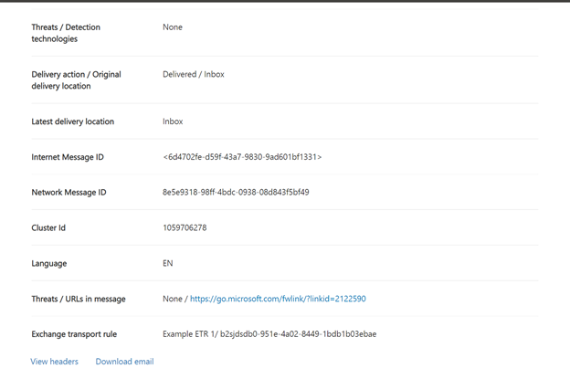

# Threat Explorer och real tids identifiering

Om din organisation har [Microsoft Defender för Office 365](office-365-atp.md) och du har de [nödvändiga behörigheterna](#required-licenses-and-permissions)har du åtkomst till *Explorer* eller *real tids identifiering*, som tidigare var *real tids rapporter*. ([Se vad som är nytt.](#new-features-in-threat-explorer-and-real-time-detections)) Gå till **Threat Management** i säkerhets & efterlevnad och välj sedan **Utforskaren** _eller_ **identifiering av real tid**.

|Med Microsoft Defender för Office 365 abonnemang 2 ser du:|Med Microsoft Defender för Office 365 abonnemang 1 ser du:|
|---|---|
|||
|

Explorer och identifiering av real tid gör att dina säkerhets åtgärder kan undersöka och reagera på hot effektivt. Rapporten ser ut ungefär så här:

Med den här rapporten kan du:

- [Se malware identifieras av Microsoft 365-säkerhetsfunktioner](#see-malware-detected-in-email-by-technology)
- [Visa nät fiske-URL och klicka på Verdict data](#view-phishing-url-and-click-verdict-data)
- [Starta en automatiserad undersökning och svars process från en vy i Utforskaren](#start-automated-investigation-and-response) (endast för Office 365 abonnemang 2)
- [Undersök skadlig e-post och mycket mer](#more-ways-to-use-explorer-and-real-time-detections)

## Förbättringar av Threat Explorer och identifiering i real tid

### Taggar i Threat Explorer

> [!NOTE]
> Funktionen användar koder är i *förhands granskning*, inte tillgänglig för alla och kan komma att ändras. Information om versions schema finns i Microsoft 365-översikten.

User-Taggar identifierar specifika grupper med användare i Microsoft Defender för Office 365. Mer information om taggar, inklusive licensiering och konfiguration finns i [användar koder](user-tags.md).

I Threat Explorer kan du se information om användar koder i följande versioner.

#### Vyn e-post

Kolumnen **taggar** i e-postrutnätet innehåller alla Taggar som har kopplats till avsändaren eller mottagarna. Som standard visas systemtaggar som prioritets konton först.

> [!div class="mx-imgBorder"]
> 

#### Paketfilter

Du kan använda taggar som ett filter. Det är bara att använda specifika användar märknings scenarier. Du kan också utesluta resultat med vissa taggar. Kombinera denna funktion med andra filter för att begränsa omfattningen av undersökningen.

> [!div class="mx-imgBorder"]
> 

#### Utfällbar e-postinformation
Om du vill visa de enskilda taggarna för avsändare och mottagare markerar du ämnet för att öppna utfällda meddelanden. På fliken **Sammanfattning** visas fälten avsändare och mottagare separat, om de finns för ett e-postmeddelande.
Informationen om enskilda taggar för avsändare och mottagare utökas också till exporterade CSV-data där du kan se dessa uppgifter i två separata kolumner.

> [!div class="mx-imgBorder"]
> 

Information om taggar visas också i URL: en. Om du vill visa det går du till Phish eller alla e-postvyer och sedan till fliken **URL** eller **URL** . Välj en URL utfällbar för att visa ytterligare information om klickningar för URL: en, inklusive taggar som är kopplade till det klickade.

> [!div class="mx-imgBorder"]
> 

## Förbättringar av hotet mot hot (kommande)

### Uppdaterad Hot information för e-post

Vi har fokuserat på förbättringar av plattform och data kvalitet för att öka dataens exakthet och konsekvens för e-post. Förbättringar inkluderar konsolidering av information för leverans och efter leverans, till exempel åtgärder som utförts i ett e-postmeddelande som en del av ZAP-processen, i en enda post. Ytterligare information som skräp post Verdict, hot på enhets nivå (till exempel vilken URL är skadlig) och de senaste leverans platserna ingår också.

Efter de här uppdateringarna visas en enda post för varje meddelande, oavsett vilka händelser efter leveransen som påverkar meddelandet. Åtgärder kan inkludera ZAP, manuell reparation (vilket innebär administratörs åtgärd), dynamisk leverans och så vidare.

Förutom att Visa skadlig program vara och nätfiske-hot ser du att skräp posten Verdict är kopplad till ett e-postmeddelande. I e-postmeddelandet Se alla hot som är kopplade till e-postmeddelandet tillsammans med motsvarande identifierings teknik. Ett e-postmeddelande kan ha noll, ett eller flera hot. De aktuella hoten visas i avsnittet **information** i den utfällbara e-postadressen. För flera hot (till exempel skadlig program vara och nätfiske) visar fältet **identifierings** teknologi den Threat Detection-mappningen, som är den detektions teknik som identifierat hotet.

Uppsättningen med identifierings tekniker innehåller nu nya identifierings metoder samt funktioner för skräp identifiering. Du kan använda samma uppsättning med identifierings tekniker för att filtrera resultaten i olika e-postvyer (skadlig program vara, Phish, all e-post).

> [!NOTE]
> Verdict-analys kanske inte nödvändigt vis är knuten till enheter. Som ett exempel kan ett e-postmeddelande klassificeras som Phish eller spam, men det finns inga URL-adresser som är stämplade med en Phish/spam-Verdict. Detta beror på att filter också utvärdera innehåll och annan information för ett e-postmeddelande innan du tilldelar en Verdict.

#### Hot i URL: er

Du kan nu se det specifika hotet för en URL på fliken **information** om utfällbar e-post. Hotet kan vara *skadlig program* vara *, Phish*, *spam* eller *inget*.)

> [!div class="mx-imgBorder"]
> 

### Uppdaterad tidslinjevy (kommande)

> [!div class="mx-imgBorder"]
> 

Vyn tids linje identifierar alla leverans-och efter leverans händelser. Det innehåller information om hotet som identifieras vid den tidpunkten för en delmängd av dessa händelser. Vyn tids linje ger också information om eventuell ytterligare åtgärd som utförs (till exempel ZAP eller manuell åtgärd) tillsammans med resultatet av den åtgärden. Informationen i vyn tids linje inkluderar:

- **Källa:** Källa för händelsen. Den kan vara administratör/system/användare.
- **Händelse:** Inkluderar händelser på den översta nivån såsom ursprunglig leverans, manuell justering, ZAP, inlämning och dynamisk leverans.
- **Åtgärd:** Den specifika åtgärd som har gjorts antingen som en del av en ZAP-eller administratörs åtgärd (till exempel mjuk borttagning).
- **Hot:** Täcker hoten (skadlig program vara, Phish, spam) som identifieras vid den tidpunkten.
- **Resultat/Detaljer:** Mer information om resultatet av åtgärden, till exempel om det utfördes som en del av en ZAP/administratörs åtgärd.

### Ursprunglig och senaste leverans plats

För närvarande har vi leverans plats i e-postrutnätet och utfällbar e-post. Fältet **leverans plats** får namnet **_original leverans plats_* _. Och vi presenterar ett annat fält, _*_senaste leverans plats_*_.

_ *Ursprunglig leverans plats** ger mer information om var e-postmeddelandet levererades från början. Den **senaste leverans platsen** anger var e-post som landats efter system åtgärder som *ZAP* eller administratörs åtgärder kan *flyttas till borttagna objekt*. Den senaste leverans platsen är avsedd att meddela administratörer meddelandets senast kända plats efter inlägg eller system-och administratörs åtgärder. Det inkluderar inga åtgärder för slutanvändare på e-postmeddelandet. Om en användare till exempel tar bort ett meddelande eller flyttade meddelandet till Arkiv/PST uppdateras inte meddelandets leverans plats. Men om en system åtgärd har uppdaterat platsen (till exempel ZAP som resulterade i ett e-postmeddelande som flyttas till karantän), visas den **senaste leverans platsen** som "karantän".

> [!div class="mx-imgBorder"]
> 

> [!NOTE]
> Det finns några fall där **leverans plats** och **leverans åtgärd** kan visas som "okänt":
>
> - Du kan se **leverans plats** som "levererad" och **leverans plats** som "okänt" om meddelandet levererades, men en regel för Inkorgen flyttade meddelandet till en standardmapp (till exempel utkast eller Arkiv) i stället för till Inkorgen eller mappen skräp post.
>
> - Den **senaste leverans platsen** kan vara okänd om en åtgärd för administratören/systemet (till exempel ZAP) försökte med meddelandet inte hittades. Vanligt vis utförs åtgärden efter att användaren har flyttat eller tagit bort meddelandet. I sådana fall ska du kontrol lera kolumnen **resultat/information** i vyn tids linje. Leta efter instruktionen "meddelandet har flyttats eller tagits bort av användaren".

> [!div class="mx-imgBorder"]
> 

### Ytterligare åtgärder

*Ytterligare åtgärder* utfördes efter leverans av e-postmeddelandet. De kan inkludera *ZAP*, *manuell reparation* (åtgärd som vidtas av en administratör, till exempel en mjuk borttagning), *dynamisk leverans* och *omarbetad* (för ett e-postmeddelande som identifieras retroaktivt).

> [!NOTE]
> - Som en del av de väntande ändringarna flyttas värdet "borttaget av ZAP" för tillfället i filtret för leverans åtgärden. Du kan söka efter all e-post med ZAP-försök via **ytterligare åtgärder**.
>
> - Det kommer att finnas nya fält och värden för **identifierings teknologier** och **ytterligare åtgärder** (särskilt för ZAP-scenarier). Du måste utvärdera dina befintliga sparade frågor och spårade frågor för att kontrol lera att de fungerar med de nya värdena.

> [!div class="mx-imgBorder"]

> 

### Systemåsidosättningar

Med *systemåsidosättningar* kan du göra undantag till den avsedda leverans platsen för ett meddelande. Du ersätter den leverans plats som tillhandahålls av systemet baserat på hoten och andra identifieringar som identifieras av filtrerings stacken. Systemåsidosättningar kan anges via klient organisation eller användar princip för att leverera meddelandet enligt policyn. Åsidosättningar kan identifiera oavsiktlig leverans av skadliga meddelanden på grund av konfigurations luckor, till exempel en mer omfattande policy för säker avsändare som anges av en användare. Dessa värden kan vara:

- Tillåts av en användar princip: en användare skapar principer på post lådans nivå för att tillåta domäner eller avsändare.
- Blockerad av en användar princip: en användare skapar principer på rutan e-postruta för att blockera domäner eller avsändare.
- Tillåts av organisations princip: organisationens säkerhets team anger principer eller regler för Exchange-postflöde (kallas även transport regler) för att tillåta avsändare och domäner för användare i organisationen. Detta kan vara för en uppsättning användare eller hela organisationen.
- Blockerat av en organisations princip: organisationens säkerhets team anger principer eller regler för e-postflöde för att blockera avsändare, domäner, meddelande språk eller käll-IP-adresser för användare i organisationen. Det här kan användas för en uppsättning användare eller hela organisationen.
- Fil tillägget blockerat av en organisations princip: en organisations säkerhets team blockerar ett fil namns tillägg via princip inställningarna mot skadlig program vara. Dessa värden visas nu i e-postinformation för att hjälpa till med undersökningar. Secops Teams kan också använda funktionen för RTF-filtrering för att filtrera på blockerade fil namns tillägg.

> [!div class="mx-imgBorder"]
> 

### Förbättringar för URL-adressen och klicknings upplevelsen

Förbättringarna inkluderar:

- Visa hela URL-adressen (inklusive frågeparametrar som är en del av URL: en) i avsnittet **klickningar** i URL-utfällning. För närvarande visas URL-domänen och sökvägen i namn listen. Vi förlänger den informationen för att visa hela webb adressen.

- Korrigeringar via URL-filter (*URL* jämfört med *URL-domän* *och URL*-domän): uppdateringarna påverkar sökning efter meddelanden som innehåller en URL/Klicka på Verdict. Vi aktiverade stöd för oberoende sökningar, så du kan söka efter en URL-adress utan att använda `http` . Som standard mappas URL-sökningen till http om inte ett annat värde uttryckligen anges. Till exempel:

   -  Sök med och utan `http://` prefix i fälten **URL**, **URL-domän** och **URL-domän och Sök vägs** filter. Sökningarna bör visa samma resultat.

   -  Sök efter `https://` prefixet i **URL: en**. Om inget värde anges `http://` används prefixet.

   - `/` ignoreras i början och slutet av URL- **sökvägen**, **URL-domän**, **URL-domän och Sök vägs** fält. `/` i slutet av **URL** -fältet ignoreras.

### Phish konfidensnivå

Phish konfidensnivå hjälper dig att identifiera hur stor del som ett e-postmeddelande kategoriserats som "Phish". De två möjliga värdena är *hög* och *Normal*. I de inledande faserna är det här filtret bara tillgängligt i den Phish vyn av Threat Explorer.

### ZAP URL-signal

ZAP URL-signalen används vanligt vis för Phish varnings scenarier där ett e-postmeddelande identifieras som Phish och togs bort efter leverans. Den här signalen sammanbinder aviseringen med motsvarande resultat i Utforskaren. Det är en av IOCs för aviseringen.

För att förbättra jakt-processen har vi uppdaterat hot Explorer och identifiering i real tid för att göra jakt upplevelsen mer enhetlig. Ändringarna beskrivs här:

- [Förbättringar av tidszon](#timezone-improvements)
- [Uppdatera i uppdaterings processen](#update-in-the-refresh-process)
- [Diagram specificering att lägga till i filter](#chart-drilldown-to-add-to-filters)
- [Uppdateringar av produkt information](#in-product-information-updates)

### Filtrera efter användardefinierade Taggar

Du kan nu sortera och filtrera på system-eller anpassade användar flaggor för att snabbt förstå. Mer information finns i [User Tags](user-tags.md).

> [!IMPORTANT]
> Filtrering och sortering efter användarmallar är för närvarande i offentlig för hands version. De här funktionerna kan komma att ändras väsentligt innan det släpps kommersiellt. Microsoft lämnar inga garantier, uttryckliga eller underförstådda, med avseende på informationen som tillhandahålls.

### Förbättringar av tidszon

Tidszon visas för e-postmeddelandena i portalen samt för exporterade data. Det kommer att synas på upplevelser som e-postrutnät, information utfällbar e-post, tids linje och liknande e-postmeddelanden, så att tids zonen för resultatet är klar.

> [!div class="mx-imgBorder"]
> 

### Uppdatera i uppdaterings processen

Vissa användare har kommenterat om förvirring med automatisk uppdatering (till exempel så fort du ändrar datumet, Sidan uppdateras) och manuell uppdatering (för andra filter). På samma sätt leder borttagning av filter till automatisk uppdatering. Om du ändrar filter när du ändrar frågan kan det orsaka inkonsekventa Sök upplevelser. För att lösa problemen flyttas vi till en manuell filtrerings funktion.

Från en miljö synpunkt kan användaren tillämpa och ta bort det olika intervallet med filter (från filter uppsättning och datum) och välja knappen Uppdatera för att filtrera resultaten efter att de har definierat frågan. Knappen Uppdatera visas nu på skärmen. Vi har också uppdaterat tillhörda beskrivningar och dokumentation.

> [!div class="mx-imgBorder"]
> 

### Diagram specificering att lägga till i filter

Du kan nu lägga till värden som filter i diagram. Välj knappen **Uppdatera** för att filtrera resultaten.

> [!div class="mx-imgBorder"]
> 

### Uppdateringar av produkt information

Ytterligare uppgifter är nu tillgängliga i produkten, till exempel det totala antalet Sök resultat inom rutnätet (se nedan). Vi har förbättrat etiketter, fel meddelanden och beskrivningar för att få mer information om filtren, Sök upplevelsen och resultatet.

> [!div class="mx-imgBorder"]
> 

## Utökade funktioner i Threat Explorer

### Vanligaste riktade användare

Idag står det för en lista över de vanligaste riktade användarna i vyn mot skadlig kod för e-post, i den **översta** delen av familjen. Vi kommer att utöka den här vyn i Phish och alla e-postvyer. Du kan se de fyra riktade användarna, tillsammans med antalet försök för varje användare i motsvarande vy. För Phish visas till exempel antalet Phish-försök.

Du kan exportera listan med riktade användare, upp till en begränsning på 3 000, tillsammans med antalet försök för offline-analys för varje e-postmeddelande. Om du väljer antalet försök (till exempel 13 försök i bilden nedan) öppnas dessutom en filtrerad vy i Threat Explorer så att du kan se mer information i alla e-postmeddelanden och hot för den användaren.

> [!div class="mx-imgBorder"]
> 

### Exchange Transport-regler

Som en del av data berikning kan du se alla de olika Exchange-Exchange som användes för ett meddelande. Den här informationen kommer att vara tillgänglig i vyn e-rutnätsvy. Om du vill visa den väljer du **kolumn alternativ** i rutnätet och sedan **Lägg till Exchange-transportläge** från kolumn alternativen. **Det kommer** också att synas i e-postmeddelandet.

Du kan se både GUID och namnet på de transport regler som har lagts till i meddelandet. Du kan söka efter meddelanden med hjälp av namnet på transport regeln. Det här är en "innehåller"-sökning, vilket innebär att du kan göra delvis sökningar.

#### Viktigt Obs!

Exchange Sök-och namn tillgänglighet beror på vilken roll som tilldelats dig. Du måste ha någon av följande roller/behörigheter för att Visa Exchange namn och sökning. Om du inte har några av de här rollerna tilldelade till dig kan du inte se namnen på transport reglerna eller söka efter meddelanden med hjälp av Exchange-namn. Du kan emellertid se Exchange etikett och GUID-information i e-postinformationen. Andra post-visnings upplevelser i e-postrutnät, e-flyouts, filter och export påverkas inte.

- Endast EXO – förhindra data förlust: alla
- Endast EXO-O365SupportViewConfig: alla
- Microsoft Azure Active Directory eller EXO-säkerhets administratör: alla
- AAD eller EXO – säkerhets läsare: alla
- Endast EXO – transport regler: alla
- Endast EXO-View-Only konfiguration: alla

I e-postrutnätet, den utfällbara informationen och exporterad CSV-fil visas ETR med ett namn/GUID som visas nedan.

> [!div class="mx-imgBorder"]
> 

### Inkommande kopplingar

Kopplingar är en samling instruktioner som anpassar hur dina meddelanden skickas till och från din Microsoft 365-eller Office 365-organisation. De gör att du kan tillämpa säkerhets begränsningar eller kontroller. I Threat Explorer kan du nu Visa kopplingarna som är relaterade till ett e-postmeddelande och söka efter e-postmeddelanden med hjälp av kopplings namn.

Sökningen efter anslutningar är "contains" i natur, vilket innebär att ofullständiga nyckelords sökningar också fungerar. I vyn huvud rutnät, den utfällbara informationen och den exporterade CSV-filen visas kopplingarna i namn/GUID-formatet som visas här:

> [!div class="mx-imgBorder"]
> 

## Nya funktioner i Threat Explorer och identifiering av real tid

Tre nya funktioner finns tillgängliga i Threat Explorer och real tids identifiering:

- [Förhandsgranska e-posthuvud och hämta e-postmeddelande](#preview-email-header-and-download-email-body)
- [E-posttids linje](#email-timeline)
- [Exportera URL Klicka på data](#export-url-click-data)

Dessa nya funktioner beskrivs nedan.

### Förhandsgranska e-posthuvud och hämta e-postmeddelande

Du kan nu förhandsgranska ett e-posthuvud och hämta e-postmeddelandet i Threats Explorer-administratörer kan analysera de meddelandehuvuden/e-postmeddelandena för hoten. Eftersom nedladdning av e-postmeddelanden kan påverka informationens exponering styr den här processen med RBAC (rollbaserad åtkomst kontroll). En ny roll, för *hands version*, måste läggas till i en annan roll grupp (som säkerhets åtgärder eller säkerhets administratör) för att tillåta möjligheten att hämta e-post och förhandsgranska rubriker i alla e-postmeddelanden.

Explorer och real tids identifiering får också nya fält som ger en mer komplett bild av var dina e-postmeddelanden hamnar. Med de här ändringarna blir det enklare att komma i säkerhets policyn. Men huvud resultatet är att du kan enkelt skicka meddelanden till dig.

Hur gör du det här? Leverans status är nu uppdelad i två kolumner:

- **Leverans åtgärd** – e-postadressens status.
- **Leverans plats** – här är e-postmeddelandet.

*Leverans åtgärden* är den åtgärd som utförs via e-post på grund av befintliga principer eller identifieringar. Här är de möjliga åtgärderna för ett e-postmeddelande:

|Levereras|Skräp post|Blockering|Byta|
|---|---|---|---|
|E-postmeddelandet skickades till Inkorgen eller mappen för en användare och användaren kan komma åt den.|E-postmeddelandet skickades till användarens skräp post och användaren kan komma åt den.|E-postmeddelanden som har satts i karantän, som misslyckats eller tagits bort. Dessa e-postmeddelanden är inte tillgängliga för användaren.|E-postmeddelandet hade bilage bilagor ersatt av. txt-filer som anger att den bifogade filen var skadlig|

Vad användaren kan och inte ser:

|Tillgänglig för slutanvändare|Ej tillgänglig för slutanvändare|
|---|---|
|Levereras|Blockering|
|Skräp post|Byta|

**Leverans platsen** visar resultaten av principer och upptäckter med efter-leverans. Den är länkad till **_leverans åtgärden_* _. Det här är de möjliga värdena:

- _Inbox eller mapp *: e-postmeddelandet finns i Inkorgen eller i en mapp (enligt dina e-postregler).
- *On-lokala eller external*: post lådan finns inte i molnet, men den är lokal.
- *Mappen skräp* post: e-postmeddelandet finns i en användares skräppost-mapp.
- *Mappen Borttaget*: e-posten i en användares mapp för borttagna objekt.
- *Karantän*: e-postmeddelandet finns i karantän och inte i en användares post låda.
- *Misslyckades*: det gick inte att nå post lådan.
- *Avbruten*: e-postmeddelandet har försvunnit från e-postflödet.

### E-posttids linje

**E-postschemat** är en ny Explorer-funktion som förbättrar jakt upplevelsen för administratörer. Den tid det tar att kontrol lera olika platser för att försöka förstå evenemanget. När flera händelser inträffar samtidigt eller nära varandra när ett e-postmeddelande tas emot visas de händelserna i vyn tids linje. Vissa händelser som inträffar i din e-postleverans efter inlägg sparas i kolumnen **särskilda åtgärder** . Administratörer kan kombinera information från tids linjen med den speciella åtgärd som utförs på e-postleveransen för att få en överblick över hur deras principer fungerar, där e-postmeddelandet slutligen skickades och, i vissa fall, vad den slutliga utvärderingen var.

Mer information finns i [undersöka och åtgärda skadlig e-post som har levererats i Office 365](investigate-malicious-email-that-was-delivered.md).

### Exportera URL Klicka på data

Du kan nu exportera rapporter för URL: er till Microsoft Excel för att visa sina **nätverks meddelande-ID** och **Klicka på Verdict**, vilket förklarar var din URL-adress klickade på trafik. Så här fungerar det: öppna Threat Management i snabb starts fältet för Office 365 genom att följa den här kedjan:

**Utforskaren** \> **Visa Phish** \> **Klickar på** \> De **översta** URL-adresserna eller **URL-adressen längst ned klickar** \> du på Välj en post för att öppna webb adressen

När du väljer en URL-adress i listan visas en ny **Exportera** -knapp på panelen utflygande. Använd den här knappen för att flytta data till ett Excel-kalkylblad för enklare rapportering.

Följ den här sökvägen för att komma till samma plats i rapporten om real tids identifiering:

**Utforskaren** \> **Real tids identifiering** \> **Visa Phish** \> **URL: er** \> **Högst upp URL: er** eller **längst ned klickar** du på \> en post för att öppna URL-den nedfällda på \> fliken **klickningar** .

> [!TIP]
> Med ID för nätverks meddelanden visas meddelandet Klicka på tillbaka till vissa e-postmeddelanden när du söker efter Utforskaren eller tillhör ande verktyg från tredje part. Sådana sökningar identifierar det e-postmeddelande som är kopplat till ett Klicka-resultat. Om du har det korrelerade nätverks meddelande-ID: t för snabbare och effektivare analys.

> [!div class="mx-imgBorder"]
> 

## Se malware identifierat i e-post efter teknik

Anta att du vill se hur skadlig kod identifieras i e-post sorterade efter Microsoft 365-teknologi. För att göra det här använder du [e-postmeddelandet med > skadlig program vara](threat-explorer-views.md#email--malware) för Explorer (eller real tids identifiering).

1. <https://protection.office.com>Välj **Threat Management** \> **Explorer** (eller **real tids identifiering**) i gruppen säkerhets & efterlevnad. (Det här exemplet använder Utforskaren.)

2. Välj  **e-** \> **postmalware** på Visa-menyn.

   > [!div class="mx-imgBorder"]
   > 

3. Klicka på **avsändare** och välj sedan **grundläggande** \> **identifierings teknik**.

   Din identifierings teknik är nu tillgänglig som filter för rapporten.

   > [!div class="mx-imgBorder"]
   > 

4. Välj ett alternativ. Välj sedan knappen **Uppdatera** för att tillämpa filtret.

   > [!div class="mx-imgBorder"]
   > 

Rapporten uppdateras för att visa resultatet i e-post med det tekniska alternativet du valde. Härifrån kan du göra ytterligare analyser.

## Visa nät fiske-URL och klicka på Verdict data

Anta att du vill se nät fiske försök via URL: er via e-post, inklusive en lista med URL-adresser som tilläts, blockerades och åsidosatts. För att identifiera webb adresser som du har klickat på måste [säkra länkar](atp-safe-links.md) vara konfigurerade. Kontrol lera att du har angett [principer för säkra länkar](set-up-atp-safe-links-policies.md) för att klicka på skydd och loggning av Klicka på Verdicts efter Safe Links.

Om du vill granska Phish URL-adresser i meddelanden och klickar på URL-adresser i Phish meddelanden använder du [ **e-postmeddelandet**  > ](threat-explorer-views.md#email--phish) i gransknings-eller real tid-identifiering.

1. <https://protection.office.com>Välj **Threat Management** \> **Explorer** (eller **real tids identifiering**) i gruppen säkerhets & efterlevnad. (Det här exemplet använder Utforskaren.)

2. Välj **e-** Phish på **Visa** -menyn \> .

   > [!div class="mx-imgBorder"]
   > 

3. Klicka på **avsändare** och välj **URL-adresser** \> **på Verdict**.

4. Välj ett eller flera alternativ, till exempel **blockerat** och **blockera**, och välj sedan knappen **Uppdatera** på samma rad som de alternativ som du vill tillämpa filtret på. (Uppdatera inte webbläsarfönstret.)

   > [!div class="mx-imgBorder"]
   > 

   Rapporten uppdateras och visar två olika URL-tabeller på fliken URL under rapporten:

   - De **översta URL-adresserna** är URL-adresserna i de meddelanden som du filtrerat ned till och hur många e-postleveranser som ska utföras I Phish e-postvy innehåller den här listan normalt legitima URL: er. Attackerare inkluderar en blandning av bra och dåliga URL-adresser i sina meddelanden för att försöka komma åt dem, men de kan göra det mer intressantare. Tabellen med URL-adresser sorteras efter totalt antal e-postmeddelanden, men den här kolumnen är dold för att förenkla vyn.

   - **Högst upp** är de säkra länkar-figursatta URL-adresser som du klickade på och sorterat efter totalt antal klickningar. Den här kolumnen visas inte heller för att förenkla vyn. Kolumnen totalt antal gånger visar de säkra länkarna Klicka på Verdict antal för varje klickning-URL. I Phish e-postvy är de vanligt vis misstänkta eller illasinnade URL: er. Vyn kan dock innehålla URL-adresser som inte är Hot men som finns i Phish meddelanden. URL-klickningar på inte figursatta länkar visas inte här.

   De två URL-tabellerna visar de högsta URL-adresserna i phishing-e-postmeddelanden via leverans åtgärd och plats. Tabellerna visar URL-musklick som har blockerats eller lagts till trots en varning, så att du kan se vilka potentiella felaktiga länkar som visades för användarna och att användaren har klickat på. Härifrån kan du göra ytterligare analyser. Under diagrammet kan du till exempel se de högsta URL-adresserna i e-postmeddelanden som har blockerats i organisationens miljö.

   > [!div class="mx-imgBorder"]
   > 

   Välj en URL för att visa mer detaljerad information.

   > [!NOTE]
   > I dialog rutan URL-utfällning tas filtreringen av e-postmeddelanden bort för att visa hela vyn av URL: en exponering i miljön. Då kan du filtrera efter e-postmeddelanden som du är bekymrad över i Utforskaren, hitta specifika URL-adresser som är potentiella hot och sedan utöka din förståelse av URL-exponeringen i din miljö (via dialog rutan URL-information) utan att behöva lägga till URL-filter i själva Utforskarvyn.

### Tolkning av klick verdicts

I e-postmeddelandet eller URL-flyouts, de viktigaste tryckningarna samt i våra filtrerings upplevelser visas andra Klicka på Verdict-värden:

- **Ingen:** Det går inte att skapa Verdict för URL: en. Användaren kanske har klickat via webb adressen.
- **Tillåtna:** Användaren har fått åtkomst till URL-adressen.
- **Blockerat:** Användaren hindrades från att navigera till URL-adressen.
- **Väntande Verdict:** Användaren har uppvisats med den överliggande sidan.
- **Blockerad åsidosatt:** Användaren blockerades från att gå direkt till URL-adressen. Men användaren overrode blocket för att gå till URL-adressen.
- **Väntande Verdict ignoreras:** Användaren har uppvisats med sidan för sprängandet. Men användaren overrode meddelandet för att få åtkomst till webb adressen.
- **Fel:** Användaren visades med felsidan, eller så uppstod det ett fel när du hämtade Verdict.
- **Fel:** Ett okänt undantag inträffade när du hämtade Verdict. Användaren kanske har klickat via webb adressen.

## Granska e-postmeddelanden som rapporter ATS av användare

Anta att du vill se e-postmeddelanden som användare i din organisation rapporterat som *skräp post*, *inte skräp post* eller *nätfiske* via [rapport tillägget](enable-the-report-message-add-in.md) eller tilläggs tillägget för [rapport](enable-the-report-phish-add-in.md). Om du vill visa dem använder du vyn [ **e-**  >  **postinlägg**](threat-explorer-views.md#email--submissions) i Utforskaren (eller real tids identifieringar).

1. <https://protection.office.com>Välj **Threat Management** \> **Explorer** (eller **real tids identifiering**) i gruppen säkerhets & efterlevnad. (Det här exemplet använder Utforskaren.)

2. Välj  **e-** \> **postinlägg** i menyn Visa.

   > [!div class="mx-imgBorder"]
   > 

3. Klicka på **avsändare** och välj sedan **enkel** \> **typ av rapport**.

4. Välj ett alternativ, till exempel **Phish**, och välj sedan knappen **Uppdatera** .

   > [!div class="mx-imgBorder"]
   > 

Rapporten uppdateras och visar information om e-postmeddelanden som personer i organisationen har rapporterat som ett nät fiske försök. Du kan använda den här informationen för att utföra ytterligare analyser och, om det behövs, justera dina [skydds principer i Microsoft Defender för Office 365](configure-atp-anti-phishing-policies.md).

## Starta automatisk undersökning och svar

> [!NOTE]
> Den automatiska undersöknings-och svars funktionerna är tillgängliga i *Microsoft Defender för Office 365 abonnemang 2* och *Office 365 E5*.

Den [automatiska undersökningen och svaret](automated-investigation-response-office.md) kan spara tid och arbete för dina arbets uppgifter för att undersöka och minska cyberattacks. Förutom att konfigurera aviseringar som kan utlösa en säkerhets Playbook kan du starta en automatiserad undersökning och svars process från en vy i Utforskaren. Mer information finns i [exempel: en säkerhets administratör utlöser en undersökning från Utforskaren](automated-investigation-response-office.md#example-a-security-administrator-triggers-an-investigation-from-threat-explorer).

## Fler sätt att använda Explorer och identifiering av real tid

Utöver de scenarier som beskrivs i den här artikeln finns det många fler rapporterings alternativ som är tillgängliga med Explorer (eller real tids identifieringar). Se följande artiklar:

- [Hitta och undersöka skadlig e-post som har levererats](investigate-malicious-email-that-was-delivered.md)
- [Visa skadliga filer som identifieras i SharePoint Online, OneDrive och Microsoft Teams](malicious-files-detected-in-spo-odb-or-teams.md)
- [Få en översikt över vyerna i Threat Explorer (och identifieringar i real tid)](threat-explorer-views.md)
- [Statusrapport för hotskydd](view-email-security-reports.md#threat-protection-status-report)
- [Automatisk undersökning och svar i skydd mot Microsoft Threat](https://docs.microsoft.com/microsoft-365/security/mtp/mtp-autoir)

## Nödvändiga licenser och behörigheter

Du måste ha [Microsoft Defender för Office 365](office-365-atp.md) för att kunna använda Explorer eller real tids identifiering.

- Explorer ingår i Defender för Office 365 abonnemang 2.
- Rapporten om real tids identifiering ingår i Defender för Office 365 abonnemang 1.
- Planera för att tilldela licenser för alla användare som ska skyddas av Defender för Office 365. Explorer och identifiering av real tid visar identifierings data för licensierade användare.

Om du vill visa och använda Explorer-eller real tids identifiering måste du ha lämplig behörighet, till exempel en säkerhets administratör eller en säkerhets läsare.

- För säkerhets & Compliance Center måste du ha någon av följande roller tilldelade:

  - Organisationshantering
  - Säkerhets administratör (detta kan tilldelas i Azure Active Directory Admin Center ( <https://aad.portal.azure.com> )
  - Säkerhets läsare

- För Exchange Online måste du ha någon av följande roller tilldelade i antingen Exchange Admin Center ( <https://admin.protection.outlook.com/ecp/> ) eller [Exchange Online PowerShell](https://docs.microsoft.com/powershell/exchange/exchange-online-powershell):

  - Organisationshantering
  - View-Only organisations hantering
  - View-Only mottagare
  - Hantering av efterlevnad

Mer information om roller och behörigheter finns i följande resurser:

- [Behörigheter i Säkerhets- och efterlevnadscentret](permissions-in-the-security-and-compliance-center.md)
- [Behörigheter för funktioner i Exchange Online](https://docs.microsoft.com/exchange/permissions-exo/feature-permissions)

## Skillnader mellan Threat Explorer och identifiering i real tid

- Rapporten om *identifiering av real tid* är tillgänglig i Defender för Office 365 abonnemang 1. *Threat Explorer* är tillgängligt i Defender för Office 365 abonnemang 2.
- Med rapporten real tids identifiering kan du Visa identifiering i real tid. Hotet Explorer fungerar också, men dessutom ytterligare information för en viss attack.
- En *all e-* postvy är tillgänglig i Threat Explorer men inte i rapporten om identifiering av real tids rapporter.
- Fler filter funktioner och tillgängliga åtgärder ingår i Threat Explorer. Mer information finns i [Microsoft Defender för Office 365 Service Description: funktions tillgänglighet i Defender för office 365-abonnemang](https://docs.microsoft.com/office365/servicedescriptions/office-365-advanced-threat-protection-service-description#feature-availability-across-advanced-threat-protection-atp-plans).
