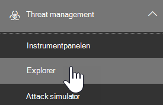

# Hot jaga i Threat Explorer för Microsoft Defender för Office 365Threat hunting in Threat Explorer for Microsoft Defender for Office 365

I den här artikeln:In this article:

- [Genomgång av Threat ExplorerThreat Explorer walk-through](#threat-explorer-walk-through)
- [Undersökning av e-postEmail investigation](#email-investigation)
- [E-postreparationEmail remediation](#email-remediation)
- [Förbättringar för att hitta hotImprovements to threat hunting experience](#improvements-to-threat-hunting-experience)

> [!NOTE]
> Det här är en del av en **3-artikelserie** om grunderna för identifiering av  **hotutforskaren (Explorer),** e-postsäkerhet och Utforskaren och **realtidsidentifiering** (till exempel skillnader mellan verktygen och behörigheter som krävs för att hantera dem).This is part of a **3-article series** on **Threat Explorer (Explorer)**, **email security**, and **Explorer and Real-time detections basics** (such as differences between the tools, and permissions needed to operate them). De andra två artiklarna i den här serien [är E-postsäkerhet](email-security-in-microsoft-defender.md) med Threat Explorer och Threat Explorer samt grundläggande funktioner för [identifiering i realtid.](real-time-detections.md)The other two articles in this series are [Email security with Threat Explorer](email-security-in-microsoft-defender.md) and [Threat Explorer and Real-time detections basics](real-time-detections.md).

**Gäller för****Applies to**
- [Microsoft Defender för Office 365 Abonnemang 1 och Abonnemang 2Microsoft Defender for Office 365 plan 1 and plan 2](defender-for-office-365.md)
- [Microsoft 365 DefenderMicrosoft 365 Defender](../defender/microsoft-365-defender.md)

Om din organisation har [Microsoft Defender för Office 365](defender-for-office-365.md) och du har behörighet kan du använda **Utforskaren** eller **Realtidsidentifiering** för att identifiera och åtgärda hot.If your organization has [Microsoft Defender for Office 365](defender-for-office-365.md), and you have the [permissions](#required-licenses-and-permissions), you can use **Explorer** or **Real-time detections** to detect and remediate threats. 

I **Säkerhets- & säkerhets- och** efterlevnadscenter går du till Hantering av hot och väljer **sedan Utforskaren**  **eller Identifieringar i realtid.**In the **Security & Compliance Center**, go to **Threat management**, and then choose **Explorer** _or_ **Real-time detections**.

 

****

|Med Microsoft Defender för Office 365 abonnemang 2 visas:With Microsoft Defender for Office 365 Plan 2, you see:|Med Microsoft Defender för Office 365 abonnemang 1 visas:With Microsoft Defender for Office 365 Plan 1, you see:|
|---|---|
|||
|

Med dessa verktyg kan du:With these tools, you can:

- Se skadlig programvara som upptäckts Microsoft 365 säkerhetsfunktionerSee malware detected by Microsoft 365 security features
- Visa nätfiske-URL och klicka på bedömningsdataView phishing URL and click verdict data
- Starta en automatiserad undersökning och svarsprocess från en vy i UtforskarenStart an automated investigation and response process from a view in Explorer
- Undersöka skadlig e-post med meraInvestigate malicious email, and more

Mer information finns i [E-postsäkerhet med Hotutforskaren.](email-security-in-microsoft-defender.md)For more information, see [Email security with Threat Explorer](email-security-in-microsoft-defender.md). 

## Genomgång av Threat ExplorerThreat Explorer walk-through

I Microsoft Defender för Office 365 finns det två abonnemang – abonnemang 1 och abonnemang 2.In Microsoft Defender for Office 365, there are two subscription plans—Plan 1 and Plan 2. Manuellt använda sökverktyg för hot finns i båda abonnemangen, under olika namn och med olika funktioner.Manually operated Threat hunting tools exist in both plans, under different names and with different capabilities.

Defender för Office 365 abonnemang 1 använder identifieringar i *realtid,* vilket är en del av sökverktyget i Threat *Explorer* (kallas även *Utforskaren)* i abonnemang 2.Defender for Office 365 Plan 1 uses *Real-time detections*, which is a subset of the *Threat Explorer* (also called *Explorer*) hunting tool in Plan 2. I den här serien med artiklar har de flesta av exemplen skapats med hjälp av hela Hotutforskaren.In this series of articles, most of the examples were created using the full Threat Explorer. Administratörer bör testa stegen i realtidsidentifiering för att se var de är tillämpliga.Admins should test any steps in Real-time detections to see where they apply.

Öppna Utforskaren genom att gå till **Säkerhets- & Säkerhetscenter**–  >    >  **Hothanteringsutforskaren** (eller **Identifieringar i realtid).**To open the Explorer tool, go to **Security & Compliance Center** > **Threat management** > **Explorer** (or **Real-time detections**). Som standard kommer du till  sidan Skadlig programvara, men använder listrutan **Visa** för att bekanta dig med alternativen.By default, you’ll arrive on the **Malware** page, but use the **View** drop down to get familiar with your options. Om du letar efter Phish eller är redo för en hotkampanj väljer du de här vyerna.If you’re hunting Phish, or digging into a threat campaign, choose those views.

> [!div class="mx-imgBorder"]
> 

När en säkerhetsoperationer (Sec Ops) väljer ut de data som de vill se, om omfattningen är smal vy som  användare Som skickar , eller en bredare vy, som All e-post, kan de använda knappen Avsändare för att filtrera ytterligare.Once a security operations (Sec Ops) person selects the data they want to see, whether the scope is narrow view like user **Submissions**, or a wider view, like **All email**, they can use the **Sender** button to further filter. Kom ihåg att välja Uppdatera för att slutföra filtreringsåtgärderna.Remember to select Refresh to complete your filtering actions.

> [!div class="mx-imgBorder"]
> 

Du kan tänka på att förfina fokus i Utforskaren eller Identifiering i realtid i lager.Refining focus in Explorer or Real-time detection can be thought of in layers. Det första är **Visa**.The first is **View**. Det andra kan ses som ett *filtrerat fokus.*The second can be thought of as a *filtered focus*. Du kan till exempel gå tillbaka till de steg du gick genom att registrera ett hot genom att registrera dina beslut så här: För att hitta problemet i Utforskaren valde jag vyn Skadlig programvara med filtret Mottagare i **fokus**.For example, you can retrace the steps you took in finding a threat by recording your decisions like this: To find the issue in Explorer, **I chose the Malware View with a Recipient filter focus**. Det gör det enklare att ta om stegen.This makes retracing your steps easier.

> [!TIP]
> Om Sek Ops använder **taggar** för att markera konton som de överväger högvärdiga mål, kan de göra val som Phish View med ett *taggfilterfokus (ta* med ett datumintervall om det används).If Sec Ops uses **Tags** to mark accounts they consider high valued targets, they can make selections like *Phish View with a Tags filter focus (include a date range if used)*. Då visas deras nätfiskeförsök mot användarens högvärdesmålen under en tidsperiod (t.ex. datum när vissa nätfiskeattacker pågår mycket inom branschen).This will show them any phishing attempts directed at their high value user targets during a time-range (like dates when certain phishing attacks are happening a lot for their industry). 

Du kan förbättra datumintervallen med hjälp av kontrollerna för datumintervall.Refinements can be made on date ranges by using the date range controls. Här kan du se Utforskaren i **vyn Skadlig** programvara med filtret **Identifieringsteknik** i fokus.Here you can see Explorer in **Malware** view, with a **Detection Technology** filter focus. Men det är filterknappen **Avancerat som** gör att Sek Ops grupper kan gräva djupare.But it’s the **Advanced filter** button that lets Sec Ops teams dig deep. 

> [!div class="mx-imgBorder"]
> 

Om du **klickar på filtret** Avancerat visas en panel som låter Sek Ops skapa frågor själva, så att de kan inkludera eller exkludera den information de behöver se.Clicking the **Advanced filter** pops a panel that will let Sec Ops hunters build queries themselves, letting them include or exclude the information they need to see. Både diagrammet och tabellen på sidan Utforskaren speglar deras resultat.Both the chart and table on the Explorer page will reflect their results. 

> [!div class="mx-imgBorder"]
> 

Använd knappen **Kolumnalternativ** för att få den typ av information om tabellen som skulle vara mest användbar:Use the **Column options** button to get the kind of information on the table that would be most helpful: 

> [!div class="mx-imgBorder"]
> 

> [!div class="mx-imgBorder"]
> 

Testa bildskärmsalternativen med samma mien.In the same mien, make sure to test your display options. Olika målgrupper kommer att reagera bra på olika presentationer med samma data.Different audiences will react well to different presentations of the same data. För vissa användare kan kartan för e-postsprung visa att  ett hot är svårt eller **ödslar** snabbare än visningsalternativet Kampanj bredvid det.For some viewers, the **Email Origins** map can show that a threat is widespread or discreet more quickly than the **Campaign display** option right next to it. Sek Ops kan använda dessa bildskärmar för att bäst understryka behovet av säkerhet och skydd, eller för senare jämförelse, för att visa hur effektivt deras åtgärder är.Sec Ops can make use of these displays to best make points that underscore the need for security and protection, or for later comparison, to demonstrate the effectiveness of their actions. 

> [!div class="mx-imgBorder"]
> 

> [!div class="mx-imgBorder"]
> 

### Undersökning av e-postEmail investigation

När du ser ett misstänkt e-postmeddelande klickar du på namnet för att expandera den utfällade menyn till höger.When you see a suspicious email, click the name to expand the flyout on the right. Här är banderollen som låter Sek Ops se sidan med [e-post entitet](mdo-email-entity-page.md) tillgänglig.Here, the banner that lets Sec Ops see the [email entity page](mdo-email-entity-page.md) is available.

Sidan för e-post entitet samlas ihop med innehåll som finns under **Information**, **Bifogade filer** **,** Enheter , men innehåller mer ordnade data.The email entity page pulls together contents that can be found under **Details**, **Attachments**, **Devices**, but includes more organized data. Det kan till exempel vara DMARC-resultat, oformaterad textvisning av e-postrubriken med ett kopieringsalternativ, bedömningsinformation om bifogade filer som har lösts och filer som detonationer har släppt (kan inkludera IP-adresser som kontaktades och skärmbilder på sidor eller filer).This includes things like DMARC results, plain text display of the email header with a copy option, verdict information on attachments that were securely detonated, and files those detonations dropped (can include IP addresses that were contacted and screenshots of pages or files). Webbadresser och deras bedömnings inrapporter visas också med liknande information.URLs and their verdicts are also listed with similar details reported. 

När du kommer till det här steget är sidan för e-post entitet kritisk till det sista steget *– åtgärd*.When you reach this stage, the email entity page will be critical to the final step—*remediation*. 

> [!div class="mx-imgBorder"]
> 

> [!TIP]
> Om du vill veta mer om sidan  med en omfattande e-post entitet (som visas nedan på fliken Analys), inklusive resultatet av detonerade bifogade filer, resultat för inkluderade webbadresser och säker förhandsgranskning av e-post, klickar du [här](mdo-email-entity-page.md).To learn more about the rich email entity page (seen below on the **Analysis** tab), including the results of detonated Attachments, findings for included URLs, and safe Email preview, click [here](mdo-email-entity-page.md).

> [!div class="mx-imgBorder"]
> 

### E-postreparationEmail remediation

När en sec Ops-person anser att ett e-postmeddelande är ett hot är nästa steg i Utforskaren eller identifiering i realtid att hantera hotet och åtgärda det.Once a Sec Ops person determines that an email is a threat, the next Explorer or Real-time detection step is dealing with the threat and remediating it. Det kan du göra genom att gå tillbaka till Hotutforskaren, markera kryssrutan för problemmeddelandet och använda **knappen** Åtgärder.This can be done by returning to Threat Explorer, selecting the checkbox for the problem email, and using the **Actions** button.

> [!div class="mx-imgBorder"]
> 

Här kan analytikern vidta åtgärder som att rapportera e-post som skräppost, nätfiske eller skadlig kod, kontakta mottagare eller ytterligare undersökningar som kan omfatta utlösa spelböcker för automatisk undersökning och svar (eller AIR) (om du har abonnemang 2).Here, the analyst can take actions like reporting the mail as Spam, Phishing, or Malware, contacting recipients, or further investigations that can include triggering Automated Investigation and Response (or AIR) playbooks (if you have Plan 2). Eller så kan e-posten rapporteras som ren.Or, the mail can also be reported as clean.

> [!div class="mx-imgBorder"]
> 

## Förbättringar för att hitta hotImprovements to threat hunting experience

### Aviserings-IDAlert ID

När du navigerar från en avisering till **Hotutforskaren filtreras** vyn med **aviserings-ID**.When navigating from an alert into Threat Explorer, the **View** will be filtered by **Alert ID**. Det här gäller även vid identifiering i realtid.This also applies in Real-time detection. Meddelanden som är relevanta för den specifika aviseringen och en summa för e-post (antal) visas.Messages relevant to the specific alert, and an email total (a count) are shown. Du kan se om ett meddelande var en del av en avisering och även navigera från det meddelandet till den relaterade aviseringen.You will be able to see if a message was part of an alert, as well as navigate from that message to the related alert.

Slutligen inkluderas aviserings-ID i URL:en, till exempel: `https://protection.office.com/viewalerts?id=372c9b5b-a6c3-5847-fa00-08d8abb04ef1`Finally, alert ID is included in the URL, for example: `https://protection.office.com/viewalerts?id=372c9b5b-a6c3-5847-fa00-08d8abb04ef1`

> [!div class="mx-imgBorder"]
> 

> [!div class="mx-imgBorder"]
> 

### Utöka databevarandet i Utforskaren (och realtidsidentifiering) och sökbegränsningen för utvärderingsklienterExtending Explorer (and Real-time detections) data retention and search limit for trial tenants 

Som en del av den här ändringen kan analytiker söka efter och filtrera e-postdata i 30 dagar (ökad från sju dagar) i Threat Explorer och realtidsidentifiering för både Defender för Office P1- och P2-utvärderingsklienter.As part of this change, analysts will be able to search for, and filter email data across 30 days (increased from seven days) in Threat Explorer and Real-time detections for both Defender for Office P1 and P2 trial tenants. Detta påverkar inte några produktionsklienter för både P1- och P2 E5-kunder, där standardinställningen för bevarande redan är 30 dagar.This doesn’t impact any production tenants for both P1 and P2 E5 customers, where the retention default is already 30 days.

### Uppdaterad exportgränsUpdated Export limit 

Antalet e-postposter som kan exporteras från Threat Explorer är nu 200 000 (var 9990).The number of Emails records that can be exported from Threat Explorer is now 200,000 (was 9990). Uppsättningen kolumner som kan exporteras ändras inte.The set of columns that can be exported is unchanged. 

### Taggar i HotutforskarenTags in Threat Explorer

> [!NOTE]
> Funktionen med användartaggar är en förhandsversion och kanske inte tillgänglig för alla.The user tags feature is in Preview and may not be available to everyone. Förhandsgranskningar kan också komma att ändras.Also, Previews are subject to change. Mer information om versionsschemat finns i översikten över Microsoft 365 version.For information about the release schedule, check out the Microsoft 365 roadmap.

Användartaggar identifierar specifika användargrupper i Microsoft Defender för Office 365.User tags identify specific groups of users in Microsoft Defender for Office 365. Mer information om taggar, inklusive licensiering och konfiguration, finns i [Användartaggar.](user-tags.md)For more information about tags, including licensing and configuration, see [User tags](user-tags.md).

I Hotutforskaren kan du se information om användartaggar i följande funktioner.In Threat Explorer, you can see information about user tags in the following experiences.

#### Rutnätsvyn för e-postEmail grid view

När analytiker tittar på **kolumnen Taggar** i e-postrutnätet ser de alla taggar som har tillämpats på avsändares eller mottagares postlådor.When analysts look at the **Tags** column the email grid, they are seeing all tags that have been applied to sender or recipient mailboxes. Som standard visas systemtaggar *som prioritetskonton* först.By default, system tags like *priority accounts* are shown first.

> [!div class="mx-imgBorder"]
> 

#### FiltreraFiltering

Taggar kan användas som filter.Tags can be used as filters. Jaga endast bland prioritetskonton eller använd specifika användartaggsscenarier på det här sättet.Hunt among priority accounts only, or use specific user tags scenarios this way. Du kan också utesluta resultat som har vissa taggar.You can also exclude results that have certain tags. Kombinera taggar med andra filter och datumintervall för att begränsa undersökningens omfattning.Combine Tags with other filters and date ranges to narrow your scope of investigation. 

> [!div class="mx-imgBorder"]
> 

#### Utfällblad för e-postinformationEmail detail flyout

Om du vill visa de enskilda taggarna för avsändare och mottagare väljer du ett e-postmeddelande för att öppna den utfällade meddelandeinformationen.To view the individual tags for sender and recipient, select an email to open the message details flyout. På fliken **Sammanfattning** visas taggarna för avsändare och mottagare separat.On the **Summary** tab, the sender and recipient tags are shown separately. Informationen om enskilda taggar för avsändare och mottagare kan exporteras som CSV-data.The information about individual tags for sender and recipient can be exported as CSV data. 

> [!div class="mx-imgBorder"]
> 

Information om taggar visas också i den utfällade URL-klickningen.Tags information is also shown in the URL clicks flyout. Du kan visa den i vyn Phish eller All e-> **url-adresser** **eller fliken URL-klickningar.** Välj en enskild utfällsida för URL om du vill se mer information om klickningar för URL-adressen, inklusive eventuella taggar som är kopplade till den klickningen.To see it, go to Phish or All Email view > **URLs** or **URL Clicks** tab. Select an individual URL flyout to see additional details about clicks for that URL, including any Tags associated with that click.

### Uppdaterad tidslinjevyUpdated Timeline View

> [!div class="mx-imgBorder"]
> 
>
Lär dig mer genom att titta på [den här videon](https://www.youtube.com/watch?v=UoVzN0lYbfY&list=PL3ZTgFEc7LystRja2GnDeUFqk44k7-KXf&index=4).Learn more by watching [this video](https://www.youtube.com/watch?v=UoVzN0lYbfY&list=PL3ZTgFEc7LystRja2GnDeUFqk44k7-KXf&index=4).

## Utökade funktionerExtended capabilities

### Mest riktade användareTop targeted users

Populära programfamiljer för skadlig **programvara visar de mest riktade användarna** i avsnittet Om skadlig programvara.Top Malware Families shows the **top targeted users** in the Malware section. De mest riktade användarna kommer även att utökas genom vyerna Phish och All e-post.Top targeted users will be extended through Phish and All Email views too. Analytiker kommer att kunna se de fem viktigaste användarna, tillsammans med antalet försök för varje användare i varje vy.Analysts will be able to see the top-five targeted users, along with the number of attempts for each user in each view. 

Säkerhetsåtgärder användarna kan exportera listan med riktade användare, upp till en gräns på 3 000, tillsammans med antalet försök som gjorts, för offlineanalys för varje e-postvy.Security operations people be able to export the list of targeted users, up to a limit of 3,000, along with the number of attempts made, for offline analysis for each email view. Om du väljer antalet försök (till exempel 13 försök i bilden nedan) öppnas en filtrerad vy i Hotutforskaren, så att du kan se mer information om e-postmeddelanden och hot för den användaren.Also, selecting the number of attempts (for example, 13 attempts in the image below) will open a filtered view in Threat Explorer, so you can see more details across emails, and threats for that user.  

> [!div class="mx-imgBorder"]
> 

### Exchange för transportExchange transport rules

Säkerhetsgruppen kommer att kunna se alla transportregler (Exchange eller E-postflödesregler) som tillämpas på ett meddelande i rutnätsvyn för e-post.The security operations team will be able to see all the Exchange transport rules (or Mail flow rules) applied to a message, in the Email grid view. Välj **Kolumnalternativ** i rutnätet och välj **sedan Exchange för Transportregel** bland kolumnalternativen.Select **Column options** in the grid and then **Add Exchange Transport Rule** from the column options. Alternativet Exchange För transportregler visas också på den utfällbara **informationen** i e-postmeddelandet.The Exchange transport rules option is also visible on the **Details** flyout in the email. 

Namn och GUID för transportregler som tillämpas på meddelandet visas.Names and GUIDs of the transport rules applied to the message appear. Analytiker kan söka efter meddelanden med hjälp av namnet på transportregeln.Analysts will be able to search for messages by using the name of the transport rule. Det här är en CONTAINS-sökning, vilket innebär att det även går att göra partiella sökningar.This is a CONTAINS search, which means you can do partial searches as well. 

> [!IMPORTANT]
> Exchange med transportregelsökning och namntillgänglighet beror på vilken roll du har tilldelats.Exchange transport rule search and name availability depend on the specific role assigned to you. Du måste ha någon av följande roller eller behörigheter för att visa transportregelnamn och sökning.You need to have one of the following roles or permissions to view the transport rule names and search. Men även utan rollerna eller behörigheterna nedan kan en analytiker se transportregeletiketten och GUID-informationen i e-postinformationen.However, even without the roles or permissions below, an analyst may see the transport rule label and GUID information in the Email Details. Andra funktioner för postvisning i e-postrutnät, utfällningar av e-post, filter och export påverkas inte.Other record-viewing experiences in Email Grids, Email flyouts, Filters, and Export are not affected.
>
> - Exchange Online Endast – skydd mot dataförlust: allaExchange Online Only - Data Loss Prevention: All
> - Exchange Online Endast – O365SupportViewConfig: AllaExchange Online Only - O365SupportViewConfig: All
> - Microsoft Azure Active Directory eller Exchange Online – säkerhetsadministratör: AllaMicrosoft Azure Active Directory or Exchange Online - Security Admin: All
> - Azure Active Directory eller Exchange Online – Säkerhetsläsare: AllaAzure Active Directory or Exchange Online - Security Reader: All
> - Exchange Online Endast – Transportregler: AllaExchange Online Only - Transport Rules: All
> - Exchange Online Endast – View-Only konfiguration: AllaExchange Online Only - View-Only Configuration: All
>
> I e-postrutnätet, den utfällliga listan Information och Exporterad CSV visas ETR-trafikerna med ett Namn/GUID enligt nedan.Within the email grid, Details flyout, and Exported CSV, the ETRs are presented with a Name/GUID as shown below.
>
> > [!div class="mx-imgBorder"]
> > 

### Inkommande kopplingarInbound connectors

Kopplingar är en samling instruktioner som anpassar hur din e-post flödar till och från din Microsoft 365 eller Office 365 organisation.Connectors are a collection of instructions that customize how your email flows to and from your Microsoft 365 or Office 365 organization. De gör att du kan tillämpa alla säkerhetsbegränsningar eller kontroller.They enable you to apply any security restrictions or controls. I Hotutforskaren kan du visa kopplingar som är relaterade till ett e-postmeddelande och söka efter e-postmeddelanden med hjälp av kopplingsnamn.In Threat Explorer, you can view the connectors that are related to an email and search for emails using connector names. 

Sökningen efter kopplingar är en CONTAINS-fråga, vilket innebär att partiella nyckelordssökningar kan fungera:The search for connectors is a CONTAINS query, which means partial keyword searches can work: 

> [!div class="mx-imgBorder"]
> 

## Obligatoriska licenser och behörigheterRequired licenses and permissions

Du måste ha [Microsoft Defender Office 365](defender-for-office-365.md) kunna använda Utforskaren eller identifiering i realtid.You must have [Microsoft Defender for Office 365](defender-for-office-365.md) to use Explorer or Real-time detections.

- Utforskaren ingår i Defender för Office 365 abonnemang 2.Explorer is included in Defender for Office 365 Plan 2.
- Rapporten Identifieringar i realtid ingår i Defender för Office 365 abonnemang 1.The Real-time detections report is included in Defender for Office 365 Plan 1.
- Planera att tilldela licenser till alla användare som ska skyddas av Defender för Office 365.Plan to assign licenses for all users who should be protected by Defender for Office 365. I Utforskaren och identifiering i realtid visas identifieringsdata för licensierade användare.Explorer and Real-time detections show detection data for licensed users.

Om du vill visa och använda Utforskaren eller Identifieringar i realtid måste du ha följande:To view and use Explorer or Real-time detections, you must have the following:

- För Säkerhets- & Efterlevnadscenter:For the Security & Compliance Center:

  - OrganisationshanteringOrganization Management
  - Säkerhetsadministratör (det här kan tilldelas Azure Active Directory administrationscentret ( <https://aad.portal.azure.com> )Security Administrator (this can be assigned in the Azure Active Directory admin center (<https://aad.portal.azure.com>)
  - SäkerhetsläsareSecurity Reader

- För Exchange Online:For Exchange Online:

  - OrganisationshanteringOrganization Management
  - View-Only organisationshanteringView-Only Organization Management
  - View-Only mottagareView-Only Recipients
  - EfterlevnadshanteringCompliance Management

Mer information om roller och behörigheter finns i följande resurser:To learn more about roles and permissions, see the following resources:

- [Behörigheter i Säkerhets- och efterlevnadscentretPermissions in the Security & Compliance Center](permissions-in-the-security-and-compliance-center.md)
- [Funktionsbehörigheter i Exchange OnlineFeature permissions in Exchange Online](/exchange/permissions-exo/feature-permissions)
- [Exchange Online PowerShellExchange Online PowerShell](/powershell/exchange/exchange-online-powershell)

## Mer informationMore information

- [Hitta och undersöka skadlig e-post som har levereratsFind and investigate malicious email that was delivered](investigate-malicious-email-that-was-delivered.md) 
- [Visa skadliga filer som upptäckts SharePoint Online, OneDrive och Microsoft TeamsView malicious files detected in SharePoint Online, OneDrive, and Microsoft Teams](mdo-for-spo-odb-and-teams.md) 
- [Få en översikt över vyerna i Hotutforskaren (och identifieringar i realtid)Get an overview of the views in Threat Explorer (and Real-time detections)](threat-explorer-views.md) 
- [Statusrapport för hotskyddThreat protection status report](view-email-security-reports.md#threat-protection-status-report) 
- [Automatisk undersökning och svar i Microsoft Threat ProtectionAutomated investigation and response in Microsoft Threat Protection](automated-investigation-response-office.md) 
- [Undersöka e-postmeddelanden med sidan E-post entitetInvestigate emails with the Email Entity Page](mdo-email-entity-page.md)