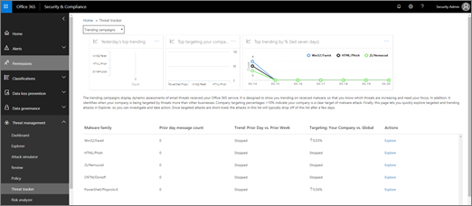
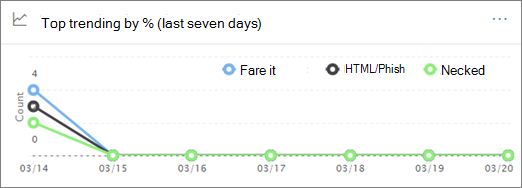
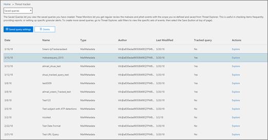
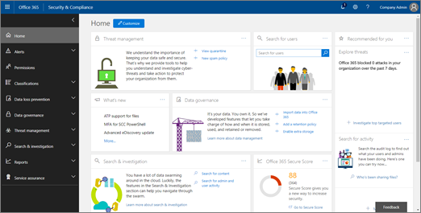

# Hot-Spårare-nya och intressantaThreat Trackers - New and Noteworthy

[!INCLUDE [Microsoft 365 Defender rebranding](../includes/microsoft-defender-for-office.md)]

[Office 365 hot undersökningar och svars](office-365-ti.md) funktioner gör att organisationens säkerhets team kan upptäcka och vidta åtgärder mot Cybersecurity hot.[Office 365 Threat Investigation and Response](office-365-ti.md) capabilities enable your organization's security team to discover and take action against cybersecurity threats. Office 365 hot undersökningar och svars funktioner innehåller funktioner för Threat Spårare, inklusive intressanta spårare.Office 365 Threat Investigation and Response capabilities include Threat Tracker features, including Noteworthy trackers. Läs den här artikeln för att få en översikt över de här nya funktionerna och nästa steg.Read this article to get an overview of these new features and next steps. 

> [!IMPORTANT]
> Office 365 Threat Intelligence är nu Office 365-skydds plan 2 för avancerade hot och skydds funktioner.Office 365 Threat Intelligence is now Office 365 Advanced Threat Protection Plan 2, along with additional threat protection capabilities. Mer information finns i [Office 365-abonnemang och priser](https://products.office.com/exchange/advance-threat-protection) för avancerat skydd för office [-365](https://docs.microsoft.com/office365/servicedescriptions/office-365-advanced-threat-protection-service-description)To learn more, see [Office 365 Advanced Threat Protection plans and pricing](https://products.office.com/exchange/advance-threat-protection) and the [Office 365 Advanced Threat Protection Service Description](https://docs.microsoft.com/office365/servicedescriptions/office-365-advanced-threat-protection-service-description).
  
## Vad är Threat-Spårare?What are Threat Trackers?

Threat-spårare är en informativ widget och vyer som ger dig information om olika Cybersecurity problem som kan påverka ditt företag.Threat Trackers are informative widgets and views that provide you with intelligence on different cybersecurity issues that might impact your company. Du kan till exempel Visa information om hur du trendar kampanjer med skadlig program vara med hot spårare.For example, you can view information about trending malware campaigns using Threat Trackers.
  

  
De flesta Spårare-sidor innehåller trend nummer som uppdateras regelbundet, widgetar som hjälper dig att förstå vilka problem som är viktigast eller har blivit mest och en snabb länk i kolumnen **åtgärder** som tar dig till Utforskaren där du kan visa mer detaljerad information.Most tracker pages include trending numbers that are updated periodically, widgets to help you understand which issues are the biggest or have grown the most, and a quick link in the **Actions** column that takes you to Explorer, where you can view more detailed information. 
  

  
Spårare är bara några av de många fantastiska funktioner som du får med [Office 365 Avancerat skydds abonnemang 2](office-365-ti.md).Trackers are just a few of the many great features you get with [Office 365 Advanced Threat Protection Plan 2](office-365-ti.md). Threat-Spårare inkluderar [Noteworth-Spårare](#noteworthy-trackers), [trender för Spårare](#trending-trackers), [spårade frågor](#tracked-queries)och [sparade frågor](#saved-queries).Threat Trackers include [Noteworth trackers](#noteworthy-trackers), [Trending trackers](#trending-trackers), [Tracked queries](#tracked-queries), and [Saved queries](#saved-queries).
  
Om du vill visa och använda dina Threat-Spårare för organisationen går du till säkerhets &amp; kontroll Center ( [https://protection.office.com](https://protection.office.com) ) och väljer hot **Management** \> **Threat-Spårare**.To view and use your Threat Trackers for your organization, go to the Security &amp; Compliance Center ([https://protection.office.com](https://protection.office.com)) and choose **Threat management** \> **Threat tracker**.
  
> [!NOTE]
> För att använda Threat-Spårare måste du vara global administratör, säkerhets administratör eller säkerhets läsare.To use Threat Trackers, you must be a global administrator, security administrator, or security reader. Se [behörigheter i säkerhetsrelaterade &amp; Center](permissions-in-the-security-and-compliance-center.md).See [Permissions in the Security &amp; Compliance Center](permissions-in-the-security-and-compliance-center.md). 
  
### Intressanta SpårareNoteworthy trackers

Viktiga spårare är där du kan hitta stora och mindre hot och risker som vi tror att du bör känna till.Noteworthy trackers are where you'll find big and smaller threats and risks that we think you should know about. Viktiga Spårare hjälper dig att hitta om de här problemen finns i Microsoft 365-miljön, plus länka till artiklar (som den här) som ger dig mer information om vad som händer och hur de påverkar organisationens användning av Office 365.Noteworthy trackers help you find whether these issues exist in your Microsoft 365 environment, plus link to articles (like this one) that give you more details on what is happening, and how they'll impact your organization's use of Office 365. Vare sig det är ett stort nytt hot (till exempel Wannacry, Petya) eller ett befintligt hot som kan skapa vissa nya utmaningar (till exempel vår andra Inaugural-Nemucod), är det här du hittar viktiga nya saker och att din säkerhets grupp bör granska och granska och undersöka dem regelbundet.Whether it's a big new threat (e.g. Wannacry, Petya) or an existing threat that might create some new challenges (like our other inaugural Noteworthy item - Nemucod), this is where you'll find important new items you and your security team should review and examine periodically.
  
Intressanta Spårare kommer att publiceras för bara några veckor när vi identifierar nya hot och tror att du kan behöva den extra synbarheten som den här funktionen erbjuder.Typically Noteworthy trackers will be posted for just a couple of weeks when we identify new threats and think you might need the extra visibility that this feature provides. När den största risken för ett hot har passerat tar vi bort det postintressanta objektet.Once the biggest risk for a threat has passed, we'll remove that Noteworthy item. På så sätt kan vi hålla listan färska och uppdaterade med andra relevanta objekt.This way, we can keep the list fresh and up to date with other relevant new items.
  
### TrenderTrending trackers

Trender för Spårare (tidigare kallade kampanjer) Markera nya hot som tagits emot i organisationens e-postadress under den senaste veckan.Trending trackers (formerly called Campaigns) highlight new threats received in your organization's email in the past week.
  

  
Att hålla Spårare ger dig en uppfattning om nya hot du bör undersöka för att se till att din bredare företags miljö förbereds mot attacker.Trending trackers give you an idea of new threats you should review to ensure your broader corporate environment is prepared against attacks.
  
### Spårade frågorTracked queries

Med spårade frågor kan du använda dina sparade frågor för att regelbundet utvärdera Microsoft 365-aktiviteter i din organisation.Tracked queries leverage your saved queries to periodically assess Microsoft 365 activity in your organization. Det ger dig evenemangs trender, med mer att komma under de kommande månaderna.This gives you event trending, with more to come in the coming months. Spårade frågor körs automatiskt och du får den senaste informationen utan att behöva komma ihåg att köra frågorna igen.Tracked queries run automatically, giving you up-to-date information without having to remember to re-run your queries.
  

  
### Sparade frågorSaved queries

Sparade frågor finns också i avsnittet spårare.Saved queries are also found in the Trackers section. Du kan använda sparade frågor för att lagra vanliga sökningar i Explorer som du vill gå tillbaka till snabbare och flera gånger, utan att behöva återskapa sökningen varje gång.You can use Saved queries to store the common Explorer searches that you want to get back to quicker and repeatedly, without having to re-create the search every time.
  

  
Du kan alltid spara en fråga eller någon av dina egna Explorer-frågor med hjälp av knappen **Spara fråga** högst upp på sidan Utforskaren.You can always save a Noteworthy tracker query or any of your own Explorer queries using the **Save query** button at the top of the Explorer page. Allting som sparats visas i listan **sparade frågor** på spår-sidan.Anything saved there will show up in the **Saved queries** list on the Tracker page. 
  
## Spårare och UtforskarenTrackers and Explorer

Oavsett om du ska granska e-post, innehåll och Office-aktiviteter (kommer snart) samarbetar Explorer och Spårare tillsammans för att undersöka och spåra säkerhets risker och hot.Whether you're reviewing email, content, or Office activities (coming soon), Explorer and Trackers work together to help you investigate and track security risks and threats. Alla tillsammans ger Spårare information om hur du skyddar användarna genom att markera nya, viktiga och ofta förekommande problem – säkerställer att företaget skyddas bättre när det flyttas till molnet.All together, Trackers provide you with information to protect your users by highlighting new, notable, and frequently searched issues - ensuring your business is better protected as it moves to the cloud.
  
Och kom ihåg att du alltid kan skicka feedback till oss via den här eller andra Microsoft 365-säkerhetsfunktioner genom att klicka på **feedback** -knappen i det nedre högra hörnet i [översikten över säkerhets & Compliance Center](https://support.microsoft.com/office/a5f2fd18-b029-4257-b5a8-ae83e7768c85).And remember that you can always provide us feedback on this or other Microsoft 365 security features by clicking on the **Feedback** button in the lower right corner of the [Overview of the Security & Compliance Center](https://support.microsoft.com/office/a5f2fd18-b029-4257-b5a8-ae83e7768c85).
  

  
## Spårare och Office 365 Avancerat skyddTrackers and Office 365 Advanced Threat Protection

Med vårt Inaugural-språksäkra hot, har vi markerat avancerade hot mot skadlig program vara upptäckta av [Office 365 ATP-Safe Attachments](atp-safe-attachments.md).With our inaugural Noteworthy threat, we're highlighting advanced malware threats detected by [Office 365 ATP Safe Attachments](atp-safe-attachments.md). Om du är Office 365 Enterprise, E5-kund och du inte använder [office 365 Avancerat skydd](office-365-atp.md) (ATP) bör du vara-det ingår i ditt abonnemang.If you're an Office 365 Enterprise E5 customer and you're not using [Office 365 Advanced Threat Protection](office-365-atp.md) (ATP), you should be - it's included in your subscription. ATP ger ett värde även om du har andra säkerhets verktyg filtrerar e-postflöden till dina Office 365-tjänster.ATP provides value even if you have other security tools filtering email flow with your Office 365 services. Anti-spam och [Office 365-Safe Links](atp-safe-links.md) -funktioner fungerar bäst när din primära e-postlösning är via Office 365.However, anti-spam and [Office 365 ATP safe links](atp-safe-links.md) features work best when your main email security solution is through Office 365. 
  

  
I dagens hot – riddled-världen är det bara att använda vanliga sökningar av skadlig program vara som innebär att du inte är tillräckligt väl skyddad mot attacker.In today's threat-riddled world, running only traditional anti-malware scans means you are not protected well enough against attacks. Dagens mer sofistikerade attackerare använder vanliga verktyg för att skapa nya, Obfuscated eller fördröjda attacker som inte känns igen av traditionella antispionprogram.Today's more sophisticated attackers use commonly available tools to create new, obfuscated, or delayed attacks that won't be recognized by traditional signature-based anti-malware engines. Det säkraste alternativet för e-postbilagor tar emot bifogade filer och spränger dem i en virtuell miljö för att avgöra om de är säkra.The ATP Safe Attachments feature takes email attachments and detonates them in a virtual environment to determine whether they're safe or malicious. Denna sprängning öppnar varje fil i en virtuell dator miljö och visar vad som händer när filen har öppnats.This detonation process opens each file in a virtual computer environment, then watches what happens after the file is opened. Om det är en PDF-fil eller ett Office-dokument kan skadlig kod vara dold i en fil och aktive ras bara när den har öppnats på sin dator.Whether it's a PDF, and compressed file, or an Office document, malicious code can be hidden in a file, activating only once the victim opens it on their computer. Genom att spränga och analysera filen i e-postflödet hittar Office 365 ATP-kapaciteterna baserat på beteenden, fil rykte och ett antal heuristik-regler.By detonating and analyzing the file in the email flow, Office 365 ATP capabilities finds these threats based on behaviors, file reputation, and a number of heuristic rules.
  
Det nya filtret för ett nytt hot-hotet markerar objekt som nyligen identifierats via säkra bilagor för ATP.The new Noteworthy threat filter highlights items that were recently detected through ATP Safe Attachments. Dessa identifieringar representerar objekt som är nya skadliga filer, som inte tidigare upptäckts av Microsoft 365 i ditt e-postflöde eller andra kunders e-postmeddelanden.These detections represent items that are new malicious files, not previously found by Microsoft 365 in either your email flow or other customers' email. Lär dig hur du åtgärdar objekten i den aktuella hotets Spårare, se vem som var riktade till dem och granska detaljerna för Sprängaren på fliken Avancerad analys (som du hittar genom att klicka på e-postmeddelandets ämne i Utforskaren).Pay attention to the items in the Noteworthy Threat Tracker, see who was targeted by them, and review the detonation details shown on the Advanced Analysis tab (found by clicking on the subject of the email in Explorer). Obs! du hittar bara den här fliken i e-postmeddelanden som upptäckts med den aktuella bilage funktionen för ATP – den här observerade spårningen inkluderar filtret, men du kan även använda filtret för andra sökningar i Utforskaren.Note you'll only find this tab on emails detected by the ATP Safe Attachments capability - this Noteworthy tracker includes that filter, but you can also use that filter for other searches in Explorer.
  
## Nästa stegNext steps

- Om din organisation inte redan har de här Office 365 Threat-undersöknings-och svars funktionerna kan [du läsa hur du får svar på office 365 om hot-undersökningar och-reaktioner?](office-365-ti.md).If your organization doesn't already have these Office 365 Threat Investigation and Response capabilities, see [How do we get Office 365 Threat Investigation and Response capabilities?](office-365-ti.md).
    
- Kontrol lera att din säkerhets grupp har rätt roller och behörigheter tilldelade.Make sure that your security team has the correct roles and permissions assigned. Du måste vara global administratör eller ha rollen säkerhets administratör eller sökning och rensning som är tilldelad i &amp; Säkerhetscenter.You must be a global administrator, or have the Security Administrator or Search and Purge role assigned in the Security &amp; Compliance Center. Se [behörigheter i säkerhetsrelaterade &amp; Center](permissions-in-the-security-and-compliance-center.md).See [Permissions in the Security &amp; Compliance Center](permissions-in-the-security-and-compliance-center.md).
    
- Titta efter de nya spårningarna som visas i din Microsoft 365-miljö.Watch for the new Trackers to show up in your Microsoft 365 environment. När det är tillgängligt hittar du dina Spårare [här](https://protection.office.com/).When available, you'll find your Trackers [here](https://protection.office.com/). Gå till hot **Management** \> **Threat-Spårare**.Go to **Threat management** \> **Threat trackers**.
    
- Om du inte redan har gjort det kan du läsa mer om och konfigurera [office 365 Avancerat skydd](office-365-atp.md) för din organisation, inklusive [Office 365 ATP-säkra länkar](atp-safe-links.md) och [Office 365 ATP-säkra bifogade filer](atp-safe-attachments.md).If you haven't already done so, learn more about and configure [Office 365 Advanced Threat Protection](office-365-atp.md) for your organization, including [Office 365 ATP safe links](atp-safe-links.md) and [Office 365 ATP Safe Attachments](atp-safe-attachments.md).
  

