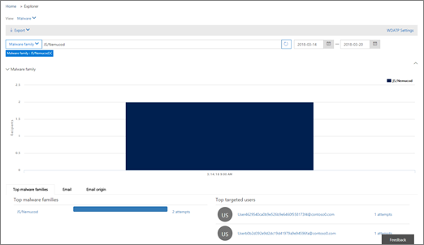
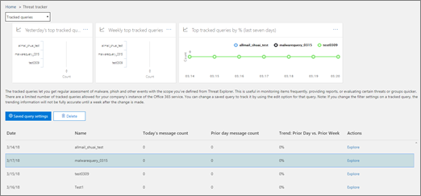

# Hot-Spårare-nya och intressanta

[!INCLUDE [Microsoft 365 Defender rebranding](../includes/microsoft-defender-for-office.md)]

[Office 365 hot undersökningar och svars](office-365-ti.md) funktioner gör att organisationens säkerhets team kan upptäcka och vidta åtgärder mot Cybersecurity hot. Office 365 hot undersökningar och svars funktioner innehåller funktioner för Threat Spårare, inklusive intressanta spårare. Läs den här artikeln för att få en översikt över de här nya funktionerna och nästa steg. 

> [!IMPORTANT]
> Office 365 Threat Intelligence är nu Office 365-skydds plan 2 för avancerade hot och skydds funktioner. Mer information finns i [Office 365-abonnemang och priser](https://products.office.com/exchange/advance-threat-protection) för avancerat skydd för office [-365](https://docs.microsoft.com/office365/servicedescriptions/office-365-advanced-threat-protection-service-description)
  
## Vad är Threat-Spårare?

Threat-spårare är en informativ widget och vyer som ger dig information om olika Cybersecurity problem som kan påverka ditt företag. Du kan till exempel Visa information om hur du trendar kampanjer med skadlig program vara med hot spårare.
  

  
De flesta Spårare-sidor innehåller trend nummer som uppdateras regelbundet, widgetar som hjälper dig att förstå vilka problem som är viktigast eller har blivit mest och en snabb länk i kolumnen **åtgärder** som tar dig till Utforskaren där du kan visa mer detaljerad information. 
  

  
Spårare är bara några av de många fantastiska funktioner som du får med [Office 365 Avancerat skydds abonnemang 2](office-365-ti.md). Threat-Spårare inkluderar [Noteworth-Spårare](#noteworthy-trackers), [trender för Spårare](#trending-trackers), [spårade frågor](#tracked-queries)och [sparade frågor](#saved-queries).
  
Om du vill visa och använda dina Threat-Spårare för organisationen går du till säkerhets &amp; kontroll Center ( [https://protection.office.com](https://protection.office.com) ) och väljer hot **Management** \> **Threat-Spårare**.
  
> [!NOTE]
> För att använda Threat-Spårare måste du vara global administratör, säkerhets administratör eller säkerhets läsare. Se [behörigheter i säkerhetsrelaterade &amp; Center](permissions-in-the-security-and-compliance-center.md). 
  
### Intressanta Spårare

Viktiga spårare är där du kan hitta stora och mindre hot och risker som vi tror att du bör känna till. Viktiga Spårare hjälper dig att hitta om de här problemen finns i Microsoft 365-miljön, plus länka till artiklar (som den här) som ger dig mer information om vad som händer och hur de påverkar organisationens användning av Office 365. Vare sig det är ett stort nytt hot (till exempel Wannacry, Petya) eller ett befintligt hot som kan skapa vissa nya utmaningar (till exempel vår andra Inaugural-Nemucod), är det här du hittar viktiga nya saker och att din säkerhets grupp bör granska och granska och undersöka dem regelbundet.
  
Intressanta Spårare kommer att publiceras för bara några veckor när vi identifierar nya hot och tror att du kan behöva den extra synbarheten som den här funktionen erbjuder. När den största risken för ett hot har passerat tar vi bort det postintressanta objektet. På så sätt kan vi hålla listan färska och uppdaterade med andra relevanta objekt.
  
### Trender

Trender för Spårare (tidigare kallade kampanjer) Markera nya hot som tagits emot i organisationens e-postadress under den senaste veckan.
  

  
Att hålla Spårare ger dig en uppfattning om nya hot du bör undersöka för att se till att din bredare företags miljö förbereds mot attacker.
  
### Spårade frågor

Med spårade frågor kan du använda dina sparade frågor för att regelbundet utvärdera Microsoft 365-aktiviteter i din organisation. Det ger dig evenemangs trender, med mer att komma under de kommande månaderna. Spårade frågor körs automatiskt och du får den senaste informationen utan att behöva komma ihåg att köra frågorna igen.
  

  
### Sparade frågor

Sparade frågor finns också i avsnittet spårare. Du kan använda sparade frågor för att lagra vanliga sökningar i Explorer som du vill gå tillbaka till snabbare och flera gånger, utan att behöva återskapa sökningen varje gång.
  

  
Du kan alltid spara en fråga eller någon av dina egna Explorer-frågor med hjälp av knappen **Spara fråga** högst upp på sidan Utforskaren. Allting som sparats visas i listan **sparade frågor** på spår-sidan. 
  
## Spårare och Utforskaren

Oavsett om du ska granska e-post, innehåll och Office-aktiviteter (kommer snart) samarbetar Explorer och Spårare tillsammans för att undersöka och spåra säkerhets risker och hot. Alla tillsammans ger Spårare information om hur du skyddar användarna genom att markera nya, viktiga och ofta förekommande problem – säkerställer att företaget skyddas bättre när det flyttas till molnet.
  
Och kom ihåg att du alltid kan skicka feedback till oss via den här eller andra Microsoft 365-säkerhetsfunktioner genom att klicka på **feedback** -knappen i det nedre högra hörnet i [översikten över säkerhets & Compliance Center](https://support.microsoft.com/office/a5f2fd18-b029-4257-b5a8-ae83e7768c85).
  

  
## Spårare och Office 365 Avancerat skydd

Med vårt Inaugural-språksäkra hot, har vi markerat avancerade hot mot skadlig program vara upptäckta av [Office 365 ATP-Safe Attachments](atp-safe-attachments.md). Om du är Office 365 Enterprise, E5-kund och du inte använder [office 365 Avancerat skydd](office-365-atp.md) (ATP) bör du vara-det ingår i ditt abonnemang. ATP ger ett värde även om du har andra säkerhets verktyg filtrerar e-postflöden till dina Office 365-tjänster. Anti-spam och [Office 365-Safe Links](atp-safe-links.md) -funktioner fungerar bäst när din primära e-postlösning är via Office 365. 
  

  
I dagens hot – riddled-världen är det bara att använda vanliga sökningar av skadlig program vara som innebär att du inte är tillräckligt väl skyddad mot attacker. Dagens mer sofistikerade attackerare använder vanliga verktyg för att skapa nya, Obfuscated eller fördröjda attacker som inte känns igen av traditionella antispionprogram. Det säkraste alternativet för e-postbilagor tar emot bifogade filer och spränger dem i en virtuell miljö för att avgöra om de är säkra. Denna sprängning öppnar varje fil i en virtuell dator miljö och visar vad som händer när filen har öppnats. Om det är en PDF-fil eller ett Office-dokument kan skadlig kod vara dold i en fil och aktive ras bara när den har öppnats på sin dator. Genom att spränga och analysera filen i e-postflödet hittar Office 365 ATP-kapaciteterna baserat på beteenden, fil rykte och ett antal heuristik-regler.
  
Det nya filtret för ett nytt hot-hotet markerar objekt som nyligen identifierats via säkra bilagor för ATP. Dessa identifieringar representerar objekt som är nya skadliga filer, som inte tidigare upptäckts av Microsoft 365 i ditt e-postflöde eller andra kunders e-postmeddelanden. Lär dig hur du åtgärdar objekten i den aktuella hotets Spårare, se vem som var riktade till dem och granska detaljerna för Sprängaren på fliken Avancerad analys (som du hittar genom att klicka på e-postmeddelandets ämne i Utforskaren). Obs! du hittar bara den här fliken i e-postmeddelanden som upptäckts med den aktuella bilage funktionen för ATP – den här observerade spårningen inkluderar filtret, men du kan även använda filtret för andra sökningar i Utforskaren.
  
## Nästa steg

- Om din organisation inte redan har de här Office 365 Threat-undersöknings-och svars funktionerna kan [du läsa hur du får svar på office 365 om hot-undersökningar och-reaktioner?](office-365-ti.md).
    
- Kontrol lera att din säkerhets grupp har rätt roller och behörigheter tilldelade. Du måste vara global administratör eller ha rollen säkerhets administratör eller sökning och rensning som är tilldelad i &amp; Säkerhetscenter. Se [behörigheter i säkerhetsrelaterade &amp; Center](permissions-in-the-security-and-compliance-center.md).
    
- Titta efter de nya spårningarna som visas i din Microsoft 365-miljö. När det är tillgängligt hittar du dina Spårare [här](https://protection.office.com/). Gå till hot **Management** \> **Threat-Spårare**.
    
- Om du inte redan har gjort det kan du läsa mer om och konfigurera [office 365 Avancerat skydd](office-365-atp.md) för din organisation, inklusive [Office 365 ATP-säkra länkar](atp-safe-links.md) och [Office 365 ATP-säkra bifogade filer](atp-safe-attachments.md).
  

