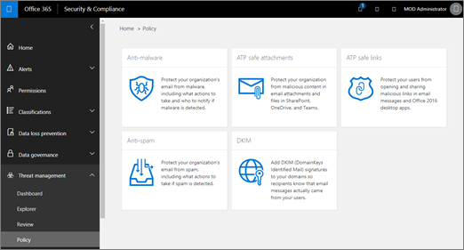

# Aktivera ATP för SharePoint, OneDrive och Microsoft TeamsTurn on ATP for SharePoint, OneDrive, and Microsoft Teams

[!INCLUDE [Microsoft 365 Defender rebranding](../includes/microsoft-defender-for-office.md)]

> [!IMPORTANT]
> Den här artikeln är avsedd för företagskunder som har [Office 365 Avancerat skydd](office-365-atp.md).This article is intended for business customers who have [Office 365 Advanced Threat Protection](office-365-atp.md). Om du är hem användare letar efter information om säkra länkar i Outlook kan du läsa mer i [avancerad Outlook.com säkerhet](https://support.microsoft.com/office/882d2243-eab9-4545-a58a-b36fee4a46e2).If you are a home user looking for information about Safe Links in Outlook, see [Advanced Outlook.com security](https://support.microsoft.com/office/882d2243-eab9-4545-a58a-b36fee4a46e2).

[Office 365 ATP för SharePoint, OneDrive och Microsoft Teams](atp-for-spo-odb-and-teams.md) skyddar din organisation från oavsiktlig delning av skadliga filer.[Office 365 ATP for SharePoint, OneDrive, and Microsoft Teams](atp-for-spo-odb-and-teams.md) protects your organization from inadvertently sharing malicious files. När en skadlig fil identifieras blockeras den så att ingen kan öppna, kopiera, flytta eller dela den innan ytterligare åtgärder vidtas av organisationens säkerhets team.When a malicious file is detected, that file is blocked so that no one can open, copy, move, or share it until further actions are taken by the organization's security team. Läs den här artikeln om du vill aktivera ATP för SharePoint, OneDrive och Teams, konfigurera aviseringar om du vill få meddelanden om identifierade filer och ta nästa steg.Read this article to turn on ATP for SharePoint, OneDrive, and Teams, set up alerts to be notified about detected files, and take your next steps.

Om du vill definiera (eller redigera) ATP-principer måste du ha en lämplig roll.To define (or edit) ATP policies, you must be assigned an appropriate role. Några exempel beskrivs i följande tabell:Some examples are described in the following table:

****

|RollRole|Där/hur kopplatWhere/how assigned|
|---|---|
|global administratörglobal administrator|Den person som registrerar sig för att köpa Microsoft 365 är en global administratör som standard.The person who signs up to buy Microsoft 365 is a global admin by default. (Mer information finns i [om administratörs roller i Microsoft 365](https://docs.microsoft.com/microsoft-365/admin/add-users/about-admin-roles) .)(See [About Microsoft 365 admin roles](https://docs.microsoft.com/microsoft-365/admin/add-users/about-admin-roles) to learn more.)|
|Säkerhets administratörSecurity Administrator|Azure Active Directory-administratörs Center ( [https://aad.portal.azure.com](https://aad.portal.azure.com) )Azure Active Directory admin center ([https://aad.portal.azure.com](https://aad.portal.azure.com))|
|Organisations hantering i Exchange OnlineExchange Online Organization Management|Administrations Center för Exchange ( [https://outlook.office365.com/ecp](https://outlook.office365.com/ecp) )Exchange admin center ([https://outlook.office365.com/ecp](https://outlook.office365.com/ecp))  elleror    PowerShell-cmdletar (se [Exchange Online PowerShell](https://docs.microsoft.com/powershell/exchange/exchange-online-powershell))PowerShell cmdlets (See [Exchange Online PowerShell](https://docs.microsoft.com/powershell/exchange/exchange-online-powershell))|
|

## Aktivera ATP för SharePoint, OneDrive och Microsoft TeamsTurn on ATP for SharePoint, OneDrive, and Microsoft Teams

[!INCLUDE [Microsoft 365 Defender rebranding](../includes/microsoft-defender-for-office.md)]

**Innan du påbörjar den här proceduren bör du kontrol lera att gransknings loggning redan är aktiverat för din Microsoft 365-miljö**.**Before you begin this procedure, make sure that audit logging is already turned on for your Microsoft 365 environment**. Det gör du vanligt vis av någon som har rollen gransknings loggar som tilldelats i Exchange Online.This is typically done by someone who has the Audit Logs role assigned in Exchange Online. Mer information finns i [Aktivera eller inaktivera gransknings loggs ökning](../../compliance/turn-audit-log-search-on-or-off.md).For more information, see [Turn audit log search on or off](../../compliance/turn-audit-log-search-on-or-off.md).

1. Gå till <https://protection.office.com> och logga in med ditt arbets-eller skol konto.Go to <https://protection.office.com>, and sign in with your work or school account.

2. I det vänstra navigerings **fältet under säkerhets**& Compliance Center väljer du **policy** \> **Safe Attachments**.In the Security & Compliance Center, in the left navigation pane, under **Threat management**, choose **Policy** \> **Safe Attachments**.

   

3. Välj **Aktivera ATP för SharePoint, OneDrive och Microsoft Teams**.Select **Turn on ATP for SharePoint, OneDrive, and Microsoft Teams**.

   

4. Klicka på **Spara**.Click **Save**.

5. Granska (och, om tillämpligt, redigera) organisationens principer för [säkert bifogade filer](set-up-atp-safe-attachments-policies.md) och [säkra länkar](set-up-atp-safe-links-policies.md).Review (and, as appropriate, edit) your organization's [Safe Attachments policies](set-up-atp-safe-attachments-policies.md) and [Safe Links policies](set-up-atp-safe-links-policies.md).

6. Lämpligt Som global administratör eller SharePoint Online-administratör kör du cmdleten **[Set-SPOTenant](https://docs.microsoft.com/powershell/module/sharepoint-online/Set-SPOTenant)** med parametern _DisallowInfectedFileDownload_ angiven till *True*.(Recommended) As a global administrator or a SharePoint Online administrator, run the **[Set-SPOTenant](https://docs.microsoft.com/powershell/module/sharepoint-online/Set-SPOTenant)** cmdlet with the _DisallowInfectedFileDownload_ parameter set to *true*.

   - Om du anger parametern till *True* blockeras alla åtgärder (förutom borttagning) för identifierade filer.Setting the parameter to *true* blocks all actions (except Delete) for detected files. Personer kan inte öppna, flytta, kopiera eller dela identifierade filer.People cannot open, move, copy, or share detected files.

   - Om du anger parametern till *falskt* blockeras alla åtgärder förutom Delete och nedladdning.Setting the parameter to *false* blocks all actions except Delete and Download. Andra kan välja att acceptera risken och hämta en identifierad fil.People can choose to accept the risk and download a detected file.

7. Tillåt upp till 30 minuter för att ändringarna ska spridas till alla Microsoft 365-datacenter.Allow up to 30 minutes for your changes to spread to all Microsoft 365 datacenters.

8. Lämpligt Fortsätt med att konfigurera aviseringar för identifierade filer.(Recommended) Proceed to set up alerts for detected files.

Mer information om hur du använder PowerShell med Microsoft 365 finns i [Hantera Microsoft 365 med PowerShell](https://docs.microsoft.com/microsoft-365/enterprise/manage-microsoft-365-with-microsoft-365-powershell).To learn more about using PowerShell with Microsoft 365, see [Manage Microsoft 365 with PowerShell](https://docs.microsoft.com/microsoft-365/enterprise/manage-microsoft-365-with-microsoft-365-powershell).

Om du vill veta mer om användar upplevelsen när en fil har identifierats som skadlig, se [vad du kan göra när en skadlig fil finns i SharePoint Online, OneDrive eller Microsoft Teams](https://support.microsoft.com/office/01e902ad-a903-4e0f-b093-1e1ac0c37ad2).To learn more about the user experience when a file has been detected as malicious, see [What to do when a malicious file is found in SharePoint Online, OneDrive, or Microsoft Teams](https://support.microsoft.com/office/01e902ad-a903-4e0f-b093-1e1ac0c37ad2).

## Konfigurera aviseringar för identifierade filerSet up alerts for detected files

Om du vill få aviseringar när en fil i SharePoint Online, OneDrive för företag eller Microsoft Teams har identifierats som skadlig kan du ställa in en avisering.To receive notification when a file in SharePoint Online, OneDrive for Business, or Microsoft Teams has been identified as malicious, you can set up an alert.

1. I fönstret [säkerhets & efterlevnad](https://protection.office.com)väljer du **aviseringar** \> **Hantera aviseringar**.In the [Security & Compliance Center](https://protection.office.com), choose **Alerts** \> **Manage alerts**.

2. Välj **ny aviserings princip**.Choose **New alert policy**.

3. Ange ett namn för aviseringen.Specify a name for the alert. Du kan till exempel skriva in skadliga filer i bibliotek.For example, you could type Malicious Files in Libraries.

4. Ange en beskrivning av aviseringen.Type a description for the alert. Du kan till exempel skriva meddelanden administratörer när skadliga filer upptäcks i SharePoint Online, OneDrive eller Microsoft Teams.For example, you could type Notifies admins when malicious files are detected in SharePoint Online, OneDrive, or Microsoft Teams.

5. Gör följande i avsnittet **Skicka aviseringen när...** :In the **Send this alert when...** section, do the following:

   a.a. Välj **upptäckt skadlig kod i filen**i listan **aktiviteter** .In the **Activities** list, choose **Detected malware in file**.

   b.b. Lämna fältet **användare** tomma.Leave the **Users** field empty.

6. I avsnittet **Skicka aviseringen till... väljer du** en eller flera globala administratörer, säkerhets administratörer eller säkerhets läsare som ska få avisering när en skadlig fil identifieras.In the **Send this alert to...** section, select one or more global administrators, security administrators, or security readers who should receive notification when a malicious file is detected.

7. Klicka på **Spara**.Click **Save**.

Om du vill veta mer om aviseringar läser [du skapa aktivitets aviseringar i avsnittet säkerhets & efterlevnad](../../compliance/create-activity-alerts.md).To learn more about alerts, see [Create activity alerts in the Security & Compliance Center](../../compliance/create-activity-alerts.md).

## Nästa stegNext steps

1. [Visa information om skadliga filer som identifieras i SharePoint, OneDrive eller Microsoft TeamsView information about malicious files detected in SharePoint, OneDrive, or Microsoft Teams](malicious-files-detected-in-spo-odb-or-teams.md)

2. [Hantera meddelanden och filer i karantän som administratör i Microsoft 365Manage quarantined messages and files as an administrator in Microsoft 365](manage-quarantined-messages-and-files.md)
