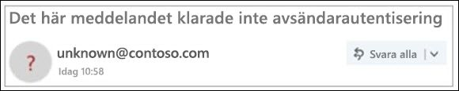

# Overifierad avsändare

> [!NOTE]
> Dessa uppdateringar distribueras nu och kanske inte är tillgängliga för alla användare. Den här funktionen stöds för enterprise Outlook.com- och Enterprise Outlook Win32-användare. Den är för närvarande inte tillgänglig för office 365-användare för konsumenter.

För att förhindra att nätfiskemeddelanden når din postlåda verifierar Office 365 att avsändarna är de som de säger att de är och markerar misstänkta meddelanden som skräppost.

> [!IMPORTANT]
> När ett meddelande markeras som ett nätfiskebedrägeri visas en varning högst upp på sidan, men alla länkar i meddelandet kan fortfarande öppnas.

## Hur kan jag identifiera ett misstänkt meddelande i inkorgen?

Outlook visar indikatorer när avsändaren av ett meddelande antingen inte kan identifieras eller deras identitet skiljer sig från vad du ser i från-adressen.

## Du ser en "?"i avsänaren bilden

När Office 365 inte kan verifiera avsändarens identitet med hjälp av e-postautentiseringstekniker visas en '?"?

Alla meddelanden som inte autentiserar är inte skadliga. Du bör dock vara försiktig med att interagera med meddelanden som inte autentiserar om du inte känner igen avsändaren. Eller, om du känner igen en avsändare som normalt inte har en "?"i avsändaren bilden, men du plötsligt börjar se det, som kan vara ett tecken avsändaren är förfalskad.

## Så här hanterar du vilka meddelanden som får den overifierade avsändaren 

Om du är Office 365-kund kan du hantera den här funktionen via Office 365 Security & Compliance Center.

- I Security & Compliance Center kan globala administratörer eller säkerhetsadministratörer aktivera eller inaktivera funktionen genom skydd mot förfalskning enligt anti-Phish-principen. Dessutom kan du använda cmdleten **Set-AntiPhishPolicy** i Exchange Online PowerShell. Mer information finns [i Skydd mot nätfiske i Office 365](anti-phishing-protection.md) och [Set-AntiPhishPolicy](https://docs.microsoft.com/powershell/module/exchange/set-antiphishpolicy).

    

- Om en administratör har identifierat ett falskt positivt och en avsändare inte ska få den overifierade avsändaren behandling, kan en av följande åtgärder vidtas för att lägga till avsändaren till Spoof Intelligence parodi tillåta lista:

  - Lägg till domänparet via Spoof Intelligence Insight. Mer information finns i [Genomgång: spoof intelligence insight](walkthrough-spoof-intelligence-insight.md).

  - Lägg till domänparet via cmdleten **Set-PhishFilterPolicy** i Exchange Online PowerShell. Mer information finns i [Ange-PhishFilterPolicy](https://docs.microsoft.com/powershell/module/exchange/set-phishfilterpolicy) och [Konfigurera Office 365 ATP-principer för nätfiske och nätfiske.](set-up-anti-phishing-policies.md)

Dessutom tillämpar vi inte den overifierade avsändaren om meddelandet levererades till Inkorgen via regler för e-postflöde (kallas även transportregler) eller safe domain list (policyer mot skräppost).

## Hur man hanterar "via"-taggen 

Om du är Office 365-kund kan du hantera den här funktionen via Office 365 Security & Compliance Center, på samma sätt som du hanterar den overifierade avsändande behandlingen. Om du lägger till avsändaren i spoof Intelligence spoof tillåta lista, kommer "via" behandling inte tillämpas.

## Vanliga frågor och svar

### Vilka kriterier använder Outlook.com och Outlook Win32-skrivbordet för att lägga till egenskaperna "?" och "via"?

För avsändarens avsändare: Outlook.com kräver att meddelandet skickar antingen SPF- eller DKIM-autentisering och tar emot antingen ett dmarc-pass eller ett sammansatt autentiseringspass från Office 365 Spoof Intelligence. Mer information finns [i Konfigurera SPF i Office 365 för att förhindra förfalskning](set-up-spf-in-office-365-to-help-prevent-spoofing.md) och användning av [DKIM för att validera utgående e-post som skickas från din anpassade domän i Office 365](use-dkim-to-validate-outbound-email.md).

För via-taggen: Om domänen i från-adressen skiljer sig från domänen i DKIM-signaturen eller SMTP-MAIL FRÅN visas Outlook.com domänen i ett av dessa två fält (föredrar DKIM-signaturen).

### Hur tar jag bort "?"?

För avsändaren '?' i avsändaren: Som avsändare bör du autentisera meddelandet med antingen SPF eller DKIM.

För via-taggen: Som avsändare bör du se till att antingen domänen i DKIM-signaturen eller SMTP MAIL FROM är samma som, eller är en underdomän för, domänen i Från-adressen.

### Visar Outlook.com och Outlook Win32-skrivbordet detta för varje meddelande som inte skickar autentisering?

Inte nödvändigtvis. Office 365 kan ha andra egenskaper i meddelandet för att autentisera avsändaren.

## Relaterade ämnen

[Skydda ditt Outlook.com e-postkonto](https://support.microsoft.com/en-us/office/help-protect-your-outlook-com-email-account-a4f20fc5-4307-4ece-8231-6d4d4bd8a9ba)

[Hantera nätfiske eller förfalskning i Outlook.com](https://support.office.com/article/0d882ea5-eedc-4bed-aebc-079ffa1105a3)

[Filtrera skräppost och skräppost i Outlook på webben](https://support.office.com/article/db786e79-54e2-40cc-904f-d89d57b7f41d)
