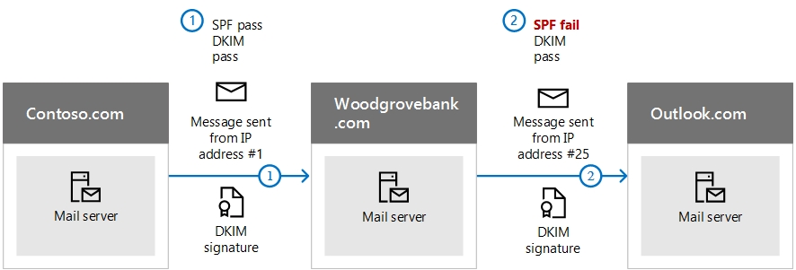

# <a name="use-dkim-to-validate-outbound-email-sent-from-your-custom-domain"></a><span data-ttu-id="beea9-103">Använda DKIM för att validera utgående e-post som skickas från din anpassade domän</span><span class="sxs-lookup"><span data-stu-id="beea9-103">Use DKIM to validate outbound email sent from your custom domain</span></span>

 <span data-ttu-id="beea9-104">**Sammanfattning:** I den här artikeln beskrivs hur du använder DomainKeys Identified Mail (DKIM) med Microsoft 365 för att säkerställa att mål-e-postsystemen litar på utgående meddelanden som skickas från din anpassade domän.</span><span class="sxs-lookup"><span data-stu-id="beea9-104">**Summary:** This article describes how you use DomainKeys Identified Mail (DKIM) with Microsoft 365 to ensure that destination email systems trust messages sent outbound from your custom domain.</span></span>

<span data-ttu-id="beea9-105">Du bör använda DKIM tillsammans med SPF och DMARC för att förhindra att förfalskare skickar meddelanden som ser ut som att de kommer från din domän.</span><span class="sxs-lookup"><span data-stu-id="beea9-105">You should use DKIM in addition to SPF and DMARC to help prevent spoofers from sending messages that look like they are coming from your domain.</span></span> <span data-ttu-id="beea9-106">Med DKIM kan du lägga till en digital signatur i utgående e-postmeddelanden i meddelandehuvudet.</span><span class="sxs-lookup"><span data-stu-id="beea9-106">DKIM lets you add a digital signature to outbound email messages in the message header.</span></span> <span data-ttu-id="beea9-107">Det kan vara komplicerat, men det är det faktiskt inte.</span><span class="sxs-lookup"><span data-stu-id="beea9-107">It may sound complicated, but it's really not.</span></span> <span data-ttu-id="beea9-108">När du konfigurerar DKIM verifierar du att din domän ska kopplas till ett e-postmeddelande med hjälp av krypterad autentisering.</span><span class="sxs-lookup"><span data-stu-id="beea9-108">When you configure DKIM, you authorize your domain to associate, or sign, its name to an email message by using cryptographic authentication.</span></span> <span data-ttu-id="beea9-109">E-postsystem som får e-post från din domän använder denna digitala signatur för att fastställa om inkommande e-post som tas emot är legitim.</span><span class="sxs-lookup"><span data-stu-id="beea9-109">Email systems that receive email from your domain can use this digital signature to help determine if incoming email that they receive is legitimate.</span></span>

<span data-ttu-id="beea9-110">I stort sett använder du en privat nyckel för att kryptera huvudet i domänens utgående e-post.</span><span class="sxs-lookup"><span data-stu-id="beea9-110">Basically, you use a private key to encrypt the header in your domain's outgoing email.</span></span> <span data-ttu-id="beea9-111">Du publicerar en offentlig nyckel i din domäns DNS-poster som tar emot servrar som sedan kan användas för att avkoda signaturen.</span><span class="sxs-lookup"><span data-stu-id="beea9-111">You publish a public key to your domain's DNS records that receiving servers can then use to decode the signature.</span></span> <span data-ttu-id="beea9-112">De använder en offentlig nyckel för att kontrollera att de verkligen kommer från dig och att de inte kommer från någon som *förfalskar* din domän.</span><span class="sxs-lookup"><span data-stu-id="beea9-112">They use the public key to verify that the messages are really coming from you and not coming from someone *spoofing* your domain.</span></span>

<span data-ttu-id="beea9-113">Microsoft 365 konfigurerar automatiskt DKIM för dess ursprungliga ”onmicrosoft.com”-domäner.</span><span class="sxs-lookup"><span data-stu-id="beea9-113">Microsoft 365 automatically sets up DKIM for its initial 'onmicrosoft.com' domains.</span></span> <span data-ttu-id="beea9-114">Det innebär att du inte behöver göra något för att konfigurera DKIM för alla inledande domännamn (t. ex. litware.onmicrosoft.com).</span><span class="sxs-lookup"><span data-stu-id="beea9-114">That means you don't need to do anything to set up DKIM for any initial domain names (for example, litware.onmicrosoft.com).</span></span> <span data-ttu-id="beea9-115">Mer information om domäner finns i [Vanliga frågor och svar om domäner](https://docs.microsoft.com/microsoft-365/admin/setup/domains-faq#why-do-i-have-an-onmicrosoftcom-domain).</span><span class="sxs-lookup"><span data-stu-id="beea9-115">For more information about domains, see [Domains FAQ](https://docs.microsoft.com/microsoft-365/admin/setup/domains-faq#why-do-i-have-an-onmicrosoftcom-domain).</span></span>

<span data-ttu-id="beea9-116">Du kan också välja att inte göra något med DKIM för din anpassade domän.</span><span class="sxs-lookup"><span data-stu-id="beea9-116">You can choose to do nothing about DKIM for your custom domain too.</span></span> <span data-ttu-id="beea9-117">Om du inte konfigurerar DKIM för din anpassade domän skapar Microsoft 365 ett privat och offentligt nyckelpar, aktiverar DKIM-signering och konfigurerar sedan standardprincipen för Microsoft 365 för din anpassade domän.</span><span class="sxs-lookup"><span data-stu-id="beea9-117">If you don't set up DKIM for your custom domain, Microsoft 365 creates a private and public key pair, enables DKIM signing, and then configures the Microsoft 365 default policy for your custom domain.</span></span> <span data-ttu-id="beea9-118">Även om det är tillräcklig täckning för de flesta kunder ska du manuellt konfigurera DKIM för din anpassade domän i följande fall:</span><span class="sxs-lookup"><span data-stu-id="beea9-118">While this is sufficient coverage for most customers, you should manually configure DKIM for your custom domain in the following circumstances:</span></span>

- <span data-ttu-id="beea9-119">Du har fler än en anpassad domän i Microsoft 365</span><span class="sxs-lookup"><span data-stu-id="beea9-119">You have more than one custom domain in Microsoft 365</span></span>

- <span data-ttu-id="beea9-120">Du ska även konfigurera DMARC (rekommenderas)</span><span class="sxs-lookup"><span data-stu-id="beea9-120">You're going to set up DMARC too (recommended)</span></span>

- <span data-ttu-id="beea9-121">Du vill ha kontroll över din privata nyckel</span><span class="sxs-lookup"><span data-stu-id="beea9-121">You want control over your private key</span></span>

- <span data-ttu-id="beea9-122">Du vill anpassa dina CNAME-poster</span><span class="sxs-lookup"><span data-stu-id="beea9-122">You want to customize your CNAME records</span></span>

- <span data-ttu-id="beea9-123">Du vill konfigurera DKIM-nycklar för e-post som kommer från en domän från tredje part, t. ex. om du använder ett massutskick från tredje part.</span><span class="sxs-lookup"><span data-stu-id="beea9-123">You want to set up DKIM keys for email originating out of a third-party domain, for example, if you use a third-party bulk mailer.</span></span>

<span data-ttu-id="beea9-124">I den här artikeln:</span><span class="sxs-lookup"><span data-stu-id="beea9-124">In this article:</span></span>

- [<span data-ttu-id="beea9-125">Hur DKIM fungerar bättre än enbart SPF för att förhindra skadlig förfalskning</span><span class="sxs-lookup"><span data-stu-id="beea9-125">How DKIM works better than SPF alone to prevent malicious spoofing</span></span>](use-dkim-to-validate-outbound-email.md#HowDKIMWorks)

- [<span data-ttu-id="beea9-126">Uppgradera manuellt dina 1024-bitars nycklar till 2048-bitars DKIM-krypteringsnycklar</span><span class="sxs-lookup"><span data-stu-id="beea9-126">Manually upgrade your 1024-bit keys to 2048-bit DKIM encryption keys</span></span>](use-dkim-to-validate-outbound-email.md#1024to2048DKIM)

- [<span data-ttu-id="beea9-127">Steg du behöver göra för att konfigurera DKIM manuellt</span><span class="sxs-lookup"><span data-stu-id="beea9-127">Steps you need to do to manually set up DKIM</span></span>](use-dkim-to-validate-outbound-email.md#SetUpDKIMO365)

- [<span data-ttu-id="beea9-128">Konfigurera DKIM för fler än en anpassad domän</span><span class="sxs-lookup"><span data-stu-id="beea9-128">To configure DKIM for more than one custom domain</span></span>](use-dkim-to-validate-outbound-email.md#DKIMMultiDomain)

- [<span data-ttu-id="beea9-129">Inaktivera DKIM-signeringsprincipen för en anpassad domän</span><span class="sxs-lookup"><span data-stu-id="beea9-129">Disabling the DKIM signing policy for a custom domain</span></span>](use-dkim-to-validate-outbound-email.md#DisableDKIMSigningPolicy)

- [<span data-ttu-id="beea9-130">Standardbeteende för DKIM och Microsoft 365</span><span class="sxs-lookup"><span data-stu-id="beea9-130">Default behavior for DKIM and Microsoft 365</span></span>](use-dkim-to-validate-outbound-email.md#DefaultDKIMbehavior)

- [<span data-ttu-id="beea9-131">Konfigurera DKIM så att en tjänst från tredje part kan skicka, eller förfalska, e-postmeddelanden för din anpassade domän</span><span class="sxs-lookup"><span data-stu-id="beea9-131">Set up DKIM so that a third-party service can send, or spoof, email on behalf of your custom domain</span></span>](use-dkim-to-validate-outbound-email.md#SetUp3rdPartyspoof)

- [<span data-ttu-id="beea9-132">Nästa steg: När du har konfigurerat DKIM för Microsoft 365</span><span class="sxs-lookup"><span data-stu-id="beea9-132">Next steps: After you set up DKIM for Microsoft 365</span></span>](use-dkim-to-validate-outbound-email.md#DKIMNextSteps)

## <a name="how-dkim-works-better-than-spf-alone-to-prevent-malicious-spoofing"></a><span data-ttu-id="beea9-133">Hur DKIM fungerar bättre än enbart SPF för att förhindra skadlig förfalskning</span><span class="sxs-lookup"><span data-stu-id="beea9-133">How DKIM works better than SPF alone to prevent malicious spoofing</span></span>
<span data-ttu-id="beea9-134"><a name="HowDKIMWorks"> </a></span><span class="sxs-lookup"><span data-stu-id="beea9-134"><a name="HowDKIMWorks"> </a></span></span>

<span data-ttu-id="beea9-135">SPF lägger till information i ett meddelandekuvert, men DKIM krypterar faktiskt en signatur i meddelandehuvudet.</span><span class="sxs-lookup"><span data-stu-id="beea9-135">SPF adds information to a message envelope but DKIM actually encrypts a signature within the message header.</span></span> <span data-ttu-id="beea9-136">När du vidarebefordrar ett meddelande kan delar av meddelandets kuvert vara rensade av vidarebefordringsservern.</span><span class="sxs-lookup"><span data-stu-id="beea9-136">When you forward a message, portions of that message's envelope can be stripped away by the forwarding server.</span></span> <span data-ttu-id="beea9-137">Eftersom den digitala signaturen ligger kvar i e-postmeddelandet eftersom den är en del av e-postmeddelandets huvud fungerar DKIM även när ett meddelande har vidarebefordrats enligt följande exempel.</span><span class="sxs-lookup"><span data-stu-id="beea9-137">Since the digital signature stays with the email message because it's part of the email header, DKIM works even when a message has been forwarded as shown in the following example.</span></span>



<span data-ttu-id="beea9-139">Om du bara hade publicerat en SPF TXT-post för domänen i det här exemplet skulle mottagarens e-postserver ha markerat e-postmeddelandet som skräppost och genererat ett falskt positivt resultat.</span><span class="sxs-lookup"><span data-stu-id="beea9-139">In this example, if you had only published an SPF TXT record for your domain, the recipient's mail server could have marked your email as spam and generated a false positive result.</span></span> <span data-ttu-id="beea9-140">Om du lägger till DKIM i det här scenariot minskas falska positiva skräppostrapporter.</span><span class="sxs-lookup"><span data-stu-id="beea9-140">The addition of DKIM in this scenario reduces false positive spam reporting.</span></span> <span data-ttu-id="beea9-141">Eftersom DKIM använder offentlig nyckelkryptering för att autentisera och inte bara IP-adresser anses DKIM vara en mycket starkare autentiseringsmetod än SPF.</span><span class="sxs-lookup"><span data-stu-id="beea9-141">Because DKIM relies on public key cryptography to authenticate and not just IP addresses, DKIM is considered a much stronger form of authentication than SPF.</span></span> <span data-ttu-id="beea9-142">Vi rekommenderar att du använder både SPF och DKIM, och även DMARC i din distribution.</span><span class="sxs-lookup"><span data-stu-id="beea9-142">We recommend using both SPF and DKIM, as well as DMARC in your deployment.</span></span>

<span data-ttu-id="beea9-143">Nitty Gritty: DKIM använder en privat nyckel för att infoga en krypterad signatur i meddelandehuvudena.</span><span class="sxs-lookup"><span data-stu-id="beea9-143">The nitty gritty: DKIM uses a private key to insert an encrypted signature into the message headers.</span></span> <span data-ttu-id="beea9-144">Signeringsdomänen, eller den utgående domänen, infogas som värdet för fältet **d =** i huvudet.</span><span class="sxs-lookup"><span data-stu-id="beea9-144">The signing domain, or outbound domain, is inserted as the value of the **d=** field in the header.</span></span> <span data-ttu-id="beea9-145">Den verifierade domänen, eller mottagarens domän använder sedan fältet **d=** för att leta upp den offentliga nyckeln från DNS och autentisera meddelandet.</span><span class="sxs-lookup"><span data-stu-id="beea9-145">The verifying domain, or recipient's domain, then use the **d=** field to look up the public key from DNS and authenticate the message.</span></span> <span data-ttu-id="beea9-146">Om meddelandet har bekräftats godkänns DKIM-kontrollen.</span><span class="sxs-lookup"><span data-stu-id="beea9-146">If the message is verified, the DKIM check passes.</span></span>

## <a name="manually-upgrade-your-1024-bit-keys-to-2048-bit-dkim-encryption-keys"></a><span data-ttu-id="beea9-147">Uppgradera manuellt dina 1024-bitars nycklar till 2048-bitars DKIM-krypteringsnycklar</span><span class="sxs-lookup"><span data-stu-id="beea9-147">Manually upgrade your 1024-bit keys to 2048-bit DKIM encryption keys</span></span>
<span data-ttu-id="beea9-148"><a name="1024to2048DKIM"> </a></span><span class="sxs-lookup"><span data-stu-id="beea9-148"><a name="1024to2048DKIM"> </a></span></span>

<span data-ttu-id="beea9-149">Eftersom både 1024 och 2048 bitar stöds för DKIM-nycklar visar riktningarna hur du ska uppgradera din 1024-bitarsnyckel till 2048.</span><span class="sxs-lookup"><span data-stu-id="beea9-149">Since both 1024 and 2048 bitness are supported for DKIM keys, these directions will tell you how to upgrade your 1024-bit key to 2048.</span></span> <span data-ttu-id="beea9-150">Stegen nedan gäller för två användningsfall: Välj det som passar bäst för konfigurationen.</span><span class="sxs-lookup"><span data-stu-id="beea9-150">The steps below are for two use-cases, please choose the one that best fits your configuration.</span></span>

1. <span data-ttu-id="beea9-151">När du **redan har konfigurerat DKIM** kan du rotera bitar enligt följande:</span><span class="sxs-lookup"><span data-stu-id="beea9-151">When you **already have DKIM configured**, you rotate bitness as follows:</span></span>

   1. <span data-ttu-id="beea9-152">[Ansluta till Office 365-arbetsbelastningar via PowerShell](https://docs.microsoft.com/office365/enterprise/powershell/connect-to-all-office-365-services-in-a-single-windows-powershell-window).</span><span class="sxs-lookup"><span data-stu-id="beea9-152">[Connect to Office 365 workloads via PowerShell](https://docs.microsoft.com/office365/enterprise/powershell/connect-to-all-office-365-services-in-a-single-windows-powershell-window).</span></span> <span data-ttu-id="beea9-153">(Cmdleten kommer från Exchange Online.)</span><span class="sxs-lookup"><span data-stu-id="beea9-153">(The cmdlet comes from Exchange Online.)</span></span>
   1. <span data-ttu-id="beea9-154">Kör följande kommando:</span><span class="sxs-lookup"><span data-stu-id="beea9-154">Run the following command:</span></span>

      ```powershell 
      Rotate-DkimSigningConfig -KeySize 2048 -Identity {Guid of the existing Signing Config}
      ```

1. <span data-ttu-id="beea9-155">Eller för en **ny implementation av DKIM**:</span><span class="sxs-lookup"><span data-stu-id="beea9-155">Or for a **new implementation of DKIM**:</span></span>

   1. <span data-ttu-id="beea9-156">[Ansluta till Office 365-arbetsbelastningar via PowerShell](https://docs.microsoft.com/office365/enterprise/powershell/connect-to-all-office-365-services-in-a-single-windows-powershell-window).</span><span class="sxs-lookup"><span data-stu-id="beea9-156">[Connect to Office 365 workloads via PowerShell](https://docs.microsoft.com/office365/enterprise/powershell/connect-to-all-office-365-services-in-a-single-windows-powershell-window).</span></span> <span data-ttu-id="beea9-157">(Det här är en Exchange Online-cmdlet.)</span><span class="sxs-lookup"><span data-stu-id="beea9-157">(This is an Exchange Online cmdlet.)</span></span>
   1. <span data-ttu-id="beea9-158">Kör följande kommando:</span><span class="sxs-lookup"><span data-stu-id="beea9-158">Run the following command:</span></span>

      ```powershell
      New-DkimSigningConfig -DomainName {Domain for which config is to be created} -KeySize 2048 -Enabled $True
      ```

<span data-ttu-id="beea9-159">Fortsätt att vara ansluten till Microsoft 365 för att *verifiera* konfigurationen.</span><span class="sxs-lookup"><span data-stu-id="beea9-159">Stay connected to Microsoft 365 to *verify* the configuration.</span></span>

1. <span data-ttu-id="beea9-160">Kör följande kommando:</span><span class="sxs-lookup"><span data-stu-id="beea9-160">Run the following command:</span></span>

   ```powershell
   Get-DkimSigningConfig -Identity {Domain for which the configuration was set} | Format-List
   ```

> [!TIP]
> <span data-ttu-id="beea9-161">Den här nya 2048-bitarsnyckeln träder i kraft på RotateOnDate och skickar e-postmeddelanden med 1024-bitarsnyckeln i interimversionen.</span><span class="sxs-lookup"><span data-stu-id="beea9-161">This new 2048-bit key takes effect on the RotateOnDate, and will send emails with the 1024-bit key in the interim.</span></span> <span data-ttu-id="beea9-162">Efter fyra dagar kan du testa igen med 2048-bitarsnyckeln (det vill säga när rotationen träder i kraft i den andra väljaren).</span><span class="sxs-lookup"><span data-stu-id="beea9-162">After four days, you can test again with the 2048-bit key (that is, once the rotation takes effect to the second selector).</span></span>

<span data-ttu-id="beea9-163">Om du vill rotera till den andra väljaren är dina alternativ a) att låta Microsoft 365-tjänsten rotera väljaren och uppgradera till 2048 bitar inom de kommande sex månaderna eller b) att efter fyra dagar bekräfta att 2048 bitar används och manuellt rotera den andra väljarknappen med hjälp av lämplig cmdlet ovan.</span><span class="sxs-lookup"><span data-stu-id="beea9-163">If you want to rotate to the second selector, your options are a) let the Microsoft 365 service rotate the selector and upgrade to 2048-bitness within the next 6 months, or b) after 4 days and confirming that 2048-bitness is in use, manually rotate the second selector key by using the appropriate cmdlet listed above.</span></span>

## <a name="steps-you-need-to-do-to-manually-set-up-dkim"></a><span data-ttu-id="beea9-164">Steg du behöver göra för att konfigurera DKIM manuellt</span><span class="sxs-lookup"><span data-stu-id="beea9-164">Steps you need to do to manually set up DKIM</span></span>
<span data-ttu-id="beea9-165"><a name="SetUpDKIMO365"> </a></span><span class="sxs-lookup"><span data-stu-id="beea9-165"><a name="SetUpDKIMO365"> </a></span></span>

<span data-ttu-id="beea9-166">Om du vill konfigurera DKIM gör du så här:</span><span class="sxs-lookup"><span data-stu-id="beea9-166">To configure DKIM, you will complete these steps:</span></span>

- [<span data-ttu-id="beea9-167">Publicera två CNAME-poster för din anpassade domän i DNS</span><span class="sxs-lookup"><span data-stu-id="beea9-167">Publish two CNAME records for your custom domain in DNS</span></span>](use-dkim-to-validate-outbound-email.md#Publish2CNAME)

- [<span data-ttu-id="beea9-168">Aktivera DKIM-signering för din anpassade domän</span><span class="sxs-lookup"><span data-stu-id="beea9-168">Enable DKIM signing for your custom domain</span></span>](use-dkim-to-validate-outbound-email.md#EnableDKIMinO365)

### <a name="publish-two-cname-records-for-your-custom-domain-in-dns"></a><span data-ttu-id="beea9-169">Publicera två CNAME-poster för din anpassade domän i DNS</span><span class="sxs-lookup"><span data-stu-id="beea9-169">Publish two CNAME records for your custom domain in DNS</span></span>
<span data-ttu-id="beea9-170"><a name="Publish2CNAME"> </a></span><span class="sxs-lookup"><span data-stu-id="beea9-170"><a name="Publish2CNAME"> </a></span></span>

<span data-ttu-id="beea9-171">För varje domän som du vill lägga till en DKIM-signatur för måste du publicera två CNAME-poster.</span><span class="sxs-lookup"><span data-stu-id="beea9-171">For each domain for which you want to add a DKIM signature in DNS, you need to publish two CNAME records.</span></span>

<span data-ttu-id="beea9-172">Kör följande kommandon för att skapa väljarposterna:</span><span class="sxs-lookup"><span data-stu-id="beea9-172">Run the following commands to create the selector records:</span></span>

```powershell
New-DkimSigningConfig -DomainName <domain> -Enabled $false
Get-DkimSigningConfig -Identity <domain> | Format-List Selector1CNAME, Selector2CNAME
```

<span data-ttu-id="beea9-173">Om du har etablerat anpassade domäner utöver den första domänen i Microsoft 365 måste du publicera två CNAME-poster för varje ytterligare domän.</span><span class="sxs-lookup"><span data-stu-id="beea9-173">If you have provisioned custom domains in addition to the initial domain in Microsoft 365, you must publish two CNAME records for each additional domain.</span></span> <span data-ttu-id="beea9-174">Om du har två domäner måste du publicera två ytterligare CNAME-poster och så vidare.</span><span class="sxs-lookup"><span data-stu-id="beea9-174">So, if you have two domains, you must publish two additional CNAME records, and so on.</span></span>

<span data-ttu-id="beea9-175">Använd följande format för CNAME-posterna.</span><span class="sxs-lookup"><span data-stu-id="beea9-175">Use the following format for the CNAME records.</span></span>

> [!IMPORTANT]
> <span data-ttu-id="beea9-176">Om du är en av våra GCC High-kunder beräknar vi _domainGuid_ annorlunda!</span><span class="sxs-lookup"><span data-stu-id="beea9-176">If you are one of our GCC High customers, we calculate _domainGuid_ differently!</span></span> <span data-ttu-id="beea9-177">I stället för att leta upp MX-posten för din _initialDomain_ för att beräkna _domainGuid_ beräknar vi det direkt från den anpassade domänen.</span><span class="sxs-lookup"><span data-stu-id="beea9-177">Instead of looking up the MX record for your _initialDomain_ to calculate _domainGuid_, instead we calculate it directly from the customized domain.</span></span> <span data-ttu-id="beea9-178">Om du till exempel har en anpassad domän som ”contoso.com” blir din domainGuid ”contoso-com”. Punkter ersätts med ett streck.</span><span class="sxs-lookup"><span data-stu-id="beea9-178">For example, if your customized domain is "contoso.com" your domainGuid becomes "contoso-com", any periods are replaced with a dash.</span></span> <span data-ttu-id="beea9-179">Oavsett vilken MX-post som initialDomain pekar på kommer du alltid att använda metoden ovan för att beräkna vilken domainGuid som ska användas i dina CNAME-poster.</span><span class="sxs-lookup"><span data-stu-id="beea9-179">So, regardless of what MX record your initialDomain points to, you'll always use the above method to calculate the domainGuid to use in your CNAME records.</span></span>

```console
Host name:            selector1._domainkey
Points to address or value:    selector1-<domainGUID>._domainkey.<initialDomain>
TTL:                3600

Host name:            selector2._domainkey
Points to address or value:    selector2-<domainGUID>._domainkey.<initialDomain>
TTL:                3600
```

<span data-ttu-id="beea9-180">Var:</span><span class="sxs-lookup"><span data-stu-id="beea9-180">Where:</span></span>

- <span data-ttu-id="beea9-181">För Microsoft 365 är väljarna alltid ”selector1” eller ”selector2”.</span><span class="sxs-lookup"><span data-stu-id="beea9-181">For Microsoft 365, the selectors will always be "selector1" or "selector2".</span></span>

- <span data-ttu-id="beea9-182">_domainGUID_ är samma som _domainGUID_ i den anpassade MX-posten för din domän som visas före mail.protection.outlook.com.</span><span class="sxs-lookup"><span data-stu-id="beea9-182">_domainGUID_ is the same as the _domainGUID_ in the customized MX record for your custom domain that appears before mail.protection.outlook.com.</span></span> <span data-ttu-id="beea9-183">Exempel: i följande MX-post för domänen contoso.com blir din _domainGUID_ contoso-com:</span><span class="sxs-lookup"><span data-stu-id="beea9-183">For example, in the following MX record for the domain contoso.com, the _domainGUID_ is contoso-com:</span></span>

  > <span data-ttu-id="beea9-184">contoso.com.</span><span class="sxs-lookup"><span data-stu-id="beea9-184">contoso.com.</span></span>  <span data-ttu-id="beea9-185">3600  IN  MX   5 contoso-com.mail.protection.outlook.com</span><span class="sxs-lookup"><span data-stu-id="beea9-185">3600  IN  MX   5 contoso-com.mail.protection.outlook.com</span></span>

- <span data-ttu-id="beea9-186">_initialDomain_ är den domän som du använde när du registrerade dig för Microsoft 365.</span><span class="sxs-lookup"><span data-stu-id="beea9-186">_initialDomain_ is the domain that you used when you signed up for Microsoft 365.</span></span> <span data-ttu-id="beea9-187">De första domänerna avslutas alltid i onmicrosoft.com.</span><span class="sxs-lookup"><span data-stu-id="beea9-187">Initial domains always end in onmicrosoft.com.</span></span> <span data-ttu-id="beea9-188">Information om hur du fastställer din första domän finns i [Vanliga frågor och svar om domäner](https://docs.microsoft.com/microsoft-365/admin/setup/domains-faq#why-do-i-have-an-onmicrosoftcom-domain).</span><span class="sxs-lookup"><span data-stu-id="beea9-188">For information about determining your initial domain, see [Domains FAQ](https://docs.microsoft.com/microsoft-365/admin/setup/domains-faq#why-do-i-have-an-onmicrosoftcom-domain).</span></span>

<span data-ttu-id="beea9-189">Om du till exempel har en första domän med cohovineyardandwinery.onmicrosoft.com, och två egna domäner cohovineyard.com och cohowinery.co, behöver du skapa två CNAME-poster för varje ytterligare domän för att summera fyra CNAME-poster.</span><span class="sxs-lookup"><span data-stu-id="beea9-189">For example, if you have an initial domain of cohovineyardandwinery.onmicrosoft.com, and two custom domains cohovineyard.com and cohowinery.com, you would need to set up two CNAME records for each additional domain, for a total of four CNAME records.</span></span>

```console
Host name:            selector1._domainkey
Points to address or value:    selector1-cohovineyard-com._domainkey.cohovineyardandwinery.onmicrosoft.com
TTL:                3600

Host name:            selector2._domainkey
Points to address or value:    selector2-cohovineyard-com._domainkey.cohovineyardandwinery.onmicrosoft.com
TTL:                3600

Host name:            selector1._domainkey
Points to address or value:    selector1-cohowinery-com._domainkey.cohovineyardandwinery.onmicrosoft.com
TTL:                3600

Host name:            selector2._domainkey
Points to address or value:    selector2-cohowinery-com._domainkey.cohovineyardandwinery.onmicrosoft.com
TTL:                3600
```

> [!NOTE]
> <span data-ttu-id="beea9-190">Det är viktigt att skapa den andra posten, men bara en av dem kan vara tillgänglig när du skapar den.</span><span class="sxs-lookup"><span data-stu-id="beea9-190">It's important to create the second record, but only one of the selectors may be available at the time of creation.</span></span> <span data-ttu-id="beea9-191">I själva verket kan den andra väljarens peka på en adress som inte har skapats än.</span><span class="sxs-lookup"><span data-stu-id="beea9-191">In essence, the second selector might point to an address that hasn't been created yet.</span></span> <span data-ttu-id="beea9-192">Vi rekommenderar fortfarande att du skapar den andra CNAME-posten eftersom nyckelroteringen blir smidig.</span><span class="sxs-lookup"><span data-stu-id="beea9-192">We still recommended that you create the second CNAME record, because your key rotation will be seamless.</span></span>

> [!CAUTION]
> <span data-ttu-id="beea9-193">Automatisk nyckelrotering har tillfälligt inaktiverats eftersom vi implementerar några designändringar i hur vi skapar nycklar.</span><span class="sxs-lookup"><span data-stu-id="beea9-193">Automatic key rotation has been temporarily disabled as we implement some design changes in how we create keys.</span></span> <span data-ttu-id="beea9-194">Det är en bra idé att ha flera nycklar så att du kan rotera dem med jämna mellanrum.</span><span class="sxs-lookup"><span data-stu-id="beea9-194">It's a good practice to have multiple keys so that you can rotate them periodically.</span></span> <span data-ttu-id="beea9-195">Även om det är svårt att knäcka är det fortfarande en praktisk strategi för att skydda mot sådan som imitation.</span><span class="sxs-lookup"><span data-stu-id="beea9-195">Although it's hard to crack, it's still a practical mitigation strategy to protect against things like impersonation.</span></span> <span data-ttu-id="beea9-196">Du kan följa dokumentet [Rotate-DkimSigningConfig](https://docs.microsoft.com/powershell/module/exchange/rotate-dkimsigningconfig) om du vill utföra det här för din organisation.</span><span class="sxs-lookup"><span data-stu-id="beea9-196">You can follow the [Rotate-DkimSigningConfig](https://docs.microsoft.com/powershell/module/exchange/rotate-dkimsigningconfig) document to help do this for your organization.</span></span> <span data-ttu-id="beea9-197">Vi beräknar att automatisk rotering kommer att aktiveras igen i augusti 2020.</span><span class="sxs-lookup"><span data-stu-id="beea9-197">We expect that automatic rotation will be enabled again by August 2020.</span></span>

### <a name="enable-dkim-signing-for-your-custom-domain"></a><span data-ttu-id="beea9-198">Aktivera DKIM-signering för din anpassade domän</span><span class="sxs-lookup"><span data-stu-id="beea9-198">Enable DKIM signing for your custom domain</span></span>
<span data-ttu-id="beea9-199"><a name="EnableDKIMinO365"> </a></span><span class="sxs-lookup"><span data-stu-id="beea9-199"><a name="EnableDKIMinO365"> </a></span></span>

<span data-ttu-id="beea9-200">När du har publicerat CNAME-posterna i DNS är du redo att aktivera DKIM-signering via Microsoft 365.</span><span class="sxs-lookup"><span data-stu-id="beea9-200">Once you have published the CNAME records in DNS, you are ready to enable DKIM signing through Microsoft 365.</span></span> <span data-ttu-id="beea9-201">Du kan göra det antingen via administrationscentret för Microsoft 365 eller med hjälp av PowerShell.</span><span class="sxs-lookup"><span data-stu-id="beea9-201">You can do this either through the Microsoft 365 admin center or by using PowerShell.</span></span>

#### <a name="to-enable-dkim-signing-for-your-custom-domain-through-the-admin-center"></a><span data-ttu-id="beea9-202">Aktivera DKIM-signering för din anpassade domän via administrationscentret</span><span class="sxs-lookup"><span data-stu-id="beea9-202">To enable DKIM signing for your custom domain through the admin center</span></span>

1. <span data-ttu-id="beea9-203">[Logga in på Microsoft 365](https://support.microsoft.com/office/e9eb7d51-5430-4929-91ab-6157c5a050b4) med ditt arbets- eller skolkonto.</span><span class="sxs-lookup"><span data-stu-id="beea9-203">[Sign in to Microsoft 365](https://support.microsoft.com/office/e9eb7d51-5430-4929-91ab-6157c5a050b4) with your work or school account.</span></span>

2. <span data-ttu-id="beea9-204">Välj ikonen för startprogrammet i det övre vänstra hörnet, och välj sedan **Admin**.</span><span class="sxs-lookup"><span data-stu-id="beea9-204">Select the app launcher icon in the upper-left and choose **Admin**.</span></span>

3. <span data-ttu-id="beea9-205">I den nedre vänstra navigeringen expanderar du **Administratör** och väljer **SharePoint**.</span><span class="sxs-lookup"><span data-stu-id="beea9-205">In the lower-left navigation, expand **Admin** and choose **Exchange**.</span></span>

4. <span data-ttu-id="beea9-206">Gå till **Skydd** \> **DKIM**.</span><span class="sxs-lookup"><span data-stu-id="beea9-206">Go to **Protection** \> **dkim**.</span></span>

5. <span data-ttu-id="beea9-207">Välj domänen som du vill aktivera DKIM för och sedan går du till **Sign messages for this domain with DKIM signatures** (Signera meddelanden för domänen ed DKIM-signaturer) och väljer **Aktivera**.</span><span class="sxs-lookup"><span data-stu-id="beea9-207">Select the domain for which you want to enable DKIM and then, for **Sign messages for this domain with DKIM signatures**, choose **Enable**.</span></span> <span data-ttu-id="beea9-208">Upprepa det här steget för varje anpassad domän.</span><span class="sxs-lookup"><span data-stu-id="beea9-208">Repeat this step for each custom domain.</span></span>

#### <a name="to-enable-dkim-signing-for-your-custom-domain-by-using-powershell"></a><span data-ttu-id="beea9-209">För att aktivera DKIM-signering för din anpassade domän med PowerShell</span><span class="sxs-lookup"><span data-stu-id="beea9-209">To enable DKIM signing for your custom domain by using PowerShell</span></span>

1. <span data-ttu-id="beea9-210">[Ansluta till Exchange Online PowerShell](https://docs.microsoft.com/powershell/exchange/connect-to-exchange-online-powershell).</span><span class="sxs-lookup"><span data-stu-id="beea9-210">[Connect to Exchange Online PowerShell](https://docs.microsoft.com/powershell/exchange/connect-to-exchange-online-powershell).</span></span>

2. <span data-ttu-id="beea9-211">Kör följande kommando:</span><span class="sxs-lookup"><span data-stu-id="beea9-211">Run the following command:</span></span>

   ```powershell
   Set-DkimSigningConfig -Identity <domain> -Enabled $true
   ```

   <span data-ttu-id="beea9-212">Här är _domänen_ namnet på den anpassade domän som du vill aktivera DKIM-signering för.</span><span class="sxs-lookup"><span data-stu-id="beea9-212">Where _domain_ is the name of the custom domain that you want to enable DKIM signing for.</span></span>

   <span data-ttu-id="beea9-213">Till exempel för domänen contoso.com:</span><span class="sxs-lookup"><span data-stu-id="beea9-213">For example, for the domain contoso.com:</span></span>

   ```powershell
   Set-DkimSigningConfig -Identity contoso.com -Enabled $true
   ```

#### <a name="to-confirm-dkim-signing-is-configured-properly-for-microsoft-365"></a><span data-ttu-id="beea9-214">Bekräfta att DKIM-signering är rätt konfigurerad för Microsoft 365</span><span class="sxs-lookup"><span data-stu-id="beea9-214">To Confirm DKIM signing is configured properly for Microsoft 365</span></span>

<span data-ttu-id="beea9-215">Vänta några minuter innan du följer de här anvisningarna för att kontrollera att du har konfigurerat DKIM.</span><span class="sxs-lookup"><span data-stu-id="beea9-215">Wait a few minutes before you follow these steps to confirm that you have properly configured DKIM.</span></span> <span data-ttu-id="beea9-216">Då får DKIM-informationen om domänen tid att spridas i hela nätverket.</span><span class="sxs-lookup"><span data-stu-id="beea9-216">This allows time for the DKIM information about the domain to be spread throughout the network.</span></span>

- <span data-ttu-id="beea9-217">Skicka ett meddelande från ett konto i din DKIM-aktiverade Microsoft 365-domän till ett annat e-postkonto, till exempel outlook.com eller Hotmail.com.</span><span class="sxs-lookup"><span data-stu-id="beea9-217">Send a message from an account within your Microsoft 365 DKIM-enabled domain to another email account such as outlook.com or Hotmail.com.</span></span>

- <span data-ttu-id="beea9-218">Använd inte ett aol.com-konto för testningsändamål.</span><span class="sxs-lookup"><span data-stu-id="beea9-218">Do not use an aol.com account for testing purposes.</span></span> <span data-ttu-id="beea9-219">AOL kan hoppa över DKIM för att kontrollera om SPF-kontrollen överförs.</span><span class="sxs-lookup"><span data-stu-id="beea9-219">AOL may skip the DKIM check if the SPF check passes.</span></span> <span data-ttu-id="beea9-220">Det här annullerar testet.</span><span class="sxs-lookup"><span data-stu-id="beea9-220">This will nullify your test.</span></span>

- <span data-ttu-id="beea9-221">Öppna meddelandet och titta på rubriken.</span><span class="sxs-lookup"><span data-stu-id="beea9-221">Open the message and look at the header.</span></span> <span data-ttu-id="beea9-222">Information om hur du visar rubriken för meddelandet beror på vilken meddelandeklient du har.</span><span class="sxs-lookup"><span data-stu-id="beea9-222">Instructions for viewing the header for the message will vary depending on your messaging client.</span></span> <span data-ttu-id="beea9-223">Information om hur du visar meddelanderubriker i Outlook finns i [Visa internetmeddelandehuvud i Outlook](https://support.microsoft.com/office/cd039382-dc6e-4264-ac74-c048563d212c).</span><span class="sxs-lookup"><span data-stu-id="beea9-223">For instructions on viewing message headers in Outlook, see [View internet message headers in Outlook](https://support.microsoft.com/office/cd039382-dc6e-4264-ac74-c048563d212c).</span></span>

  <span data-ttu-id="beea9-224">Det DKIM-signerade meddelandet innehåller värdnamnet och domänen som du angav när du publicerade CNAME-posterna.</span><span class="sxs-lookup"><span data-stu-id="beea9-224">The DKIM-signed message will contain the host name and domain you defined when you published the CNAME entries.</span></span> <span data-ttu-id="beea9-225">Meddelandet liknar nu följande exempel:</span><span class="sxs-lookup"><span data-stu-id="beea9-225">The message will look something like this example:</span></span>

  ```console
    From: Example User <example@contoso.com>
    DKIM-Signature: v=1; a=rsa-sha256; q=dns/txt; c=relaxed/relaxed;
        s=selector1; d=contoso.com; t=1429912795;
        h=From:To:Message-ID:Subject:MIME-Version:Content-Type;
        bh=<body hash>;
        b=<signed field>;
  ```

- <span data-ttu-id="beea9-226">Håll utkik efter huvudet Authentication-Results.</span><span class="sxs-lookup"><span data-stu-id="beea9-226">Look for the Authentication-Results header.</span></span> <span data-ttu-id="beea9-227">Även om varje mottagande tjänst använder något annat format för att stämpla inkommande e-post ska resultatet innehålla något som liknar **DKIM=pass** eller **DKIM=OK**.</span><span class="sxs-lookup"><span data-stu-id="beea9-227">While each receiving service uses a slightly different format to stamp the incoming mail, the result should include something like **DKIM=pass** or **DKIM=OK**.</span></span>

## <a name="to-configure-dkim-for-more-than-one-custom-domain"></a><span data-ttu-id="beea9-228">Konfigurera DKIM för fler än en anpassad domän</span><span class="sxs-lookup"><span data-stu-id="beea9-228">To configure DKIM for more than one custom domain</span></span>
<span data-ttu-id="beea9-229"><a name="DKIMMultiDomain"> </a></span><span class="sxs-lookup"><span data-stu-id="beea9-229"><a name="DKIMMultiDomain"> </a></span></span>

<span data-ttu-id="beea9-230">Om du senare bestämmer dig för att lägga till en egen domän och vill aktivera DKIM för den nya domänen måste du utföra stegen i den här artikeln för varje domän.</span><span class="sxs-lookup"><span data-stu-id="beea9-230">If at some point in the future you decide to add another custom domain and you want to enable DKIM for the new domain, you must complete the steps in this article for each domain.</span></span> <span data-ttu-id="beea9-231">Slutför först alla [steg du behöver göra för att konfigurera DKIM manuellt](use-dkim-to-validate-outbound-email.md#SetUpDKIMO365).</span><span class="sxs-lookup"><span data-stu-id="beea9-231">Specifically, complete all steps in [What you need to do to manually set up DKIM](use-dkim-to-validate-outbound-email.md#SetUpDKIMO365).</span></span>

## <a name="disabling-the-dkim-signing-policy-for-a-custom-domain"></a><span data-ttu-id="beea9-232">Inaktivera DKIM-signeringsprincipen för en anpassad domän</span><span class="sxs-lookup"><span data-stu-id="beea9-232">Disabling the DKIM signing policy for a custom domain</span></span> 
<span data-ttu-id="beea9-233"><a name="DisableDKIMSigningPolicy"> </a></span><span class="sxs-lookup"><span data-stu-id="beea9-233"><a name="DisableDKIMSigningPolicy"> </a></span></span>

<span data-ttu-id="beea9-234">När du inaktiverar signeringsprincipen inaktiveras inte DKIM fullständigt.</span><span class="sxs-lookup"><span data-stu-id="beea9-234">Disabling the signing policy does not completely disable DKIM.</span></span> <span data-ttu-id="beea9-235">Efter en viss tid används standardprincipen automatiskt för din domän i Microsoft 365.</span><span class="sxs-lookup"><span data-stu-id="beea9-235">After a period of time, Microsoft 365 will automatically apply the default policy for your domain.</span></span> <span data-ttu-id="beea9-236">Mer information finns i [Standardbeteende för DKIM och Microsoft 365](use-dkim-to-validate-outbound-email.md#DefaultDKIMbehavior).</span><span class="sxs-lookup"><span data-stu-id="beea9-236">For more information, see [Default behavior for DKIM and Microsoft 365](use-dkim-to-validate-outbound-email.md#DefaultDKIMbehavior).</span></span>

### <a name="to-disable-the-dkim-signing-policy-by-using-windows-powershell"></a><span data-ttu-id="beea9-237">Inaktivera DKIM-signeringsprincipen med Windows PowerShell</span><span class="sxs-lookup"><span data-stu-id="beea9-237">To disable the DKIM signing policy by using Windows PowerShell</span></span>

1. <span data-ttu-id="beea9-238">[Ansluta till Exchange Online PowerShell](https://docs.microsoft.com/powershell/exchange/connect-to-exchange-online-powershell).</span><span class="sxs-lookup"><span data-stu-id="beea9-238">[Connect to Exchange Online PowerShell](https://docs.microsoft.com/powershell/exchange/connect-to-exchange-online-powershell).</span></span>

2. <span data-ttu-id="beea9-239">Kör något av följande kommandon för varje domän som du vill inaktivera DKIM-signering för.</span><span class="sxs-lookup"><span data-stu-id="beea9-239">Run one of the following commands for each domain for which you want to disable DKIM signing.</span></span>

   ```powershell
   $p = Get-DkimSigningConfig -Identity <domain>
   $p[0] | Set-DkimSigningConfig -Enabled $false
   ```

   <span data-ttu-id="beea9-240">Till exempel:</span><span class="sxs-lookup"><span data-stu-id="beea9-240">For example:</span></span>

   ```powershell
   $p = Get-DkimSigningConfig -Identity contoso.com
   $p[0] | Set-DkimSigningConfig -Enabled $false
   ```

   <span data-ttu-id="beea9-241">Eller</span><span class="sxs-lookup"><span data-stu-id="beea9-241">Or</span></span>

   ```powershell
   Set-DkimSigningConfig -Identity $p[<number>].Identity -Enabled $false
   ```

   <span data-ttu-id="beea9-242">Där _number_ är indexet för principen.</span><span class="sxs-lookup"><span data-stu-id="beea9-242">Where _number_ is the index of the policy.</span></span> <span data-ttu-id="beea9-243">Till exempel:</span><span class="sxs-lookup"><span data-stu-id="beea9-243">For example:</span></span>

   ```powershell
   Set-DkimSigningConfig -Identity $p[0].Identity -Enabled $false
   ```

## <a name="default-behavior-for-dkim-and-microsoft-365"></a><span data-ttu-id="beea9-244">Standardbeteende för DKIM och Microsoft 365</span><span class="sxs-lookup"><span data-stu-id="beea9-244">Default behavior for DKIM and Microsoft 365</span></span>
<span data-ttu-id="beea9-245"><a name="DefaultDKIMbehavior"> </a></span><span class="sxs-lookup"><span data-stu-id="beea9-245"><a name="DefaultDKIMbehavior"> </a></span></span>

<span data-ttu-id="beea9-246">Om du inte aktiverar DKIM skapar Microsoft 365 automatiskt en offentlig 1024-bitars DKIM-nyckel för din standarddomän och den tillhörande privata nyckeln som vi lagrar internt i vårt datacenter.</span><span class="sxs-lookup"><span data-stu-id="beea9-246">If you do not enable DKIM, Microsoft 365 automatically creates a 1024-bit DKIM public key for your default domain and the associated private key which we store internally in our datacenter.</span></span> <span data-ttu-id="beea9-247">Som standard använder Microsoft 365 en standardkonfiguration för signering för domäner som inte har någon princip.</span><span class="sxs-lookup"><span data-stu-id="beea9-247">By default, Microsoft 365 uses a default signing configuration for domains that do not have a policy in place.</span></span> <span data-ttu-id="beea9-248">Det innebär att om du inte konfigurerar DKIM själv kommer Microsoft 365 att använda sin standardprincip och de nycklar som skapas för att aktivera DKIM för din domän.</span><span class="sxs-lookup"><span data-stu-id="beea9-248">This means that if you do not set up DKIM yourself, Microsoft 365 will use its default policy and keys it creates to enable DKIM for your domain.</span></span>

<span data-ttu-id="beea9-249">Om du inaktiverar DKIM-signering efter att du har aktiverat det kommer Microsoft 365 efter en viss tid att automatiskt använda standardprincipen för din domän.</span><span class="sxs-lookup"><span data-stu-id="beea9-249">Also, if you disable DKIM signing after enabling it, after a period of time, Microsoft 365 will automatically apply the default policy for your domain.</span></span>

<span data-ttu-id="beea9-250">I följande exempel antar vi att DKIM för fabrikam.com har aktiverats av Microsoft 365, inte av domänens administratör.</span><span class="sxs-lookup"><span data-stu-id="beea9-250">In the following example, suppose that DKIM for fabrikam.com was enabled by Microsoft 365, not by the administrator of the domain.</span></span> <span data-ttu-id="beea9-251">Det innebär att de nödvändiga CNAME-posterna inte finns i DNS.</span><span class="sxs-lookup"><span data-stu-id="beea9-251">This means that the required CNAMEs do not exist in DNS.</span></span> <span data-ttu-id="beea9-252">DKIM-signaturer för e-post från den här domänen ser ut ungefär så här:</span><span class="sxs-lookup"><span data-stu-id="beea9-252">DKIM signatures for email from this domain will look something like this:</span></span>

```console
From: Second Example <second.example@fabrikam.com>
DKIM-Signature: v=1; a=rsa-sha256; q=dns/txt; c=relaxed/relaxed;
    s=selector1-fabrikam-com; d=contoso.onmicrosoft.com; t=1429912795;
    h=From:To:Message-ID:Subject:MIME-Version:Content-Type;
    bh=<body hash>;
    b=<signed field>;
```

<span data-ttu-id="beea9-253">I det här exemplet innehåller värddatornamnet och domänen värdena som CNAME pekar på om DKIM-signering för fabrikam.com har aktiverats av domänadministratören.</span><span class="sxs-lookup"><span data-stu-id="beea9-253">In this example, the host name and domain contain the values to which the CNAME would point if DKIM-signing for fabrikam.com had been enabled by the domain administrator.</span></span> <span data-ttu-id="beea9-254">Till slut kommer alla meddelanden som skickats från Microsoft 365 att DKIM-signeras.</span><span class="sxs-lookup"><span data-stu-id="beea9-254">Eventually, every single message sent from Microsoft 365 will be DKIM-signed.</span></span> <span data-ttu-id="beea9-255">Om du aktiverar DKIM själv blir domänen samma som domänen i Från: adress, i det här fallet fabrikam.com.</span><span class="sxs-lookup"><span data-stu-id="beea9-255">If you enable DKIM yourself, the domain will be the same as the domain in the From: address, in this case fabrikam.com.</span></span> <span data-ttu-id="beea9-256">Om du inte gör det justeras det inte. I stället används din organisations första domän.</span><span class="sxs-lookup"><span data-stu-id="beea9-256">If you don't, it will not align and instead will use your organization's initial domain.</span></span> <span data-ttu-id="beea9-257">Information om hur du fastställer din första domän finns i [Vanliga frågor och svar om domäner](https://docs.microsoft.com/microsoft-365/admin/setup/domains-faq#why-do-i-have-an-onmicrosoftcom-domain).</span><span class="sxs-lookup"><span data-stu-id="beea9-257">For information about determining your initial domain, see [Domains FAQ](https://docs.microsoft.com/microsoft-365/admin/setup/domains-faq#why-do-i-have-an-onmicrosoftcom-domain).</span></span>

## <a name="set-up-dkim-so-that-a-third-party-service-can-send-or-spoof-email-on-behalf-of-your-custom-domain"></a><span data-ttu-id="beea9-258">Konfigurera DKIM så att en tjänst från tredje part kan skicka, eller förfalska, e-postmeddelanden för din anpassade domän.</span><span class="sxs-lookup"><span data-stu-id="beea9-258">Set up DKIM so that a third-party service can send, or spoof, email on behalf of your custom domain</span></span>
<span data-ttu-id="beea9-259"><a name="SetUp3rdPartyspoof"> </a></span><span class="sxs-lookup"><span data-stu-id="beea9-259"><a name="SetUp3rdPartyspoof"> </a></span></span>

<span data-ttu-id="beea9-260">Vissa leverantör av e-posttjänster, eller leverantörer av programvara som tjänst, kan konfigurera DKIM-nycklar för e-post som kommer från tjänsten.</span><span class="sxs-lookup"><span data-stu-id="beea9-260">Some bulk email service providers, or software-as-a-service providers, let you set up DKIM keys for email that originates from their service.</span></span> <span data-ttu-id="beea9-261">Det kräver samordning mellan dig och tredje part för att du ska kunna skapa de DNS-poster som krävs.</span><span class="sxs-lookup"><span data-stu-id="beea9-261">This requires coordination between yourself and the third-party in order to set up the necessary DNS records.</span></span> <span data-ttu-id="beea9-262">Inga organisationer fungerar på exakt samma sätt.</span><span class="sxs-lookup"><span data-stu-id="beea9-262">No two organizations do it exactly the same way.</span></span> <span data-ttu-id="beea9-263">I stället beror processen helt på organisationen.</span><span class="sxs-lookup"><span data-stu-id="beea9-263">Instead, the process depends entirely on the organization.</span></span>

<span data-ttu-id="beea9-264">Ett exempelmeddelande som visar ett korrekt konfigurerat DKIM för contoso.com och bulkemailprovider.com kan se ut så här:</span><span class="sxs-lookup"><span data-stu-id="beea9-264">An example message showing a properly configured DKIM for contoso.com and bulkemailprovider.com might look like this:</span></span>

```console
Return-Path: <communication@bulkemailprovider.com>
 From: <sender@contoso.com>
 DKIM-Signature: s=s1024; d=contoso.com
 Subject: Here is a message from Bulk Email Provider's infrastructure, but with a DKIM signature authorized by contoso.com
```

<span data-ttu-id="beea9-265">I det här exemplet för att uppnå följande resultat:</span><span class="sxs-lookup"><span data-stu-id="beea9-265">In this example, in order to achieve this result:</span></span>

1. <span data-ttu-id="beea9-266">E-postleverantören för massutskick gav Contoso en offentlig DKIM-nyckel.</span><span class="sxs-lookup"><span data-stu-id="beea9-266">Bulk Email Provider gave Contoso a public DKIM key.</span></span>

2. <span data-ttu-id="beea9-267">Contoso offentliggjorde nyckeln DKIM till dess DNS-post.</span><span class="sxs-lookup"><span data-stu-id="beea9-267">Contoso published the DKIM key to its DNS record.</span></span>

3. <span data-ttu-id="beea9-268">När du skickar e-post signerar e-postleverantören för massutskick nyckeln med motsvarande privata nyckel.</span><span class="sxs-lookup"><span data-stu-id="beea9-268">When sending email, Bulk Email Provider signs the key with the corresponding private key.</span></span> <span data-ttu-id="beea9-269">Det gör att e-postleverantören för massutskicket bifogar DKIM-signaturen i meddelandehuvudet.</span><span class="sxs-lookup"><span data-stu-id="beea9-269">By doing so, Bulk Email Provider attached the DKIM signature to the message header.</span></span>

4. <span data-ttu-id="beea9-270">Mottagande e-postsystem utför en DKIM-kontroll genom att autentisera värdet i DKIM-signaturen d=\<domain\> mot domänen i meddelandet Från: (5322.From) för meddelandet.</span><span class="sxs-lookup"><span data-stu-id="beea9-270">Receiving email systems perform a DKIM check by authenticating the DKIM-Signature d=\<domain\> value against the domain in the From: (5322.From) address of the message.</span></span> <span data-ttu-id="beea9-271">I det här exemplet överensstämmer värdena:</span><span class="sxs-lookup"><span data-stu-id="beea9-271">In this example, the values match:</span></span>

   > <span data-ttu-id="beea9-272">sender@**contoso.com**</span><span class="sxs-lookup"><span data-stu-id="beea9-272">sender@**contoso.com**</span></span>

   > <span data-ttu-id="beea9-273">d=**contoso.com**</span><span class="sxs-lookup"><span data-stu-id="beea9-273">d=**contoso.com**</span></span>
   
## <a name="identify-domains-that-do-not-send-email"></a><span data-ttu-id="beea9-274">Identifiera domäner som inte skickar e-post</span><span class="sxs-lookup"><span data-stu-id="beea9-274">Identify domains that do not send email</span></span>

<span data-ttu-id="beea9-275">Organisationer ska uttryckligen ange om en domän inte skickar e-post genom att ange `v=DKIM1; p=` i DKIM-posten för dessa domäner.</span><span class="sxs-lookup"><span data-stu-id="beea9-275">Organizations should explicitly state if a domain does not send email by specifying `v=DKIM1; p=` in the DKIM record for those domains.</span></span> <span data-ttu-id="beea9-276">Detta informerar om att ta emot e-postservrar att det inte finns några giltiga offentliga nycklar för domänen och att e-postmeddelanden som påstår sig komma från den domänen bör avvisas.</span><span class="sxs-lookup"><span data-stu-id="beea9-276">This advises receiving email servers that there are no valid public keys for the domain, and any email claiming to be from that domain should be rejected.</span></span> <span data-ttu-id="beea9-277">Du bör göra detta för varje domän och under domän med en jokertecken DKIM.</span><span class="sxs-lookup"><span data-stu-id="beea9-277">You should do this for each domain and subdomain using a wildcard DKIM.</span></span>

<span data-ttu-id="beea9-278">Till exempel skulle DKIM-posten se ut så här:</span><span class="sxs-lookup"><span data-stu-id="beea9-278">For example, the DKIM record would look like this:</span></span>

```console
*._domainkey.SubDomainThatShouldntSendMail.contoso.com. TXT "v=DKIM1; p="
```

## <a name="next-steps-after-you-set-up-dkim-for-microsoft-365"></a><span data-ttu-id="beea9-279">Nästa steg: När du har konfigurerat DKIM för Microsoft 365</span><span class="sxs-lookup"><span data-stu-id="beea9-279">Next steps: After you set up DKIM for Microsoft 365</span></span>
<span data-ttu-id="beea9-280"><a name="DKIMNextSteps"> </a></span><span class="sxs-lookup"><span data-stu-id="beea9-280"><a name="DKIMNextSteps"> </a></span></span>

<span data-ttu-id="beea9-281">Även om DKIM har utformats för att förhindra förfalskningar fungerar DKIM bättre med SPF och DMARC.</span><span class="sxs-lookup"><span data-stu-id="beea9-281">Although DKIM is designed to help prevent spoofing, DKIM works better with SPF and DMARC.</span></span> <span data-ttu-id="beea9-282">När du har konfigurerat DKIM kan du konfigurera SPF om du inte redan har gjort det.</span><span class="sxs-lookup"><span data-stu-id="beea9-282">Once you have set up DKIM, if you have not already set up SPF you should do so.</span></span> <span data-ttu-id="beea9-283">En introduktion till SPF finns i [Konfigurera SPF i Microsoft 365 för att förhindra förfalskning](set-up-spf-in-office-365-to-help-prevent-spoofing.md), där du även kan konfigurera det snabbt.</span><span class="sxs-lookup"><span data-stu-id="beea9-283">For a quick introduction to SPF and to get it configured quickly, see [Set up SPF in Microsoft 365 to help prevent spoofing](set-up-spf-in-office-365-to-help-prevent-spoofing.md).</span></span> <span data-ttu-id="beea9-284">För att få en djupare förståelse av hur Microsoft 365 använder SPF, eller om du vill felsöka eller göra icke-standarddistributioner (t.ex. hybriddistributioner), kan du börja med att läsa artikeln om [hur Microsoft 365 använder SPF (Sender Policy Framework) för att förhindra förfalskning](how-office-365-uses-spf-to-prevent-spoofing.md).</span><span class="sxs-lookup"><span data-stu-id="beea9-284">For a more in-depth understanding of how Microsoft 365 uses SPF, or for troubleshooting or non-standard deployments such as hybrid deployments, start with [How Microsoft 365 uses Sender Policy Framework (SPF) to prevent spoofing](how-office-365-uses-spf-to-prevent-spoofing.md).</span></span> <span data-ttu-id="beea9-285">Därefter läser du [Använda DMARC för att validera e-post](use-dmarc-to-validate-email.md).</span><span class="sxs-lookup"><span data-stu-id="beea9-285">Next, see [Use DMARC to validate email](use-dmarc-to-validate-email.md).</span></span> <span data-ttu-id="beea9-286">[Meddelandehuvuden för antiskräppost](anti-spam-message-headers.md) innehåller syntaxen och rubrikerna som används i Microsoft 365 för DKIM-kontroller.</span><span class="sxs-lookup"><span data-stu-id="beea9-286">[Anti-spam message headers](anti-spam-message-headers.md) includes the syntax and header fields used by Microsoft 365 for DKIM checks.</span></span>
