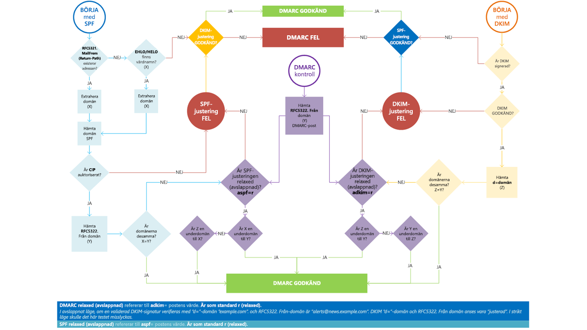

# <a name="use-dmarc-to-validate-email"></a>Använda DMARC för att validera e-post

[!INCLUDE [Microsoft 365 Defender rebranding](../includes/microsoft-defender-for-office.md)]


[DMARC](https://dmarc.org) (Domain-based Message Authentication, Reporting, and Conformance) fungerar med SPF (Sender Policy Framework) och DKIM (DomainKeys Identified Mail) för autentisering av e-postavsändare och ser till att mål-e-postsystem litar på meddelanden som skickats från din domän. Implementering av DMARC med SPF och DKIM ger ytterligare skydd mot förfalsknings- och nätfiske-e-post. DMARC gör så att mottagande e-postsystem kan bestämma vad som ska göras med meddelanden som skickats från din domän som misslyckas i SPF- eller DKIM-kontroller.

> [!TIP]
> Gå till [Microsoft Intelligent Security Association](https://www.microsoft.com/misapartnercatalog)-katalogen (MISA) för att se externa leverantörer som erbjuder DMARC-rapportering för Microsoft 365.

## <a name="how-do-spf-and-dmarc-work-together-to-protect-email-in-microsoft-365"></a>Hur fungerar SPF och DMARC tillsammans för att skydda e-post i Microsoft 365?

 Ett e-postmeddelande kan innehålla flera avsändaradresser. Adresserna används för olika ändamål. Tänk på följande adresser till exempel:

- **”E-post från”-adress**: Identifierar avsändaren och anger vart returmeddelanden ska skickas om problem uppstår med leveransen av meddelandet, till exempel meddelanden om utebliven leverans. Det här visas i kuvertdelen av ett e-postmeddelande och visas normalt inte av e-postprogrammet. Detta kallas ibland för 5321.MailFrom-adressen eller reverse-path-adressen.

- **”Från”-adressen**: Adressen som visas som Från-adressen av e-postprogrammet. Adressen identifierar e-postmeddelandets upphovsman. Det vill säga, postlådan för personen eller systemet som ansvarar för att skriva meddelandet. Detta kallas ibland för 5322.From-adressen.

SPF använder en DNS TXT-post för att tillhandahålla en lista över godkända avsändande IP-adresser för en viss domän. Normalt utförs bara SPF-kontroller mot 5321.MailFrom-adressen. Det betyder att 5322.From-adressen autentiseras inte när du använder SPF enskilt. Det möjliggör ett scenario där en användare kan ta emot ett meddelande som godkänns i en SPF-kontroll men har en förfalskad 5322.From-avsändaradress. Tänk dig till exempel den här SMTP-utskriften:

```console
S: Helo woodgrovebank.com
S: Mail from: phish@phishing.contoso.com
S: Rcpt to: astobes@tailspintoys.com
S: data
S: To: "Andrew Stobes" <astobes@tailspintoys.com>
S: From: "Woodgrove Bank Security" <security@woodgrovebank.com>
S: Subject: Woodgrove Bank - Action required
S:
S: Greetings User,
S:
S: We need to verify your banking details.
S: Please click the following link to verify that we have the right information for your account.
S:
S: https://short.url/woodgrovebank/updateaccount/12-121.aspx
S:
S: Thank you,
S: Woodgrove Bank
S: .
```

I den här utskriften är avsändaradresserna följande:

- E-post från-adress (5321.MailFrom): phish@phishing.contoso.com

- Från-adress (5322.From): security@woodgrovebank.com

Om du har konfigurerat SPF utför den mottagande servern en kontroll mot E-post från-adressen phish@phishing.contoso.com. Om meddelandet kom från en giltig källa för domänen phishing.contoso.com godkänns sedan SPF-kontrollen. Eftersom e-postklienten visar Från-adressen ser användaren att meddelandet kommer från security@woodgrovebank.com. Med bara SPF så autentiserades aldrig giltigheten för woodgrovebank.com.

När du använder DMARC utför den mottagande servern också en kontroll mot Från-adressen. Om det i exemplet ovan finns en DMARC TXT-post på plats för woodgrovebank.com misslyckas sedan kontrollen mot Från-adressen.

## <a name="what-is-a-dmarc-txt-record"></a>Vad är en DMARC TXT-post?

Liksom DNS-posterna för SPF är posten för DMARC en DNS-textpost (TXT) som hjälper till att förhindra förfalskning och nätfiske. Du publicerar DMARC TXT-poster i DNS. DMARC TXT-poster validerar e-postmeddelandens ursprung genom att verifiera e-postförfattarens IP-adress mot den påstådda ägaren till avsändardomänen. DMARC TXT-posten identifierar auktoriserade servrar för utgående e-post. Mål-e-postsystem kan verifiera att meddelanden de får härstammar från auktoriserade servrar för utgående e-post.

Microsofts DMARC TXT-post ser ut ungefär så här:

```console
_dmarc.microsoft.com.   3600    IN      TXT     "v=DMARC1; p=none; pct=100; rua=mailto:d@rua.agari.com; ruf=mailto:d@ruf.agari.com; fo=1"
```

Microsoft skickar sina DMARC-rapporter till [Agari](https://agari.com), en tredje part. Agari samlar in och analyserar DMARC-rapporter. Gå till [MISA-katalogen](https://www.microsoft.com/misapartnercatalog) för att se fler externa leverantörer som erbjuder DMARC-rapportering för Microsoft 365.

## <a name="implement-dmarc-for-inbound-mail"></a>Implementerar DMARC-för inkommande e-post

Du behöver inte göra något för att konfigurera DMARC för e-post som du har tagit emot i Microsoft 365. Vi har tagit hand om allt åt dig. Om du vill veta vad som händer med e-post som inte godkänns i våra DMARC-kontroller kan du läsa [Så hanterar Microsoft 365 inkommande e-post som misslyckas i DMARC](#how-microsoft-365-handles-inbound-email-that-fails-dmarc).

## <a name="implement-dmarc-for-outbound-mail-from-microsoft-365"></a>Implementera DMARC för utgående e-post från Microsoft 365

Om du använder Microsoft 365 men du inte använder en egen domän, det vill säga du använder onmicrosoft.com, behöver du inte göra något annat för att konfigurera eller implementera DMARC för din organisation. SPF är redan konfigurerat för dig och Microsoft 365 genererar automatiskt en DKIM-signatur för utgående e-post. Mer information om den här signaturen finns i [Standardbeteende för DKIM och Microsoft 365](use-dkim-to-validate-outbound-email.md#DefaultDKIMbehavior).

 Om du har en egen domän eller om du använder lokala Exchange-servrar förutom Microsoft 365 måste du manuellt implementera DMARC för utgående e-post. Implementering av DMARC för din egen domän omfattar följande steg:

- [Steg 1: Identifiera giltiga e-postkällor för din domän](#step-1-identify-valid-sources-of-mail-for-your-domain)

- [Steg 2: Konfigurera SPF för din domän](#step-2-set-up-spf-for-your-domain)

- [Steg 3: Konfigurera DKIM för din egen domän](#step-3-set-up-dkim-for-your-custom-domain)

- [Steg 4: Skapa DMARC TXT-posten för din domän](#step-4-form-the-dmarc-txt-record-for-your-domain)

### <a name="step-1-identify-valid-sources-of-mail-for-your-domain"></a>Steg 1: Identifiera giltiga e-postkällor för din domän

Om du redan har konfigurerat SPF har du redan gått igenom den här övningen. Men för DMARC finns det fler överväganden. När du identifierar e-postkällor för din domän finns det två frågor du måste besvara:

- Vilka IP-adresser skickar meddelanden från min domän?

- För e-post som skickats från tredje parter för mig, kommer 5321.MailFrom- och 5322.From-domänen matcha?

### <a name="step-2-set-up-spf-for-your-domain"></a>Steg 2: Konfigurera SPF för din domän

Nu när du har en lista över alla giltiga avsändare kan du följa stegen i [Konfigurera SPF för att förhindra förfalskning](set-up-spf-in-office-365-to-help-prevent-spoofing.md).

Om till exempel att contoso.com skickar e-post från Exchange Online, en lokal Exchange-server har en IP-adress som är 192.168.0.1 och ett webbprogram har en IP-adress som är 192.168.100.100, så skulle SPF TXT-posten se ut så här:

```console
contoso.com  IN  TXT  " v=spf1 ip4:192.168.0.1 ip4:192.168.100.100 include:spf.protection.outlook.com -all"
```

Vi rekommenderar att din SPF TXT-post tar hänsyn till externa avsändare.

### <a name="step-3-set-up-dkim-for-your-custom-domain"></a>Steg 3: Konfigurera DKIM för din egen domän

När du har konfigurerat SPF måste du konfigurera DKIM. Med DKIM kan du lägga till en digital signatur i e-postmeddelanden i meddelandehuvudet. Om du inte konfigurerar DKIM och istället tillåter Microsoft 365 att använda den standardinställda DKIM-konfigurationen för din domän kanske DMARC misslyckas. Det beror på att den standardinställda DKIM-konfigurationen använder din första onmicrosoft.com-domän som 5322.From-adress, inte din egen domän. Det tvingar fram en felmatchning mellan 5321.MailFrom- och 5322.From-adressen i all e-post som skickas från din domän.

Om du har externa avsändare som skickar e-post för din räkning och e-posten de skickar har felmatchade 5321.MailFrom- och 5322.From-adresser så misslyckas DMARC för det e-postmeddelandet. Du kan undvika det här genom att konfigurera DKIM för din domän specifikt med den externa avsändaren. Det gör att Microsoft 365 kan autentisera e-post från den tredjepartstjänsten. Men det gör också att andra, till exempel Yahoo, Gmail och Comcast, kan verifiera e-post som skickats av dem med den tredje parten som om det skulle vara e-post som skickats av dig. Det här är fördelaktigt eftersom dina kunder då kan bygga upp ett förtroende för din domän oavsett var deras postlåda finns, och samtidigt markerar Microsoft 365 inte ett meddelande som skräppost på grund av förfalskning eftersom det godkänns i autentiseringskontroller för din domän.

Instruktioner för konfiguration av DKIM för externa användare så att de kan förfalska din domän finns i [Använd DKIM för att validera utgående e-post som skickas från din egna domän](use-dkim-to-validate-outbound-email.md).

### <a name="step-4-form-the-dmarc-txt-record-for-your-domain"></a>Steg 4: Skapa DMARC TXT-posten för din domän

Det finns andra syntaxalternativ som inte nämns här men dessa är de vanligaste alternativen för Microsoft 365. Skapa DMARC TXT-posten för din domän i följande format:

```console
_dmarc.domain  TTL  IN  TXT  "v=DMARC1; p=policy; pct=100"
```

där:

- *domain* är den domän du vill skydda. Som standard skyddar posten e-post från domänen och alla underdomäner. Om du till exempel anger \_dmarc.contoso.com skyddar sedan DMARC e-post från domänen och alla underdomäner, till exempel housewares.contoso.com eller plumbing.contoso.com.

- *TTL* ska alltid vara motsvarigheten till en timme. Enheten som används för TTL, antingen timmar (1 timme), minuter (60 minuter) eller sekunder (3 600 sekunder) varierar beroende på domänens registrator.

- *pct=100* anger att regeln ska användas för 100 % av e-posten.

- *policy* anger vilken princip du vill att den mottagande servern ska följa om DMARC misslyckas. Du kan ange none (ingen), quarantine (karantän) eller reject (avvisa) som princip.

Information om vilka alternativ du ska använda ska du bekanta dig med begreppen i [Metodtips för implementering av DMARC i Microsoft 365](#best-practices-for-implementing-dmarc-in-microsoft-365).

Exempel:

- Principen inställd på none (ingen)

    ```console
    _dmarc.contoso.com 3600 IN  TXT  "v=DMARC1; p=none"
    ```

- Principen inställd på quarantine (karantän)

    ```console
    _dmarc.contoso.com 3600 IN  TXT  "v=DMARC1; p=quarantine"
    ```

- Principen inställd på reject (avvisa)

    ```console
    _dmarc.contoso.com  3600 IN  TXT  "v=DMARC1; p=reject"
    ```

När du har skapat posten måste du uppdatera posten hos domänregistratorn. Instruktioner för hur du lägger till DMARC TXT-posten till dina DNS-poster för Microsoft 365 finns i [Skapa DNS-poster för Microsoft 365 när du hanterar dina DNS-poster](https://docs.microsoft.com/microsoft-365/admin/get-help-with-domains/create-dns-records-at-any-dns-hosting-provider).

## <a name="best-practices-for-implementing-dmarc-in-microsoft-365"></a>Metodtips för implementering av DMARC i Microsoft 365

Du kan implementera DMARC gradvis utan att det påverkar resten av ditt e-postflöde. Skapa och implementera en lanseringsplan som följer de här stegen. Utför vart och ett av de här stegen först med en underdomän, sedan med andra underdomäner och till sist med domänen på den översta nivån i organisationen innan du går vidare till nästa steg.

1. Övervaka effekten av att implementera DMARC

    Börja med en ”monitoring-mode”-post (övervakningsläge) för en underdomän eller domän som begär att DMARC-mottagare skickar dig statistik om meddelanden som de ser via den domänen. En ”monitoring-mode”-post är en DMARC TXT-post som har sin princip inställd på ingen (p=none). Många företag publicerar en DMARC TXT-post med p=none eftersom de är osäkra på hur mycket e-post de kan förlora genom att publicera en mer restriktiv DMARC-princip.

    Du kan göra detta även innan du har implementerat SPF eller DKIM i meddelandeinfrastrukturen. Men du kan inte på ett effektivt sätt sätta e-post i karantän eller avvisa den med DMARC tills du också implementerar SPF och DKIM. När du inför SPF och DKIM ger rapporterna som genererats genom DMARC siffrorna och källorna för meddelanden som godkänns i dessa kontroller och sådana som inte godkänns. Du kan enkelt se hur mycket av din legitima trafik som täcks eller inte täcks av dem, och felsöka problem. Du börjar också se hur många falska meddelanden som skickas, och varifrån.

2. Begära att externa e-postsystem placerar e-post i karantän som inte klarar DMARC

    När du tror att all eller det mesta av din legitima trafik skyddas av SPF och DKIM, och du förstår effekten med att implementera DMARC, kan du implementera en karantänprincip. En karantänprincip är en DMARC TXT-post som har principen inställd på karantän (p=quarantine). Genom att göra detta uppmanar du DMARC-mottagare att placera meddelanden från din domän som inte klarar DMARC i den lokala motsvarigheten till en skräppostmapp istället för kundernas inkorgar.

3. Begära att externa e-postsystem inte accepterar meddelanden som inte klarar DMARC

    Det sista steget är att implementera en avvisningsprincip. En avvisningsprincip är en DMARC TXT-post som har principen inställd på avvisa (p=reject). När du gör det här uppmanar du DMARC-mottagare att inte acceptera meddelanden som inte klarar DMARC-kontrollerna.
    
4. Hur ställer du in DMARC för underdomän?

DMARC implementeras genom att publicera en policy som en TXT-post i DNS och är hierarkisk (t.ex. en policy publicerad för contoso.com kommer att tillämpas på sub.domain.contonos.com om inte en annan policy definieras uttryckligen för underdomänet). Detta är användbart eftersom organisationer kanske kan specificera ett mindre antal DMARC-poster på hög nivå för bredare täckning. Man bör vara noga med att konfigurera explicita underdomän DMARC-poster där du inte vill att underdomänerna ska ärva topp nivå domänens DMARC-post.

Du kan också lägga till en policy wildcard-typ för DMARC när domäner inte bör skicka e-post, genom att lägga till `sp=reject` värdet. Till exempel:

```console
_dmarc.contoso.com. TXT "v=DMARC1; p=reject; sp=reject; ruf=mailto:authfail@contoso.com; rua=mailto:aggrep@contoso.com"
```

## <a name="how-microsoft-365-handles-outbound-email-that-fails-dmarc"></a>Så hanterar Microsoft 365 utgående e-post som inte klarar DMARC

Om ett meddelande är utgående från Microsoft 365 och inte klarar DMARC, och du har ställt in principen på p=quarantine eller p=reject, dirigeras meddelandet genom [Pool med hög riskleverans för utgående meddelanden](high-risk-delivery-pool-for-outbound-messages.md). Det finns ingen åsidosättning för utgående e-post.

Om du publicerar en DMARC-avvisningsprincip (p=reject) kan ingen annan kund i Microsoft 365 förfalska din domän eftersom meddelanden inte kan godkännas i SPF- eller DKIM-kontroller för din domän vid vidarebefordran av ett meddelande utgående via tjänsten. Men om du publicerar en DMARC-avvisningsprincip men inte har all din e-post som autentiseras via Microsoft 365 kan en del av den markeras som skräppost för inkommande e-post (enligt beskrivningen ovan), eller så avvisas den om du inte publicerar SPF och försöker vidarebefordra den utgående genom tjänsten. Det sker, till exempel, om du glömmer att ta med några av IP-adresserna för servrar och appar som skickar e-post för din domän när du skapar din DMARC TXT-post.

## <a name="how-microsoft-365-handles-inbound-email-that-fails-dmarc"></a>Så hanterar Microsoft 365 inkommande e-post som inte klarar DMARC

Om DMARC-principen för den sändande servern är `p=reject`, markerar [Exchange Online Protection](exchange-online-protection-overview.md) (EOP) meddelandet som falska istället för att avvisa det. Med andra ord hanterar Microsoft 365`p=reject` och `p=quarantine` på samma sätt för inkommande e-post. Administratörer kan ange vilken åtgärd som ska utföras på meddelanden som klassificeras som falska i [principen för skydd mot nätfiske](set-up-anti-phishing-policies.md).

Microsoft 365 är konfigurerat så här eftersom viss legitim e-post kanske inte klarar DMARC. Ett meddelande kan till exempel misslyckas i DMARC om det skickas till en distributionslista som sedan vidarebefordrar meddelandet till alla listdeltagare. Om Microsoft 365 har avvisat dessa meddelanden kan användare förlora legitim e-post och har inget sätt att hämta den. Istället så underkänns meddelandena fortfarande i DMARC men markeras som skräppost och avvisas inte. Om de vill kan användarna fortfarande så dessa meddelanden i Inkorgen genom följande metoder:

- Användare lägger till betrodda avsändare individuellt med hjälp av sina e-postklienter.

- Administratörer kan uppdatera rapporteringen av [förfalskningsinformation](learn-about-spoof-intelligence.md) för att tillåta förfalskningen.

- Administratörer skapar en Exchange-e-postflödesregel (även kallad transportregel) för alla användare som tillåter meddelanden för dessa särskilda avsändare.

Mer information finns i [Skapa listor över betrodda avsändare](create-safe-sender-lists-in-office-365.md).

## <a name="how-microsoft-365-utilizes-authenticated-received-chain-arc"></a>Så använder Microsoft 365 ARC (Authenticated Received Chain)

Alla värdbaserade postlådor i Microsoft 365 får du fördelen med ARC med leveransförbättringar för meddelanden och förbättrat förfalskningsskydd. ARC bevarar resultat av e-postautentisering från alla deltagande mellanhänder, eller hopp, när ett e-postmeddelande dirigeras från ursprungsservern till mottagarpostlådan. Innan ARC kan modifiering som utförs av mellanhänder i e-postdirigering, som regler för vidarebefordran eller automatiska signaturer, orsaka DMARC-fel när e-postmeddelandet har nått mottagarpostlådan. Med ARC tillåter det kryptografiska bevarandet av autentiseringsresultat Microsoft 365 att verifiera autenticiteten för avsändaren av ett e-postmeddelande.

Microsoft 365 använder för närvarande ARC för att verifiera autentiseringsresultat när Microsoft är ARC-förseglare men planerar att lägga till support för ARC-förseglare från tredje part i framtiden.

## <a name="troubleshooting-your-dmarc-implementation"></a>Felsöka din DMARC-implementering

Om du har konfigurerat din domäns MX-poster där EOP inte är den första posten tillämpas inte DMARC-fel för domänen.

Om du är kund pekar din domäns primära MX-post inte på EOP får du inte fördelarna med DMARC. DMARC fungerar till exempel inte om du pekar MX-posten på din lokala e-postserver och dirigerar sedan e-post till EOP med hjälp av ett anslutningsprogram. I det här scenariot är den mottagande domänen en av dina godkända domäner men EOP inte är primär MX. Anta till exempel att contoso.com pekar MX mot sig själv och använder EOP som en sekundär MX-post, så ser MX-posten för contoso.com ut så här:

```console
contoso.com     3600   IN  MX  0  mail.contoso.com
contoso.com     3600   IN  MX  10 contoso-com.mail.protection.outlook.com
```

Alla, eller de flesta, e-postmeddelanden dirigeras först till mail.contoso.com eftersom det är den primära MX-posten och sedan dirigeras e-post till EOP. I vissa fall kanske du inte listar EOP som en MX-post alls och använder bara anslutningsprogram för att dirigera e-post. EOP måste inte vara den första posten för att DMARC-validering ska göras. Den säkerställer bara valideringen, eftersom vi inte kan vara säkra på att alla lokala servrar/icke-O365-servrar kommer att göra DMARC-kontroller.  DMARC kan tillämpas för en kunds domän (inte server) när du konfigurerar DMARC TXT-posten men det är upp till den mottagande servern att faktiskt göra tillämpningen.  Om du konfigurerar EOP som mottagande server gör EOP DMARC-tillämpningen.



## <a name="for-more-information"></a>Mer information

Vill du ha mer information om DMARC? De här resurserna kan hjälpa dig.

- [Meddelandehuvuden för antiskräppost](anti-spam-message-headers.md) innehåller syntaxen och rubrikerna som används i Microsoft 365 för DMARC-kontroller.

- Genomför [DMARC-utbildningsserien](https://www.m3aawg.org/activities/training/dmarc-training-series) från M <sup>3</sup>AAWG (Messaging, Malware, Mobile Anti-Abuse Working Group).

- Använd checklistan på [dmarcian](https://space.dmarcian.com/deployment/).

- Gå direkt till källan på [DMARC.org](https://dmarc.org).

## <a name="see-also"></a>Se även

[Så använder Microsoft 365 SPF (Sender Policy Framework) för att förhindra förfalskning](how-office-365-uses-spf-to-prevent-spoofing.md)

[Konfigurera SPF i Microsoft 365 för att förhindra förfalskning](set-up-spf-in-office-365-to-help-prevent-spoofing.md)

[Använd DKIM för att validera utgående e-post som skickas från din egna domän i Microsoft 365](use-dkim-to-validate-outbound-email.md)
