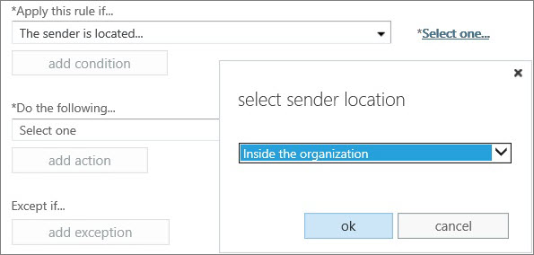

# Använd regler för e-postflöde för att ställa in scl (Spam Confidence Level) i meddelandenUse mail flow rules to set the spam confidence level (SCL) in messages

Du kan skapa en regel för e-postflöde (kallas även en transportregel) som anger åtkomstnivån för skräppost (SCL) för ett e-postmeddelande.You can create a mail flow rule (also known as a transport rule) that sets the spam confidence level (SCL) of an email message. SCL är ett mått på hur sannolikt ett meddelande är att vara spam.The SCL is a measure of how likely a message is to be spam. Skräppost är oönskade (och vanligtvis oönskade) e-postmeddelanden.Spam is unsolicited (and typically unwanted) email messages. Tjänsten vidtar olika åtgärder på ett meddelande beroende på dess SCL-klassificering.The service takes different action on a message depending on its SCL rating. Du kanske till exempel vill kringgå filtrering av skräppostinnehåll för meddelanden som skickas från personer i organisationen eftersom du litar på att ett meddelande som skickas internt från en kollega inte är skräppost.For example, you might want to bypass spam content filtering for messages that are sent from people inside your organization because you trust that a message sent internally from a colleague isn't spam. Genom att använda regler för e-postflöde för att ange SCL-värdet för ett meddelande får du ökad kontroll över hanteringen av skräppost.Using mail flow rules to set the SCL value of a message gives you increased control in handling spam.

 **Vad behöver du veta innan du börjar?****What do you need to know before you begin?**

- Beräknad tid för att slutföra denna procedur: 10 minuter.Estimated time to complete this procedure: 10 minutes.

- Du måste ha tilldelats behörigheter för att kunna utföra de här procedurerna.You need to be assigned permissions before you can perform this procedure or procedures. Information om vilka behörigheter du behöver finns i posten "E-postflödesregler" i [Funktionsbehörigheter i Exchange Online](https://docs.microsoft.com/exchange/permissions-exo/feature-permissions) eller [Funktionsbehörigheter i EOP](feature-permissions-in-eop.md).To see what permissions you need, see the "Mail flow rules" entry in [Feature Permissions in Exchange Online](https://docs.microsoft.com/exchange/permissions-exo/feature-permissions) or [Feature permissions in EOP](feature-permissions-in-eop.md).

- Information om kortkommandon som kan gälla för procedurerna i det här avsnittet finns [i Kortkommandon för administrationscentret för Exchange i Exchange Online](https://docs.microsoft.com/Exchange/accessibility/keyboard-shortcuts-in-admin-center).For information about keyboard shortcuts that may apply to the procedures in this topic, see [Keyboard shortcuts for the Exchange admin center in Exchange Online](https://docs.microsoft.com/Exchange/accessibility/keyboard-shortcuts-in-admin-center).

### Så här skapar du en regel för e-postflöde som anger SCL för ett meddelandeTo create a mail flow rule that sets the SCL of a message

1. Välj Regler för **e-postflöde** \> i Administrationscentret för Exchange **.**In the Exchange admin center (EAC), choose **Mail flow** \> **Rules**.

2. Välj **Ny**lägg till ikon och välj sedan **Skapa en ny regel**.Choose **New**, and then select **Create a new rule**.

3. Ange ett namn för regeln.Specify a name for the rule.

4. Välj **Fler alternativ**och ange sedan ett villkor som utlöser åtgärden som du ska ange för den här regeln (som ska anges i SCL-värdet) under Använd den här **regeln**om du anger ett villkor som utlöser den åtgärd som ska utlösas för den här regeln (som ska anges i SCL-värdet).Choose **More options**, and then under **Apply this rule if**, specify a condition that will trigger the action you'll be setting for this rule (which is to set the SCL value).

   Du kan till exempel ange **att avsändaren** \> **är intern/extern**och sedan väljer **du Inuti organisationen**i dialogrutan Välj **avsänaresplats** och väljer **ok**.For example, you can set **The sender** \> **is internal/external**, and then in the **select sender location** dialog box, select **Inside the organization**, and choose **ok**. 
   

5. Under **Gör följande**väljer du Ändra **meddelandeegenskaperna** \> som **säkerhetsnivå för skräppost (SCL)**.Under **Do the following**, select **Modify the message properties** \> **set the spam confidence level (SCL)**.

6. Markera ett av följande värden i rutan **Ange SCL** och välj **OK:**In the **Specify SCL** box, select one of the following values, and choose **OK**:

   - **Bypass spam filtrering:** Detta ställer in SCL till -1, vilket innebär att innehållsfiltrering inte kommer att utföras.**Bypass spam filtering**: This sets the SCL to -1, which means that content filtering won't be performed.

   - **0-4**: Meddelandet skickas vidare till innehållsfiltret för ytterligare bearbetning.**0-4**: The message will be passed along to the content filter for additional processing.

   - **5-6**: Åtgärden som anges för **skräppost** i tillämpliga innehållsfilterpolicyer kommer att tillämpas.**5-6**: The action specified for **Spam** in the applicable content filter policies will be applied. Som standard är åtgärden att skicka meddelandet till mottagarens skräppostmapp.By default, the action is to send the message to the recipient's Junk Email folder.

   - **7-9**: Åtgärden som anges för **Skräppost med högt förtroende** i tillämpliga innehållsfilterpolicyer kommer att tillämpas.**7-9**: The action specified for **High confidence spam** in the applicable content filter policies will be applied. Som standard är åtgärden att skicka meddelandet till mottagarens skräppostmapp.By default, the action is to send the message to the recipient's Junk Email folder.

   Mer information om hur du konfigurerar innehållsfilterprinciper finns i [Konfigurera principer för skräppostfilter](configure-your-spam-filter-policies.md).For more information about configuring your content filter policies, see [Configure your spam filter policies](configure-your-spam-filter-policies.md). Mer information om SCL-värden i tjänsten finns i [Säkerhetsnivåer för skräppost](spam-confidence-levels.md).For more information about SCL values in the service, see [Spam confidence levels](spam-confidence-levels.md).

7. Ange ytterligare egenskaper för regeln och välj **spara**.Specify additional properties for the rule, and choose **save**.

   > [!TIP]
   > Mer information om de ytterligare egenskaper som du kan välja eller ange för den här regeln finns i [Använda EAC för att skapa regler för e-postflöde](https://docs.microsoft.com/Exchange/policy-and-compliance/mail-flow-rules/mail-flow-rule-procedures#use-the-eac-to-create-mail-flow-rules).For more information about the additional properties you can select or specify for this rule, see [Use the EAC to create mail flow rules](https://docs.microsoft.com/Exchange/policy-and-compliance/mail-flow-rules/mail-flow-rule-procedures#use-the-eac-to-create-mail-flow-rules).

## Hur vet du att det fungerade?How do you know this worked?

Om du vill kontrollera att den här proceduren fungerar korrekt skickar du ett e-postmeddelande till någon i organisationen och kontrollerar att åtgärden som utförs i meddelandet är som förväntat.To verify that this procedure is working correctly, send an email message to someone inside your organization, and verify that the action performed on the message is as expected. Om du till exempel **ställer in scl (Spam Confidence Level)** på **Kringgå skräppostfiltrering**ska meddelandet skickas till den angivna mottagarens inkorg.For example, if you **set the spam confidence level (SCL)** to **Bypass spam filtering**, then the message should be sent to the specified recipient's inbox. Men om du **ställer in spam förtroendenivå (SCL)** till **9**, och **hög förtroende spam** åtgärder för din tillämpliga innehåll filter politik är att flytta meddelandet till mappen Skräppost, då meddelandet ska skickas till den angivna mottagarens skräppostmapp.However, if you **set the spam confidence level (SCL)** to **9**, and the **High confidence spam** action for your applicable content filter policies is to move the message to the Junk Email folder, then the message should be sent to the specified recipient's Junk Email folder.
