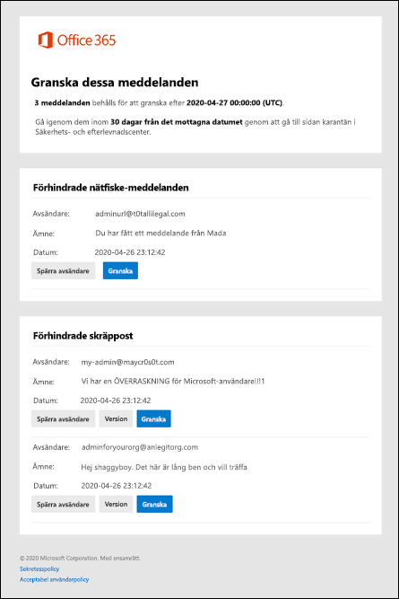

# Använda skräppost-aviseringar för användare för att släppa och rapportera meddelanden i karantänUse user spam notifications to release and report quarantined messages

[!INCLUDE [Microsoft 365 Defender rebranding](../includes/microsoft-defender-for-office.md)]

**Gäller för****Applies to**
- [Exchange Online ProtectionExchange Online Protection](exchange-online-protection-overview.md)
- [Microsoft Defender för Office 365 Abonnemang 1 och Abonnemang 2Microsoft Defender for Office 365 plan 1 and plan 2](office-365-atp.md)
- [Microsoft 365 DefenderMicrosoft 365 Defender](../mtp/microsoft-threat-protection.md)

I Microsoft 365-organisationer med postlådor i Exchange Online eller fristående Exchange Online Protection-organisationer (EOP) utan Exchange Online-postlådor lagrar karantänen potentiellt farliga eller oönskade meddelanden.In Microsoft 365 organizations with mailboxes in Exchange Online or standalone Exchange Online Protection (EOP) organizations without Exchange Online mailboxes, quarantine holds potentially dangerous or unwanted messages. Mer information finns i [Meddelanden i karantän i EOP.](quarantine-email-messages.md)For more information, see [Quarantined messages in EOP](quarantine-email-messages.md).

Som standard är skräppost-aviseringar för slutanvändare inaktiverade i principerna för skräppostskydd.By default, end-user spam notifications are disabled in anti-spam policies. När en administratör aktiverar [skräppost-aviseringar](configure-your-spam-filter-policies.md#configure-end-user-spam-notifications)för slutanvändare får mottagare (inklusive delade postlådor med automatisk mappning aktiverat) periodiska aviseringar om meddelanden som har satts i karantän som skräppost, massutskick eller (från och med april 2020) nätfiske.When an admin [enables end-user spam notifications](configure-your-spam-filter-policies.md#configure-end-user-spam-notifications), recipients (including shared mailboxes with automapping enabled) will receive periodic notifications about their messages that were quarantined as spam, bulk email, or (as of April 2020) phishing.

För delade postlådor stöds skräppost-aviseringar för slutanvändare endast för användare som får behörigheten FullAccess till den delade postlådan.For shared mailboxes, end-user spam notifications are only supported for users who are granted FullAccess permission to the shared mailbox. Mer information finns i Använda [EAC för att redigera delegering av delad postlåda.](/Exchange/collaboration-exo/shared-mailboxes#use-the-eac-to-edit-shared-mailbox-delegation)For more information, see [Use the EAC to edit shared mailbox delegation](/Exchange/collaboration-exo/shared-mailboxes#use-the-eac-to-edit-shared-mailbox-delegation).

Skräppost-avisering för slutanvändare stöds inte för grupper.End User Spam notification is not supported for groups.

> [!NOTE]
> Meddelanden som har satts i karantän som nätfiske, skadlig kod eller genom e-postflödesregler (kallas även transportregler) är bara tillgängliga för administratörer.Messages that were quarantined as high confidence phishing, malware, or by mail flow rules (also known as transport rules) are only available to admins. Mer information finns i [Hantera meddelanden och filer i karantän som administratör i EOP](manage-quarantined-messages-and-files.md).For more information, see [Manage quarantined messages and files as an admin in EOP](manage-quarantined-messages-and-files.md).

En skräppost-avisering för slutanvändaren innehåller följande information för varje meddelande i karantän:An end-user spam notification contains the following information for each quarantined message:

- **Avsändare**: Skicka meddelandets namn och e-postadress.**Sender**: The send name and email address of the quarantined message.

- **Ämne**: Ämnesraden i det i karantän-meddelandet.**Subject**: The subject line text of the quarantined message.

- **Datum:** Datum och tid (i UTC) då meddelandet satt i karantän.**Date**: The date and time (in UTC) that the message was quarantined.

- **Spärra avsändare:** Klicka på den här länken om du vill lägga till avsändaren i listan Spärrade avsändare.**Block Sender**: Click this link to add the sender to your Blocked Senders list. Mer information finns i Spärra [en e-postavsändare.](https://support.microsoft.com/office/b29fd867-cac9-40d8-aed1-659e06a706e4)For more information, see [Block a mail sender](https://support.microsoft.com/office/b29fd867-cac9-40d8-aed1-659e06a706e4).

- **Version:** För skräppost (inte nätfiske) kan du släppa meddelandet här utan att gå till karantänen för & säkerhets- och efterlevnadscenter.**Release**: For spam (not phishing) messages, you can release the message here without going to Quarantine the Security & Compliance Center.

- **Granska**&: Klicka på den här länken för att gå till karantän i säkerhets- och efterlevnadscentret, där du kan visa , släppa, ta bort eller rapportera dina meddelanden i karantän (beroende på varför meddelandet satt i karantän).**Review**: Click this link to go to Quarantine in the Security & Compliance Center, where you can (depending on why the message was quarantined) view, release, delete or report your quarantined messages. Mer information finns i [Hitta och släppa meddelanden i karantän som en användare i EOP.](find-and-release-quarantined-messages-as-a-user.md)For more information, see [Find and release quarantined messages as a user in EOP](find-and-release-quarantined-messages-as-a-user.md).

> [!NOTE]
> Spärrade avsändare kan fortfarande skicka e-post till dig.A blocked sender can still send you mail. Alla meddelanden från den här avsändaren som skickar dem till din postlåda flyttas omedelbart till mappen Skräppost.Any messages from this sender that make it to your mailbox will be immediately moved to the Junk Email folder. Framtida meddelanden från den här avsändaren hamnar i mappen Skräppost eller till slutanvändares karantän.Future messages from this sender will go to your Junk Email folder or to the end-user quarantine. Om du vill ta bort dessa meddelanden vid ankomst i stället för att kvartiler kan du använda e-postflödesregler [(kallas](/exchange/security-and-compliance/mail-flow-rules/mail-flow-rules) även transportregler) för att ta bort meddelandena när de anländer.If you would like to delete these messages on arrival instead of quarantining them, use [mail flow Rules](/exchange/security-and-compliance/mail-flow-rules/mail-flow-rules) (also known as transport rules) to delete the messages on arrival.