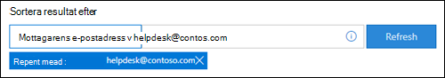
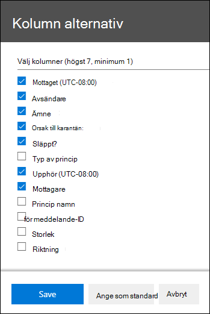

# <a name="view-and-release-quarantined-messages-from-shared-mailboxes"></a><span data-ttu-id="8735b-103">Visa och släppa meddelanden i karantän från delade postlådor</span><span class="sxs-lookup"><span data-stu-id="8735b-103">View and release quarantined messages from shared mailboxes</span></span>

> [!NOTE]
> <span data-ttu-id="8735b-104">Funktionerna som beskrivs i den här artikeln är för närvarande i förhandsversion, är inte tillgängliga för alla och kan komma att ändras.</span><span class="sxs-lookup"><span data-stu-id="8735b-104">The features that are described in this article are currently in Preview, aren't available to everyone, and are subject to change.</span></span>

<span data-ttu-id="8735b-105">Användare kan hantera meddelanden i karantän där de är en av mottagarna enligt beskrivningen i Hitta och släppa meddelanden i karantän [som en användare i EOP.](find-and-release-quarantined-messages-as-a-user.md)</span><span class="sxs-lookup"><span data-stu-id="8735b-105">Users can manage quarantined messages where they are one of the recipients as described in [Find and release quarantined messages as a user in EOP](find-and-release-quarantined-messages-as-a-user.md).</span></span> <span data-ttu-id="8735b-106">Men hur blir det med delade postlådor där användaren har behörigheten Fullständig åtkomst och Skicka som eller Skicka för till postlådan enligt beskrivningen i Delade postlådor [i Exchange Online?](/exchange/collaboration-exo/shared-mailboxes)</span><span class="sxs-lookup"><span data-stu-id="8735b-106">But what about shared mailboxes where the user has Full Access and Send As or Send on Behalf permissions to the mailbox as described in [Shared mailboxes in Exchange Online](/exchange/collaboration-exo/shared-mailboxes)?</span></span>

<span data-ttu-id="8735b-107">Tidigare var möjligheten för användare att hantera meddelanden i karantän som skickades till en delad postlåda obligatoriska administratörer för att lämna automatisk mappning aktiverad för den delade postlådan (det är aktiverat som standard när en administratör ger en användare åtkomst till en annan postlåda).</span><span class="sxs-lookup"><span data-stu-id="8735b-107">Previously, the ability for users to manage quarantined messages sent to a shared mailbox required admins to leave automapping enabled for the shared mailbox (it's enabled by default when an admin gives a user access to another mailbox).</span></span> <span data-ttu-id="8735b-108">Men beroende på storleken på och antalet postlådor som användaren har tillgång till  kan prestandan drabbas av problem när Outlooks försöker öppna alla postlådor som användaren har åtkomst till.</span><span class="sxs-lookup"><span data-stu-id="8735b-108">However, depending on the size and number of mailboxes that the user has access to, performance can suffer as Outlooks tries to open *all* mailboxes that the user has access to.</span></span> <span data-ttu-id="8735b-109">Därför väljer många administratörer att ta bort [automatisk mappning för delade postlådor.](/outlook/troubleshoot/profiles-and-accounts/remove-automapping-for-shared-mailbox)</span><span class="sxs-lookup"><span data-stu-id="8735b-109">For this reason, many admins choose to [remove automapping for shared mailboxes](/outlook/troubleshoot/profiles-and-accounts/remove-automapping-for-shared-mailbox).</span></span>

<span data-ttu-id="8735b-110">Automatisk mappning krävs nu inte längre för att användare ska kunna hantera meddelanden i karantän som har skickats till delade postlådor.</span><span class="sxs-lookup"><span data-stu-id="8735b-110">Now, automapping is no longer required for users to manage quarantined messages that were sent to shared mailboxes.</span></span> <span data-ttu-id="8735b-111">Det fungerar bara.</span><span class="sxs-lookup"><span data-stu-id="8735b-111">It just works.</span></span> <span data-ttu-id="8735b-112">Det finns två olika metoder för att komma åt meddelanden i karantän som har skickats till en delad postlåda:</span><span class="sxs-lookup"><span data-stu-id="8735b-112">There are two different methods to access quarantined messages that were sent to a shared mailbox:</span></span>

- <span data-ttu-id="8735b-113">Om administratören har aktiverat [skräppost-aviseringar](configure-your-spam-filter-policies.md#configure-end-user-spam-notifications)för slutanvändaren i principerna för skräppostskydd kan alla användare som har  åtkomst till skräppost-aviseringarna för slutanvändaren i den delade postlådan klicka på knappen Granska i meddelandet för att gå till karantän i säkerhets- och & efterlevnadscentret.</span><span class="sxs-lookup"><span data-stu-id="8735b-113">If the admin has [enabled end-user spam notifications in anti-spam policies](configure-your-spam-filter-policies.md#configure-end-user-spam-notifications), any user that has access to the end-user spam notifications in the shared mailbox can click the **Review** button in the notification to go to quarantine in the Security & Compliance Center.</span></span> <span data-ttu-id="8735b-114">Observera att den här metoden endast gör att användare kan hantera meddelanden i karantän som har skickats till den delade postlådan.</span><span class="sxs-lookup"><span data-stu-id="8735b-114">Note that this method only allows users to manage quarantined messages that were sent to the shared mailbox.</span></span> <span data-ttu-id="8735b-115">Användare kan inte hantera sina egna karantänmeddelanden i det här sammanhanget.</span><span class="sxs-lookup"><span data-stu-id="8735b-115">Users can't manage their own quarantine messages in this context.</span></span>

- <span data-ttu-id="8735b-116">Användaren kan [gå till karantänen i säkerhets- & kompatibilitetscentret.](find-and-release-quarantined-messages-as-a-user.md)</span><span class="sxs-lookup"><span data-stu-id="8735b-116">The user can [go to the quarantine in the Security & Compliance Center](find-and-release-quarantined-messages-as-a-user.md).</span></span> <span data-ttu-id="8735b-117">Som standard visas endast meddelanden som skickats till användaren.</span><span class="sxs-lookup"><span data-stu-id="8735b-117">By default, only messages that were sent to the user are shown.</span></span> <span data-ttu-id="8735b-118">Däremot kan användaren ändra sorteringsresultatet **(knappen**  **Meddelande-ID** som standard) till Mottagarens e-postadress, ange den delade postlådans e-postadress och sedan klicka på Uppdatera för att se meddelanden i karantän som har skickats till den delade postlådan. </span><span class="sxs-lookup"><span data-stu-id="8735b-118">However, the user can change the **Sort results** (the **Message ID button** by default) to **Recipient email address**, enter the shared mailbox email address, and then click **Refresh** to see the quarantined messages that were sent to the shared mailbox.</span></span>

  

<span data-ttu-id="8735b-120">Oavsett metod kan användarna undvika förvirring genom att lägga till kolumnen **Mottagare för** meddelanden i karantän.</span><span class="sxs-lookup"><span data-stu-id="8735b-120">Regardless of the method, users can avoid confusion by including the **Recipient** column for quarantined messages.</span></span> <span data-ttu-id="8735b-121">Max antal kolumner som ska visas är 7, så användaren måste klicka på Ändra kolumner **,** ta bort en befintlig kolumn (till exempel **principtyp**), välja Mottagare och sedan klicka på **Spara** eller **Spara som standard.** </span><span class="sxs-lookup"><span data-stu-id="8735b-121">The maximum number of columns to display is 7, so the user will need to click **Modify columns**, remove an existing column (for example, **Policy type**), select **Recipient**, and then click **Save** or **Save as default**.</span></span>

  

## <a name="things-to-keep-in-mind"></a><span data-ttu-id="8735b-123">Saker att tänka på</span><span class="sxs-lookup"><span data-stu-id="8735b-123">Things to keep in mind</span></span>

- <span data-ttu-id="8735b-124">Den första användaren som agerar på det i karantän-meddelandet avgör meddelandets första dag för alla som använder den delade postlådan.</span><span class="sxs-lookup"><span data-stu-id="8735b-124">The first user to act on the quarantined message decides the fate of the message for everyone who uses the shared mailbox.</span></span> <span data-ttu-id="8735b-125">Om till exempel en delad postlåda används av 10 användare och en användare tar bort karantänmeddelandet, tas meddelandet bort för alla tio användare.</span><span class="sxs-lookup"><span data-stu-id="8735b-125">For example, if a shared mailbox is accessed by 10 users, and a user decides to delete the quarantine message, the message is deleted for all 10 users.</span></span> <span data-ttu-id="8735b-126">Om en användare väljer att släppa meddelandet släpps det till den delade postlådan och är tillgängligt för alla andra användare av den delade postlådan.</span><span class="sxs-lookup"><span data-stu-id="8735b-126">Likewise, if a user decides to release the message, it's released to the shared mailbox and is accessible by all other users of the shared mailbox.</span></span>

- <span data-ttu-id="8735b-127">Knappen Spärra **avsändare är för** närvarande inte tillgänglig i den utfällna informationen för meddelanden i karantän som har skickats till den delade postlådan. </span><span class="sxs-lookup"><span data-stu-id="8735b-127">Currently, the **Block sender** button is not available in the **Details** flyout for quarantined messages that were sent to the shared mailbox.</span></span>

- <span data-ttu-id="8735b-128">Om karantänåtgärder för delade postlådor rekommenderar vi att du inte har fler än två nivåer med kapslade grupper om du använder kapslade säkerhetsgrupper för att bevilja åtkomst till en delad postlåda.</span><span class="sxs-lookup"><span data-stu-id="8735b-128">Regarding quarantine operations for shared mailboxes, if you use nested security groups to grant access to a shared mailbox, we recommend no more than two levels of nested groups.</span></span> <span data-ttu-id="8735b-129">Till exempel är Grupp A medlem i Grupp B, som är medlem i Grupp C. Om du vill tilldela behörigheter till en delad postlåda ska du inte lägga till användaren i Grupp A och sedan tilldela grupp C till den delade postlådan.</span><span class="sxs-lookup"><span data-stu-id="8735b-129">For example, Group A is a member of Group B, which is a member of Group C. To assign permissions to a shared mailbox, don't add the user to Group A and then assign Group C to the shared mailbox.</span></span>  

- <span data-ttu-id="8735b-130">För att hantera meddelanden i karantän för den delade postlådan i [Exchange Online PowerShell](/powershell/exchange/connect-to-exchange-online-powershell)måste slutanvändaren använda cmdlet:en [Get-QuarantineMessage](/powershell/module/exchange/get-quarantinemessage) med en delad postlådas e-postadress för parameterns _RecipientAddress-värde_ för att identifiera meddelandena.</span><span class="sxs-lookup"><span data-stu-id="8735b-130">To manage quarantined messages for the shared mailbox in [Exchange Online PowerShell](/powershell/exchange/connect-to-exchange-online-powershell), the end-user will need to use the [Get-QuarantineMessage](/powershell/module/exchange/get-quarantinemessage) cmdlet with shared mailbox email address for the value of the _RecipientAddress_ parameter to identify the messages.</span></span> <span data-ttu-id="8735b-131">Till exempel:</span><span class="sxs-lookup"><span data-stu-id="8735b-131">For example:</span></span>

  ```powershell
  Get-QuarantinedMessage -RecipientAddress officeparty@contoso.com
  ```

  <span data-ttu-id="8735b-132">Därefter kan slutanvändaren välja ett meddelande i karantän i listan som ska visas eller vidta åtgärder för.</span><span class="sxs-lookup"><span data-stu-id="8735b-132">Then, the end-user can select a quarantined message from the list to view or take action on.</span></span>

  <span data-ttu-id="8735b-133">Det här exemplet visar alla meddelanden i karantän som har skickats till den delade postlådan och släpper sedan det första meddelandet i listan från karantän (det första meddelandet i listan är 0, det andra är 1 och så vidare).</span><span class="sxs-lookup"><span data-stu-id="8735b-133">This example shows all of the quarantined messages that were sent to the shared mailbox, and then releases the first message in the list from quarantine (the first message in the list is 0, the second is 1, and so on).</span></span>

  ```powershell
  $SharedMessages = Get-QuarantinedMessage -RecipientAddress officeparty@contoso.com | select -ExpandProperty Identity
  $SharedMessages
  Release-QuarantinedMessage -Identity $SharedMessages[0]
  ```

  <span data-ttu-id="8735b-134">Detaljerad information om syntax och parametrar finns i följande artiklar:</span><span class="sxs-lookup"><span data-stu-id="8735b-134">For detailed syntax and parameter information, see the following topics:</span></span>

  - [<span data-ttu-id="8735b-135">Get-QuarantineMessage</span><span class="sxs-lookup"><span data-stu-id="8735b-135">Get-QuarantineMessage</span></span>](/powershell/module/exchange/get-quarantinemessage)
  - [<span data-ttu-id="8735b-136">Get-QuarantineMessageHeader</span><span class="sxs-lookup"><span data-stu-id="8735b-136">Get-QuarantineMessageHeader</span></span>](/powershell/module/exchange/get-quarantinemessageheader)
  - [<span data-ttu-id="8735b-137">Preview-QuarantineMessage</span><span class="sxs-lookup"><span data-stu-id="8735b-137">Preview-QuarantineMessage</span></span>](/powershell/module/exchange/preview-quarantinemessage)
  - [<span data-ttu-id="8735b-138">Release-QuarantineMessage</span><span class="sxs-lookup"><span data-stu-id="8735b-138">Release-QuarantineMessage</span></span>](/powershell/module/exchange/release-quarantinemessage)
