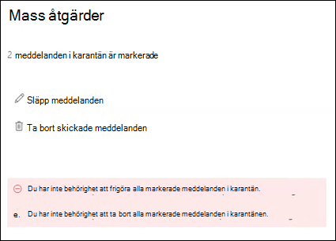

# <a name="view-and-release-quarantined-messages-from-shared-mailboxes"></a>Visa och släppa meddelanden i karantän från delade post lådor

> [!NOTE]
> De funktioner som beskrivs i den här artikeln är för närvarande i för hands versionen, är inte tillgängliga för alla och kan komma att ändras.

Användare kan hantera meddelanden i karantän där de är en av mottagarna enligt beskrivningen i [hitta och släppa meddelanden i karantän som en användare i EOP](find-and-release-quarantined-messages-as-a-user.md). Men vad händer med delade post lådor där användaren har fullständig åtkomst och behörigheten skicka som eller skicka för ombud till post lådan enligt beskrivningen i [delade post lådor i Exchange Online](https://docs.microsoft.com/exchange/collaboration-exo/shared-mailboxes)?

Tidigare var det möjligt för användarna att hantera meddelanden i karantän som skickas till en delad post låda som krävs för att den delade post lådan ska vara aktive rad (den är aktive rad som standard när en administratör ger en användare åtkomst till en annan post låda). Beroende på storleken och antalet post lådor som användaren har till gång till kan prestandan bli lidande för att ett försök görs att öppna *alla* post lådor som användaren har till gång till. Av den anledningen väljer många administratörer att [ta bort Automappning för delade post lådor](https://docs.microsoft.com/outlook/troubleshoot/profiles-and-accounts/remove-automapping-for-shared-mailbox).

Nu behöver du inte längre mappa automatiskt för att användare ska kunna hantera meddelanden i karantän som skickades till delade post lådor. Det fungerar bara. Det finns två olika sätt att komma åt karantän meddelanden som skickades till en delad post låda:

- Om administratören har [aktiverat aviseringar om slutanvändare](https://docs.microsoft.com/microsoft-365/security/office-365-security/configure-your-spam-filter-policies) i principer för skräp post kan alla användare som har till gång till skräp post meddelanden i den delade post lådan Klicka på knappen **Granska** i meddelandet för att gå till karantän i säkerhets & Compliance Center. Observera att den här metoden endast tillåter användare att hantera meddelanden som skickats till den delade post lådan. Användarna kan inte hantera sina egna karantän meddelanden i den här kontexten.

- Användaren kan [gå till karantänen i säkerhets & Compliance Center](find-and-release-quarantined-messages-as-a-user.md). Som standard visas bara meddelanden som skickades till användaren. Men användaren kan ändra **sorterings resultaten** ( **knappen meddelande-ID** som standard) till **mottagarens e-postadress**, skriva in e-postadressen för den delade post lådan och klicka på **Uppdatera** för att se de meddelanden i karantänen som skickades till den delade post lådan.

  

Oavsett hur du använder den här metoden kan användarna undvika förvirring genom att lägga till kolumnen **mottagare** för meddelanden i karantän. Det maximala antalet kolumner som ska visas är 7, så användaren måste klicka på **Ändra kolumner**, ta bort en befintlig kolumn (till exempel en **typ av princip**), välja **mottagare** och sedan klicka på **Spara** eller **Spara som standard**.

  

## <a name="things-to-keep-in-mind"></a>Saker att tänka på

- Den första användaren som ska agera på det satta meddelandet bestämmer överskrivning av meddelandet för alla som använder den delade post lådan. Om till exempel en delad post låda används av 10 användare och en användare bestämmer sig för att ta bort karantän meddelandet raderas meddelandet för alla tio användarna. Om en användare väljer att släppa meddelandet släpps det på den delade post lådan och är tillgänglig för alla andra användare av den delade post lådan.

- För närvarande, om en användare väljer flera meddelanden som skickats till den delade post lådan, returneras följande missvisande fel när användaren klickar på **släpp meddelanden** eller **ta bort meddelanden** i den utfällbara **Mass åtgärden** :

  > Du har inte behörighet att frigöra alla markerade meddelanden i karantän.
  >
  > Du har inte behörighet att ta bort alla markerade meddelanden i karantänen.

  Oavsett felet utförs åtgärden på meddelandet och felet kan ignoreras.

  

- För närvarande går det inte att använda knappen **Blockera avsändare** för **infällbara meddelanden** som skickats till den delade post lådan.

- Om _du vill_ hantera meddelanden i karantän för den delade post lådan i [Exchange Online PowerShell](https://docs.microsoft.com/powershell/exchange/connect-to-exchange-online-powershell)måste slutanvändaren använda cmdleten [Get-QuarantineMessage](https://docs.microsoft.com/powershell/module/exchange/get-quarantinemessage) för att identifiera meddelandena. Till exempel:

  ```powershell
  Get-QuarantinedMessage -RecipientAddress officeparty@contoso.com
  ```

  Sedan kan slutanvändaren välja ett meddelande i karantän i listan för att visa eller vidta en åtgärd.

  I det här exemplet visas alla karantän meddelanden som skickats till den delade post lådan och sedan släpps det första meddelandet i listan från karantän (det första meddelandet i listan är 0, det andra är 1 o.s.v.).

  ```powershell
  $SharedMessages = Get-QuarantinedMessage -RecipientAddress officeparty@contoso.com | select -ExpandProperty Identity
  $SharedMessages
  Release-QuarantinedMessage -Identity $SharedMessages[0]
  ```

  Detaljerad information om syntax och parametrar finns i följande artiklar:

  - [Get-QuarantineMessage](https://docs.microsoft.com/powershell/module/exchange/get-quarantinemessage)
  - [Get-QuarantineMessageHeader](https://docs.microsoft.com/powershell/module/exchange/get-quarantinemessageheader)
  - [För hands version – QuarantineMessage](https://docs.microsoft.com/powershell/module/exchange/preview-quarantinemessage)
  - [Utgivning-QuarantineMessage](https://docs.microsoft.com/powershell/module/exchange/release-quarantinemessage)
