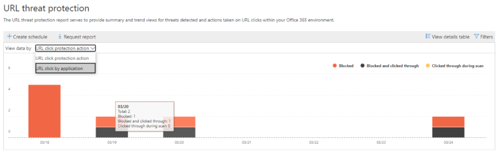
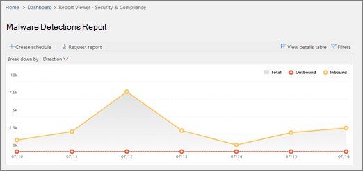
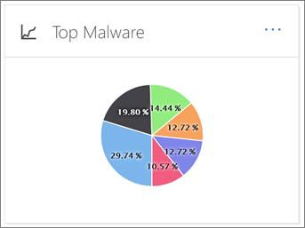
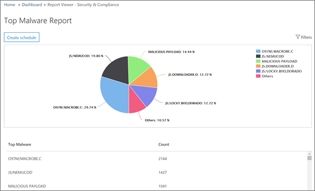
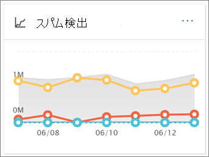
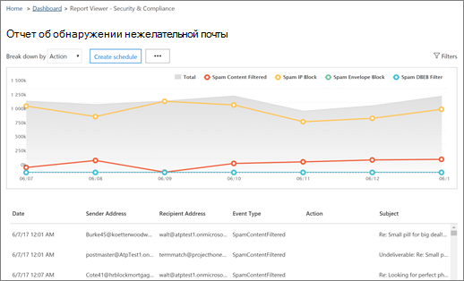
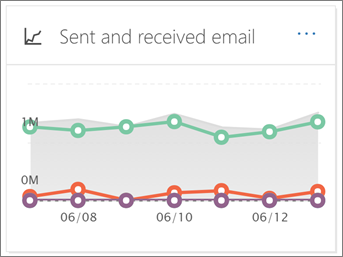

# Visa säkerhetsrapporter för &amp; e-post i SäkerhetsefterlevnadscenterView email security reports in the Security &amp; Compliance Center

Det finns en mängd olika rapporter i [Security &amp; Compliance Center](https://protection.office.com) som hjälper dig att se hur säkerhetsfunktioner för e-post, till exempel anti-spam, anti-malware och krypteringsfunktioner i Office 365 skyddar din organisation.A variety of reports are available in the [Security &amp; Compliance Center](https://protection.office.com) to help you see how email security features, such as anti-spam, anti-malware, and encryption features in Office 365 are protecting your organization. Om du har [de behörigheter som krävs](#what-permissions-are-needed-to-view-these-reports)kan &amp; du visa dessa rapporter i Säkerhetsefterlevnadscenter genom att gå till **Instrumentpanelen** **för rapporter** \> .If you have the [necessary permissions](#what-permissions-are-needed-to-view-these-reports), you can view these reports in the Security &amp; Compliance Center by going to **Reports** \> **Dashboard**.
  

  
Dina säkerhetsrapporter för e-post innehåller följande:Your email security reports include the following:
- [URL Threat Protection rapport](#url-threat-protection-report-new) **(NYHET!**)[URL Threat Protection report](#url-threat-protection-report-new) (**NEW!**)
- [Rapport över komprometterade användareCompromised Users report](#compromised-users-report)
- [KrypteringsrapportEncryption report](#encryption-report)
- [Statusrapport för hotskyddThreat Protection Status report](#threat-protection-status-report) 
- [Rapport över identifieringar av skadlig kodMalware Detections report](#malware-detections-report) 
- [Topp malware rapportTop Malware report](#top-malware-report)
- [Topprapport för avsändare och mottagareTop Senders and Recipients report](#top-senders-and-recipients-report)
- [Rapport över falska identifieringarSpoof Detections report](#spoof-detections-report)
- [Rapport om skräppostidentifieringarSpam Detections report](#spam-detections-report)
- [Skickad och mottagen e-postrapportSent and received email report](#sent-and-received-email-report)
- [Rapport över användarrapporterade meddelandenUser-reported messages report](#user-reported-messages-report)

## URL Threat Protection rapport **(NYHET!**)URL Threat Protection report (**NEW!**)

Url-rapporten för hotskydd är tillgänglig för alla med:The URL Threat Protection report is available to anyone with:

- Ett exchange online-skydd *och* avancerat hotskyddstillägg (plan 1 *eller* plan 2)An Exchange Online Protection, *and* Advanced Threat Protection add-on (Plan 1 *or* Plan 2) 
- En Microsoft 365 E5-prenumerationA Microsoft 365 E5 subscription

Detta är en klickcentrerad rapport som har två aggregerade vyer.This is a 'click-centric' report that has two aggregated views.
 
1. Den första vyn är genom *URL-klickskyddsåtgärd*, som fokuserar på att visa antalet URL-klick för användare i klienten och resultatet av klicket.The first view is by *URL click-protection action*, which is focused on showing the number of URL clicks by users within the tenant, and the result of the click. Ett klick här anger att användaren har klickat genom blocksidan till den skadliga webbplatsen (detta kan inaktiveras av administratören inom en princip för säkra länkar).A click here indicates that the user has clicked through the block page to the malicious website (this can be disabled by the administrator within a Safe Links policy).
 
2. Den andra vyn är *URL-klick för program*, som visar antalet webbadresser klickar i olika program som stöder säkra länkar idag, till exempel i en e-postklient eller i Microsoft Word.The second view is *URL click by applications*, which shows the number of URLs click in different applications that support Safe Links today, such as in an email client or in Microsoft Word. Data i båda aggregerade vyer uppdateras en gång var fjärde timme.Data in both aggregated views are refreshed once every 4 hours.

Informationstabellen i rapporten URL Threat Protection ger en vy i nästan realtid över alla klick som sker i klienten, och den innehåller undersökande information som *användarnamn*, *URL*, *nätverksmeddelande-ID* (om webbadressen klickades från ett e-postmeddelande) och annan värdefull information som är användbar för undersökningar och analyser.The details table of the URL Threat Protection report provides a near-real-time view of all clicks that happen within the tenant, and it includes investigative information such as *username*, *URL*, the *network message ID* (if the URL was clicked from an email), and other valuable pieces of information useful for investigations and analyses.  

Som standard visar rapporten bara data om klick från webbadresser som blockerades av säkra länkar, men det är också möjligt att se information för alla URL-klick genom att markera kryssrutan *Tillåtna webbadresser* i filtren.By default, the report only shows data on clicks from URLs that were blocked by Safe Links, but it is also possible to see information for all URL clicks through selecting *Allowed URLs* checkbox in the filters.  

Den här rapporten kommer inte att ha data med klick från användare där principen Säkra länkar som tillämpas har alternativet *Spåra inte användarens klick* markerat.This report will not have data of clicks from users where the Safe Links policy applied has the *Do not track user clicks* option selected.

## Rapport över komprometterade användareCompromised Users report 

Den här rapporten, som är tillgänglig för alla med Exchange Online Protection, visar antalet användarkonton som markerats som misstänkta eller begränsade användare, data som är särskilt användbara eftersom konton anger något av de tillstånd som anger att användarkontot kan vara problematiskt eller till och med komprometterat.This report, available to anyone with Exchange Online Protection, shows the number of user accounts marked as Suspicious or Restricted users, data particularly useful as accounts enter either of the states that indicate the user account may be problematic, or even compromised. Med frekvent användning kan rapporten Komprometterad användare upptäcka toppar, och till och med trender, i konton som är markerade i misstänkta eller begränsade tillstånd, vilket ger bevis för att det kan finnas ett problem med säkerheten och välbefinnandet för din klient.With frequent use, the Compromised User report can spot spikes, and even trends, in accounts marked in suspicious or restricted states, giving evidence there could be an issue with security and the wellness of your tenant.

## KrypteringsrapportEncryption report

**Krypteringsrapporten** visar information om e-postmeddelanden som har krypterats, antingen via organisationens principer eller via slutanvändarkontroller.The **Encryption report** shows information about email messages that were encrypted, either through your organization's policies, or through end-user controls. Organisationens säkerhetsteam kan använda information i den här rapporten för att identifiera mönster och proaktivt tillämpa eller justera principer för känsliga e-postmeddelanden.Your organization's security team can use information in this report to identify patterns and proactively apply or adjust policies for sensitive email messages.

Om du vill visa den här rapporten går du till rapporten **Rapporter** \> **med instrumentpanelskryptering** \> **Encryption report**i säkerhets- & compliance center .To view this report, in the Security & Compliance Center, go to **Reports** \> **Dashboard** \> **Encryption report**.

 

När rapporten öppnas första gången visas data om krypteringsmetoder som används i e-postmeddelanden under de senaste sju (7) dagarna.When the report first opens, you'll see data about encryption methods used on email messages for the past seven (7) days. Du kan ändra datumintervallet och informationen som visas i rapporten genom att klicka på **Filter** i det övre högra hörnet på skärmen.You can change the date range and the details that are displayed in the report by clicking **Filters** in the upper right corner of the screen.

   

Du kan också använda **menyn Dela upp efter** för att visa data efter krypteringsmall (eller metod).You can also use the **Break down by** menu to view data by encryption template (or method).

Och du kan använda **Visa data efter** meny för att ändra vyn för att se antalet krypterade meddelanden till de fem främsta mottagardomänerna.And, you can use the **View data by** menu to change the view to see counts of encrypted messages to the top five recipient domains.

Med flexibiliteten i den nya krypteringsrapporten kan du visa trender och vidta lämpliga åtgärder.With the flexibility of the new Encryption report, you can view trends and take appropriate actions. Om du till exempel ser ett stort antal e-postmeddelanden krypterade av användare kanske du vill lägga till en krypteringsprincip för att automatisera kryptering för vissa användningsfall.For example, if you see a high number of email messages encrypted by users, you might want to add an encryption policy to automate encryption for certain use cases. (Mer information om detta finns i [Definiera regler för e-postflöde för att kryptera e-postmeddelanden i Office 365](../../compliance/define-mail-flow-rules-to-encrypt-email.md).) Om du har ett antal krypteringsmallar tillgängliga men ingen använder dem kan du undersöka om användarna behöver utbildning för den funktionen.(To get help with that, see [Define mail flow rules to encrypt email messages in Office 365](../../compliance/define-mail-flow-rules-to-encrypt-email.md).) As another example, if you have a number of encryption templates available but no one is using them, you might explore whether users need training for that feature. 

Med hjälp av den här rapporten kan organisationens säkerhets- och efterlevnadsteam övervaka hur meddelandekryptering används och om ytterligare åtgärder behövs.Use this report enables your organization's security and compliance team to monitor how message encryption is being used, and whether further actions are needed. Mer information om kryptering finns [i E-postkryptering i Office 365](../../compliance/email-encryption.md).To learn more about encryption, see [Email encryption in Office 365](../../compliance/email-encryption.md).

## Statusrapport för hotskyddThreat Protection Status report

Rapporten **Status för hotskydd** är en smart rapport som visar skadlig e-post som har upptäckts och blockerats av Exchange Online Protection.The **Threat Protection Status** report is a smart report that shows malicious email that was detected and blocked by Exchange Online Protection. Den här rapporten är användbar för att visa e-post som identifierats som skadlig kod eller ett nätfiskeförsök över tid (upp till 90 dagar), och den gör det möjligt för säkerhetsadministratörer att identifiera trender eller avgöra om principer behöver justeras.This report is useful for viewing email identified as malware or a phishing attempt over time (up to 90 days), and it enables security administrators to identify trends or determine whether policies need adjustments.

> [!NOTE]
> En rapport om status för hotskydd är tillgänglig för kunder som har antingen [Office 365 ATP](https://docs.microsoft.com/microsoft-365/security/office-365-security/office-365-atp) eller [Exchange Online Protection](https://docs.microsoft.com/microsoft-365/security/office-365-security/what-is-eop) (EOP). Informationen som visas i rapporten Status för hotskydd för ATP-kunder innehåller dock sannolikt andra data än vad EOP-kunder kan se.A Threat Protection Status report is available to customers who have either [Office 365 ATP](https://docs.microsoft.com/microsoft-365/security/office-365-security/office-365-atp) or [Exchange Online Protection](https://docs.microsoft.com/microsoft-365/security/office-365-security/what-is-eop) (EOP); however, the information that is displayed in the Threat Protection Status report for ATP customers will likely contain different data than what EOP customers might see. EOP-kunder kan till exempel visa information om skadlig kod som identifierats i e-post, men inte information om [skadliga filer som identifierats i SharePoint Online, OneDrive eller Microsoft Teams](https://docs.microsoft.com/microsoft-365/security/office-365-security/atp-for-spo-odb-and-teams), en ATP-specifik funktion.For example, EOP customers can view information about malware detected in email, but not information about [malicious files detected in SharePoint Online, OneDrive, or Microsoft Teams](https://docs.microsoft.com/microsoft-365/security/office-365-security/atp-for-spo-odb-and-teams), an ATP-specific capability. (Läs[mer om ATP-rapporter](https://docs.microsoft.com/microsoft-365/security/office-365-security/view-reports-for-atp).)([Learn more about ATP reports](https://docs.microsoft.com/microsoft-365/security/office-365-security/view-reports-for-atp).)
  
Om du vill visa [ &amp; den](https://protection.office.com)här rapporten går du till **Rapporter om** \> **skydd av instrumentpanelshotskydd** **Dashboard** \> .To view this report, in the [Security &amp; Compliance Center](https://protection.office.com), go to **Reports** \> **Dashboard** \> **Threat Protection Status**.
  

  
När du först öppnar rapporten Status för hotskydd visar rapporten data för de senaste sju dagarna som standard. Du kan dock klicka på **Filter** och ändra datumintervallet i upp till 90 dagars detalj.When you first open the Threat Protection Status report, the report shows data for the past seven days by default; however, you can click **Filters** and change the date range for up to 90 days of detail. (Om du använder en utvärderingsprenumeration kan du vara begränsad till 30 dagars data.)(If you are using a trial subscription, you might be limited to 30 days' of data.)

Den här rapporten är användbar för att visa effektiviteten och effekten av organisationens [Exchange Online Protection-funktioner](https://docs.microsoft.com/microsoft-365/security/office-365-security/eop-features)och för långsiktiga trender.This report is useful for viewing the effectiveness and impact of your organization's [Exchange Online Protection features](https://docs.microsoft.com/microsoft-365/security/office-365-security/eop-features), and for longer-term trending. 
  

  
Du kan också välja om du vill visa data för e-post som identifierats som skadlig, e-post som identifierats som ett nätfiskeförsök eller e-post som identifierats som innehållande skadlig kod.You can also choose whether to view data for email identified as malicious, email identified as a phishing attempts, or email identified as containing malware.
  

  
## Rapport över identifieringar av skadlig kodMalware Detections report

Rapporten **Identifiering av skadlig kod** visar hur många inkommande och utgående meddelanden som har identifierats som innehållande skadlig kod för din organisation.The **Malware Detections** report shows how many incoming and outgoing messages were detected as containing malware for your organization. 
  
Om du vill visa [ &amp; den](https://protection.office.com)här rapporten går du till **Rapporter om** \> identifiering av **skadlig kod för instrumentpanelen** \> **Malware Detections**.To view this report, in the [Security &amp; Compliance Center](https://protection.office.com), go to **Reports** \> **Dashboard** \> **Malware Detections**.
  

  
I likhet med andra rapporter, till exempel [rapporten Status för hotskydd,](#threat-protection-status-report)visar rapporten data för de senaste sju dagarna som standard.Similar to other reports, like the [Threat Protection Status report](#threat-protection-status-report), the report displays data for the past seven days by default. Du kan dock välja **Filter för** att ändra datumintervallet.However, you can choose **Filters** to change the date range. 
  
## Topp malware rapportTop Malware report

Top **Malware** rapporten visar de olika typer av skadlig kod som upptäcktes av [Exchange Online](https://docs.microsoft.com/microsoft-365/security/office-365-security/eop-features).The **Top Malware** report shows the various kinds of malware that was detected by [Exchange Online](https://docs.microsoft.com/microsoft-365/security/office-365-security/eop-features). 
  
Om du vill visa [ &amp; den](https://protection.office.com)här rapporten går du till **Rapporter om** \> **instrumentpanelens** \> **övre skadlig kod**.To view this report, in the [Security &amp; Compliance Center](https://protection.office.com), go to **Reports** \> **Dashboard** \> **Top Malware**.
  

  
När du hovrar över en kil i cirkeldiagrammet kan du se namnet på en typ av skadlig kod och hur många meddelanden som har upptäckts ha den skadliga koden.When you hover over a wedge in the pie chart, you can see the name of a kind of malware and how many messages were detected as having that malware.
  
Klicka (eller tryck) på rapporten för att öppna den i ett nytt webbläsarfönster, där du kan få en mer detaljerad vy av rapporten.Click (or tap) the report to open it in a new browser window, where you can get a more detailed view of the report.
  

  
Under diagrammet visas en lista över upptäckt skadlig kod och hur många meddelanden som har upptäckts som att ha den skadliga koden.Below the chart, you'll see a list of detected malware and how many messages were detected as having that malware.
  
## Topprapport för avsändare och mottagareTop Senders and Recipients report

Rapporten **Toppavsändare och mottagare** är ett cirkeldiagram som visar dina främsta e-postavsändare.The **Top Senders and Recipients** report is a pie chart showing your top email senders. 
  
Om du vill visa [ &amp; den](https://protection.office.com)här rapporten går du till Rapporter över **avsändare och mottagare för** **instrumentpanelen** \> **Reports** \> .To view this report, in the [Security &amp; Compliance Center](https://protection.office.com), go to **Reports** \> **Dashboard** \> **Top Senders and Recipients**.
  

  
När du hovrar över en kil i cirkeldiagrammet kan du se ett antal meddelanden som skickas eller tas emot.When you hover over a wedge in the pie chart, you can see a count of messages sent or received.
  
Klicka (eller tryck) på rapporten för att öppna den i ett nytt webbläsarfönster, där du kan få en mer detaljerad vy av rapporten.Click (or tap) the report to open it in a new browser window, where you can get a more detailed view of the report.
  
Använd listan **Visa data för** att välja om du vill visa data för de främsta avsändarna, mottagarna, skräppostmottagarna och mottagarna av skadlig programvara.Use the **Show data for** list to choose whether to view data for top senders, receivers, spam recipients, and malware recipients. Du kan också se vem som fick skadlig kod som upptäcktes av [Exchange Online Protection](https://docs.microsoft.com/microsoft-365/security/office-365-security/what-is-eop).You can also see who received malware that was detected by [Exchange Online Protection](https://docs.microsoft.com/microsoft-365/security/office-365-security/what-is-eop). 
  

  
Under diagrammet ser du vilka de främsta e-postavsändarna eller mottagarna var, tillsammans med ett antal meddelanden som skickats eller tagits emot under den angivna tidsperioden.Below the chart, you'll see who the top email senders or recipients were, along with a count of messages sent or received for the given time period.
  
## Rapport över falska identifieringarSpoof Detections report

**Rapporten Spoof Detections** visar hur många falska e-postmeddelanden som upptäcktes och vilka som ansågs vara "bra" (falska e-postmeddelanden gjorda av legitima affärsskäl).The **Spoof Detections** report shows how many spoof mail messages were detected, and of those, which ones were considered "good" (spoof mail done for legitimate business reasons). 
  
Om du vill visa [ &amp; den](https://protection.office.com)här rapporten går du till **Rapporter** \> \> **instrumentpanelsspoof Mail**. **Dashboard**To view this report, in the [Security &amp; Compliance Center](https://protection.office.com), go to **Reports** \> **Dashboard** \> **Spoof Mail**.
  

  
När du hovrar över en dag i diagrammet kan du se hur många falska e-postmeddelanden som kom fram.When you hover over a day in the chart, you can see how many spoof mail messages came through.
  
Klicka (eller tryck) på rapporten för att öppna den i ett nytt webbläsarfönster, där du kan få en mer detaljerad vy av rapporten.Click (or tap) the report to open it in a new browser window, where you can get a more detailed view of the report. Mer information om skydd mot förfalskning finns i Skydd mot förfalskning [i Office 365](https://docs.microsoft.com/microsoft-365/security/office-365-security/anti-spoofing-protection).To learn more about anti-spoof protection, see [Anti-spoofing protection in Office 365](https://docs.microsoft.com/microsoft-365/security/office-365-security/anti-spoofing-protection).
  
## Rapport om skräppostidentifieringarSpam Detections report

Rapporten **Skräppostidentifieringar** visar allt skräppostinnehåll som blockeras av Exchange Online.The **Spam Detections** report shows all the spam content blocked by Exchange Online. Meddelanden räknas per meddelande och inte per mottagare.Messages are counted per message, and not per recipient. Om ett e-postmeddelande till exempel skickades till 100 mottagare i organisationen räknas det som ett meddelande.For example, if an email message was sent to 100 recipients in your organization, it is counted as one message.
  
Om du vill visa [ &amp; den](https://protection.office.com)här rapporten går du till Rapporter om \> **skräppostidentifieringar**på \> **instrumentpanelen** . **Reports**To view this report, in the [Security &amp; Compliance Center](https://protection.office.com), go to **Reports** \> **Dashboard** \> **Spam Detections**.
  

  
När du hovrar över en dag i diagrammet kan du se hur många objekt som blockerades den dagen och hur dessa objekt kategoriseras.When you hover over a day in the chart, you can see how many items were blocked that day, as well as how those items are categorized. Du kan till exempel se hur många skräppostmeddelanden som filtrerats och hur många objekt som kom från en blockerad IP-adress (Internet Protocol).For example, you can see how many spam messages were filtered, and how many items came from a blocked Internet Protocol (IP) address.
  
Klicka (eller tryck) på rapporten för att öppna den i ett nytt webbläsarfönster, där du kan få en mer detaljerad vy av rapporten.Click (or tap) the report to open it in a new browser window, where you can get a more detailed view of the report.
  

  
Under diagrammet visas en lista över skräppostobjekt som har upptäckts.Below the chart, you'll see a list of spam items that were detected. Välj ett objekt om du vill visa ytterligare information, till exempel om skräppostobjektet var inkommande eller utgående, dess meddelande-ID och dess mottagare.Select an item to view additional information, such as whether the spam item was inbound or outbound, its message ID, and its recipient. Mer information om skydd mot skräppost finns i [Office 365-skydd mot skräppost via e-post](https://docs.microsoft.com/microsoft-365/security/office-365-security/anti-spam-and-anti-malware-protection).To learn more about anti-spam protection, see [Office 365 email anti-spam protection](https://docs.microsoft.com/microsoft-365/security/office-365-security/anti-spam-and-anti-malware-protection).
  
## Skickad och mottagen e-postrapportSent and received email report

Rapporten **Skickat och mottaget e-post** är en smart rapport som visar information om inkommande och utgående e-post, inklusive skräppostidentifieringar, skadlig kod och e-post som identifierats som "bra".The **Sent and received email** report is a smart report that shows information about incoming and outgoing email, including spam detections, malware, and email identified as "good." 
  
Om du vill visa den här rapporten går du till **Instrumentpanelen för rapporter** \> **som skickats och tagits emot via e-post**i [Säkerhetsefterlevnadscenter. &amp; ](https://protection.office.com) **Dashboard** \>To view this report, in the [Security &amp; Compliance Center](https://protection.office.com), go to **Reports** \> **Dashboard** \> **Sent and received email**.
  

  
När du hovrar över en dag i diagrammet kan du se hur många meddelanden som kom in och hur dessa meddelanden kategoriseras.When you hover over a day in the chart, you can see how many messages came in, and how those messages are categorized. Du kan till exempel se hur många meddelanden som har identifierats som innehållande skadlig kod och hur många som identifierades som skräppost.For example, you can see how many messages were detected as containing malware, and how many were identified as spam.
  
Klicka (eller tryck) på rapporten för att öppna den i ett nytt webbläsarfönster, där du kan få en mer detaljerad vy av rapporten.Click (or tap) the report to open it in a new browser window, where you can get a more detailed view of the report.
  
Du kan använda listan **Dela upp efter** för att visa information efter typ eller riktning (inkommande och utgående).You can use the **Break down by** list to view information by type or by direction (incoming and outgoing). 
  

  
Under diagrammet visas en lista över e-postkategorier, till exempel **GoodMail**, **SpamContentFiltered**och så vidare.Below the chart, you'll see a list of email categories, such as **GoodMail**, **SpamContentFiltered**, and so on. Välj en kategori om du vill visa ytterligare information, till exempel åtgärder som har vidtagits för skadlig kod, och om e-post var inkommande eller utgående.Select a category to view additional information, such as actions that were taken for malware, and whether email was incoming or outgoing.
  

Mer information om e-postinformation finns [i Information om e-postflöde i Office 365](https://docs.microsoft.com/microsoft-365/security/office-365-security/mail-flow-intelligence-in-office-365).To learn more about email intelligence, see [Mail flow intelligence in Office 365](https://docs.microsoft.com/microsoft-365/security/office-365-security/mail-flow-intelligence-in-office-365).
  
## Rapport över användarrapporterade meddelandenUser-reported messages report

Rapporten Meddelanden som rapporterats av användaren visar information om **e-postmeddelanden** som användare har rapporterat som skräppost, nätfiskeförsök eller bra [e-post](https://docs.microsoft.com/microsoft-365/security/office-365-security/enable-the-report-message-add-in)med hjälp av tillägget Rapportera meddelande .The **User-reported messages** report shows information about email messages that users have reported as junk, phishing attempts, or good mail by using the [Report Message add-in](https://docs.microsoft.com/microsoft-365/security/office-365-security/enable-the-report-message-add-in).
  
Information är tillgänglig för varje meddelande, inklusive leveransorsaken, ett sådant undantag för skräppostprinciper eller e-postflödesregel som konfigurerats för din organisation.Details are available for each message, including the delivery reason, such a spam policy exception or mail flow rule configured for your organization. Om du vill visa information markerar du ett objekt i listan med användarrapporter och visar sedan informationen på flikarna **Sammanfattning** och **Information.**To view details, select an item in the user-reports list, and then view the information on the **Summary** and **Details** tabs. 
  

  
Så här visar du den här rapporten i [Security &amp; Compliance Center:](https://protection.office.com)To view this report, in the [Security &amp; Compliance Center](https://protection.office.com), do one of the following:
  
- Gå till **Dashboard** \> **Användarrapporterade meddelanden**för **hothanteringshantering** \> .Go to **Threat management** \> **Dashboard** \> **User-reported messages**.
    
- Gå till **Hothantering** \> **Granska** \> **användarrapporterade meddelanden**.Go to **Threat management** \> **Review** \> **User-reported messages**.
    

  
> [!IMPORTANT]
> För att rapporten Användarrapporterade meddelanden ska fungera korrekt **måste granskningsloggning vara aktiverat** för Office 365-miljön.In order for the User-reported messages report to work correctly, **audit logging must be turned on** for your Office 365 environment. Detta görs vanligtvis av någon som har rollen Granskningsloggar tilldelad i Exchange Online.This is typically done by someone who has the Audit Logs role assigned in Exchange Online. Du kan läsa mer i [Aktivera och inaktivera granskningsloggsökning för Office 365](https://docs.microsoft.com/microsoft-365/compliance/turn-audit-log-search-on-or-off).For more information, see [Turn Office 365 audit log search on or off](https://docs.microsoft.com/microsoft-365/compliance/turn-audit-log-search-on-or-off). 
  
## Vilka behörigheter behövs för att visa dessa rapporter?What permissions are needed to view these reports?

Om du vill visa och använda de rapporter som beskrivs i den här artikeln **måste du ha tilldelat en lämplig roll för både Security &amp; Compliance Center och Administrationscenter för Exchange**.In order to view and use the reports described in this article, **you must have an appropriate role assigned for both the Security &amp; Compliance Center and the Exchange admin center**.

- För Säkerhetsefterlevnadscenter &amp; måste du ha tilldelat en av följande roller:For the Security &amp; Compliance Center, you must have one of the following roles assigned:
    - OrganisationshanteringOrganization Management
    - Säkerhetsadministratör (detta kan tilldelas i Azure Active[https://aad.portal.azure.com](https://aad.portal.azure.com)Directory admin center ( )Security Administrator (this can be assigned in the Azure Active Directory admin center ([https://aad.portal.azure.com](https://aad.portal.azure.com))
    - SäkerhetsläsareSecurity Reader

- För Exchange Online måste du ha någon av följande roller tilldelad i administrationscentret för Exchange ([https://outlook.office365.com/ecp](https://outlook.office365.com/ecp)) eller med PowerShell-cmdletar (Se Exchange Online [PowerShell):](https://docs.microsoft.com/powershell/exchange/exchange-online/exchange-online-powershell?view=exchange-ps)For Exchange Online, you must have one of the following roles assigned in either the Exchange admin center ([https://outlook.office365.com/ecp](https://outlook.office365.com/ecp)) or with PowerShell cmdlets (See [Exchange Online PowerShell](https://docs.microsoft.com/powershell/exchange/exchange-online/exchange-online-powershell?view=exchange-ps)):
    - OrganisationshanteringOrganization Management
    - Organisationshantering endast för vyView-only Organization Management
    - Rollen Endast visa mottagareView-Only Recipients role
    - Hantering av efterlevnadCompliance Management

Mer information finns i följande resurser:To learn more, see the following resources:

- [Permissions in the Office 365 Security &amp; Compliance CenterPermissions in the Office 365 Security &amp; Compliance Center](https://docs.microsoft.com/microsoft-365/security/office-365-security/permissions-in-the-security-and-compliance-center)

- [Funktionsbehörigheter i Exchange OnlineFeature permissions in Exchange Online](https://docs.microsoft.com/exchange/permissions-exo/feature-permissions)
   
   
## Vad händer om rapporterna inte visar data?What if the reports aren't showing data?

Om du inte ser data i dina rapporter dubbelkollar du att dina principer är korrekt konfigurerade.If you are not seeing data in your reports, double-check that your policies are set up correctly. Mer information finns [i Skydda mot hot i Office 365](https://docs.microsoft.com/microsoft-365/security/office-365-security/protect-against-threats).To learn more, see [Protect against threats in Office 365](https://docs.microsoft.com/microsoft-365/security/office-365-security/protect-against-threats).
  
## Relaterade ämnenRelated topics

[Skydd mot skräppost för e-post i Office 365Office 365 Email Anti-Spam Protection](https://docs.microsoft.com/microsoft-365/security/office-365-security/anti-spam-and-anti-malware-protection)
  
[Rapporter och insikter i Office 365 Security &amp; Compliance CenterReports and insights in the Office 365 Security &amp; Compliance Center](https://docs.microsoft.com/microsoft-365/security/office-365-security/reports-and-insights-in-security-and-compliance)
  
[Skapa ett schema för en &amp; rapport i SäkerhetsefterlevnadscenterCreate a schedule for a report in the Security &amp; Compliance Center](https://docs.microsoft.com/microsoft-365/security/office-365-security/create-a-schedule-for-a-report)
  
[Konfigurera och hämta en anpassad &amp; rapport i Security Compliance CenterSet up and download a custom report in the Security &amp; Compliance Center](https://docs.microsoft.com/microsoft-365/security/office-365-security/set-up-and-download-a-custom-report)
  

