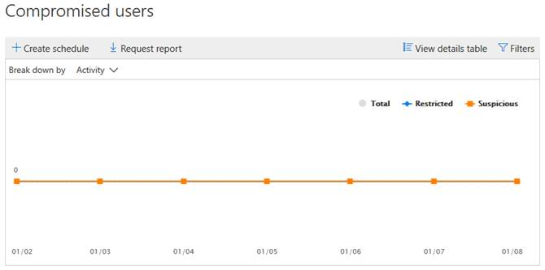

# Visa rapporter om e-postsäkerhet i Säkerhets- och efterlevnadscenterView email security reports in the Security & Compliance Center

En mängd olika rapporter finns i [Security & Compliance Center](https://protection.office.com) för att hjälpa dig att se hur säkerhetsfunktioner för e-post, till exempel anti-spam, anti-malware och krypteringsfunktioner i Microsoft 365 skyddar din organisation.A variety of reports are available in the [Security & Compliance Center](https://protection.office.com) to help you see how email security features, such as anti-spam, anti-malware, and encryption features in Microsoft 365 are protecting your organization. Om du har [de behörigheter som krävs](#what-permissions-are-needed-to-view-these-reports)kan du visa dessa rapporter i Security & Compliance Center genom att gå till **Reports** \> **Instrumentpanelen**för rapporter .If you have the [necessary permissions](#what-permissions-are-needed-to-view-these-reports), you can view these reports in the Security & Compliance Center by going to **Reports** \> **Dashboard**. Om du vill gå direkt till instrumentpanelen för rapporter öppnar du <https://protection.office.com/insightdashboard> .To go directly to the reports dashboard, open <https://protection.office.com/insightdashboard>.

## Rapport över komprometterade användareCompromised users report

Rapporten **Komprometterade användare** visar antalet användarkonton som har markerats som **misstänkta** eller **begränsade** under de senaste 7 dagarna.The **Compromised users** report shows shows the number of user accounts that were marked as **Suspicious** or **Restricted** within the last 7 days. Konton i någon av dessa stater är problematiska eller till och med komprometterade.Accounts in either of these states are problematic or even compromised. Med frekvent användning kan du använda rapporten för att upptäcka toppar och till och med trender i misstänkta eller begränsade konton.With frequent use, you can use the report to spot spikes, and even trends, in suspicious or restricted accounts. Mer information om komprometterade användare finns i [Svara på ett komprometterat e-postkonto](responding-to-a-compromised-email-account.md).For more information about compromised users, see [Responding to a compromised email account](responding-to-a-compromised-email-account.md).

Den samlade vyn visar data för de senaste 90 dagarna och detaljvyn visar data för de senaste 30 dagarna.The aggregate view shows data for the last 90 days and the detail view shows data for the last 30 days.

Om du vill visa rapporten öppnar du [Security & Compliance Center](https://protection.office.com), går till **Instrumentpanelen för rapporter** och väljer \> **Dashboard** **Komprometterade användare**.To view the report, open the [Security & Compliance Center](https://protection.office.com), go to **Reports** \> **Dashboard** and select **Compromised users**. Öppna om du vill gå direkt till rapporten <https://protection.office.com/reportv2?id=CompromisedUsers> .To go directly to the report, open <https://protection.office.com/reportv2?id=CompromisedUsers>.

Du kan filtrera både diagrammet och informationstabellen genom att klicka på **Filter** och välja ett eller flera av följande värden:You can filter both the chart and the details table by clicking **Filters** and selecting one or more of the following values:

- **Startdatum** och **slutdatum****Start date** and **End date**

- **Misstänkt**: Användarkontot har skickat misstänkt e-post och riskerar att begränsas från att skicka e-post.**Suspicious**: The user account has sent suspicious email and is at risk of being restricted from sending email.

- **Begränsad**: Användarkontot har begränsats från att skicka e-post på grund av mycket misstänkta mönster.**Restricted**: The user account has been restricted from sending email due to highly suspicious patterns.

Om du klickar på **Visa informationstabell**kan du se följande information:If you click **View details table**, you can see the following details:

- **Skapa tid****Creation time**
- **Användar-ID****User ID**
- **Åtgärder****Action**

Om du vill gå tillbaka till rapportvyn klickar du på **Visa rapport**.To go back to the report view, click **View report**.

## KrypteringsrapportEncryption report

**Krypteringsrapporten** är tillgänglig i EOP (prenumerationer med postlådor i Exchange Online eller fristående EOP utan Exchange Online-postlådor).The **Encryption report** is available in EOP (subscriptions with mailboxes in Exchange Online or standalone EOP without Exchange Online mailboxes). Organisationens säkerhetsteam kan använda information i den här rapporten för att identifiera mönster och proaktivt tillämpa eller justera principer för känsliga e-postmeddelanden.Your organization's security team can use information in this report to identify patterns and proactively apply or adjust policies for sensitive email messages. Till exempel:For example:

- Om du ser ett stort antal e-postmeddelanden krypterade av användare kanske du vill lägga till en krypteringsprincip för att automatisera kryptering för vissa användningsfall.If you see a high number of email messages encrypted by users, you might want to add an encryption policy to automate encryption for certain use cases. Mer information finns i [Definiera regler för e-postflöde för att kryptera e-postmeddelanden i Microsoft 365](../../compliance/define-mail-flow-rules-to-encrypt-email.md).For more information, see [Define mail flow rules to encrypt email messages in Microsoft 365](../../compliance/define-mail-flow-rules-to-encrypt-email.md).

- Om du har ett antal krypteringsmallar tillgängliga men ingen använder dem kan du undersöka om användarna behöver funktionsutbildning.If you have a number of encryption templates available but no one is using them, you might explore whether users need feature training.

Den sammanlagda vyn tillåter filtrering för de senaste 90 dagarna, medan detaljvyn tillåter filtrering i 10 dagar.The aggregate view allows filtering for the last 90 days, while the detail view allows filtering for 10 days.

Om du vill visa rapporten öppnar du [Security & Compliance Center](https://protection.office.com), går till **Instrumentpanelen rapporter** och väljer \> **Dashboard** **Krypteringsrapport**.To view the report, open the [Security & Compliance Center](https://protection.office.com), go to **Reports** \> **Dashboard** and select **Encryption report**. Öppna om du vill gå direkt till rapporten <https://protection.office.com/reportv2?id=EncryptionReport> .To go directly to the report, open <https://protection.office.com/reportv2?id=EncryptionReport>.

Mer information om kryptering finns [i E-postkryptering i Microsoft 365](../../compliance/email-encryption.md).To learn more about encryption, see [Email encryption in Microsoft 365](../../compliance/email-encryption.md).

### Rapportvy för krypteringsrapportenReport view for the Encryption report

Du kan använda följande filter i diagrammet:You can use the following filters on the chart:

- **Visa data efter: Meddelandekrypteringsrapport** och **Bryt ned efter: Krypteringsmetod:** Följande krypteringsmetoder är tillgängliga:**View data by: Message Encryption Report** and **Break down by: Encryption method**: The following encryption methods are available:

  - **Kryptering per användare****Encryption by user**
  - **Kryptering efter princip****Encryption by policy**

  Om du klickar på **Filter**kan du ändra diagrammet med följande filter:If you click **Filters**, you can modify the chart with the following filters:

  - **Startdatum** och **slutdatum****Start date** and **End date**
  - Krypteringsmetod.Encryption method.
  - Krypteringsmall.Encryption template.

- **Visa data efter: Meddelandekrypteringsrapport** och **Bryt ned efter: Krypteringsmall:** Följande krypteringsmetoder är tillgängliga:**View data by: Message Encryption Report** and **Break down by: Encryption template**: The following encryption methods are available:

  - **Vidarebefordra inte****Do not forward**
  - **Endast kryptera****Encrypt only**
  - **OME tidigare****OME previous**
  - **Anpassade****Custom**

  Om du klickar på **Filter**kan du ändra diagrammet med följande filter:If you click **Filters**, you can modify the chart with the following filters:

  - **Startdatum** och **slutdatum****Start date** and **End date**
  - KrypteringsmetodEncryption method
  - Mall för krypteringEncryption template

- **Visa data efter: Topp 5-mottagare:** I den här vyn visas ett cirkeldiagram med skickade meddelandeantal för de fem översta mottagardomänerna.**View data by: Top 5 recipient domains**: This view shows a pie chart with sent message counts for the top 5 recipient domains.

  Om du klickar på **Filter**kan du välja ett **startdatum** och **slutdatum**.If you click **Filters**, you can select a **Start date** and **End date**.

### Tabellvy för information för krypteringsrapportenDetails table view for the Encryption report

Om du klickar på **Visa informationstabell**beror informationen som visas på vilket diagram du tittade på:If you click **View details table**, the information that's shown depends on the chart you were looking at:

- **Bryt ned efter: Krypteringsmetod** eller **Bryt ned efter: Krypteringsmall**: Följande information visas:**Break down by: Encryption method** or **Break down by: Encryption template**: The following information is shown:

  - **Datum****Date**
  - **Avsändarens adress****Sender address**
  - **Mall för kryptering****Encryption template**
  - **Krypteringsmetod****Encryption method**
  - **Mottagaradress****Recipient address**
  - **Ämne****Subject**

- **Visa data efter: Topp 5-mottagare:****View data by: Top 5 recipient domains**:

  - **Datum****Date**
  - **Mottagardomän****Recipient domain**
  - **Antal meddelanden****Message count**
  
Om du klickar på **Filter** i en detaljtabellvy kan du ändra resultaten med följande filter:If you click **Filters** in a details table view, you can modify the results with the following filters:

- **Startdatum** och **slutdatum****Start date** and **End date**
- KrypteringsmetodEncryption method
- Mall för krypteringEncryption template

Om du vill gå tillbaka till rapportvyn klickar du på **Visa rapport**.To go back to the report view, click **View report**.

## Statusrapport för e-postflödeMailflow status report

**Statusrapporten för Mailflow** innehåller information om meddelanden om skadlig kod, skräppost, nätfiske och kantblockerade meddelanden.The **Mailflow status report** contains information about malware, spam, phishing and edge blocked messages. Mer information finns i [Statusrapport för Mailflow](view-mail-flow-reports.md#mailflow-status-report).For more details, see [Mailflow status report](view-mail-flow-reports.md#mailflow-status-report).

## Identifiering av skadlig kod i e-postrapportMalware detection in email report

Identifieringen **av skadlig kod i e-postrapporten** visar information om identifiering av skadlig kod i inkommande och utgående e-postmeddelanden (skadlig kod som upptäckts av Exchange Online Protection eller EOP).The **Malware detections in email** report shows information about malware detections in incoming and outgoing email messages (malware detected by Exchange Online Protection or EOP). Mer information om skydd mot skadlig programvara i EOP finns [i Skydd mot skadlig kod i EOP](anti-malware-protection.md).For more information about malware protection in EOP, see [Anti-malware protection in EOP](anti-malware-protection.md).

 Det sammanlagda vyfiltret tillåter 90 dagar, medan detaljtabellfiltret bara tillåter 10 dagar.The aggregate view filter allows for 90 days, while the details table filter only allows for 10 days.

Om du vill visa rapporten öppnar du [Security & Compliance Center,](https://protection.office.com)går till **Instrumentpanelen för rapporter** och väljer Identifiering av skadlig kod i \> **Dashboard** **e-post**.To view the report, open the [Security & Compliance Center](https://protection.office.com), go to **Reports** \> **Dashboard** and select **Malware detections in email**. Öppna om du vill gå direkt till rapporten <https://protection.office.com/reportv2?id=MalwareDetections> .To go directly to the report, open <https://protection.office.com/reportv2?id=MalwareDetections>.

Du kan filtrera både diagrammet och informationstabellen genom att klicka på **Filter** och välja:You can filter both the chart and the details table by clicking **Filters** and selecting:

- **Startdatum** och **slutdatum****Start date** and **End date**
- **Inkommande****Inbound**
- **Utgående****Outbound**

Om du klickar på **Visa informationstabell**kan du se följande information:If you click **View details table**, you can see the following details:

- **Datum****Date**
- **Avsändarens adress****Sender address**
- **Mottagaradress****Recipient address**
- **Meddelande-ID****Message ID**
- **Ämne****Subject**
- **Filnamn****Filename**
- **Namn på skadlig kod****Malware name**

Om du vill gå tillbaka till rapportvyn klickar du på **Visa rapport**.To go back to the report view, click **View report**.

## Skickad och mottagen e-postrapportSent and received email report

Rapporten **Skickat och mottaget e-post** innehåller information om skadlig kod, skräppost, regler för e-postflöde (kallas även transportregler) och avancerade identifieringar av skadlig kod när e-post kommer in i tjänsten.The **Sent and received email** report contains information about malware, spam, mail flow rules (also known as transport rules), and advanced malware detections after email enters the service. Mer information finns i [Skicka och mottagen e-postrapport](view-mail-flow-reports.md#sent-and-received-email-report).For more information, see [Sent and received email report](view-mail-flow-reports.md#sent-and-received-email-report).

## Rapport om identifiering av skräppostSpam detections report

Rapporten **Skräppostidentifiering visar** skräppostmeddelanden som blockerades av EOP.The **Spam detections** report shows spam email messages that were blocked by EOP. Meddelanden räknas individuellt, inte per mottagare.Messages are counted individually, not per recipient. Om till exempel samma skräppostmeddelande skickades till 100 mottagare i organisationen räknas det som ett meddelande.For example, if the same spam message was sent to 100 recipients in your organization, it counts as one message.

Den sammanlagda vyn tillåter 90 dagars filtrering, medan informationstabellen tillåter 10 dagars filtrering.The aggregate view allows for 90 days filtering, while the details table allows for 10 days filtering.

Om du vill visa rapporten öppnar du [Security & Compliance Center,](https://protection.office.com)går till **Instrumentpanelen för rapporter** och väljer \> **Dashboard** **Skräppostidentifieringar**.To view the report, open the [Security & Compliance Center](https://protection.office.com), go to **Reports** \> **Dashboard** and select **Spam detections**. Öppna om du vill gå direkt till rapporten <https://protection.office.com/reportv2?id=SpamDetections> .To go directly to the report, open <https://protection.office.com/reportv2?id=SpamDetections>.

Mer information om skydd mot skräppost finns [i Skydd mot skräppost i EOP](anti-spam-protection.md).For more information about anti-spam protection, see [Anti-spam protection in EOP](anti-spam-protection.md).

### Rapportvy för rapporten SkräppostidentifieringReport view for the Spam detections report

Följande diagram är tillgängliga i rapportvyn:The following charts are available in the report view:

- **Bryt ned efter: Åtgärd:** Följande händelsetyper visas:**Break down by: Action**: The following event types are shown:

  - **Filtrerat spaminnehåll****Spam content filtered**
  - **Spam IP-block****Spam IP block**
  - **Block av kuvert för skräppost****Spam envelope block**
  - **Spam DBEB filter:** Katalog baserad kant blockering (DBEB)**Spam DBEB filter**: Directory based edge blocking (DBEB)

  När du hovrar över en dag (datapunkt) i diagrammet kan du se hur många objekt som blockerades den dagen och hur dessa objekt kategoriseras.When you hover over a day (data point) in the chart, you can see how many items were blocked that day, as well as how those items are categorized.

  

- **Bryt ned efter:Riktning**: Följande anvisningar visas:**Break down by:Direction**: The following directions are shown:

  - **Inkommande****Inbound**
  - **Utgående****Outbound**

Om du klickar på **Filter** i en rapportvy kan du ändra resultaten med följande filter:If you click **Filters** in a report view, you can modify the results with the following filters:

- **Startdatum** och **slutdatum****Start date** and **End date**
- RiktningsvärdenDirection values
- Värden för händelsetypEvent type values

### Informationstabellvy för rapporten SkräppostidentifieringDetails table view for the Spam detections report

Om du klickar på **Visa informationstabell** i en rapportvy visas följande information:If you click **View details table** in any report view, the following information is shown:

- **Datum****Date**
- **Avsändarens adress****Sender address**
- **Mottagaradress****Recipient address**
- **Händelsetyp****Event type**
- **Åtgärder****Action**
- **Ämne****Subject**

Om du klickar på **Filter** i en informationstabell kan du ändra resultaten med följande filter:If you click **Filters** in a details table, you can modify the results with the following filters:

- **Startdatum** och **slutdatum****Start date** and **End date**
- RiktningsvärdenDirection values
- Värden för händelsetypEvent type values

Om du vill gå tillbaka till rapportvyn klickar du på **Visa rapport**.To go back to the report view, click **View report**.

## Rapport över förfalskningarSpoof detections report

Rapporten **Spoof detections** visar hur många falska e-postmeddelanden som upptäcktes och vilka som ansågs vara "bra" (falska e-postmeddelanden gjorda av legitima affärsmässiga skäl).The **Spoof detections** report shows how many spoof mail messages were detected, and of those, which ones were considered "good" (spoof mail done for legitimate business reasons). För mer information om förfalskning, se [Anti-spoofing skydd i EOP](anti-spoofing-protection.md).For more information about spoofing, see [Anti-spoofing protection in EOP](anti-spoofing-protection.md).

Den samlade vyn av rapporten tillåter 90 dagars filtrering, medan detaljvyn endast tillåter tio dagars filtrering.The aggregate view of the report allows for 90 days of filtering, while the detail view only allows for ten days of filtering.

Om du vill visa rapporten öppnar du [Security & Compliance Center,](https://protection.office.com)går till **Instrumentpanelen för rapporter** och väljer \> **Dashboard** **Spoof-identifieringar**.To view the report, open the [Security & Compliance Center](https://protection.office.com), go to **Reports** \> **Dashboard** and select **Spoof detections**. Öppna om du vill gå direkt till rapporten <https://protection.office.com/reportv2?id=SpoofMailReport> .To go directly to the report, open <https://protection.office.com/reportv2?id=SpoofMailReport>.

När du hovrar över en dag (datapunkt) i diagrammet kan du se hur många falska e-postmeddelanden som kom fram.When you hover over a day (data point) in the chart, you can see how many spoof mail messages came through.

Du kan filtrera både diagrammet och informationstabellen genom att klicka på **Filter** och välja ett eller flera av följande värden:You can filter both the chart and the details table by clicking **Filters** and selecting one or more of the following values:

- **Startdatum** och **slutdatum****Start date** and **End date**

- **Bra post****Good mail**

- **Fångad som skräppost****Caught as spam**

Om du klickar på **Visa informationstabell**kan du se följande information:If you click **View details table**, you can see the following details:

- **Datum****Date**
- **Förfalskad avsändare****Spoofed sender**
- **Sann avsändare****True sender**
- **IP-adress för avsändare****Sender IP**
- **Åtgärder****Action**
- **Antal meddelanden****Message count**

Om du vill gå tillbaka till rapportvyn klickar du på **Visa rapport**.To go back to the report view, click **View report**.

## Statusrapport för hotskyddThreat protection status report

**Statusrapporten för hotskydd** är tillgänglig i både EOP och Office 365 ATP. Rapporterna innehåller dock olika data.The **Threat protection status** report is available in both EOP and Office 365 ATP; however, the reports contain different data. EOP-kunder kan till exempel visa information om skadlig kod som identifierats i e-post, men inte information om [skadliga filer som identifierats i SharePoint Online, OneDrive eller Microsoft Teams](atp-for-spo-odb-and-teams.md).For example, EOP customers can view information about malware detected in email, but not information about [malicious files detected in SharePoint Online, OneDrive, or Microsoft Teams](atp-for-spo-odb-and-teams.md). Mer information om Office 365 ATP-rapporter finns i [Visa rapporter för avancerat skydd mot office 365](view-reports-for-atp.md).For more information about Office 365 ATP reports, see [View reports for Office 365 Advanced Threat Protection](view-reports-for-atp.md).

Det här är en smart rapport som visar skadlig e-post som har identifierats och blockerats, och den gör det möjligt för säkerhetsadministratörer att identifiera trender eller avgöra om organisationsprinciper behöver justeras.This is a smart report that shows malicious email that was detected and blocked, and it enables security admins to identify trends or determine whether organization policies need adjustment.

Om du vill visa rapporten öppnar du [Security & Compliance Center](https://protection.office.com), går till **Instrumentpanelen för rapporter** och väljer Status för skydd mot \> **Dashboard** **hot**.To view the report, open the [Security & Compliance Center](https://protection.office.com), go to **Reports** \> **Dashboard** and select **Threat protection status**. Öppna om du vill gå direkt till rapporten <https://protection.office.com/reportv2?id=ATPV2AggregateReport> .To go directly to the report, open <https://protection.office.com/reportv2?id=ATPV2AggregateReport>.

Som standard visar diagrammet data för de senaste 7 dagarna.By default, the chart shows data for the past 7 days. Om du klickar på **Filter**kan du välja ett datumintervall på 90 dagar (utvärderingsprenumerationer kan vara begränsade till 30 dagar).If you click **Filters**, you can select a 90 day date range (trial subscriptions might be limited to 30 days). I detaljtabellvyn kan filtrering filtreras i 30 dagar.The details table view allows filtering for 30 days.

### Rapportvy för statusrapporten för hotskyddReport view for the Threat protection status report

Följande vyer är tillgängliga:The following views are available:

- **Visa data efter: Översikt**: Följande identifieringsinformation visas:**View data by: Overview**: The following detection information is shown:

  - **Skadlig e-post****Email malware**
  - **E-post phish****Email phish**
  - **Skadlig kod för innehåll****Content malware**

- **Visa data efter: Innehåll \> Skadlig kod:** Följande information visas:**View data by: Content \> Malware**: The following information is shown:

  - **Anti-malware motor****Anti-malware engine**
  - **Fildetonation****File detonation**

- **Bryt ner av: Detektionsteknik** och **Visa data efter: E-post \> Phish:** Följande information visas:**Break down by: Detection technology** and **View data by: Email \> Phish**: The following information is shown:

  - **ATP-genererat URL-rykte**\***ATP-generated URL reputation**\*
  - **Avancerat phish-filter**\***Advanced phish filter**\*
  - **Anti-parodi: DMARC misslyckande****Anti-spoof: DMARC failure**
  - **Anti-parodi: Intra-org****Anti-spoof: Intra-org**
  - **Anti-parodi: extern domän****Anti-spoof: external domain**
  - **Varumärke personifiering**\***Brand impersonation**\*
  - **Personifiering av domän**\***Domain impersonation**\*
  - **EOP URL rykte****EOP URL reputation**
  - **Allmänt phish-filter****General phish filter**
  - **Andra****Others**
  - **Phish ZAP**\*\***Phish ZAP**\*\*
  - **URL detonation**\*\***URL detonation**\*\*
  - **Personifiering av användare**\***User Impersonation**\*

- **Bryt ner av: Detektionsteknik** och \*\*Visa data efter: E Malware: \> \*\*Följande information visas:**Break down by: Detection technology** and **View data by: Email \> Malware**: The following information is shown:

  - **ATP-genererat filrykte**\*\***ATP-generated file reputation**\*\*
  - **Anti-malware motor****Anti-malware engine**
  - **Filtypsblock för skadlig kod****Anti-malware policy file type block**
  - **Fildetonation**\*\***File detonation**\*\*
  - **Rykte om skadliga filer****Malicious file reputation**
  - \*\*Malware ZAP\*\*\*\*\*\*\*\*Malware ZAP\*\*\*\*\*\*
  - **Andra****Others**

- **Bryt ned efter: Principtyp** och **Visa data efter: E-post \> Phish** eller \*\*Visa data efter: E Malware: \> \*\*Följande information visas:**Break down by: Policy type** and **View data by: Email \> Phish** or **View data by: Email \> Malware**: The following information is shown:

  - **Anti-malware**\*\***Anti-malware**\*\*
  - **Säker fastsättning**\*\***Safe Attachment**\*\*
  - **Anti-phish (anti-phish)****Anti-phish**
  - **Anti-spam****Anti-spam**
  - **Regel för e-postflöde** (kallas även transportregel)**Mail flow rule** (also known as a transport rule)
  - **Andra****Others**

- **Bryt ner efter: Leveransstatus** och **Visa data efter: E-post \> Phish** eller \*\*Visa data av: E Malware: \> \*\*Följande information visas:**Break down by: Delivery status** and **View data by: Email \> Phish** or **View data by: Email \> Malware**: The following information is shown:

  - **Leveransen misslyckades****Delivery failed**
  - **Tappade****Dropped**
  - **Vidarebefordras****Forwarded**
  - **Värdpostlåda: Anpassad mapp****Hosted mailbox: Custom folder**
  - **Värdpostlåda: Borttagna objekt****Hosted mailbox: Deleted items**
  - **Värdpostlåda: Inkorg****Hosted mailbox: Inbox**
  - **Värdpostlåda: Skräppost****Hosted mailbox: Junk**
  - **Lokal server: Levererad****On-premises server: Delivered**
  - **Karantän****Quarantine**

\*Endast Office 365 ATP\* Office 365 ATP only

\*\*Zero-hour auto purge (ZAP) är inte tillgängligt i fristående EOP (det fungerar bara i Exchange Online-postlådor).\*\*Zero-hour auto purge (ZAP) isn't available in standalone EOP (it only works in Exchange Online mailboxes).

Om du klickar på **Filter**kan du ändra rapporten med följande filter:If you click **Filters**, you can modify the report with the following filters:

- **Startdatum** och **slutdatum****Start date** and **End date**
- IdentifieringsvärdeDetection value
- **Skyddad av** (endast Office 365 ATP): **ATP** eller **EOP**.**Protected by** (Office 365 ATP only): **ATP** or **EOP**. Observera att den här filterbara egenskapen inte är tillgänglig i **Visa data efter: Content \> Malware**.Note that this filterable property isn't available in **View data by: Content \> Malware**.

### Informationstabellvy för statusrapporten för hotskyddDetails table view for the Threat protection status report

Om du klickar på **Visa informationstabell**beror informationen som visas på vilket diagram du tittade på:If you click **View details table**, the information that's shown depends on the chart you were looking at:

- **Visa data efter: Innehåll \> Skadlig kod:****View data by: Content \> Malware**:

- **Datum****Date**
- **Plats****Location**
- **Regisserad av****Directed by**
- **Namn på skadlig kod****Malware name**

- **Visa data efter: Översikt**: **Knappen Ingen visa information tabell** är tillgänglig.**View data by: Overview**: No **View details table** button is available.

- Alla andra diagram:All other charts:

  - **Datum****Date**
  - **Ämne****Subject**
  - **Avsändare****Sender**
  - **Mottagare****Recipients**
  - **Regisserad av****Directed by**
  - **Leveransstatus****Delivery status**
  - **Källa till kompromisser****Source of compromise**

Om du klickar på **Filter**kan du ändra rapporten med följande filter:If you click **Filters**, you can modify the report with the following filters:

- **Startdatum** och **slutdatum****Start date** and **End date**
- IdentifieringsvärdeDetection value
- **Skyddad av** (endast Office 365 ATP): **ATP** eller **EOP**.**Protected by** (Office 365 ATP only): **ATP** or **EOP**. Observera att den här filterbara egenskapen inte är tillgänglig i **Visa data efter: Content \> Malware**.Note that this filterable property isn't available in **View data by: Content \> Malware**.

## Topprapport för skadlig kodTop malware report

**Top Malware** rapporten visar olika typer av skadlig kod som upptäcktes av [EOP](eop-features.md).The **Top Malware** report shows the various kinds of malware that was detected by [EOP](eop-features.md).

Om du vill visa rapporten öppnar du [Security & Compliance Center](https://protection.office.com), går till **Instrumentpanelen för rapporter** och väljer Topp skadlig \> **Dashboard** **kod**.To view the report, open the [Security & Compliance Center](https://protection.office.com), go to **Reports** \> **Dashboard** and select **Top malware**. Öppna om du vill gå direkt till rapporten <https://protection.office.com/reportv2?id=TopMalwaret> .To go directly to the report, open <https://protection.office.com/reportv2?id=TopMalwaret>.

När du hovrar över en kil i cirkeldiagrammet kan du se namnet på en typ av skadlig kod och hur många meddelanden som har upptäckts ha den skadliga koden.When you hover over a wedge in the pie chart, you can see the name of a kind of malware and how many messages were detected as having that malware.

Klicka (eller tryck) på rapporten för att öppna den i ett nytt webbläsarfönster, där du kan få en mer detaljerad vy av rapporten.Click (or tap) the report to open it in a new browser window, where you can get a more detailed view of the report.

Under diagrammet visas en lista över upptäckt skadlig kod och hur många meddelanden som har upptäckts som att ha den skadliga koden.Below the chart, you'll see a list of detected malware and how many messages were detected as having that malware. Observera att den sammanlagda vyn endast tillåter filtrering i 90 dagar.Note that the aggregate view only allows for 90 days filtering.

## Rapport om skydd av URL-hotURL threat protection report

Widgeten för den här rapporten heter **URL-skyddsrapport** på instrumentpanelen för rapporter och är endast tillgänglig i Office 365 Advanced Threat Protection (ATP).The widget for this report is named **URL protection report** on the reports dashboard, and is only available in Office 365 Advanced Threat Protection (ATP). Specifikt:Specifically:

- En Microsoft 365 E5-prenumeration.A Microsoft 365 E5 subscription.
- Ett tillägg för avancerat skydd mot hot (Plan 1 *eller* Plan 2) till en annan prenumeration som inkluderar Exchange Online Protection (EOP).An Advanced Threat Protection add-on (Plan 1 *or* Plan 2) to any other subscription that includes Exchange Online Protection (EOP).

Om du vill gå direkt till rapporten **om skydd mot URL-hot** öppnar du <https://protection.office.com/reportv2?id=URLProtectionActionReport> .To go directly to the **URL threat protection** report, open <https://protection.office.com/reportv2?id=URLProtectionActionReport>.

> [!NOTE]
> Den här rapporten kommer inte att ha klickdata från användare där principen Säkra länkar tillämpas har alternativet **Spåra inte användarens klick** markerat.This report will not have click data from users where the Safe Links policy applied has the **Do not track user clicks** option selected.

### Rapportvy för rapporten om skydd mot URL-hotReport view for the URL threat protection report

**Url-hotskyddsrapporten** har två aggregerade vyer som uppdateras en gång var fjärde timme som visar data för de senaste 90 dagarna:The **URL threat protection** report has two aggregated views that are refreshed once every four hours that shows data for the last 90 days:

- **URL klicka skydd åtgärd**: Visar antalet URL klick av användare i organisationen och resultatet av klick:**URL click protection action**: Shows the number of URL clicks by users in the organization and the results of the click:

  - **Blockerade****Blocked**
  - **Blockerad och klickad igenom****Blocked and clicked through**
  - **Klickade igenom under genomsökningen****Clicked through during scan**

  Ett klick anger att användaren har klickat sig igenom blocksidan till den skadliga webbplatsen (administratörer kan inaktivera klickning i principer för säkra länkar).A click indicates that the user has clicked through the block page to the malicious website (admins can disable click through in Safe Links policies).

  Om du klickar på **Filter**kan du ändra rapporten med följande filter:If you click **Filters**, you can modify the report with the following filters:

  - **Startdatum** och **slutdatum****Start date** and **End date**
  - De tillgängliga klickskyddsåtgärderna, plus värdet **Tillåten** att se information för alla URL-klick (inte bara blockerade klick).The available click protection actions, plus  the value **Allowed** to see information for all URL clicks (not just blocked clicks).

- **URL-klick för program**: Visar antalet URL-klick för program som stöder säkra länkar i Office 365 ATP:**URL click by application**: Shows the number of URL clicks by applications that support Office 365 ATP Safe Links:

  - **E-postklient****Email client**
  - **PowerPoint****PowerPoint**
  - **Word****Word**
  - **Excel****Excel**
  - **OneNote****OneNote**
  - **Visio****Visio**
  - **Teams****Teams**
  - **Annat****Other**

  Om du klickar på **Filter**kan du ändra rapporten med följande filter:If you click **Filters**, you can modify the report with the following filters:

  - **Startdatum** och **slutdatum****Start date** and **End date**
  - Tillgängliga program.The available applications.

### Information om tabellvy för rapporten om hotskyddDetails table view for the threat protection report

Om du klickar på **Visa informationstabell**ger rapporten en vy i nära realtid av alla klick som sker inom organisationen under de senaste sju dagarna med följande information:If you click **View details table**, the report provides a near-real-time view of all clicks that happen within the organization for the last 7 days with the following details:

- **Klicka på tid****Click time**
- **Användare****User**
- **Url****URL**
- **Åtgärder****Action**
- **Program****App**

Om du klickar på **Filter** i detaljtabellvyn kan du filtrera efter samma villkor som i rapportvyn och även efter **domäner** eller **mottagare** avgränsade med kommatecken.If you click **Filters** in the details table view, you can filter by the same criteria as in the report view, and also by **Domains** or **Recipients** separated by commas.

Om du vill gå tillbaka till rapportvyn klickar du på **Visa rapport**.To get back to the reports view, click **View report**.

## Rapport över användarrapporterade meddelandenUser-reported messages report

Rapporten **Användares rapporterade meddelanden** visar information om e-postmeddelanden som användare har rapporterat som skräppost, nätfiskeförsök eller bra [e-post](https://docs.microsoft.com/microsoft-365/security/office-365-security/enable-the-report-message-add-in)med hjälp av tillägget Rapportera meddelande .The **User-reported messages** report shows information about email messages that users have reported as junk, phishing attempts, or good mail by using the [Report Message add-in](https://docs.microsoft.com/microsoft-365/security/office-365-security/enable-the-report-message-add-in).

Information är tillgänglig för varje meddelande, inklusive leveransorsaken, ett sådant undantag för skräppostprinciper eller e-postflödesregel som konfigurerats för din organisation.Details are available for each message, including the delivery reason, such a spam policy exception or mail flow rule configured for your organization. Om du vill visa information markerar du ett objekt i listan med användarrapporter och visar sedan informationen på flikarna **Sammanfattning** och **Information.**To view details, select an item in the user-reports list, and then view the information on the **Summary** and **Details** tabs.

Så här visar du den här rapporten i [Security & Compliance Center:](https://protection.office.com)To view this report, in the [Security & Compliance Center](https://protection.office.com), do one of the following:

- Gå **Threat management** till \> **Dashboard** \> **Användarrapporterade meddelanden**för hothanteringshantering .Go to **Threat management** \> **Dashboard** \> **User-reported messages**.

- Gå till **Hothantering** \> **Granska** \> **användarrapporterade meddelanden**.Go to **Threat management** \> **Review** \> **User-reported messages**.

> [!IMPORTANT]
> För att rapporten Användarrapporterade meddelanden ska fungera korrekt **måste granskningsloggning vara aktiverat** för Office 365-miljön.In order for the User-reported messages report to work correctly, **audit logging must be turned on** for your Office 365 environment. Detta görs vanligtvis av någon som har rollen Granskningsloggar tilldelad i Exchange Online.This is typically done by someone who has the Audit Logs role assigned in Exchange Online. Mer information finns i [Aktivera eller inaktivera granskningsloggsökning för Microsoft 365.](https://docs.microsoft.com/microsoft-365/compliance/turn-audit-log-search-on-or-off)For more information, see [Turn Microsoft 365 audit log search on or off](https://docs.microsoft.com/microsoft-365/compliance/turn-audit-log-search-on-or-off).

## Vilka behörigheter behövs för att visa dessa rapporter?What permissions are needed to view these reports?

Om du vill visa och använda rapporterna måste du vara medlem i den angivna rollgruppen i Security & Compliance Center **och** Exchange Online.To view and use the reports, you need to be a member of the specified role group in the Security & Compliance Center **and** in Exchange Online.

- I Security & Compliance Center måste du vara medlem i någon av följande rollgrupper:In the Security & Compliance Center, you need to be a member of one of the following role groups:

  -Organisationshantering - Säkerhetsadministratör (du kan också göra detta i [Azure Active Directory admin center](https://aad.portal.azure.com) -Security Reader-Organization Management -Security Administrator (you can also do this in the [Azure Active Directory admin center](https://aad.portal.azure.com) -Security Reader

  Mer information finns i [Behörigheter i Säkerhets- och efterlevnadscentret](https://docs.microsoft.com/microsoft-365/security/office-365-security/permissions-in-the-security-and-compliance-center).For more information, see [Permissions in the Security & Compliance Center](https://docs.microsoft.com/microsoft-365/security/office-365-security/permissions-in-the-security-and-compliance-center).

- I Exchange Online måste du vara medlem i någon av följande rollgrupper:In Exchange Online, you need to be a member of one of the following role groups:

  -Organisationshantering -Endast visa organisationshantering -Visa-endast mottagare -efterlevnadshantering-Organization Management -View-only Organization Management -View-Only Recipients -Compliance Management

Mer information finns [i Behörigheter i rollgrupper för Exchange Online](https://docs.microsoft.com/Exchange/permissions-exo/permissions-exo) och Hantera i Exchange [Online](https://docs.microsoft.com/Exchange/permissions-exo/role-groups).For more information, see [Permissions in Exchange Online](https://docs.microsoft.com/Exchange/permissions-exo/permissions-exo) and [Manage role groups in Exchange Online](https://docs.microsoft.com/Exchange/permissions-exo/role-groups).

## Vad händer om rapporterna inte visar data?What if the reports aren't showing data?

Om du inte ser data i dina rapporter dubbelkollar du att dina principer är korrekt inställda.If you are not seeing data in your reports, double-check that your policies are set up correctly. Mer information finns i [Skydda mot hot](protect-against-threats.md).To learn more, see [Protect against threats](protect-against-threats.md).

## Relaterade ämnenRelated topics

[Skydd mot skräppost och skadlig kod i EOPAnti-spam and anti-malware protection in EOP](anti-spam-and-anti-malware-protection.md)

[Smarta rapporter och insikter i Security & Compliance CenterSmart reports and insights in the Security & Compliance Center](reports-and-insights-in-security-and-compliance.md)
