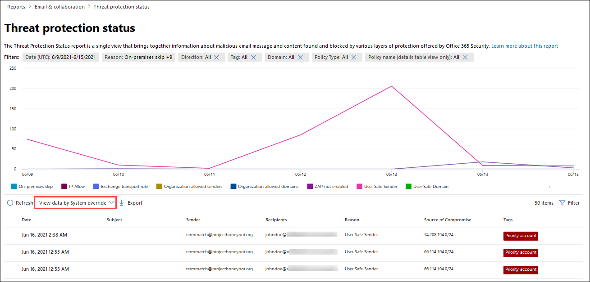

# Visa e-postsäkerhetsrapporter på Microsoft 365 Defender-portalen

[!INCLUDE [Microsoft 365 Defender rebranding](../includes/microsoft-defender-for-office.md)]

**Gäller för**
- [Exchange Online Protection](exchange-online-protection-overview.md)
- [Microsoft Defender för Office 365 Abonnemang 1 och Abonnemang 2](defender-for-office-365.md)
- [Microsoft 365 Defender](../defender/microsoft-365-defender.md)

Det finns flera olika rapporter på Microsoft 365 Defender-portalen som hjälper dig se hur säkerhetsfunktioner för e-post, till exempel skydd mot skräppost, skadlig programvara och kryptering i <https://security.microsoft.com> Microsoft 365, skyddar organisationen. Om du har [nödvändiga](#what-permissions-are-needed-to-view-these-reports)behörigheter kan du visa de här rapporterna i  Microsoft 365 Defender-portalen genom att gå till Rapporterar \> **e-&-postsamarbete** \> **E& och samarbetsrapporter**. Om du vill gå direkt **till sidan & e-post och** samarbetsrapporter öppnar du <https://security.microsoft.com/emailandcollabreport> .

> [!NOTE]
>
> Vissa av rapporterna på sidan **e& och samarbetsrapporter** kräver Microsoft Defender för Office 365. Mer information om de här rapporterna finns [i Visa Defender för Office 365-rapporter i Microsoft 365 Defender-portalen.](view-reports-for-mdo.md)
>
> Rapporter som är relaterade till e-postflödet finns nu i administrationscentret för Exchange (EAC). Mer information om rapporterna finns i [E-postflödesrapporter i det nya administrationscentret för Exchange.](/exchange/monitoring/mail-flow-reports/mail-flow-reports)

## Rapport om komprometterade användare

> [!NOTE]
> Den här rapporten är tillgänglig i Microsoft 365-organisationer med Exchange Online-postlådor. Det är inte tillgängligt i fristående EOP-organisationer (Exchange Online Protection).

I **rapporten Komprometterade** användare visas antalet användarkonton som har markerats **som misstänkta eller** begränsade **under** de senaste 7 dagarna. Konton i något av dessa tillstånd är problematiska eller till och med komprometterade. Med regelbunden användning kan du använda rapporten för att upptäcka ökningar och även trender i misstänkta eller begränsade konton. Mer information om komprometterade användare finns i [Svara på ett komprometterat e-postkonto.](responding-to-a-compromised-email-account.md)

I mängdvyn visas data för de senaste 90 dagarna och i detaljvyn visas data för de senaste 30 dagarna.

Om du vill visa rapporten i Microsoft 365 Defender-portalen går du till E-& för  \> **& med** \> **e-& för samarbete.** På sidan **E& och samarbetsrapporter** går du till **Komprometterade användare** och klickar sedan **på Visa information.** Gå direkt till rapporten genom att öppna <https://security.microsoft.com/reports/CompromisedUsers> .

På sidan **Komprometterade** användare kan du filtrera både diagrammet och informationstabellen genom att klicka på **Filtrera** och välja ett eller flera av följande värden i den utfällda listan som visas:

- **Datum (UTC)**: **Startdatum** **och slutdatum.**
- **Aktivitet**:
  - **Misstänkt:** Användarkontot har skickat misstänkt e-postmeddelande och riskerar att bli begränsat från att skicka e-post.
  - **Begränsad:** Användarkontot har begränsats från att skicka e-post på grund av mycket misstänkta mönster.

När du är klar med att konfigurera filtren klickar du **på Använd**, **Avbryt** eller **Rensa filter.**

I informationstabellen under diagrammet kan du se följande information:

- **Tid då det skapades**
- **Användar-ID**
- **Åtgärd**

## Rapport över Exchange-transportregel

I **rapporten Exchange-transportregel** visas effekten av e-postflödesregler (kallas även transportregler) på inkommande och utgående meddelanden i organisationen.

Om du vill visa rapporten i Microsoft 365 Defender-portalen går du till E-& för  \> **& med** \> **e-& för samarbete.** På sidan **E& och samarbetsrapporter** hittar du **Exchange-transportregel** och klickar sedan på **Visa information.** Gå direkt till rapporten genom att öppna <https://security.microsoft.com/reports/ETRRuleReport> .

Tillgängliga diagram **och data beskrivs** i följande avsnitt på sidan Exchange-transportregelrapport.

### Diagramfördelning efter riktning

Om du väljer **Diagramfördelning efter riktning** är följande diagram tillgängliga:

- **Visa data enligt Exchange-transportregler:** Antalet **inkommande** och **utgående** meddelanden som påverkades av e-postflödesregler.
- **Visa data med DLP-transportregler** för Exchange: Antalet **inkommande** och utgående meddelanden som påverkades av DLP-e-postflödesregler (Data Loss Prevention). 

Följande information visas i detaljtabellen under diagrammet:

- **Datum**
- **DLP-princip** (**endast visa data efter DLP-transportregler i Exchange)**
- **Transportregel**
- **Ämne**
- **Avsändarens adress**
- **Mottagaradress**
- **Allvarlighetsgrad**
- **Riktning**

Du kan filtrera både diagrammet och informationstabellen genom att klicka på **Filtrera** och markera ett eller flera av följande värden i den utfällo som visas:

- **Datum (UTC)** **startdatum** **och slutdatum**
- **Riktning**: **Utgående** och **inkommande**
- **Allvarlighetsgrad**: **Hög allvarlighetsgrad,** **medel allvarlighetsgrad** och **låg allvarlighetsgrad**

När du är klar med att konfigurera filtren klickar du **på Använd**, **Avbryt** eller **Rensa filter.**

### Diagramfördelning per allvarlighetsgrad

Om du väljer **Diagramfördelning efter allvarlighetsgrad** är följande diagram tillgängliga:

- **Visa data efter Exchange-transportregler:** Antalet **meddelanden** med hög allvarlighetsgrad, medel allvarlighetsgrad och låg **allvarlighetsgrad.** Du anger allvarlighetsnivån som en åtgärd i regeln **(Granska** denna regel med allvarlighetsnivå eller _AngeGranskningSalla_). Mer information finns i Åtgärder för [e-postflödesregel i Exchange Online.](/Exchange/security-and-compliance/mail-flow-rules/mail-flow-rule-actions)

- **Visa data med DLP-transportregler** i Exchange: Antalet hög  allvarlighetsgrad **,** **Medel** allvarlighetsgrad och Meddelanden med låg allvarlighetsgrad som påverkades av DLP-e-postflödesregler.

Följande information visas i detaljtabellen under diagrammet:

- **Datum**
- **DLP-princip** (**endast visa data efter DLP-transportregler i Exchange)**
- **Transportregel**
- **Ämne**
- **Avsändarens adress**
- **Mottagaradress**
- **Allvarlighetsgrad**
- **Riktning**

Du kan filtrera både diagrammet och informationstabellen genom att klicka på **Filtrera** och markera ett eller flera av följande värden i den utfällo som visas:

- **Datum (UTC)** **startdatum** **och slutdatum**
- **Riktning**: **Utgående** och **inkommande**
- **Allvarlighetsgrad**: **Hög allvarlighetsgrad,** **medel allvarlighetsgrad** och **låg allvarlighetsgrad**

När du är klar med att konfigurera filtren klickar du **på Använd**, **Avbryt** eller **Rensa filter.**

## Vidarebefordransrapport

> [!NOTE]
> **Vidarebefordransrapporten är** nu tillgänglig i EAC. Mer information finns i [Rapporten om automatiska vidarebefordrade meddelanden i nya EAC.](/exchange/monitoring/mail-flow-reports/mfr-auto-forwarded-messages-report)

## Statusrapport för e-postflöde

Statusrapporten **E-postflöde** är en smart rapport som visar information om inkommande och utgående e-post, identifiering av skräppost, skadlig programvara, e-post som identifieras som "bra" och information om e-post som är tillåten eller blockerad i kanten. Det här är den enda rapporten som innehåller information om gränsskydd och som visar hur mycket e-post som blockeras innan de tillåts till tjänsten för utvärdering av Exchange Online Protection (EOP). Det är viktigt att vara säker på att om ett meddelande skickas till fem mottagare räknas det som fem olika meddelanden och inte ett meddelande.

Om du vill visa rapporten i Microsoft 365 Defender-portalen går du till E-& för  \> **& med** \> **e-& för samarbete.** På sidan **E& och samarbetsrapporter hittar** du **Statussammanfattning av E-postflöde** och klickar sedan **på Visa information.** Gå direkt till rapporten genom att öppna <https://security.microsoft.com/reports/mailflowStatusReport> .

### Typvy för statusrapporten E-postflöde

På sidan **Statusrapport för e-postflöde** **är fliken** Typ markerad som standard. Som standard innehåller den här vyn ett diagram och en informationstabell som är konfigurerad med följande filter:

- **Datum (UTC)** De senaste sju dagarna.
- **E-postriktning:**
  - **Inkommande**
  - **Utgående**
  - **Årsorganisation**: det här antalet gäller meddelanden inom en klientorganisation, dvs. sender abc@domain.com skickar till mottagarens xyz@domain.com (räknas separat från **inkommande** **och utgående**)
- **Typ:**
  - **Bra e-post**
  - **Skadlig programvara**
  - **Skräppost**
  - **Edge-skydd**
  - **Regelmeddelanden**
  - **Nätfiske-e-post**
- **Domän:** **Alla**

Diagrammet ordnas efter **typvärdena.**

Du kan ändra filtren genom att klicka på **Filter.**

Följande information visas i detaljtabellen under diagrammet:

- **Riktning**
- **Typ**
- **24 timmar**
- **3 dagar**
- **7 dagar**
- **15 dagar**
- **30 dagar**

Om du klickar **på Välj en kategori för mer** information kan du välja bland följande värden:

- **Nätfiskemeddelande:** Det här valet tar dig till [rapporten status för skydd mot hot.](view-email-security-reports.md#threat-protection-status-report)
- **Skadlig programvara i** e-post: Det här valet tar dig till [statusrapporten Skydd mot hot.](view-email-security-reports.md#threat-protection-status-report)
- **Identifiering av skräppost:** Det här valet tar dig till [rapporten Identifiering av skräppost.](view-email-security-reports.md#spam-detections-report)
- **Edge blockerad skräppost:** Det här valet tar dig till rapporten [Identifiering av skräppost.](view-email-security-reports.md#spam-detections-report)

#### Exportera i vyn Typ

I detaljvyn kan du bara exportera data under en dag. Om du vill exportera data i 7 dagar måste du utföra 7 olika exportåtgärder.

Varje exporterad .csv är begränsad till 150 000 rader. Om dagens data innehåller mer än 150 000 rader skapas .csv filer.

### Riktningsvyn för statusrapporten E-postflöde

Om du klickar **på** fliken Riktning används samma standardfilter **från** vyn Typ.

Diagrammet är ordnat efter **riktningsvärden.**

Du kan ändra filtren genom att klicka på **Filter.** Samma filter från **vyn** Typ används.

Informationstabellen innehåller samma information från **vyn** Typ.

Vyn **Välj en kategori för mer information** om tillgängliga val och beteenden är samma som **vyn** Typ.

#### Exportera från riktningsvyn

I detaljvyn kan du bara exportera data under en dag. Om du vill exportera data i 7 dagar måste du utföra 7 olika exportåtgärder.

Varje exporterad .csv är begränsad till 150 000 rader. Om dagens data innehåller mer än 150 000 rader skapas .csv filer.

### Trattvyn för statusrapporten E-postflöde

I **vyn Tratt** kan du se hur Microsofts skyddsfunktioner för e-posthot filtrerar inkommande och utgående e-post i organisationen. Här finns information om totalt antal e-postmeddelanden och hur de konfigurerade funktionerna för skydd mot hot, inklusive gränsskydd, skydd mot skadlig programvara, skydd mot nätfiske, skräppost och förfalskning, påverkar antalet.

Om du klickar **på fliken Tratt** innehåller den här vyn som standard ett diagram och en informationstabell som är konfigurerad med följande filter:

- **Datum:** De senaste sju dagarna.

- **Riktning**:
  - **Inkommande**
  - **Utgående**
  - **Årsorganisation:** Antalet är för meddelanden som skickas inom en klientorganisation. det vill säga att avsändaren abc@domain.com till mottagarens xyz@domain.com (räknas separat från inkommande och utgående).

Den samlade vyn och detaljtabellvyn ger 90 dagars filtrering.

Du kan ändra filtren genom att klicka på **Filter.** Samma filter från **vyn** Typ används.

I det här diagrammet visas antalet e-postmeddelanden ordnade efter:

- **Totalt antal e-postmeddelanden**
- **E-post efter gränsskydd**
- **E-post efter transportregel** (e-postflödesregel)
- **E-post efter skadlig programvara, rykte, filtypsblockering**
- **E-post efter hot, URL-rykte, varumärkespersonifiering, skydd mot förfalskning**
- **E-post efter skräppost, massfiltrering**
- **E-post efter personifiering av användare och domän**\*
- **E-post efter fil- och URL-detonation**\*
- **E-post identifierades som därefter skydd efter leverans (URL klicka på tidsskydd)**

\*Endast Defender Office 365 Defender

Om du vill visa e-post som filtrerats efter EOP eller Defender Office 365 separat klickar du på värdet i diagramförklaringen.

Informationstabellen innehåller följande information, visad i fallande datumordning:

- **Datum**
- **Totalt antal e-postmeddelanden**
- **Edge-skydd**
- **Skydd mot skadlig programvara, rykte för filen, filtypsblockering:**
  - **Rykte:** Meddelanden filtrerade på grund av identifiering av en bifogad fil av andra Microsoft-kunder.
  - **Filtypsblock:** Meddelanden filtreras på grund av vilken typ av skadlig fil som identifieras i meddelandet.
- **Antifras, URL-rykte, varumärkespersonifiering, skydd mot förfalskning:**
  - **URL-rykte:** Meddelanden filtreras på grund av identifiering av URL-adressen av andra Microsoft-kunder.
  - **Profilering:** Meddelanden filtrerade på grund av meddelanden från välkända varumärkespersonifieringsavsändare.
  - **Skydd mot förfalskning:** Meddelanden filtreras på grund av ett meddelande som försöker kapa en domän som mottagaren tillhör eller en domän som meddelandets avsändare inte äger.
- **Skräppostskydd, massfiltrering:**
  - **Filtrering av** massutskick: Meddelanden filtreras baserat på tröskelvärdet för masskrekrektör (BCL) i en princip mot skräppost.
- **Användar- och domänpersonifiering (Defender för Office 365)**:
  - **Personifiering för användare:** Filtrerade meddelanden på grund av ett försök att utge sig för att vara en användare (meddelandeavsändare) som definierats i inställningarna för personifieringsskydd i en princip mot nätfiske.
  - **Domänpersonifiering:** Meddelanden filtrerade på grund av ett försök att utge sig för att vara en domän som definierats i inställningarna för personifieringsskydd i en princip mot nätfiske.
- **Detonation av fil och URL (Defender för Office 365)**:
  - **Detonation för filer:** Meddelanden filtrerade efter Valv princip för bifogade filer.
  - **URL-detonation**: Meddelande filtrerat av Valv princip för länkar.
- **Post-delivery protection and ZAP (ATP) or ZAP (EOP) : Zero-hour** auto purge (ZAP) for malware, spam, and phishing.

Om du markerar en rad i informationstabellen visas ytterligare en uppdelning av antalet e-postmeddelanden i den utfällade listan.

#### Exportera från trattvyn

När du har **klickat** **på Exportera** under Alternativ kan du välja något av följande värden:

- **Sammanfattning (med data för de senaste 90 dagarna som mest)**
- **Information (med data för de senaste 30 dagarna som mest)**

Välj **ett** område under Datum och klicka sedan på **Använd**. Data för de aktuella filtren exporteras till en .csv fil.

Varje exporterad .csv är begränsad till 150 000 rader. Om informationen innehåller mer än 150 000 rader skapas .csv filer.

### Tech view for the Mailflow status report

**Tech-vyn** liknar vyn **Tratt, med** mer detaljerad information om de konfigurerade funktionerna för skydd mot hot. Från diagrammet kan du se hur meddelanden kategoriseras i olika faser av skydd mot hot.

Om du klickar **på fliken Teknisk** vy innehåller den här vyn som standard ett diagram och en informationstabell som är konfigurerad med följande filter:

- **Datum:** De senaste sju dagarna.

- **Riktning**:
  - **Inkommande**
  - **Utgående**
  - **Årsorganisation**: det här antalet gäller meddelanden inom en klientorganisation, dvs. sender abc@domain.com skickar till mottagarens xyz@domain.com (räknas separat från inkommande och utgående)

Den samlade vyn och detaljtabellvyn ger 90 dagars filtrering.

Du kan ändra filtren genom att klicka på **Filter.** Samma filter från **vyn** Typ används.

Det här diagrammet visar meddelanden ordnade i följande kategorier:

- **Totalt antal e-postmeddelanden**
- **Tillåt i Edge** **och Filtrerad Edge**
- **Transportregel tillåt och** **transportregel filtrerad** (e-postflödesregler)
- **Inte skadlig programvara**, **Valv identifiering av bifogade filer** och \* **motoridentifiering mot skadlig kod**
- **Inte phish**, **DMARC-fel,** **personidentifiering,** \* **förfalskning och** **phish-identifiering**
- **Ingen identifiering med URL-detonation och** **URL-detonation**\*
- **Inte** skräppost 
- **Icke-skadlig e-post** **, Valv identifiering av länkar** och \* **ZAP**

\*Defender för Office 365

När du hovrar över en kategori i diagrammet visas antalet meddelanden i den kategorin.

Informationstabellen innehåller följande information, visad i fallande datumordning:

- **Datum (UTC)**
- **Totalt antal e-postmeddelanden**
- **Edge filtrerad**
- **Regelmeddelanden:** Meddelanden filtrerade på grund av e-postflödesregler (kallas även transportregler).
- **Motor för skydd mot skadlig programvara** Valv bifogade **filer:** \*
- **DMARC, personifiering** \* , **spoof**, **nätfiske filtrerat:**
  - **DMARC:** Meddelanden filtreras på grund av att meddelandet inte klarar sin DMARC-autentiseringskontroll.
- **Identifiering av URL-adresser**\*
- **Skräppostskydd filtreras**
- **ZAP har tagits bort**
- **Identifiering av Valv länkar**\*

\*Defender för Office 365

Om du markerar en rad i informationstabellen visas ytterligare en uppdelning av antalet e-postmeddelanden i den utfällade listan.

#### Exportera från teknisk vy

När du **klickar** på Exportera **kan** du välja något av följande värden under Alternativ:

- **Sammanfattning (med data för de senaste 90 dagarna som mest)**
- **Information (med data för de senaste 30 dagarna som mest)**

Välj **ett** område under Datum och klicka sedan på **Använd**. Data för de aktuella filtren exporteras till en .csv fil.

Varje exporterad .csv är begränsad till 150 000 rader. Om informationen innehåller mer än 150 000 rader skapas .csv filer.

## Rapport om identifiering av skadlig programvara

Rapporten **Om identifiering av skadlig programvara visar** information om identifiering av skadlig programvara i inkommande och utgående e-postmeddelanden (skadlig programvara som Exchange Online Protection eller EOP). Mer information om skydd mot skadlig programvara i EOP finns [i Skydd mot skadlig programvara i EOP.](anti-malware-protection.md)

Mängdvyfiltret tillåter 90 dagar, medan filtret i detaljtabellen bara tillåter 10 dagar.

Om du vill visa rapporten i Microsoft 365 Defender  går du till Rapporterar \> **e-& samarbete** \> **E& och samarbetsrapporter.** På sidan **E& och samarbetsrapporter hittar** du Skadlig **programvara som upptäckts i e-post** och klickar sedan **på Visa information.** Gå direkt till rapporten genom att öppna <https://security.microsoft.com/reports/MalwareDetections> .

På **rapportsidan Identifiering av skadlig** programvara kan du filtrera både diagrammet och informationstabellen genom att klicka på **Filtrera** och välja något av följande värden:

- **Datum (UTC)** **startdatum** **och slutdatum**
- **Riktning:** **Inkommande** **och utgående**

I informationstabellen under diagrammet kan du se följande information:

- **Datum**
- **Avsändarens adress**
- **Mottagaradress**
- **Meddelande-ID:** Tillgängligt i **sidhuvudet för meddelande-ID** i meddelandehuvudet och ska vara unikt. Ett exempelvärde är `<08f1e0f6806a47b4ac103961109ae6ef@server.domain>` (observera vinkelparenteserna).
- **Ämne**
- **Filnamn**
- **Namn på skadlig programvara**

## E-postsvarstid – rapport

Rapporten **Om E-postfördröjning** i Defender för Office 365 innehåller information om den e-postleverans och den tidsfördröjning som uppgers i din organisation. Mer information finns i [E-postsvarstidsrapport](view-reports-for-mdo.md#mail-latency-report).

## Rapport om identifiering av skräppost

> [!NOTE]
> Rapporten **om identifiering av skräppost** försvinner så småningom. Samma information är tillgänglig i rapporten [om skydd mot hot.](#threat-protection-status-report)

## Rapport om identifieringar av förfalskning

> [!NOTE]
> Rapporten om förbättrade identifieringar av förfalskning som beskrivs i den här artikeln är en förhandsversion, kan komma att ändras och är inte tillgänglig i alla organisationer. I den äldre versionen av rapporten visas bara **Bra e-post** **och Fångad som skräppost.**

I **rapporten Identifieringar av förfalskning** visas information om meddelanden som har blockerats eller tillåts på grund av förfalskning. Mer information om förfalskning finns i [Skydd mot förfalskning i EOP.](anti-spoofing-protection.md)

I den samlade vyn för rapporten kan du filtrera i 45 dagar, medan \* detaljvyn bara tillåter tio dagars filtrering.

\* Till slut kan du använda upp till 90 dagars filtrering.

Om du vill visa rapporten i Microsoft 365 Defender  går du till Rapporterar \> **e-& samarbete** \> **E& och samarbetsrapporter.** På sidan **E& och samarbetsrapporter** hittar du **Identifieringar av förfalskning** och klickar sedan **på Visa information.** Gå direkt till rapporten genom att öppna <https://security.microsoft.com/reports/SpoofMailReportV2> .

Diagrammet visar följande information:

- **Godkänd**
- **Fel**
- **SoftPass**
- **Ingen**
- **Annat**

När du hovrar över en dag (datapunkt) i diagrammet kan du se hur många falska meddelanden som påträffades och varför.

På sidan **Förfalskningsrapport kan** du filtrera både diagrammet och informationstabellen genom att klicka på **Filtrera** och markera ett eller flera av följande värden:

- **Datum (UTC)** **startdatum** **och slutdatum**
- **Resultat:**
  - **Godkänd**
  - **Fel**
  - **SoftPass**
  - **Ingen**
  - **Annat**
- **Förfalskningstyp:** **Intern** och **Extern**

I informationstabellen under diagrammet kan du se följande information:

- **Datum**
- **Spoofed användare**
- **Skicka infrastruktur**
- **Förfalskningstyp**
- **Result**
- **Resultatkod**
- **SPF**
- **DKIM**
- **DMARC**
- **Antal meddelanden**

Mer information om sammansatta resultatkoder för autentisering finns i Rubriker mot skräppost [i Microsoft 365.](anti-spam-message-headers.md)

## Rapport över inskickade uppgifter

Rapporten **Över inlämningar** visar information om objekt som administratörer har rapporterat till Microsoft för analys. Mer information finns i Använda [administratörsinskick för att skicka misstänkt skräppost, nättr ut, URL:er och filer till Microsoft.](admin-submission.md)

Om du vill visa rapporten i Microsoft 365 Defender  går du till Rapporterar \> **e-& samarbete** \> **E& och samarbetsrapporter.** På sidan **E& och samarbetsrapporter** hittar du **Inlämningar** och klickar sedan **på Visa information.** Gå direkt till rapporten genom att öppna <https://security.microsoft.com/adminSubmissionReport> . Om du vill [gå till administrationsinskick i Microsoft 365 Defender klickar](admin-submission.md)du på Gå till **inskickade material.**

Diagrammet visar följande information:

- **Väntande**
- **Slutförd**

På sidan **Inskickade** data kan du filtrera både diagrammet och detaljtabellen genom att klicka på **Filtrera** och välja ett eller flera av följande värden:

- **Rapporterad** datum : **Starttid** **och Sluttid**
- **Överföringstyp:**
  - **E-post**
  - **URL**
  - **Fil**
- **Sändnings-ID**
- **Id för nätverksmeddelande**
- **Avsändare**
- **Namn**
- **Skickat av**
- **Orsak till att skicka:**
  - **Inte skräppost**
  - **Nätfiske**
  - **Skadlig programvara**
  - **Skräppost**
- **Rescan-status**:
  - **Väntande**
  - **Slutförd**

Detaljtabellen under diagrammet visar samma information  och har samma alternativ  för Gruppera eller Anpassa kolumner som på fliken Skickat för analys i Skicka e-& **med** samarbete –  \> **inskickade.** Mer information finns i [Visa inskickade administratörer till Microsoft.](admin-submission.md#view-admin-submissions-to-microsoft)

## Statusrapport för hotskydd

Statusrapporten **för skydd** mot hot är tillgänglig i både EOP och Defender för Office 365. Rapporterna innehåller däremot olika data. Till exempel kan EOP-kunder visa information om skadlig programvara som upptäckts i e-post, men inte information om skadliga filer som upptäckts av [Valv-bifogade](mdo-for-spo-odb-and-teams.md)filer för SharePoint, OneDrive och Microsoft Teams.

Rapporten innehåller antalet e-postmeddelanden med skadligt innehåll, till exempel filer eller webbadresser (URL:er) som har blockerats av antivirusmotorn, nolltimmars automatisk rensning [(ZAP)](zero-hour-auto-purge.md)och Defender för [Office 365-funktioner](set-up-anti-phishing-policies.md#exclusive-settings-in-anti-phishing-policies-in-microsoft-defender-for-office-365)som [Valv-länkar,](safe-links.md) [Valv-bilagor](safe-attachments.md)och personifieringsskyddsfunktioner i principer för skydd mot nätfiske. Du kan använda den här informationen för att identifiera trender eller avgöra om organisationens principer behöver justeras.

**Obs!** Det är viktigt att förstå att om ett meddelande skickas till fem mottagare räknas det som fem olika meddelanden och inte ett meddelande.

Om du vill visa rapporten i Microsoft 365 Defender  går du till Rapporterar \> **e-& samarbete** \> **E& och samarbetsrapporter.** På sidan **E& och samarbetsrapporter** hittar du **status för skydd mot hot** och klickar sedan på Visa **information.** Öppna någon av följande URL:er för att gå direkt till rapporten:

- Defender för Office 365:<https://security.microsoft.com/reports/TPSAggregateReportATP>
- EOP: <https://security.microsoft.com/reports/TPSAggregateReport>

Som standard visas data för de senaste 7 dagarna i diagrammet. Om du klickar **på Filter** **på** sidan för skydd mot hotstatus kan du välja ett datumintervall på 90 dagar (utvärderingsprenumerationer kan vara begränsat till 30 dagar). I detaljtabellen filtreras data i 30 dagar.

De tillgängliga vyerna beskrivs i följande avsnitt.

### Visa data per översikt

I **vyn Visa data efter** översikt visas följande identifieringsinformation i diagrammet:

- **Skadlig programvara för e-post**
- **E-post phish**
- **Skadlig programvara för innehåll**

Ingen informationstabell är tillgänglig under diagrammet.

Om du **klickar på** Filter är följande filter tillgängliga:

- **Datum (UTC)** **startdatum** **och slutdatum**
- **Identifiering:** Skadlig programvara för **e-post, e-post phish** eller **skadlig programvara för innehåll** 
- **Skyddad av**: **MDO** (Defender för Office 365) eller **EOP**
- **Tagg:** Filtrera resultatet efter användare eller grupper som har tillämpat den angivna användartaggen (inklusive prioritetskonton). Mer information om användartaggar finns i [Användartaggar.](user-tags.md)
- **Riktning**
- **Domän**
- **Typ av princip**

När du är klar med att konfigurera filtren klickar du **på Använd**, **Avbryt** eller **Rensa filter.**

### Visa data efter \> e-post phish och diagramfördelning efter identifieringsteknik

I vyn **Visa data via \> e-post phish** **och diagram** som ligger i detalj efter vyn Identifieringsteknik visas följande information i diagrammet:

- **URL-skadligt** \* rykte: Skadligt URL-rykte skapat av Defender för Office 365 av detonationer i andra Microsoft 365 kunder.
- **Avancerat filter:** Nätfiskesignaler baserade på maskininlärning.
- **Allmänt filter:** Nätfiskesignaler baserade på analysregler.
- **Förfalskning av årsorganisation**: Avsändaren försöker kapa mottagardomänen.
- **Förfalskning av extern domän**: Avsändaren försöker kapa en annan domän.
- **Förfalskning DMARC**: DMARC-autentiseringsfel på meddelanden.
- **Personifieringsmärke**: Personifiering av välkända varumärken baserat på avsändare.
- **Identifiering av blandad analys**
- **Beryknat fil**
- **Fingeravtrycksmatchning**
- **URL-detonationsrekt**\*
- **URL-detonation**\*
- **Personifieringsanvändare**\*
- **Personifieringsdomän:** \* Personifiering av domäner som kunden äger eller definierar.
- **Postlådeintelligens** \* : Personifiering av användare som definierats av administratören eller som lärt sig via postlådeintelligens.
- **Fil detonation**\*
- **Kampanj**\*

I informationstabellen under diagrammet finns följande information tillgänglig:

- **Datum**
- **Ämne**
- **Avsändare**
- **Mottagare**
- **Upptäckt av**
- **Leveransstatus**
- **Källan till en kompromett**
- **Taggar**

Om du **klickar på** Filter är följande filter tillgängliga:

- **Datum (UTC)** **startdatum** **och slutdatum**
- **Identifiering**
- **Skyddad av**: **MDO** (Defender för Office 365) eller **EOP**
- **Riktning**
- **Tagg:** Filtrera resultatet efter användare eller grupper som har tillämpat den angivna användartaggen (inklusive prioritetskonton). Mer information om användartaggar finns i [Användartaggar.](user-tags.md)
- **Domän**
- **Typ av princip**
- **Principnamn** (endast informationstabell)
- **Mottagare**

När du är klar med att konfigurera filtren klickar du **på Använd**, **Avbryt** eller **Rensa filter.**

### Visa data efter skadlig programvara \> för e-post och diagramfördelning med identifieringsteknik

I vyn **Visa data efter \> e-post** **skadlig** programvara och diagram som ligger i detalj i vyn Identifieringsteknik visas följande information i diagrammet:

- **Detonation för filen:** \* Identifiering av Valv bifogade filer.
- **Rykte för fil detonation** \* : Allt skadligt filrynde som genererats av Defender för Office 365 detonationer.
- **Beryknat fil**
- **Motor mot skadlig programvara:** \* Identifiering från sökmotorer mot skadlig programvara.
- **Filtypsblockering mot skadlig programvara:** Det här är e-postmeddelanden som filtrerats bort på grund av vilken typ av skadlig fil som identifieras i meddelandet.
- **URL-skadligt rykte**
- **URL-detonation**
- **URL-detonationsrekt**
- **Kampanj**

I informationstabellen under diagrammet finns följande information tillgänglig:

- **Datum**
- **Ämne**
- **Avsändare**
- **Mottagare**
- **Upptäckt av**
- **Leveransstatus**
- **Källan till en kompromett**
- **Taggar**

Om du **klickar på** Filter är följande filter tillgängliga:

- **Datum (UTC)** **startdatum** **och slutdatum**
- **Identifiering**
- **Skyddad av**: **MDO** (Defender för Office 365) eller **EOP**
- **Riktning**
- **Tagg:** Filtrera resultatet efter användare eller grupper som har tillämpat den angivna användartaggen (inklusive prioritetskonton). Mer information om användartaggar finns i [Användartaggar.](user-tags.md)
- **Domän**
- **Typ av princip**
- **Principnamn** (endast informationstabell)
- **Mottagare**

När du är klar med att konfigurera filtren klickar du **på Använd**, **Avbryt** eller **Rensa filter.**

### Diagramfördelning efter typ av princip och Visa data efter e-post \> phish eller Visa data efter e-postprogram \>

I **diagramfördelningen efter typ av princip** och Visa data efter e-postfras eller **Visa data \>** efter e-post för skadlig programvara visas följande information i diagrammen: **\>**

- **Skydd mot skadlig programvara**
- **Valv Bifogade filer**\*
- **Anti-phish**
- **Skräppostskydd**
- **E-postflödesregel** (kallas även transportregel)
- **Andra**

I informationstabellen under diagrammet finns följande information tillgänglig:

- **Datum**
- **Ämne**
- **Avsändare**
- **Mottagare**
- **Upptäckt av**
- **Leveransstatus**
- **Källan till en kompromett**
- **Taggar**

Om du **klickar på** Filter är följande filter tillgängliga:

- **Datum (UTC)** **startdatum** **och slutdatum**
- **Identifiering**
- **Skyddad av**: **MDO** (Defender för Office 365) eller **EOP**
- **Riktning**
- **Tagg:** Filtrera resultatet efter användare eller grupper som har tillämpat den angivna användartaggen (inklusive prioritetskonton). Mer information om användartaggar finns i [Användartaggar.](user-tags.md)
- **Domän**
- **Typ av princip**
- **Principnamn** (endast informationstabell)
- **Mottagare**

När du är klar med att konfigurera filtren klickar du **på Använd**, **Avbryt** eller **Rensa filter.**

### Diagram efter leveransstatus och Visa data efter e-post \> phish eller Visa data efter e-post skadlig \> programvara

I **diagramfördelningen efter leveransstatus** och Visa data efter e-postfras eller **Visa data \>** efter e-post för skadlig programvara visas följande information i diagrammen: **\>**

- **Värdpostlåda: Inkorgen**
- **Värdpostlåda: Skräppost**
- **Värdpostlåda: Anpassad mapp**
- **Värdpostlåda: Borttagna objekt**
- **Vidarebefordrad**
- **Lokal server: Levererad**
- **Karantän**
- **Leveransen misslyckades**
- **Nedsnad**

I informationstabellen under diagrammet finns följande information tillgänglig:

- **Datum**
- **Ämne**
- **Avsändare**
- **Mottagare**
- **Upptäckt av**
- **Leveransstatus**
- **Källan till en kompromett**
- **Taggar**

Om du **klickar på** Filter är följande filter tillgängliga:

- **Datum (UTC)** **startdatum** **och slutdatum**
- **Identifiering**
- **Skyddad av**: **MDO** (Defender för Office 365) eller **EOP**
- **Riktning**
- **Tagg:** Filtrera resultatet efter användare eller grupper som har tillämpat den angivna användartaggen (inklusive prioritetskonton). Mer information om användartaggar finns i [Användartaggar.](user-tags.md)
- **Domän**
- **Typ av princip**
- **Principnamn** (endast informationstabell)
- **Mottagare**

När du är klar med att konfigurera filtren klickar du **på Använd**, **Avbryt** eller **Rensa filter.**

### Visa data efter skadlig programvara för \> innehåll

I vyn **Visa data efter skadlig \>** programvara för innehåll visas följande information i diagrammet för Microsoft Defender för Office 365 organisationer:

- **Motor mot skadlig programvara:** Skadliga filer som upptäckts i Sharepoint, OneDrive och Microsoft Teams av den [inbyggda virusidentifieringen i Microsoft 365.](virus-detection-in-spo.md)
- **Fildeonation:** Skadliga filer som upptäckts [Valv bifogade filer för SharePoint, OneDrive och Microsoft Teams](mdo-for-spo-odb-and-teams.md).

I informationstabellen under diagrammet finns följande information tillgänglig:

- **Datum (UTC)** **startdatum** **och slutdatum**
- **Plats**
- **Upptäckt av**
- **Namn på skadlig programvara**

Om du **klickar på** Filter är följande filter tillgängliga:

- **Datum (UTC)** **startdatum** **och slutdatum**
- **Identifiering:** **Motor mot skadlig programvara** eller **detonation av filer**

När du är klar med att konfigurera filtren klickar du **på Använd**, **Avbryt** eller **Rensa filter.**

### Visa data efter åsidosättning av system

I vyn **För visning av data efter** system, visas följande orsak till åsidosättning i diagrammet:

- **Lokal hoppa över**
- **IP tillåt**
- **Exchange för e-posttransport** (e-postflödesregel)
- **Organisationen tillät avsändare**
- **Tillåtna domäner för organisationen**
- **ZAP inte aktiverat**
- **Mappen Skräppost är inte aktiverad**
- **Användare Valv avsändare**
- **User Valv Domain**

I informationstabellen under diagrammet finns följande information tillgänglig:

- **Datum**
- **Ämne**
- **Avsändare**
- **Mottagare**
- **Upptäckt av**
- **Leveransstatus**
- **Källan till en kompromett**
- **Taggar**

Om du **klickar på** Filter är följande filter tillgängliga:

- **Datum (UTC)** **startdatum** **och slutdatum**
- **Identifiering**
- **Skyddad av**: **MDO** (Defender för Office 365) eller **EOP**
- **Riktning**
- **Tagg:** Filtrera resultatet efter användare eller grupper som har tillämpat den angivna användartaggen (inklusive prioritetskonton). Mer information om användartaggar finns i [Användartaggar.](user-tags.md)
- **Domän**
- **Typ av princip**
- **Principnamn** (endast informationstabell)
- **Mottagare**

När du är klar med att konfigurera filtren klickar du **på Använd**, **Avbryt** eller **Rensa filter.**

\*Endast Defender Office 365 Defender

## Den viktigaste rapporten om skadlig programvara

Den **viktigaste rapporten om** skadlig programvara visar de olika typer av skadlig programvara som identifierats av skydd mot skadlig programvara i [EOP.](anti-malware-protection.md)

Om du vill visa rapporten i Microsoft 365 Defender  går du till Rapporterar \> **e-& samarbete** \> **E& och samarbetsrapporter.** På sidan **E& och samarbetsrapporter** hittar du **Den största skadlig programvara** och klickar sedan på Visa **information.** Gå direkt till rapporten genom att öppna <https://security.microsoft.com/reports/TopMalware> .

När du hovrar över en kil i cirkeldiagrammet kan du se namnet på en typ av skadlig programvara och hur många meddelanden som identifierats som har den skadlig kod.

På **sidan Den översta rapporten** om skadlig programvara visas en större version av cirkeldiagrammet på rapportsidan. I detaljtabellen under diagrammet visas följande information:

- **Populära skadlig programvara**
- **Antal**

Om du klickar **på** Filter kan du ange ett datumintervall **med Startdatum** **och Slutdatum.**

## Rapport om skydd mot URL-hot

Rapporten **om skydd mot URL-hot** är endast tillgänglig i Microsoft Defender för Office 365. Mer information finns i Rapporten [om url-skydd mot hot.](view-reports-for-mdo.md#url-threat-protection-report)

## Rapport över användarrapporterade meddelanden

> [!IMPORTANT]
> För att rapporten **över användarrapporter ska** fungera korrekt måste granskningsloggning **vara aktiverad** i din Microsoft 365 miljö. Det görs vanligtvis av någon som har rollen Granskningsloggar tilldelad i Exchange Online. Mer information finns i aktivera [Microsoft 365 eller inaktivera granskningsloggsökning.](../../compliance/turn-audit-log-search-on-or-off.md)

Rapporten **Om användarrapporter** visar information om e-postmeddelanden som användare har rapporterat som skräppost, nätfiskeförsök eller bra [e-post](enable-the-report-message-add-in.md) med hjälp av tilläggen Rapportmeddelande eller [Rapport nätfiske.](enable-the-report-phish-add-in.md)

Om du vill visa rapporten i Microsoft 365 Defender  går du till Rapporterar \> **e-& samarbete** \> **E& och samarbetsrapporter.** På sidan **E& och samarbetsrapporter** hittar du användarrapporterade **meddelanden** och klickar sedan **på Visa information.** Gå direkt till rapporten genom att öppna <https://security.microsoft.com/reports/userSubmissionReport> . Om du vill [gå till administrationsinskick i Microsoft 365 Defender klickar](admin-submission.md)du på Gå till **inskickade material.**

På sidan **Användarrapporterade** meddelanden kan du filtrera både diagrammet och informationstabellen genom att klicka på **Filtrera** och välja ett eller flera av följande värden i den utfäll plats som visas:

- **Rapporterad** datum : **Starttid** **och Sluttid**
- **Rapporterad av**
- **Ämne för e-post**
- **Rapporterat ID för meddelande**
- **Id för nätverksmeddelande**
- **Avsändare**
- **Rapporterad orsak**
  - **Inte skräppost**
  - **Nätfiske**
  - **Skräppost**
- **Phish simulering**: **Ja** eller **Nej**

När du är klar med att konfigurera filtren klickar du **på Använd**, **Avbryt** eller **Rensa filter.**

Om du vill gruppera posterna **klickar du** på Gruppera och väljer något av följande värden i listrutan:

- **Ingen**
- **Orsak**
- **Avsändare**
- **Rapporterad av**
- **Rescan-resultat**
- **Phish-simulering**

I informationstabellen under diagrammet kan du se följande information:

- **Ämne för e-post**
- **Rapporterad av**
- **Rapporterad**
- **Avsändare**
- **Rapporterad orsak**
- **Rescan-resultat**
- **Taggar**

Om du vill skicka ett meddelande till Microsoft för analys markerar du meddelandeposten i tabellen, klickar på Skicka till **Microsoft** för analys och väljer sedan något av följande värden i listrutan:

- **Rapportrensning**
- **Rapportera nätfiske**
- **Rapportera skadlig programvara**
- **Rapportera skräppost**'
- **Undersökning av utlösare** (Defender för Office 365)

## Vilka behörigheter krävs för att visa rapporterna?

För att kunna visa och använda rapporterna som beskrivs i den här artikeln måste du vara medlem i någon av följande rollgrupper i Microsoft 365 Defender portalen:

- **Organisationshantering**
- **Säkerhetsadministratör**
- **Säkerhetsläsare**
- **Global Reader**

Mer information finns i [Behörigheter i Microsoft 365 Defender portal](permissions-in-the-security-and-compliance-center.md).

**Obs!** Om du lägger till användare i motsvarande Azure Active Directory-roll i Administrationscenter för Microsoft 365 får användarna  de behörigheter som krävs i Microsoft 365 Defender-portalen och behörigheter för andra funktioner Microsoft 365. Mer information finns i [Om administratörsroller](../../admin/add-users/about-admin-roles.md).

## Vad händer om rapporterna inte visar data?

Om du inte ser data i rapporterna kan du kontrollera att dina principer är korrekt konfigurerade. Mer information finns i [Skydda mot hot.](protect-against-threats.md)

## Relaterade ämnen

[Skydd mot skräppost och skadlig programvara i EOP](anti-spam-and-anti-malware-protection.md)

[Smarta rapporter och insikter i Microsoft 365 Defender portalen](reports-and-insights-in-security-and-compliance.md)

[Visa e-postflödesrapporter i Microsoft 365 Defender portalen](view-mail-flow-reports.md)

[Visa rapporter för Defender för Office 365](view-reports-for-mdo.md)
