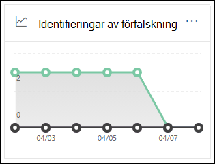

# Visa e-postsäkerhetsrapporter på Microsoft 365 Defender-portalenView email security reports in the Microsoft 365 Defender portal

[!INCLUDE [Microsoft 365 Defender rebranding](../includes/microsoft-defender-for-office.md)]

**Gäller för****Applies to**
- [Exchange Online ProtectionExchange Online Protection](exchange-online-protection-overview.md)
- [Microsoft Defender för Office 365 Abonnemang 1 och Abonnemang 2Microsoft Defender for Office 365 plan 1 and plan 2](defender-for-office-365.md)
- [Microsoft 365 DefenderMicrosoft 365 Defender](../defender/microsoft-365-defender.md)

Det finns flera olika rapporter på Microsoft 365 Defender-portalen som hjälper dig se hur säkerhetsfunktioner för e-post, till exempel skydd mot skräppost, skadlig programvara och kryptering i <https://security.microsoft.com> Microsoft 365, skyddar organisationen.A variety of reports are available in the Microsoft 365 Defender portal at <https://security.microsoft.com> to help you see how email security features, such as anti-spam, anti-malware, and encryption features in Microsoft 365 are protecting your organization. Om du har [nödvändiga](#what-permissions-are-needed-to-view-these-reports)behörigheter kan du visa de här rapporterna i  Microsoft 365 Defender-portalen genom att gå till Rapporterar \> **e-&-postsamarbete** \> **E& och samarbetsrapporter**.If you have the [necessary permissions](#what-permissions-are-needed-to-view-these-reports), you can view these reports in the Microsoft 365 Defender portal by going to **Reports** \> **Email & collaboration** \> **Email & collaboration reports**. Om du vill gå direkt **till sidan & e-post och** samarbetsrapporter öppnar du <https://security.microsoft.com/emailandcollabreport> .To go directly to the **Email & collaboration reports** page, open <https://security.microsoft.com/emailandcollabreport>.

> [!NOTE]
>
> Vissa av rapporterna på sidan **e& och samarbetsrapporter** kräver Microsoft Defender för Office 365.Some of the reports on the **Email & collaboration reports** page require Microsoft Defender for Office 365. Mer information om de här rapporterna finns [i Visa Defender för Office 365-rapporter i Microsoft 365 Defender-portalen.](view-reports-for-mdo.md)For information about these reports, see [View Defender for Office 365 reports in the Microsoft 365 Defender portal](view-reports-for-mdo.md).
>
> Rapporter som är relaterade till e-postflödet finns nu i administrationscentret för Exchange (EAC).Reports that are related to mail flow are now in the Exchange admin center (EAC). Mer information om rapporterna finns i [E-postflödesrapporter i det nya administrationscentret för Exchange.](/exchange/monitoring/mail-flow-reports/mail-flow-reports)For more information about these reports, see [Mail flow reports in the new Exchange admin center](/exchange/monitoring/mail-flow-reports/mail-flow-reports).

## Rapport om komprometterade användareCompromised users report

> [!NOTE]
> Den här rapporten är tillgänglig i Microsoft 365-organisationer med Exchange Online-postlådor.This report is available in Microsoft 365 organizations with Exchange Online mailboxes. Det är inte tillgängligt i fristående EOP-organisationer (Exchange Online Protection).It's not available in standalone Exchange Online Protection (EOP) organizations.

I **rapporten Komprometterade** användare visas antalet användarkonton som har markerats **som misstänkta eller** begränsade **under** de senaste 7 dagarna.The **Compromised users** report shows shows the number of user accounts that were marked as **Suspicious** or **Restricted** within the last 7 days. Konton i något av dessa tillstånd är problematiska eller till och med komprometterade.Accounts in either of these states are problematic or even compromised. Med regelbunden användning kan du använda rapporten för att upptäcka ökningar och även trender i misstänkta eller begränsade konton.With frequent use, you can use the report to spot spikes, and even trends, in suspicious or restricted accounts. Mer information om komprometterade användare finns i [Svara på ett komprometterat e-postkonto.](responding-to-a-compromised-email-account.md)For more information about compromised users, see [Responding to a compromised email account](responding-to-a-compromised-email-account.md).

I mängdvyn visas data för de senaste 90 dagarna och i detaljvyn visas data för de senaste 30 dagarna.The aggregate view shows data for the last 90 days and the detail view shows data for the last 30 days.

Om du vill visa rapporten i Microsoft 365 Defender-portalen går du till E-& för  \> **& med** \> **e-& för samarbete.**To view the report in the Microsoft 365 Defender portal, go to **Reports** \> **Email & collaboration** \> **Email & collaboration reports**. På sidan **E& och samarbetsrapporter** går du till **Komprometterade användare** och klickar sedan **på Visa information.**On the **Email & collaboration reports** page, find **Compromised users** and then click **View details**. Gå direkt till rapporten genom att öppna <https://security.microsoft.com/reports/CompromisedUsers> .To go directly to the report, open <https://security.microsoft.com/reports/CompromisedUsers>.

På sidan **Komprometterade** användare kan du filtrera både diagrammet och informationstabellen genom att klicka på **Filtrera** och välja ett eller flera av följande värden i den utfällda listan som visas:On the **Compromised users** page, you can filter both the chart and the details table by clicking **Filter** and selecting one or more of the following values in the flyout that appears:

- **Datum (UTC)**: **Startdatum** **och slutdatum.****Date (UTC)**: **Start date** and **End date**.
- **Aktivitet**:**Activity**:
  - **Misstänkt:** Användarkontot har skickat misstänkt e-postmeddelande och riskerar att bli begränsat från att skicka e-post.**Suspicious**: The user account has sent suspicious email and is at risk of being restricted from sending email.
  - **Begränsad:** Användarkontot har begränsats från att skicka e-post på grund av mycket misstänkta mönster.**Restricted**: The user account has been restricted from sending email due to highly suspicious patterns.

När du är klar med att konfigurera filtren klickar du **på Använd**, **Avbryt** eller **Rensa filter.**When you're finished configuring the filters, click **Apply**, **Cancel**, or **Clear filters**.

I informationstabellen under diagrammet kan du se följande information:In the details table below the graph, you can see the following details:

- **Tid då det skapades****Creation time**
- **Användar-ID****User ID**
- **Åtgärd****Action**

## Rapport över Exchange-transportregelExchange transport rule report

I **rapporten Exchange-transportregel** visas effekten av e-postflödesregler (kallas även transportregler) på inkommande och utgående meddelanden i organisationen.The **Exchange transport rule** report shows the effect of mail flow rules (also known as transport rules) on incoming and outgoing messages in your organization.

Om du vill visa rapporten i Microsoft 365 Defender-portalen går du till E-& för  \> **& med** \> **e-& för samarbete.**To view the report in the Microsoft 365 Defender portal, go to **Reports** \> **Email & collaboration** \> **Email & collaboration reports**. På sidan **E& och samarbetsrapporter** hittar du **Exchange-transportregel** och klickar sedan på **Visa information.**On the **Email & collaboration reports** page, find **Exchange transport rule** and then click **View details**. Gå direkt till rapporten genom att öppna <https://security.microsoft.com/reports/ETRRuleReport> .To go directly to the report, open <https://security.microsoft.com/reports/ETRRuleReport>.

Tillgängliga diagram **och data beskrivs** i följande avsnitt på sidan Exchange-transportregelrapport.On the **Exchange transport rule report** page, the available charts and data are described in the following sections.

### Diagramfördelning efter riktningChart breakdown by Direction

Om du väljer **Diagramfördelning efter riktning** är följande diagram tillgängliga:If you select **Chart breakdown by Direction**, the follow charts are available:

- **Visa data enligt Exchange-transportregler:** Antalet **inkommande** och **utgående** meddelanden som påverkades av e-postflödesregler.**View data by Exchange transport rules**: The number of **Inbound** and **Outbound** messages that were affected by mail flow rules.
- **Visa data med DLP-transportregler** för Exchange: Antalet **inkommande** och utgående meddelanden som påverkades av DLP-e-postflödesregler (Data Loss Prevention). **View data by DLP Exchange transport rules**: The number of **Inbound** and **Outbound** messages that were affected by data loss prevention (DLP) mail flow rules.

Följande information visas i detaljtabellen under diagrammet:The following information is shown in the details table below the graph:

- **Datum****Date**
- **DLP-princip** (**endast visa data efter DLP-transportregler i Exchange)****DLP policy** (**View data by DLP Exchange transport rules** only)
- **Transportregel****Transport rule**
- **Ämne****Subject**
- **Avsändarens adress****Sender address**
- **Mottagaradress****Recipient address**
- **Allvarlighetsgrad****Severity**
- **Riktning****Direction**

Du kan filtrera både diagrammet och informationstabellen genom att klicka på **Filtrera** och markera ett eller flera av följande värden i den utfällo som visas:You can filter both the chart and the details table by clicking **Filter** and selecting one or more of the following values in the flyout that appears:

- **Datum (UTC)** **startdatum** **och slutdatum****Date (UTC)** **Start date** and **End date**
- **Riktning**: **Utgående** och **inkommande****Direction**: **Outbound** and **Inbound**
- **Allvarlighetsgrad**: **Hög allvarlighetsgrad,** **medel allvarlighetsgrad** och **låg allvarlighetsgrad****Severity**: **High severity**, **Medium severity**, and **Low severity**

När du är klar med att konfigurera filtren klickar du **på Använd**, **Avbryt** eller **Rensa filter.**When you're finished configuring the filters, click **Apply**, **Cancel**, or **Clear filters**.

### Diagramfördelning per allvarlighetsgradChart breakdown by Severity

Om du väljer **Diagramfördelning efter allvarlighetsgrad** är följande diagram tillgängliga:If you select **Chart breakdown by Severity**, the follow charts are available:

- **Visa data efter Exchange-transportregler:** Antalet **meddelanden** med hög allvarlighetsgrad, medel allvarlighetsgrad och låg **allvarlighetsgrad.****View data by Exchange transport rules**: The number of **High severity**, **Medium severity**, and **Low severity** messages. Du anger allvarlighetsnivån som en åtgärd i regeln **(Granska** denna regel med allvarlighetsnivå eller _AngeGranskningSalla_).You set the severity level as an action in the rule (**Audit this rule with severity level** or _SetAuditSeverity_). Mer information finns i Åtgärder för [e-postflödesregel i Exchange Online.](/Exchange/security-and-compliance/mail-flow-rules/mail-flow-rule-actions)For more information, see [Mail flow rule actions in Exchange Online](/Exchange/security-and-compliance/mail-flow-rules/mail-flow-rule-actions).

- **Visa data med DLP-transportregler** i Exchange: Antalet hög  allvarlighetsgrad **,** **Medel** allvarlighetsgrad och Meddelanden med låg allvarlighetsgrad som påverkades av DLP-e-postflödesregler.**View data by DLP Exchange transport rules**: The number of **High severity**, **Medium severity**, and **Low severity** messages that were affected by DLP mail flow rules.

Följande information visas i detaljtabellen under diagrammet:The following information is shown in the details table below the graph:

- **Datum****Date**
- **DLP-princip** (**endast visa data efter DLP-transportregler i Exchange)****DLP policy** (**View data by DLP Exchange transport rules** only)
- **Transportregel****Transport rule**
- **Ämne****Subject**
- **Avsändarens adress****Sender address**
- **Mottagaradress****Recipient address**
- **Allvarlighetsgrad****Severity**
- **Riktning****Direction**

Du kan filtrera både diagrammet och informationstabellen genom att klicka på **Filtrera** och markera ett eller flera av följande värden i den utfällo som visas:You can filter both the chart and the details table by clicking **Filter** and selecting one or more of the following values in the flyout that appears:

- **Datum (UTC)** **startdatum** **och slutdatum****Date (UTC)** **Start date** and **End date**
- **Riktning**: **Utgående** och **inkommande****Direction**: **Outbound** and **Inbound**
- **Allvarlighetsgrad**: **Hög allvarlighetsgrad,** **medel allvarlighetsgrad** och **låg allvarlighetsgrad****Severity**: **High severity**, **Medium severity**, and **Low severity**

När du är klar med att konfigurera filtren klickar du **på Använd**, **Avbryt** eller **Rensa filter.**When you're finished configuring the filters, click **Apply**, **Cancel**, or **Clear filters**.

## VidarebefordransrapportForwarding report

> [!NOTE]
> **Vidarebefordransrapporten är** nu tillgänglig i EAC.The **Forwarding report** is now available in the EAC. Mer information finns i [Rapporten om automatiska vidarebefordrade meddelanden i nya EAC.](/exchange/monitoring/mail-flow-reports/mfr-auto-forwarded-messages-report)For more information, see [Auto forwarded messages report in the new EAC](/exchange/monitoring/mail-flow-reports/mfr-auto-forwarded-messages-report).

## Statusrapport för e-postflödeMailflow status report

Statusrapporten **E-postflöde** är en smart rapport som visar information om inkommande och utgående e-post, identifiering av skräppost, skadlig programvara, e-post som identifieras som "bra" och information om e-post som är tillåten eller blockerad i kanten.The **Mailflow status report** is a smart report that shows information about incoming and outgoing email, spam detections, malware, email identified as "good", and information about email allowed or blocked on the edge. Det här är den enda rapporten som innehåller information om gränsskydd och som visar hur mycket e-post som blockeras innan de tillåts till tjänsten för utvärdering av Exchange Online Protection (EOP).This is the only report that contains edge protection information, and shows just how much email is blocked before being allowed into the service for evaluation by Exchange Online Protection (EOP). Det är viktigt att vara säker på att om ett meddelande skickas till fem mottagare räknas det som fem olika meddelanden och inte ett meddelande.It's important to understand that if a message is sent to five recipients we count it as five different messages and not one message.

Om du vill visa rapporten i Microsoft 365 Defender-portalen går du till E-& för  \> **& med** \> **e-& för samarbete.**To view the report in the Microsoft 365 Defender portal, go to **Reports** \> **Email & collaboration** \> **Email & collaboration reports**. På sidan **E& och samarbetsrapporter hittar** du **Statussammanfattning av E-postflöde** och klickar sedan **på Visa information.**On the **Email & collaboration reports** page, find **Mailflow status summary** and then click **View details**. Gå direkt till rapporten genom att öppna <https://security.microsoft.com/reports/mailflowStatusReport> .To go directly to the report, open <https://security.microsoft.com/reports/mailflowStatusReport>.

### Typvy för statusrapporten E-postflödeType view for the Mailflow status report

När du öppnar rapporten är **fliken Typ** markerad som standard.When you open the report, the **Type** tab is selected by default. Som standard innehåller den här vyn ett diagram och en informationstabell som är konfigurerad med följande filter:By default, this view contains a chart and a details table that's configured with the following filters:

- **Datum (UTC)** De senaste sju dagarna.**Date (UTC)** The last 7 days.
- **E-postriktning:****Mail direction**:
  - **Inkommande****Inbound**
  - **Utgående****Outbound**
  - **Årsorganisation**: det här antalet gäller meddelanden inom en klientorganisation, dvs.**Intra-org**: this count is for messages within a tenant i.e sender abc@domain.com skickar till mottagarens xyz@domain.com (räknas separat från **inkommande** **och utgående**)sender abc@domain.com sends to recipient xyz@domain.com  (counted separately from **Inbound** and **Outbound**)
- **Typ:****Type**:
  - **Bra e-post****Good mail**
  - **Skadlig programvara****Malware**
  - **Skräppost****Spam**
  - **Edge-skydd****Edge protection**
  - **Regelmeddelanden****Rule messages**
  - **Nätfiske-e-post****Phishing email**
- **Domän:** **Alla****Domain**: **All**

Diagrammet ordnas efter **typvärdena.**The chart is organized by the **Type** values.

Du kan ändra dessa filter genom att klicka **på Filter** eller genom att klicka på ett värde i diagramförklaringen.You can change these filters by clicking **Filter** or by clicking a value in the chart legend.

Följande information visas i detaljtabellen under diagrammet:The following information is shown in the details table below the graph:

- **Riktning****Direction**
- **Typ****Type**
- **24 timmar****24 hours**
- **3 dagar****3 days**
- **7 dagar****7 days**
- **15 dagar****15 days**
- **30 dagar****30 days**

Om du klickar **på Välj en kategori för mer** information kan du välja bland följande värden:If you click **Choose a category for more details**, you can select from the following values:

- **Nätfiskemeddelande:** Det här valet tar dig till [rapporten status för skydd mot hot.](view-email-security-reports.md#threat-protection-status-report)**Phishing email**: This selection takes you to the [Threat protection status report](view-email-security-reports.md#threat-protection-status-report).
- **Skadlig programvara i** e-post: Det här valet tar dig till [statusrapporten Skydd mot hot.](view-email-security-reports.md#threat-protection-status-report)**Malware in email**: This selection takes you to the [Threat protection status report](view-email-security-reports.md#threat-protection-status-report).
- **Identifiering av skräppost:** Det här valet tar dig till [rapporten Identifiering av skräppost.](view-email-security-reports.md#spam-detections-report)**Spam detections**: This selection takes you to the [Spam Detections report](view-email-security-reports.md#spam-detections-report).
- **Edge blockerad skräppost:** Det här valet tar dig till rapporten [Identifiering av skräppost.](view-email-security-reports.md#spam-detections-report)**Edge blocked spam**: This selection takes you to the [Spam Detections report](view-email-security-reports.md#spam-detections-report).

#### Exportera i vyn TypExport from Type view

I detaljvyn kan du bara exportera data under en dag.For the detail view, you can only export data for one day. Om du vill exportera data i 7 dagar måste du utföra 7 olika exportåtgärder.So, if you want to export data for 7 days, you need to do 7 different export actions.

Varje exporterad .csv är begränsad till 150 000 rader.Each exported .csv file is limited to 150,000 rows. Om dagens data innehåller mer än 150 000 rader skapas .csv filer.If the data for that day contains more than 150,000 rows, then multiple .csv files will be created.

### Riktningsvyn för statusrapporten E-postflödeDirection view for the Mailflow status report

Om du klickar **på** fliken Riktning används samma standardfilter **från** vyn Typ.If you click the **Direction** tab, the same default filters from the **Type** view are used.

Diagrammet är ordnat efter **riktningsvärden.**The chart is organized by **Direction** values.

Du kan ändra filtren genom att klicka på **Filter.**You can change these filters by clicking **Filter**. Samma filter från **vyn** Typ används.The same filters from the **Type** view are used.

Informationstabellen innehåller samma information från **vyn** Typ.The details table contains same information from the **Type** view.

Vyn **Välj en kategori för mer information** om tillgängliga val och beteenden är samma som **vyn** Typ.The **Choose a category for more details** available selections and behavior are the same as the **Type** view.

#### Exportera från riktningsvynExport from Direction view

I detaljvyn kan du bara exportera data under en dag.For the detail view, you can only export data for one day. Om du vill exportera data i 7 dagar måste du utföra 7 olika exportåtgärder.So, if you want to export data for 7 days, you need to do 7 different export actions.

Varje exporterad .csv är begränsad till 150 000 rader.Each exported .csv file is limited to 150,000 rows. Om dagens data innehåller mer än 150 000 rader skapas .csv filer.If the data for that day contains more than 150,000 rows, then multiple .csv files will be created.

### Trattvyn för statusrapporten E-postflödeFunnel view for the Mailflow status report

I **vyn Tratt** kan du se hur Microsofts skyddsfunktioner för e-posthot filtrerar inkommande och utgående e-post i organisationen.The **Funnel** view shows you how Microsoft's email threat protection features filter incoming and outgoing email in your organization. Här finns information om totalt antal e-postmeddelanden och hur de konfigurerade funktionerna för skydd mot hot, inklusive gränsskydd, skydd mot skadlig programvara, skydd mot nätfiske, skräppost och förfalskning, påverkar antalet.It provides details on the total email count, and how the configured threat protection features, including edge protection, anti-malware, anti-phishing, anti-spam, and anti-spoofing affect this count.

Om du klickar **på fliken Tratt** innehåller den här vyn som standard ett diagram och en informationstabell som är konfigurerad med följande filter:If you click the **Funnel** tab, by default, this view contains a chart and a details table that's configured with the following filters:

- **Datum:** De senaste sju dagarna.**Date**: The last 7 days.

- **Riktning**:**Direction**:
  - **Inkommande****Inbound**
  - **Utgående****Outbound**
  - **Årsorganisation:** Antalet är för meddelanden som skickas inom en klientorganisation. det vill säga att avsändaren abc@domain.com till mottagarens xyz@domain.com (räknas separat från inkommande och utgående).**Intra-org**: This count is for messages sent within a tenant; i.e, sender abc@domain.com sends to recipient xyz@domain.com (counted separately from Inbound and Outbound).

Den samlade vyn och detaljtabellvyn ger 90 dagars filtrering.The aggregate view and details table view allow for 90 days of filtering.

Du kan ändra filtren genom att klicka på **Filter.**You can change these filters by clicking **Filter**. Samma filter från **vyn** Typ används.The same filters from the **Type** view are used.

I det här diagrammet visas antalet e-postmeddelanden ordnade efter:This chart shows the email count organized by:

- **Totalt antal e-postmeddelanden****Total email**
- **E-post efter gränsskydd****Email after edge protection**
- **E-post efter transportregel** (e-postflödesregel)**Email after transport rule** (mail flow rule)
- **E-post efter skadlig programvara, rykte, filtypsblockering****Email after anti-malware, file reputation, file type block**
- **E-post efter hot, URL-rykte, varumärkespersonifiering, skydd mot förfalskning****Email after anti-phish, URL reputation, brand impersonation, anti-spoof**
- **E-post efter skräppost, massfiltrering****Email after anti-spam, bulk mail filtering**
- **E-post efter personifiering av användare och domän**\***Email after user and domain impersonation**\*
- **E-post efter fil- och URL-detonation**\***Email after file and URL detonation**\*
- **E-post identifierades som därefter skydd efter leverans (URL klicka på tidsskydd)****Email detected as benign after post-delivery protection (URL click time protection)**

\*Endast Defender Office 365 Defender\* Defender for Office 365 only

Om du vill visa e-post som filtrerats efter EOP eller Defender Office 365 separat klickar du på värdet i diagramförklaringen.To view the email filtered by EOP or Defender for Office 365 separately, click on the value in the chart legend.

Informationstabellen innehåller följande information, visad i fallande datumordning:The details table contains the following information, shown in descending date order:

- **Datum****Date**
- **Totalt antal e-postmeddelanden****Total email**
- **Edge-skydd****Edge protection**
- **Skydd mot skadlig programvara, rykte för filen, filtypsblockering:****Anti-malware, file reputation, file type block**:
  - **Rykte:** Meddelanden filtrerade på grund av identifiering av en bifogad fil av andra Microsoft-kunder.**File reputation**: Messages filtered due to identification of an attached file by other Microsoft customers.
  - **Filtypsblock:** Meddelanden filtreras på grund av vilken typ av skadlig fil som identifieras i meddelandet.**File type block**: Messages filtered due to the type of malicious file identified in the message.
- **Antifras, URL-rykte, varumärkespersonifiering, skydd mot förfalskning:****Anti-phish, URL reputation, Brand impersonation, anti-spoof**:
  - **URL-rykte:** Meddelanden filtreras på grund av identifiering av URL-adressen av andra Microsoft-kunder.**URL reputation**: Messages filtered due to the identification of the URL by other Microsoft customers.
  - **Profilering:** Meddelanden filtrerade på grund av meddelanden från välkända varumärkespersonifieringsavsändare.**Brand impersonation**: Messages filtered due to the message coming from well-known brand impersonating senders.
  - **Skydd mot förfalskning:** Meddelanden filtreras på grund av ett meddelande som försöker kapa en domän som mottagaren tillhör eller en domän som meddelandets avsändare inte äger.**Anti-spoof**: Messages filtered due to the message attempting to spoof a domain that the recipient belongs to, or a domain that the message sender doesn't own.
- **Skräppostskydd, massfiltrering:****Anti-spam, bulk mail filtering**:
  - **Filtrering av** massutskick: Meddelanden filtreras baserat på tröskelvärdet för masskrekrektör (BCL) i en princip mot skräppost.**Bulk mail filtering**: Messages filtered based on the bulk complain level (BCL) threshold in an anti-spam policy.
- **Användar- och domänpersonifiering (Defender för Office 365)**:**User and domain impersonation (Defender for Office 365)**:
  - **Personifiering för användare:** Filtrerade meddelanden på grund av ett försök att utge sig för att vara en användare (meddelandeavsändare) som definierats i inställningarna för personifieringsskydd i en princip mot nätfiske.**User impersonation**: Messages filtered due to an attempt to impersonate a user (message sender) that's defined in the impersonation protection settings of an anti-phishing policy.
  - **Domänpersonifiering:** Meddelanden filtrerade på grund av ett försök att utge sig för att vara en domän som definierats i inställningarna för personifieringsskydd i en princip mot nätfiske.**Domain impersonation**: Messages filtered due to an attempt to impersonate a domain that's defined in the impersonation protection settings of an anti-phishing policy.
- **Detonation av fil och URL (Defender för Office 365)**:**File and URL detonation (Defender for Office 365)**:
  - **Detonation för filer:** Meddelanden filtrerade efter Valv princip för bifogade filer.**File detonation**: Messages filtered by a Safe Attachments policy.
  - **URL-detonation**: Meddelande filtrerat av Valv princip för länkar.**URL detonation**: Message filtered by a Safe Links policy.
- **Post-delivery protection and ZAP (ATP) or ZAP (EOP) : Zero-hour** auto purge (ZAP) for malware, spam, and phishing.**Post-delivery protection and ZAP (ATP), or ZAP (EOP)**: Zero-hour auto purge (ZAP) for malware, spam, and phishing.

Om du markerar en rad i informationstabellen visas ytterligare en uppdelning av antalet e-postmeddelanden i den utfällade listan.If you select a row in the details table, a further breakdown of the email counts are shown in the flyout.

#### Exportera från trattvynExport from Funnel view

När du har **klickat** **på Exportera** under Alternativ kan du välja något av följande värden:After you click **Export** under **Options**, you can select one of the following values:

- **Sammanfattning (med data för de senaste 90 dagarna som mest)****Summary (with data for last 90 days at most)**
- **Information (med data för de senaste 30 dagarna som mest)****Details (with data for last 30 days at most)**

Välj **ett** område under Datum och klicka sedan på **Använd**.Under **Date**, choose a range, and then click **Apply**. Data för de aktuella filtren exporteras till en .csv fil.Data for the current filters will be exported to a .csv file.

Varje exporterad .csv är begränsad till 150 000 rader.Each exported .csv file is limited to 150,000 rows. Om informationen innehåller mer än 150 000 rader skapas .csv filer.If the data contains more than 150,000 rows, then multiple .csv files will be created.

### Tech view for the Mailflow status reportTech view for the Mailflow status report

**Tech-vyn** liknar vyn **Tratt, med** mer detaljerad information om de konfigurerade funktionerna för skydd mot hot.The **Tech view** is similar to the **Funnel** view, providing more granular details for the configured threat protections features. Från diagrammet kan du se hur meddelanden kategoriseras i olika faser av skydd mot hot.From the chart, you can see how messages are categorized at the different stages of threat protection.

Om du klickar **på fliken Teknisk** vy innehåller den här vyn som standard ett diagram och en informationstabell som är konfigurerad med följande filter:If you click the **Tech view** tab, by default, this view contains a chart and a details table that's configured with the following filters:

- **Datum:** De senaste sju dagarna.**Date**: The last 7 days.

- **Riktning**:**Direction**:
  - **Inkommande****Inbound**
  - **Utgående****Outbound**
  - **Årsorganisation**: det här antalet gäller meddelanden inom en klientorganisation, dvs.**Intra-org**: this count is for messages within a tenant i.e sender abc@domain.com skickar till mottagarens xyz@domain.com (räknas separat från inkommande och utgående)sender abc@domain.com sends to recipient xyz@domain.com (counted separately from Inbound and Outbound)

Den samlade vyn och detaljtabellvyn ger 90 dagars filtrering.The aggregate view and details table view allow for 90 days of filtering.

Du kan ändra filtren genom att klicka på **Filter.**You can change these filters by clicking **Filter**. Samma filter från **vyn** Typ används.The same filters from the **Type** view are used.

Det här diagrammet visar meddelanden ordnade i följande kategorier:This chart shows messages organized into the following categories:

- **Totalt antal e-postmeddelanden****Total email**
- **Tillåt i Edge** **och Filtrerad Edge****Edge allow** and **Edge filtered**
- **Transportregel tillåt och** **transportregel filtrerad** (e-postflödesregler)**Transport rule allow** and **Transport rule filtered** (mail flow rules)
- **Inte skadlig programvara**, **Valv identifiering av bifogade filer** och \* **motoridentifiering mot skadlig kod****Not malware**, **Safe Attachments detection**\*, and **Anti-malware engine detection**
- **Inte phish**, **DMARC-fel,** **personidentifiering,** \* **förfalskning och** **phish-identifiering****Not phish**, **DMARC failure**, **Impersonation detection**\*, **Spoof detection**, and **Phish detection**
- **Ingen identifiering med URL-detonation och** **URL-detonation**\***No detection with URL detonation** and **URL detonation detection**\*
- **Inte** skräppost **Not spam** and  **Spam**
- **Icke-skadlig e-post** **, Valv identifiering av länkar** och \* **ZAP****Non-malicious email**, **Safe Links detection**\*, and **ZAP**

\*Defender för Office 365\* Defender for Office 365

När du hovrar över en kategori i diagrammet visas antalet meddelanden i den kategorin.When you hover over a category in the chart, you can see the number of messages in that category.

Informationstabellen innehåller följande information, visad i fallande datumordning:The details table contains the following information, shown in descending date order:

- **Datum (UTC)****Date (UTC)**
- **Totalt antal e-postmeddelanden****Total email**
- **Edge filtrerad****Edge filtered**
- **Regelmeddelanden:** Meddelanden filtrerade på grund av e-postflödesregler (kallas även transportregler).**Rule messages**: Messages filtered due to  mail flow rules (also known as transport rules).
- **Motor för skydd mot skadlig programvara** Valv bifogade **filer:** \***Anti-malware engine**, **Safe Attachments**\*:
- **DMARC, personifiering** \* , **spoof**, **nätfiske filtrerat:****DMARC, impersonation**\*, **spoof**, **phish filtered**:
  - **DMARC:** Meddelanden filtreras på grund av att meddelandet inte klarar sin DMARC-autentiseringskontroll.**DMARC**: Messages filtered due to the message failing its DMARC authentication check.
- **Identifiering av URL-adresser**\***URL detonation detection**\*
- **Skräppostskydd filtreras****Anti-spam filtered**
- **ZAP har tagits bort****ZAP removed**
- **Identifiering av Valv länkar**\***Detection by Safe Links**\*

\*Defender för Office 365\* Defender for Office 365

Om du markerar en rad i informationstabellen visas ytterligare en uppdelning av antalet e-postmeddelanden i den utfällade listan.If you select a row in the details table, a further breakdown of the email counts are shown in the flyout.

#### Exportera från teknisk vyExport from Tech view

När du **klickar** på Exportera **kan** du välja något av följande värden under Alternativ:On clicking **Export**, under **Options** you can select one of the following values:

- **Sammanfattning (med data för de senaste 90 dagarna som mest)****Summary (with data for last 90 days at most)**
- **Information (med data för de senaste 30 dagarna som mest)****Details (with data for last 30 days at most)**

Välj **ett** område under Datum och klicka sedan på **Använd**.Under **Date**, choose a range, and then click **Apply**. Data för de aktuella filtren exporteras till en .csv fil.Data for the current filters will be exported to a .csv file.

Varje exporterad .csv är begränsad till 150 000 rader.Each exported .csv file is limited to 150,000 rows. Om informationen innehåller mer än 150 000 rader skapas .csv filer.If the data contains more than 150,000 rows, then multiple .csv files will be created.

## Rapport om identifiering av skadlig programvaraMalware detections report

Rapporten **Om identifiering av skadlig programvara visar** information om identifiering av skadlig programvara i inkommande och utgående e-postmeddelanden (skadlig programvara som Exchange Online Protection eller EOP).The **Malware detections report** report shows information about malware detections in incoming and outgoing email messages (malware detected by Exchange Online Protection or EOP). Mer information om skydd mot skadlig programvara i EOP finns [i Skydd mot skadlig programvara i EOP.](anti-malware-protection.md)For more information about malware protection in EOP, see [Anti-malware protection in EOP](anti-malware-protection.md).

Mängdvyfiltret tillåter 90 dagar, medan filtret i detaljtabellen bara tillåter 10 dagar.The aggregate view filter allows for 90 days, while the details table filter only allows for 10 days.

Om du vill visa rapporten i Microsoft 365 Defender  går du till Rapporterar \> **e-& samarbete** \> **E& och samarbetsrapporter.**To view the report in the Microsoft 365 Defender portal, go to **Reports** \> **Email & collaboration** \> **Email & collaboration reports**. På sidan **E& och samarbetsrapporter hittar** du Skadlig **programvara som upptäckts i e-post** och klickar sedan **på Visa information.**On the **Email & collaboration reports** page, find **Malware detected in email** and then click **View details**. Gå direkt till rapporten genom att öppna <https://security.microsoft.com/reports/MalwareDetections> .To go directly to the report, open <https://security.microsoft.com/reports/MalwareDetections>.

På **rapportsidan Identifiering av skadlig** programvara kan du filtrera både diagrammet och informationstabellen genom att klicka på **Filtrera** och välja något av följande värden:On the **Malware detections report** page, you can filter both the chart and the details table by clicking **Filter** and selecting one of the following values:

- **Datum (UTC)** **startdatum** **och slutdatum****Date (UTC)** **Start date** and **End date**
- **Riktning:** **Inkommande** **och utgående****Direction**: **Inbound** and **Outbound**

I informationstabellen under diagrammet kan du se följande information:In the details table below the graph, you can see the following details:

- **Datum****Date**
- **Avsändarens adress****Sender address**
- **Mottagaradress****Recipient address**
- **Meddelande-ID:** Tillgängligt i **sidhuvudet för meddelande-ID** i meddelandehuvudet och ska vara unikt.**Message ID**: Available in the **Message-ID** header field in the message header and should be unique. Ett exempelvärde är `<08f1e0f6806a47b4ac103961109ae6ef@server.domain>` (observera vinkelparenteserna).An example value is `<08f1e0f6806a47b4ac103961109ae6ef@server.domain>` (note the angle brackets).
- **Ämne****Subject**
- **Filnamn****Filename**
- **Namn på skadlig programvara****Malware name**

## E-postsvarstid – rapportMail latency report

Rapporten **Om E-postfördröjning** i Defender för Office 365 innehåller information om den e-postleverans och den tidsfördröjning som uppgers i din organisation.The **Mail latency report** in Defender for Office 365 contains information on the mail delivery and detonation latency experienced within your organization. Mer information finns i [E-postsvarstidsrapport](view-reports-for-mdo.md#mail-latency-report).For more information, see [Mail latency report](view-reports-for-mdo.md#mail-latency-report).

## Rapport om identifiering av skräppostSpam detections report

> [!NOTE]
> Rapporten **om identifiering av skräppost** försvinner så småningom.The **Spam detections report** will eventually go away. Samma information är tillgänglig i rapporten [om skydd mot hot.](#threat-protection-status-report)The same information is available in the [Threat protection status report](#threat-protection-status-report).

## Rapport om identifieringar av förfalskningSpoof detections report

> [!NOTE]
> Rapporten om förbättrade identifieringar av förfalskning som beskrivs i den här artikeln är en förhandsversion, kan komma att ändras och är inte tillgänglig i alla organisationer.The improved Spoof detections report as described in this article is in Preview, is subject to change, and is not available in all organizations. I den äldre versionen av rapporten visas bara **Bra e-post** **och Fångad som skräppost.**The older version of the report shows only **Good mail** and **Caught as spam**.

I **rapporten Identifieringar av förfalskning** visas information om meddelanden som har blockerats eller tillåts på grund av förfalskning.The **Spoof detections** report shows information about messages that were blocked or allowed due to spoofing. Mer information om förfalskning finns i [Skydd mot förfalskning i EOP.](anti-spoofing-protection.md)For more information about spoofing, see [Anti-spoofing protection in EOP](anti-spoofing-protection.md).

I den samlade vyn för rapporten kan du filtrera i 45 dagar, medan \* detaljvyn bara tillåter tio dagars filtrering.The aggregate view of the report allows for 45 days of filtering\*, while the detail view only allows for ten days of filtering.

\* Till slut kan du använda upp till 90 dagars filtrering.\* Eventually, you'll be able to use up to 90 days of filtering.

Om du vill visa rapporten i Microsoft 365 Defender  går du till Rapporterar \> **e-& samarbete** \> **E& och samarbetsrapporter.**To view the report in the Microsoft 365 Defender portal, go to **Reports** \> **Email & collaboration** \> **Email & collaboration reports**. På sidan **E& och samarbetsrapporter** hittar du **Identifieringar av förfalskning** och klickar sedan **på Visa information.**On the **Email & collaboration reports** page, find **Spoof detections** and then click **View details**. Gå direkt till rapporten genom att öppna <https://security.microsoft.com/reports/SpoofMailReportV2> .To go directly to the report, open <https://security.microsoft.com/reports/SpoofMailReportV2>.

Diagrammet visar följande information:The chart shows the following information:

- **Godkänd****Pass**
- **Fel****Fail**
- **SoftPass****SoftPass**
- **Ingen****None**
- **Annat****Other**

När du hovrar över en dag (datapunkt) i diagrammet kan du se hur många falska meddelanden som påträffades och varför.When you hover over a day (data point) in the chart, you can see how many spoofed messages were detected and why.

På sidan **Förfalskningsrapport kan** du filtrera både diagrammet och informationstabellen genom att klicka på **Filtrera** och markera ett eller flera av följande värden:On the **Spoof mail report** page, you can filter both the chart and the details table by clicking **Filter** and selecting one or more of the following values:

- **Datum (UTC)** **startdatum** **och slutdatum****Date (UTC)** **Start date** and **End date**
- **Resultat:****Result**:
  - **Godkänd****Pass**
  - **Fel****Fail**
  - **SoftPass****SoftPass**
  - **Ingen****None**
  - **Annat****Other**
- **Förfalskningstyp:** **Intern** och **Extern****Spoof type**: **Internal** and **External**

I informationstabellen under diagrammet kan du se följande information:In the details table below the graph, you can see the following details:

- **Datum****Date**
- **Spoofed användare****Spoofed user**
- **Skicka infrastruktur****Sending infrastructure**
- **Förfalskningstyp****Spoof type**
- **Result****Result**
- **Resultatkod****Result code**
- **SPF****SPF**
- **DKIM****DKIM**
- **DMARC****DMARC**
- **Antal meddelanden****Message count**

Mer information om sammansatta resultatkoder för autentisering finns i Rubriker mot skräppost [i Microsoft 365.](anti-spam-message-headers.md)For more information about composite authentication result codes, see [Anti-spam message headers in Microsoft 365](anti-spam-message-headers.md).

## Rapport över inskickade uppgifterSubmissions report

Rapporten **Över inlämningar** visar information om objekt som administratörer har rapporterat till Microsoft för analys.The **Submissions** report shows information about items that admins have reported to Microsoft for analysis. Mer information finns i Använda [administratörsinskick för att skicka misstänkt skräppost, nättr ut, URL:er och filer till Microsoft.](admin-submission.md)For more information, see [Use Admin Submission to submit suspected spam, phish, URLs, and files to Microsoft](admin-submission.md).

Om du vill visa rapporten i Microsoft 365 Defender  går du till Rapporterar \> **e-& samarbete** \> **E& och samarbetsrapporter.**To view the report in the Microsoft 365 Defender portal, go to **Reports** \> **Email & collaboration** \> **Email & collaboration reports**. På sidan **E& och samarbetsrapporter** hittar du **Inlämningar** och klickar sedan **på Visa information.**On the **Email & collaboration reports** page, find **Submissions** and then click **View details**. Gå direkt till rapporten genom att öppna <https://security.microsoft.com/adminSubmissionReport> .To go directly to the report, open <https://security.microsoft.com/adminSubmissionReport>. Om du vill [gå till administrationsinskick i Microsoft 365 Defender klickar](admin-submission.md)du på Gå till **inskickade material.**To go to [admin submissions in the Microsoft 365 Defender portal](admin-submission.md), click **Go to Submissions**.

Diagrammet visar följande information:The chart shows the following information:

- **Väntande****Pending**
- **Slutförd****Completed**

På sidan **Inskickade** data kan du filtrera både diagrammet och detaljtabellen genom att klicka på **Filtrera** och välja ett eller flera av följande värden:On the **Submissions** page, you can filter both the chart and the details table by clicking **Filter** and selecting one or more of the following values:

- **Rapporterad** datum : **Starttid** **och Sluttid****Date reported**: **Start time** and **End time**
- **Inskickingstyp:** **E-post, URL** eller **fil** **Submission type**: **Email**, **URL**, or **File**
- **Sändnings-ID****Submission ID**
- **Id för nätverksmeddelande****Network Message ID**
- **Avsändare****Sender**
- **Namn****Name**
- **Skickat av****Submitted by**
- **Orsak till att skicka:** **Inte skräppost,** **phish,** **skadlig** programvara eller **skräppost****Reason for submitting**: **Not junk**, **Phish**, **Malware**, or **Spam**
- **Rescan-status:** **Väntande** eller **Slutförd****Rescan status**: **Pending** or **Completed**

Detaljtabellen under diagrammet visar samma information  och har samma alternativ  för Gruppera eller Anpassa kolumner som på fliken Skickat för analys i Skicka e-& **med** samarbete –  \> **inskickade.**The details table below the graph shows the same information and has the same **Group** or **Customize columns** options as on the **Submitted for analysis** tab at **Email & collaboration** \> **Submissions**. Mer information finns i [Visa inskickade administratörer till Microsoft.](admin-submission.md#view-admin-submissions-to-microsoft)For more information, see [View admin submissions to Microsoft](admin-submission.md#view-admin-submissions-to-microsoft).

## Statusrapport för hotskyddThreat protection status report

Statusrapporten **för skydd** mot hot är tillgänglig i både EOP och Defender för Office 365. Rapporterna innehåller däremot olika data.The **Threat protection status** report is available in both EOP and Defender for Office 365; however, the reports contain different data. Till exempel kan EOP-kunder visa information om skadlig programvara som upptäckts i e-post, men inte information om skadliga filer som upptäckts av [Valv-bifogade](mdo-for-spo-odb-and-teams.md)filer för SharePoint, OneDrive och Microsoft Teams.For example, EOP customers can view information about malware detected in email, but not information about malicious files detected by [Safe Attachments for SharePoint, OneDrive, and Microsoft Teams](mdo-for-spo-odb-and-teams.md).

Rapporten innehåller antalet e-postmeddelanden med skadligt innehåll, till exempel filer eller webbadresser (URL:er) som har blockerats av antivirusmotorn, nolltimmars automatisk rensning [(ZAP)](zero-hour-auto-purge.md)och Defender för [Office 365-funktioner](set-up-anti-phishing-policies.md#exclusive-settings-in-anti-phishing-policies-in-microsoft-defender-for-office-365)som [Valv-länkar,](safe-links.md) [Valv-bilagor](safe-attachments.md)och personifieringsskyddsfunktioner i principer för skydd mot nätfiske.The report provides the count of email messages with malicious content, such as files or website addresses (URLs) that were blocked by the anti-malware engine, [zero-hour auto purge (ZAP)](zero-hour-auto-purge.md), and Defender for Office 365 features like [Safe Links](safe-links.md), [Safe Attachments](safe-attachments.md), and [impersonation protection features in anti-phishing policies](set-up-anti-phishing-policies.md#exclusive-settings-in-anti-phishing-policies-in-microsoft-defender-for-office-365). Du kan använda den här informationen för att identifiera trender eller avgöra om organisationens principer behöver justeras.You can use this information to identify trends or determine whether organization policies need adjustment.

**Obs!** Det är viktigt att förstå att om ett meddelande skickas till fem mottagare räknas det som fem olika meddelanden och inte ett meddelande.**Note**: It's important to understand that if a message is sent to five recipients we count it as five different messages and not one message.

Om du vill visa rapporten i Microsoft 365 Defender  går du till Rapporterar \> **e-& samarbete** \> **E& och samarbetsrapporter.**To view the report in the Microsoft 365 Defender portal, go to **Reports** \> **Email & collaboration** \> **Email & collaboration reports**. På sidan **E& och samarbetsrapporter** hittar du **status för skydd mot hot** och klickar sedan på Visa **information.**On the **Email & collaboration reports** page, find **Threat protection status** and then click **View details**. Öppna någon av följande URL:er för att gå direkt till rapporten:To go directly to the report, open one of the following URLs:

- Defender för Office 365:<https://security.microsoft.com/reports/TPSAggregateReportATP>Defender for Office 365: <https://security.microsoft.com/reports/TPSAggregateReportATP>
- EOP: <https://security.microsoft.com/reports/TPSAggregateReport>EOP: <https://security.microsoft.com/reports/TPSAggregateReport>

Som standard visas data för de senaste 7 dagarna i diagrammet.By default, the chart shows data for the past 7 days. Om du klickar **på Filter** **på** sidan för skydd mot hotstatus kan du välja ett datumintervall på 90 dagar (utvärderingsprenumerationer kan vara begränsat till 30 dagar).If you click **Filter** on the **Threat protection status report** page, you can select a 90 day date range (trial subscriptions might be limited to 30 days). I detaljtabellen filtreras data i 30 dagar.The details table allows filtering for 30 days.

De tillgängliga vyerna beskrivs i följande avsnitt.The available views are described in the following sections.

### Visa data per översiktView data by Overview

I **vyn Visa data efter** översikt visas följande identifieringsinformation i diagrammet:In the **View data by Overview** view, the following detection information is shown in the chart:

- **Skadlig programvara för e-post****Email malware**
- **E-post phish****Email phish**
- **Skadlig programvara för innehåll****Content malware**

Ingen informationstabell är tillgänglig under diagrammet.No details table is available below the chart.

Om du **klickar på** Filter är följande filter tillgängliga:If you click **Filter**, the following filters are available:

- **Datum (UTC)** **startdatum** **och slutdatum****Date (UTC)** **Start date** and **End date**
- **Identifiering:** Skadlig programvara för **e-post, e-post phish** eller **skadlig programvara för innehåll** **Detection**: **Email malware**, **Email phish**, or **Content malware**
- **Skyddad av**: **MDO** (Defender för Office 365) eller **EOP****Protected by**: **MDO** (Defender for Office 365) or **EOP**
- **Tagg:** Filtrera resultatet efter användare eller grupper som har tillämpat den angivna användartaggen (inklusive prioritetskonton).**Tag**: Filter the results by users or groups that have had the specified user tag applied (including priority accounts). Mer information om användartaggar finns i [Användartaggar.](user-tags.md)For more information about user tags, see [User tags](user-tags.md).
- **Riktning****Direction**
- **Domän****Domain**
- **Typ av princip****Policy type**

När du är klar med att konfigurera filtren klickar du **på Använd**, **Avbryt** eller **Rensa filter.**When you're finished configuring the filters, click **Apply**, **Cancel**, or **Clear filters**.

### Visa data efter \> e-post phish och diagramfördelning efter identifieringsteknikView data by Email \> Phish and Chart breakdown by Detection Technology

I vyn **Visa data via \> e-post phish** **och diagram** som ligger i detalj efter vyn Identifieringsteknik visas följande information i diagrammet:In the **View data by Email \> Phish** and **Chart breakdown by Detection Technology** view, the following information is shown in the chart:

- **URL-skadligt** \* rykte: Skadligt URL-rykte skapat av Defender för Office 365 av detonationer i andra Microsoft 365 kunder.**URL malicious reputation**\*: Malicious URL reputation generated from Defender for Office 365 detonations in other Microsoft 365 customers.
- **Avancerat filter:** Nätfiskesignaler baserade på maskininlärning.**Advanced filter**: Phishing signals based on machine learning.
- **Allmänt filter:** Nätfiskesignaler baserade på analysregler.**General filter**: Phishing signals based on analyst rules.
- **Förfalskning av årsorganisation**: Avsändaren försöker kapa mottagardomänen.**Spoof intra-org**: Sender is trying to spoof the recipient domain.
- **Förfalskning av extern domän**: Avsändaren försöker kapa en annan domän.**Spoof external domain**: Sender is trying to spoof some other domain.
- **Förfalskning DMARC**: DMARC-autentiseringsfel på meddelanden.**Spoof DMARC**: DMARC authentication failure on messages.
- **Personifieringsmärke**: Personifiering av välkända varumärken baserat på avsändare.**Impersonation brand**: Impersonation of well-known brands based on senders.
- **Identifiering av blandad analys****Mixed analysis detection**
- **Beryknat fil****File reputation**
- **Fingeravtrycksmatchning****Fingerprint matching**
- **URL-detonationsrekt**\***URL detonation reputation**\*
- **URL-detonation**\***URL detonation**\*
- **Personifieringsanvändare**\***Impersonation user**\*
- **Personifieringsdomän:** \* Personifiering av domäner som kunden äger eller definierar.**Impersonation domain**\*: Impersonation of domains that the customer owns or defines.
- **Postlådeintelligens** \* : Personifiering av användare som definierats av administratören eller som lärt sig via postlådeintelligens.**Mailbox intelligence impersonation**\*: Impersonation of users defined by admin or learned through mailbox intelligence.
- **Fil detonation**\***File detonation**\*
- **Kampanj**\***Campaign**\*

I informationstabellen under diagrammet finns följande information tillgänglig:In the details table below the chart, the following information is available:

- **Datum****Date**
- **Ämne****Subject**
- **Avsändare****Sender**
- **Mottagare****Recipients**
- **Upptäckt av****Detected by**
- **Leveransstatus****Delivery Status**
- **Källan till en kompromett****Source of Compromise**
- **Taggar****Tags**

Om du **klickar på** Filter är följande filter tillgängliga:If you click **Filter**, the following filters are available:

- **Datum (UTC)** **startdatum** **och slutdatum****Date (UTC)** **Start date** and **End date**
- **Identifiering****Detection**
- **Skyddad av**: **MDO** (Defender för Office 365) eller **EOP****Protected by**: **MDO** (Defender for Office 365) or **EOP**
- **Riktning****Direction**
- **Tagg:** Filtrera resultatet efter användare eller grupper som har tillämpat den angivna användartaggen (inklusive prioritetskonton).**Tag**: Filter the results by users or groups that have had the specified user tag applied (including priority accounts). Mer information om användartaggar finns i [Användartaggar.](user-tags.md)For more information about user tags, see [User tags](user-tags.md).
- **Domän****Domain**
- **Typ av princip****Policy type**
- **Principnamn** (endast informationstabell)**Policy name** (details table only)
- **Mottagare****Recipients**

När du är klar med att konfigurera filtren klickar du **på Använd**, **Avbryt** eller **Rensa filter.**When you're finished configuring the filters, click **Apply**, **Cancel**, or **Clear filters**.

### Visa data efter skadlig programvara \> för e-post och diagramfördelning med identifieringsteknikView data by Email \> Malware and Chart breakdown by Detection Technology

I vyn **Visa data efter \> e-post** **skadlig** programvara och diagram som ligger i detalj i vyn Identifieringsteknik visas följande information i diagrammet:In the **View data by Email \> Malware** and **Chart breakdown by Detection Technology** view, the following information is shown in the chart:

- **Detonation för filen:** \* Identifiering av Valv bifogade filer.**File detonation**\*: Detection by Safe Attachments.
- **Rykte för fil detonation** \* : Allt skadligt filrynde som genererats av Defender för Office 365 detonationer.**File detonation reputation**\*: All malicious file reputation generated by Defender for Office 365 detonations.
- **Beryknat fil****File reputation**
- **Motor mot skadlig programvara:** \* Identifiering från sökmotorer mot skadlig programvara.**Anti-malware engine**\*: Detection from anti-malware engines.
- **Filtypsblockering mot skadlig programvara:** Det här är e-postmeddelanden som filtrerats bort på grund av vilken typ av skadlig fil som identifieras i meddelandet.**Anti-malware policy file type block**: These are email messages filtered out due to the type of malicious file identified in the message.
- **URL-skadligt rykte****URL malicious reputation**
- **URL-detonation****URL detonation**
- **URL-detonationsrekt****URL detonation reputation**
- **Kampanj****Campaign**

I informationstabellen under diagrammet finns följande information tillgänglig:In the details table below the chart, the following information is available:

- **Datum****Date**
- **Ämne****Subject**
- **Avsändare****Sender**
- **Mottagare****Recipients**
- **Upptäckt av****Detected by**
- **Leveransstatus****Delivery Status**
- **Källan till en kompromett****Source of Compromise**
- **Taggar****Tags**

Om du **klickar på** Filter är följande filter tillgängliga:If you click **Filter**, the following filters are available:

- **Datum (UTC)** **startdatum** **och slutdatum****Date (UTC)** **Start date** and **End date**
- **Identifiering****Detection**
- **Skyddad av**: **MDO** (Defender för Office 365) eller **EOP****Protected by**: **MDO** (Defender for Office 365) or **EOP**
- **Riktning****Direction**
- **Tagg:** Filtrera resultatet efter användare eller grupper som har tillämpat den angivna användartaggen (inklusive prioritetskonton).**Tag**: Filter the results by users or groups that have had the specified user tag applied (including priority accounts). Mer information om användartaggar finns i [Användartaggar.](user-tags.md)For more information about user tags, see [User tags](user-tags.md).
- **Domän****Domain**
- **Typ av princip****Policy type**
- **Principnamn** (endast informationstabell)**Policy name** (details table only)
- **Mottagare****Recipients**

När du är klar med att konfigurera filtren klickar du **på Använd**, **Avbryt** eller **Rensa filter.**When you're finished configuring the filters, click **Apply**, **Cancel**, or **Clear filters**.

### Diagramfördelning efter typ av princip och Visa data efter e-post \> phish eller Visa data efter e-postprogram \>Chart breakdown by Policy type and View data by Email \> Phish or View data by Email \> Malware

I **diagramfördelningen efter typ av princip** och Visa data efter e-postfras eller **Visa data \>** efter e-post för skadlig programvara visas följande information i diagrammen: **\>**In the **Chart breakdown by Policy type** and **View data by Email \> Phish** or **View data by Email \> Malware** views, the following information is shown in the charts:

- **Skydd mot skadlig programvara****Anti-malware**
- **Valv Bifogade filer**\***Safe Attachments**\*
- **Anti-phish****Anti-phish**
- **Skräppostskydd****Anti-spam**
- **E-postflödesregel** (kallas även transportregel)**Mail flow rule** (also known as a transport rule)
- **Andra****Others**

I informationstabellen under diagrammet finns följande information tillgänglig:In the details table below the chart, the following information is available:

- **Datum****Date**
- **Ämne****Subject**
- **Avsändare****Sender**
- **Mottagare****Recipients**
- **Upptäckt av****Detected by**
- **Leveransstatus****Delivery Status**
- **Källan till en kompromett****Source of Compromise**
- **Taggar****Tags**

Om du **klickar på** Filter är följande filter tillgängliga:If you click **Filter**, the following filters are available:

- **Datum (UTC)** **startdatum** **och slutdatum****Date (UTC)** **Start date** and **End date**
- **Identifiering****Detection**
- **Skyddad av**: **MDO** (Defender för Office 365) eller **EOP****Protected by**: **MDO** (Defender for Office 365) or **EOP**
- **Riktning****Direction**
- **Tagg:** Filtrera resultatet efter användare eller grupper som har tillämpat den angivna användartaggen (inklusive prioritetskonton).**Tag**: Filter the results by users or groups that have had the specified user tag applied (including priority accounts). Mer information om användartaggar finns i [Användartaggar.](user-tags.md)For more information about user tags, see [User tags](user-tags.md).
- **Domän****Domain**
- **Typ av princip****Policy type**
- **Principnamn** (endast informationstabell)**Policy name** (details table only)
- **Mottagare****Recipients**

När du är klar med att konfigurera filtren klickar du **på Använd**, **Avbryt** eller **Rensa filter.**When you're finished configuring the filters, click **Apply**, **Cancel**, or **Clear filters**.

### Diagram efter leveransstatus och Visa data efter e-post \> phish eller Visa data efter e-post skadlig \> programvaraChart breakdown by Delivery status and View data by Email \> Phish or View data by Email \> Malware

I **diagramfördelningen efter leveransstatus** och Visa data efter e-postfras eller **Visa data \>** efter e-post för skadlig programvara visas följande information i diagrammen: **\>**In the **Chart breakdown by Delivery status** and **View data by Email \> Phish** or **View data by Email \> Malware** views, the following information is shown in the charts:

- **Värdpostlåda: Inkorgen****Hosted mailbox: Inbox**
- **Värdpostlåda: Skräppost****Hosted mailbox: Junk**
- **Värdpostlåda: Anpassad mapp****Hosted mailbox: Custom folder**
- **Värdpostlåda: Borttagna objekt****Hosted mailbox: Deleted items**
- **Vidarebefordrad****Forwarded**
- **Lokal server: Levererad****On-premises server: Delivered**
- **Karantän****Quarantine**
- **Leveransen misslyckades****Delivery failed**
- **Nedsnad****Dropped**

I informationstabellen under diagrammet finns följande information tillgänglig:In the details table below the chart, the following information is available:

- **Datum****Date**
- **Ämne****Subject**
- **Avsändare****Sender**
- **Mottagare****Recipients**
- **Upptäckt av****Detected by**
- **Leveransstatus****Delivery Status**
- **Källan till en kompromett****Source of Compromise**
- **Taggar****Tags**

Om du **klickar på** Filter är följande filter tillgängliga:If you click **Filter**, the following filters are available:

- **Datum (UTC)** **startdatum** **och slutdatum****Date (UTC)** **Start date** and **End date**
- **Identifiering****Detection**
- **Skyddad av**: **MDO** (Defender för Office 365) eller **EOP****Protected by**: **MDO** (Defender for Office 365) or **EOP**
- **Riktning****Direction**
- **Tagg:** Filtrera resultatet efter användare eller grupper som har tillämpat den angivna användartaggen (inklusive prioritetskonton).**Tag**: Filter the results by users or groups that have had the specified user tag applied (including priority accounts). Mer information om användartaggar finns i [Användartaggar.](user-tags.md)For more information about user tags, see [User tags](user-tags.md).
- **Domän****Domain**
- **Typ av princip****Policy type**
- **Principnamn** (endast informationstabell)**Policy name** (details table only)
- **Mottagare****Recipients**

När du är klar med att konfigurera filtren klickar du **på Använd**, **Avbryt** eller **Rensa filter.**When you're finished configuring the filters, click **Apply**, **Cancel**, or **Clear filters**.

### Visa data efter skadlig programvara för \> innehållView data by Content \> Malware

I vyn **Visa data efter skadlig \>** programvara för innehåll visas följande information i diagrammet för Microsoft Defender för Office 365 organisationer:In the **View data by Content \> Malware** view, the following information is shown in the chart for Microsoft Defender for Office 365 organizations:

- **Motor mot skadlig programvara:** Skadliga filer som upptäckts i Sharepoint, OneDrive och Microsoft Teams av den [inbyggda virusidentifieringen i Microsoft 365.](virus-detection-in-spo.md)**Anti-malware engine**: Malicious files detected in Sharepoint, OneDrive, and Microsoft Teams by the [built-in virus detection in Microsoft 365](virus-detection-in-spo.md).
- **Fildeonation:** Skadliga filer som upptäckts [Valv bifogade filer för SharePoint, OneDrive och Microsoft Teams](mdo-for-spo-odb-and-teams.md).**File detonation**: Malicious files detected by [Safe Attachments for SharePoint, OneDrive, and Microsoft Teams](mdo-for-spo-odb-and-teams.md).

I informationstabellen under diagrammet finns följande information tillgänglig:In the details table below the chart, the following information is available:

- **Datum (UTC)** **startdatum** **och slutdatum****Date (UTC)** **Start date** and **End date**
- **Plats****Location**
- **Upptäckt av****Detected by**
- **Namn på skadlig programvara****Malware name**

Om du **klickar på** Filter är följande filter tillgängliga:If you click **Filter**, the following filters are available:

- **Datum (UTC)** **startdatum** **och slutdatum****Date (UTC)** **Start date** and **End date**
- **Identifiering:** **Motor mot skadlig programvara** eller **detonation av filer****Detection**: **Anti-malware engine** or **File detonation**

När du är klar med att konfigurera filtren klickar du **på Använd**, **Avbryt** eller **Rensa filter.**When you're finished configuring the filters, click **Apply**, **Cancel**, or **Clear filters**.

### Visa data efter åsidosättning av systemView data by System override

I vyn **För visning av data efter** system, visas följande orsak till åsidosättning i diagrammet:In the **View data by System override** view, the following override reason information is shown in the chart:

- **Lokal hoppa över****On-premises skip**
- **IP tillåt****IP allow**
- **Exchange för e-posttransport** (e-postflödesregel)**Exchange mail transport rule** (mail flow rule)
- **Organisationen tillät avsändare****Organization allowed senders**
- **Tillåtna domäner för organisationen****Organization allowed domains**
- **ZAP inte aktiverat****ZAP not enabled**
- **Mappen Skräppost är inte aktiverad****Junk Mail folder not enabled**
- **Användare Valv avsändare****User Safe Sender**
- **User Valv Domain****User Safe Domain**

I informationstabellen under diagrammet finns följande information tillgänglig:In the details table below the chart, the following information is available:

- **Datum****Date**
- **Ämne****Subject**
- **Avsändare****Sender**
- **Mottagare****Recipients**
- **Upptäckt av****Detected by**
- **Leveransstatus****Delivery Status**
- **Källan till en kompromett****Source of Compromise**
- **Taggar****Tags**

Om du **klickar på** Filter är följande filter tillgängliga:If you click **Filter**, the following filters are available:

- **Datum (UTC)** **startdatum** **och slutdatum****Date (UTC)** **Start date** and **End date**
- **Identifiering****Detection**
- **Skyddad av**: **MDO** (Defender för Office 365) eller **EOP****Protected by**: **MDO** (Defender for Office 365) or **EOP**
- **Riktning****Direction**
- **Tagg:** Filtrera resultatet efter användare eller grupper som har tillämpat den angivna användartaggen (inklusive prioritetskonton).**Tag**: Filter the results by users or groups that have had the specified user tag applied (including priority accounts). Mer information om användartaggar finns i [Användartaggar.](user-tags.md)For more information about user tags, see [User tags](user-tags.md).
- **Domän****Domain**
- **Typ av princip****Policy type**
- **Principnamn** (endast informationstabell)**Policy name** (details table only)
- **Mottagare****Recipients**

När du är klar med att konfigurera filtren klickar du **på Använd**, **Avbryt** eller **Rensa filter.**When you're finished configuring the filters, click **Apply**, **Cancel**, or **Clear filters**.

\*Endast Defender Office 365 Defender\* Defender for Office 365 only

## Den viktigaste rapporten om skadlig programvaraTop malware report

Den **viktigaste rapporten om** skadlig programvara visar de olika typer av skadlig programvara som identifierats av skydd mot skadlig programvara i [EOP.](anti-malware-protection.md)The **Top malware** report shows the various kinds of malware that was detected by [anti-malware protection in EOP](anti-malware-protection.md).

Om du vill visa rapporten i Microsoft 365 Defender  går du till Rapporterar \> **e-& samarbete** \> **E& och samarbetsrapporter.**To view the report in the Microsoft 365 Defender portal, go to **Reports** \> **Email & collaboration** \> **Email & collaboration reports**. På sidan **E& och samarbetsrapporter** hittar du **Den största skadlig programvara** och klickar sedan på Visa **information.**On the **Email & collaboration reports** page, find **Top malware** and then click **View details**. Gå direkt till rapporten genom att öppna <https://security.microsoft.com/reports/TopMalware> .To go directly to the report, open <https://security.microsoft.com/reports/TopMalware>.

När du hovrar över en kil i cirkeldiagrammet kan du se namnet på en typ av skadlig programvara och hur många meddelanden som identifierats som har den skadlig kod.When you hover over a wedge in the pie chart, you can see the name of a kind of malware and how many messages were detected as having that malware.

På **sidan Den översta rapporten** om skadlig programvara visas en större version av cirkeldiagrammet på rapportsidan. I detaljtabellen under diagrammet visas följande information:On the **Top malware report** page, a larger version of the pie chart is displayed on the report page.The details table below the chart shows the following information:

- **Populära skadlig programvara****Top malware**
- **Antal****Count**

Om du klickar **på** Filter kan du ange ett datumintervall **med Startdatum** **och Slutdatum.**If you click **Filter**, you can specify a date range with **Start date** and **End date**.

## Rapport om skydd mot URL-hotURL threat protection report

Rapporten **om skydd mot URL-hot** är tillgänglig i Microsoft Defender för Office 365.The **URL threat protection report** is available in Microsoft Defender for Office 365. Mer information finns i Rapporten [om url-skydd mot hot.](view-reports-for-mdo.md#url-threat-protection-report)For more information, see [URL threat protection report](view-reports-for-mdo.md#url-threat-protection-report).

## Rapport över användarrapporterade meddelandenUser reported messages report

> [!IMPORTANT]
> För att rapporten **över användarrapporter ska** fungera korrekt måste granskningsloggning **vara aktiverad** i din Microsoft 365 miljö.In order for the **User reported messages** report to work correctly, **audit logging must be turned on** for your Microsoft 365 environment. Det görs vanligtvis av någon som har rollen Granskningsloggar tilldelad i Exchange Online.This is typically done by someone who has the Audit Logs role assigned in Exchange Online. Mer information finns i aktivera [Microsoft 365 eller inaktivera granskningsloggsökning.](../../compliance/turn-audit-log-search-on-or-off.md)For more information, see [Turn Microsoft 365 audit log search on or off](../../compliance/turn-audit-log-search-on-or-off.md).

Rapporten **Om användarrapporter** visar information om e-postmeddelanden som användare har rapporterat som skräppost, nätfiskeförsök eller bra [e-post](enable-the-report-message-add-in.md) med hjälp av tilläggen Rapportmeddelande eller [Rapport nätfiske.](enable-the-report-phish-add-in.md)The **User reported messages** report shows information about email messages that users have reported as junk, phishing attempts, or good mail by using the [Report Message add-in](enable-the-report-message-add-in.md) or the [Report Phishing add-in](enable-the-report-phish-add-in.md).

Om du vill visa rapporten i Microsoft 365 Defender  går du till Rapporterar \> **e-& samarbete** \> **E& och samarbetsrapporter.**To view the report in the Microsoft 365 Defender portal, go to **Reports** \> **Email & collaboration** \> **Email & collaboration reports**. På sidan **E& och samarbetsrapporter** hittar du användarrapporterade **meddelanden** och klickar sedan **på Visa information.**On the **Email & collaboration reports** page, find **User reported messages** and then click **View details**. Gå direkt till rapporten genom att öppna <https://security.microsoft.com/reports/userSubmissionReport> .To go directly to the report, open <https://security.microsoft.com/reports/userSubmissionReport>. Om du vill [gå till administrationsinskick i Microsoft 365 Defender klickar](admin-submission.md)du på Gå till **inskickade material.**To go to [admin submissions in the Microsoft 365 Defender portal](admin-submission.md), click **Go to Submissions**.

På sidan **Användarrapporterade** meddelanden kan du filtrera både diagrammet och informationstabellen genom att klicka på **Filtrera** och välja ett eller flera av följande värden i den utfäll plats som visas:On the **User reported messages** page, you can filter both the chart and the details table by clicking **Filter** and selecting one or more of the following values in the flyout that appears:

- **Rapporterad** datum : **Starttid** **och Sluttid****Date reported**: **Start time** and **End time**
- **Rapporterad av****Reported by**
- **Ämne för e-post****Email subject**
- **Rapporterat ID för meddelande****Message reported ID**
- **Id för nätverksmeddelande****Network Message ID**
- **Avsändare****Sender**
- **Rapporterad orsak****Reported reason**
  - **Inte skräppost****Not junk**
  - **Nätfiske****Phish**
  - **Skräppost****Spam**
- **Phish simulering**: **Ja** eller **Nej****Phish simulation**: **Yes** or **No**

När du är klar med att konfigurera filtren klickar du **på Använd**, **Avbryt** eller **Rensa filter.**When you're finished configuring the filters, click **Apply**, **Cancel**, or **Clear filters**.

Om du vill gruppera posterna **klickar du** på Gruppera och väljer något av följande värden i listrutan:To group the entries, click **Group** and select one of the following values from the drop down list:

- **Ingen****None**
- **Orsak****Reason**
- **Avsändare****Sender**
- **Rapporterad av****Reported by**
- **Rescan-resultat****Rescan result**
- **Phish-simulering****Phish simulation**

I informationstabellen under diagrammet kan du se följande information:In the details table below the graph, you can see the following details:

- **Ämne för e-post****Email subject**
- **Rapporterad av****Reported by**
- **Rapporterad****Date reported**
- **Avsändare****Sender**
- **Rapporterad orsak****Reported reason**
- **Rescan-resultat****Rescan result**
- **Taggar****Tags**

Om du vill skicka ett meddelande till Microsoft för analys markerar du meddelandeposten i tabellen, klickar på Skicka till **Microsoft** för analys och väljer sedan något av följande värden i listrutan:To submit a message to Microsoft for analysis, select the message entry from the table, click **Submit to Microsoft for analysis** and then select one of the following values from the drop down list:

- **Rapportrensning****Report clean**
- **Rapportera nätfiske****Report phishing**
- **Rapportera skadlig programvara****Report malware**
- **Rapportera skräppost**'**Report spam**'
- **Undersökning av utlösare** (Defender för Office 365)**Trigger investigation** (Defender for Office 365)

## Vilka behörigheter krävs för att visa rapporterna?What permissions are needed to view these reports?

För att kunna visa och använda rapporterna som beskrivs i den här artikeln måste du vara medlem i någon av följande rollgrupper i Microsoft 365 Defender portalen:In order to view and use the reports described in this article, you need to be a member of one of the following role groups in the Microsoft 365 Defender portal:

- **Organisationshantering****Organization Management**
- **Säkerhetsadministratör****Security Administrator**
- **Säkerhetsläsare****Security Reader**
- **Global Reader****Global Reader**

Mer information finns i [Behörigheter i Microsoft 365 Defender portal](permissions-in-the-security-and-compliance-center.md).For more information, see [Permissions in the Microsoft 365 Defender portal](permissions-in-the-security-and-compliance-center.md).

**Obs!** Om du lägger till användare i motsvarande Azure Active Directory-roll i Administrationscenter för Microsoft 365 får användarna  de behörigheter som krävs i Microsoft 365 Defender-portalen och behörigheter för andra funktioner Microsoft 365.**Note**: Adding users to the corresponding Azure Active Directory role in the Microsoft 365 admin center gives users the required permissions in the Microsoft 365 Defender portal _and_ permissions for other features in Microsoft 365. Mer information finns i [Om administratörsroller](../../admin/add-users/about-admin-roles.md).For more information, see [About admin roles](../../admin/add-users/about-admin-roles.md).

## Vad händer om rapporterna inte visar data?What if the reports aren't showing data?

Om du inte ser data i rapporterna kan du kontrollera att dina principer är korrekt konfigurerade.If you are not seeing data in your reports, double-check that your policies are set up correctly. Mer information finns i [Skydda mot hot.](protect-against-threats.md)To learn more, see [Protect against threats](protect-against-threats.md).

## Relaterade ämnenRelated topics

[Skydd mot skräppost och skadlig programvara i EOPAnti-spam and anti-malware protection in EOP](anti-spam-and-anti-malware-protection.md)

[Smarta rapporter och insikter i Microsoft 365 Defender portalenSmart reports and insights in the Microsoft 365 Defender portal](reports-and-insights-in-security-and-compliance.md)

[Visa e-postflödesrapporter i Microsoft 365 Defender portalenView mail flow reports in the Microsoft 365 Defender portal](view-mail-flow-reports.md)

[Visa rapporter för Defender för Office 365View reports for Defender for Office 365](view-reports-for-mdo.md)
