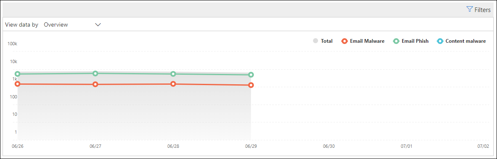
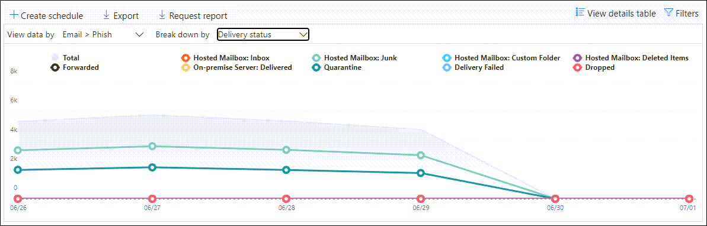

# Visa rapporter om e-postsäkerhet i Säkerhets- och efterlevnadscenter

Det finns en mängd olika rapporter i [säkerhets & Compliance Center](https://protection.office.com) som hjälper dig att se hur säkerhetsfunktionerna för e-post, till exempel skydd mot skräp post, mot skadlig program vara och krypterings funktioner i Microsoft 365 som skyddar din organisation. Om du har [nödvändig behörighet](#what-permissions-are-needed-to-view-these-reports)kan du visa dessa rapporter i säkerhets & Compliance Center genom att gå till **Reports** \> **instrument panelen**för rapporter. Öppna för att gå direkt till instrument panelen rapporter <https://protection.office.com/insightdashboard> .

## Rapport om komprometterade användare

> [!NOTE]
> Den här rapporten är tillgänglig i Microsoft 365-organisationer med Exchange Online-postlådor. Den är inte tillgänglig i fristående Exchange Online Protection-organisationer (EOP).

Rapporten **äventyrade användare** visar antalet användar konton som marker ATS som **misstänkta** eller **begränsade** under de senaste 7 dagarna. Konton i något av dessa tillstånd är problematiska eller till och med kompromissade. Med en ofta förekommande användning kan du använda rapporten för att upptäcka mellanliggande och till och med trender i misstänkta eller begränsade konton. Mer information om komprometterade användare finns i [svara på ett komprometterat e-postkonto](responding-to-a-compromised-email-account.md).

I vyn mängd visas data för de senaste 90 dagarna och detaljvyn visar data för de senaste 30 dagarna.

Om du vill visa rapporten öppnar du [säkerhets & Compliance Center](https://protection.office.com), går till **Reports** \> **instrument paneler** för rapporter och väljer **användare med kompromissade**. Om du vill gå direkt till rapporten öppnar du <https://protection.office.com/reportv2?id=CompromisedUsers> .

Du kan filtrera både diagrammet och informations tabellen genom att klicka på **filter** och välja ett eller flera av följande värden:

- **Start datum** och **slutdatum**

- **Misstänkt**: användar kontot har skickat misstänkt e-post och riskerar att begränsas från att skicka e-post.

- **Begränsat**: användar kontot har begränsats från att skicka e-post på grund av starkt misstänkta mönster.

Om du klickar på **Visa informations tabell**kan du se följande uppgifter:

- **Skapelse tid**
- **Användar-ID**
- **Fattning**

Om du vill gå tillbaka till rapportvyn klickar du på **Visa rapport**.

## Krypterings rapport

**Krypterings rapporten** är tillgänglig i EOP (abonnemang med post lådor i Exchange Online eller fristående EOP utan Exchange Online-postlådor). Din organisations säkerhets team kan använda informationen i den här rapporten för att identifiera mönster och proaktivt tillämpa eller justera principer för känsliga e-postmeddelanden. Till exempel:

- Om du ser ett stort antal e-postmeddelanden som har krypterats av användarna kanske du vill lägga till en krypterings princip för att automatisera kryptering för vissa användnings fall. Mer information finns i [definiera regler för e-postflöde för att kryptera e-postmeddelanden i Microsoft 365](../../compliance/define-mail-flow-rules-to-encrypt-email.md).

- Om du har ett antal krypteringsalgoritmer tillgängliga men ingen använder dem kan du undersöka om användarna behöver funktions träning.

Med mängd läget kan du filtrera under de senaste 90 dagarna, medan vyn detaljerad kan filtreras i 10 dagar.

Om du vill visa rapporten öppnar du [säkerhets & Compliance Center](https://protection.office.com), går till **rapport** \> **instrument panelen** och väljer **krypterings rapport**. Om du vill gå direkt till rapporten öppnar du <https://protection.office.com/reportv2?id=EncryptionReport> .

Mer information om kryptering finns i [kryptering med e-post i Microsoft 365](../../compliance/email-encryption.md).

### Rapportvy för krypterings rapporten

Du kan använda följande filter i diagrammet:

- **Visa data via: meddelande krypterings rapport** och **bryta ned efter: krypterings metod**: följande krypterings metoder är tillgängliga:

  - **Kryptering efter användare**
  - **Kryptering per princip**

  Om du klickar på **filter**kan du ändra diagrammet med följande filter:

  - **Start datum** och **slutdatum**
  - Krypterings metod.
  - Krypterings mal len.

- **Visa data via: meddelande krypterings rapport** och **bryta ned efter: krypterings mal len**: följande krypterings metoder är tillgängliga:

  - **Vidarekoppla inte**
  - **Endast kryptering**
  - **OME föregående**
  - **Företagsanpassade**

  Om du klickar på **filter**kan du ändra diagrammet med följande filter:

  - **Start datum** och **slutdatum**
  - Krypteringsmetod
  - Krypterings mal len

- **Visa data efter: de fem främsta mottagar domänerna**: i den här vyn visas ett cirkel diagram med antal skickade meddelanden för de fem främsta domänerna.

  Om du klickar på **filter**kan du välja ett **start datum** och ett **slutdatum**.

### Vyn detaljerad tabell för krypterings rapporten

Om du klickar på **Visa informations tabell**beror informationen som visas på diagrammet du tittade på:

- **Bryt ner med: krypterings metod** eller **Bryt ner med: krypterings mal len**: följande information visas:

  - **Datum**
  - **Avsändarens adress**
  - **Krypterings mal len**
  - **Krypteringsmetod**
  - **Mottagarens adress**
  - **Ämne**

- **Visa data enligt: de 5 främsta mottagar domänerna**:

  - **Datum**
  - **Mottagar domän**
  - **Antal meddelanden**
  
Om du klickar på **filter** i en detaljerad tabellvy kan du ändra resultatet med följande filter:

- **Start datum** och **slutdatum**
- Krypteringsmetod
- Krypterings mal len

Om du vill gå tillbaka till rapportvyn klickar du på **Visa rapport**.

## Flödes status rapport

I **rapporten flödes** schema visas information om skadlig program vara, skräp post, nätfiske och Edge-blockerade meddelanden. Mer information finns i [flödes status rapport](view-mail-flow-reports.md#mailflow-status-report).

## Identifiering av skadlig program vara i e-postrapport

**Identifiering av skadlig program vara i e-** postrapporten visar information om identifiering av skadlig program vara i inkommande och utgående e-postmeddelanden (malware identifieras av Exchange Online Protection eller EOP). Mer information om skydd mot skadlig program vara i EOP finns i [skydda mot skadlig program vara i EOP](anti-malware-protection.md).

 Med filtret mängd filter kan du använda 90 dagar, men det går bara att filtrera tabellen med information i 10 dagar.

Om du vill visa rapporten öppnar du [säkerhets & efterlevnad](https://protection.office.com), går till **Reports** \> **instrument paneler** för rapporter och väljer **identifiering av skadlig kod i e-post**. Om du vill gå direkt till rapporten öppnar du <https://protection.office.com/reportv2?id=MalwareDetections> .

Du kan filtrera både diagrammet och informations tabellen genom att klicka på **filter** och välja:

- **Start datum** och **slutdatum**
- **Inkommande**
- **Gående**

Om du klickar på **Visa informations tabell**kan du se följande uppgifter:

- **Datum**
- **Avsändarens adress**
- **Mottagarens adress**
- **Meddelande-ID**: tillgängligt i fältet **meddelande-ID** i meddelande huvudet och ska vara unikt. Ett exempel värde är `<08f1e0f6806a47b4ac103961109ae6ef@server.domain>` (Observera vinkelparenteser).
- **Ämne**
- **Datafil**
- **Namn på skadlig kod**

Om du vill gå tillbaka till rapportvyn klickar du på **Visa rapport**.

## Skicka och ta emot e-postrapport

Den **skickade och mottagna e-** postrapporten innehåller information om skadlig kod, skräp post, regler för e-postflöde (kallas även transport regler) och avancerade identifieringar av skadlig kod efter e-post till tjänsten. Mer information finns i [skicka och ta emot e-postrapport](view-mail-flow-reports.md#sent-and-received-email-report).

## Rapport om skräp identifiering

I rapporten **skräp identifiering** visas skräp post meddelanden som blockeras av EOP. Meddelanden räknas individuellt, inte per mottagare. Om till exempel samma skräp post skickades till 100 mottagare i din organisation räknas det som ett meddelande.

I den sammanslagna vyn kan du filtrera 90 dagar medan tabellen information tillåter filtrering i tio dagar.

Om du vill visa rapporten öppnar du [säkerhets & Compliance Center](https://protection.office.com), går till **Reports** \> **instrument paneler** för rapporter och väljer **skräp identifiering**. Om du vill gå direkt till rapporten öppnar du <https://protection.office.com/reportv2?id=SpamDetections> .

Mer information om skydd mot skräp post finns i [skydd mot skräp post i EOP](anti-spam-protection.md).

### Rapportvy för rapporten skräp identifiering

Följande diagram är tillgängliga i rapportvyn:

- **Bryt ned genom: åtgärd**: följande händelse typer visas:

  - **Skräp post filtrerat**
  - **Skräp post IP-block**
  - **Skräp post omslag**
  - **Spam DBEB filter**: mappad Edge-blockering (DBEB)

  När du hovrar över en dag (data punkt) i diagrammet kan du se hur många objekt som har blockerats den dagen samt hur objekten kategoriseras.

  

- **Bryt ned efter: riktning**: följande vägvisningar visas:

  - **Inkommande**
  - **Gående**

  

Om du klickar på **filter** i en rapportvy kan du ändra resultatet med följande filter:

- **Start datum** och **slutdatum**
- Riktnings värden
- Händelse typ värden

### Vyn detaljerad tabell för rapporten skräp identifiering

Om du klickar på **Visa informations tabell** i en rapportvy visas följande information:

- **Datum**
- **Avsändarens adress**
- **Mottagarens adress**
- **Händelse typ**
- **Fattning**
- **Ämne**

Om du klickar på **filter** i en informations tabell kan du ändra resultatet med följande filter:

- **Start datum** och **slutdatum**
- Riktnings värden
- Händelse typ värden

Om du vill gå tillbaka till rapportvyn klickar du på **Visa rapport**.

## Rapport om falska identifieringar

Rapporten **Spoof identifieringar** visar hur många e-postmeddelanden som har identifierats och vilka som ansågs "goda" (falsk e-post gjorda för legitima affärs skäl). Mer information om förfalskning finns i [skydd mot förfalskning i EOP](anti-spoofing-protection.md).

Med den sammanslagna rapporten kan du använda 90 dagar på filtreringen, men i detaljvyn kan endast tio dagar av filtrering tillåtas.

Om du vill visa rapporten öppnar du [säkerhets & Compliance Center](https://protection.office.com), går till **rapport** \> **instrument panelen** och väljer **falska identifierings**regler. Om du vill gå direkt till rapporten öppnar du <https://protection.office.com/reportv2?id=SpoofMailReport> .

När du håller mus pekaren över en dag (data punkt) i diagrammet kan du se hur många e-postmeddelanden som är falska.

Du kan filtrera både diagrammet och informations tabellen genom att klicka på **filter** och välja ett eller flera av följande värden:

- **Start datum** och **slutdatum**

- **Bra e-post**

- **Fångade som skräp post**

Om du klickar på **Visa informations tabell**kan du se följande uppgifter:

- **Datum**
- **Falsk avsändare**
- **Sant avsändare**
- **Avsändarens IP**
- **Fattning**
- **Antal meddelanden**

Om du vill gå tillbaka till rapportvyn klickar du på **Visa rapport**.

## Statusrapport för hotskydd

Status rapporten för **hotets skydd** är tillgänglig i både EOP och Office 365 ATP; rapporterna innehåller emellertid olika data. EOP kunder kan till exempel Visa information om skadlig kod som upptäckts i e-post, men inte information om [skadliga filer som identifieras i SharePoint Online, OneDrive eller Microsoft Teams](atp-for-spo-odb-and-teams.md).

I rapporten får du ett sammanslaget antal unika e-postmeddelanden med skadligt innehåll, till exempel filer eller webbplats adresser (URL: er) som blockerades av motorn mot skadlig program vara, en [hel timmes autorensning (Zap)](zero-hour-auto-purge.md)och alla ATP-funktioner som [säkra säkerhets länkar](atp-safe-links.md), [ATP-säkra bilagor](atp-safe-attachments.md)och [ATP-nätfiske](set-up-anti-phishing-policies.md). Du kan använda den här informationen för att identifiera trender eller för att avgöra om organisations principer behöver justeras.

Om du vill visa rapporten öppnar du [säkerhets & efterlevnad](https://protection.office.com), går till **Reports** \> **instrument paneler** för rapporter och väljer **skydds status**. Om du vill gå direkt till rapporten öppnar du en av följande webb adresser:

- Office 365 ATP: <https://protection.office.com/reportv2?id=ATPV2AggregateReport> .
- EOP<https://protection.office.com/reportv2?id=ATPAggregateLightReport>

Som standard visar diagrammet data för de senaste sju dagarna. Om du klickar på **filter**kan du välja ett datum intervall för 90 dagar (prov abonnemang kan vara begränsat till 30 dagar). Med vyn detaljerad tabell kan du filtrera i 30 dagar.

### Rapportvy för status rapport för hotet skydd

Följande vyer är tillgängliga:

- **Visa data via: översikt**: följande identifierings information visas:

  - **Skadlig program vara**
  - **E-Phish**
  - **Skadlig program vara**

  

- **Visa data efter: innehåll \> Malware**1: följande information visas för Office 365 ATP-organisationer:

  - **Skydd mot skadlig program vara**
  - **Fil sprängning**

  

- **Bryta ned efter: identifierings teknologi** och **Visa data via: e- \> Phish**: följande information visas:

  - **ATP – genererad URL-rykte**1
  - **Avancerat Phish-filter**
  - **Anti-förfalskningar: DMARC-fel**
  - **Anti-förfalskningar: inom organisationen**
  - **Skydd mot förfalskning: extern domän**
  - **Varumärkes-personifiering**
  - **Domän person**1
  - **EOP URL-rykte**
  - **Allmänt Phish-filter**
  - **Gemensamma**
  - **PHISH ZAP**2
  - **URL-sprängare**1
  - **Användarens personifiering**1

  

- **Bryta ned efter: identifierings teknologi** och **Visa data via: e- \> postskadlig program vara**: följande information visas:

  - **ATP – genererad fil rykte**1
  - **Skydd mot skadlig program vara**1
  - **Fil typs block för principer mot skadlig program vara**
  - **Fil Spräng**1
  - **Fil rykte**
  - **Malware, ZAP**2
  - **Gemensamma**

  

- **Bryt ned med: princip typ** och **Visa data via: e- \> Phish** eller **Visa data via: e-post för \> skadlig kod**: följande information visas:

  - **Skadlig program vara**
  - **Säker bilaga**1
  - **Anti-Phish**
  - **Skydd mot skräp post**
  - **Regel för e-postflöde** (kallas även transport regel)
  - **Gemensamma**

  

- **Bryt ner med: leverans status** och **Visa data via: e- \> Phish** eller **Visa data via: e-post för \> skadlig kod**: följande information visas:

  - **Leveransen misslyckades**
  - **Avbröts**
  - **Vidarekopplas**
  - **Den värdbaserade post lådan: anpassad mapp**
  - **Den värdbaserade post lådan: borttagna objekt**
  - **Den värdbaserade post lådan: Inkorgen**
  - **Post låda: skräp post**
  - **Lokal server: levereras**
  - **Karantän**

  

1 Office 365 ATP

2 noll-timmars autorensning (Zap) är inte tillgängligt i fristående EOP (den fungerar bara i Exchange Online-postlådor).

Om du klickar på **filter**kan du ändra rapporten med följande filter:

- **Start datum** och **slutdatum**
- Detektions värde
- **Skyddas av** (endast Office 365 ATP): **ATP** eller **EOP**. Observera att den här filter bara egenskapen inte är tillgänglig i **Visa data genom: \> skadlig program vara**.

### Vyn detaljerad tabell för status rapport för hotet skydd

Om du klickar på **Visa informations tabell**beror informationen som visas på diagrammet du tittade på:

- **Visa data efter: innehåll \> Skadlig kod**:

  - **Datum**
  - **Plats**
  - **Omkopplad av**
  - **Namn på skadlig kod**

- **Visa data efter: översikt**: knappen för **tabell information** är tillgänglig.

- Alla andra diagram:

  - **Datum**
  - **Ämne**
  - **Avsändare**
  - **Mottagarna**
  - **Identifieras av**
  - **Leverans status**
  - **Kompromiss källa**

Om du klickar på **filter**kan du ändra rapporten med följande filter:

- **Start datum** och **slutdatum**
- Detektions värde
- **Skyddas av** (endast Office 365 ATP): **ATP** eller **EOP**. Observera att den här filter bara egenskapen inte är tillgänglig i **Visa data genom: \> skadlig program vara**.

## Top skadlig kod-rapport

Den **översta program varan** rapporterar visar de olika typer av skadlig kod som identifieras av [skydd mot skadlig program vara i EOP](anti-malware-protection.md).

Om du vill visa rapporten öppnar du [säkerhets & Compliance Center](https://protection.office.com), går till **Reports** \> **instrument paneler** för rapporter och väljer **högsta skadliga program vara**. Om du vill gå direkt till rapporten öppnar du <https://protection.office.com/reportv2?id=TopMalware> .

När du hovrar över en sektor i cirkel diagrammet kan du se namnet på en typ av skadlig kod och hur många meddelanden som har identifierats.

Om du klickar på **Visa informations tabell**kan du se följande uppgifter:

- **Övre skadliga program**
- **Öka**

Om du klickar på **filter** i vyn rapport eller detaljerad tabell kan du ange ett datum intervall med **start datum** och **slutdatum**.

## Rapport om skydd mot URL-hotet

**Rapporten för skydd mot URL-hotet** är tillgänglig i Office 365 Avancerat skydd (ATP). Mer information finns i [rapporten om skydd mot URL-hotet](view-reports-for-atp.md#url-threat-protection-report).

## Rapport med rapporterat meddelande

I rapporten **rapporterad meddelanden** visas information om e-postmeddelanden som användare har rapporterat som skräp post, nät fiske försök eller god e-post med hjälp av [rapport tillägget](https://docs.microsoft.com/microsoft-365/security/office-365-security/enable-the-report-message-add-in).

Information är tillgänglig för varje meddelande, inklusive leverans orsaken, sådant undantag för skräp post eller regel för e-postflöde som har kon figurer ATS för din organisation. Om du vill visa information väljer du ett objekt i listan med användar rapporter och visar sedan informationen på flikarna **Sammanfattning** och **information** .

Om du vill visa den här rapporten gör du något av följande i avsnittet [säkerhet & regelefterlevnad](https://protection.office.com):

- Gå till instrument panel för **Threat Management** \> **Dashboard** \> **-rapporter**.

- Gå till **Threat Management** \> **Granska** \> **användardefinierade meddelanden**.

> [!IMPORTANT]
> För att det rapporterade meddelandet ska fungera korrekt **måste gransknings loggning vara aktiverat** för din Office 365-miljö. Det gör du vanligt vis av någon som har rollen gransknings loggar som tilldelats i Exchange Online. Mer information finns i [Aktivera eller inaktivera Gransknings logg för Microsoft 365](https://docs.microsoft.com/microsoft-365/compliance/turn-audit-log-search-on-or-off).

## Vilka behörigheter behövs för att visa rapporterna?

Om du vill visa och använda rapporterna måste du vara medlem i den angivna roll gruppen i säkerhets & efterföljandekrav **och** i Exchange Online.

- I säkerhets & Compliance Center måste du vara medlem i någon av följande roll grupper:

  -Organisations hantering-säkerhets administratör (du kan också göra det i [Azure Active Directory Admin Center](https://aad.portal.azure.com) -säkerhets läsare

  Mer information finns i [Behörigheter i Säkerhets- och efterlevnadscentret](https://docs.microsoft.com/microsoft-365/security/office-365-security/permissions-in-the-security-and-compliance-center).

- I Exchange Online måste du vara medlem i någon av följande roll grupper:

  -Organisations hantering-Visa endast organisations hantering-endast Visa-mottagare-kompatibilitetskontrollen

Mer information finns i [behörigheter i Exchange Online](https://docs.microsoft.com/Exchange/permissions-exo/permissions-exo) och [Hantera roll grupper i Exchange Online](https://docs.microsoft.com/Exchange/permissions-exo/role-groups).

## Vad händer om rapporterna inte visar data?

Om du inte ser data i rapporterna kontrollerar du att dina principer är korrekt konfigurerade. Mer information finns i [skydda mot hot](protect-against-threats.md).

## Relaterade ämnen

[Skydd mot skräp post och skyddet mot skadlig program vara i EOP](anti-spam-and-anti-malware-protection.md)

[Smarta rapporter och insikter i säkerhets & efterlevnad](reports-and-insights-in-security-and-compliance.md)

[Visa rapporter om e-postflöden i säkerhets & Compliance Center](view-mail-flow-reports.md)

[Visa rapporter för Office 365 Avancerat skydd](view-reports-for-atp.md)
