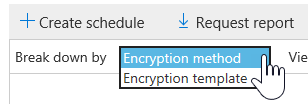

# Visa rapporter om e-postsäkerhet i Säkerhets- och efterlevnadscenter

En mängd olika rapporter finns i [Security & Compliance Center](https://protection.office.com) för att hjälpa dig att se hur säkerhetsfunktioner för e-post, till exempel anti-spam, anti-malware och krypteringsfunktioner i Microsoft 365 skyddar din organisation. Om du har [de behörigheter som krävs](#what-permissions-are-needed-to-view-these-reports)kan du visa dessa rapporter i Security & Compliance Center genom att gå till **Reports** \> **Instrumentpanelen**för rapporter .

Dina säkerhetsrapporter för e-post innehåller följande:

- [URL Threat Protection rapport](#url-threat-protection-report-new) **(NYHET!**)
- [Rapport över komprometterade användare](#compromised-users-report)
- [Krypteringsrapport](#encryption-report)
- [Statusrapport för hotskydd](#threat-protection-status-report)
- [Rapport över identifieringar av skadlig kod](#malware-detections-report)
- [Topp malware rapport](#top-malware-report)
- [Topprapport för avsändare och mottagare](#top-senders-and-recipients-report)
- [Rapport över falska identifieringar](#spoof-detections-report)
- [Rapport om skräppostidentifieringar](#spam-detections-report)
- [Skickad och mottagen e-postrapport](#sent-and-received-email-report)
- [Rapport över användarrapporterade meddelanden](#user-reported-messages-report)

## URL Threat Protection rapport **(NYHET!**)

Url-rapporten för hotskydd är tillgänglig för alla med:

- Ett exchange online-skydd *och* avancerat hotskyddstillägg (plan 1 *eller* plan 2)
- En Microsoft 365 E5-prenumeration

Detta är en klickcentrerad rapport som har två aggregerade vyer.

1. Den första vyn är genom *URL-klickskyddsåtgärd*, som fokuserar på att visa antalet URL-klick för användare i klienten och resultatet av klicket. Ett klick här anger att användaren har klickat genom blocksidan till den skadliga webbplatsen (detta kan inaktiveras av administratören inom en princip för säkra länkar).

2. Den andra vyn är *URL-klick för program*, som visar antalet webbadresser klickar i olika program som stöder säkra länkar idag, till exempel i en e-postklient eller i Microsoft Word. Data i båda aggregerade vyer uppdateras en gång var fjärde timme.

Informationstabellen i rapporten URL Threat Protection ger en vy i nästan realtid över alla klick som sker i klienten, och den innehåller undersökande information som *användarnamn*, *URL*, *nätverksmeddelande-ID* (om webbadressen klickades från ett e-postmeddelande) och annan värdefull information som är användbar för undersökningar och analyser.

Som standard visar rapporten bara data om klick från webbadresser som blockerades av säkra länkar, men det är också möjligt att se information för alla URL-klick genom att markera kryssrutan *Tillåtna webbadresser* i filtren.

Den här rapporten kommer inte att ha data med klick från användare där principen Säkra länkar som tillämpas har alternativet *Spåra inte användarens klick* markerat.

## Rapport över komprometterade användare

Den här rapporten, som är tillgänglig för alla med Exchange Online Protection, visar antalet användarkonton som markerats som misstänkta eller begränsade användare, data som är särskilt användbara eftersom konton anger något av de tillstånd som anger att användarkontot kan vara problematiskt eller till och med komprometterat. Med frekvent användning kan rapporten Komprometterad användare upptäcka toppar, och till och med trender, i konton som är markerade i misstänkta eller begränsade tillstånd, vilket ger bevis för att det kan finnas ett problem med säkerheten och välbefinnandet för din klient.

## Krypteringsrapport

**Krypteringsrapporten** visar information om e-postmeddelanden som har krypterats, antingen via organisationens principer eller via slutanvändarkontroller. Organisationens säkerhetsteam kan använda information i den här rapporten för att identifiera mönster och proaktivt tillämpa eller justera principer för känsliga e-postmeddelanden.

Om du vill visa den här rapporten går du **Reports** till rapporten \> **Rapporters instrumentpanelskryptering** i säkerhets- & compliance center \> **Encryption report**.

När rapporten öppnas första gången visas data om krypteringsmetoder som används i e-postmeddelanden under de senaste sju (7) dagarna. Du kan ändra datumintervallet och informationen som visas i rapporten genom att klicka på **Filter** i det övre högra hörnet på skärmen.

Du kan också använda **menyn Dela upp efter** för att visa data efter krypteringsmall (eller metod).

Och du kan använda **Visa data efter** meny för att ändra vyn för att se antalet krypterade meddelanden till de fem främsta mottagardomänerna.

Med flexibiliteten i den nya krypteringsrapporten kan du visa trender och vidta lämpliga åtgärder. Om du till exempel ser ett stort antal e-postmeddelanden krypterade av användare kanske du vill lägga till en krypteringsprincip för att automatisera kryptering för vissa användningsfall. (Mer information om detta finns i [Definiera regler för e-postflöde för att kryptera e-postmeddelanden i Microsoft 365](../../compliance/define-mail-flow-rules-to-encrypt-email.md).) Om du har ett antal krypteringsmallar tillgängliga men ingen använder dem kan du undersöka om användarna behöver utbildning för den funktionen.

Med hjälp av den här rapporten kan organisationens säkerhets- och efterlevnadsteam övervaka hur meddelandekryptering används och om ytterligare åtgärder behövs. Mer information om kryptering finns [i E-postkryptering i Microsoft 365](../../compliance/email-encryption.md).

## Statusrapport för hotskydd

Rapporten **Status för hotskydd** är en smart rapport som visar skadlig e-post som har upptäckts och blockerats av Exchange Online Protection. Den här rapporten är användbar för att visa e-post som identifierats som skadlig kod eller ett nätfiskeförsök över tid (upp till 90 dagar), och den gör det möjligt för säkerhetsadministratörer att identifiera trender eller avgöra om principer behöver justeras.

> [!NOTE]
> En rapport om status för hotskydd är tillgänglig för kunder som har antingen [Office 365 ATP](https://docs.microsoft.com/microsoft-365/security/office-365-security/office-365-atp) eller [Exchange Online Protection](exchange-online-protection-overview.md) (EOP). Informationen som visas i rapporten Status för hotskydd för ATP-kunder innehåller dock sannolikt andra data än vad EOP-kunder kan se. EOP-kunder kan till exempel visa information om skadlig kod som identifierats i e-post, men inte information om [skadliga filer som identifierats i SharePoint Online, OneDrive eller Microsoft Teams](https://docs.microsoft.com/microsoft-365/security/office-365-security/atp-for-spo-odb-and-teams), en ATP-specifik funktion. (Läs[mer om ATP-rapporter](https://docs.microsoft.com/microsoft-365/security/office-365-security/view-reports-for-atp).)

Om du vill visa den här rapporten går du till **Rapporter om** skydd av instrumentpanelshotskydd i [Säkerhets- & Compliance Center](https://protection.office.com) \> **Dashboard** \> **Threat Protection Status**.

När du först öppnar rapporten Status för hotskydd visar rapporten data för de senaste sju dagarna som standard. Du kan dock klicka på **Filter** och ändra datumintervallet i upp till 90 dagars detalj. (Om du använder en utvärderingsprenumeration kan du vara begränsad till 30 dagars data.)

Den här rapporten är användbar för att visa effektiviteten och effekten av organisationens [Exchange Online Protection-funktioner](https://docs.microsoft.com/microsoft-365/security/office-365-security/eop-features)och för långsiktiga trender.

Du kan också välja om du vill visa data för e-post som identifierats som skadlig, e-post som identifierats som ett nätfiskeförsök eller e-post som identifierats som innehållande skadlig kod.

## Rapport över identifieringar av skadlig kod

Rapporten **Identifiering av skadlig kod** visar hur många inkommande och utgående meddelanden som har identifierats som innehållande skadlig kod för din organisation.

Om du vill visa [&](https://protection.office.com)den här rapporten går du till **Rapporter om** identifiering av \> **instrumentpanelsdym** \> **malware**.

I likhet med andra rapporter, till exempel [rapporten Status för hotskydd,](#threat-protection-status-report)visar rapporten data för de senaste sju dagarna som standard. Du kan dock välja **Filter för** att ändra datumintervallet.

## Topp malware rapport

Top **Malware** rapporten visar de olika typer av skadlig kod som upptäcktes av [Exchange Online](https://docs.microsoft.com/microsoft-365/security/office-365-security/eop-features).

Om du vill visa [&](https://protection.office.com)den här rapporten går du till **Rapporter om** \> **instrumentpanelens** bästa skadliga \> **program**.

När du hovrar över en kil i cirkeldiagrammet kan du se namnet på en typ av skadlig kod och hur många meddelanden som har upptäckts ha den skadliga koden.

Klicka (eller tryck) på rapporten för att öppna den i ett nytt webbläsarfönster, där du kan få en mer detaljerad vy av rapporten.

Under diagrammet visas en lista över upptäckt skadlig kod och hur många meddelanden som har upptäckts som att ha den skadliga koden.

## Topprapport för avsändare och mottagare

Rapporten **Toppavsändare och mottagare** är ett cirkeldiagram som visar dina främsta e-postavsändare.

Om du vill visa den här rapporten går du till **Rapporter över** avsändare och mottagare för [&](https://protection.office.com) \> **Dashboard** \> **instrumentpanelen.**

När du hovrar över en kil i cirkeldiagrammet kan du se ett antal meddelanden som skickas eller tas emot.

Klicka (eller tryck) på rapporten för att öppna den i ett nytt webbläsarfönster, där du kan få en mer detaljerad vy av rapporten.

Använd listan **Visa data för** att välja om du vill visa data för de främsta avsändarna, mottagarna, skräppostmottagarna och mottagarna av skadlig programvara. Du kan också se vem som fick skadlig kod som upptäcktes av [Exchange Online Protection](exchange-online-protection-overview.md).

Under diagrammet ser du vilka de främsta e-postavsändarna eller mottagarna var, tillsammans med ett antal meddelanden som skickats eller tagits emot under den angivna tidsperioden.

## Rapport över falska identifieringar

**Rapporten Spoof Detections** visar hur många falska e-postmeddelanden som upptäcktes och vilka som ansågs vara "bra" (falska e-postmeddelanden gjorda av legitima affärsskäl).

Om du vill visa den här rapporten går du till **Rapporter** instrumentpanelsspoof [Security & Compliance Center](https://protection.office.com) \> **Dashboard** \> **E-post**i Säkerhets- & Compliance Center .

När du hovrar över en dag i diagrammet kan du se hur många falska e-postmeddelanden som kom fram.

Klicka (eller tryck) på rapporten för att öppna den i ett nytt webbläsarfönster, där du kan få en mer detaljerad vy av rapporten. Mer information om skydd mot förfalskning finns i Skydd mot förfalskning [i Microsoft 365](anti-spoofing-protection.md).

## Rapport om skräppostidentifieringar

Rapporten **Skräppostidentifieringar** visar allt skräppostinnehåll som blockeras av Exchange Online. Meddelanden räknas per meddelande och inte per mottagare. Om ett e-postmeddelande till exempel skickades till 100 mottagare i organisationen räknas det som ett meddelande.

Om du vill visa den här rapporten går du till **Rapporter om** [Security & Compliance Center](https://protection.office.com) \> **Dashboard** \> **skräppostidentifieringar**för instrumentpanelen i säkerhets- & compliance center .

När du hovrar över en dag i diagrammet kan du se hur många objekt som blockerades den dagen och hur dessa objekt kategoriseras. Du kan till exempel se hur många skräppostmeddelanden som filtrerats och hur många objekt som kom från en blockerad IP-adress (Internet Protocol).

Klicka (eller tryck) på rapporten för att öppna den i ett nytt webbläsarfönster, där du kan få en mer detaljerad vy av rapporten.

Under diagrammet visas en lista över skräppostobjekt som har upptäckts. Välj ett objekt om du vill visa ytterligare information, till exempel om skräppostobjektet var inkommande eller utgående, dess meddelande-ID och dess mottagare. Mer information om skydd mot skräppost finns i [Office 365-skydd mot skräppost via e-post](https://docs.microsoft.com/microsoft-365/security/office-365-security/anti-spam-and-anti-malware-protection).

## Skickad och mottagen e-postrapport

Rapporten **Skickat och mottaget e-post** är en smart rapport som visar information om inkommande och utgående e-post, inklusive skräppostidentifieringar, skadlig kod och e-post som identifierats som "bra".

Om du vill visa den här rapporten går du till **Instrumentpanelen för rapporter** som [Security & Compliance Center](https://protection.office.com) \> **Dashboard** \> **skickats och tagits emot via e-post**i Säkerhets- & Compliance Center .

När du hovrar över en dag i diagrammet kan du se hur många meddelanden som kom in och hur dessa meddelanden kategoriseras. Du kan till exempel se hur många meddelanden som har identifierats som innehållande skadlig kod och hur många som identifierades som skräppost.

Klicka (eller tryck) på rapporten för att öppna den i ett nytt webbläsarfönster, där du kan få en mer detaljerad vy av rapporten.

Du kan använda listan **Dela upp efter** för att visa information efter typ eller riktning (inkommande och utgående).

Under diagrammet visas en lista över e-postkategorier, till exempel **GoodMail**, **SpamContentFiltered**och så vidare. Välj en kategori om du vill visa ytterligare information, till exempel åtgärder som har vidtagits för skadlig kod, och om e-post var inkommande eller utgående.

Mer information om e-postinformation finns [i Information om e-postflöde i Microsoft 365](https://docs.microsoft.com/microsoft-365/security/office-365-security/mail-flow-intelligence-in-office-365).

## Rapport över användarrapporterade meddelanden

Rapporten Meddelanden som rapporterats av användaren visar information om **e-postmeddelanden** som användare har rapporterat som skräppost, nätfiskeförsök eller bra [e-post](https://docs.microsoft.com/microsoft-365/security/office-365-security/enable-the-report-message-add-in)med hjälp av tillägget Rapportera meddelande .

Information är tillgänglig för varje meddelande, inklusive leveransorsaken, ett sådant undantag för skräppostprinciper eller e-postflödesregel som konfigurerats för din organisation. Om du vill visa information markerar du ett objekt i listan med användarrapporter och visar sedan informationen på flikarna **Sammanfattning** och **Information.**

Så här visar du den här rapporten i [Security & Compliance Center:](https://protection.office.com)

- Gå **Threat management** till \> **Dashboard** \> **Användarrapporterade meddelanden**för hothanteringshantering .

- Gå till **Hothantering** \> **Granska** \> **användarrapporterade meddelanden**.

> [!IMPORTANT]
> För att rapporten Användarrapporterade meddelanden ska fungera korrekt **måste granskningsloggning vara aktiverat** för Office 365-miljön. Detta görs vanligtvis av någon som har rollen Granskningsloggar tilldelad i Exchange Online. Mer information finns i [Aktivera eller inaktivera granskningsloggsökning för Microsoft 365.](https://docs.microsoft.com/microsoft-365/compliance/turn-audit-log-search-on-or-off)

## Vilka behörigheter behövs för att visa dessa rapporter?

Om du vill visa och använda de rapporter som beskrivs i den här artikeln **måste du ha en lämplig roll tilldelad för både Security & Compliance Center och Administrationscenter för Exchange**.

- För Security & Compliance Center måste du ha tilldelat någon av följande roller:

  -Organisationshantering -Säkerhetsadministratör (detta kan tilldelas i Azure Active Directory admin center ( [https://aad.portal.azure.com](https://aad.portal.azure.com) ) -Security Reader

- För Exchange Online måste du ha någon av följande roller tilldelad i administrationscentret för Exchange ( [https://outlook.office365.com/ecp](https://outlook.office365.com/ecp) ) eller med PowerShell-cmdletar (Se [Exchange Online PowerShell):](https://docs.microsoft.com/powershell/exchange/exchange-online-powershell)

  -Organisationshantering -Endast vyorganisation Organisation Management -Roll för endast vymottagare -efterlevnadshantering

Mer information finns i följande resurser:

- [Behörigheter i Säkerhets- och efterlevnadscentret](https://docs.microsoft.com/microsoft-365/security/office-365-security/permissions-in-the-security-and-compliance-center)
 
- [Funktionsbehörigheter i Exchange Online](https://docs.microsoft.com/exchange/permissions-exo/feature-permissions)

## Vad händer om rapporterna inte visar data?

Om du inte ser data i dina rapporter dubbelkollar du att dina principer är korrekt konfigurerade. Mer information finns [i Skydda mot hot i Microsoft 365](https://docs.microsoft.com/microsoft-365/security/office-365-security/protect-against-threats).

## Relaterade ämnen

[Microsoft 365 E-post mot skräppost skydd](https://docs.microsoft.com/microsoft-365/security/office-365-security/anti-spam-and-anti-malware-protection)

[Rapporter och insikter i Security & Compliance Center](https://docs.microsoft.com/microsoft-365/security/office-365-security/reports-and-insights-in-security-and-compliance)
