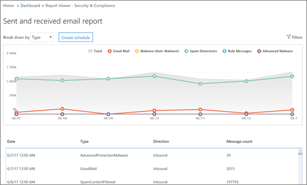

# Visa e-postsäkerhetsrapporter &amp; i Säkerhetsefterlevnadscenter

En mängd olika rapporter finns i [Security &amp; Compliance Center](https://protection.office.com) som hjälper dig att se hur e-postsäkerhetsfunktioner, till exempel anti-spam, anti-malware och krypteringsfunktioner i Office 365 skyddar din organisation. Om du har [de behörigheter som krävs](#what-permissions-are-needed-to-view-these-reports)kan &amp; du visa dessa rapporter i Security Compliance Center genom att gå till **instrumentpanelen** **rapporter** \> .
  

  
Dina e-postsäkerhetsrapporter innehåller följande:
- [Rapporten komprometterade användare (**NY!**)](#compromised-users-report-new)
- [Krypteringsrapport](#encryption-report)
- [Rapport om skydd för hot](#threat-protection-status-report) 
- [Rapport om identifiering av skadlig kod](#malware-detections-report) 
- [Rapport över bästa skadliga program](#top-malware-report)
- [Rapport över de bästa avsändare och mottagare](#top-senders-and-recipients-report)
- [Rapport över förfalskningar](#spoof-detections-report)
- [Rapport om identifiering av skräppost](#spam-detections-report)
- [Skickad och mottagen e-postrapport](#sent-and-received-email-report)
- [Rapport över användarrapporterade meddelanden](#user-reported-messages-report)

## Rapporten komprometterade användare (**NY!**) 

Den här rapporten, tillgänglig för alla med Exchange Online Protection, visar antalet användarkonton markerade som misstänkta eller begränsade användare, data som är särskilt användbara när konton anger något av de tillstånd som anger att användarkontot kan vara problematiskt, eller till och med Äventyras. Med frekvent användning kan rapporten Komprometterad användare upptäcka toppar, och även trender, i konton som är markerade i misstänkta eller begränsade tillstånd, vilket ger bevis kan det finnas ett problem med säkerhet och välbefinnande för din klient.

## Krypteringsrapport

**I krypteringsrapporten** visas information om e-postmeddelanden som har krypterats, antingen via organisationens principer eller via slutanvändarkontroller. Organisationens säkerhetsteam kan använda information i den här rapporten för att identifiera mönster och proaktivt tillämpa eller justera principer för känsliga e-postmeddelanden.

Om du vill visa den här rapporten går du till **rapporten Kryptering** \> av rapporter **i** \> **säkerhets&** Compliance Center .

 

När rapporten öppnas första gången visas data om krypteringsmetoder som används på e-postmeddelanden under de senaste sju (7) dagarna. Du kan ändra datumintervallet och informationen som visas i rapporten genom att klicka på **Filter** i det övre högra hörnet på skärmen.

   

Du kan också använda **menyn Dela upp efter** för att visa data efter krypteringsmall (eller metod).

Och du kan använda **visa data efter** meny för att ändra vyn för att se antal krypterade meddelanden till de fem bästa mottagardomänerna.

Med flexibiliteten i den nya krypteringsrapporten kan du visa trender och vidta lämpliga åtgärder. Om du till exempel ser ett stort antal e-postmeddelanden som krypterats av användare kanske du vill lägga till en krypteringsprincip för att automatisera kryptering för vissa användningsfall. (Om du vill ha hjälp med det finns [i Definiera regler för e-postflöde för att kryptera e-postmeddelanden i Office 365](../../compliance/define-mail-flow-rules-to-encrypt-email.md).) Om du har ett antal krypteringsmallar tillgängliga men ingen använder dem kan du till exempel undersöka om användarna behöver utbildning för den funktionen. 

Med den här rapporten kan organisationens säkerhets- och efterlevnadsteam övervaka hur meddelandekryptering används och om ytterligare åtgärder behövs. Mer information om kryptering finns [i E-postkryptering i Office 365](../../compliance/email-encryption.md).

## Rapport om skydd för hot

Rapporten Status för **skydd för hot** är en smart rapport som visar skadligt e-postmeddelande som har upptäckts och blockerats av Exchange Online Protection. Den här rapporten är användbar för att visa e-post som identifierats som skadlig kod eller ett nätfiskeförsök över tid (upp till 90 dagar), och det gör det möjligt för säkerhetsadministratörer att identifiera trender eller avgöra om principer behöver justeras.

> [!NOTE]
> En statusrapport för hotskydd är tillgänglig för kunder som antingen har [Office 365 ATP](https://docs.microsoft.com/microsoft-365/security/office-365-security/office-365-atp) eller [Exchange Online Protection](https://docs.microsoft.com/microsoft-365/security/office-365-security/what-is-eop) (EOP). Informationen som visas i rapporten Status status för hotskydd för ATP-kunder kommer dock sannolikt att innehålla andra data än vad EOP-kunder kan se. EOP-kunder kan till exempel visa information om skadlig kod som upptäckts i e-post, men inte information om [skadliga filer som upptäckts i SharePoint Online, OneDrive eller Microsoft Teams](https://docs.microsoft.com/microsoft-365/security/office-365-security/atp-for-spo-odb-and-teams), en ATP-specifik funktion. (Läs[mer om ATP-rapporter](https://docs.microsoft.com/microsoft-365/security/office-365-security/view-reports-for-atp).)
  
Om du vill visa [ &amp; ](https://protection.office.com)den här rapporten går du till Status för **rapportinstrumentpanelens** \> **Reports** \> **hotskydd**.
  

  
När du öppnar rapporten Status för hotskydd visas data för de senaste sju dagarna som standard. Du kan dock klicka på **Filter** och ändra datumintervallet i upp till 90 dagar med detaljer. (Om du använder en utvärderingsprenumeration kan du vara begränsad till 30 dagars data.)

Den här rapporten är användbar för att visa effektiviteten och effekten av organisationens [Exchange Online Protection-funktioner](https://docs.microsoft.com/microsoft-365/security/office-365-security/eop-features)och för långsiktig trendning. 
  

  
Du kan också välja om du vill visa data för e-post som identifieras som skadligt, e-postmeddelande som identifieras som ett nätfiskeförsök eller e-post som identifieras som innehåller skadlig kod.
  

  
## Rapport om identifiering av skadlig kod

Rapporten **Identifiering av skadlig kod** visar hur många inkommande och utgående meddelanden som upptäcktes innehållande skadlig kod för din organisation. 
  
Om du vill visa [ &amp; den](https://protection.office.com)här rapporten går du till **Rapporter** \> **Dashboard** \> **Malware Detections**.
  

  
I likhet med andra rapporter, till exempel rapporten Status för [hotskydd,](#threat-protection-status-report)visas data för de senaste sju dagarna som standard. Du kan dock välja **Filter** för att ändra datumintervallet. 
  
## Rapport över bästa skadliga program

Top **Malware** rapporten visar de olika typer av skadlig kod som upptäcktes av [Exchange Online](https://docs.microsoft.com/microsoft-365/security/office-365-security/eop-features). 
  
Om du vill visa den här rapporten går du till **Rapporterar** \> **Dashboard** \> **Top Malware**i [Säkerhetsefterlevnadscenter &amp; ](https://protection.office.com).
  

  
När du hovrar över en kil i cirkeldiagrammet kan du se namnet på en slags skadlig kod och hur många meddelanden som upptäcktes ha den skadliga koden.
  
Klicka (eller tryck) på rapporten för att öppna den i ett nytt webbläsarfönster, där du kan få en mer detaljerad vy av rapporten.
  

  
Under diagrammet visas en lista över upptäckt skadlig kod och hur många meddelanden som upptäcktes ha den skadliga koden.
  
## Rapport över de bästa avsändare och mottagare

Rapporten **Överst avsändare och mottagare** är ett cirkeldiagram som visar dina bästa e-postavsändare. 
  
Om du vill visa den här rapporten går du till **Rapporterar** \> **Dashboard** \> Top Avsändare och mottagare i [ &amp; Säkerhetsefterlevnadscenter](https://protection.office.com). **Top Senders and Recipients**
  

  
När du hovrar över en kil i cirkeldiagrammet kan du se ett antal meddelanden som skickas eller tas emot.
  
Klicka (eller tryck) på rapporten för att öppna den i ett nytt webbläsarfönster, där du kan få en mer detaljerad vy av rapporten.
  
Använd listan **Visa data för** att välja om du vill visa data för toppavsändare, mottagare, skräppostmottagare och mottagare av skadlig kod. Du kan också se vem som har tagit emot skadlig kod som har upptäckts av [Exchange Online Protection](https://docs.microsoft.com/microsoft-365/security/office-365-security/what-is-eop). 
  

  
Under diagrammet ser du vilka de bästa e-postavsändarna eller mottagarna var, tillsammans med antalet meddelanden som skickats eller tagits emot under den angivna tidsperioden.
  
## Rapport över förfalskningar

**Spoof Detections** rapporten visar hur många falska postmeddelanden upptäcktes, och av dem, vilka som ansågs vara "bra" (parodi post gjort av legitima affärsskäl). 
  
Om du vill visa den här rapporten går du till **Reports** \> **Dashboard** \> **Spoof Mail**i [ &amp; Säkerhetsefterlevnadscenter](https://protection.office.com).
  

  
När du hovrar över en dag i diagrammet kan du se hur många falska e-postmeddelanden som kom igenom.
  
Klicka (eller tryck) på rapporten för att öppna den i ett nytt webbläsarfönster, där du kan få en mer detaljerad vy av rapporten. Mer information om skydd mot förfalskning finns [i Anti-spoofing-skydd i Office 365](https://docs.microsoft.com/microsoft-365/security/office-365-security/anti-spoofing-protection).
  
## Rapport om identifiering av skräppost

Rapporten **Skräppostidentifiering visar** allt spaminnehåll som blockeras av Exchange Online. Meddelanden räknas per meddelande och inte per mottagare. Om ett e-postmeddelande till exempel skickades till 100 mottagare i organisationen räknas det som ett meddelande.
  
Om du vill visa den här rapporten går du till **Reports** \> **Dashboard** \> Spam Detections i [ &amp; Säkerhetsefterlevnadscenter](https://protection.office.com). **Spam Detections**
  

  
När du hovrar över en dag i diagrammet kan du se hur många objekt som har blockerats den dagen, samt hur dessa objekt kategoriseras. Du kan till exempel se hur många skräppostmeddelanden som har filtrerats och hur många objekt som kom från en blockerad IP-adress (Internet Protocol).
  
Klicka (eller tryck) på rapporten för att öppna den i ett nytt webbläsarfönster, där du kan få en mer detaljerad vy av rapporten.
  

  
Under diagrammet visas en lista över skräppostobjekt som har upptäckts. Välj ett objekt om du vill visa ytterligare information, till exempel om skräppostobjektet var inkommande eller utgående, meddelande-ID och dess mottagare. Mer information om skydd mot skräppost finns i [Office 365-skydd för skräppost.](https://docs.microsoft.com/microsoft-365/security/office-365-security/anti-spam-and-anti-malware-protection)
  
## Skickad och mottagen e-postrapport

Den **skickade och mottagna e-postrapporten** är en smart rapport som visar information om inkommande och utgående e-post, inklusive skräppost, skadlig kod och e-post som identifieras som "bra". 
  
Om du vill visa den här rapporten går du till \> **Rapportinstrumentpanelen** \> **som skickats och fått e-post**i [Säkerhetsefterlevnadscenter. &amp; ](https://protection.office.com) **Reports**
  

  
När du hovrar över en dag i diagrammet kan du se hur många meddelanden som kom in och hur dessa meddelanden kategoriseras. Du kan till exempel se hur många meddelanden som har upptäckts innehålla skadlig kod och hur många som identifierats som skräppost.
  
Klicka (eller tryck) på rapporten för att öppna den i ett nytt webbläsarfönster, där du kan få en mer detaljerad vy av rapporten.
  
Du kan använda listan **Dela upp efter** för att visa information efter typ eller efter riktning (inkommande och utgående). 
  

  
Under diagrammet visas en lista över e-postkategorier, till exempel **GoodMail**, **SpamContentFiltered**och så vidare. Välj en kategori om du vill visa ytterligare information, till exempel åtgärder som har vidtagits för skadlig kod och om e-post var inkommande eller utgående.
  

Mer information om e-postinformation finns [i E-postflödesinformation i Office 365](https://docs.microsoft.com/microsoft-365/security/office-365-security/mail-flow-intelligence-in-office-365).
  
## Rapport över användarrapporterade meddelanden

Rapporten **Användarrapporterade meddelanden** visar information om e-postmeddelanden som användare har rapporterat som skräppost, nätfiskeförsök eller bra [e-post](https://docs.microsoft.com/microsoft-365/security/office-365-security/enable-the-report-message-add-in)med tillägget Rapportmeddelande .
  
Information finns tillgänglig för varje meddelande, inklusive leveransorsaken, ett sådant undantag för skräppostprinciper eller en regel för skräppostregler som konfigurerats för din organisation. Om du vill visa information markerar du ett objekt i listan över användarrapporter och visar sedan informationen på flikarna **Sammanfattning** och **Information.** 
  

  
Om du vill visa den här rapporten gör du något av följande i [Säkerhetsefterlevnadscenter: &amp; ](https://protection.office.com)
  
- Gå till **Threat management** \> **Dashboard** \> **Användarrapporterade meddelanden**.
    
- Gå till **Threat management** \> **Granska** \> **användarrapporterade meddelanden**.
    

  
> [!IMPORTANT]
> För att rapporten Användarrapporterade meddelanden ska fungera korrekt **måste granskningsloggning vara aktiverad** för din Office 365-miljö. Detta görs vanligtvis av någon som har rollen Granskningsloggar tilldelad i Exchange Online. Mer information finns i [Aktivera eller inaktivera granskningsloggen för Office 365.](https://docs.microsoft.com/microsoft-365/compliance/turn-audit-log-search-on-or-off) 
  
## Vilka behörigheter krävs för att visa dessa rapporter?

För att kunna visa och använda de rapporter som beskrivs i den här artikeln **måste du ha en lämplig roll som tilldelats både administrationscenter för säkerhetsefterlevnad &amp; och administrationscentret för Exchange**.

- För Security &amp; Compliance Center måste du ha en av följande roller tilldelad:
    - Organisationshantering
    - Säkerhetsadministratör (detta kan tilldelas i Administrationscentret[https://aad.portal.azure.com](https://aad.portal.azure.com)för Azure Active Directory ( )
    - Säkerhetsläsare

- För Exchange Online måste du ha en av följande roller som[https://outlook.office365.com/ecp](https://outlook.office365.com/ecp)tilldelats i antingen Administrationscentret för Exchange ( ) eller med PowerShell-cmdlets (se [Exchange Online PowerShell):](https://docs.microsoft.com/powershell/exchange/exchange-online/exchange-online-powershell?view=exchange-ps)
    - Organisationshantering
    - Organisationshantering för endast vy
    - Roll för endast visningsmottagare
    - Efterlevnadshantering

Mer information finns i följande resurser:

- [Permissions in the Office 365 Security &amp; Compliance Center](https://docs.microsoft.com/microsoft-365/security/office-365-security/permissions-in-the-security-and-compliance-center)

- [Funktionsbehörigheter i Exchange Online](https://docs.microsoft.com/exchange/permissions-exo/feature-permissions)
   
   
## Vad händer om rapporterna inte visar data?

Om du inte ser data i rapporterna dubbelkontrollerar du att dina principer har konfigurerats korrekt. Mer information finns i [Skydda mot hot i Office 365](https://docs.microsoft.com/microsoft-365/security/office-365-security/protect-against-threats).
  
## Relaterade ämnen

[Skydd mot skräppost i Office 365](https://docs.microsoft.com/microsoft-365/security/office-365-security/anti-spam-and-anti-malware-protection)
  
[Rapporter och insikter i Office 365 Security &amp; Compliance Center](https://docs.microsoft.com/microsoft-365/security/office-365-security/reports-and-insights-in-security-and-compliance)
  
[Skapa ett schema för en &amp; rapport i Security Compliance Center](https://docs.microsoft.com/microsoft-365/security/office-365-security/create-a-schedule-for-a-report)
  
[Konfigurera och hämta en anpassad &amp; rapport i Security Compliance Center](https://docs.microsoft.com/microsoft-365/security/office-365-security/set-up-and-download-a-custom-report)
  

