# Visa rapporter om e-postflöden i instrument panelen för säkerhet &

[!INCLUDE [Microsoft 365 Defender rebranding](../includes/microsoft-defender-for-office.md)]

Utöver de e-postflödes rapporter som är tillgängliga i [instrument panelen för e-postflöden](mail-flow-insights-v2.md) i säkerhets & Compliance Center finns det flera olika e-postflödes rapporter som hjälper dig att övervaka din Microsoft 365-organisation.

Om du har [nödvändig behörighet](#what-permissions-are-needed-to-view-these-reports)kan du visa dessa rapporter i [säkerhets & Compliance Center](https://office.protection.com) genom att gå till **Reports** \> **instrument panelen** för rapporter. Öppna för att gå direkt till instrument panelen rapporter <https://protection.office.com/insightdashboard> .

## Kopplings rapport

**Kopplings rapporten** visar aktivitet för e-postflöde i de [inkommande och utgående kopplingarna](https://docs.microsoft.com/Exchange/mail-flow-best-practices/use-connectors-to-configure-mail-flow/use-connectors-to-configure-mail-flow) som har kon figurer ATS för organisationen.

Om du vill visa rapporten öppnar du [säkerhets & Compliance Center](https://protection.office.com), går till **rapport** \> **instrument panelen** och väljer **kopplings rapport**. Om du vill gå direkt till rapporten öppnar du <https://protection.office.com/reportv2?id=ConnectorReport> .

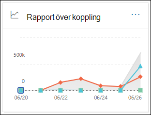

### Rapportvy för kopplings rapporten

Följande diagram är tillgängliga i rapportvyn:

- **Visa data via: e-post** : det här diagrammet visar antalet inkommande och utgående meddelanden sorterade efter:

  - **Totalt**
  - **Från Internet utan en koppling**
  - **Till Internet utan en koppling**
  - En specifik koppling som du har konfigurerat.

  Om du vill isolera data i diagrammet använder du kryss rutan **Visa data för** kontroll och väljer ett av dessa alternativ eller **alla e-postflöde**.

  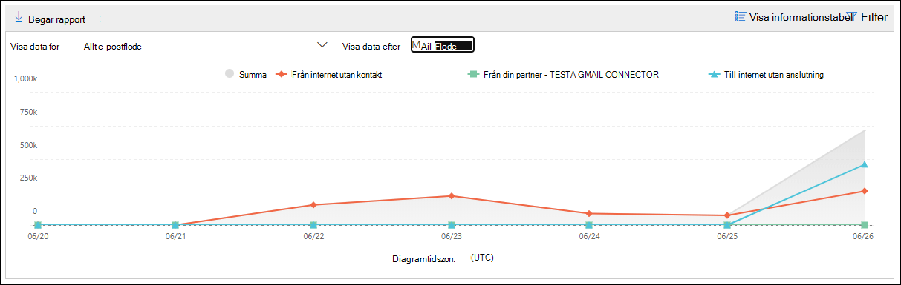

- **Visa data genom: TLS-användning** : det här diagrammet visar procent av TLS-version (Transport Layer Security) för e-postflöde.

  Om du vill isolera data i diagrammet använder du alternativet **Visa data för** kontroll och väljer något av följande alternativ:

  - **Alla e-postflöden**
  - **Från Internet utan en koppling**
  - **Till Internet utan en koppling**
  - En specifik koppling som du har konfigurerat.

  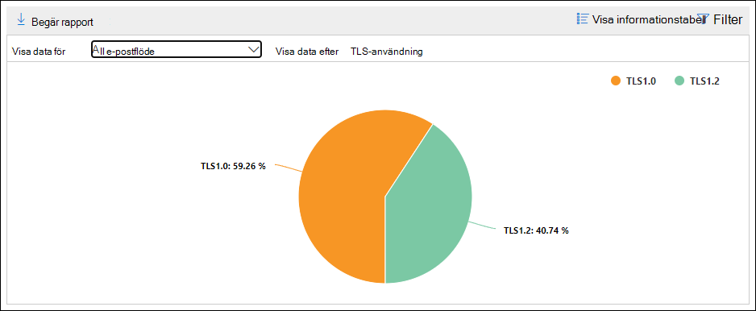

Om du klickar på **filter** i en rapportvy kan du ange ett datum intervall med **start datum** och **slutdatum**.

### Vyn detaljerad tabell för kopplings rapporten

Om du klickar på **Visa informations tabell** i en rapportvy visas följande information:

- **Datum**
- **Kopplingens riktning och namn**
- **Kopplings typ**
- **Tvingad TLS?** : värdet **Sant** eller **falskt**.
- **Inget TLS** (procent)
- **TLS 1,0** (procent)
- **TLS 1,1** (procent)
- **TLS 1,2** (procent)
- **Volym** : antalet meddelanden.

Om du klickar på **filter** i en detaljerad tabellvy kan du ange ett datum intervall med **start datum** och **slutdatum**.

Om du vill gå tillbaka till rapportvyn klickar du på **Visa rapport**.

## Rapport om Exchange-transportprovidern

I **rapporten Exchange Transport Rule** visas resultatet av regler för e-postflöden (kallas även transport regler) i inkommande och utgående meddelanden i organisationen.

Om du vill visa rapporten öppnar du [säkerhets & Compliance Center](https://protection.office.com), går till **Reports** \> **instrument paneler** för rapporter och väljer **Exchange Transport Rule**. Om du vill gå direkt till rapporten öppnar du <https://protection.office.com/reportv2?id=ETRRuleReport> .

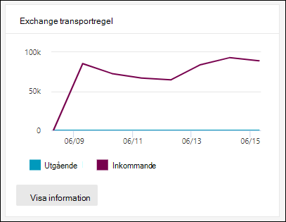

### Rapportvy för rapporten om Exchange-transportprovidern

Följande diagram är tillgängliga i rapportvyn:

- **Visa data genom att: Exchange-regler** \> **Bryt ned efter: riktning** : det här diagrammet visar antalet **inkommande** och **utgående** meddelanden som påverkades av transport regler.

- **Visa data genom att: Exchange-regler** \> **Bryt ned med: allvarlighets** grad: det här diagrammet visar antalet **högsta allvarlighets** **grad och mellanliggande och** **lågprioriterade** meddelanden. Du anger allvarlighets nivån som en åtgärd i regeln ( **Granska den här regeln med allvarlighets grad** eller _SetAuditSeverity_ ). Mer information finns i [åtgärder för e-postflödes regler i Exchange Online](https://docs.microsoft.com//Exchange/security-and-compliance/mail-flow-rules/mail-flow-rule-actions).

- **Visa data med: transport regler** \> för DLP Exchange **Bryt ned efter: riktning** : det här diagrammet visar antalet **inkommande** och **utgående** meddelanden som påverkades av transport reglerna för data förlust skydd (DLP). Du kan förfina diagrammet ytterligare genom att välja något av följande alternativ:

  - **Visa data för: alla DLP transport regler**
  - **Visa data för: äventyrade användare**
  - **Visa data för: den billiga Patriot Act har identifierats**

- **Visa data med: transport regler** \> för DLP Exchange **Bryt ned efter: riktning** : den här vyn visar antalet **högsta allvarlighets** **grad och mellanliggande och** **låg allvarlighets grad** meddelanden som påverkades av DLP transport regler. Du kan förfina diagrammet ytterligare genom att välja något av följande alternativ:

  - **Visa data för: alla DLP transport regler**
  - **Visa data för: äventyrade användare**
  - **Visa data för: den billiga Patriot Act har identifierats**

Om du klickar på **filter** i en rapportvy kan du ändra resultatet med följande filter::

- **Start datum** och **slutdatum**
- Riktnings värden
- Allvarlighets värden

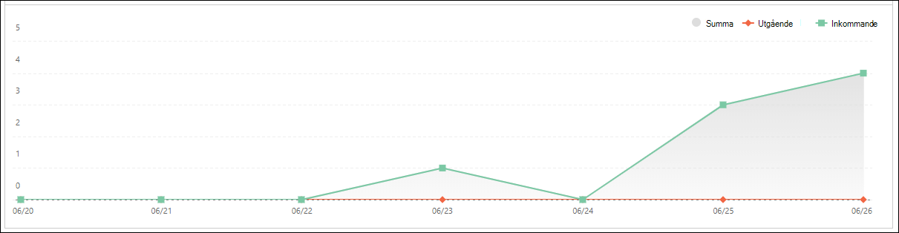

### Vyn detaljerad tabell för rapporten Exchange-överföring

Om du klickar på **Visa informations tabell** beror informationen som visas på diagrammet du tittade på:

- **Visa data genom: Exchange-transportläge** :

  - **Datum**
  - **Transport regel**
  - **Ämne**
  - **Avsändarens adress**
  - **Mottagarens adress**
  - **Allvarlighets grad**
  - **Riktning**

- **Visa data med: transport regler för DLP Exchange** :

  - **Datum**
  - **DLP-princip**
  - **Transport regel**
  - **Ämne**
  - **Avsändarens adress**
  - **Mottagarens adress**
  - **Allvarlighets grad**
  - **Riktning**

Om du klickar på **filter** i en detaljerad tabellvy kan du ändra resultatet med följande filter:

- **Start datum** och **slutdatum**
- Riktnings värden
- Allvarlighets värden

Om du vill gå tillbaka till rapportvyn klickar du på **Visa rapport**.

## Vidarebefordra rapport

I **vidarekoppling** visas organisationens automatiskt vidarebefordrade meddelanden till externa domäner från Exchange Online-postlådor. Vidarebefordrade meddelanden kan utgöra en säkerhets-eller efterlevnad och kan tyda på ett komprometterat konto.

Om du vill visa rapporten öppnar du [säkerhets & Compliance Center](https://protection.office.com), går till **Reports** \> **instrument paneler** för rapporter och väljer **vidarebefordra rapport**. Om du vill gå direkt till rapporten öppnar du <https://protection.office.com/reportv2?id=MailFlowForwarding> .

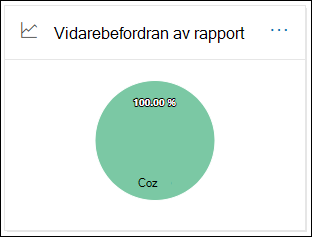

### Rapportvy för rapport för vidarebefordran

Följande diagram är tillgängliga i rapportvyn:

- **Visa data för: metod för vidarekoppling** : följande metoder visas:

  - **Transport regel** : kallas även för [regler för e-postflöde](https://docs.microsoft.com/Exchange/security-and-compliance/mail-flow-rules/mail-flow-rules).
  - **Post lådans regel** : kallas även för [regler för Inkorgen](https://support.microsoft.com/office/c24f5dea-9465-4df4-ad17-a50704d66c59).

  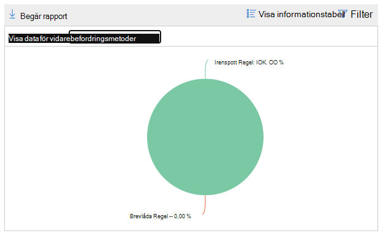

- **Visa data för: vidarebefordrande domäner** : den här vyn visar de mottagare som är destinationer för vidarebefordran.

  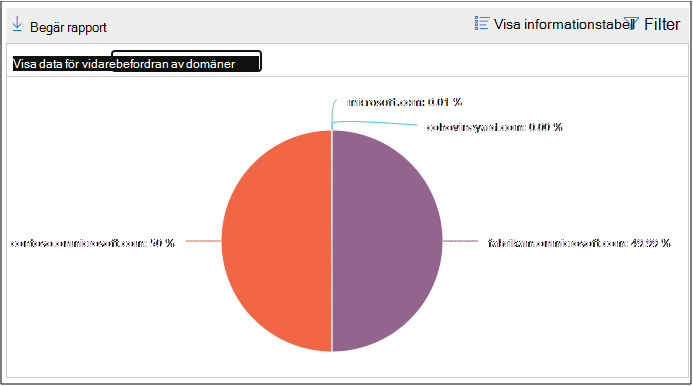

- **Visa data för: vidarebefordrare** : följande vidarebefordrare visas:

  - **Transport regel**
  - Post lådan som innehåller inkorgen för vidarebefordran.

  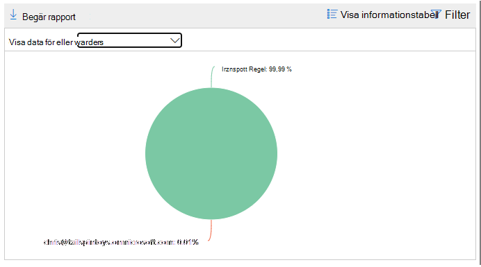

Om du klickar på **filter** i en rapportvy kan du ange ett datum intervall med **start datum** och **slutdatum**.

### Vyn detaljerad tabell för vidarebefordran

Om du klickar på **Visa informations tabell** i en rapportvy visas följande information:

- **Vidarebefordrare** : värde **transport regeln** eller post lådan som innehåller regeln för vidarebefordran av Inkorgen.
- **Typ av vidarekoppling** : regeln eller **transport regeln** för värde **post lådan** .
- **Mottagarens namn**
- **Mottagar domän**
- **Information** : det här är värdet på ett GUID-värde för regeln för e-postflöde, eller RuleIdentity-värdet i regeln för Inkorgen.
- **Öka**
- **Första framåtriktade datum**

Om du klickar på **filter** i en detaljerad tabellvy kan du ange ett datum intervall med **start datum** och **slutdatum**.

Om du vill gå tillbaka till rapportvyn klickar du på **Visa rapport**.

## Flödes status rapport

**Status rapporten** för [skicka och ta emot liknar e-](#sent-and-received-email-report)postmeddelandet, med ytterligare information om e-post som tillåts eller blockeras. Det här är den enda rapporten som innehåller information om skydd och visar hur många e-postmeddelanden som blockeras innan de tillåts i tjänsten för utvärdering genom Exchange Online Protection (EOP). Det är viktigt att förstå att om ett meddelande skickas till fem mottagare räknas det som fem olika meddelanden och inte ett meddelande.
Om du vill visa rapporten öppnar du [säkerhets & Compliance Center](https://protection.office.com), går till **rapport** \> **instrument panelen** och väljer **flödes status rapport**. Om du vill gå direkt till **rapporten status för e-postflöde** öppnar du <https://protection.office.com/mailflowStatusReport> .

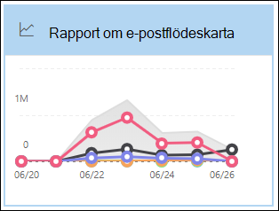

### Skriv vy för status rapporten flödes schema

När du öppnar rapporten är fliken **typ** markerad som standard. Den här vyn innehåller som standard ett diagram och en data tabell som är konfigurerad med följande filter:

- **Datum** : de senaste sju dagarna.
- **Riktning** :

  - **Inkommande**
  - **Gående**
  - **Inom organisationen** : det här antalet är för meddelanden inom en klient organisation, d.v.s. avsändarens abc@domain.com skickar till mottagaren xyz@domain.com (räknas separat från **inkommande** och **utgående** )

- **Skriv** :

  - **Bra e-post**
  - **Program**
  - **Skräppost**
  - **Edge Protection**
  - **Regel meddelanden**
  - **Nätfiske-e-post**

Diagrammet är ordnat efter **textvärdena** .

Du kan ändra dessa filter genom att klicka på **filter** eller genom att klicka på ett värde i diagram förklaringen.

Data tabellen innehåller följande information:

- **Riktning**
- **Typ**
- **24 timmar**
- **3 dagar**
- **sju dagar**
- **15 dagar**
- **30 dagar**

Om du klickar på **Välj en kategori för mer information** kan du välja bland följande värden:

- **Nät fiske meddelande** : den här markeringen tar dig till [status rapporten för hotets skydd](view-email-security-reports.md#threat-protection-status-report).
- **Skadlig program vara i e-post** : den här markeringen tar dig till [status rapporten för hotets skydd](view-email-security-reports.md#threat-protection-status-report).
- **Skräp identifiering** : den här markeringen tar dig till [rapporten skräp identifiering](view-email-security-reports.md#spam-detections-report).
- **Edge blockera skräp post** : den här markeringen tar dig till [rapporten skräp identifiering](view-email-security-reports.md#spam-detections-report).

**Exportera** :

För detaljvyn kan du bara exportera data för en dag. Om du till exempel vill exportera data i 7 dagar måste du göra 7 olika export åtgärder.

Alla exporterade CSV-filer är begränsade till 150 000 rader. Om data för den dagen innehåller fler än 150 000 rader skapas flera CSV-filer.

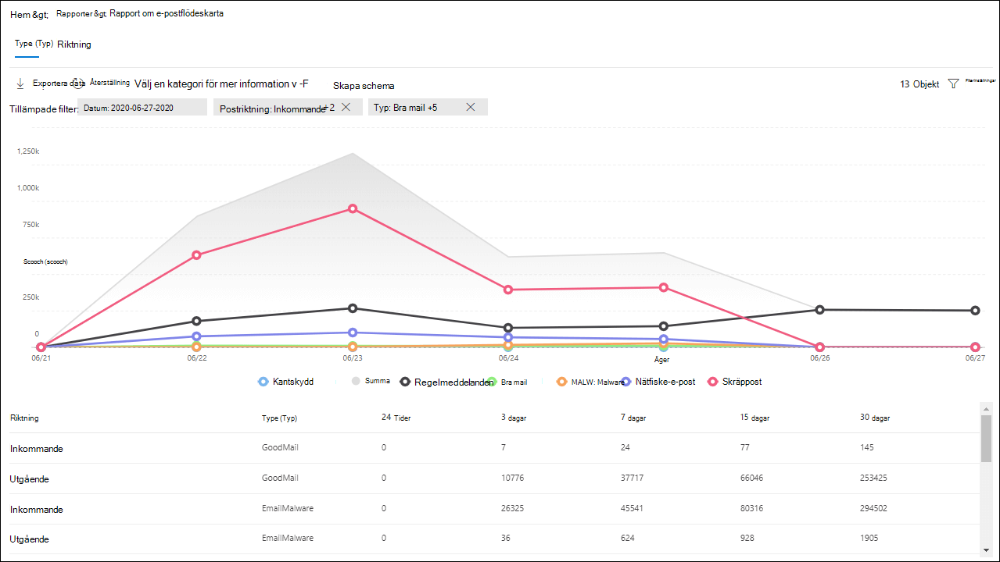

### Visnings läge för vyn flödes schema

Om du klickar på fliken **riktning** används samma standard filter från **typ** vyn.

Diagrammet är ordnat efter **riktnings** värden.

Du kan ändra dessa filter genom att klicka på **filter** eller genom att klicka på ett värde i diagram förklaringen. Samma filter i vyn **typ** används.

Data tabellen innehåller samma information från **typen** vy.

**Välj en kategori om** du vill se fler val och beteendet är samma som i **textfältet.**

**Exportera** :

För detaljvyn kan du bara exportera data för en dag. Om du till exempel vill exportera data i 7 dagar måste du göra 7 olika export åtgärder.

Alla exporterade CSV-filer är begränsade till 150 000 rader. Om data för den dagen innehåller fler än 150 000 rader skapas flera CSV-filer.

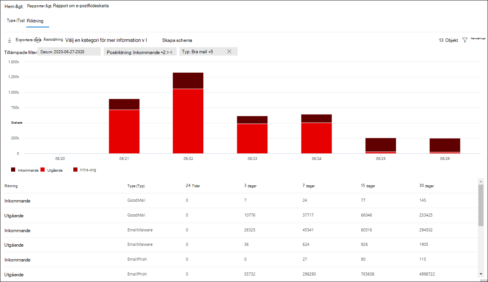

### Vyn tratt för status rapporten flöde

I vyn **tratt** visas hur Microsofts funktioner för skydd mot e-posthotet filtrerar inkommande och utgående e-post i organisationen. Den innehåller detaljerad information om det totala antalet e-postmeddelanden och hur de konfigurerade hot skydds funktionerna, inklusive Edge Protection, skadlig program vara, anti-nätfiske, anti-spam och skydd mot förfalskning påverkar det här antalet.

Om du klickar på fliken **tratt** visas den här vyn som standard ett diagram och en data tabell som är konfigurerad med följande filter:

- **Datum** : de senaste sju dagarna.

- **Riktning** :

  - **Inkommande**
  - **Gående**
  - **Inom organisationen** : det här antalet är för meddelanden som skickas inom en klient organisation. avsändare skickar abc@domain.com till mottagaren xyz@domain.com (räknas åtskilt från inkommande och utgående).

I vyn mängd och data tabell kan du se 90 dagar.

Om du klickar på **filter** kan du filtrera både diagrammet och data tabellen.

Det här diagrammet visar antalet e-postmeddelanden ordnade efter:

- **Totalt e-postmeddelande**
- **E-post efter Edge-skydd**
- **E-post efter skadlig program vara, fil rykte, fil typs block**
- **E-post efter anti-Phish, URL-rykte, varumärkes-och programförfalskning**
- **E-post efter anti-spam, Mass utskick**
- **E-post efter användare och domän-personifiering**1
- **E-post efter fil-och URL-sprängning**1
- **E-post identifieras som oskadlig efter efter leverans skydd (URL-adress klicka på tids skydd)**

1 Defender för Office 365

Om du vill visa e-postmeddelandet filtrerat efter EOP eller Defender för Office 365 klickar du på värdet i diagram förklaringen.

Data tabellen innehåller följande information, som visas i fallande ordning:

- **Datum**
- **Totalt e-postmeddelande**
- **Edge Protection** 
- **Skadlig program vara, fil rykte, fil typs block** :
  - **Fil rykte** : meddelanden som filtrerats på grund av identifiering av en bifogad fil av andra Microsoft-kunder.
  - **Fil typs block** : meddelanden som filtrerats på grund av den typ av skadlig fil som identifieras i meddelandet.      
- **Anti-Phish, URL-rykte, varumärkes-och programförfalskning** :
  - **URL-rykte** : meddelanden som filtrerats på grund av URL-adressen till andra Microsoft-kunder.
  - **Varumärkes-personifiering** : meddelanden som filtrerats på grund av att meddelandet kommer från välbekant varumärkes som imiterar avsändare.
  - **Stöldskydd** : meddelanden som filtrerats på grund av meddelandet försöker att skicka falska en domän som mottagaren tillhör, eller en domän som meddelande avsändaren inte äger.  
- **Skräp post filtrering** :
  - **Mass utskick av e-post** : meddelanden som filtrerats på grund av ett försök att skicka mass utskick till mottagarna. 
- **Användarens och domänens personifiering (Defender för Office 365)** :
  - **Användarens personifiering** : meddelanden som filtrerats på grund av ett försök att personifiera en användare (meddelande avsändare) som har definierats i inställningarna för personifieringsnivå för en skydds policy.
  - **Domän** användning: meddelanden som filtrerats på grund av ett försök att personifiera en domän som är definierad i inställningarna för personifieringsnivå för en skydds policy. 
- **Fil-och URL-sprängare (Defender för Office 365)** :
  - **Fil sprängare** : meddelanden som filtrerats med en princip för bifogade filer.
  - **URL-sprängning** : meddelande filtrerat med en princip för säkra länkar.  
- **Efter leverans skydd och ZAP (ATP) eller ZAP (EOP)** : ZAP indikerar nollställning för automatisk rensning.

Om du markerar en rad i data tabellen visas en uppdelning av antalet e-postmeddelanden.

**Exportera** :

När du klickar på **Exportera** under **alternativ** kan du välja ett av följande värden:

- **Sammanfattning (med data för de senaste 90 dagarna)**
- **Uppgifter (med data för de senaste 30 dagarna)**

Under **datum** väljer du ett område och klickar sedan på **Använd**. Data för de aktuella filtren exporteras till en. csv-fil.

Alla exporterade CSV-filer är begränsade till 150 000 rader. Om data innehåller fler än 150 000 rader skapas flera CSV-filer.

 

### Teknisk vy för rapporten flödes schema

**Tech-vyn** liknar vyn **tratt** och ger mer detaljerad information om de konfigurerade hot skydds funktionerna. Från diagrammet kan du se hur meddelanden kategoriseras i olika stadier av hotets skydd.

Om du klickar på fliken **teknisk vy** innehåller den här vyn som standard ett diagram och en data tabell som är konfigurerad med följande filter:

- **Datum** : de senaste sju dagarna.

- **Riktning** :

  - **Inkommande**
  - **Gående**
  - **Inom organisationen** : det här antalet är för meddelanden inom en klient organisation, d.v.s. avsändarens abc@domain.com skickar till mottagaren xyz@domain.com (räknas separat från inkommande och utgående)

I vyn mängd och data tabell kan du se 90 dagar.

Om du klickar på **filter** kan du filtrera både diagrammet och data tabellen.

I det här diagrammet visas meddelanden ordnade i följande kategorier:

- **Totalt e-postmeddelande**
- **Edge Allow, Edge filtrerat**
- **Ej skadlig kod, identifiering av bifogade filer (Defender för Office 365), identifiering av skadlig program vara, regel block**
- **Inte Phish, DMARC-fel, identifiering av obehörig person, förfalsknings avkänning, Phish-identifiering**
- **Ingen identifiering med URL-sprängning, identifiering av URL-sprängor (Defender för Office 365)**
- **Inte skräp post, spam**
- **Icke-skadlig e-post, identifiering av säkra länkar (Defender för Office 365), ZAP**

När du hovrar över en kategori i diagrammet kan du se antalet meddelanden i den kategorin.

Data tabellen innehåller följande information, som visas i fallande ordning:

- **Datum**
- **Totalt e-postmeddelande**
- **Filtrerad**
- **Skydd mot skadlig program vara, säkra bilagor, regel filtrerat** :
  - **Regel filtrerad** : meddelanden som filtrerats på grund av regler för e-postflöde (kallas även transport regler).
- **DMARC, Phish, filtrerat** :
  - **DMARC** : meddelanden som filtrerats på grund av meddelandet Det gick inte att kontrol lera DMARC. 
- **Identifiering av URL-sprängning**
- **Skräp post filter**
- **ZAP borttagen**
- **Identifiering via säkra länkar**

Om du markerar en rad i data tabellen visas en uppdelning av antalet e-postmeddelanden.

**Exportera** :

Om du klickar på **Exportera** kan du välja ett av följande värden under **alternativ** :

- **Sammanfattning (med data för de senaste 90 dagarna)**
- **Uppgifter (med data för de senaste 30 dagarna)**

Under **datum** väljer du ett område och klickar sedan på **Använd**. Data för de aktuella filtren exporteras till en. csv-fil.

Alla exporterade CSV-filer är begränsade till 150 000 rader. Om data innehåller fler än 150 000 rader skapas flera CSV-filer.

 

## Skicka och ta emot e-postrapport

Rapporten **skickat och mottaget e-postmeddelande** är en Smart rapport som visar information om inkommande och utgående e-post, inklusive skräp identifiering, skadlig program vara och e-postmeddelanden som identifieras som "bra". Skillnaden mellan den här rapporten och [flödet flödes status](#mailflow-status-report) är: den här rapporten innehåller inte data om meddelanden som blockeras av Edge Protection. Det är viktigt att förstå att om ett meddelande skickas till fem mottagare räknas det som ett meddelande.

I den aggregerade vyn och detaljvyn för rapporten får du 90 dagar på filtreringen.

Om du vill visa rapporten öppnar du [säkerhets & efterlevnad](https://protection.office.com), går till **Reports** \> **instrument paneler** för rapporter och väljer **skickade och mottagna e-postmeddelanden**. Om du vill gå direkt till rapporten öppnar du <https://protection.office.com/reportv2?id=SentAndReceivedMailATP> .

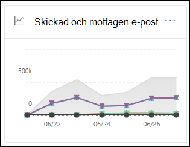

### Rapportvy för rapporten för skickad och mottagen e-post

Följande diagram är tillgängliga i rapportvyn:

- **Bryt ned per: typ** : diagrammet visar alla tillgängliga kategorier:

  - **Totalt**
  - **Bra e-post**
  - **Skadlig program vara (antivirus program)** (EOP)
  - **Skräp identifiering**
  - **Regel meddelanden**
  - **Avancerad skadlig program vara** (Microsoft Defender för Office 365)

  När du hovrar över en dag (data punkt) i diagrammet kan du se information om den dagen.

  

- **Bryt ned efter: riktning** : diagrammet visar **totalt** , **inkommande** och **utgående** data. När du hovrar över en dag (data punkt) i diagrammet kan du se information om den dagen.

  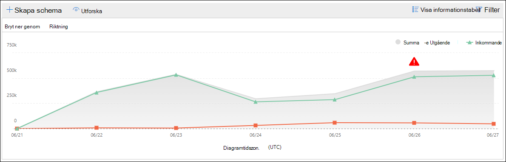

- **Öka detalj nivån med** \> **Skadlig program vara (skadlig program vara)** : den här markeringen tar dig till [identifieringar av skadlig program vara i e-postrapporten](view-email-security-reports.md#malware-detections-in-email-report).

- **Öka detalj nivån med** \> **Skräp identifiering)** : den här markeringen tar dig till [rapporten skräp identifiering](view-email-security-reports.md#spam-detections-report).

Om du klickar på **filter** i en rapportvy kan du ändra resultatet med följande filter:

- **Start datum** och **slutdatum**
- Riktnings värden
- Ange värden

Om du vill gå tillbaka till rapportvyn klickar du på **Visa rapport**.

### Vyn detaljerad tabell för den skickade och mottagna e-postrapporten

Om du klickar på **Visa informations tabell** i **Bryt ned efter: riktning** eller **Bryt ned efter: vyn riktning** visas följande information:

- **Datum (UTC)**
- **Typ**
- **Riktning**
- **Antal meddelanden**

Om du klickar på **filter** i en detaljerad tabellvy kan du ändra resultatet med följande filter:

- **Start datum** och **slutdatum**
- Riktnings värden
- Ange värden

Om du vill gå tillbaka till rapportvyn klickar du på **Visa rapport**.

## Rapporter för högsta avsändare och mottagare

Den **översta rapporten avsändare och mottagare** är ett cirkel diagram som visar dina e-postmeddelanden och mottagare.

Om du vill visa rapporten öppnar du [säkerhets & Compliance Center](https://protection.office.com), går till **rapport** \> **instrument panelen** och väljer **de översta avsändaren och mottagarna**. Om du vill gå direkt till rapporten öppnar du <https://protection.office.com/reportv2?id=TopSenderRecipientsATP> .

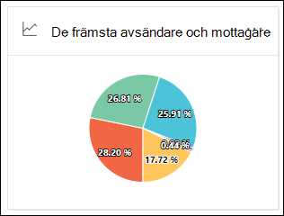

### Rapportvy för rapporten högsta avsändare och mottagare

Följande diagram är tillgängliga i rapportvyn:

- **Visa data för \> de flesta e-postutskick**
- **Visa data för \> högsta antal e-postmottagare**
- **Visa data för \> mottagare av reklam**
- **Visa data för \> Högsta antal mottagare av skadlig program vara** (EOP)
- **Visa data för \> högsta antal mottagare av skadlig program vara (Defender för Office 365)** 

Sammansättningen för cirkel diagrammet ändras utifrån de här valen.

När du hovrar över en sektor i cirkel diagrammet kan du se antalet meddelanden som skickats eller tagits emot.

Om du klickar på **filter** i en rapportvy kan du ange ett datum intervall med **start datum** och **slutdatum**.

### Vyn detaljerad lista för rapporten överst avsändare och mottagare

Om du klickar på **Visa informations tabell** beror informationen som visas på diagrammet du tittade på:

- **Visa data för \> de flesta e-postutskick**

  - **Vanligaste e-postutskick**
  - **Öka**

- **Visa data för \> högsta antal e-postmottagare**

  - **Vanligaste e-postmottagare**
  - **Öka**

- **Visa data för \> mottagare av reklam**

  - **Populära skräp mottagare**
  - **Öka**

- **Visa data för \> Högsta antal mottagare av skadlig program vara** (EOP)

  - **Högsta antal mottagare av skadlig program vara**
  - **Öka**

- **Visa data för \> högsta antal mottagare av skadlig program vara (Defender för Office 365)** 

  - **Högsta antal mottagare av skadlig program vara (Defender för Office 365)**
  - **Öka**

Om du klickar på **filter** i en detaljerad tabellvy kan du ange ett datum intervall med **start datum** och **slutdatum**.

Om du vill gå tillbaka till rapportvyn klickar du på **Visa rapport**.

## Vilka behörigheter behövs för att visa rapporterna?

Om du vill visa och använda rapporterna måste du vara medlem i den angivna roll gruppen i säkerhets & efterföljandekrav **och** i Exchange Online.

- I säkerhets & Compliance Center måste du vara medlem i någon av följande roll grupper:

  -Organisations hantering-säkerhets administratör (du kan också göra det i [Azure Active Directory Admin Center](https://aad.portal.azure.com) -säkerhets läsare

  Mer information finns i [Behörigheter i Säkerhets- och efterlevnadscentret](https://docs.microsoft.com/microsoft-365/security/office-365-security/permissions-in-the-security-and-compliance-center).

- I Exchange Online måste du vara medlem i någon av följande roll grupper:

  -Organisations hantering-Visa endast organisations hantering-endast Visa-mottagare-kompatibilitetskontrollen

Mer information finns i [behörigheter i Exchange Online](https://docs.microsoft.com/Exchange/permissions-exo/permissions-exo) och [Hantera roll grupper i Exchange Online](https://docs.microsoft.com/Exchange/permissions-exo/role-groups).

## Relaterade ämnen

[Smarta rapporter och insikter i säkerhets & efterlevnad](reports-and-insights-in-security-and-compliance.md)

[Insikter om e-postflöde i säkerhets & Compliance Center](mail-flow-insights-v2.md)

[Visa säkerhets rapporter för e-post i säkerhets & efterlevnad](view-email-security-reports.md)

[Visa rapporter för Microsoft Defender för Office 365](view-reports-for-atp.md)
