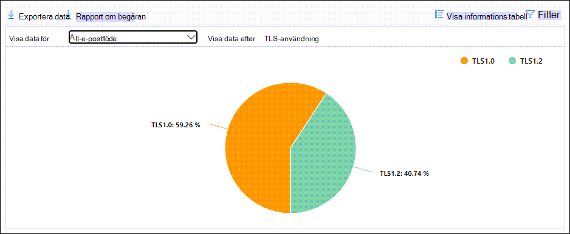

# Visa e-postflödesrapporter i instrumentpanelen Rapporter i Säkerhets- & EfterlevnadscenterView mail flow reports in the Reports dashboard in Security & Compliance Center

[!INCLUDE [Microsoft 365 Defender rebranding](../includes/microsoft-defender-for-office.md)]

**Gäller för****Applies to**
- [Exchange Online ProtectionExchange Online Protection](exchange-online-protection-overview.md)
- [Microsoft Defender för Office 365 Abonnemang 1 och Abonnemang 2Microsoft Defender for Office 365 plan 1 and plan 2](office-365-atp.md)
- [Microsoft 365 DefenderMicrosoft 365 Defender](../mtp/microsoft-threat-protection.md)

Förutom e-postflödesrapporterna som är  tillgängliga på instrumentpanelen för e-postflöde i säkerhets- och efterlevnadscentret för & finns det flera olika e-postflödesrapporter på instrumentpanelen Rapporter som hjälper dig att övervaka Din Microsoft 365-organisation.In addition to the mail flow reports that are available in the [Mail flow dashboard](mail-flow-insights-v2.md) in the Security & Compliance Center, a variety of additional mail flow reports are available in the Reports dashboard to help you monitor your Microsoft 365 organization.

Om du har nödvändiga [behörigheter kan](#what-permissions-are-needed-to-view-these-reports)du visa de här rapporterna i Säkerhets- och [& genom](https://protection.office.com) att gå till  \> **instrumentpanelen Rapporter.**If you have the [necessary permissions](#what-permissions-are-needed-to-view-these-reports), you can view these reports in the [Security & Compliance Center](https://protection.office.com) by going to **Reports** \> **Dashboard**. Om du vill gå direkt till instrumentpanelen Rapporter öppnar du <https://protection.office.com/insightdashboard> .To go directly to the Reports dashboard, open <https://protection.office.com/insightdashboard>.

## KopplingsrapportConnector report

Kopplingsrapporten **visar** e-postflödesaktivitet [för inkommande och](https://docs.microsoft.com/Exchange/mail-flow-best-practices/use-connectors-to-configure-mail-flow/use-connectors-to-configure-mail-flow) utgående anslutningar som är konfigurerade för din organisation.The **Connector report** shows mail flow activity on the [inbound and outbound connectors](https://docs.microsoft.com/Exchange/mail-flow-best-practices/use-connectors-to-configure-mail-flow/use-connectors-to-configure-mail-flow) that are configured for your organization.

Om du vill visa rapporten öppnar du [Säkerhets- & Efterlevnadscenter,](https://protection.office.com)går **till** instrumentpanelen \> **Rapporter** och väljer **Kopplingsrapport.**To view the report, open the [Security & Compliance Center](https://protection.office.com), go to **Reports** \> **Dashboard** and select **Connector report**. Om du vill gå direkt till rapporten öppnar du <https://protection.office.com/reportv2?id=ConnectorReport> .To go directly to the report, open <https://protection.office.com/reportv2?id=ConnectorReport>.

### Rapportvy för kopplingsrapportenReport view for the Connector report

Följande diagram är tillgängliga i rapportvyn:The following charts are available in report view:

- **Visa data efter: E-postflöde:** I det här diagrammet visas antalet inkommande och utgående meddelanden ordnade efter:**View data by: Mail flow**: This chart shows the number of inbound and outbound messages organized by:

  - **Totalt****Total**
  - **Från Internet utan anslutning****From the internet without a connector**
  - **Till Internet utan anslutning****To the internet without a connector**
  - En specifik koppling som du har konfigurerat.A specific connector that you've configured.

  Om du vill isolera data i diagrammet använder du Visa data för kontroll **och** väljer ett av de här alternativen eller **Allt e-postflöde.**To isolate the data in the chart, use the **Show data for** control to select one of these options or **All mail flow**.

  

- **Visa data efter: TLS-användning:** Det här diagrammet visar procentandelen TLS-versionsanvändning (Transport Layer Security) för e-postflöde.**View data by: TLS usage**: This chart shows the percentage of Transport Layer Security (TLS) version usage for mail flow.

  Om du vill isolera data i diagrammet använder du **Visa data för kontroll** och väljer ett av följande alternativ:To isolate the data in the chart, use the **Show data for** control to select one of the following options:

  - **Allt e-postflöde****All mail flow**
  - **Från Internet utan anslutning****From the internet without a connector**
  - **Till Internet utan anslutning****To the internet without a connector**
  - En specifik koppling som du har konfigurerat.A specific connector that you've configured.

  

Om du klickar **på** Filter i en rapportvy kan du ange ett datumintervall **med startdatum** **och slutdatum.**If you click **Filters** in a report view, you can specify a date range with **Start date** and **End date**.

### Detaljtabellvy för kopplingsrapportenDetails table view for the Connector report

Om du **klickar på Tabellen Visa** information i en rapportvy visas följande information:If you click **View details table** in a report view, the following information is shown:

- **Datum****Date**
- **Kopplingsriktning och namn****Connector direction and name**
- **Kopplingstyp****Connector type**
- **Tvingad TLS?**: Värdet **Sant** eller **Falskt.****Forced TLS?**: The value **True** or **False**.
- **Ingen TLS** (procent)**No TLS** (percentage)
- **TLS 1,0** (procent)**TLS 1.0** (percentage)
- **TLS 1,1** (procent)**TLS 1.1** (percentage)
- **TLS 1,2** (procent)**TLS 1.2** (percentage)
- **Volym:** Antalet meddelanden.**Volume**: The number of messages.

Om du klickar **på** Filter i en detaljtabellvy kan du ange ett datumintervall **med Startdatum** **och Slutdatum.**If you click **Filters** in a details table view, you can specify a date range with **Start date** and **End date**.

Klicka på Visa rapport om du vill gå tillbaka **till rapportvyn.**To go back to the report view, click **View report**.

## Regelrapport för Exchange-transportExchange transport rule report

I **regelrapporten för Exchange-transport** visas effekten av e-postflödesregler (kallas även transportregler) på inkommande och utgående meddelanden i organisationen.The **Exchange transport rule report** shows the effect of mail flow rules (also known as transport rules) on incoming and outgoing messages in your organization.

Om du vill visa rapporten öppnar du [Säkerhets- & Efterlevnadscenter,](https://protection.office.com)går **till** instrumentpanelen \> **Rapporter** och väljer **Exchange-transportregel.**To view the report, open the [Security & Compliance Center](https://protection.office.com), go to **Reports** \> **Dashboard** and select **Exchange Transport rule**. Om du vill gå direkt till rapporten öppnar du <https://protection.office.com/reportv2?id=ETRRuleReport> .To go directly to the report, open <https://protection.office.com/reportv2?id=ETRRuleReport>.

### Rapportvy för Exchange-transportregelrapportenReport view for the Exchange transport rule report

Följande diagram är tillgängliga i rapportvyn:The following charts are available in report view:

- **Visa data efter: Exchange-transportregler** \> **Radbryt för: Riktning:** Det här diagrammet visar antalet **ingående** och **utgående** meddelanden som påverkades av transportreglerna.**View data by: Exchange transport rules** \> **Break down by: Direction**: This chart shows the number of **Inbound** and **Outbound** messages that were affected by transport rules.

- **Visa data efter: Exchange-transportregler** \> **Break down by: Severity**: This chart shows the number of **High severity** and **Medium severity**, and **Low severity** messages.**View data by: Exchange transport rules** \> **Break down by: Severity**: This chart shows the number of **High severity** and **Medium severity**, and **Low severity** messages. Du anger allvarlighetsnivån som en åtgärd i regeln (Granska den här regeln med **allvarlighetsnivå** eller _AngeAuditSeverity_).You set the severity level as an action in the rule (**Audit this rule with severity level** or _SetAuditSeverity_). Mer information finns i Åtgärder för [e-postflödesregel i Exchange Online.](https://docs.microsoft.com//Exchange/security-and-compliance/mail-flow-rules/mail-flow-rule-actions)For more information, see [Mail flow rule actions in Exchange Online](https://docs.microsoft.com//Exchange/security-and-compliance/mail-flow-rules/mail-flow-rule-actions).

- **Visa data efter: DLP Exchange-transportregler** \> **Åtser sig: Riktning:** I det här  diagrammet visas antalet **ingående** och utgående meddelanden som påverkades av DLP-transportregler (Data Loss Prevention).**View data by: DLP Exchange transport rules** \> **Break down by: Direction**: This chart shows the number of **Inbound** and **Outbound** messages that were affected by data loss prevention (DLP) transport rules. Du kan förfina diagrammet ytterligare genom att välja bland följande alternativ:You can further refine the chart by selecting on of the following options:

  - **Visa data för: Alla DLP-transportregler****Show data for: All DLP transport rules**
  - **Visa data för: Komprometterade användare****Show data for: Compromised users**
  - **Visa data för: Låg mängd innehåll upptäckt av U.S. Act****Show data for: Low volume of content detected U.S. Patriot Act**

- **Visa data efter: DLP Exchange-transportregler** \> **Break down by: Direction:** This view shows the number of **High severity** and **Medium severity**, and **Low severity** messages that were affected by DLP transport rules.**View data by: DLP Exchange transport rules** \> **Break down by: Direction**: This view shows the number of **High severity** and **Medium severity**, and **Low severity** messages that were affected by DLP transport rules. Du kan förfina diagrammet ytterligare genom att välja bland följande alternativ:You can further refine the chart by selecting on of the following options:

  - **Visa data för: Alla DLP-transportregler****Show data for: All DLP transport rules**
  - **Visa data för: Komprometterade användare****Show data for: Compromised users**
  - **Visa data för: Låg mängd innehåll upptäckt av U.S. Act****Show data for: Low volume of content detected U.S. Patriot Act**

Om du klickar **på** Filter i en rapportvy kan du ändra resultatet med följande filter:If you click **Filters** in a report view, you can modify the results with the following filters::

- **Startdatum** och **slutdatum****Start date** and **End date**
- RiktningsvärdenDirection values
- AllvarlighetsvärdenSeverity values

### Detaljtabellvy för rapporten Exchange-transportregelDetails table view for the Exchange transport rule report

Om du **klickar på Tabellen** Visa information beror den information som visas på det diagram som du visade:If you click **View details table**, the information that's shown depends on the chart you were looking at:

- **Visa data efter: Exchange-transportregler:****View data by: Exchange Transport rules**:

  - **Datum****Date**
  - **Transportregel****Transport rule**
  - **Ämne****Subject**
  - **Avsändarens adress****Sender address**
  - **Mottagaradress****Recipient address**
  - **Allvarlighetsgrad****Severity**
  - **Riktning****Direction**

- **Visa data efter: DLP Exchange-transportregler:****View data by: DLP Exchange transport rules**:

  - **Datum****Date**
  - **DLP-princip****DLP policy**
  - **Transportregel****Transport rule**
  - **Ämne****Subject**
  - **Avsändarens adress****Sender address**
  - **Mottagaradress****Recipient address**
  - **Allvarlighetsgrad****Severity**
  - **Riktning****Direction**

Om du klickar **på** Filter i en detaljtabellvy kan du ändra resultatet med följande filter:If you click **Filters** in a details table view, you can modify the results with the following filters:

- **Startdatum** och **slutdatum****Start date** and **End date**
- RiktningsvärdenDirection values
- AllvarlighetsvärdenSeverity values

Klicka på Visa rapport om du vill gå tillbaka **till rapportvyn.**To go back to the report view, click **View report**.

## VidarebefordransrapportForwarding report

I **vidarebefordransrapporten** visas organisationens automatiskt vidarebefordrade meddelanden till externa domäner från Exchange Online-postlådor.The **Forwarding report** shows your organization's automatically forwarded messages to external domains from Exchange Online mailboxes. Vidarebefordrade meddelanden kan utgöra en säkerhets- eller efterlevnadsrisk och kan ange ett komprometterat konto.Forwarded messages can pose a security or compliance risk, and might indicate a compromised account.

Om du vill visa rapporten öppnar du [Säkerhets- & Efterlevnadscenter,](https://protection.office.com)går till **instrumentpanelen** \> **Rapporter** och väljer **Vidarebefordransrapport.**To view the report, open the [Security & Compliance Center](https://protection.office.com), go to **Reports** \> **Dashboard** and select **Forwarding report**. Om du vill gå direkt till rapporten öppnar du <https://protection.office.com/reportv2?id=MailFlowForwarding> .To go directly to the report, open <https://protection.office.com/reportv2?id=MailFlowForwarding>.

### Rapportvy för vidarebefordransrapportenReport view for the Forwarding report

Följande diagram är tillgängliga i rapportvyn:The following charts are available in the report view:

- **Visa data för: Vidarebefordransmetoder:** Följande metoder visas:**Show data for: Forwarding methods**: The following methods are shown:

  - **Transportregel:** Kallas även [e-postflödesregler.](https://docs.microsoft.com/Exchange/security-and-compliance/mail-flow-rules/mail-flow-rules)**Transport rule**: Also known as [mail flow rules](https://docs.microsoft.com/Exchange/security-and-compliance/mail-flow-rules/mail-flow-rules).
  - **Postlåderegel:** Kallas även [inkorgsregler.](https://support.microsoft.com/office/c24f5dea-9465-4df4-ad17-a50704d66c59)**Mailbox rule**: Also known as [Inbox rules](https://support.microsoft.com/office/c24f5dea-9465-4df4-ad17-a50704d66c59).

  

- **Visa data för: Domäner för vidarebefordran:** I den här vyn visas de mottagardomäner som är destinationer för vidarebefordran.**Show data for: Forwarding domains**: This view shows the recipient domains that are the destinations for forwarding.

  

- **Visa data för: Vidarebefordrare:** Följande vidarebefordrare visas:**Show data for: Forwarders**: The following forwarders are shown:

  - **Transportregel****Transport rule**
  - Postlådan som innehåller vidare vidarebefordrans inkorgsregeln.The mailbox that contains the forwarding Inbox rule.

  

Om du klickar **på** Filter i en rapportvy kan du ange ett datumintervall **med startdatum** **och slutdatum.**If you click **Filters** in a report view, you can specify a date range with **Start date** and **End date**.

### Tabellvyn Information för vidarebefordransrapportenDetails table view for the Forwarding report

Om du **klickar på Tabellen Visa** information i en rapportvy visas följande information:If you click **View details table** in a report view, the following information is shown:

- **Vidarebefordrare:** Värdet **Transport-regeln eller** postlådan som innehåller vidare vidarebefordrans inkorgsregeln.**Forwarders**: The value **Transport rule** or the mailbox that contains the forwarding Inbox rule.
- **Vidarebefordranstyp:** **Värdepostlåderegel** eller **transportregel.****Forwarding type**: The value **Mailbox rule** or **Transport rule**.
- **Mottagarens namn****Recipient name**
- **Mottagardomän****Recipient domain**
- **Information:** Det här är GUID-värdet för e-postflödesregeln eller RuleIdentity-värdet för inkorgsregeln.**Details**: This is the GUID value of the mail flow rule, or the RuleIdentity value of the Inbox rule.
- **Antal****Count**
- **Första vidarebefordransdatum****First forward date**

Om du klickar **på** Filter i en detaljtabellvy kan du ange ett datumintervall **med Startdatum** **och Slutdatum.**If you click **Filters** in a details table view, you can specify a date range with **Start date** and **End date**.

Om du vill gå tillbaka till rapportvyn klickar du **på Visa rapport.**To go back to the reports view, click **View report**.

## Statusrapport för e-postflödeMailflow status report

Statusrapporten **e-postflöde** liknar rapporten Skickad och mottagen e-post, med ytterligare information om tillåtna eller blockerade e-postmeddelanden i edge.The **Mailflow status report** is similar to the [Sent and received email report](#sent-and-received-email-report), with additional information about email allowed or blocked on the edge. Det här är den enda rapporten som innehåller information om gränsskydd och visar hur mycket e-post som blockeras innan de tillåts i tjänsten för utvärdering av Exchange Online Protection (EOP).This is the only report that contains edge protection information, and shows just how much email is blocked before being allowed into the service for evaluation by Exchange Online Protection (EOP). Det är viktigt att förstå att om ett meddelande skickas till fem mottagare räknas det som fem olika meddelanden och inte ett meddelande.It's important to understand that if a message is sent to five recipients we count it as five different messages and not one message.
Om du vill visa rapporten öppnar du [Säkerhets- &](https://protection.office.com)Efterlevnadscenter, går till **instrumentpanelen** \> **Rapporter** och väljer **Statusrapport för e-postflöde.**To view the report, open the [Security & Compliance Center](https://protection.office.com), go to **Reports** \> **Dashboard** and select **Mailflow status report**. Gå direkt till statusrapporten **för e-postflödet** genom att <https://protection.office.com/mailflowStatusReport> öppna.To go directly to the **Mail flow status report**, open <https://protection.office.com/mailflowStatusReport>.

### Typvy för statusrapporten För e-postflödeType view for the Mailflow status report

När du öppnar rapporten är **fliken** Typ markerad som standard.When you open the report, the **Type** tab is selected by default. Som standard innehåller den här vyn ett diagram och en datatabell som är konfigurerad med följande filter:By default, this view contains a chart and a data table that's configured with the following filters:

- **Datum:** De senaste sju dagarna.**Date**: The last 7 days.
- **Riktning:****Direction**:

  - **Inkommande****Inbound**
  - **Utgående****Outbound**
  - **Årsantal:** antalet är för meddelanden inom en klientorganisation, dvs.**Intra-org**: this count is for messages within a tenant i.e avsändaren abc@domain.com till mottagarens xyz@domain.com (räknas separat från **Inkommande** och **Utgående)**sender abc@domain.com sends to recipient xyz@domain.com  (counted separately from **Inbound** and **Outbound**)

- **Typ:****Type**:

  - **Bra e-post****Good mail**
  - **Skadlig programvara****Malware**
  - **Skräppost****Spam**
  - **Edge-skydd****Edge protection**
  - **Regelmeddelanden****Rule messages**
  - **Nätfiske-e-post****Phishing email**

Diagrammet är ordnat efter **typvärdena.**The chart is organized by the **Type** values.

Du kan ändra dessa filter genom att klicka **på Filter** eller genom att klicka på ett värde i diagramförklaringen.You can change these filters by clicking **Filter** or by clicking a value in the chart legend.

Datatabellen innehåller följande information:The data table contains the following information:

- **Riktning****Direction**
- **Typ****Type**
- **24 timmar****24 hours**
- **3 dagar****3 days**
- **7 dagar****7 days**
- **15 dagar****15 days**
- **30 dagar****30 days**

Om du klickar **på Välj en kategori för mer** information kan du välja bland följande värden:If you click **Choose a category for more details**, you can select from the following values:

- **Nätfiskemeddelande:** Det här valet tar dig till [statusrapporten om skydd mot hot.](view-email-security-reports.md#threat-protection-status-report)**Phishing email**: This selection takes you to the [Threat protection status report](view-email-security-reports.md#threat-protection-status-report).
- **Skadlig programvara i** e-postmeddelanden: Det här valet tar dig [till statusrapporten om skydd mot hot.](view-email-security-reports.md#threat-protection-status-report)**Malware in email**: This selection takes you to the [Threat protection status report](view-email-security-reports.md#threat-protection-status-report).
- **Identifiering av skräppost:** Det här valet tar dig till [rapporten Identifiering av skräppost.](view-email-security-reports.md#spam-detections-report)**Spam detections**: This selection takes you to the [Spam Detections report](view-email-security-reports.md#spam-detections-report).
- **Blockerad skräppost i Edge:** Det här valet tar dig till rapporten [Identifiering av skräppost.](view-email-security-reports.md#spam-detections-report)**Edge blocked spam**: This selection takes you to the [Spam Detections report](view-email-security-reports.md#spam-detections-report).

**Exportera:****Export**:

I detaljvyn kan du bara exportera data för en dag.For the detail view, you can only export data for one day. Om du vill exportera data i 7 dagar måste du utföra 7 olika exportåtgärder.So, if you want to export data for 7 days, you need to do 7 different export actions.

Varje exporterad CSV-fil är begränsad till 150 000 rader.Each exported .csv file is limited to 150,000 rows. Om dagens data innehåller fler än 150 000 rader skapas flera CSV-filer.If the data for that day contains more than 150,000 rows, then multiple .csv files will be created.

### Vyn Riktning för statusrapporten E-postflödeDirection view for the Mailflow status report

Om du klickar **på** fliken Riktning används samma standardfilter **från** vyn Typ.If you click the **Direction** tab, the same default filters from the **Type** view are used.

Diagrammet är ordnat efter **riktningsvärden.**The chart is organized by **Direction** values.

Du kan ändra dessa filter genom att klicka **på Filter** eller genom att klicka på ett värde i diagramförklaringen.You can change these filters by clicking **Filter** or by clicking a value in the chart legend. Samma filter används **i** vyn Typ.The same filters from the **Type** view are used.

Datatabellen innehåller samma information från **vyn** Typ.The data table contains same information from the **Type** view.

Välj **en kategori om du vill ha mer** information om tillgängliga val och beteenden är samma som **vyn** Typ.The **Choose a category for more details** available selections and behavior are the same as the **Type** view.

**Exportera:****Export**:

I detaljvyn kan du bara exportera data för en dag.For the detail view, you can only export data for one day. Om du vill exportera data i 7 dagar måste du utföra 7 olika exportåtgärder.So, if you want to export data for 7 days, you need to do 7 different export actions.

Varje exporterad CSV-fil är begränsad till 150 000 rader.Each exported .csv file is limited to 150,000 rows. Om dagens data innehåller fler än 150 000 rader skapas flera CSV-filer.If the data for that day contains more than 150,000 rows, then multiple .csv files will be created.

### Trattvy för statusrapporten för e-postflödeFunnel view for the Mailflow status report

I **vyn Tratt** kan du se hur Microsofts skyddsfunktioner för e-posthot filtrerar inkommande och utgående e-post i din organisation.The **Funnel** view shows you how Microsoft's email threat protection features filter incoming and outgoing email in your organization. Här finns information om totalt antal e-postmeddelanden och hur de konfigurerade skyddsfunktionerna för hot, inklusive gränsskydd, skadlig programvara, skydd mot nätfiske, skräppostskydd och förfalskning påverkar antalet.It provides details on the total email count, and how the configured threat protection features, including edge protection, anti-malware, anti-phishing, anti-spam, and anti-spoofing affect this count.

Om du klickar **på fliken** Tratt innehåller den här vyn som standard ett diagram och en datatabell som är konfigurerad med följande filter:If you click the **Funnel** tab, by default, this view contains a chart and a data table that's configured with the following filters:

- **Datum:** De senaste sju dagarna.**Date**: The last 7 days.

- **Riktning:****Direction**:

  - **Inkommande****Inbound**
  - **Utgående****Outbound**
  - **Årsantal:** Antalet är för meddelanden som skickas inom en klientorganisation. Det vill säga att avsändaren abc@domain.com till mottagarens xyz@domain.com (räknas separat från inkommande och utgående).**Intra-org**: This count is for messages sent within a tenant; i.e, sender abc@domain.com sends to recipient xyz@domain.com (counted separately from Inbound and Outbound).

Mängdvyn och datatabellvyn tillåter 90 dagars filtrering.The aggregate view and data table view allow for 90 days of filtering.

Om du klickar **på Filter** kan du filtrera både diagrammet och datatabellen.If you click **Filter**, you can filter both the chart and the data table.

I det här diagrammet visas antalet e-postmeddelanden ordnade efter:This chart shows the email count organized by:

- **Totalt antal e-postmeddelanden****Total email**
- **E-post efter gränsskydd****Email after edge protection**
- **E-post efter skadlig programvara, rykte, filtypsblock****Email after anti-malware, file reputation, file type block**
- **E-post efter anfing, URL-rykte, varumärkespersonifiering, förfalskning****Email after anti-phish, URL reputation, brand impersonation, anti-spoof**
- **E-post efter skräppostskydd, massfiltrering****Email after anti-spam, bulk mail filtering**
- **E-post efter användare och domänpersonifiering**1**Email after user and domain impersonation**1
- **E-post efter fil och URL-detonation**1**Email after file and URL detonation**1
- **E-post identifieras som hotad efter leveransskydd (URL-klicktidsskydd)****Email detected as benign after post-delivery protection (URL click time protection)**

1 Endast Defender för Office 3651 Defender for Office 365 only

Om du vill visa e-post som filtreras separat med EOP eller Defender för Office 365 klickar du på värdet i diagramförklaringen.To view the email filtered by EOP or Defender for Office 365 separately, click on the value in the chart legend.

Datatabellen innehåller följande information, som visas i fallande datumordning:The data table contains the following information, shown in descending date order:

- **Datum****Date**
- **Totalt antal e-postmeddelanden****Total email**
- **Edge-skydd****Edge protection**
- **Skydd mot skadlig programvara, rykte, filtypsblock:****Anti-malware, file reputation, file type block**:
  - **Rykte:** Meddelanden filtrerade på grund av identifiering av en bifogad fil av andra Microsoft-kunder.**File reputation**: Messages filtered due to identification of an attached file by other Microsoft customers.
  - **Filtypsblock:** Meddelanden filtrerade på grund av den typ av skadlig fil som identifieras i meddelandet.**File type block**: Messages filtered due to the type of malicious file identified in the message.
- **Skydd mot phish, URL-rykte, varumärkespersonifiering, skydd mot förfalskning:****Anti-phish, URL reputation, Brand impersonation, anti-spoof**:
  - **Rykte:** Meddelanden filtrerade på grund av identifiering av WEBBADRESSen av andra Microsoft-kunder.**URL reputation**: Messages filtered due to the identification of the URL by other Microsoft customers.
  - **Profilering:** Meddelanden filtrerade på grund av meddelandet från välkända avsändare som utger sig för att vara avsändare.**Brand impersonation**: Messages filtered due to the message coming from well-known brand impersonating senders.
  - Skydd mot **förfalskning:** Meddelanden filtrerade på grund av meddelandet som försöker kapa en domän som mottagaren tillhör eller en domän som meddelandets avsändare inte äger.**Anti-spoof**: Messages filtered due to the message attempting to spoof a domain that the recipient belongs to, or a domain that the message sender doesn't own.
- **Skydd mot skräppost och massfiltrering:****Anti-spam, bulk mail filtering**:
  - **Massfiltrering:** Filtrerade meddelanden på grund av ett försök att leverera massutskick till mottagarna.**Bulk mail filtering**: Messages filtered due to an attempt to deliver bulk mail to its recipients.
- **Personifiering av användare och domän (Defender för Office 365)**:**User and domain impersonation (Defender for Office 365)**:
  - **Användarpersonifiering:** Filtrerade meddelanden på grund av ett försök att personifiera en användare (meddelandeavsändare) som definierats i inställningarna för personifieringsskydd i en princip mot nätfiske.**User impersonation**: Messages filtered due to an attempt to impersonate a user (message sender) that's defined in the impersonation protection settings of an anti-phishing policy.
  - **Domänpersonifiering:** Meddelanden filtrerade på grund av ett försök att personifiera en domän som definierats i inställningarna för personifieringsskydd i en princip mot nätfiske.**Domain impersonation**: Messages filtered due to an attempt to impersonate a domain that's defined in the impersonation protection settings of an anti-phishing policy.
- **Detonation för fil och URL (Defender för Office 365)**:**File and URL detonation (Defender for Office 365)**:
  - **Detonation för filer:** Meddelanden filtrerade med en princip för säkra bifogade filer.**File detonation**: Messages filtered by a Safe Attachments policy.
  - **URL-detonation:** Meddelande filtrerat med en princip för säkra länkar.**URL detonation**: Message filtered by a Safe Links policy.
- **Post-delivery protection and ZAP (ATP), or ZAP (EOP)**: ZAP indicates zero hour auto-purge.**Post-delivery protection and ZAP (ATP), or ZAP (EOP)**: ZAP indicates zero hour auto-purge.

Om du markerar en rad i datatabellen visas ytterligare en uppdelning av antalet e-postmeddelanden i den utfällna listan.If you select a row in the data table, a further breakdown of the email counts are shown in the flyout.

**Exportera:****Export**:

När du har **klickat** **på Exportera** under Alternativ kan du välja något av följande värden:After you click **Export** under **Options**, you can select one of the following values:

- **Sammanfattning (med data för de senaste 90 dagarna som mest)****Summary (with data for last 90 days at most)**
- **Information (med data för de senaste 30 dagarna som mest)****Details (with data for last 30 days at most)**

Välj **ett** område under Datum och klicka sedan på **Använd.**Under **Date**, choose a range, and then click **Apply**. Data för de aktuella filtren exporteras till en CSV-fil.Data for the current filters will be exported to a .csv file.

Varje exporterad CSV-fil är begränsad till 150 000 rader.Each exported .csv file is limited to 150,000 rows. Om informationen innehåller fler än 150 000 rader skapas flera CSV-filer.If the data contains more than 150,000 rows, then multiple .csv files will be created.

 

### Tech view for the Mailflow status reportTech view for the Mailflow status report

**Tech-vyn** liknar vyn **Tratt,** med mer detaljerad information om funktionerna för konfigurerade skydd mot hot.The **Tech view** is similar to the **Funnel** view, providing more granular details for the configured threat protections features. I diagrammet kan du se hur meddelanden kategoriseras i olika faser av skydd mot hot.From the chart, you can see how messages are categorized at the different stages of threat protection.

Om du klickar **på fliken Teknisk** vy innehåller den här vyn som standard ett diagram och en datatabell som är konfigurerad med följande filter:If you click the **Tech view** tab, by default, this view contains a chart and a data table that's configured with the following filters:

- **Datum:** De senaste sju dagarna.**Date**: The last 7 days.

- **Riktning:****Direction**:

  - **Inkommande****Inbound**
  - **Utgående****Outbound**
  - **Årsantal:** antalet är för meddelanden inom en klientorganisation, dvs.**Intra-org**: this count is for messages within a tenant i.e avsändaren abc@domain.com till mottagarens xyz@domain.com (räknas separat från inkommande och utgående)sender abc@domain.com sends to recipient xyz@domain.com (counted separately from Inbound and Outbound)

Mängdvyn och datatabellvyn tillåter 90 dagars filtrering.The aggregate view and data table view allow for 90 days of filtering.

Om du klickar **på Filter** kan du filtrera både diagrammet och datatabellen.If you click **Filter**, you can filter both the chart and the data table.

I det här diagrammet visas meddelanden ordnade i följande kategorier:This chart shows messages organized into the following categories:

- **Totalt antal e-postmeddelanden****Total email**
- **Tillåtna Edge** **och Filtrerad Edge****Edge allow** and **Edge filtered**
- **Inte skadlig programvara,** **identifiering av säkra bifogade** \* **filer, identifiering av skadlig programvara** och **regelmeddelanden****Not malware**, **Safe Attachments detection**\*, **Anti-malware engine detection**, and **Rule messages**
- **Inte phish,** **DMARC-fel,** identifiering **av personifiering,** identifiering **av förfalskning** och **phish****Not phish**, **DMARC failure**, **Impersonation detection**, **Spoof detection**, and **Phish detection**
- **Ingen identifiering med URL-detonation och** **URL-detonation**\***No detection with URL detonation** and **URL detonation detection**\*
- **Inte** skräppost **Not spam** and  **Spam**
- **Icke-skadlig e-post,** **identifiering av säkra** länkar och \* **ZAP****Non-malicious email**, **Safe Links detection**\*, and **ZAP**

\* Defender för Office 365\* Defender for Office 365

När du hovrar över en kategori i diagrammet visas antalet meddelanden i den kategorin.When you hover over a category in the chart, you can see the number of messages in that category.

Datatabellen innehåller följande information, som visas i fallande datumordning:The data table contains the following information, shown in descending date order:

- **Datum****Date**
- **Totalt antal e-postmeddelanden****Total email**
- **Filtrerad Edge****Edge filtered**
- **Motor mot skadlig programvara, säkra bifogade filer, regel filtrerad:****Anti-malware engine, Safe Attachments, rule filtered**:
  - **Regel filtrerad:** Meddelanden filtrerade på grund av e-postflödesregler (kallas även transportregler).**Rule filtered**: Messages filtered due to  mail flow rules (also known as transport rules).
- **DMARC, personifiering, förfalskning, nätfiske filtrerat:****DMARC, impersonation, spoof, phish filtered**:
  - **DMARC:** Meddelanden filtrerade på grund av att meddelandet inte klarar sin DMARC-autentiseringskontroll.**DMARC**: Messages filtered due to the message failing its DMARC authentication check.
- **Identifiering av URL-detonation****URL detonation detection**
- **Skräppostskydd filtreras****Anti-spam filtered**
- **ZAP har tagits bort****ZAP removed**
- **Identifiering av säkra länkar****Detection by Safe Links**

Om du markerar en rad i datatabellen visas ytterligare en uppdelning av antalet e-postmeddelanden i den utfällna listan.If you select a row in the data table, a further breakdown of the email counts are shown in the flyout.

**Exportera:****Export**:

När du **klickar** på Exportera **kan** du välja något av följande värden under Alternativ:On clicking **Export**, under **Options** you can select one of the following values:

- **Sammanfattning (med data för de senaste 90 dagarna som mest)****Summary (with data for last 90 days at most)**
- **Information (med data för de senaste 30 dagarna som mest)****Details (with data for last 30 days at most)**

Välj **ett** område under Datum och klicka sedan på **Använd.**Under **Date**, choose a range, and then click **Apply**. Data för de aktuella filtren exporteras till en CSV-fil.Data for the current filters will be exported to a .csv file.

Varje exporterad CSV-fil är begränsad till 150 000 rader.Each exported .csv file is limited to 150,000 rows. Om informationen innehåller fler än 150 000 rader skapas flera CSV-filer.If the data contains more than 150,000 rows, then multiple .csv files will be created.

 

## Rapport om skickad och mottagen e-postSent and received email report

Rapporten **skickad och mottagen** e-post är en smart rapport som visar information om inkommande och utgående e-post, inklusive identifiering av skräppost, skadlig programvara och e-post som identifieras som "bra".The **Sent and received email** report is a smart report that shows information about incoming and outgoing email, including spam detections, malware, and email identified as "good." Skillnaden mellan den här rapporten och [statusrapporten](#mailflow-status-report) för E-postflöde är: den här rapporten innehåller inte data om meddelanden som blockeras av Edge Protection. Det är viktigt att förstå att om ett meddelande skickas till fem mottagare räknas det som ett meddelande.The difference between this report and the [Mailflow status report](#mailflow-status-report) is: this report doesn't include data about messages blocked by edge protection.It's important to understand that if a message is sent to five recipients we count it as one message.

Mängdvyn och detaljvyn för rapporten tillåter 90 dagars filtrering.The aggregate view and the detail view of the report allow for 90 days of filtering.

Om du vill visa rapporten öppnar du [säkerhets- & Efterlevnadscenter,](https://protection.office.com)går till instrumentpanelen Rapporter och väljer  \>  **Skickad och mottagen e-post.**To view the report, open the [Security & Compliance Center](https://protection.office.com), go to **Reports** \> **Dashboard** and select **Sent and received email**. Om du vill gå direkt till rapporten öppnar du <https://protection.office.com/reportv2?id=SentAndReceivedMailATP> .To go directly to the report, open <https://protection.office.com/reportv2?id=SentAndReceivedMailATP>.

### Rapportvy för rapporten Skickat och mottaget e-postmeddelandeReport view for the Sent and received email report

Följande diagram är tillgängliga i rapportvyn:The following charts are available in the report view:

- **Dela upp efter: Typ:** I diagrammet visas alla tillgängliga kategorier:**Break down by: Type**: The chart shows all available categories:

  - **Totalt****Total**
  - **Bra e-post****Good mail**
  - **Skadlig programvara (anti-malware)** (EOP)**Malware (anti-malware)** (EOP)
  - **Identifiering av skräppost****Spam detections**
  - **Regelmeddelanden****Rule messages**
  - **Avancerad skadlig programvara** (Microsoft Defender för Office 365)**Advanced malware** (Microsoft Defender for Office 365)

  När du hovrar över en dag (datapunkt) i diagrammet kan du se information om den dagen.When you hover over a day (data point) in the chart, you can see details for that day.

  

- **Dela upp efter: Riktning:** Diagrammet visar **data för summa,** **inkommande** **och utgående** trafik.**Break down by: Direction**: The chart shows **Total**, **Inbound**, and **Outbound** data. När du hovrar över en dag (datapunkt) i diagrammet kan du se information om den dagen.When you hover over a day (data point) in the chart, you can see details for that day.

  

- **Öka detalj detalj för** \> **Skadlig programvara (skadlig kod)**: Med det här valet kommer du till identifieringar av skadlig programvara [i e-postrapporten.](view-email-security-reports.md#malware-detections-in-email-report)**Drill down by** \> **Malware (anti-malware)**: This selection takes you to the [Malware detections in email report](view-email-security-reports.md#malware-detections-in-email-report).

- **Öka detalj detalj för** \> **Identifiering av skräppost)**: Det här valet tar dig till rapporten [Identifiering av skräppost.](view-email-security-reports.md#spam-detections-report)**Drill down by** \> **Spam detections)**: This selection takes you to the [Spam Detections report](view-email-security-reports.md#spam-detections-report).

Om du klickar **på** Filter i en rapportvy kan du ändra resultatet med följande filter:If you click **Filters** in a report view, you can modify the results with the following filters:

- **Startdatum** och **slutdatum****Start date** and **End date**
- RiktningsvärdenDirection values
- TypvärdenType values

Klicka på Visa rapport om du vill gå tillbaka **till rapportvyn.**To go back to the report view, click **View report**.

### Tabellvyn Information för rapporten skickat och mottaget e-postmeddelandeDetails table view for the Sent and received email report

Om du **klickar på tabellen Visa** information i tabellen Dela upp **efter:** Riktning eller Dela upp **efter:** Riktningsvy visas följande information:If you click **View details table** in the **Break down by: Direction** or **Break down by: Direction** view, the following information is shown:

- **Datum (UTC)****Date (UTC)**
- **Typ****Type**
- **Riktning****Direction**
- **Antal meddelanden****Message count**

Om du klickar **på** Filter i en detaljtabellvy kan du ändra resultatet med följande filter:If you click **Filters** in a details table view, you can modify the results with the following filters:

- **Startdatum** och **slutdatum****Start date** and **End date**
- RiktningsvärdenDirection values
- TypvärdenType values

Klicka på Visa rapport om du vill gå tillbaka **till rapportvyn.**To go back to the report view, click **View report**.

## Rapport om de viktigaste avsändarna och mottagarnaTop senders and recipients report

Rapporten **De bästa avsändarna och mottagarna** är ett cirkeldiagram som visar dina mest populära e-postavsändare och mottagare.The **Top senders and recipients** report is a pie chart showing your top email senders and recipients.

Om du vill visa rapporten öppnar [du säkerhets- &](https://protection.office.com)Efterlevnadscenter, går till **instrumentpanelen** Rapporter \>  och väljer De **främsta avsändarna och mottagarna.**To view the report, open the [Security & Compliance Center](https://protection.office.com), go to **Reports** \> **Dashboard** and select **Top senders and recipients**. Om du vill gå direkt till rapporten öppnar du <https://protection.office.com/reportv2?id=TopSenderRecipientsATP> .To go directly to the report, open <https://protection.office.com/reportv2?id=TopSenderRecipientsATP>.

### Rapportvy för rapporten Mest om avsändare och mottagareReport view for the Top senders and recipient report

Följande diagram är tillgängliga i rapportvyn:The following charts are available in the report view:

- **Visa data för \> de viktigaste e-postavsändarna****Show data for \> Top mail senders**
- **Visa data för de \> viktigaste e-postmottagarna****Show data for \> Top mail recipients**
- **Visa data för \> de viktigaste skräppostmottagarna****Show data for \> Top spam recipients**
- **Visa data för \> Populära mottagare av skadlig programvara** (EOP)**Show data for \> Top malware recipients** (EOP)
- **Visa data för \> de viktigaste mottagarna av skadlig programvara (Defender för Office 365)****Show data for \> Top malware recipients (Defender for Office 365)**

Sammansättning av cirkeldiagrammet ändras baserat på dessa val.The composition of the pie chart changes based on these selections.

När du hovrar över en kil i cirkeldiagrammet visas antalet meddelanden som skickats eller tagits emot.When you hover over a wedge in the pie chart, you can see a count of messages sent or received.

Om du klickar **på** Filter i en rapportvy kan du ange ett datumintervall **med startdatum** **och slutdatum.**If you click **Filters** in a report view, you can specify a date range with **Start date** and **End date**.

### Tabellvyn Information för rapporten om de viktigaste avsändarna och mottagarenDetails table view for the Top senders and recipient report

Om du **klickar på Tabellen** Visa information beror den information som visas på det diagram som du visade:If you click **View details table**, the information that's shown depends on the chart you were looking at:

- **Visa data för \> de viktigaste e-postavsändarna****Show data for \> Top mail senders**

  - **Mest populära e-postavsändare****Top mail senders**
  - **Antal****Count**

- **Visa data för de \> viktigaste e-postmottagarna****Show data for \> Top mail recipients**

  - **De viktigaste e-postmottagarna****Top mail recipients**
  - **Antal****Count**

- **Visa data för \> de viktigaste skräppostmottagarna****Show data for \> Top spam recipients**

  - **Populära mottagare av skräppost****Top spam recipients**
  - **Antal****Count**

- **Visa data för \> Populära mottagare av skadlig** programvara (EOP)**Show data for \> Top malware recipients** (EOP)

  - **De viktigaste mottagarna av skadlig programvara****Top malware recipients**
  - **Antal****Count**

- **Visa data för \> de viktigaste mottagarna av skadlig programvara (Defender för Office 365)****Show data for \> Top malware recipients (Defender for Office 365)**

  - **De viktigaste mottagarna av skadlig programvara (Defender för Office 365)****Top malware recipients (Defender for Office 365)**
  - **Antal****Count**

Om du klickar **på** Filter i en detaljtabellvy kan du ange ett datumintervall **med Startdatum** **och Slutdatum.**If you click **Filters** in a details table view, you can specify a date range with **Start date** and **End date**.

Klicka på Visa rapport om du vill gå tillbaka **till rapportvyn.**To go back to the report view, click **View report**.

## Vilka behörigheter krävs för att visa de här rapporterna?What permissions are needed to view these reports?

För att kunna visa och använda rapporterna som beskrivs i den här artikeln måste du vara medlem i någon av följande rollgrupper i Säkerhets- och & Efterlevnadscenter:In order to view and use the reports described in this article, you need to be a member of one of the following role groups in the Security & Compliance Center:

- **Organisationshantering****Organization Management**
- **Säkerhetsadministratör****Security Administrator**
- **Säkerhetsläsare****Security Reader**
- **Global Reader****Global Reader**

Mer information finns i [Behörigheter i Säkerhets- och efterlevnadscentret](permissions-in-the-security-and-compliance-center.md).For more information, see [Permissions in the Security & Compliance Center](permissions-in-the-security-and-compliance-center.md).

> [!NOTE]
> Genom att lägga till användare i motsvarande Azure Active Directory-rollen i Administrationscentret för Microsoft 365 får användarna den behörighet som krävs i Säkerhets- och efterlevnadscentret _och_ behörigheter för andra funktioner i Microsoft 365.Adding users to the corresponding Azure Active Directory role in the Microsoft 365 admin center gives users the required permissions in the Security & Compliance Center _and_ permissions for other features in Microsoft 365. Mer information finns i [Om administratörsroller](../../admin/add-users/about-admin-roles.md).For more information, see [About admin roles](../../admin/add-users/about-admin-roles.md).

## Relaterade ämnenRelated topics

[Smarta rapporter och insikter i Säkerhets- & EfterlevnadscenterSmart reports and insights in the Security & Compliance Center](reports-and-insights-in-security-and-compliance.md)

[Insikter i e-postflöde i Säkerhets- & EfterlevnadscenterMail flow insights in the Security & Compliance Center](mail-flow-insights-v2.md)

[Visa e-postsäkerhetsrapporter i Säkerhets- & EfterlevnadscenterView email security reports in the Security & Compliance Center](view-email-security-reports.md)

[Visa rapporter för Microsoft Defender för Office 365View reports for Microsoft Defender for Office 365](view-reports-for-atp.md)
