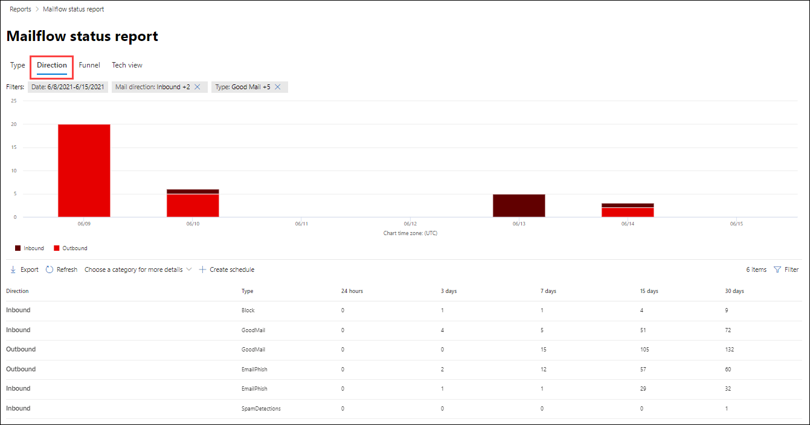

# Visa e-postflödesrapporter i Säkerhets- & Compliance Center

Förutom de insikter om [e-postflöde](mail-flow-insights-v2.md) som är tillgängliga i Security & Compliance Center finns det också en mängd rapporter om e-postflöde som hjälper dig att övervaka din Microsoft 365-organisation. Om du har [de behörigheter som krävs](#what-permissions-are-needed-to-view-these-reports)kan du visa dessa rapporter i Security & Compliance Center genom att gå till <https://office.protection.com> **Reports** \> **Instrumentpanelen**för rapporter . Om du vill gå direkt till instrumentpanelen för rapporter öppnar du <https://office.protection.office.com/insightdashboard> .

## Rapport över koppling

**Anslutningsrapporten** visar e-postflödesaktivitet på de [inkommande och utgående anslutningsappar](https://docs.microsoft.com/Exchange/mail-flow-best-practices/use-connectors-to-configure-mail-flow/use-connectors-to-configure-mail-flow) som är konfigurerade för organisationen.

Om du vill visa rapporten öppnar du [Säkerhets- & Compliance Center,](https://protection.office.com)går till **Instrumentpanelen för rapporter** \> **Dashboard** och väljer **Anslutningsrapport**. Öppna om du vill gå direkt till rapporten <https://protection.office.com/reportv2?id=ConnectorReport> .

### Rapportvy för anslutningsrapporten

Följande diagram är tillgängliga i rapportvyn:

- **Visa data efter: E-postflöde**: Det här diagrammet visar antalet inkommande och utgående meddelanden ordnade efter:

  - **Totalt**
  - **Från internet utan kontakt**
  - **Till internet utan anslutning**
  - En specifik anslutningsapp som du har konfigurerat.
  
  Om du vill isolera data i diagrammet använder du **visa data för** kontroll för att välja ett av dessa alternativ eller Alla **e-postflöden**.

  

- **Visa data efter: TLS-användning**: Det här diagrammet visar procentandelen av TLS-versionsanvändning (Transport Layer Security) för e-postflöde.

  Om du vill isolera data i diagrammet använder du **visa data för** kontroll för att välja något av följande alternativ:

  - **Allt e-postflöde**
  - **Från internet utan kontakt**
  - **Till internet utan anslutning**
  - En specifik anslutningsapp som du har konfigurerat.

  

Om du klickar på **Filter** i en rapportvy kan du ange ett datumintervall med **Startdatum** och **Slutdatum**.

### Tabellvy för information för anslutningsrapporten

Om du klickar på **Visa informationstabell** i en rapportvy visas följande information:

- **Datum**
- **Kopplingsriktning och namn**
- **Kopplingstyp**
- **Forced TLS?**: Värdet **Sant** eller **Falskt**.
- **Ingen TLS** (procent)
- **TLS 1.0** (procent)
- **TLS 1.1** (procent)
- **TLS 1,2** (procent)
- **Volym**: Antalet meddelanden.

Om du klickar på **Filter** i en detaljtabellvy kan du ange ett datumintervall med **Startdatum** och **Slutdatum**.

Om du vill gå tillbaka till rapportvyn klickar du på **Visa rapport**.

## Rapport över regel för utbyte av transport

Rapporten **Exchange-transportregel** visar effekten av regler för e-postflöde (kallas även transportregler) på inkommande och utgående meddelanden i organisationen.

Om du vill visa rapporten öppnar du [säkerhets- & Compliance Center](https://protection.office.com), går till **Instrumentpanelen För rapporter** och väljer Regel för Exchange \> **Dashboard** **Transport**. Öppna om du vill gå direkt till rapporten <https://protection.office.com/reportv2?id=ETRRuleReport> .

### Rapportvy för rapporten Exchange transportregel

Följande diagram är tillgängliga i rapportvyn:

- **Visa data efter: Utbyta transportregler** \> **Bryt ned efter: Riktning**: Det här diagrammet visar antalet **inkommande** och **utgående** meddelanden som påverkades av transportregler.

- **Visa data efter: Utbyta transportregler** \> **Bryt ned efter: Allvarlighetsgrad:** Det här diagrammet visar antalet meddelanden med **hög allvarlighetsgrad** och **Medel allvarlighetsgrad**och **Låg allvarlighetsgrad.** Du anger allvarlighetsgraden som en åtgärd i regeln **(Granska den här regeln med allvarlighetsgrad** eller _SetAuditSeverity_). Mer information finns [i Regelåtgärder för e-postflöde i Exchange Online](https://docs.microsoft.com//Exchange/security-and-compliance/mail-flow-rules/mail-flow-rule-actions).

- **Visa data efter: Transportregler för** \> DLP Exchange **Bryt ned efter: Riktning**: Det här diagrammet visar antalet **inkommande** och **utgående** meddelanden som påverkades av DLP-transportregler (Data Loss Prevention). Du kan förfina diagrammet ytterligare genom att välja följande alternativ:

  - **Visa data för: Alla DLP-transportregler**
  - **Visa data för: Komprometterade användare**
  - **Visa data för: Låg volym av innehåll upptäckt US Patriot Act**

- **Visa data efter: Transportregler för** \> DLP Exchange **Bryt ned efter: Riktning**: I den här vyn visas antalet **meddelanden om hög allvarlighetsgrad** och **Medel allvarlighetsgrad**och **Låg allvarlighetsgrad** som påverkades av DLP-transportregler. Du kan förfina diagrammet ytterligare genom att välja följande alternativ:

  - **Visa data för: Alla DLP-transportregler**
  - **Visa data för: Komprometterade användare**
  - **Visa data för: Låg volym av innehåll upptäckt US Patriot Act**

Om du klickar på **Filter** i en rapportvy kan du ändra resultaten med följande filter::

- **Startdatum** och **slutdatum**
- Riktningsvärden
- Allvarlighetsgradvärden

### Tabellvy för exchange-transportregelrapporten

Om du klickar på **Visa informationstabell**beror informationen som visas på vilket diagram du tittade på:

- **Visa data efter: Regler för Exchange Transport:**

  - **Datum**
  - **Transportregel**
  - **Ämne**
  - **Avsändarens adress**
  - **Mottagaradress**
  - **Svårighetsgrad**
  - **Riktning**

- **Visa data efter: DLP Exchange transportregler:**

  - **Datum**
  - **DLP-princip**
  - **Transportregel**
  - **Ämne**
  - **Avsändarens adress**
  - **Mottagaradress**
  - **Svårighetsgrad**
  - **Riktning**

Om du klickar på **Filter** i en detaljtabellvy kan du ändra resultaten med följande filter:

- **Startdatum** och **slutdatum**
- Riktningsvärden
- Allvarlighetsgradvärden

Om du vill gå tillbaka till rapportvyn klickar du på **Visa rapport**.

## Vidarebefordran av rapport

I **rapporten Vidarebefordran** visas organisationens automatiskt vidarebefordrade meddelanden till externa domäner från Exchange Online-postlådor. Vidarebefordrade meddelanden kan utgöra en säkerhets- eller efterlevnadsrisk och kan tyda på ett komprometterat konto.

Om du vill visa rapporten öppnar du [säkerhets- & Compliance Center,](https://protection.office.com)går till **Instrumentpanelen för rapporter** \> **Dashboard** och väljer **Vidarebefordran**. Öppna om du vill gå direkt till rapporten <https://protection.office.com/reportv2?id=MailFlowForwarding> .

### Rapportvy för rapporten Vidarebefordran

Följande diagram är tillgängliga i rapportvyn:

- **Visa data för: Vidarebefordran:** Följande metoder visas:

  - **Transportregel**: Kallas även [regler för e-postflöde](https://docs.microsoft.com/Exchange/security-and-compliance/mail-flow-rules/mail-flow-rules).
  - **Postlåderegel**: Kallas även [inkorgsregler](https://support.microsoft.com/office/c24f5dea-9465-4df4-ad17-a50704d66c59).

  

- **Visa data för: Vidarebefordringsdomäner**: I den här vyn visas de mottagardomäner som är mål för vidarebefordring.

  

- **Visa data för: Vidarebefordrare**: Följande vidarebefordrare visas:

  - **Transportregel**
  - Postlådan som innehåller inkorgsregeln för vidarebefordran.

  

Om du klickar på **Filter** i en rapportvy kan du ange ett datumintervall med **Startdatum** och **Slutdatum**.

### Tabellvy för information för rapporten Vidarebefordran

Om du klickar på **Visa informationstabell** i en rapportvy visas följande information:

- **Vidarebefordrare**: Värdet **Transportregel eller** postlådan som innehåller inkorgsregeln för vidarebefordran.
- **Vidarebefordringstyp**: Värdet **Postlåderegel** eller **Transportregel**.
- **Mottagarens namn**
- **Mottagardomän**
- **Information**: Det här är GUID-värdet för e-postflödesregeln eller värdet RuleIdentity för inkorgsregeln.
- **Räkna**
- **Första terminsdatum**

Om du klickar på **Filter** i en detaljtabellvy kan du ange ett datumintervall med **Startdatum** och **Slutdatum**.

Om du vill gå tillbaka till rapportvyn klickar du på **Visa rapport**.

## Statusrapport för e-postflöde

**Statusrapporten För e-postflöde** liknar [rapporten Skickat och mottaget e-post](#sent-and-received-email-report), med ytterligare information om e-post tillåten eller blockerad på kanten. Detta är den enda rapporten som innehåller information om kantskydd och visar hur mycket e-post som blockeras innan den tillåts komma in i tjänsten för utvärdering av Exchange Online Protection (EOP).

Om du vill visa rapporten öppnar du [säkerhets- & Compliance Center,](https://protection.office.com)går till **Instrumentpanelen För** \> **rapporter** och väljer **statusrapport för E-postflöde**. Om du vill gå direkt till **statusrapporten För e-postflöde**öppnar du <https://protection.office.com/mailflowStatusReport> .

### Textvy för statusrapporten för e-postflöde

När du öppnar rapporten markeras fliken **Typ** som standard. Som standard innehåller den här vyn ett diagram och en datatabell som är konfigurerad med följande filter:

- **Datum**: De senaste 7 dagarna.
- **Riktning**:

  - **Inkommande**
  - **Utgående**
  - **Intra-org** (räknas separat från **inkommande** och **utgående)**

- **Typ:**

  - **Bra post**
  - **Malware**
  - **Skräppost**
  - **Kantskydd**
  - **Regelmeddelanden**
  - **Nätfiske-e-post**

Diagrammet ordnas efter **Type** typvärdena.

Du kan ändra filtren genom att klicka på **Filter** eller genom att klicka på ett värde i diagramförklaringen.

Datatabellen innehåller följande information:

- **Riktning**
- **Typ**
- **24 timmar**
- **3 dagar**
- **7 dagar**
- **15 dagar**
- **30 dagar**

Om du klickar på **Välj en kategori för mer information**kan du välja mellan följande värden:

- **Nätfiske e-post:** Det här valet tar dig till [rapporten Hotskydd status](view-email-security-reports.md#threat-protection-status-report).
- **Skadlig kod i e-post:** Det här valet tar dig till [rapporten hotskyddsstatus](view-email-security-reports.md#threat-protection-status-report).
- **Spam upptäckter:** Det här valet tar dig till [rapporten Skräppostidentifieringar](view-email-security-reports.md#spam-detections-report).
- **Edge blockerad spam:** Det här valet tar dig till [rapporten Skräppostidentifieringar.](view-email-security-reports.md#spam-detections-report)

**Exportera**:

För detaljvyn kan du bara exportera data för en dag. Så, om du vill exportera data i 7 dagar, måste du göra 7 olika exportåtgärder.

Varje exporterad CSV-fil är begränsad till 150 000 rader. Om data för den dagen innehåller mer än 150 000 rader skapas flera CSV-filer.

### Riktningsvy för statusrapporten för e-postflöde

Om du klickar på fliken **Riktning** används samma standardfilter från **vyn Typ.**

Diagrammet är ordnat efter **riktningsvärden.**

Du kan ändra filtren genom att klicka på **Filter** eller genom att klicka på ett värde i diagramförklaringen. Samma filter från **vyn Typ** används.

Datatabellen innehåller samma information från **vyn Typ.**

Välj **en kategori för mer information** tillgängliga val och beteende är desamma som **vyn Typ.**

**Exportera**:

För detaljvyn kan du bara exportera data för en dag. Så, om du vill exportera data i 7 dagar, måste du göra 7 olika exportåtgärder.

Varje exporterad CSV-fil är begränsad till 150 000 rader. Om data för den dagen innehåller mer än 150 000 rader skapas flera CSV-filer.

## Skickad och mottagen e-postrapport

Rapporten **Skickat och mottagna e-postmeddelanden** är en smart rapport som visar information om inkommande och utgående e-post, inklusive skräppostidentifieringar, skadlig kod och e-post som identifierats som "bra". Skillnaden mellan den här rapporten och [statusrapporten för Mailflow](#mailflow-status-report) är: den här rapporten innehåller inte data om meddelanden som blockerats av kantskydd.

Den samlade vyn och detaljvyn i rapporten tillåter 90 dagars filtrering.

Om du vill visa rapporten öppnar du [Security & Compliance Center,](https://protection.office.com)går till **Instrumentpanelen för rapporter** och väljer Skickat och \> **Dashboard** **mottaget e-postmeddelande**. Öppna om du vill gå direkt till rapporten <https://protection.office.com/reportv2?id=SentAndReceivedMailATP> .

### Rapportvy för rapporten Skickat och mottaget e-post

Följande diagram är tillgängliga i rapportvyn:

- **Bryt ned efter: Skriv:** Diagrammet visar alla tillgängliga kategorier:

  - **Totalt**
  - **Bra post**
  - **Skadlig kod (anti-malware)** (EOP)
  - **Identifiering av skräppost**
  - **Regelmeddelanden**
  - **Avancerad skadlig kod** (Office 365 ATP)

  När du hovrar över en dag (datapunkt) i diagrammet kan du se information för den dagen.

  

- **Bryt ned efter: Riktning:** Diagrammet visar **Summa,** **Inkommande**och **Utgående** data. När du hovrar över en dag (datapunkt) i diagrammet kan du se information för den dagen.

  

- **Öka detaljnivån efter** \> **Malware (anti-malware)**: Detta val tar dig till [malware upptäckt i e-rapport](view-email-security-reports.md#malware-detection-in-email-report).

- **Öka detaljnivån efter** \> **Spam upptäckter)**: Detta val tar dig till [spam Upptäckter rapporten](view-email-security-reports.md#spam-detections-report).

Om du klickar på **Filter** i en rapportvy kan du ändra resultaten med följande filter:

- **Startdatum** och **slutdatum**
- Riktningsvärden
- Typvärden

Om du vill gå tillbaka till rapportvyn klickar du på **Visa rapport**.

### Informationstabellvy för rapporten Skickat och mottaget e-post

Om du klickar på **Visa informationstabell** i tabellen **Dela upp efter: Riktning** eller **Bryt ned efter: Riktningsvyn** visas följande information:

- **Datum (UTC)**
- **Typ**
- **Riktning**
- **Antal meddelanden**

Om du klickar på **Filter** i en detaljtabellvy kan du ändra resultaten med följande filter:

- **Startdatum** och **slutdatum**
- Riktningsvärden
- Typvärden

Om du vill gå tillbaka till rapportvyn klickar du på **Visa rapport**.

## Topprapport för avsändare och mottagare

Rapporten **Toppavsändare och mottagare** är ett cirkeldiagram som visar dina främsta e-postavsändare och -mottagare.

Om du vill visa rapporten öppnar du [Security & Compliance Center,](https://protection.office.com)går till **Instrumentpanelen för rapporter** och väljer \> **Dashboard** **Toppavsändare och mottagare**. Öppna om du vill gå direkt till rapporten <https://protection.office.com/reportv2?id=TopSenderRecipientsATP> .

### Rapportvy för rapporten Överkant och mottagarrapport

Följande diagram är tillgängliga i rapportvyn:

- **Visa data för avsändare av \> topputskick av e-post**
- **Visa data för \> toppmottagare för e-post**
- **Visa data för \> de bästa skräppostmottagarna**
- **Visa data för \> Toppmottagare för skadlig kod** (EOP)
- **Visa data för \> Mottagare av skadlig programvara (ATP)** (Office 365 ATP)

Cirkeldiagrammets sammansättning ändras baserat på dessa markeringar.

När du hovrar över en kil i cirkeldiagrammet kan du se ett antal meddelanden som skickas eller tas emot.

Om du klickar på **Filter** i en rapportvy kan du ange ett datumintervall med **Startdatum** och **Slutdatum**.

### Informationstabellvy för den översta avsändare och mottagarrapporten

Om du klickar på **Visa informationstabell**beror informationen som visas på vilket diagram du tittade på:

- **Visa data för avsändare av \> topputskick av e-post**

  - **Avsändare av bästa e-post**
  - **Räkna**

- **Visa data för \> toppmottagare för e-post**

  - **Toppmottagare för e-post**
  - **Räkna**

- **Visa data för \> de bästa skräppostmottagarna**

  - **De vanligaste skräppostmottagarna**
  - **Räkna**

- **Visa data för \> Toppmottagare för skadlig kod** (EOP)

  - **De främsta mottagarna av skadlig kod**
  - **Räkna**

- **Visa data för \> Mottagare av skadlig programvara (ATP)** (Office 365 ATP)

  - **Top malware mottagare (ATP)**
  - **Räkna**

Om du klickar på **Filter** i en detaljtabellvy kan du ange ett datumintervall med **Startdatum** och **Slutdatum**.

Om du vill gå tillbaka till rapportvyn klickar du på **Visa rapport**.

## Vilka behörigheter behövs för att visa dessa rapporter?

Om du vill visa och använda rapporterna måste du vara medlem i den angivna rollgruppen i Security & Compliance Center **och** Exchange Online.

- I Security & Compliance Center måste du vara medlem i någon av följande rollgrupper:

  -Organisationsledning

  -Säkerhetsadministratör (du kan också göra detta i [Azure Active Directory admin center](https://aad.portal.azure.com) -Security Reader

  Mer information finns i [Behörigheter i Säkerhets- och efterlevnadscentret](https://docs.microsoft.com/microsoft-365/security/office-365-security/permissions-in-the-security-and-compliance-center).

- I Exchange Online måste du vara medlem i någon av följande rollgrupper:

  -Organisationsledning

  -Endast visa organisationshantering

  -Endast visa mottagare

  -Efterlevnad Management

Mer information finns [i Behörigheter i rollgrupper för Exchange Online](https://docs.microsoft.com/Exchange/permissions-exo/permissions-exo) och Hantera i Exchange [Online](https://docs.microsoft.com/Exchange/permissions-exo/role-groups).

## Relaterade ämnen

[Smarta rapporter och insikter i Security & Compliance Center](reports-and-insights-in-security-and-compliance.md)

[Visa säkerhetsrapporter för e-post i Säkerhets- & Compliance Center](view-email-security-reports.md)
