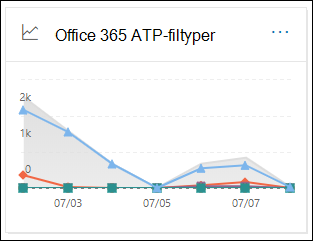
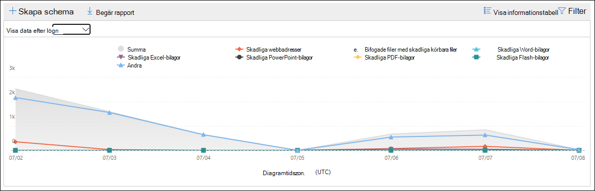
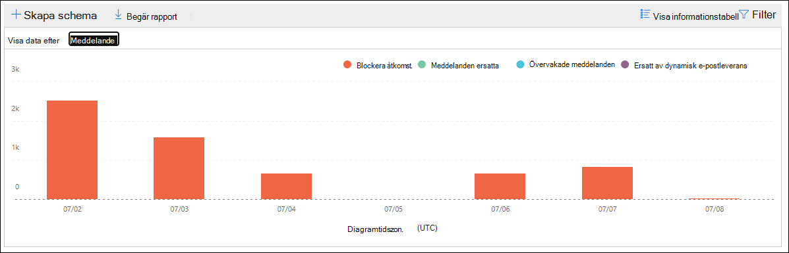
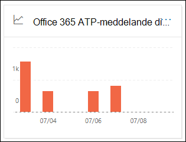
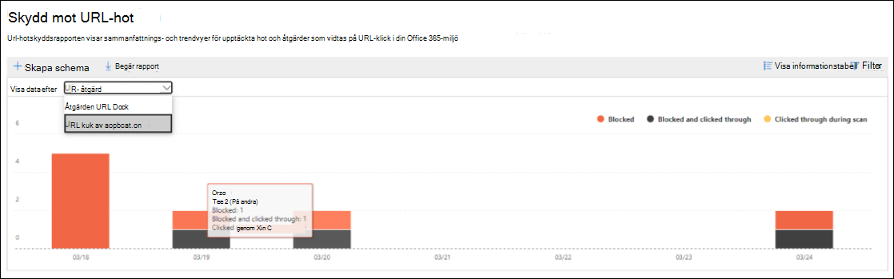

# Visa rapporter för Office 365 Avancerat skydd

[!INCLUDE [Microsoft 365 Defender rebranding](../includes/microsoft-defender-for-office.md)]

Office 365 organisationer för avancerat skydd (ATP) (till exempel Microsoft 365 E5-prenumerationer eller ATP-abonnemang 1 eller ATP-abonnemang 2 tillägg) innehåller en mängd säkerhets relaterade rapporter. Om du har [nödvändig behörighet](#what-permissions-are-needed-to-view-the-atp-reports)kan du visa dessa rapporter i säkerhets & Compliance Center genom att gå till **Reports** \> **instrument panelen**för rapporter. Öppna för att gå direkt till instrument panelen rapporter <https://protection.office.com/insightdashboard> .

## Filtypsrapporter för ATP

I rapporten **avancerade skydds filtyper** visas den typ av filer som identifieras som skadligt för de [bifogade säkerhets ATP](atp-safe-attachments.md)-filerna.

 I den sammanställda vyn i rapporten kan du använda 90 dagar för att filtrera den, men i detaljvyn kan du bara tillåta 10 dagars filtrering.

Om du vill visa rapporten öppnar du [säkerhets & efterlevnad](https://protection.office.com), går till **Reports** \> **instrument paneler** för rapporter och väljer **typer av Office ATP-filer**. Om du vill gå direkt till rapporten öppnar du <https://protection.office.com/reportv2?id=ATPFileReport> .

> [!NOTE]
> Informationen i den här rapporten är också tillgänglig i [rapporten för avancerat skydds meddelande](#advanced-threat-protection-message-disposition-report).

### Rapportvy för rapporten avancerade filtyper för avancerat skydd

Följande vyer är tillgängliga:

- **Visa data genom: fil**: diagrammet innehåller följande information:

  - **Skadliga Excel-bilagor**
  - **Skadliga Flash-filer**
  - **Skadliga PDF-filer**
  - **Skadliga PowerPoint-bilagor**
  - **Illasinnade URL: er**
  - **Skadliga Word-bilagor**
  - **Skadliga körbara filer**
  - **Gemensamma**

  När du håller mus pekaren över en viss dag (data punkt) kan du se en uppdelning av skadliga filer som upptäcktes av [säkra bifogade filer för ATP](atp-safe-attachments.md) och [skydd mot skadlig program vara i EOP](anti-malware-protection.md).

  

  Om du klickar på **filter**kan du ändra rapporten med följande filter:

  - **Start datum** och **slutdatum**
  - Samma fil typs värden som visas i diagrammet.

- **Visa data via: meddelande**: diagrammet innehåller följande information:

  - **Blockera åtkomst**
  - **Meddelanden ersatta**
  - **Meddelanden som övervakas**
  - **Ersatt med dynamisk e-postleverans**: Mer information finns i [dynamisk leverans och förhands granskning med säkra filer för ATP](dynamic-delivery-and-previewing.md).

  

  Om du klickar på **filter**kan du ändra rapporten med följande filter:

  - **Start datum** och **slutdatum**
  - Samma meddelande dispositions värden som är tillgängliga i diagrammet och ytterligare **meddelanden** .

### Detaljerad tabellvy för rapporten avancerade skydds filtyper

Om du klickar på **Visa informations tabell**visas en vy i real tid av alla klickningar i organisationen under de senaste 10 dagarna. Informationen som visas beror på diagrammet du tittade på:

- **Visa data per: fil**:

  - **Datum**
  - **Mottagarens adress**
  - **Avsändarens adress**
  - **Meddelande-ID**: tillgängligt i fältet **meddelande-ID** i meddelande huvudet och ska vara unikt. Ett exempel värde är `<08f1e0f6806a47b4ac103961109ae6ef@server.domain>` (Observera vinkelparenteser).
  - **Fil**

  Om du klickar på **filter**kan du ändra rapporten med följande filter:

  - **Start datum** och **slutdatum**
  - Samma fil typs värden som visas i diagrammet.

- **Visa data via: meddelande**:

  - **Datum**
  - **Mottagarens adress**
  - **Avsändarens adress**
  - **Meddelande-ID**
  - **Fil**
  - **Ämne**

  Om du klickar på **filter**kan du ändra resultatet med följande filter:

  - **Start datum** och **slutdatum**
  - Samma meddelande dispositions värden som är tillgängliga i diagrammet och ytterligare **meddelanden** .

Om du vill gå tillbaka till rapportvyn klickar du på **Visa rapport**.

## Meddelandedispositionsrapport för ATP

I rapporten för att visa **ATP** visas de åtgärder som vidtogs för e-postmeddelanden som identifierats som skadligt innehåll.

Om du vill visa rapporten öppnar du [säkerhets & efterlevnad](https://protection.office.com), går till **Reports** \> **instrument paneler** för rapporter och väljer **dispositionen för Office ATP-meddelanden**. Om du vill gå direkt till rapporten öppnar du <https://protection.office.com/reportv2?id=ATPMessageReport> .

> [!NOTE]
> Informationen i den här rapporten är också tillgänglig i [rapporten om filtyper för avancerat skydd](#advanced-threat-protection-file-types-report).

### Rapportvy för rapport om Avancerat skydds meddelande

Följande vyer är tillgängliga:

- **Visa data via: meddelande**: diagrammet innehåller följande information:

  - **Blockera åtkomst**
  - **Meddelanden ersatta**
  - **Meddelanden som övervakas**
  - **Ersatt med dynamisk e-postleverans**: Mer information finns i [dynamisk leverans och förhands granskning med säkra filer för ATP](dynamic-delivery-and-previewing.md).

  

  Om du klickar på **filter**kan du ändra rapporten med följande filter:

  - **Start datum** och **slutdatum**
  - Samma meddelande dispositions värden som är tillgängliga i diagrammet och ytterligare **meddelanden** .

- **Visa data genom: fil**: diagrammet innehåller följande information:

  - **Skadliga Excel-bilagor**
  - **Skadliga Flash-filer**
  - **Skadliga PDF-filer**
  - **Skadliga PowerPoint-bilagor**
  - **Illasinnade URL: er**
  - **Skadliga Word-bilagor**
  - **Skadliga körbara filer**
  - **Gemensamma**

  När du håller mus pekaren över en viss dag (data punkt) kan du se en uppdelning av skadliga filer som upptäcktes av [säkra bifogade filer för ATP](atp-safe-attachments.md) och [skydd mot skadlig program vara i EOP](anti-malware-protection.md).

  

  Om du klickar på **filter**kan du ändra rapporten med följande filter:

  - **Start datum** och **slutdatum**
  - Samma fil typs värden som visas i diagrammet.

### Detaljerad tabellvy för rapport om Avancerat skydds meddelande disposition

Om du klickar på **Visa informations tabell**visas en vy i real tid av alla klickningar i organisationen under de senaste 10 dagarna. Informationen som visas beror på diagrammet du tittade på:

- **Visa data via: meddelande**:

  - **Datum**
  - **Mottagarens adress**
  - **Avsändarens adress**
  - **Meddelande-ID**
  - **Fil**
  - **Ämne**

  Om du klickar på **filter**kan du ändra resultatet med följande filter:

  - **Start datum** och **slutdatum**
  - Samma meddelande dispositions värden som är tillgängliga i diagrammet och ytterligare **meddelanden** .

- **Visa data per: fil**:

  - **Datum**
  - **Mottagarens adress**
  - **Avsändarens adress**
  - **Meddelande-ID**
  - **Fil**

  Om du klickar på **filter**kan du ändra rapporten med följande filter:

  - **Start datum** och **slutdatum**
  - Samma fil typs värden som visas i diagrammet.

Om du vill gå tillbaka till rapportvyn klickar du på **Visa rapport**.

## Statusrapport för hotskydd

Status rapporten för **hotets skydd** är en enkel vy som innehåller information om skadligt innehåll och skadlig e-post som identifieras och blockeras av [Exchange Online Protection](exchange-online-protection-overview.md) (EOP) och Office 365 ATP. För mer information, se [status rapport för hot skydd](view-email-security-reports.md#threat-protection-status-report).

## Rapport om skydd mot URL-hotet

**Rapporten skydd mot URL-hotet** innehåller sammanfattnings-och trenden för hot som upptäckts och åtgärder som vidtas på URL-adresser. [ATP Safe Links](atp-safe-links.md) Den här rapporten kommer inte att behöva klicka på data från användare där **principen för Safe** Links har Aktiver ATS.

Om du vill visa rapporten öppnar du [säkerhets & Compliance Center](https://protection.office.com), går till **rapport** \> **instrument panelen** och väljer **URL-skydd**. Om du vill gå direkt till rapporten öppnar du <https://protection.office.com/reportv2?id=URLProtectionActionReport> .

> [!NOTE]
> Det här är en *skydds trend rapport*som visar trender i en större data mängd. Därför är data i den aggregerade vyn inte tillgängliga i real tid, men data i vyn detaljerad tabell är så att du kan se en liten avvikelse mellan de två vyerna.

### Rapportvy för rapport om URL-Threat

Rapporten **skydd mot URL-hotet** har två aggregerade vyer som uppdateras en gång var fjärde timme som visar data för de senaste 90 dagarna:

- **Webb adress klicka på skydds åtgärd**: visar antalet URL-musklick efter användare i organisationen och resultatet av klickning:

  - **Blockerad** (användaren hindrades från att gå till URL-adressen)
  - **Blockerad och klickat genom**
  - **Klickning genom under genomsökning**

  Ett klick visar att användaren har klickat via block sidan till webbplatsen för illasinnade webbplatser (administratörer kan inaktivera Klicka genom i principer för säkra länkar).

  Om du klickar på **filter**kan du ändra rapporten med följande filter:

  - **Start datum** och **slutdatum**
  - De tillgängliga Klicka på skydds åtgärder plus värdet som **tillåts** (användaren kunde navigera till URL: en).

  

- **URL-adress klicka**här: visar antalet URL-musklick per program som stöder Office 365 ATP-säkra länkar:

  - **E-postklient**
  - **PowerPoint**
  - **Word**
  - **Excel**
  - **OneNote**
  - **Visio**
  - **Teams**
  - **Annat**

  Om du klickar på **filter**kan du ändra rapporten med följande filter:

  - **Start datum** och **slutdatum**
  - Tillgängliga program.

### Vyn detaljerad tabell för rapportering av URL-hotet

Om du klickar på **Visa informations tabell**visas en vy i real tid av alla klickningar i organisationen under de senaste 7 dagarna med följande information:

- **Klicka på tid**
- **Användare**
- **:**
- **Fattning**
- **Program**

Om du klickar på **filter** i vyn detaljerad tabell kan du filtrera efter samma villkor som i rapportvyn och även efter **domäner** eller **mottagare** avgränsade med kommatecken.

Om du vill gå tillbaka till rapportvyn klickar du på **Visa rapport**.

## Ytterligare rapporter att Visa

Utöver de ATP-rapporter som beskrivs i det här avsnittet är flera andra rapporter tillgängliga enligt följande tabell:

****

|Rapport|Ämnes|
|---|---|
|**Explorer** (ATP-abonnemang 2) eller **real tids identifiering** (ATP-abonnemang 1)|[Hotutforskaren (och realtidsidentifieringar)](threat-explorer.md)|
|**Säkerhets rapporter för e-post**, till exempel rapporten Top avsändare och mottagare, rapporten Spoof meddelanden och rapporten skräp identifiering.|[Visa säkerhets rapporter för e-post i säkerhets & efterlevnad](view-email-security-reports.md)|
|**E-postflödes rapporter**, till exempel vidarebefordran, rapporten flödes schema och rapport om avsändare och mottagare.|[Visa rapporter om e-postflöden i säkerhets & Compliance Center](view-mail-flow-reports.md)|
|**URL-spårning för säkra ATP-länkar** (endast PowerShell). Utdata från den här cmdleten visar resultaten av aktiviteter under de senaste sju dagarna.|[Get-UrlTrace](https://docs.microsoft.com/powershell/module/exchange/get-urltrace)|
|**Resultat för e-posttrafik för EOP och ATP** (endast PowerShell). Utdata från den här cmdleten innehåller information om domäner, datum, händelse typ, riktning, åtgärd och antal meddelanden.|[Get-MailTrafficATPReport](https://docs.microsoft.com/powershell/module/exchange/get-mailtrafficatpreport)|
|**E-postdetaljerad rapporter för EOP och ATP-identifiering** (endast PowerShell). Utdata från den här cmdleten innehåller information om skadliga filer och URL-adresser, nät fiske försök, personifiering och andra potentiella hot i e-post och filer.|[Get-MailDetailATPReport](https://docs.microsoft.com/powershell/module/exchange/get-maildetailatpreport)|
|

## Vilka behörigheter behövs för att Visa ATP-rapporter?

För att kunna visa och använda de rapporter som beskrivs i det här avsnittet **måste du ha en lämplig roll kopplad till både säkerhets &amp; kontroll Center och administrations centret för Exchange**.

- För säkerhets & Compliance Center måste du ha någon av följande roller tilldelade:

  - Organisationshantering
  - Säkerhets administratör (detta kan tilldelas i Azure Active Directory Admin Center ( [https://aad.portal.azure.com](https://aad.portal.azure.com) ))
  - Säkerhets ansvarig (detta kan tilldelas i Azure Active Directory-administratörs Center ( [https://aad.portal.azure.com](https://aad.portal.azure.com) ))
  - Säkerhets läsare

- För Exchange Online måste du ha någon av följande roller tilldelade i antingen administrations centret för Exchange ( [https://outlook.office365.com/ecp](https://outlook.office365.com/ecp) ) eller med PowerShell-cmdletar (se [Exchange Online PowerShell](https://docs.microsoft.com/powershell/exchange/exchange-online-powershell)):

  - Organisationshantering
  - Organisations hantering för endast visning
  - Rollen skrivskyddade mottagare
  - Hantering av efterlevnad

Mer information finns i följande resurser:

- [Behörigheter i Säkerhets- och efterlevnadscentret](permissions-in-the-security-and-compliance-center.md)

- [Behörigheter för funktioner i Exchange Online](https://docs.microsoft.com/exchange/permissions-exo/feature-permissions)

## Vad händer om rapporterna inte visar data?

Om du inte ser data i dina ATP-rapporter kontrollerar du att dina principer är korrekt konfigurerade. Din organisation måste ha [principer för säkert](set-up-atp-safe-links-policies.md) skydd via ATP och [principer för säkra bifogade filer](set-up-atp-safe-attachments-policies.md) via ATP, definierade för att ATP-skyddet ska finnas. Se även [antiskräppost-och skydd mot skadlig program vara i Office 365](anti-spam-and-anti-malware-protection.md).

## Relaterade ämnen

[Smarta rapporter och insikter i säkerhets & efterlevnad](reports-and-insights-in-security-and-compliance.md)
  
[Roll behörigheter (Azure Active Directory](https://docs.microsoft.com/azure/active-directory/users-groups-roles/directory-assign-admin-roles#role-permissions)
