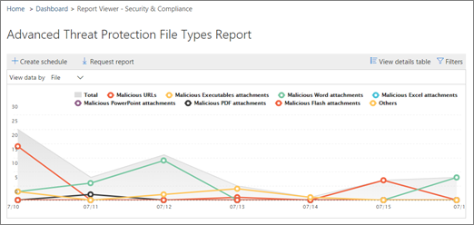

# Visa rapporter för avancerat hotskydd för Office 365View reports for Office 365 Advanced Threat Protection

Om din organisation har [Office 365 Advanced Threat Protection](office-365-atp.md) (ATP) och du har de [behörigheter som krävs](#what-permissions-are-needed-to-view-the-atp-reports)kan du använda flera ATP-rapporter i Security Compliance &amp; Center.If your organization has [Office 365 Advanced Threat Protection](office-365-atp.md) (ATP) and you have the [necessary permissions](#what-permissions-are-needed-to-view-the-atp-reports), you can use several ATP reports in the Security &amp; Compliance Center. (Gå till **rapporter** \> **Instrumentpanel .)**(Go to **Reports** \> **Dashboard**.)

ATP-rapporter innehåller följande:ATP reports include the following:

- [Statusrapport för hotskyddThreat Protection Status report](#threat-protection-status-report)
- [Rapporten för ATP-filtyperATP File Types report](#atp-file-types-report)
- [Rapport om ATP-meddelandedispositionATP Message Disposition report](#atp-message-disposition-report)
- antingen [identifiering i realtid eller Utforskaren](threat-explorer.md) (beroende på om du har Office 365 ATP-abonnemang 1 eller 2)either [real-time detections or Explorer](threat-explorer.md) (depending on whether you have Office 365 ATP Plan 1 or 2)
- ... [och mer](#additional-reports-to-view).... [and more](#additional-reports-to-view).

Läs den här artikeln om du vill få en översikt över ATP-rapporter och hur du använder dem.Read this article to get an overview of ATP reports and how to use them.

## Statusrapport för hotskyddThreat Protection Status report

Rapporten **Status för hotskydd** är en enda vy som samlar information om skadligt innehåll och skadlig e-post som upptäckts och blockerats av [Exchange Online Protection](exchange-online-protection-overview.md) (EOP) och [Office 365 ATP](office-365-atp.md).The **Threat Protection Status** report is a single view that brings together information about malicious content and malicious email detected and blocked by [Exchange Online Protection](exchange-online-protection-overview.md) (EOP) and [Office 365 ATP](office-365-atp.md). Den här rapporten är användbar för att visa identifieringar över tid (upp till 90 dagar) och gör det möjligt för säkerhetsadministratörer att identifiera trender eller avgöra om principer behöver justeras.This report is useful for viewing detections over time (up to 90 days), and it enables security administrators to identify trends or determine whether policies need adjustments.

Rapporten innehåller ett aggregerat antal unika e-postmeddelanden med skadligt innehåll, till exempel filer eller webbadresser (WEBBADRESSER) som blockerades av anti-malware-motorn, [nolltimmars automatisk rensning (ZAP)](zero-hour-auto-purge.md)och ATP-funktioner som [ATP Safe Links](atp-safe-links.md), [ATP Safe Attachments](atp-safe-attachments.md)och [ATP anti-phishing](set-up-anti-phishing-policies.md).The report provides an aggregated count of unique email messages with malicious content, such as files or website addresses (URLs) that were blocked by the anti-malware engine, [zero-hour auto purge (ZAP)](zero-hour-auto-purge.md), and ATP features like [ATP Safe Links](atp-safe-links.md), [ATP Safe Attachments](atp-safe-attachments.md), and [ATP anti-phishing](set-up-anti-phishing-policies.md).

Filter och uppdelningar av informationen möjliggör mer detaljerade kategoriseringar av informationen i den här rapporten.Filters and breakdowns of the information allow for more granular categorizations of the information in this report. Specifikt finns det en "break down by" meny som ingår för **E** \> **Phish** och **E Malware** \> **visningar.**Specifically, there is a 'break down by' menu included for **Email** \> **Phish** and **Email** \> **Malware views**. Det kommer att dela upp data i:It will break down the data into:

|||
|---|---|
|Efter identifieringstypBy detection type|Vilken politik hjälpte till att fånga dessa hot?What policy helped catch these threats?|
|Genom detektionsteknikBy detection technology|Vilken underliggande Microsoft-teknik fångade hotet?What underlying Microsoft technology caught the threat?|
|Efter leveransstatusBy delivery status|Vad har hänt med de e-postmeddelanden som upptäckts som hot?What happened to the email messages detected as threats?|
|

> [!TIP]
> Både e-> Phish | Malware visningar har detaljerade uppdelningar för upptäckt teknik som visas, med kategorier som *ATP-genererade fil rykte*, *File detonation*, *URL detonation*, *Anti-parodi: DMARC misslyckande*, till exempel, till hjälp med att precisera exakt vilken funktion som ledde din organisation att fånga hot.Both the Email > Phish | Malware views have granular breakdowns for the detection technologies shown, with categories like *ATP-generated file reputation*, *File detonation*, *URL detonation*, *Anti-spoof: DMARC failure*, for example, helpful in pinpointing exactly which feature led your organization to catch threats.

Dessa vyer ger dig möjlighet att exportera, via ett knappklick (i **Mail** \> **Phish,** **E Malware** och \> **Malware** **Content** \> **Malware** visningar).These views give you the option to export, via a button click (in **Email** \> **Phish**, **Email** \> **Malware**, and **Content** \> **Malware** views). De aggregerade data som exporteras till datorn kan öppnas i Excel.The aggregated data exported to your computer can be opened in Excel.

**Obs:** Det maximala antalet poster som kan exporteras för **Phish** och **Malware** är strax under 10000.**Note**: The maximum number of entries that can be exported for **Phish** and **Malware** is just under 10000. Om du exporterar en vy exporteras endast de senaste 10000 posterna.If you export a view, only the most recent 10000 entries are exported.

Översikts- och e-postvyerna visar information inom några timmar efter bearbetningen i stället för inom 24 timmar (efterfrågan på igen.The Overview and Emails views will display information within hours of processing rather than in 24 hours (demand re. ökade hastigheter här har varit en tydlig signal)!increased speeds here has been a clear signal)!

> [!NOTE]
> En statusrapport för hot är tillgänglig för kunder som har antingen [Office 365 ATP](office-365-atp.md) eller [Exchange Online Protection](exchange-online-protection-overview.md)) (EOP). Informationen som visas i rapporten Status för hotskydd för ATP-kunder innehåller dock sannolikt andra data än vad EOP-kunder kan se.A Threat Protection Status report is available to customers who have either [Office 365 ATP](office-365-atp.md) or [Exchange Online Protection](exchange-online-protection-overview.md)) (EOP); however, the information that is displayed in the Threat Protection Status report for ATP customers will likely contain different data than what EOP customers might see. Rapporten Status för hotskydd för ATP-kunder innehåller till exempel information om [skadliga filer som identifierats i SharePoint Online, OneDrive eller Microsoft Teams](atp-for-spo-odb-and-teams.md).For example, the Threat Protection Status report for ATP customers will contain information about [malicious files detected in SharePoint Online, OneDrive, or Microsoft Teams](atp-for-spo-odb-and-teams.md). Sådan information är specifik för ATP, så kunder som har EOP men inte ATP kommer inte att se dessa uppgifter i sin rapport om hotskyddsstatus.Such information is specific to ATP, so customers who have EOP but not ATP will not see those details in their Threat Protection Status report.

Om du vill visa rapporten [Status &amp; ](https://protection.office.com)för hotskydd går du till **Rapporter om** skydd av \> **instrumentpanelens** \> **skydd .**To view the Threat Protection Status report, in the [Security &amp; Compliance Center](https://protection.office.com), go to **Reports** \> **Dashboard** \> **Threat Protection Status**.

Om du vill ha detaljerad status för en dag håller du muspekaren över diagrammet.To get detailed status for a day, hover over the graph.

Som standard visar rapporten Status för hotskydd data för de senaste sju dagarna.By default, the Threat Protection Status report shows data for the past seven days. Du kan dock välja **Filter** och ändra datumintervallet för att visa data i upp till 90 dagar.However, you can choose **Filters** and change the date range to view data for up to 90 days. (Om du använder en utvärderingsprenumeration kan du vara begränsad till 30 dagars data.)(If you are using a trial subscription, you might be limited to 30 days' of data.)

Du kan också använda **Visa data efter** meny för att ändra vilken information som visas i rapporten.You can also use the **View data by** menu to change what information is displayed in the report.

## Statusrapport för URL-skyddURL Protection Status report

Den här rapporten är baserad på insamlade data och upptäckta hot per klick (medan de flesta andra e-posthotrelaterade rapporter är per meddelandedata).This report is based data collected, and threats detected, per click (whereas most other email threat related reports are per message data). Den här rapporten är utformad för att visa hot som kommer från hyperlänkar i e-postmeddelanden och dokument per klick.This report is designed to show threats that come from hyperlinks in email messages and documents, per click. Det finns två vyer:There are two views:

|||
|---|---|
|Url-klickskyddsåtgärdURL click protection action|Se antalet webbadresser som blockerats, blockerats men åsidosättts med ett klick av en användare, åsidosatt med ett klick av en användare och tillåtet.See the number of URLs blocked, blocked but overridden with a click-through by a user, overridden with a click-through by a user, and allowed.|
|URL-klick efter programURL click by application|Se programmet som url:en klickades på.See the application from which the URL was clicked.|
|

I informationstabellen kan du se mer information om klicktid och användarinformation.In the details table, you'll be able to see more information regarding click time and user information. Slutligen, tänk på url skydd statusrapport visar skyddet från ATP Safe Links funktionen, så att endast kunder som har aktiverat ATP Safe Links kommer att se data återspeglas på den här rapporten.Finally, keep in mind the URL Protection Status report shows the protection from ATP Safe Links feature, so only customers who have enabled ATP Safe Links will see data reflected on this report.

> [!NOTE]
> Det här är en *trendrapport*för skydd , vilket innebär att data representerar trender i en större datauppsättning.This is a *protection trend report*, meaning data represents trends in a larger dataset. Därför är data i den aggregerade vyn inte tillgängliga i realtid här, men data i detaljtabellvyn är, så du kan se en liten diskrepans mellan de två vyerna.As a result, the data in the aggregate view is not available in real time here, but the data in the details table view is, so you may see a slight discrepancy between the two views.

## Rapporten för ATP-filtyperATP File Types report

I **atp-filtyper** visas vilken typ av filer som har identifierats som skadliga av [ATP Safe Attachments](atp-safe-attachments.md).The **ATP File Types** report shows you the type of files detected as malicious by [ATP Safe Attachments](atp-safe-attachments.md).

Om du vill visa [ &amp; den](https://protection.office.com)här rapporten går du till **Rapporter** \> **instrumentpanels-ATP-filtyper** \> **ATP File Types**.To view this report, in the [Security &amp; Compliance Center](https://protection.office.com), go to **Reports** \> **Dashboard** \> **ATP File Types**.

  
När du hovrar över en viss dag kan du se fördelningen av typer av skadliga filer som upptäcktes av [ATP Safe Bilagor](atp-safe-attachments.md) och [anti-spam &amp; anti-malware skydd](anti-spam-and-anti-malware-protection.md).When you hover over a particular day, you can see the breakdown of types of malicious files that were detected by [ATP Safe Attachments](atp-safe-attachments.md) and [anti-spam &amp; anti-malware protection](anti-spam-and-anti-malware-protection.md).
  

## Rapport om ATP-meddelandedispositionATP Message Disposition report

**Atp Message Disposition-rapporten** visar de åtgärder som har vidtagits för e-postmeddelanden som har identifierats som skadliga innehåll.The **ATP Message Disposition** report shows you the actions that were taken for email messages that were detected as having malicious content.

Om du vill visa den här rapporten **Reports** går du till Rapportinstrumentpanelen ATP Message Disposition i [ &amp; Säkerhetsefterlevnadscenter](https://protection.office.com) \> **Dashboard** \> **ATP Message Disposition**.To view this report, in the [Security &amp; Compliance Center](https://protection.office.com), go to **Reports** \> **Dashboard** \> **ATP Message Disposition**.

När du hovrar över en stapel i diagrammet kan du se vilka åtgärder som har vidtagits för upptäckt e-post för den dagen.When you hover over a bar in the chart, you can see what actions were taken for detected email for that day.

## Ytterligare rapporter att visaAdditional reports to view

Utöver de ATP-rapporter som beskrivs i den här artikeln finns flera andra rapporter tillgängliga, enligt beskrivningen i följande tabell:In addition to the ATP reports described in this article, several other reports are available, as described in the following table:

|||
|---|---|
|**Rapport(er)****Report(s)**|**Information****Details**|
|**Explorer** eller **realtidsidentifieringar**: (Office 365 ATP Plan 2-kunder har Explorer; Office 365 ATP-abonnemang 1-kunder har identifieringar i realtid.)**Explorer** or **real-time detections**: (Office 365 ATP Plan 2 customers have Explorer; Office 365 ATP Plan 1 customers have real-time detections.)|[Hotutforskaren (och realtidsidentifieringar)Threat Explorer (and real-time detections)](threat-explorer.md)|
|**Säkerhetsrapporter för e-post**, till exempel en rapport om toppavsändare och mottagare, en rapport om falska e-postmeddelanden och en rapport om skräppostidentifieringar.**Email security reports**, such as a Top Senders and Recipients report, a Spoof Mail report, and a Spam Detections report.|[Visa säkerhetsrapporter för e-post i &amp; SäkerhetsefterlevnadscenterView email security reports in the Security &amp; Compliance Center](view-email-security-reports.md)|
|**ATP-url-spårning för säkra länkar:**(Det här är en rapport som du genererar med PowerShell.) Den här rapporten visar resultaten av ATP Safe Links-åtgärder under de senaste sju (7) dagarna.**ATP Safe Links URL trace**: (This is a report you generate by using PowerShell.) This report shows the results of ATP Safe Links actions over the past seven (7) days.|[Cmdlet-referens för Get-UrlTraceGet-UrlTrace cmdlet reference](https://docs.microsoft.com/powershell/module/exchange/advanced-threat-protection/get-urltrace)|
|**EOP- och ATP-resultat**: (Det här är en anpassad rapport som du genererar med PowerShell).**EOP and ATP results**: (This is a custom report you generate by using PowerShell). Den här rapporten innehåller information, till exempel Domän, Datum, Händelsetyp, Riktning, Åtgärd och Meddelanderäkning.This report contains information, such as Domain, Date, Event Type, Direction, Action, and Message Count.|[Cmdlet-referens för Get-MailTrafficATPReportGet-MailTrafficATPReport cmdlet reference](https://docs.microsoft.com/powershell/module/exchange/advanced-threat-protection/get-mailtrafficatpreport)|
|**EOP- och ATP-identifieringar**: (Det här är en anpassad rapport som du genererar med PowerShell).**EOP and ATP detections**: (This is a custom report you generate by using PowerShell). Den här rapporten innehåller information om skadliga filer eller webbadresser, nätfiskeförsök, personifiering och andra potentiella hot i e-post eller filer.This report contains details about malicious files or URLs, phishing attempts, impersonation, and other potential threats in email or files.|[Cmdlet-referens för Get-MailDetailATPReportGet-MailDetailATPReport cmdlet reference](https://docs.microsoft.com/powershell/module/exchange/advanced-threat-protection/get-maildetailatpreport)|
|

## Vilka behörigheter behövs för att visa ATP-rapporterna?What permissions are needed to view the ATP reports?

Om du vill visa och använda de rapporter som beskrivs i den här artikeln **måste du ha tilldelat en lämplig roll för både Security Compliance Center och &amp; Administrationscenter för Exchange**.In order to view and use the reports described in this article, **you must have an appropriate role assigned for both the Security &amp; Compliance Center and the Exchange admin center**.

- För &amp; Säkerhetsefterlevnadscenter måste du ha tilldelat en av följande roller:For the Security &amp; Compliance Center, you must have one of the following roles assigned:

  - OrganisationshanteringOrganization Management
  - Säkerhetsadministratör (detta kan tilldelas i Azure Active Directory admin center ( [https://aad.portal.azure.com](https://aad.portal.azure.com) ))Security Administrator (this can be assigned in the Azure Active Directory admin center ([https://aad.portal.azure.com](https://aad.portal.azure.com)))
  - Säkerhetsoperatör (detta kan tilldelas i Azure Active Directory admin center ( [https://aad.portal.azure.com](https://aad.portal.azure.com) ))Security Operator (this can be assigned in the Azure Active Directory admin center ([https://aad.portal.azure.com](https://aad.portal.azure.com)))
  - SäkerhetsläsareSecurity Reader

- För Exchange Online måste du ha någon av följande roller tilldelad i administrationscentret för Exchange ( [https://outlook.office365.com/ecp](https://outlook.office365.com/ecp) ) eller med PowerShell-cmdletar (Se [Exchange Online PowerShell):](https://docs.microsoft.com/powershell/exchange/exchange-online/exchange-online-powershell)For Exchange Online, you must have one of the following roles assigned in either the Exchange admin center ([https://outlook.office365.com/ecp](https://outlook.office365.com/ecp)) or with PowerShell cmdlets (See [Exchange Online PowerShell](https://docs.microsoft.com/powershell/exchange/exchange-online/exchange-online-powershell)):

  - OrganisationshanteringOrganization Management
  - Organisationshantering endast för vyView-only Organization Management
  - Rollen Endast visa mottagareView-Only Recipients role
  - Hantering av efterlevnadCompliance Management

Mer information finns i följande resurser:To learn more, see the following resources:

- [Behörigheter i &amp; SäkerhetsefterlevnadscenterPermissions in the Security &amp; Compliance Center](permissions-in-the-security-and-compliance-center.md)

- [Funktionsbehörigheter i Exchange OnlineFeature permissions in Exchange Online](https://docs.microsoft.com/exchange/permissions-exo/feature-permissions)

## Vad händer om rapporterna inte visar data?What if the reports aren't showing data?

Om du inte ser data i ATP-rapporterna dubbelkollar du att dina principer är korrekt konfigurerade.If you are not seeing data in your ATP reports, double-check that your policies are set up correctly. Din organisation måste ha [ATP Safe Links-principer](set-up-atp-safe-links-policies.md) och [ATP-principer för säkra bilagor](set-up-atp-safe-attachments-policies.md) definierade för att ATP-skydd ska vara på plats.Your organization must have [ATP Safe Links policies](set-up-atp-safe-links-policies.md) and [ATP Safe Attachments policies](set-up-atp-safe-attachments-policies.md) defined in order for ATP protection to be in place. Se även [skydd mot skräppost och skadlig kod i Office 365](anti-spam-and-anti-malware-protection.md).Also see [Anti-spam and anti-malware protection in Office 365](anti-spam-and-anti-malware-protection.md).

## Relaterade ämnenRelated topics

[Rapporter och insikter i Security &amp; Compliance CenterReports and insights in the Security &amp; Compliance Center](reports-and-insights-in-security-and-compliance.md)
  
[Skapa ett schema för en rapport i &amp; SäkerhetsefterlevnadscenterCreate a schedule for a report in the Security &amp; Compliance Center](create-a-schedule-for-a-report.md)

[Konfigurera och hämta en anpassad rapport i Security &amp; Compliance CenterSet up and download a custom report in the Security &amp; Compliance Center](set-up-and-download-a-custom-report.md)

[Rollbehörigheter (Azure Active DirectoryRole permissions (Azure Active Directory](https://docs.microsoft.com/azure/active-directory/users-groups-roles/directory-assign-admin-roles#role-permissions)
