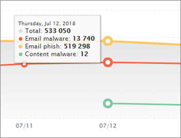

# Visa rapporter för avancerat hotskydd för Office 365

Om din organisation har [Office 365 Advanced Threat Protection](office-365-atp.md) (ATP) och du har de [behörigheter som krävs](#what-permissions-are-needed-to-view-the-atp-reports)kan du använda flera ATP-rapporter i Security Compliance &amp; Center. (Gå till **rapporter** \> **Instrumentpanel .)**

ATP-rapporter innehåller följande:

- [Statusrapport för hotskydd](#threat-protection-status-report)
- [Rapporten för ATP-filtyper](#atp-file-types-report)
- [Rapport om ATP-meddelandedisposition](#atp-message-disposition-report)
- antingen [identifieringar i realtid eller Utforskaren](threat-explorer.md) (beroende på om du har Office 365 ATP-abonnemang 1 eller 2)
- ... [med mera](#additional-reports-to-view).

Läs den här artikeln om du vill få en översikt över ATP-rapporter och hur du använder dem.

## Statusrapport för hotskydd

Rapporten **Status för hotskydd** är en enda vy som samlar information om skadligt innehåll och skadlig e-post som upptäckts och blockerats av [Exchange Online Protection](exchange-online-protection-overview.md) (EOP) och [Office 365 ATP](office-365-atp.md). Den här rapporten är användbar för att visa identifieringar över tid (upp till 90 dagar) och gör det möjligt för säkerhetsadministratörer att identifiera trender eller avgöra om principer behöver justeras.

Rapporten innehåller ett aggregerat antal unika e-postmeddelanden med skadligt innehåll, till exempel filer eller webbadresser (URL:er) som blockerades av anti-malware-motorn, [nolltimmars automatisk rensning (ZAP)](zero-hour-auto-purge.md)och ATP-funktioner som [ATP Safe Links,](atp-safe-links.md) [ATP Safe Attachments](atp-safe-attachments.md)och [ATP anti-phishing](set-up-anti-phishing-policies.md).

Filter och uppdelningar av informationen möjliggör mer detaljerade kategoriseringar av informationen i den här rapporten. Specifikt finns det en "break down by" meny som ingår för **E** \> **Phish** och **E Malware** \> **visningar.** Det kommer att dela upp data i:

|||
|---|---|
|Efter principtyp|Vilken politik hjälpte till att fånga upp dessa hot?|
|Genom detektionsteknik|Vilken underliggande Microsoft-teknik fångade hotet?|
|Efter leveransstatus|Vad identifierades den slutliga leveransstatusen för e-postmeddelanden som hot?|
|

> [!TIP]
> Både e-> Phish | Malware visningar har detaljerade uppdelningar för detektionsteknik som visas, med kategorier som *ATP-genererade fil rykte*, *File detonation*, *URL detonation*, *Anti-parodi: DMARC misslyckande*, till exempel, till hjälp med att precisera exakt vilken funktion som ledde din organisation att fånga hot.

Dessa vyer ger dig möjlighet att exportera, via ett knappklick (i **e-post** \> **Phish,** **E Malware** och \> **Malware** **Innehåll** \> **Malware** visningar). De aggregerade data som exporteras till datorn kan öppnas i Excel.

> [!NOTE]
> Det maximala antalet poster som kan exporteras för **Phish** och **Malware** är strax under 10000. Om du exporterar en vy exporteras endast de senaste 10000 posterna. På exporterade data representerar kolumnen _meddelandeantal_ antalet antalet meddelanden som identifieras av identifieringsteknik och principtyp.    

Översikts- och e-postvyerna visar information inom några timmar efter bearbetningen i stället för inom 24 timmar (efterfrågan på igen. ökade hastigheter här har varit en tydlig signal)!

> [!NOTE]
> En rapport om status för hotskydd är tillgänglig för kunder som har antingen [Office 365 ATP](office-365-atp.md) eller [Exchange Online Protection](exchange-online-protection-overview.md)) (EOP). Informationen som visas i rapporten Status för hotskydd för ATP-kunder innehåller dock sannolikt andra data än vad EOP-kunder kan se. Rapporten Status för hotskydd för ATP-kunder innehåller till exempel information om [skadliga filer som identifierats i SharePoint Online, OneDrive eller Microsoft Teams](atp-for-spo-odb-and-teams.md). Sådan information är specifik för ATP, så kunder som har EOP men inte ATP kommer inte att se dessa uppgifter i sin hotskyddsstatusrapport.

Om du vill visa rapporten [Status &amp; ](https://protection.office.com)för hotskydd går du till **Rapporter om** skydd av \> **instrumentpanelens** \> **skydd .**

Om du vill ha detaljerad status för en dag håller du muspekaren över diagrammet.

Som standard visar rapporten Status för hotskydd data för de senaste sju dagarna. Du kan dock välja **Filter** och ändra datumintervallet för att visa data i upp till 90 dagar för den sammanlagda vyn och 30 dagar för detaljvyn. (Om du använder en utvärderingsprenumeration kan du vara begränsad till 30 dagars data.)

Du kan också använda **Visa data efter** meny för att ändra vilken information som visas i rapporten.

## Statusrapport för URL-skydd

Den här rapporten är baserad på insamlade data och upptäckta hot per klick (medan de flesta andra e-posthotrelaterade rapporter är per meddelandedata). Den här rapporten är utformad för att visa hot som kommer från hyperlänkar i e-postmeddelanden och dokument per klick. Det finns två vyer:

|||
|---|---|
|Url-klickskyddsåtgärd|Se antalet webbadresser som blockerats, blockerats men åsidosätts med ett klick av en användare, åsidosätts med ett klick av en användare och tillåts.|
|URL-klick efter program|Se programmet som url:en klickades på.|
|

I informationstabellen kan du se mer information om klicktid och användarinformation. Slutligen, tänk på url skydd statusrapport visar skyddet från ATP Safe Links funktionen, så att endast kunder som har aktiverat ATP Säkra länkar kommer att se data återspeglas på den här rapporten.

> [!NOTE]
> Det här är en *trendrapport*för skydd , vilket innebär att data representerar trender i en större datauppsättning. Därför är data i den aggregerade vyn inte tillgängliga i realtid här, men data i detaljtabellvyn är, så du kan se en liten diskrepans mellan de två vyerna.

## Rapporten för ATP-filtyper

I rapporten **ATP-filtyper** visas vilken typ av filer som har identifierats som skadliga av [ATP Safe Attachments](atp-safe-attachments.md).

Om du vill visa [ &amp; den](https://protection.office.com)här rapporten går du till **Rapporter** \> **instrumentpanelen** \> **ATP-filtyper**.

  
När du hovrar över en viss dag kan du se fördelningen av typer av skadliga filer som upptäcktes av [ATP Säkra bilagor](atp-safe-attachments.md) och [ &amp; anti-spam anti-malware skydd](anti-spam-and-anti-malware-protection.md). Den samlade vyn av rapporten tillåter 90 dagars filtrering, medan detaljvyn endast tillåter tio dagars filtrering. 
  

## Rapport om ATP-meddelandedisposition

**Atp-meddelandedispositionsrapporten** visar de åtgärder som har vidtagits för e-postmeddelanden som har identifierats som skadliga innehåll.

Om du vill visa den här rapporten **Reports** går du till Rapportinstrumentpanelen ATP Message Disposition i [ &amp; Säkerhetsefterlevnadscenter](https://protection.office.com) \> **Dashboard** \> **ATP Message Disposition**.

När du hovrar över en stapel i diagrammet kan du se vilka åtgärder som vidtogs för upptäckt e-post för den dagen.

## Ytterligare rapporter att visa

Utöver de ATP-rapporter som beskrivs i den här artikeln finns flera andra rapporter tillgängliga, enligt beskrivningen i följande tabell:

|||
|---|---|
|**Rapport(er)**|**Information**|
|**Explorer** eller **realtidsidentifieringar**: (Office 365 ATP Plan 2-kunder har Explorer; Office 365 ATP-abonnemang 1-kunder har identifieringar i realtid.)|[Hotutforskaren (och realtidsidentifieringar)](threat-explorer.md)|
|**Säkerhetsrapporter för e-post**, till exempel en rapport om toppavsändare och mottagare, en rapport om falska e-postmeddelanden och en rapport om skräppostidentifieringar.|[Visa säkerhetsrapporter för e-post i &amp; Säkerhetsefterlevnadscenter](view-email-security-reports.md)|
|**ATP-url-spårning för säkra länkar:**(Det här är en rapport som du genererar med PowerShell.) Den här rapporten visar resultaten av ATP Safe Links-åtgärder under de senaste sju (7) dagarna.|[Cmdlet-referens för Get-UrlTrace](https://docs.microsoft.com/powershell/module/exchange/get-urltrace)|
|**EOP- och ATP-resultat**: (Det här är en anpassad rapport som du genererar med PowerShell). Den här rapporten innehåller information, till exempel Domän, Datum, Händelsetyp, Riktning, Åtgärd och Meddelanderäkning.|[Cmdlet-referens för Get-MailTrafficATPReport](https://docs.microsoft.com/powershell/module/exchange/get-mailtrafficatpreport)|
|**EOP- och ATP-identifieringar**: (Det här är en anpassad rapport som du genererar med PowerShell). Den här rapporten innehåller information om skadliga filer eller webbadresser, nätfiskeförsök, personifiering och andra potentiella hot i e-post eller filer.|[Cmdlet-referens för Get-MailDetailATPReport](https://docs.microsoft.com/powershell/module/exchange/get-maildetailatpreport)|
|

## Vilka behörigheter behövs för att visa ATP-rapporterna?

Om du vill visa och använda de rapporter som beskrivs i den här artikeln **måste du ha tilldelat en lämplig roll för både Security Compliance Center och &amp; Administrationscenter för Exchange**.

- För &amp; Säkerhetsefterlevnadscenter måste du ha en av följande roller tilldelad:

  - Organisationshantering
  - Säkerhetsadministratör (detta kan tilldelas i Administrationscentret för Azure Active Directory ( [https://aad.portal.azure.com](https://aad.portal.azure.com) ))
  - Säkerhetsoperatör (detta kan tilldelas i Administrationscentret för Azure Active Directory ( [https://aad.portal.azure.com](https://aad.portal.azure.com) ))
  - Säkerhetsläsare

- För Exchange Online måste du ha någon av följande roller tilldelad i administrationscentret för Exchange ( [https://outlook.office365.com/ecp](https://outlook.office365.com/ecp) ) eller med PowerShell-cmdletar (se [Exchange Online PowerShell):](https://docs.microsoft.com/powershell/exchange/exchange-online-powershell)

  - Organisationshantering
  - Organisationshantering endast med enbart vy
  - Rollen Endast visa mottagare
  - Hantering av efterlevnad

Mer information finns i följande resurser:

- [Behörigheter i &amp; Säkerhetsefterlevnadscenter](permissions-in-the-security-and-compliance-center.md)

- [Funktionsbehörigheter i Exchange Online](https://docs.microsoft.com/exchange/permissions-exo/feature-permissions)

## Vad händer om rapporterna inte visar data?

Om du inte ser data i ATP-rapporterna dubbelkollar du att dina principer är korrekt konfigurerade. Din organisation måste ha [ATP Safe Links-principer](set-up-atp-safe-links-policies.md) och [ATP-principer för säkra bilagor](set-up-atp-safe-attachments-policies.md) definierade för att ATP-skydd ska vara på plats. Se även [skydd mot skräppost och skadlig kod i Office 365](anti-spam-and-anti-malware-protection.md).

## Relaterade ämnen

[Rapporter och insikter i Security &amp; Compliance Center](reports-and-insights-in-security-and-compliance.md)
  
[Rollbehörigheter (Azure Active Directory](https://docs.microsoft.com/azure/active-directory/users-groups-roles/directory-assign-admin-roles#role-permissions)
