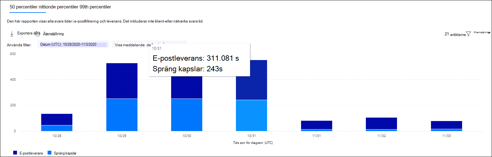

# Visa Defender för Office 365-rapporter i rapport instrument panelen i säkerhets & efterlevnadView Defender for Office 365 reports in the Reports dashboard in the Security & Compliance Center

[!INCLUDE [Microsoft 365 Defender rebranding](../includes/microsoft-defender-for-office.md)]

Microsoft Defender för Office 365-organisationer (till exempel Microsoft 365 E5-prenumerationer eller Microsoft Defender för Office 365 abonnemang 1 eller Microsoft Defender för Office 365 abonnemang 2 tillägg) innehåller flera olika säkerhets relaterade rapporter.Microsoft Defender for Office 365 organizations (for example, Microsoft 365 E5 subscriptions or Microsoft Defender for Office 365 Plan 1 or Microsoft Defender for Office 365 Plan 2 add-ons) contain a variety of security-related reports. Om du har [nödvändig behörighet](#what-permissions-are-needed-to-view-the-defender-for-office-365-reports)kan du visa dessa rapporter i säkerhets & Compliance Center genom att gå till  \> **instrument panelen** för rapporter.If you have the [necessary permissions](#what-permissions-are-needed-to-view-the-defender-for-office-365-reports), you can view these reports in the Security & Compliance Center by going to **Reports** \> **Dashboard**. Öppna för att gå direkt till instrument panelen rapporter <https://protection.office.com/insightdashboard> .To go directly to the Reports dashboard, open <https://protection.office.com/insightdashboard>.

## Rapport om fil typer i Defender för Office 365Defender for Office 365 file types report

I rapporten **Defender för Office 365-filtyper** visas en typ av filer som identifieras i skadlig kod för [bifogade](atp-safe-attachments.md)filer.The **Defender for Office 365 file types report** report shows you the type of files detected as malicious by [Safe Attachments](atp-safe-attachments.md).

 I den sammanställda vyn i rapporten kan du använda 90 dagar för att filtrera den, men i detaljvyn kan du bara tillåta 10 dagars filtrering.The aggregate view of the report allows for 90 days of filtering, while the detail view only allows for 10 days of filtering.

Om du vill visa rapporten öppnar du [säkerhets & Compliance Center](https://protection.office.com), går till  \> **instrument paneler** för rapporter och väljer **Defender för Office 365-filtyper**.To view the report, open the [Security & Compliance Center](https://protection.office.com), go to **Reports** \> **Dashboard** and select **Defender for Office 365 file types**. Om du vill gå direkt till rapporten öppnar du <https://protection.office.com/reportv2?id=ATPFileReport> .To go directly to the report, open <https://protection.office.com/reportv2?id=ATPFileReport>.

> [!NOTE]
> Informationen i den här rapporten är också tillgänglig i [meddelande dispositions rapporten för Defender för Office 365](#defender-for-office-365-message-disposition-report).The information in this report is also available in the [Defender for Office 365 message disposition report](#defender-for-office-365-message-disposition-report).

### Rapportvy för rapporten fil typer i Defender för Office 365Report view for the Defender for Office 365 file types report

Följande vyer är tillgängliga:The following views are available:

- **Visa data genom: fil**: diagrammet innehåller följande information:**View data by: File**: The chart contains the following information:

  - **Skadliga Excel-bilagor****Malicious Excel attachments**
  - **Skadliga Flash-filer****Malicious Flash attachments**
  - **Skadliga PDF-filer****Malicious PDF attachments**
  - **Skadliga PowerPoint-bilagor****Malicious PowerPoint attachments**
  - **Illasinnade URL: er****Malicious URLs**
  - **Skadliga Word-bilagor****Malicious Word attachments**
  - **Skadliga körbara filer****Malicious executable attachments**
  - **Gemensamma****Others**

  När du håller mus pekaren över en viss dag (data punkt) kan du se en uppdelning av skadliga filer som identifieras av [säkra bifogade filer](atp-safe-attachments.md) och [skydd mot skadlig program vara i EOP](anti-malware-protection.md).When you hover over a particular day (data point), you can see the breakdown of types of malicious files that were detected by [Safe Attachments](atp-safe-attachments.md) and [anti-malware protection in EOP](anti-malware-protection.md).

  

  Om du klickar på **filter** kan du ändra rapporten med följande filter:If you click **Filters**, you can modify the report with the following filters:

  - **Start datum** och **slutdatum****Start date** and **End date**
  - Samma fil typs värden som visas i diagrammet.The same file type values that are visible in the chart.

- **Visa data via: meddelande**: diagrammet innehåller följande information:**View data by: Message**: The chart contains the following information:

  - **Blockera åtkomst****Block access**
  - **Meddelanden ersatta****Messages replaced**
  - **Meddelanden som övervakas****Messages monitored**
  - **Ersatt med dynamisk e-postleverans**: Mer information finns i [dynamisk leverans i principer för säkra bifogade filer](atp-safe-attachments.md#dynamic-delivery-in-safe-attachments-policies).**Replaced by Dynamic Email Delivery**: For more information, see [Dynamic Delivery in Safe Attachments policies](atp-safe-attachments.md#dynamic-delivery-in-safe-attachments-policies).

  

  Om du klickar på **filter** kan du ändra rapporten med följande filter:If you click **Filters**, you can modify the report with the following filters:

  - **Start datum** och **slutdatum****Start date** and **End date**
  - Samma meddelande dispositions värden som är tillgängliga i diagrammet och ytterligare **meddelanden** .The same message disposition values that are available in the chart, and the additional **Messages passed** value.

### Vyn detaljerad tabell för fil typer i Defender för Office 365Details table view for the Defender for Office 365 file types report

Om du klickar på **Visa informations tabell** visas en vy i real tid av alla klickningar i organisationen under de senaste 10 dagarna.If you click **View details table**, the report provides a near-real-time view of all clicks that happen within the organization for the last 10 days. Informationen som visas beror på diagrammet du tittade på:The information that's shown depends on the chart you were looking at:

- **Visa data per: fil**:**View data by: File**:

  - **Datum****Date**
  - **Mottagarens adress****Recipient address**
  - **Avsändarens adress****Sender address**
  - **Meddelande-ID**: tillgängligt i fältet **meddelande-ID** i meddelande huvudet och ska vara unikt.**Message ID**: Available in the **Message-ID** header field in the message header and should be unique. Ett exempel värde är `<08f1e0f6806a47b4ac103961109ae6ef@server.domain>` (Observera vinkelparenteser).An example value is `<08f1e0f6806a47b4ac103961109ae6ef@server.domain>` (note the angle brackets).
  - **Fil****File**

  Om du klickar på **filter** kan du ändra rapporten med följande filter:If you click **Filters**, you can modify the report with the following filters:

  - **Start datum** och **slutdatum****Start date** and **End date**
  - Samma fil typs värden som visas i diagrammet.The same file type values that are visible in the chart.

- **Visa data via: meddelande**:**View data by: Message**:

  - **Datum****Date**
  - **Mottagarens adress****Recipient address**
  - **Avsändarens adress****Sender address**
  - **Meddelande-ID****Message ID**
  - **Fil****File**
  - **Ämne****Subject**

  Om du klickar på **filter** kan du ändra resultatet med följande filter:If you click **Filters**, you can modify the results with the following filters:

  - **Start datum** och **slutdatum****Start date** and **End date**
  - Samma meddelande dispositions värden som är tillgängliga i diagrammet och ytterligare **meddelanden** .The same message disposition values that are available in the chart, and the additional **Messages passed** value.

Om du vill gå tillbaka till rapportvyn klickar du på **Visa rapport**.To get back to the reports view, click **View report**.

## Meddelande disposition för Defender för Office 365Defender for Office 365 message disposition report

I rapporten för att visa **ATP** visas de åtgärder som vidtogs för e-postmeddelanden som identifierats som skadligt innehåll.The **ATP Message Disposition** report shows you the actions that were taken for email messages that were detected as having malicious content.

Om du vill visa rapporten öppnar du [säkerhets & efterlevnad](https://protection.office.com), går till  \> **instrument paneler** för rapporter och väljer **Defender för Office 365 meddelande disposition**.To view the report, open the [Security & Compliance Center](https://protection.office.com), go to **Reports** \> **Dashboard** and select **Defender for Office 365 message disposition**. Om du vill gå direkt till rapporten öppnar du <https://protection.office.com/reportv2?id=ATPMessageReport> .To go directly to the report, open <https://protection.office.com/reportv2?id=ATPMessageReport>.

> [!NOTE]
> Informationen i den här rapporten är också tillgänglig i [rapporten fil typer i Defender för Office 365](#defender-for-office-365-file-types-report).The information in this report is also available in the [Defender for Office 365 file types report](#defender-for-office-365-file-types-report).

### Rapportvy för meddelande dispositions rapport för Defender för Office 365Report view for the Defender for Office 365 message disposition report

Följande vyer är tillgängliga:The following views are available:

- **Visa data via: meddelande**: diagrammet innehåller följande information:**View data by: Message**: The chart contains the following information:

  - **Blockera åtkomst****Block access**
  - **Meddelanden ersatta****Messages replaced**
  - **Meddelanden som övervakas****Messages monitored**
  - **Ersatt med dynamisk e-postleverans**: Mer information finns i [dynamisk leverans i principer för säkra bifogade filer](atp-safe-attachments.md#dynamic-delivery-in-safe-attachments-policies).**Replaced by Dynamic Email Delivery**: For more information, see [Dynamic Delivery in Safe Attachments policies](atp-safe-attachments.md#dynamic-delivery-in-safe-attachments-policies).

  

  Om du klickar på **filter** kan du ändra rapporten med följande filter:If you click **Filters**, you can modify the report with the following filters:

  - **Start datum** och **slutdatum****Start date** and **End date**
  - Samma meddelande dispositions värden som är tillgängliga i diagrammet och ytterligare **meddelanden** .The same message disposition values that are available in the chart, and the additional **Messages passed** value.

- **Visa data genom: fil**: diagrammet innehåller följande information:**View data by: File**: The chart contains the following information:

  - **Skadliga Excel-bilagor****Malicious Excel attachments**
  - **Skadliga Flash-filer****Malicious Flash attachments**
  - **Skadliga PDF-filer****Malicious PDF attachments**
  - **Skadliga PowerPoint-bilagor****Malicious PowerPoint attachments**
  - **Illasinnade URL: er****Malicious URLs**
  - **Skadliga Word-bilagor****Malicious Word attachments**
  - **Skadliga körbara filer****Malicious executable attachments**
  - **Gemensamma****Others**

  När du håller mus pekaren över en viss dag (data punkt) kan du se en uppdelning av skadliga filer som identifieras av [säkra bifogade filer](atp-safe-attachments.md) och [skydd mot skadlig program vara i EOP](anti-malware-protection.md).When you hover over a particular day (data point), you can see the breakdown of types of malicious files that were detected by [Safe Attachments](atp-safe-attachments.md) and [anti-malware protection in EOP](anti-malware-protection.md).

  

  Om du klickar på **filter** kan du ändra rapporten med följande filter:If you click **Filters**, you can modify the report with the following filters:

  - **Start datum** och **slutdatum****Start date** and **End date**
  - Samma fil typs värden som visas i diagrammet.The same file type values that are visible in the chart.

### Vyn detaljerad tabell för meddelande dispositionen för Defender för Office 365Details table view for the Defender for Office 365 message disposition report

Om du klickar på **Visa informations tabell** visas en vy i real tid av alla klickningar i organisationen under de senaste 10 dagarna.If you click **View details table**, the report provides a near-real-time view of all clicks that happen within the organization for the last 10 days. Informationen som visas beror på diagrammet du tittade på:The information that's shown depends on the chart you were looking at:

- **Visa data via: meddelande**:**View data by: Message**:

  - **Datum****Date**
  - **Mottagarens adress****Recipient address**
  - **Avsändarens adress****Sender address**
  - **Meddelande-ID****Message ID**
  - **Fil****File**
  - **Ämne****Subject**

  Om du klickar på **filter** kan du ändra resultatet med följande filter:If you click **Filters**, you can modify the results with the following filters:

  - **Start datum** och **slutdatum****Start date** and **End date**
  - Samma meddelande dispositions värden som är tillgängliga i diagrammet och ytterligare **meddelanden** .The same message disposition values that are available in the chart, and the additional **Messages passed** value.

- **Visa data per: fil**:**View data by: File**:

  - **Datum****Date**
  - **Mottagarens adress****Recipient address**
  - **Avsändarens adress****Sender address**
  - **Meddelande-ID****Message ID**
  - **Fil****File**

  Om du klickar på **filter** kan du ändra rapporten med följande filter:If you click **Filters**, you can modify the report with the following filters:

  - **Start datum** och **slutdatum****Start date** and **End date**
  - Samma fil typs värden som visas i diagrammet.The same file type values that are visible in the chart.

Om du vill gå tillbaka till rapportvyn klickar du på **Visa rapport**.To get back to the reports view, click **View report**.

## E-postrapportMail latency report

I **rapporten e-postsvars tid** visas en sammanslagen för leverans-och spräng tiden i din organisation.The **Mail latency report** shows you an aggregate view of the mail delivery and detonation latency experienced within your organization. Leverans tiden för e-post påverkas av många faktorer och den absoluta leverans tiden i sekunder är ofta inte en bra indikation på framgång eller ett problem.Mail delivery times in the service are affected by a number of factors, and the absolute delivery time in seconds is often not a good indicator of success or a problem. En långsam leverans tid på en dag kan betraktas som en genomsnittlig leverans tid på en annan dag, eller tvärtom.A slow delivery time on one day might be considered an average delivery time on another day, or vice-versa. I **rapporten e-postsvars tid** görs ett försök att kvalificera meddelande leverans baserat på statistik om den observerade leverans tiden för andra meddelanden:The **Mail latency report** tries to qualify message delivery based on statistical data about the observed delivery times of other messages:

- **femtio percentil**: det här är mitten för leverans tider för meddelanden.**50th percentile**: This is the middle for message delivery times. Du kan betrakta detta värde som en genomsnittlig leverans tid.You can consider this value as an average delivery time.
- **nittionde percentil**: Detta indikerar en hög latens för meddelande leverans.**90th percentile**: This indicates a high latency for message delivery. Det tog längre tid än 10 procent av meddelandena att leverera.Only 10% of messages took longer than this value to deliver.
- **99th percentil**: här visas den högsta svars tiden för meddelande leverans.**99th percentile**: This indicates the highest latency for message delivery.

Klient sidan och nätverks fördröjningen ingår inte.Client side and network latency are not included.

Om du vill visa rapporten öppnar du [säkerhets & efterlevnad](https://protection.office.com), går till  \> **instrument paneler** för rapporter och väljer **rapport om e-postsvar**.To view the report, open the [Security & Compliance Center](https://protection.office.com), go to **Reports** \> **Dashboard** and select **Mail latency report**. Om du vill gå direkt till rapporten öppnar du <https://protection.office.com/mailLatencyReport?viewid=P50> .To go directly to the report, open <https://protection.office.com/mailLatencyReport?viewid=P50>.

### Rapportvy för rapport om e-postsvarReport view for the Mail latency report

När du öppnar rapporten är fliken **femtio percentil** markerad som standard.When you open the report, the **50th percentiles** tab is selected by default.

Som standard innehåller den här vyn ett diagram som är konfigurerat med följande filter:By default, this view contains a chart that's configured with the following filters:

- **Datum**: de senaste 7 dagarna**Date**: The last 7 days
- **Meddelande vy**:**Message View**:
  - Översprängta meddelandenDetonated messages

I det här diagrammet visas meddelanden ordnade i följande kategorier:This chart shows messages organized into the following categories:

- **Leverans svars tid för e-post****Mail delivery latency**
- **Fördröjning för sprängning****Detonation latency**

När du hovrar över en kategori i diagrammet kan du se en uppdelning av svars tiden i varje kategori.When you hover over a category in the chart, you can see a breakdown of the latency in each category.

Om du klickar på **filter** i rapportvyn kan du ändra resultatet med följande filter:If you click **Filter** in the report view, you can modify the results with the following filters:

- Alla meddelandenAll messages
- Meddelanden som innehåller bilagor eller URL: erMessages that contain attachments or URLs

Om du klickar på fliken **nittionde percentiler** eller på fliken **99th percentiler** används samma standard filter från vyn **50 percentiler** .If you click the **90th percentiles** tab or the **99th percentiles** tab, the same default filters from the **50th percentiles** view are used.

### Vyn detaljerad tabell för rapporten e-postsvarDetails table view for the Mail latency report

Följande information visas i vyn detaljerad tabell:The following information is shown in the details table view:

- **Datum****Date**
- **Värden****Percentiles**
- **Antal meddelanden****Message count**
- **Total svars tid****Overall latency**

Ovanstående visar att genomsnittlig tids åtgång den 14 november för alla meddelanden som levererats och sprängat sig **108,033** sekunder.The above shows that on November 14 the average latency experienced for all messages delivered and detonated was **108.033** seconds.

Tabellen information innehåller samma information på varje flik.The details table contains the same information on each tab.

## Statusrapport för hotskyddThreat protection status report

Status rapporten för **hotets skydd** är en enkel vy som innehåller information om skadligt innehåll och skadlig e-post som identifieras och blockeras av [Exchange Online Protection](exchange-online-protection-overview.md) (EOP) och Microsoft Defender för Office 365.The **Threat protection status** report is a single view that brings together information about malicious content and malicious email detected and blocked by [Exchange Online Protection](exchange-online-protection-overview.md) (EOP) and Microsoft Defender for Office 365. För mer information, se [status rapport för hot skydd](view-email-security-reports.md#threat-protection-status-report).For more information, see [Threat protection status report](view-email-security-reports.md#threat-protection-status-report).

## Rapport om skydd mot URL-hotetURL threat protection report

**Rapporten skydd mot URL-hotet** innehåller översikts-och trend lägen för hot som upptäcks och åtgärder som vidtas på URL-adresser till vissa [säkra länkar](atp-safe-links.md).The **URL threat protection report** provides summary and trend views for threats detected and actions taken on URL clicks as part of [Safe Links](atp-safe-links.md). Den här rapporten kommer inte att behöva klicka på data från användare där **principen för Safe** Links har Aktiver ATS.This report will not have click data from users where the Safe Links policy applied has the **Do not track user clicks** option selected.

Om du vill visa rapporten öppnar du [säkerhets & Compliance Center](https://protection.office.com), går till **rapport** \> **instrument panelen** och väljer **URL-skydd**.To view the report, open the [Security & Compliance Center](https://protection.office.com), go to **Reports** \> **Dashboard** and select **URL protection report**. Om du vill gå direkt till rapporten öppnar du <https://protection.office.com/reportv2?id=URLProtectionActionReport> .To go directly to the report, open <https://protection.office.com/reportv2?id=URLProtectionActionReport>.

> [!NOTE]
> Det här är en *skydds trend rapport* som visar trender i en större data mängd.This is a *protection trend report*, meaning data represents trends in a larger dataset. Därför är data i den aggregerade vyn inte tillgängliga i real tid, men data i vyn detaljerad tabell är så att du kan se en liten avvikelse mellan de två vyerna.As a result, the data in the aggregate view is not available in real time here, but the data in the details table view is, so you may see a slight discrepancy between the two views.

### Rapportvy för rapport om URL-ThreatReport view for the URL threat protection report

Rapporten **skydd mot URL-hotet** har två aggregerade vyer som uppdateras en gång var fjärde timme som visar data för de senaste 90 dagarna:The **URL threat protection** report has two aggregated views that are refreshed once every four hours that shows data for the last 90 days:

- **Webb adress klicka på skydds åtgärd**: visar antalet URL-musklick efter användare i organisationen och resultatet av klickning:**URL click protection action**: Shows the number of URL clicks by users in the organization and the results of the click:

  - **Blockerad** (användaren hindrades från att gå till URL-adressen)**Blocked** (the user was blocked from navigating to the URL)
  - **Blockerad och klickat genom****Blocked and clicked through**
  - **Klickning genom under genomsökning****Clicked through during scan**

  Ett klick visar att användaren har klickat via block sidan till webbplatsen för illasinnade webbplatser (administratörer kan inaktivera Klicka genom i principer för säkra länkar).A click indicates that the user has clicked through the block page to the malicious website (admins can disable click through in Safe Links policies).

  Om du klickar på **filter** kan du ändra rapporten med följande filter:If you click **Filters**, you can modify the report with the following filters:

  - **Start datum** och **slutdatum****Start date** and **End date**
  - De tillgängliga Klicka på skydds åtgärder plus värdet som **tillåts** (användaren kunde navigera till URL: en).The available click protection actions, plus the value **Allowed** (the user was allowed to navigate to the URL).

  

- **URL-adress klicka** här: visar antalet URL-musklick med program som stöder säkra länkar:**URL click by application**: Shows the number of URL clicks by applications that support Safe Links:

  - **E-postklient****Email client**
  - **PowerPoint****PowerPoint**
  - **Word****Word**
  - **Excel****Excel**
  - **OneNote****OneNote**
  - **Visio****Visio**
  - **Teams****Teams**
  - **Annat****Other**

  Om du klickar på **filter** kan du ändra rapporten med följande filter:If you click **Filters**, you can modify the report with the following filters:

  - **Start datum** och **slutdatum****Start date** and **End date**
  - Tillgängliga program.The available applications.

### Vyn detaljerad tabell för rapportering av URL-hotetDetails table view for the URL threat protection report

Om du klickar på **Visa informations tabell** visas en vy i real tid av alla klickningar i organisationen under de senaste 7 dagarna med följande information:If you click **View details table**, the report provides a near-real-time view of all clicks that happen within the organization for the last 7 days with the following details:

- **Klicka på tid****Click time**
- **Användare****User**
- **:****URL**
- **Fattning****Action**
- **Program****App**

Om du klickar på **filter** i vyn detaljerad tabell kan du filtrera efter samma villkor som i rapportvyn och även efter **domäner** eller **mottagare** avgränsade med kommatecken.If you click **Filters** in the details table view, you can filter by the same criteria as in the report view, and also by **Domains** or **Recipients** separated by commas.

Om du vill gå tillbaka till rapportvyn klickar du på **Visa rapport**.To get back to the reports view, click **View report**.

## Ytterligare rapporter att VisaAdditional reports to view

Utöver de rapporter som beskrivs i det här avsnittet är flera andra rapporter tillgängliga, enligt följande tabell:In addition to the reports described in this topic, several other reports are available, as described in the following table:

****

|RapportReport|ÄmnesTopic|
|---|---|
|**Explorer** (Microsoft Defender för Office 365 abonnemang 2) eller **real tids identifiering** (microsoft Defender för Office 365 abonnemang 1)**Explorer** (Microsoft Defender for Office 365 Plan 2) or **real-time detections** (Microsoft Defender for Office 365 Plan 1)|[Hotutforskaren (och realtidsidentifieringar)Threat Explorer (and real-time detections)](threat-explorer.md)|
|**Säkerhets rapporter för e-post**, till exempel rapporten Top avsändare och mottagare, rapporten Spoof meddelanden och rapporten skräp identifiering.**Email security reports**, such as the Top senders and recipients report, the Spoof mail report, and the Spam detections report.|[Visa säkerhets rapporter för e-post i säkerhets & efterlevnadView email security reports in the Security & Compliance Center](view-email-security-reports.md)|
|**E-postflödes rapporter**, till exempel vidarebefordran, rapporten flödes schema och rapport om avsändare och mottagare.**Mail flow reports**, such as the Forwarding report, the Mailflow status report, and the Top senders and recipients report.|[Visa rapporter om e-postflöden i säkerhets & Compliance CenterView mail flow reports in the Security & Compliance Center](view-mail-flow-reports.md)|
|**URL-spårning för säkra länkar** (endast PowerShell).**URL trace for Safe Links** (PowerShell only). Utdata från denna cmdlet visar resultaten av åtgärder för säkra länkar under de senaste sju dagarna.The output of this cmdlet shows you the results of Safe Links actions over the past seven days.|[Get-UrlTraceGet-UrlTrace](https://docs.microsoft.com/powershell/module/exchange/get-urltrace)|
|**Resultat för e-posttrafik för EOP och Microsoft Defender för Office 365** (endast PowerShell).**Mail traffic results for EOP and Microsoft Defender for Office 365** (PowerShell only). Utdata från den här cmdleten innehåller information om domäner, datum, händelse typ, riktning, åtgärd och antal meddelanden.The output of this cmdlet contains information about Domain, Date, Event Type, Direction, Action, and Message Count.|[Get-MailTrafficATPReportGet-MailTrafficATPReport](https://docs.microsoft.com/powershell/module/exchange/get-mailtrafficatpreport)|
|**E-postdetaljerade rapporter för EOP och Defender för Office 365-identifiering** (endast PowerShell).**Mail detail reports for EOP and Defender for Office 365 detections** (PowerShell only). Utdata från den här cmdleten innehåller information om skadliga filer och URL-adresser, nät fiske försök, personifiering och andra potentiella hot i e-post och filer.The output of this cmdlet contains details about malicious files or URLs, phishing attempts, impersonation, and other potential threats in email or files.|[Get-MailDetailATPReportGet-MailDetailATPReport](https://docs.microsoft.com/powershell/module/exchange/get-maildetailatpreport)|
|

## Vilka behörigheter behövs för att Visa Defender för Office 365-rapporterna?What permissions are needed to view the Defender for Office 365 reports?

För att kunna visa och använda de rapporter som beskrivs i det här avsnittet måste du vara medlem i någon av följande roll grupper i säkerhets & Compliance Center:In order to view and use the reports described in this topic, you need to be a member of one of the following role groups in the Security & Compliance Center:

- **Organisationshantering****Organization Management**
- **Säkerhets administratör****Security Administrator**
- **Säkerhets läsare****Security Reader**
- **Global läsare****Global Reader**

Mer information finns i [Behörigheter i Säkerhets- och efterlevnadscentret](permissions-in-the-security-and-compliance-center.md).For more information, see [Permissions in the Security & Compliance Center](permissions-in-the-security-and-compliance-center.md).

**Obs!** när du lägger till användare i motsvarande Azure Active Directory-roll i Microsoft 365 Admin Center får användarna den behörighet som krävs för säkerhets & efterlevnad Center _och_ behörigheter för andra funktioner i Microsoft 365.**Note**: Adding users to the corresponding Azure Active Directory role in the Microsoft 365 admin center gives users the required permissions in the Security & Compliance Center _and_ permissions for other features in Microsoft 365. Mer information finns i [Om administratörsroller](https://docs.microsoft.com/microsoft-365/admin/add-users/about-admin-roles).For more information, see [About admin roles](https://docs.microsoft.com/microsoft-365/admin/add-users/about-admin-roles).

## Vad händer om rapporterna inte visar data?What if the reports aren't showing data?

Om du inte ser data i din Defender för Office 365-rapporter kontrollerar du att dina principer är korrekt konfigurerade.If you are not seeing data in your Defender for Office 365 reports, double-check that your policies are set up correctly. Din organisation måste ha principer för [säkert](set-up-atp-safe-links-policies.md) och [bifogade filer](set-up-atp-safe-attachments-policies.md) definierade för att Defender för Office 365-skydd ska vara installerat.Your organization must have [Safe Links policies](set-up-atp-safe-links-policies.md) and [Safe Attachments policies](set-up-atp-safe-attachments-policies.md) defined in order for Defender for Office 365 protection to be in place. Se även [antiskräppost-och skydd mot skadlig program vara](anti-spam-and-anti-malware-protection.md).Also see [Anti-spam and anti-malware protection](anti-spam-and-anti-malware-protection.md).

## Relaterade ämnenRelated topics

[Smarta rapporter och insikter i säkerhets & efterlevnadSmart reports and insights in the Security & Compliance Center](reports-and-insights-in-security-and-compliance.md)

[Roll behörigheter (Azure Active DirectoryRole permissions (Azure Active Directory](https://docs.microsoft.com/azure/active-directory/users-groups-roles/directory-assign-admin-roles#role-permissions)
