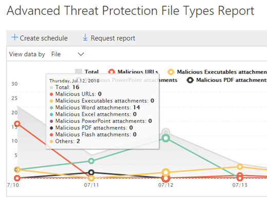

# Visa rapporter för Avancerad hotskydd i Office 365

Om din organisation har [Office 365 Advanced Threat Protection](office-365-atp.md) (ATP) och du har de behörigheter som [krävs](#what-permissions-are-needed-to-view-the-atp-reports)kan du använda flera ATP-rapporter i Security &amp; Compliance Center. (Gå till **instrumentpanelen** **rapporter** \> .)
  

  
ATP-rapporter innehåller följande:
- [Rapport om skydd för hot](#threat-protection-status-report)
- [Rapporten ATP-filtyper](#atp-file-types-report)
- [RAPPORT FÖR ATP-meddelandedisposition](#atp-message-disposition-report)
- antingen [identifieringi realtid eller Explorer](threat-explorer.md) (beroende på om du har Office 365 ATP-abonnemang 1 eller 2)
- ... [och mer](#additional-reports-to-view). 

Läs den här artikeln om du vill få en översikt över ATP-rapporter och hur du använder dem.
  
## Rapport om skydd för hot

Rapporten **Status för skydd för hot** är en enda vy som samlar information om skadligt innehåll och skadlige e-postmeddelanden som har upptäckts och blockerats av Exchange Online [Protection](exchange-online-protection-overview.md) (EOP) och [Office 365 ATP](office-365-atp.md). Den här rapporten är användbar för att visa identifieringar över tid (upp till 90 dagar) och det gör det möjligt för säkerhetsadministratörer att identifiera trender eller avgöra om principer behöver justeras. 

Rapporten ger ett aggregerat antal unika e-postmeddelanden med skadligt innehåll, till exempel filer eller webbadresser (WEBBADRESSER) som blockerades av anti-malware motor, [noll timmars automatisk rensning (ZAP)](zero-hour-auto-purge.md)och ATP-funktioner som [ATP Safe Links](atp-safe-links.md), [ATP Safe Attachments](atp-safe-attachments.md)och [ATP anti-phishing funktioner](atp-anti-phishing.md). 

Filter och uppdelningar av informationen möjliggör mer detaljerade kategoriseringar av informationen i den här rapporten. Specifikt finns det en "bryta ner av" meny som ingår för *e-> Phish* och *E-> Malware visningar*. Det kommer att dela upp data i:

| |  |
|---------|---------|
|Efter identifieringstyp    | Vilken politik bidrog till att fånga dessa hot?         |
|Genom detektionsteknik     | Vilken underliggande Microsoft-teknik fångade hotet?        |
|Efter leveransstatus     | Vad hände med e-postmeddelanden som upptäckts som hot?         |
| | |

> [!TIP]
> Både e-> Phish | Malware vyer har detaljerade uppdelningar för detektionsteknik som visas, med kategorier som *ATP-genererade fil rykte,* *Fil detonation,* *URL detonation,* *Anti-parodi: DMARC misslyckande,* till exempel, till hjälp för att precisera exakt vilken funktion som ledde din organisation att fånga hot.

Dessa vyer ger dig möjlighet att exportera, via ett knappklick (i E-post > Phish, E-post > malware och innehåll > Malware visningar). De aggregerade data som exporteras till datorn kan öppnas i Excel.

Vyerna Översikt och E-postmeddelanden visar information inom några timmar efter bearbetning en timme (efterfrågan åter. högre hastigheter här har varit en tydlig signal)!

> [!NOTE]
> En statusrapport för hotskydd är tillgänglig för kunder som antingen har [Office 365 ATP](office-365-atp.md) eller [Exchange Online Protection](exchange-online-protection-eop.md) (EOP). Informationen som visas i rapporten Status status för hotskydd för ATP-kunder kommer dock sannolikt att innehålla andra data än vad EOP-kunder kan se. Rapporten Statusför hotskydd för ATP-kunder innehåller till exempel information om [skadliga filer som upptäckts i SharePoint Online, OneDrive eller Microsoft Teams](atp-for-spo-odb-and-teams.md). Sådan information är specifik för ATP, så kunder som har EOP men inte ATP kommer inte att se dessa uppgifter i sin hotskyddsstatusrapport.
  
Om du vill visa rapporten Status för hotskydd \> går du till **Rapportinstrumentpanelens** \> **Reports** **hotskyddsstatus**i [säkerhetsefterlevnadscenter &amp; ](https://protection.office.com).
  

  
Om du vill få detaljerad status för en dag håller du muspekaren över diagrammet.
  

  
Som standard visar rapporten Status för hotskydd data för de senaste sju dagarna. Du kan dock välja **Filter** och ändra datumintervallet för att visa data i upp till 90 dagar. (Om du använder en utvärderingsprenumeration kan du vara begränsad till 30 dagars data.)
  

  
Du kan också använda **visa data efter** meny för att ändra vilken information som visas i rapporten. 
  

## Rapport om status för URL-skydd

Den här rapporten baseras på insamlade data och hot har upptäckts per klick (medan de flesta andra e-posthotrelaterade rapporter är per meddelandedata). Den här rapporten är utformad för att visa hot som kommer från hyperlänkar i e-postmeddelanden och dokument, per klick. Det finns två vyer:

|  |  |
|---------|---------|
|Skyddsåtgärd för URL-klick   | Se antalet url:er som blockerats, blockerats men åsidosätts med ett klick av en användare, åsidosätts med ett klick av en användare och tillåten.        |
|URL-klick efter program     | Se det program som url:en klickades på från.        |
|  |  |

I informationstabellen kan du se mer information om klicktid och användarinformation. Tänk slutligen på url-skyddsstatusrapporten visar skyddet från funktionen för ATP-säkra länkar, så endast kunder som har aktiverat ATP-säkra länkar kommer att se data som återspeglas i den här rapporten.

> [!NOTE]
> Detta är en *rapport om skyddstrend,* vilket innebär att data representerar trender i en större datauppsättning. Rapportering är inte tillgänglig i realtid här. För url-klickdata i realtid fortsätter du att använda URL Trace.

## Rapporten ATP-filtyper

Rapporten **ATP-filtyper** visar vilken typ av filer som identifieras som skadliga av [ATP-säkra bilagor](atp-safe-attachments.md).
  
Om du vill visa den här rapporten går du till **Rapporterar** \> **Dashboard** \> **ATP File Types**i [Säkerhetsefterlevnadscenter &amp; ](https://protection.office.com).
  

  
När du hovrar över en viss dag kan du se fördelningen av typer av skadliga filer som har upptäckts av [ATP Safe Attachments](atp-safe-attachments.md) och [ &amp; anti-spam anti-malware skydd i Office 365](anti-spam-and-anti-malware-protection.md).
  

  
## RAPPORT FÖR ATP-meddelandedisposition

Rapporten **ATP-meddelandedisposition** visar de åtgärder som har vidtagits för e-postmeddelanden som har upptäckts ha skadligt innehåll. 
  
Om du vill visa den här rapporten går du till \> **RapportinstrumentpanelenATP-meddelandedisposition** \> **ATP Message Disposition**i [Säkerhetsefterlevnadscenter &amp; ](https://protection.office.com). **Reports**
  

  
När du hovrar över en stapel i diagrammet kan du se vilka åtgärder som har vidtagits för upptäckt e-post för den dagen.
  

  
## Ytterligare rapporter att visa

Utöver de ATP-rapporter som beskrivs i den här artikeln finns flera andra rapporter tillgängliga, enligt beskrivningen i följande tabell:

|Rapport(er)  |Information  |
|---------|---------|
|**Explorer-** eller **realtidsidentifieringar** (Office 365 ATP Plan 2-kunder har Explorer. Office 365 ATP Plan 1-kunder har identifiering i realtid.)| [Threat Explorer (och identifiering i realtid)](threat-explorer.md)       |
|**E-postsäkerhetsrapporter**, till exempel en rapport över de bästa avsändarna och mottagarna, en Spoof Mail-rapport och en rapport om identifiering av skräppost. | [Visa e-postsäkerhetsrapporter &amp; i Säkerhetsefterlevnadscenter](view-email-security-reports.md)        |
|**URL-spårning för ATP-säkra länkar** (Det här är en rapport som du genererar med PowerShell.) Den här rapporten visar resultaten av ÅTGÄRDER FÖR ATP Safe Links under de senaste sju (7) dagarna. |[Hämta cmdlet-cmdlet-referens för get urlTrace](https://docs.microsoft.com/powershell/module/exchange/advanced-threat-protection/get-urltrace) |
|**EOP- och ATP-resultat** (Detta är en anpassad rapport som du genererar med PowerShell). Den här rapporten innehåller information som Domän, Datum, Händelsetyp, Riktning, Åtgärd och Antal meddelanden.  | [Hämta cmdlet-referens för Get-MailTrafficATPReport](https://docs.microsoft.com/powershell/module/exchange/advanced-threat-protection/get-mailtrafficatpreport) |
|**EOP- och ATP-identifieringar** (Det här är en anpassad rapport som du genererar med PowerShell). Den här rapporten innehåller information om skadliga filer eller webbadresser, nätfiskeförsök, personifiering och andra potentiella hot i e-post eller filer.   | [Hämta cmdlet-referens för get-mailDetailATPReport](https://docs.microsoft.com/powershell/module/exchange/advanced-threat-protection/get-maildetailatpreport)        |

  
## Vilka behörigheter krävs för att visa ATP-rapporterna?

För att kunna visa och använda de rapporter som beskrivs i den här artikeln **måste du ha en lämplig roll som tilldelats både administrationscenter för säkerhetsefterlevnad &amp; och administrationscentret för Exchange**.

- För Security &amp; Compliance Center måste du ha en av följande roller tilldelad:
    - Organisationshantering
    - Säkerhetsadministratör (detta kan tilldelas i Administrationscentret[https://aad.portal.azure.com](https://aad.portal.azure.com)för Azure Active Directory ())
    - Säkerhetsoperator (detta kan tilldelas i Azure Active[https://aad.portal.azure.com](https://aad.portal.azure.com)Directory administrationscenter ())
    - Säkerhetsläsare

- För Exchange Online måste du ha en av följande roller som[https://outlook.office365.com/ecp](https://outlook.office365.com/ecp)tilldelats i antingen Administrationscentret för Exchange ( ) eller med PowerShell-cmdlets (se [Exchange Online PowerShell):](https://docs.microsoft.com/powershell/exchange/exchange-online/exchange-online-powershell)
    - Organisationshantering
    - Organisationshantering för endast vy
    - Roll för endast visningsmottagare
    - Efterlevnadshantering

Mer information finns i följande resurser:

- [Permissions in the Office 365 Security &amp; Compliance Center](permissions-in-the-security-and-compliance-center.md)

- [Funktionsbehörigheter i Exchange Online](https://docs.microsoft.com/exchange/permissions-exo/feature-permissions)
   
## Vad händer om rapporterna inte visar data?

Om du inte ser data i dina ATP-rapporter dubbelkontrollerar du att dina principer är korrekt konfigurerade. Din organisation måste ha [ATP Safe Links-principer](set-up-atp-safe-links-policies.md) och [ATP Safe Attachments-principer](set-up-atp-safe-attachments-policies.md) som definierats för att ATP-skyddet ska vara på plats. Se även [skydd mot skräppost och skadlig kod i Office 365](anti-spam-and-anti-malware-protection.md).
  
## Relaterade ämnen

[Rapporter och insikter i Office 365 Security &amp; Compliance Center](reports-and-insights-in-security-and-compliance.md)
  
[Skapa ett schema för en &amp; rapport i Security Compliance Center](create-a-schedule-for-a-report.md)
  
[Konfigurera och hämta en anpassad &amp; rapport i Security Compliance Center](set-up-and-download-a-custom-report.md)

[Behörighet för roller (Azure Active Directory](https://docs.microsoft.com/azure/active-directory/users-groups-roles/directory-assign-admin-roles#role-permissions)
  

