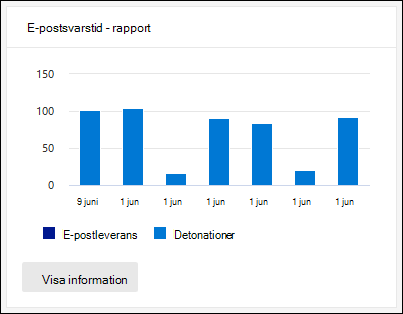

# Visa Defender för Office 365-rapporter i instrumentpanelen Rapporter i Säkerhets- & Efterlevnadscenter

[!INCLUDE [Microsoft 365 Defender rebranding](../includes/microsoft-defender-for-office.md)]

**Gäller för**
- [Microsoft Defender för Office 365 Abonnemang 1 och Abonnemang 2](office-365-atp.md)
- [Microsoft 365 Defender](../mtp/microsoft-threat-protection.md)

Microsoft Defender för Office 365-organisationer (till exempel Microsoft 365 E5-prenumerationer eller Microsoft Defender för Office 365-abonnemang 1 eller Microsoft Defender för Office 365-abonnemang 2-tillägg) innehåller en mängd olika säkerhetsrelaterade rapporter. Om du har nödvändiga [behörigheter kan](#what-permissions-are-needed-to-view-the-defender-for-office-365-reports)du visa de här rapporterna i Säkerhets- och & genom att gå till  \> **instrumentpanelen Rapporter.** Om du vill gå direkt till instrumentpanelen Rapporter öppnar du <https://protection.office.com/insightdashboard> .

## Typrapport för Defender for Office 365

Filtypen **Defender för Office 365** visar vilken typ av filer som identifierats som skadliga av säkra [bifogade filer.](atp-safe-attachments.md)

 I mängdvyn för rapporten kan du filtrera i 90 dagar, medan detaljvyn bara tillåter 10 dagars filtrering.

Om du vill visa rapporten öppnar du [säkerhets- & Efterlevnadscenter,](https://protection.office.com)går till instrumentpanelen Rapporter och väljer Defender för  \>  **Office 365-filtyper.** Om du vill gå direkt till rapporten öppnar du <https://protection.office.com/reportv2?id=ATPFileReport> .

> [!NOTE]
> Informationen i den här rapporten är också tillgänglig i [meddelandedispositionsrapporten i Defender för Office 365.](#defender-for-office-365-message-disposition-report)

### Rapportvyn för filtyperna Defender för Office 365

Följande vyer är tillgängliga:

- **Visa data efter: Fil:** Diagrammet innehåller följande information:

  - **Skadliga bifogade Excel-bilagor**
  - **Skadliga Flash-bilagor**
  - **Skadliga BIFOGADE PDF-filer**
  - **Skadliga PowerPoint-bilagor**
  - **Skadliga URL:er**
  - **Skadliga bifogade Word-filer**
  - **Skadliga körbara bifogade filer**
  - **Andra**

  När du hovrar över en viss dag (datapunkt) kan du se  en uppdelning av typer av skadliga filer som upptäckts av säkra bifogade filer och skydd mot skadlig [programvara i EOP.](anti-malware-protection.md)

  

  Om du **klickar på** Filter kan du ändra rapporten med följande filter:

  - **Startdatum** och **slutdatum**
  - Samma filtypsvärden som visas i diagrammet.

- **Visa data efter: Meddelande:** Diagrammet innehåller följande information:

  - **Blockera åtkomst**
  - **Meddelanden har ersatts**
  - **Meddelanden övervakas**
  - **Ersatt av Dynamisk e-postleverans:** Mer information finns [i principer för dynamisk leverans i principer för säkra bifogade filer.](atp-safe-attachments.md#dynamic-delivery-in-safe-attachments-policies)

  

  Om du **klickar på** Filter kan du ändra rapporten med följande filter:

  - **Startdatum** och **slutdatum**
  - Samma dispositionsvärden för meddelanden som är tillgängliga i diagrammet och de ytterligare meddelanden som **överförs.**

### Detaljtabellvy för filtyper i Defender för Office 365

Om du **klickar på tabellen** Visa information visas en vy i nära realtid av alla klick som har hänt inom organisationen under de senaste 10 dagarna. Vilken information som visas beror på vilket diagram du visade:

- **Visa data efter: Fil:**

  - **Datum**
  - **Mottagaradress**
  - **Avsändarens adress**
  - **Meddelande-ID:** Tillgängligt i **meddelande-ID-sidhuvudet** i meddelandehuvudet och ska vara unikt. Ett exempelvärde är `<08f1e0f6806a47b4ac103961109ae6ef@server.domain>` (observera vinkelparenteserna).
  - **Fil**

  Om du **klickar på** Filter kan du ändra rapporten med följande filter:

  - **Startdatum** och **slutdatum**
  - Samma filtypsvärden som visas i diagrammet.

- **Visa data efter: Meddelande:**

  - **Datum**
  - **Mottagaradress**
  - **Avsändarens adress**
  - **Meddelande-ID**
  - **Fil**
  - **Ämne**

  Om du **klickar på** Filter kan du ändra resultatet med följande filter:

  - **Startdatum** och **slutdatum**
  - Samma dispositionsvärden för meddelanden som är tillgängliga i diagrammet och de ytterligare meddelanden som **överförs.**

Om du vill gå tillbaka till rapportvyn klickar du **på Visa rapport.**

## Rapport om meddelandeborttagning i Office 365

I **rapporten Disposition av ATP-meddelanden** visas de åtgärder som har vidtas för e-postmeddelanden som identifierats ha skadligt innehåll.

Om du vill visa rapporten öppnar du [säkerhets- & Efterlevnadscenter,](https://protection.office.com)går till instrumentpanelen Rapporter och väljer Defender för meddelandedispositionen  \>  i **Office 365.** Om du vill gå direkt till rapporten öppnar du <https://protection.office.com/reportv2?id=ATPMessageReport> .

> [!NOTE]
> Informationen i den här rapporten är också tillgänglig i filtyperna Defender för [Office 365.](#defender-for-office-365-file-types-report)

### Rapportvy för meddelandedispositionsrapporten i Defender för Office 365

Följande vyer är tillgängliga:

- **Visa data efter: Meddelande:** Diagrammet innehåller följande information:

  - **Blockera åtkomst**
  - **Meddelanden har ersatts**
  - **Meddelanden övervakas**
  - **Ersatt av Dynamisk e-postleverans:** Mer information finns [i principer för dynamisk leverans i principer för säkra bifogade filer.](atp-safe-attachments.md#dynamic-delivery-in-safe-attachments-policies)

  

  Om du **klickar på** Filter kan du ändra rapporten med följande filter:

  - **Startdatum** och **slutdatum**
  - Samma dispositionsvärden för meddelanden som är tillgängliga i diagrammet och de ytterligare meddelanden som **överförs.**

- **Visa data efter: Fil:** Diagrammet innehåller följande information:

  - **Skadliga bifogade Excel-bilagor**
  - **Skadliga Flash-bilagor**
  - **Skadliga BIFOGADE PDF-filer**
  - **Skadliga PowerPoint-bilagor**
  - **Skadliga URL:er**
  - **Skadliga bifogade Word-filer**
  - **Skadliga körbara bifogade filer**
  - **Andra**

  När du hovrar över en viss dag (datapunkt) kan du se  en uppdelning av typer av skadliga filer som upptäckts av säkra bifogade filer och skydd mot skadlig [programvara i EOP.](anti-malware-protection.md)

  

  Om du **klickar på** Filter kan du ändra rapporten med följande filter:

  - **Startdatum** och **slutdatum**
  - Samma filtypsvärden som visas i diagrammet.

### Detaljtabellvy för meddelandedispositionsrapporten i Defender för Office 365

Om du **klickar på tabellen** Visa information visas en vy i nära realtid av alla klick som har hänt inom organisationen under de senaste 10 dagarna. Vilken information som visas beror på vilket diagram du visade:

- **Visa data efter: Meddelande:**

  - **Datum**
  - **Mottagaradress**
  - **Avsändarens adress**
  - **Meddelande-ID**
  - **Fil**
  - **Ämne**

  Om du **klickar på** Filter kan du ändra resultatet med följande filter:

  - **Startdatum** och **slutdatum**
  - Samma dispositionsvärden för meddelanden som är tillgängliga i diagrammet och de ytterligare meddelanden som **överförs.**

- **Visa data efter: Fil:**

  - **Datum**
  - **Mottagaradress**
  - **Avsändarens adress**
  - **Meddelande-ID**
  - **Fil**

  Om du **klickar på** Filter kan du ändra rapporten med följande filter:

  - **Startdatum** och **slutdatum**
  - Samma filtypsvärden som visas i diagrammet.

Om du vill gå tillbaka till rapportvyn klickar du **på Visa rapport.**

## E-postsvarstid – rapport

I **rapporten E-postfördröjning** visas en samlad vy av den e-postleverans och den tidsfördröjning som din organisation har haft. E-postleveranstiderna i tjänsten påverkas av ett antal faktorer, och den absoluta leveranstiden i sekunder är ofta inte en bra indikator på ett lyckat resultat eller ett problem. En långsam leveranstid på en dag kan ses som en genomsnittlig leveranstid på en annan dag, eller tvärtom. I **rapporten Mail latency** tries to qualify message delivery based on the statistical data about the observed delivery times of other messages:

- **50:e percentilen**: Det här är mitten för leveranstiden för meddelanden. Du kan betrakta det här värdet som en genomsnittlig leveranstid.
- **90:e percentilen**: Det här anger en lång svarstid för meddelandeleveransen. Endast 10 % av meddelandena tog längre tid än det här värdet att leverera.
- **99:e percentilen:** Det här anger den högsta svarstiden för meddelandeleveransen.

Klientsidan och nätverksfördröjning ingår inte.

Om du vill visa rapporten öppnar du [Säkerhets- & Efterlevnadscenter,](https://protection.office.com)går till **instrumentpanelen** \> **Rapporter** och väljer E-postsvarstidsrapport.  Om du vill gå direkt till rapporten öppnar du <https://protection.office.com/mailLatencyReport?viewid=P50> .

### Rapportvy för rapporten E-postsvarstid

När du öppnar rapporten är den **50:e percentilfliken** markerad som standard.

Som standard innehåller den här vyn ett diagram som är konfigurerat med följande filter:

- **Datum:** De senaste 7 dagarna
- **Meddelandevy:**
  - Detonerade meddelanden

I det här diagrammet visas meddelanden ordnade i följande kategorier:

- **Svarstid för e-postleverans**
- **Detonationssvarstid**

När du hovrar över en kategori i diagrammet kan du se en uppdelning av svarstiden i varje kategori.

Om du **klickar på** Filter i rapportvyn kan du ändra resultatet med följande filter:

- Alla meddelanden
- Meddelanden som innehåller bifogade filer eller URL-adresser

Om du klickar på den **90:e** percentilfliken eller den **99:e** percentilfliken används samma standardfilter från den **50:e** percentilvyn.

### Detaljtabellvy för rapporten E-postsvarstid

Följande information visas i detaljtabellvyn:

- **Datum**
- **Percentiler**
- **Antal meddelanden**
- **Total svarstid**

Ovanstående visar att den genomsnittliga svarstiden för alla meddelanden som levererats och detonerat var **108,033** sekunder den 14 november.

Informationstabellen innehåller samma information på varje flik.

## Statusrapport för hotskydd

Statusrapporten **för skydd** mot hot är en vy som samlar information om skadligt innehåll och skadlig e-post som identifieras och blockeras av [Exchange Online Protection](exchange-online-protection-overview.md) (EOP) och Microsoft Defender för Office 365. Mer information finns i rapporten [om skydd mot hot.](view-email-security-reports.md#threat-protection-status-report)

## Rapport om URL-skydd

Rapporten **om skydd mot URL-hot** innehåller sammanfattnings- och trendvyer för identifierade hot och åtgärder som vidtas på URL-klick som en del av Säkra [länkar.](atp-safe-links.md) Den här rapporten kommer inte att ha klickdata från användare där principen Säkra länkar har markerats med alternativet Spåra **inte användarklick.**

Om du vill visa rapporten öppnar du [Säkerhets- & Efterlevnadscenter,](https://protection.office.com)går till **instrumentpanelen** \> **Rapporter** och väljer **EN URL-skyddsrapport.** Om du vill gå direkt till rapporten öppnar du <https://protection.office.com/reportv2?id=URLProtectionActionReport> .

> [!NOTE]
> Det här är en *trendrapport för skydd,* vilket innebär att data representerar trender i en större datauppsättning. Därför är data i mängdvyn inte tillgängliga i realtid här, men data i detaljtabellvyn är det, så du kan se små avvikelser mellan de två vyerna.

### Rapportvy för rapporten om URL-hot

Rapporten **om skydd mot** webbadressshot har två sammanslagna vyer som uppdateras en gång var fjärde timme och som visar data för de senaste 90 dagarna:

- **Åtgärden URL-klickskydd:** Visar antalet URL-klick som användare i organisationen har klickat på och resultatet av klickning:

  - **Blockerad** (användaren blockerades från att navigera till URL:en)
  - **Blockeras och klickas igenom**
  - **Klickade igenom under genomsökning**

  Ett klick indikerar att användaren har klickat igenom blockeringssidan till den skadliga webbplatsen (administratörer kan inaktivera klicka sig igenom i principer för säkra länkar).

  Om du **klickar på** Filter kan du ändra rapporten med följande filter:

  - **Startdatum** och **slutdatum**
  - De tillgängliga åtgärderna för klickskydd plus värdet **Tillåts** (användaren tilläts att navigera till URL:en).

  

- **URL-klick per** program: Visar antalet URL-klick för program som stöder säkra länkar:

  - **E-postklient**
  - **PowerPoint**
  - **Word**
  - **Excel**
  - **OneNote**
  - **Visio**
  - **Teams**
  - **Annat**

  Om du **klickar på** Filter kan du ändra rapporten med följande filter:

  - **Startdatum** och **slutdatum**
  - De tillgängliga programmen.

### Detaljtabellvy för rapporten om skydd mot URL-hot

Om du **klickar på** tabellen Visa information ger rapporten en nästan realtidsvy över alla klick som har hänt inom organisationen under de senaste 7 dagarna med följande information:

- **Klicka tid**
- **Användare**
- **URL**
- **Åtgärd**
- **Program**

Om du klickar **på Filter** i detaljtabellvyn kan du filtrera efter samma  villkor  som i rapportvyn och även efter Domäner eller Mottagare avgränsade med kommatecken.

> [!NOTE]
> **Domänfiltret** refererar till URL-domänen som visas i rapportresultaten. 

Om du vill gå tillbaka till rapportvyn klickar du **på Visa rapport.**

## Ytterligare rapporter att visa

Utöver rapporterna som beskrivs i den här artikeln finns det flera andra rapporter tillgängliga enligt beskrivningen i följande tabell:

****

|Rapport|Ämne|
|---|---|
|**Utforskaren** (Microsoft Defender för Office 365 abonnemang 2) eller identifieringar i realtid **(Microsoft** Defender för Office 365 abonnemang 1)|[Hotutforskaren (och realtidsidentifieringar)](threat-explorer.md)|
|**Säkerhetsrapporter för** e-post, till exempel rapporten De viktigaste avsändarna och mottagarna, rapporten Spoof Mail och rapporten Om identifiering av skräppost.|[Visa e-postsäkerhetsrapporter i Säkerhets- & Efterlevnadscenter](view-email-security-reports.md)|
|**E-postflödesrapporter,** till exempel vidarebefordransrapporten, statusrapporten E-postflöde och rapporten De viktigaste avsändarna och mottagarna.|[Visa e-postflödesrapporter i Säkerhets- & Efterlevnadscenter](view-mail-flow-reports.md)|
|**URL-spårning för säkra länkar** (endast PowerShell). Resultatet av den här cmdleten visar resultatet av åtgärder för Säkra länkar under de senaste sju dagarna.|[Get-UrlTrace](https://docs.microsoft.com/powershell/module/exchange/get-urltrace)|
|**EOP- och Microsoft Defender-resultat för e-posttrafik för Office 365** (endast PowerShell). Utdata för den här cmdleten innehåller information om domän, datum, händelsetyp, riktning, åtgärd och antal meddelanden.|[Get-MailTrafficATPReport](https://docs.microsoft.com/powershell/module/exchange/get-mailtrafficatpreport)|
|**E-postdetaljrapporter för identifiering av EOP och Defender för Office 365** (endast PowerShell). Utdata från den här cmdleten innehåller information om skadliga filer eller URL:er, nätfiskeförsök, personifiering och andra potentiella hot i e-postmeddelanden och filer.|[Get-MailDetailATPReport](https://docs.microsoft.com/powershell/module/exchange/get-maildetailatpreport)|
|

## Vilka behörigheter krävs för att visa Defender för Office 365-rapporter?

För att kunna visa och använda rapporterna som beskrivs i den här artikeln måste du vara medlem i någon av följande rollgrupper i Säkerhets- och & Efterlevnadscenter:

- **Organisationshantering**
- **Säkerhetsadministratör**
- **Säkerhetsläsare**
- **Global Reader**

Mer information finns i [Behörigheter i Säkerhets- och efterlevnadscentret](permissions-in-the-security-and-compliance-center.md).

**Obs!** Om du lägger till användare till motsvarande Azure Active Directory-roll i administrationscentret för Microsoft  365 får användarna de behörigheter som krävs i säkerhets- och efterlevnadscentret för & och behörigheter för andra funktioner i Microsoft 365. Mer information finns i [Om administratörsroller](../../admin/add-users/about-admin-roles.md).

## Vad händer om rapporterna inte visar data?

Om du inte ser data i Defender för Office 365-rapporterna kontrollerar du att dina principer är korrekt konfigurerade. Organisationen måste ha principer  [för säkra länkar](set-up-atp-safe-links-policies.md) och principer för säkra bifogade filer definierade för att Defender ska kunna använda Office 365-skyddet. Se även [Skydd mot skräppost och skadlig programvara.](anti-spam-and-anti-malware-protection.md)

## Relaterade ämnen

[Smarta rapporter och insikter i Säkerhets- & Efterlevnadscenter](reports-and-insights-in-security-and-compliance.md)

[Rollbehörigheter (Azure Active Directory)](https://docs.microsoft.com/azure/active-directory/users-groups-roles/directory-assign-admin-roles#role-permissions)
